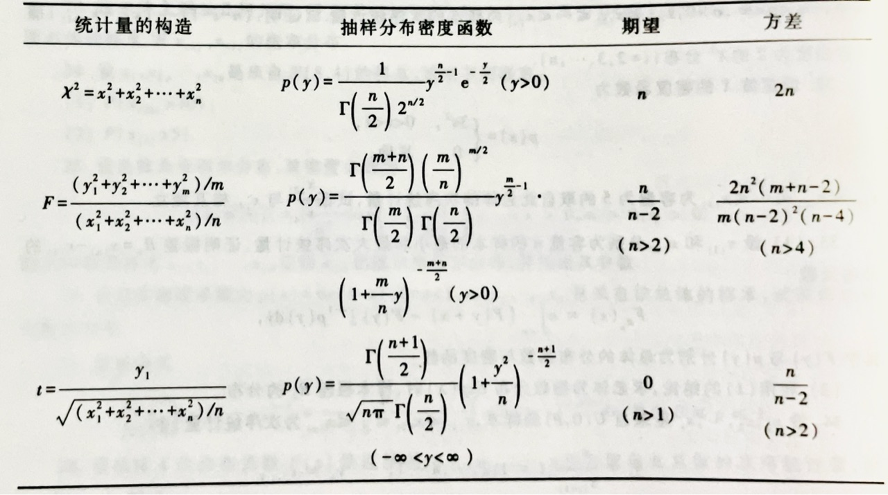
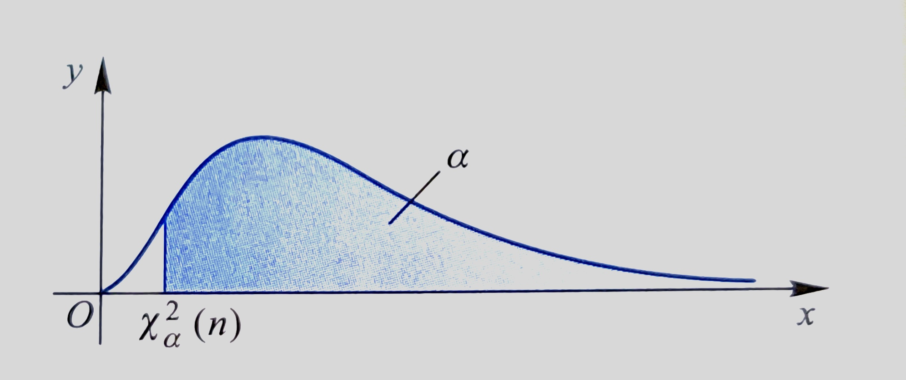
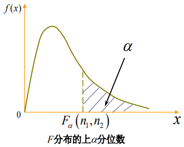

# [6.x] 统计量与抽样分布

## 概念

**总体(Population)** **个体(Individual)** **总体容量** **有限总体(Finite Population)** **无限总体(Infinite Population)** **样本(Sample)**

- 有代表性
- 有独立性

**样本容量** **随机样本(Random Sample)** **简单随机样本(Simple Random Sample)** **样本值 / 观察值** **样本的联合分布函数**：$F(x_1,x_2,...,x_n)=\prod_{i=1}^{n} F(x_i).$

**定义** 设总体$X$是具有分布函数$F(·)$的随机变量，$X_1,X_2,...,X_n$是来自总体$X$的随机样本，若满足：

1. $X_1,X_2,...,X_n$是是相互独立的随机变量；
2. 每一个$X_i$与$X$有相同的分布函数；

则称$X_1,X_2,...,X_n$为取自总体$X$的**简单随机样本**。

---

## 统计量及其分布

**统计量(Statistic)** 设$X_1,X_2,...,X_n$是来自总体$X$的一个样本，$g(X_1,X_2,...,X_n)$是样本$X_1,X_2,...,X_n$的函数，若$g$中**不含未知参数**，则称$g(X_1,X_2,...,X_n)$是一**统计量**。

- 尽管统计量不依赖于未知参数，但是他们的**分布依赖于未知参数**。

如下为几种常见的重要统计量：

1. **样本均值（常作为总体值**$\mu$**的估计）**

$\overline{X}=\frac{1}{n}\sum_{i=1}^{n}X_i$
$E(\overline x)=\mu\;\;,\;\;Var(\overline x)=\sigma^2/n$

   - **性质**：
      1. $\sum_{i=1}^{n}(x_i-\overline{x})=0$；
      2. 数据观测值与样本均值的偏差平方和最小，即在形如$\sum(x_i-c)^2$的函数中，$\sum(x_i-\overline x)^2$最小；
      3. 若总体服从$N(\mu,\sigma^2)$，则$\overline x$的**精确分布**为$N(\mu,\sigma^2/n)$； 
      4. 若总体分布未知或不是正态分布，则当$n$较大时，$\overline x$**近似服从**$N(\mu,\sigma^2/n)$；
2. **样本方差（常作为总体方差**$\sigma^2$**的无偏估计）**

$$
S^2=\frac{1}{n-1}\sum_{i=1}^{n}(X_i-\overline{X})^2=\frac{1}{n-1}(\sum_{i=1}^{n}X_i^2-n\overline{X}^2)
$$

$$
E(S^2)=\sigma^2
$$

   - 对于样本偏差平方和有三个常用的表达式：

$\sum(x_i-\overline x)^2=\sum x_i^2-\frac{(\sum x_i)^2}{n}=\sum x_i^2-n\overline x^2$

1. 样本标准差

$S=\sqrt{S^2}=\sqrt{\frac{1}{n-1}\sum_{i=1}^{n}(X_i-\overline{X})^2}$

4. 样本$k$阶（原点）矩**（常作为总体原点矩**$\mu_k$**的估计）**

$A_k=\frac{1}{n}\sum_{i=1}^{n}X_i^k,\;\;k=1,2,...$

5. 样本$k$阶中心距**（常作为总体中心矩**$\nu_k$**的估计）（**$B_2$**可作为总体方差**$\sigma^2$**的有偏估计）**

$B_k=\frac{1}{n}\sum_{i=1}^{n}(X_i-\overline{X})^k,\;\;k=2,3,...$

- 总体的任意一个未知参数可以有多个不同的估计，因此参数估计不唯一；
- 假设$X_1,X_2,...,X_n$是$X$中抽取的简单随机样本，$\mu_k=E(X^k)$存在，由辛钦大数定律可知：

$A_k=\frac{1}{n}\sum_{i=1}^{n}X_i^k\xrightarrow{P}\mu_k,\;\;k=1,2,...$

---

## 三大抽样分布

统计量的分布成为**抽样分布(Sampling Distribution)**，在使用统计量进行推断时需要知道抽样分布。 

### χ²分布 / 卡方分布

$\chi^2$**分布 / 卡方分布** 设$X_1,X_2,...,X_n$为独立同分布服从$N(0,1)$。记$Y=X_1^2+X_2^2+...+X_n^2$，则称$Y$服从自由度为$n$的$\chi^2$分布，记$Y\sim \chi^2(n)$。 $\chi^2$分布的密度函数为： 

$$
f_{\chi^2}(x)=
\left\{
\begin{aligned}
&\frac{1}{2^\frac{n}{2}\Gamma(\frac{n}{2})}x^{\frac{n}{2}-1}e^{-\frac{x}{2}},&x>0,
\\
&0,&other,
\end{aligned}
\right.
$$

$\chi^2$分布有如下性质：

1. $\chi^2$分布可加：设$Y_1 \sim \chi^2(m),\;Y_2\sim\chi^2(n)$，且两者互相独立，则$Y_1+Y_2\sim \chi^2(m+n)$；
2. $\chi^2$**分布的数学期望与方差：**$E(\chi^2(n))=n,\;Var(\chi^2(n))=2n$**；**
3. $\chi^2$分布分位数：对于给定的正数$\alpha,\;0<\alpha<1$，称满足条件$P\{\chi^2>\chi^2_\alpha(n)\}=\int^{+\infty}_{\chi^2_\alpha(n)}f_{\chi^2}(x)\mathrm{d}x=\alpha$的点$\chi^2_{\alpha}(n)$为$\chi^2(n)$****侧）**$\alpha$**分位数**。

1. 设$X_1,X_2,...,X_n$为来自正态总体$N(\mu,\sigma^2)$的简单随机样本，$\overline{X}$是样本均值，$S^2$是样本方差，则有：
   1. $\overline X$与$S^2$相互独立；
   2. $\overline X\sim  N(\mu,\sigma^2/n)$；
   3. $\frac{\sum_{i=1}^n(X_i-\overline X)^2}{\sigma^2}=\frac{(n-1)S^2}{\sigma^2}\sim \chi^2(n-1)$；

### t 分布 / 学生氏分布

$t$**分布 / 学生氏(Student)分布** 设$X\sim N(0,1),Y\sim\chi^2(n)$，且$X,Y$相互独立，则称随机变量$t=\frac{X}{\sqrt{Y/n}}$服从自由度为$n$的$t$分布，记做$t\sim t(n)$，其密度函数为： 

$$
f_t(x)=\frac{\Gamma[(n+1)/2]}{\sqrt{\pi n}\Gamma(\frac{n}{2})}(1+\frac{x^2}{n})^{-\frac{n+1}{2}},\;\;-\infty<x<+\infty
$$

其中$\Gamma(\alpha)=\int_0^{+\infty}t^{\alpha-1}e^{-t}\mathrm{d}t$，$\Gamma(\alpha+1)=\alpha\Gamma(\alpha)=\alpha!(if\;\alpha\in\Z)$，$\Gamma(0.5)=\sqrt{\pi}$
$t$分布有如下性质：

1. $t$分布的密度函数$f_t(x)$是偶函数，关于$y$轴对称；
2. 由$t$分布的密度函数可以得到：$\lim_{n\to+\infty}f_t(x)=\frac{1}{\sqrt{2\pi}}e^{-{x^2}/{2}}$；
   - 当$n$足够大时，$t$分布近似于标准正态分布$N(0,1)$；
3. $t$分布分位数，对于给定的正数$\alpha,\;\;0<\alpha<1$，称满足条件$P\{t>t_\alpha(n)\}=\int_{t_\alpha(n)}^{+\infty}f_t(x)\mathrm{d}x=\alpha$的点$t_\alpha(n)$为$t(n)$**分布的上（侧）**$\alpha$**分位数**；

1. $t^2\sim F(1,n)$；
- 自由度为$1$的$t$分布就是标准柯西分布，其均值不存在；
- $n>1$时$t$分布的数学期望存在且为$0$；
- $n>2$时$t$分布的方差存在且为$\frac{n}{n-2}$；
- 当自由度比较大时，$t$分布可以用$N(0,1)$分布近似；

推论：

- 设$x_1,x_2,x_3,..,x_n$是来自正态分布$N(\mu,\sigma^2)$的一个样本，$\overline x$和$S^2$分别是该样本的样本均值与样本方差，则有$t=\frac{\overline x-\mu}{S/\sqrt n}\sim t(n-1)$；

### F 分布

$F$**分布** 设$U\sim\chi^2(n_1)$，$V\sim \chi^2(n_2)$，且$U$和$V$相互独立，则称随机变量$F=\frac{U/n_1}{V/n_2}$服从**自由度为**$(n_1,n_2)$**的**$F$**分布**，记$F\sim F(n_1,n_2)$。 其密度函数为
$$
f_F(x)=\frac{
\Gamma(\frac{n_1+n_2}{2})(\frac{n_1}{n_2})^{n_1/2}x^{(n_1/2)-1}
}{
\Gamma(\frac{n_1}{2})\Gamma(\frac{n_2}{2})[1+(n_1x/2)]^{(n_1+n_2)/2}
},\;\;x>0
$$
$F$分布有如下性质：

1. 如果$F\sim F(n_1,n_2)$，则$\frac{1}{F}\sim F(n_2,n_1)$；
2. 如果$X\sim t(n)$，则$X^2\sim F(1,n)$；

---

设$X_1,X_2,...,X_n$为来自正态总体$N(\mu,\sigma^2)$的简单随机样本，$\overline{X}$是样本均值，$S^2$是样本方差，则有：

1. $\frac{(n-1)S^2}{\sigma^2}\sim \chi^2(n-1)$；
2. $\overline{X}$与$S^2$相互独立；
3. $\frac{\overline X - \mu}{S/\sqrt n}\sim t(n-1)$；

设$X_1,X_2,...,X_n$和$Y_1,Y_2,...,Y_n$为来自正态总体$N(\mu_1,\sigma_1^2)$和$N(\mu_2,\sigma_2^2)$的两个相互独立的简单随机样本，$\overline{X},\overline Y$是样本均值，$S_1^2,S_2^2$是样本方差，则有：

1. $\frac{S_1^2/\sigma_1^2}{S_2^2/\sigma^2_2}\sim F(n_1-1,n_2-2)$；
2. 当$\sigma_1^2=\sigma_2^2=\sigma^2$时：

$\frac{
(\overline X - \overline Y) - (\mu_1-\mu_2)
}{
S_\omega\sqrt{\frac{1}{n_1}+\frac{1}{n_2}}
}\sim t(n_1+n_2-2)$
其中$S^2_\omega=\frac{(n_1-1)S_1^2+(n_2-n_1)S^2_2}{n_1+n_2-2}$

