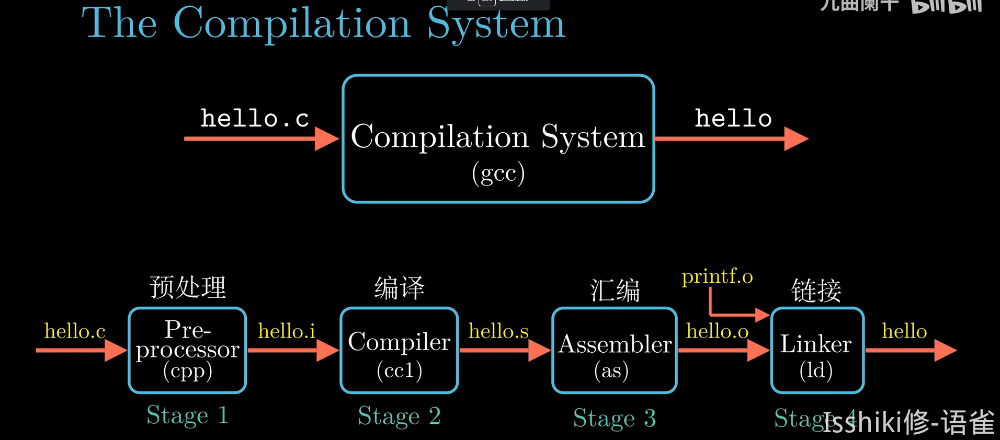
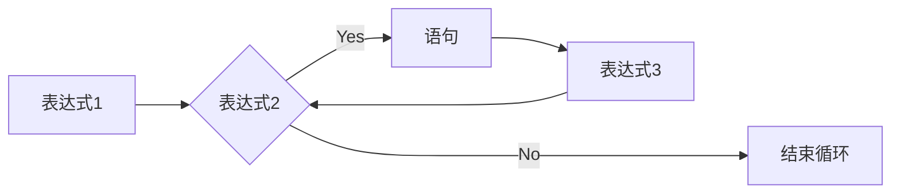

# [大一秋冬] C小程 琐碎知识点整理

> 用来整理C小程的一些细碎知识点。
> 排版没有逻辑，内容也不完整。
> 该文档针对我个人。
> 有一些不在考试范围内的东西，我觉得有意思也丢上去了。

---

## 想不出标题的都放这

- 冯·诺依曼结构：一种将程序指令存储器和数据存储器合并在一起的电脑设计概念结构。    
&nbsp;
- 问你一个`char`型变量的值是多少，要么记得 **引号**，要么记得用 **ASCII**    
&nbsp;
- C语言程序 **易于移植**    
    - 与硬件有关的因素被从语言主体中分离出来    
&nbsp;
- C语言数据类型检查不严格    
- C语言表达式出现二义性    
- C语言不能自动检查数据越界    
&nbsp;
- 数据文件可分为 **文本文件** 和 **二进制文件**    
- 文件的数据流又分为 **字符流** 和 **二进制流**    
&nbsp;
- 下面这些说法都没错，但是我想到了更好的说法所以划了他们    
- ~~`typedef`数组的格式如下：~~
    - ~~`typedef int array[10];`~~
- ~~则下面两个等效：~~
    - ~~int a[10];~~
    - ~~array a;~~
- ~~但系统对他们的类型认定不同，`array`作为一个新的~~`~~type~~`~~存在~~    
&nbsp;
- `typedef`的定义 **类似** 于变量的定义：
    - 「eg」二级指针数组：`typedef int **P[10];` 之后你可以用`P`代表一个 **指向** _一个指向整型的指针_ **的指针** 的 **10维数组** 的 **类型**（10个二级指针）
    - 「eg」一级数组指针：`typedef int (*P)[10];` 之后你可以用`P`代表一个 **指向** _10维数组_ **的指针** 的 **类型**(1个一级指针)
    - 相关内容：[**这里**](#指针相关)
- `typedef`的内容 **一般** 用 **大写单词**(比如FILE)表示这是一个自定义类型，但不用大写也不会出错    
- `break;`可以出现在 **loop** 或者 **switch** 内    
- 要小心藏在参数表里的类型转换    

!!! info ""
    === "题面"
        - 如下程序的输出为___。

        ```c
        #include <stdio.h>
            
        double myFunction(int x){
            return x;
        }

        int main(){
            printf("%lf",myFunction(3.14));
        }
        ```
    === "答案"
        - 3
        - 因为 3.14 在传入 `myFunction(int)` 时发生了类型转换。   


- 字符串数组以`\0`为结束符
- 可以直接用`[]`访问字符串常量的某个字符
    - 如`"ABC"[1] = 'B'`    
&nbsp;

- 小心 **隐藏** 的“0”：
- `int a[3][4] = {{1,2,3},{1,2,3}}`实际上等效于`int a[3][4] = {{1,2,3,0},{1,2,3,0},{0,0,0,0}}`
- `EOF`实际上就是`-1`    
- `NULL`实际上就是`0LL`    
&nbsp;
- 定义函数时省略函数的返回类型，则实际返回类型是`int`
- `puts()`只能输出字符串(输出的东西必须有`\0`否则会挂，意思是说 **数字**、**字符** 都不可以)    

&nbsp;

- 这个报错
```c
#include<stdio.h>

{}

int main(){
}
```

- 这个不报错
```c
#include<stdio.h>

int main(){
	{}
}
```

## 数据类型与字节分配

| 数据类型 | 字节数 | 说明 |
| --- | --- | --- |
| char | 1 |  |
| int | 4 |  |
| short | 2 |  |
| long | 4 |  |
| long long | 8 |  |
| unsigned | 8 |  |
| float | 4 | 有效位数一般在7~8位 |
| double | 8 | 有效位置一般在15~16位 |
| **所有** 指针(64x/32x) | 8/4 |  |
| struct、数组 | - | 内存为所有成员变量的内存和（但是需要考虑对齐） |

- 对于常数：
    - `sizeof(1) = 4`
    - `sizeof(1ll) = 8`
    - `sizeof(1.0) = 8`
    - `sizeof(1.0f) = 4`
- `sizeof()`是一个运算符，不是函数，而且在编译阶段就完成替换。
    - 如果`k`的类型占8B内存，则`sizeof(++k)`在编译阶段被替换为8，而`k`的 **值不会改变**

## 编译、编译预处理



- 编译预处理
    - 编译预处理是 C 语言编译程序的组成部分，用于解释处理 C 语言程序中的预处理指令（特征是以`#`开头，它们不是真正的 C 语句）
    - 编译预处理在正式编译之前
- `#include `
    - 如果后面是`<xxx>`，则将使用 C 语言的 **标准头文件**
    - 如果后面是`"xxx"`，将先到当前工作目录寻找被包含的文件，找不到则去系统`include`目录寻找
- 宏
    - 基本格式 `#define 宏名(宏参) 宏定义字符串`
    - 宏只是纯粹的对代码的字符串替换！
- 条件编译    
```c
#define FLAG 1
#if FLAG
	//程序段1
#else
	//程序段2
#endif
```

- 由于这些都在预编译中处理：
    - `#if`后面的条件只能是宏名
    - 不在条件选择范围内的代码不会被编译    
&nbsp;

- 编译程序 首先要对 源程序 进行 [**词法分析**](https://zh.wikipedia.org/wiki/%E8%AF%8D%E6%B3%95%E5%88%86%E6%9E%90)，然后进行 [**语法分析**](https://zh.wikipedia.org/wiki/%E8%AF%AD%E6%B3%95%E5%88%86%E6%9E%90) 和 **语义分析**
- 编写程序  **->**  编译生成二进制obj目标程序文件  **->**  **与库函数进行连接**，形成exe可执行文件

## 输入输出中的格式控制符

| 控制符 | 说明 |
| --- | --- |
| `%d` | 十进制整型 |
| `%ld` | 十进制长整型 |
| `%md` （$m \in \text{R}$，如`%2d`） | m 为指定的输出字段的宽度。如果数据的位数小于 m，则左端补以空格，若大于 m，则按实际位数输出。<br>如果加`-`表示左对齐；如果加`+`或不加表示右对齐。
如`%-2d`，`%+3d` |
| `%u` | 十进制无符号整型 |
| `%lu` | 十进制无符号长整型 |
| `%c` | 字符 |
| `%f`
`%e` | 对于`scanf`仅表示单精度浮点数<br>对于`printf`与`%lf`等价。不指定字段宽度，由系统自动指定，整数部分全部输出，小数部分输出 6 位，超过 6 位的 **四舍五入** |
| `%.mf`（，如`%.6f`） | 输出实数时 **小数点后** 保留 m 位 |
| `%lf`
`%le` | 对于`scanf`仅表示双精度浮点数<br>对于`printf`与`%f`等价。不指定字段宽度，由系统自动指定，整数部分全部输出，小数部分输出 6 位，超过 6 位的 **四舍五入** |
| `%.mlf`（，如`%.6lf`） | 输出实数时 **小数点后** 保留 m 位 |
| `%p` | 地址 |
| `%s` | 字符串 |
| `%o` | 八进制整型 |
| `%lo` | 八进制长整型 |
| `%x` `%X` `%#x` `%#X` | 十六进制整型 |
| `%lx` `%lX`  | 十六进制长整型 |

## 常见转义字符

| 转义字符 | 意义 | ASCII（Dec） | ASCII（Hex） |
| --- | --- | --- | --- |
| `\b` | 退格(BS) ，将当前位置移到前一列 | 008 | 0x08 |
| `\n` | 换行(LF) ，将当前位置移到下一行开头 | 010 | 0x10 |
| `\r` | 回车(CR) ，将当前位置移到本行开头 | 013 | 0x13 |
| `\t` | 水平制表(HT)  | 009 | 0x09 |
| `\'` | 单引号 | 039 | 0x27 |
| `\"` | 双引号 | 034 | 0x22 |
| `\\` | 反斜杠 | 092 | 0x5C |
| `\ddd`  | 1~3位的八进制整数所代表的ASCII符<br>比如`\041`或者`\41`表示`!` | - | - |
| `\xhh` | 1~2位的十六进制整数所表示的ASCII符<br>比如`\x21`表示`!` | - | - |

## 常用数学函数

- `sqrt(x)` $\sqrt x$，返回`double`类型
- `pow(x,n)` $x^n$，返回`double`类型
- `exp(x)` $e^x$，返回`double`类型
- `fabs(x)` $|x|$，返回`double`类型
- `log(x)` $\ln{x}$，返回`double`类型

## 循环语句
如下的循环语句：
```c
for(表达式1;表达式2;表达式3){
	语句
}
```
其流程应当如下：



## 分支语句

- 分支语句测试数据至少需要几组问题：要注意数据边界也要算一组:
    - 如下分支语句需要设计至少___组测试数据？

=== "题面"

    ```c
    if(x < 60){
        //语句
    }
    ```

=== "答案"

    - 答案：3
    - 解析：`x < 60`  `x = 60`  `x > 60`

- `switch()`语句
    - 除了带引号的字符，`case`后面要打空格，不打空格可能能过编译但是无法正常判断
       - `case 'a'` 有效
       - `case'a'` 有效
       - `casea` 无效
       - `case1` 无效
    - `case`后跟的必须是不重复的常量表达式，不可以是变量参与的表达式
    - 不打`break`会从符合条件的`case`开始一直往下到底或者之后第一个`break`
- 所以`break;`不一定只能出现在循环里    
&nbsp;

- C语言的逻辑运算具有省略特性：当前一个表达式已经能够决定整个表达式的值的时候，不计算后面那个表达式

!!! note ""
    === "题面"
        - 下列程序段结束后`x`和`y`的值分别为___ ， ___。
        
        ```c
        int x = 0 , y = 0;
        if((++x) || (++y)){
            //语句
        }
        ```
    === "答案"
        - 答案：1，0


## 变量的生命周期&作用域

| 静态变量 | 自动变量 | 这一组关系的着重点在内存 **存储位置** 和 **生命周期** 的问题 |
| --- | --- | --- |
| 全局变量 | 局部变量 | 这一组关系的着重点在 **作用域** |


- **局部变量** 的有效使用范围最大程度保证了各部分之间的独立性，降低了各个模块之间的耦合度
- **全局变量** 的 **作用域** 是从 **定义开始到文件结束**

- 一旦在程序中定义了变量，计算机在执行过程中会根据变量的类型分配相应的内存单元供变量保存数据
- 自动变量的定义为：`auto 类型 变量表;` 一般情况下`auto`可以省略
- 自动变量会 **自动分配回收内存**

| 系统存储区 |  |  |  |
| --- | --- | --- | --- |
| 用户存储区 | 程序区（代码内容） |  |  |
|  | 数据区 | 静态存储区 | 全局变量 |
|  |  |  | 静态局部变量 |
|  |  | 动态存储区 | 各个模块下的动态局部变量 |
|  |  |  | 各个模块下的动态局部变量 |
|  |  |  | ... |

- 静态局部变量的内存存储在 **静态存储区** 中，生命周期持续到程序结束，不会在退出函数的时候被回收，下一次使用后会被重新激活
- 与动态全局变量相比，静态全局变量的作用域在当前文件内，动态全局变量在多文件项目中在每一个文件都可以用
- 静态变量的定义为：`static 类型 变量表;`
- 静态变量初值默认为 `0`

## 补码

- 为了方便计算机内的运算，一般用 **补码** 表示数值
- **补码** 的计算：**负数** 除了符号位 **取反加一**
    - 「eg」两个字节存储-17：
       - 原码：`1000``0000` `0001``0001`
       - 反码：`1111``1111` `1110``1110`
       - 补码：`1111``1111` `1110``1111`
- 使用 **补码** 方便的原因是：处理负数和整数相加，实际上是做同余运算：
    - $-3$ = $(1101)_{补码}$
    - $6$ = $(0110)_{补码}$
    - $-3 + 6$ = $(1101)_{补码} + (0110)_{补码}$ =  $(0011)_{补码}$ =  $3$
    - 但是如果把补码都当做是某个数的原码呢？
    - $(1101)_{原码}$ = $13$
    - $(0110)_{原码}$ = $6$ 
    - $(0110)_{原码}$ + $(1101)_{原码}$ = $13+6$ = $19$ = $(0011)_{原码} + (10000)_{原码}$
    - 显然，这里的`10000`溢出了，是不是很像取模？
    - $19 \equiv 3 \mod 16$
    - 而这个`16`就是$2^4$，这个`4`是什么显而易见
    - 所以实际上的逻辑就是：
      1. 利用符号位把`x`个字节的储存字节分成两部分，其中$0 \;\;\sim\;\; (2^{8x-1}-1)$表示非负数的存储范围， $2^{8x-1} \;\;\sim\;\; (2^{8x}-1)$表示负数的存储范围，并通过上面提到的转换方式对负数进行顺序映射
      2. 进行运算时，算上符号位参与运算，算出来的东西整个再作为答案的补码
    - 一言以蔽之，在对16取余——亦即超过4Bits都将溢出 的情况下，“+13”与“-3”是等价的，这就是从取模角度来理解“补码”。
- 而无符号整数就是将原来存储负数的这部分作为整数的延续部分

- 对于各类型整型数据的长度仅有已下要求：
    - $sizeof(\text{short}) \leq sizeof(\text{int}) \leq sizeof(\text{long})$    
&nbsp;

- 整型常量的规则：
    - 前缀：
       - **十进制** 首位数字必须非0   「eg」：`114514`
       - **八进制** 首位数字必须是0   「eg」：`01616210`
       - **十六进制** 开头必须是0x或0X   「eg」：`0xfff`
    - 后缀：（大小写不敏感）
       - L 表示长整型   「eg」：`123456L`
       - LL 表示长长整型   「eg」：`123456LL`
       - U 表示无符号整型   「eg」：`123456U`
       - U和L可以混合使用，不敏感顺序

## 运算

- 算数运算符的几个规则：
    - 整数除法得到整数 **(分子或分母任意一个为浮点数即可自动类型转换后做浮点运算)**
    - **取余** 运算仅对 **整型** 数据使用
    - `+` `-`可做单目运算符表示正负
    - 双目运算符会保证两侧的数据 **类型相同(对于不同的输入数据会进行自动类型转换)**
       - 自动类型转换：
          - 非赋值运算：总是由低向高转换
         
          - 赋值运算：转换为被赋值的变量类型


## 运算符优先级(同级遵循结合方向规律)

如有冲突，请优先参考 [这里](https://zh.cppreference.com/w/c/language/operator_precedence)。

| **优先级** | **运算符** | **名称或含义** | **使用形式** | **结合方向** |
| --- | --- | --- | --- | --- |
| 1 | **[]** | 数组下标 | 数组名[常量表达式] | 左到右 |
|  | **()** | 圆括号 | （表达式）/函数名(形参表) |  |
|  | **.** | 成员选择（对象） | 对象.成员名 |  |
|  | **->** | 成员选择（指针） | 对象指针->成员名 |  |
|  | **++** | 后置自增运算符 | 变量名++ |  |
|  | **--** | 后置自减运算符 | 变量名-- |  |
| 2 | **-** | 负号运算符 | -表达式 | 右到左 |
|  | **(类型)** | 强制类型转换 | (数据类型)表达式 |  |
|  | **++** | 前置自增运算符 | ++变量名 |  |
|  | **--** | 前置自减运算符 | --变量名 |  |
|  | **\*** | 取值运算符 | *指针变量 |  |
|  | **&** | 取地址运算符 | &变量名 |  |
|  | **!** | 逻辑非运算符 | !表达式 |  |
|  | **~** | 按位取反运算符 | ~表达式 |  |
|  | **sizeof()** | 长度运算符 | sizeof(表达式) |  |
| 3 | **/** | 除 | 表达式/表达式 | 左到右 |
|  | **\*** | 乘 | 表达式*表达式 |  |
|  | **%** | 余数（取模） | 整型表达式/整型表达式 |  |
| 4 | **+** | 加 | 表达式+表达式 | 左到右 |
|  | **-** | 减 | 表达式-表达式 |  |
| 5 | **<<** | 左移 | 变量<<表达式 | 左到右 |
|  | **>>** | 右移 | 变量>>表达式 |  |
| 6 | **>** | 大于 | 表达式>表达式 | 左到右 |
|  | **>=** | 大于等于 | 表达式>=表达式 |  |
|  | **<** | 小于 | 表达式<表达式 |  |
|  | **<=** | 小于等于 | 表达式<=表达式 |  |
| 7 | **==** | 等于 | 表达式==表达式 | 左到右 |
|  | **!=** | 不等于 | 表达式!= 表达式 |  |
| 8 | **&** | 按位与 | 表达式&表达式 | 左到右 |
| 9 | **^** | 按位异或 | 表达式^表达式 | 左到右 |
| 10 | **&#124;** | 按位或 | 表达式&#124;表达式 | 左到右 |
| 11 | **&&** | 逻辑与 | 表达式&&表达式 | 左到右 |
| 12 | **&#124;&#124;** | 逻辑或 | 表达式&#124;&#124;表达式 | 左到右 |
| 13 | **?:** | 条件运算符 | 表达式1? 表达式2: 表达式3 | 右到左 |
| 14 | **=** | 赋值运算符 | 变量=表达式 | 右到左 |
|  | **/=** | 除后赋值 | 变量/=表达式 |  |
|  | **\*=** | 乘后赋值 | 变量*=表达式 |  |
|  | **%=** | 取模后赋值 | 变量%=表达式 |  |
|  | **+=** | 加后赋值 | 变量+=表达式 |  |
|  | **-=** | 减后赋值 | 变量-=表达式 |  |
|  | **<<=** | 左移后赋值 | 变量<<=表达式 |  |
|  | **>>=** | 右移后赋值 | 变量>>=表达式 |  |
|  | **&=** | 按位与后赋值 | 变量&=表达式 |  |
|  | **^=** | 按位异或后赋值 | 变量^=表达式 |  |
|  | **&#124;=** | 按位或后赋值 | 变量&#124;=表达式 |  |
| 15 | **,** | 逗号运算符 | 表达式,表达式,… | **左到右** |


## 指针相关

- C语言规定，数组名表示该数组所分配连续内存空间中第一个单元的地址，即 **首地址**
- 二维数组的内存存放仍然采取顺序存放，即数组`a[3][2]`中`a[1][1]`的地址与`a[2][0]`相邻
- 二维数组申请时如果初始化可以省略行长度，如`a[][3] = {1,2,3,4,5,6,7}`
- 对于二维数组`a[x][y]`：（x,y是两个常数）
    - `&a`表示数组地址，`&a+1`表示的数组末尾后的地址    
        - 即：`&a+1` = (`&a`) + $1\times x\times y\times sizeof(\text{element})$
    - `a`或者`&a[0]`表示数组首行地址，`a+1`表示数组下一行地址
        - 即：`a+1` =  (`a`) + $1\times y\times sizeof(\text{element})$
`a`实际上是一个`x`维 **数组的指针**，该数组的 **元素** 为若干`y` **维数组**
    - `&a[0][0]`或者`a[0]`表示数组首元素地址，也叫列地址，`&a[0][0]+1`表示数组下一元素地址
        - 即：`&a[0][0]+1` =  (`&a[0][0]`) + $sizeof(\text{element})$
    - 但上面几个指针的 **值** 都一样
    - `a[i][j]`等效于`*( *(a+i) + j )`
- `int *p[5]`定义了一个size为5的整型 **指针的数组** (这里有五个指针)
- `int (*p)[5]`定义了一个size为5的 **数组的指针** (这里只有一个指针)

- 给指针赋值的办法：
    - `p = &x;`
    - `p = 0;`
    - `p = NULL;`
    - `p = (int *)1732;`
- 指针运算：
    - `*p+1;` `++*p;`的操作对象都是`p`指向的 **元素值**
    - `*p++;`的操作对象则是 **指针本身**，含义是指向下一个地址
    - **当出现上述语句参与复杂表达式时，`*p++`会在输出`*p`后再指向下一个地址**

- 可以通过将一个 **字符串常量** 赋值给一个指针的方式来给该字符串分配地址
    - 即例如`char *p;   p = "awa";`是合理的
- `*strcpy(char *to,char *from)`函数的作用是，把 **字符数组** `from[]`复制到`to[]`中并返回`to[]`
- `*strcat(char *to,char *from)`函数的作用是，把 **字符数组** `from[]`添加到`to[]`末尾并返回`to[]`
    - 补充：所谓的添加，就是用`from[]`去替换`to[]`第一个`\0`之后的元素
- `strcmp(char *a,char *b)`函数的作用是，比较 **字符数组** `a[]`和`b[]`在`\0`前的内容是否等价
    - 如果等价 返回0
    - 如果a<b 返回-1
    - 如果a>b 返回1
- `strlen(char *s)`函数的作用是，返回 **字符数组** `s[]`在`\0`前的元素个数

- 关于指针和结构体的关系，只需要记住 取值符`*` 的优先级 **低于** 成员访问符`.` 的优先级

- `void *malloc(size_t size)`申请`size`大小的内存，以字节为单位，返回一个指向这个内存的指针
- `void free(void *ptr)`释放指针`ptr`所指的内存

- 对于返回指针的函数，不能返回在函数内定义的 **局部变量** 的指针

- 函数指针的定义：`类型名(*变量名)(参数类型表)`
    - 「eg」`int(*fun)(int,int)`

丢一个xxjj的文章在这里&nbsp;&nbsp;[点击跳转](https://www.yuque.com/xianyuxuan/coding/apd2_7?view=doc_embed&inner=p5eZs){ .md-button .md-button--primary }

- `FILE *fp;`申请了一个文件指针


## 命令行参数

- `main()`可以有两个参数：
    - `main(int argc,char *argv[])`
    - `argc`表示命令行参数数量
    - `argv[]`指向各个命令行参数
       - `argv[0]`指向命令
       - `argv[1,]`指向参数 
    - 「eg」命令行输入`./code.exe hello world`
       - 在程序中：
       - `argc = 3`
       - `*argv[] = {"./code.exe\0","hello\0","world\0"}`


## 文件操作

- `FILE *fp;`申请一个文件指针
- `fp = fopen("文件名","使用方式");`链接指针`fp`到文件并指定模式


| 文本文件 |  | 二进制文件 |  |
| --- | --- | --- | --- |
| **使用方式** | **含义** | **使用方式** | **含义** |
| "r" | 打开 & 只读 | "rb" | 打开 & 只读 |
| "w" | 新建(清空) & 只写 | "wb" | 新建 & 只写 |
| "a" | 打开 & 追加 | "ab" | 打开 & 追加 |
| "r+" | 打开 & 读写 | "rb+" | 打开 & 读写 |
| "w+" | 新建(清空) & 读写 | "wb+" | 新建 & 读写 |
| "a+" | 打开 & 读 & 追加 | "ab+" | 打开 & 读 & 追加 |
| 说明 | 使用`"w"`/`"w+"`时，文件内容会被覆盖（因为清空后再写入） |  |  |
|  | 使用`"a"`/`"a+"`时，输入内容会写在文件内容后面 |  |  |

- 输入文件名时可以写路径，路径中要使用`\\`来区分层级
- `fprintf(fp,"格式字符串",变量表);`写入数据到`fp`指向的文件，后两个参数的格式和`printf()`一样
- `fclose()`关闭文件并刷新缓存区
    - 顺利执行了文件关闭操作时，`fclose()`函数的返回值是`0`，否则返回`EOF`
- `rewind(fp)`让`fp`返回`fp`所指的文件的开头地址
- `rtell(fp)`让`fp`返回`fp`的当前位置(`long int`类型，从`0`~`len`)，成功返回当前值(一开始是0，每向后移动一次+1)，否则返回`-1L`
- `fseek(FILE *fp,"偏移量","起始位置")`将`fp`从`"起始位置"`开始向后移动`"偏移量"`
    - 可选的`"起始位置"`：
       - `SEEK_SET`文件开头
       - `SEEK_CUR`当前位置
       - `SEEK_END`文件末尾
    - 「eg」移动指针`fp`到文件末尾：`fseek(fp,0L,SEEK_END);`
- `feof(fp)`如果`fp`到达了`EOF`，返回非零值，否则返回`0`
- `fflush(fp)`刷新`fp`的缓冲区，成功返回`0`，否则返回`EOF`
- `fgets((char*)str,limt,fp)`从`fp`读入一行的`limit-1`个字符并存入`str`中，并在末尾加`\0`，然后返回读入的内容(如果没读完`limit-1`个字符就遇到了行末就到此为止)
- `fputc(ch,fp)`在`fp`中写入单个字符`ch`，成功返回`ch`，否则返回`EOF`
- `fgetc(fp)`获取下一个字符(如果到达`EOF`就读入了`-1`，参考[这里](#想不出标题的都放这))

- C程序对文件待处理采用内存缓冲文件系统的方式进行
- 使用缓冲文件系统可以大大提高文件操作速度
- 文件保存在磁盘上，磁盘数据的组织方式按扇区进行，规定 **每个扇区大小为512B**
- 一般微型计算机中的C语言系统也将缓冲区大小定为512B
- 进行数据写入工作时:
    - 把数据写入文件缓冲区
    - 写满512B以后，OS自动把数据写入磁盘的一个扇区，然后清空文件缓冲区
    - 重复上述行为
- 文件打开的实质是把磁盘文件和文件缓冲区对应起来，具体流程如下;
   1. 在磁盘中找到指定文件
   2. 在内存中分配保存一个FILE类型结构的单元（16B）
   3. 在内存中分配文件缓冲区单元（512B）
   4. 返回FILE的结构地址

- `FILE`本质上是一个结构体类型，定义如下：
```c
typedef struct{
	short            level;       /*缓冲区使用量*/
    unsigned         flags;       /*文件状态标志*/
    char             fd;          /*文件描述符*/
    short            bsize;       /*缓冲区大小*/
    unsigned char    *buffer;     /*文件缓冲区首地址*/
    unsigned char    *curp;       /*指向文件缓冲区的工作指针*/
    unsigned char    hold;        /*其他信息*/
    unsigned         istemp;
    short            token;
} FILE;
```

---

## 其他
贴一些其他学长的文章：
    
- [https://blog.zhanghai.me/c-exam-notes/](https://blog.zhanghai.me/c-exam-notes/)
- [https://blog.yzsun.me/c-traps-and-pitfalls/](https://blog.yzsun.me/c-traps-and-pitfalls/)
    
