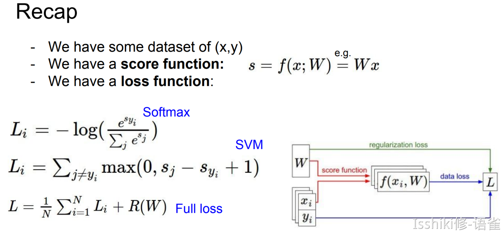
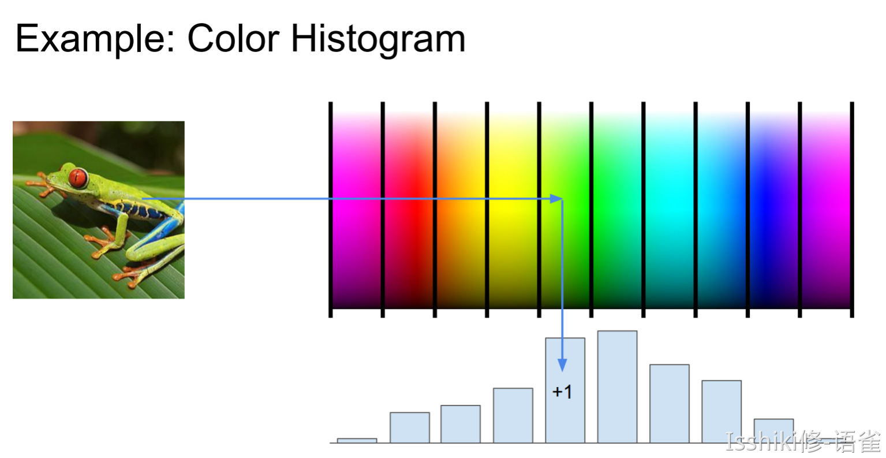
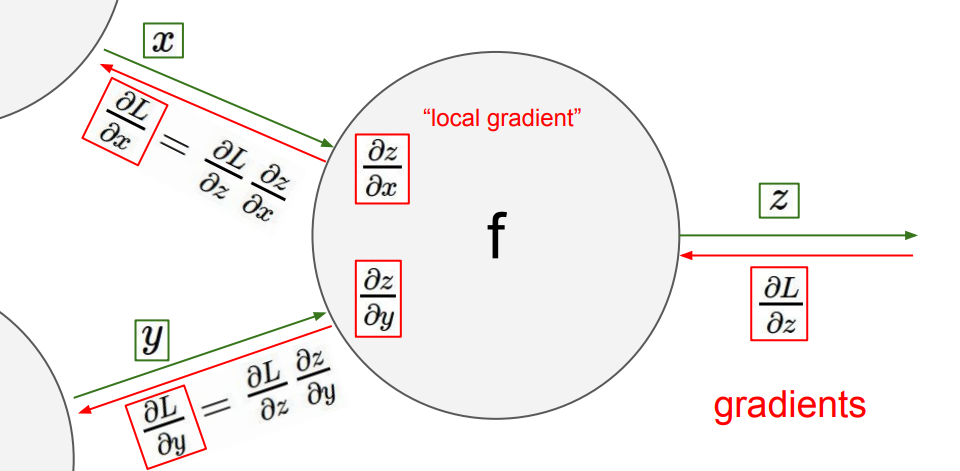
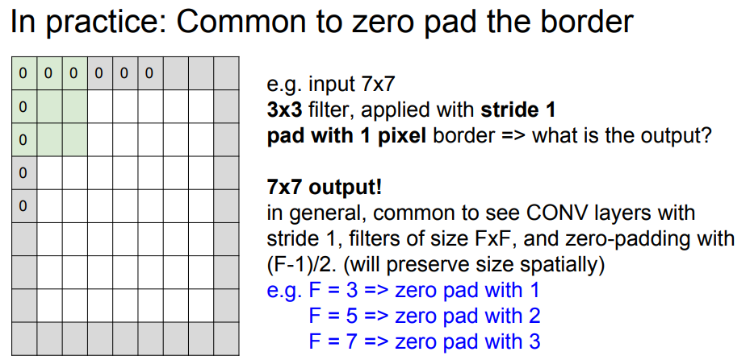
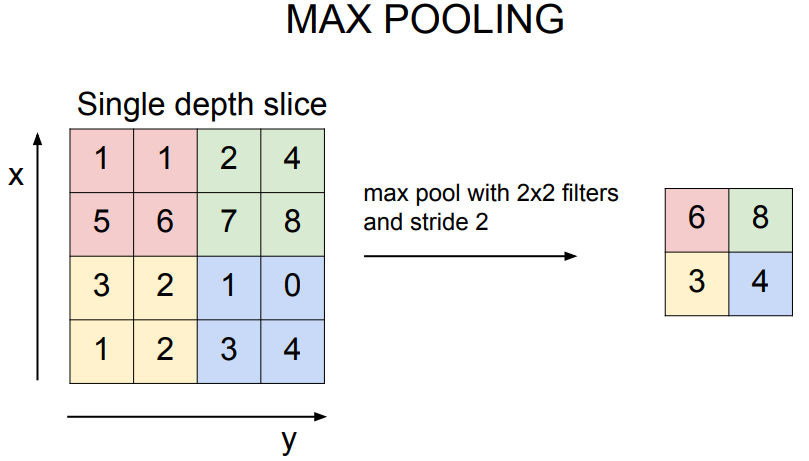
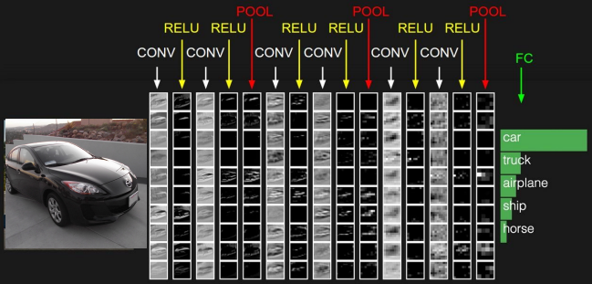

# [大一暑假] Deep Learning for Computer Vision | CS231N

???+ summary "课程介绍"
    - 因为我只能找到 17 年的视频，所以是跟着 17 年的版本学。
    
    **Course Website**: [🔗](http://cs231n.stanford.edu/)
    
    **Course Video**: [🔗](https://www.youtube.com/playlist?list=PL3FW7Lu3i5JvHM8ljYj-zLfQRF3EO8sYv)
    
    **Course Description**
    
    - Computer Vision has become ubiquitous in our society, with applications in search, image understanding, apps, mapping, medicine, drones, and self-driving cars. Core to many of these applications are visual recognition tasks such as image classification, localization and detection. Recent developments in neural network (aka “deep learning”) approaches have greatly advanced the performance of these state-of-the-art visual recognition systems. This course is a deep dive into the details of deep learning architectures with a focus on learning end-to-end models for these tasks, particularly image classification. During the 10-week course, students will learn to implement and train their own neural networks and gain a detailed understanding of cutting-edge research in computer vision. Additionally, the final assignment will give them the opportunity to train and apply multi-million parameter networks on real-world vision problems of their choice. Through multiple hands-on assignments and the final course project, students will acquire the toolset for setting up deep learning tasks and practical engineering tricks for training and fine-tuning deep neural networks.
  
    **Assignments**

    - Assignment 1: [🔗](https://cs231n.github.io/assignments2022/assignment1/)
    - Assignment 2: [🔗](https://cs231n.github.io/assignments2022/assignment2/)
    - Assignment 3: [🔗](https://cs231n.github.io/assignments2022/assignment3/)

??? note "参考资料"
    - 学长笔记：[🔗](https://github.com/Zhang-Each/Awesome-CS-Course-Learning-Notes/tree/master/Stanford-CS231N-NeuralNetwork%26DL)

## Lecture 1: Introduction to Convolutional Neural Networks for Visual Recognition

!!! note ""
    - Video: [🔗](https://www.youtube.com/watch?v=vT1JzLTH4G4&list=PL3FW7Lu3i5JvHM8ljYj-zLfQRF3EO8sYv) 
    - Slides: [🔗](http://cs231n.stanford.edu/slides/2017/cs231n_2017_lecture1.pdf) 


- 一些早期的关于 CV 的思考


- 早期对如何表示物体，超越「Block World」的表示方法

<figure markdown>

其核心思想是将复杂的视觉信息简化为简单对象的组合。
</figure>

人们意识到直接识别物体比较困难，于是想到了 **分割图形(image segmentation)** ——即先做将像素分组：


- 启发：视觉识别的重点可以从识别对象的一些具有识别力和不易变化的部分开始


~~有端联想 FDS 的 Voting Tree~~

- 总的而言 **对象识别** 是 CV 领域的一个重要话题
- 该课程重点为 **卷积神经网络(Convolutional Neural Network / CNN)**
- 具体着眼点为 **图像分类问题(image classification)**
- 也将涉及 **对象检测(object detection)**、**图像字幕(image captioning)** 等问题

## Lecture 2: Image Classification Pipeline

!!! note ""
    - Video: [🔗](https://www.youtube.com/watch?v=OoUX-nOEjG0&list=PL3FW7Lu3i5JvHM8ljYj-zLfQRF3EO8sYv&index=2) 
    - Slides: [🔗](http://cs231n.stanford.edu/slides/2017/cs231n_2017_lecture2.pdf) 
    - CIFAR-10 & CIFAR-100: [🔗](https://www.cs.toronto.edu/~kriz/cifar.html) 
    - **前置**：Python Numpy Tutorial: [🔗](https://cs231n.github.io/python-numpy-tutorial/)

- **语义鸿沟(semantic gap)**

### Data-Driven Approach

1. Collect a dataset of images and labels;
2. Use Machine Learning to train a classifier;
3. Evaluate the classifier on new images;
- 得到的模型有两个核心 API：一个用于 **训练(train)**，一个用于 **预测(predict)**。
- 一般情况下，我们不介意训练时间长，但希望预测效率高。

> CIFAR-10 & CIFAR-100: [🔗](https://www.cs.toronto.edu/~kriz/cifar.html) 

<figure markdown>

**Distance Metric** to compare images


> 我们将分类问题看作在“空间”中的染色问题，点表示训练数据，其颜色表示其被标记的分类；而画板中其他部分的颜色则表示当点落在这个位置时候会被分类为哪一种。


> 中间“黄色部分”这种孤立的小岛在实际对数据进行预测工作时可能不是很好。


> 这些部分可能有噪声或是虚假的。             

</figure>

=== "**L1 (Manhattan) distance**:  _(stupid in most cases)_"
    !!! info ""
        - $d_1(I_1,I_2)=\sum_{p}|I_1^{p}-I_2^{p}|$

        <center>  </center>
        
        - 如果图像旋转，预测结果会发生改变。

=== "**L2 (Euclidean ) distance**:  _(better by comparison)_"
    !!! info ""
        - $d_2(I_1,I_2)=\sum_{p}\sqrt{(I_1^p-I_2^p)^2}$

        <center> </center>

---

**K-Nearest Neighbors**: [🔗](https://zh.wikipedia.org/wiki/K-%E8%BF%91%E9%82%BB%E7%AE%97%E6%B3%95)

> _Interactive Demo_: [🔗](http://vision.stanford.edu/teaching/cs231n-demos/knn/)

Instead of copying label from nearest neighbor, take **majority vote** from K closest points.


> 例如，K=1 时中间的黄色区域由于附近都是绿点，所以在 K 增长的时候绿色在计算中的权重变大，所以最后被标记为绿色。s

- _当然，这种通过比较“距离”的分类方案并不仅限于图片等，对于任何需要分类的数据，例如文本，只要能定义能够量化的“距离”以及一系列相应的规则，就能使用这种方法来进行分类。_
- 然而，**K-临近算法** 在图像分类上几乎不怎么使用，主要是因为它实际使用起来，<u>预测效率较低</u>；且<u>“距离度量”并不非常适合图像处理</u>_（它无法完整描述图像上的距离信息或图像之间的差异）_；此外它还有一个比较严重的问题：**维数灾难(curse of dimensionality)** [🔗](https://zh.wikipedia.org/wiki/%E7%BB%B4%E6%95%B0%E7%81%BE%E9%9A%BE) _（因为只有训练样本足够密集，K-临近算法才能正常运行）_。

---

### Hyperparameters

- Choices about the algorithm that we **set rather than learn**.

- eg: best **k** to use; best **distance** to use (L1/L2);

**Setting Hyperparameters (调参)**


> 即，我们需要确保足够的训练集，并通过验证集进行调参，并在一切都完成以后才使用测试集来验证模型的准确度。


---

### Linear Classification

Parametric Approach

$$
f(x,W)=Wx+b
$$


> 这里的 10 numbers 表示的是 CIFAR-10 中的 10 个类别对应的得分。

- 即，我们构造一个函数，输入包含图像数据 $x$ 和权重参数 $W$，满足其计算结果为各个类别的预测得分
- 最终得到一个模版，它将尝试性地适应该类里尽可能多的样本


> 如果将高维空间的情况映射到平面的几何角度来理解，就好像在划一道道直线来进行划分。

- 从这种角度来理解就很容易发现，单一的线性分类具有局限性，例如对于多模态的数据，使用单一的线性分类可能会比较吃力。

## Lecture 3: Loss Functions and Optimization

!!! note ""
    - Video: [🔗](https://www.youtube.com/watch?v=h7iBpEHGVNc&list=PL3FW7Lu3i5JvHM8ljYj-zLfQRF3EO8sYv&index=3) 
    - Slides: [🔗](http://cs231n.stanford.edu/slides/2017/cs231n_2017_lecture3.pdf) 

- Linear classifier is an example of parametric classifier.
- 我们可以这样理解 Linear Classifation 中的 $W$：矩阵中的每一个参数表示了每一个像素点(单个颜色通道)对于识别某个类的贡献权重。

- A loss function that quantifies our unhappiness with the scores across the training data, tells how good our current classifier is. 
- Given a dataset of examples $\{(x_1,y_i)\}_{i=1}^N$, where $x_i$ is image and $y_i$ is label. And loss over the dataset is a sum of loss over examples: $L = \frac{1}{N}\sum L_i(f(xi,W),y_i)$.
- Loss function 是用来度量 $W$ 的合适程度的，我们通过寻找在 $W$ 空间中损失函数取最值时的 $W$ 来找到我们认为最合适的 $W$。

### Multi-class SVM Loss

如何理解那张图？(hinge loss?)

Let $s = f(x_i,W)$, then SVM loss is:

$$
L_i = \sum_{j \not = y_i } \left\{
    \begin{align*}
        &0              &\text{if } s_{y_i} \geq s_j + 1\\
        &s_j-s_{y_i}+1  &\text{otherwise}
    \end{align*}
\right. = \sum_{j \not = y_i } \text{max}(0,s_j-s_{y_i}+1)
$$

- 也就是说，对于某一个样本，它实际类别对应的得分如果远大于（我们需要一个边界 ，就是上图中的$+1$）某个其他类别的得分，那么该“其他类别”对损失函数的贡献即为$0$；反之，如果并没有远大于其他某个类别的得分，则需要将这个偏差作为对损失函数的贡献。


```python
def L_i_Vectorized(x, y, W):
    scores = W.dot(x)
    margins = np.maximum(0, scores - scores[y] + 1)
    margins[y] = 0
    loss_i = np.sum(margins)
    return loss_i
```

- Overview

$$
f(x,W) = Wx\\
L = \frac{1}{N}\sum_{i=1}^{n}\sum_{j\not = y_i}\text{max}(0,f(x;W)_j-f(x_i;W)_{y_i}+1)
$$


- However, for that we only calculate a loss in terms of the data, some strange things like **overfitting** will happen.


- 蓝点为模型训练数据，绿色的为验证或者实际数据等。
- 蓝色的为过拟合后模型训练出来的预测趋势，他们完全符合训练模型的数据，但是可以发现，绿色的线条才是实际的我们希望得到的趋势。
- 这种预测结果过度拟合了训练数据的行为及为过拟合。

To solve it, we use **regularization**.


> The regularization term.


> Occam's Razor

- The regularization term encourages the model to somehow pick a simpler $W$ depending on the dask and the model.

So your standard loss function usually has two terms, a data loss and a regularization loss, and there's a **hyperparameter**(mentioned already in L2) here, lambda, which trades off between the two.

### Regularization

There are many regularizations used in practice, and the most common one is probably **L2 regularization** or **weight decay**. 

In common use:

- L2 regularization: $R(W) = \sum_{k}\sum_lW_{k,l}^2$;
- L1 regularization: $R(W) = \sum_k\sum_l |W_{k,l}|$;
- Elastic net (L1+L2): $R(W) = \sum_k\sum_l (\beta W_{k,l}^2+|W_{k,l}|)$;
- Max norm regularization
- Dropout
- Fancier: Batch normalization, stochastic depth...

The whole idea of regularization is just any thing that you do to your model, that sort of penalizes somehow the complexity of the model, rather than explicitly trying to fit the training data.
Each regularization has its own feature, you should choose them depends on the problems.

### Softmax Classifier (Multinomial Logistic Regression) 

- It normalizes the scores to a probability distribution.
   - Then we just want the probablity of the true class is high and as close to one.
- scores = unnormalized log probabilities of the classes
-  $P(Y=k|X=x_i)=\frac{e^{s_k}}{\sum_j e^{s_j}}\;,\;\;where\;s=f(x_i;W)$;
- That is $L_i=-\log P(Y=y_i|X=x_i)=-\log(\frac{e^{s_k}}{\sum_j e^{s_j}})$;


> eg for Softmax Classifier.


> Compare the two.


- 在实际使用中，SVM 在保证真实标签对应的得分高于其他得分一定量后就接受了，即存在一个明确的突变标准；而对于 Softmax 来说，它会在这个过程中不断将正确标签对应的概率向$1$逼近，不断优化自己。



### Optimization

- Strategy #1: A first _very bad _idea solution: Random search
- Strategy #2: **Gradient Descent** / Follow the **slope**(gradient$\nabla$)
   - Always use analytic gradient, but check implementation with numerical gradient. This is called a **gradient check.**

```python
## Vanilla Gradient Descent

while True:
    weights_grad = evaluate_gradient(loss_fun, data, weight)
    weights += - step_size * weights_grad ## perform parameter update
```
`step_size` is a **hyperparameter** here, it's also called a **learning rate** sometimes.
**Stochastic Gradient Descent (SGD)**
- The basic Gradient Descent will be messy when $N$ is large!
- So we need to start with approximate sum using a **minibatch** of examples.
   - 32 / 64 / 128 common

```python
## Vanilla Gradient Descent

while True:
    data_batch = sample_training_data(data, 256) ## sample 256 examples
    weights_grad = evaluate_gradient(loss_fun, data_batch, weight)
    weights += - step_size * weights_grad ## perform parameter update
```

- **Online Demo**: [🔗](http://vision.stanford.edu/teching/cs231n-demos/linear-classify/)

### Aside: Image Features





---

## Lecture 4: Introduction to Neural Networks

!!! note ""
    - Video: [🔗](https://www.youtube.com/watch?v=d14TUNcbn1k&list=PL3FW7Lu3i5JvHM8ljYj-zLfQRF3EO8sYv&index=4) 
    - Slides: [🔗](http://cs231n.stanford.edu/slides/2017/cs231n_2017_lecture4.pdf) 

### Computational graphs


> eg. for the linear classifier.

### Backpropagation

通过将算式写成这种“节点图”的形式，可以进一步让我们看清计算过程并方便我们计算梯度。具体来说，例如 $f(x,y,z)=(x+y)z$，将其写成节点图如下，并计算所需要的参数。


然后我们从图的末端开始计算，得到这些节点数据：

$\left\{
\begin{aligned}
&\frac{\partial{f}}{\partial{f}}=1,\\
&\frac{\partial{f}}{\partial{z}}=q=3,\\
&\frac{\partial{f}}{\partial{q}}=z=-4,\\
&\frac{\partial{f}}{\partial{x}}=\frac{\partial{f}}{\partial{q}}\frac{\partial{q}}{\partial{x}}=-4,\\
&\frac{\partial{f}}{\partial{y}}=\frac{\partial{f}}{\partial{q}}\frac{\partial{q}}{\partial{y}}=-4
\end{aligned}
\right.$



> backprop (red lines)

可以发现，我们在计算过程中只需要将“相邻”梯度乘以"local gradient"即可计算出所需要的新的"local gradient"。而只需要再沿着路径再将所有的"local gradient"累乘起来，就能得到每一个变量关于表达式的梯度。


特别的，由于节点是我们认为定义的，而且该方法所依赖“链式法则”也允许函数的自由组合，所以我们可以人为“合并/分割”一些节点，例如在上面那个例子中，我们可以将最后四个节点合并为一个"sigmoid function"(i.e. $\frac{1}{1+e^{-x}}$)。


### Patterns in backward flow


> 另外一种理解算符在计算图中的作用的思路。

可以发现，`max()` 运算在梯度传递过程中只起到路由器的作用，也就是说将其传递到较大的那个变量那一侧，但不改变梯度的值；而对于较小的那个变量，梯度传递被阻断，目标变量的梯度为 $0$。

将这个流程迁移到神经网络上，我们只需要将这些数字变为 Jacobian matrix 即可。


- Always check: The **gradient** with respect to a variable should have the **same shape** as the variable.
   - Because each element of your gradient is **quantifying** **how much** that element is **contributing** to your final output.

在具体实现中，我们一般会实现一个 `forward()` 用于计算函数的输出，以及一个 `backward()` 用于按照上面提到的方法计算梯度。


!!! summary "Summary"
    - Neural nets will be very large: impractical to write down gradient formula by hand for all parameters.
    - **Backpropagation** = recursive application of the chain rule along a computational graph to compute the gradients of all inputs/parameters/intermediates.
    - Implementations maintain a graph structure, where the nodes implement the `forward()` / `backward()` API.
       - **Forward**: compute **result** of an operation and save any intermediates needed for gradient computation in memory.
       - **Backward**: apply the chain rule to compute the **gradient **of the loss function with respect to the inputs.

### Neural Networks


通过函数叠加的方式来实现神经网络。


> 与生物神经的一个类比


!!! summary "Summary"
    - We arrange neurons into **fully-connected layers**.
    - The **abstraction** of a **layer** has the nice property that it allows us to use efficient vectorized code (e.g. matrix multiplies).
    - Neural networks are not really neural.

## Lecture 5: Convolutional Neural Networks

!!! note ""
    - Video: [🔗](https://www.youtube.com/watch?v=bNb2fEVKeEo&list=PL3FW7Lu3i5JvHM8ljYj-zLfQRF3EO8sYv&index=5)
    - Slides: [🔗](http://cs231n.stanford.edu/slides/2017/cs231n_2017_lecture5.pdf)

### Convolutional Neural Networks

之前提到过的 Fully Connected Layer 会将多维的数据拉伸为向量的形式，相比之下， Convolution Layer 则会保留输入数据的形状 **特征**，一般来说，filter 会与数据具有相同的深度（例如 input 是 32x32x3，那么 filter 可以为 5x5x3）。通过将 filter 与 input 的某一个同形状的子区域做点积，我们就可以得到一个数字。

- _Convolve the filter with the image. (i.e. "slide over the image spatially, computing dot products")_


> 在某个位置获得点积，即 filter 如何作用于 input


采用多个 filters 并将结果叠加，我们就可以得到多个激活图(activation maps)，作为一个处理后的数据。
- _ConvNet is a sequence of Convolution Layers, interspersed with activation functions._


关于输出的激活图的大小，有如上公式。

通过选择步长，我们可以控制滑动的速率。从某种意义上来讲这也是在控制滑动结果的分辨率，也是池化操作背后的思想之一。而具体选择大步长还是小步长是你需要对各种因素进行考量决定的。

可以发现，步长为 3 时无法匹配。而在实践过程中，我们有一些手段来解决这种无法匹配的情况，如"zero pad to borders"以使大小符合步长。

- _The zero padding __does add some sort of extraneous features at the corners__, and we're doing our best to get some value and do, like process that region of the image. And so zero padding is kind of one way to do this. There's __also other ways__ to do this that, you know, you can try and like, mirror the values here or extend them, and so it doesn't have to be zero padding, but __in practice this is one thing that works reasonably__._


> 注意，采用零扩展以后上一张图的公式就无法使用了。这也正是零扩展的一个特点，它可以让图像的形状不必缩小。

一道测试题：

=== "题面"
    !!! note ""
        
        > 计算这样一层中有多少参数。
=== "答案"
    !!! success "Ans"
        - Each filter has $5\times5\times3_{\text{(depth)}} + 1_{\text{(for bias)}} = 76$ params.
        - So the total number is $76\times 10 = 760$.

### Pooling layer

- makes the representations smaller and more manageable
- operates over each activation map independently:


> just downsample

A common way to do this is max pooling:


> just take the max value

对于池化层，在进行滑动窗口时我们更希望步长的设置能使 filter 没有重叠，以满足小节开头提到的"independently"。

### Fully Connected Layer (FC layer)

- Contains neurons that connect to the entire input volume, as in ordinary Neural Networks.




