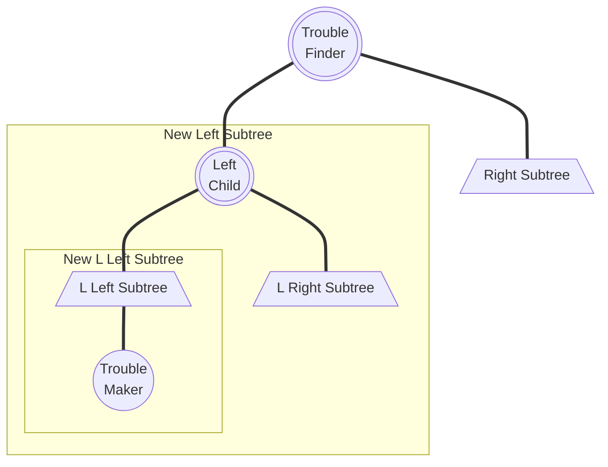

# Lecture 1 | AVL Trees & Splay Trees & Amortized Analysis

!!! info "阅读建议"
    因为没法在这里用代码写动画，所以我用 [Tab](https://facelessuser.github.io/pymdown-extensions/extensions/tabbed/?h=%3D%3D%3D#tabbed) 模拟了一下动画帧，可以手动切换这些标签来动态观察。一般这种内容的 Tab 标题都会是 `Frame {}`。

    === "Frame 1"
        Like
    === "Frame 2"
        Like this
    === "Frame 3"
        Like this!

## AVL 树

### 概念

!!! quote "link"
    OI Wiki: https://oi-wiki.org/ds/avl/

我们知道，对于一颗二叉搜索树，其对点的操作代价为 $O(\log n)$。然而在最坏情况下，它会退化成 $O(n)$，例如这是一颗只有左子树的链型二叉树，那么操作这里唯一的叶子节点就是 $O(n)$。

换句话来说，一棵二叉树的维护成本基本上与其高度正相关。因而一个很自然的想法是，如果我们想让一棵二叉树好维护，那么就希望它的高度尽可能低，而在点数固定的情况下，一种朴素的思想是让节点尽可能“均匀”地分布在树上。

!!! definition "height of a tree"
    **树的高度(Height of Tree)**等于其根节点到叶子节点的若干路径中，最大的距离（即边的数量），也就是深度最深的节点到根节点到距离。

    特别的，一颗空树的高度为 -1。

    > 说的通俗一些，就是树的层数。

---

#### AVL 树

而 AVL Tree 是一种**平衡(balanced)**的二叉搜索树，通过「高度」这个量，定义了「平衡」这件事。

!!! definition "AVL Tree"

    1. 一个空二叉树是一个 AVL 树；
    2. 如果二叉树 $T$ 是一个 AVL 树，则其左右子树 $T_L$ 和 $T_R$ 也都应该是 AVL 树，且有 $|h(T_l) - h(T_r)| \leq 1$；

    !!! definition "Balance Factor"
        一个节点的**平衡因子(Balance Factor)BF**用来描述一个节点的平衡状态，对于节点 $Tp$，它的左子树为 $T_L$，右子树为 $T_R$，则：

        $$
        BF(Tp) = h(T_L) - h(T_R)
        $$

    所以上面的第 2 条又可以写成：

    - 如果二叉树 $T$ 是一个 AVL 树，则其左右子树 $T_L$ 和 $T_R$ 也都应该是 AVL 树，且有 $BF(Tp) \in \{0, \pm 1\}$；

    > 说的通俗一些就是，AVL 树的每一个点都平衡，而平衡与否取决于节点的两个子树层数之差是否超过 1。

在这种定义下，AVL 树的高度可以证明为 $O(\log N)$，证明如下：

!!! proof "Height of AVL Trees"
    !!! inline note ""
        ```mermaid
        graph TD;
        A(("Root"))
        B[/"Left Subtree"\]
        C[/"Right Subtree"\]
        A === B
        A === C
        ```
    
    我们记 $F_h$ 是高度为 $h$ 的 AVL 树所包含的最少节点数，则有如下递推关系：

    $$
    F_i = \left\{
	    \begin{array}{l}
            1                       & (i = 1) \\
            2                       & (i = 2) \\
            F_{i-1} + F_{i-2} + 1   & (i > 2)
        \end{array}
    \right.
    $$

    可以发现，${F_i + 1}$ 是一个斐波那契数列，于是由斐波那契数列通项公式得：
    
    $$
    F_h \approx \frac{1}{\sqrt{5}}\left( \frac{1+\sqrt{5}}{2} \right)^h - 1
    $$

    也就是 $N \approx \frac{1}{\sqrt{5}}\left( \frac{1+\sqrt{5}}{2} \right)^h$，所以 $h = O(\log N)$。

---

#### 视角

而我们谈论 AVL 树时，我们希望以一个动态的视角来谈论 AVL 树，即讨论：某一颗树是否是 AVL 树、在某个操作后是否仍然是 AVL 树、如何将它重新变为 AVL 树。重点在于，讨论最后一个问题，即“重新变为 AVL 树”这个问题时，我们默认在这一步操作之前这棵树是一颗 AVL 树。

实际上这是对问题的一种简化建模，它成为我们解决其他问题的最小单元和基础。

所以在这种模型下，我们需要定义两个东西：

!!! definition "Trouble Maker & Trouble Finder"
    以 🌰 来说明。
    
    !!! note ""
        === "Frame 1"
            下图为一个 AVL 树：

            ```mermaid
            graph TD;
            A(("8, BF=1"))
            B(("4, BF=0"))
            C(("9, BF=0"))
            D(("2, BF=0"))
            E(("6, BF=0"))
            A === B
            A === C
            B === D
            B === E
            ```
        
        === "Frame 2"
            现在我们插入 `5`：

            ```mermaid
            graph TD;
            A(("8, BF=2"))
            B(("4, BF=1"))
            C(("9, BF=0"))
            D(("2, BF=0"))
            E(("6, BF=1"))
            F(("5, BF=0"))
            A === B
            A === C
            B === D
            B === E
            E === F
            E === NULL
            ```

            我们发现，此时 `8` 的「平衡因子」变成了2，不再符合 AVL 树的要求，而这一切都是 `5` 的插入导致的——于是我们称像这里的 `8` 一样，由于某个点的插入，其「平衡因子」不再符合要求的点，为 Trouble Finder；而像这里的 `5` 一样，导致 Trouble Finder 出现的点，被称之为 Trouble Maker。

    形象地描述这件事就是，在动态插入 `5` 这个过程中，出现了一个 "Trouble"，导致这个树不再是 AVL 树，而 `5` 是这个 "Trouble" 的 "Maker"，`8` 是 "Finder"。

---

### 操作

本小节所需要讲的内容就是**[#视角](#视角)**中提到的“重新变为 AVL 树”这一视角，也就是 AVL 树的维护。

首先， 我们需要对 AVL 树的破坏情况进行分类，根据 "Trouble Finder"、"Related Trouble Finder's Child"、"Trouble Maker"这三个点的相对关系，分为 `LL`、`RR`、`LR`、`RL` 四种：

!!! note ""
    > 同心圆表示这个点是需要我们在后续操作中关注的。
    >
    > 此外，虽然实际情况下可能出现多个 Trouble Finder，但是为了简化问题，我们这里假设只有一个 Trouble Finder，或者说我们只关注**以「距离案发现场最近的 Trouble Finder」为根的子树**（这句话非常重要）。
    
    === "LL"
        ```mermaid
        flowchart TD
            A((("Trouble\nFinder")))
            B((("Left\nChild")))
            C(("Right\nChild"))
            D(("L Left\nChild"))
            DA[/"Left and Right Subtrees"\]
            E(("L Right\nChild"))
            EA[/"Left and Right Subtrees"\]
            F(("R Left\nChild"))
            FA[/"Left and Right Subtrees"\]
            G(("R Right\nChild"))
            GA[/"Left and Right Subtrees"\]
            H(("Trouble\nMaker"))
            A === B
            A === C
            B === D === DA === H
            B === E === EA
            C === F === FA
            C === G === GA
        ```
    === "RR"
        ```mermaid
        flowchart TD
            A((("Trouble\nFinder")))
            B(("Left\nChild"))
            C((("Right\nChild")))
            D(("L Left\nChild"))
            DA[/"Left and Right Subtrees"\]
            E(("L Right\nChild"))
            EA[/"Left and Right Subtrees"\]
            F(("R Left\nChild"))
            FA[/"Left and Right Subtrees"\]
            G(("R Right\nChild"))
            GA[/"Left and Right Subtrees"\]
            H(("Trouble\nMaker"))
            A === B
            A === C
            B === D === DA
            B === E === EA
            C === F === FA
            C === G === GA === H
        ```
    === "LR"
        ```mermaid
        flowchart TD
            A((("Trouble\nFinder")))
            B((("Left\nChild")))
            C(("Right\nChild"))
            D(("L Left\nChild"))
            DA[/"Left and Right Subtrees"\]
            E((("L Right\nChild")))
            EA[/"Left and Right Subtrees"\]
            F(("R Left\nChild"))
            FA[/"Left and Right Subtrees"\]
            G(("R Right\nChild"))
            GA[/"Left and Right Subtrees"\]
            H(("Trouble\nMaker"))
            A === B
            A === C
            B === D === DA
            B === E === EA === H
            C === F === FA
            C === G === GA
        ```
    === "RL"
        ```mermaid
        flowchart TD
            A((("Trouble\nFinder")))
            B(("Left\nChild"))
            C((("Right\nChild")))
            D(("L Left\nChild"))
            DA[/"Left and Right Subtrees"\]
            E(("L Right\nChild"))
            EA[/"Left and Right Subtrees"\]
            F((("R Left\nChild")))
            FA[/"Left and Right Subtrees"\]
            G(("R Right\nChild"))
            GA[/"Left and Right Subtrees"\]
            H(("Trouble\nMaker"))
            A === B
            A === C
            B === D === DA
            B === E === EA
            C === F === FA === H
            C === G === GA
        ```
    
    稍作解释，例如 `LR`，表示的是 Trouble Maker 在 Trouble Finder 的 L 子节点的 R 子树中。

    另外，对于我只在 `LR` 和 `RL` 中着重二级子节点，并不是笔误。之后会详细介绍。

---

#### LL & RR

!!! tip "废话"
    大部分教材都倾向于继续用“旋转”来概括这些方法，确实其实从抽象角度来讲至少 `LL` 和 `RR` 部分也还是像的，但是我觉得这并不利于记忆和理解这个过程，尤其是对于 `LR` 和 `RL` 的部分。
    
    所以在 `LL` 和 `RR` 部分，我还是会先介绍一下比较传统的，用“旋转”的方式来理解，之后我将尝试着用我自己的思路来讲。

##### “旋转”视角

`LL` 和 `RR` 这两种情况相对直观。由于它们的操作是对称的，所以我这里以 `LL` 为例。



根据相关性质，我们得到这个模型有如下性质：

!!! feature "一些性质"

    1. $BF(\text{Trouble Finder}) = h(\text{New Left Subtree}) - h(\text{Right Subtree}) = 2$；
    2. $h(\text{New L Left Subtree}) - h(\text{L Right Subtree}) = 1$；
        - 如果此差为 0，则不应当成为 Trouble Maker，若此差为 2，则 Left Child 应当为 Trouble Finder；

现在我们希望在保留二叉搜索树的性质下，要让 $|BF(\text{Trouble Finder})|$ 变小，一个很自然的想法就是让 $h(\text{New Left Subtree})$ 去 +1，让 $h(\text{Right Subtree})$ 去 -1。

于是我们发现，这样的操作刚好：

!!! section "LL Single Rotation"

    > 在 Frame 2 和 Frame 3 之间添加的细线是为了表示这里 L Right Subtree 的转移方法，让 2 ~ 3 帧的“旋转”过程中更加清晰。

    > 此外，这里要素的命名都是基于 Frame 1 的，对于 Frame 4 来说 L Right Subtree 显然已经不是 L Right Subtree 了。

    === "Frame 1"
        ```mermaid
            flowchart TD
                A((("Trouble\nFinder")))
                B((("Left\nChild")))
                C[/"Right Subtree"\]
                D[/"L Left Subtree"\]
                H(("Trouble\nMaker"))
                E[/"L Right Subtree"\]
                
                A === B
                A === C
                B === D === H
                B === E
        ```
    === "Frame 2"
        ```mermaid
            flowchart TD
                A((("Trouble\nFinder")))
                B((("Left\nChild")))
                C[/"Right Subtree"\]
                D[/"L Left Subtree"\]
                E[/"L Right Subtree"\]
                H(("Trouble\nMaker"))
                
                A === B
                A --- E
                A === C
                B === D === H
                B === E
        ```
    === "Frame 3"
        ```mermaid
            flowchart TD
                A((("Trouble\nFinder")))
                B((("Left\nChild")))
                C[/"Right Subtree"\]
                D[/"L Left Subtree"\]
                E[/"L Right Subtree"\]
                H(("Trouble\nMaker"))
                
                B === D === H
                B --- E
                B === A
                A === E
                A === C
                
        ```
    === "Frame 4"
        ```mermaid
            flowchart TD
                A((("Trouble\nFinder")))
                B((("Left\nChild")))
                C[/"Right Subtree"\]
                D[/"L Left Subtree"\]
                E[/"L Right Subtree"\]
                H(("Trouble\nMaker"))
                
                B === D === H
                B === A
                A === E
                A === C
                
        ```
    > 你甚至能从整个框在 2 ~ 3 帧的变短感受到这个树的高度减少了x（逃）

那么还有一个问题是，如何证明这样变换能够保持 AVL 的性质呢？

我个人认为主要有两个维度，一是保持二叉搜索树的性质，二是保持平衡的性质，我的证明内容折叠起来了，建议读者可以先自己思考一下再展开看看我的想法。

??? proof "二叉搜索树性质的保持"
    { width=30% align=right }

    不知道读者是否发现，对于一个排列得当的二叉搜索树，如果我从左到右，使用一条竖直的扫描线扫描整个树，将会得到一个单调序列，这也正对应着这个二叉搜索树所维护的有序数列。

    基于这种论调，再回头看上面那个动态的过程，甚至是观察我在 2 ~ 3 帧画出来的这个三角形的旋转，就会发现这种旋转实际上只是在将节点上下移动，所以不改变二叉搜索树的性质。

??? proof "平衡的保持"

    让我们先回顾一下在上面给出的一些性质中的第 2 条： $h(\text{New L Left Subtree}) - h(\text{L Right Subtree}) = 1$。

    在仔细思考整个旋转过程中每一个 Subtree 的高度的变化，即可得到证明。    


而 RR Single Rotation 完全对称，所以不再赘述。

---

##### “换根”视角

现在我想尝试着用我自己的方式来理解这个问题。

首先让我们人力动画一下这个过程（划掉）：

!!! section "LL Single Rotation"

    > 此外，这里要素的命名都是基于 Frame 1 的，对于 Frame 4 来说 L Right Subtree 显然已经不是 L Right Subtree 了。

    === "Frame 1"
        ```mermaid
            flowchart TD
                A((("Trouble\nFinder")))
                B((("Left\nChild")))
                C[/"Right Subtree"\]
                D[/"L Left Subtree"\]
                H(("Trouble\nMaker"))
                E[/"L Right Subtree"\]
                
                A === B
                A === C
                B === D === H
                B === E
        ```
    === "Frame 2"
        ```mermaid
            flowchart TD
                A((("Trouble\nFinder")))
                B((("Left\nChild")))
                C[/"Right Subtree"\]
                D[/"L Left Subtree"\]
                H(("Trouble\nMaker"))
                E[/"L Right Subtree"\]
                
                A --- B
                A === C
                B === D === H
                B === E
        ```
    === "Frame 3"
        ```mermaid
            flowchart TD
                B((("Left\nChild")))
                D[/"L Left Subtree"\]
                E[/"L Right Subtree"\]
                H(("Trouble\nMaker"))
                A((("Trouble\nFinder")))
                C[/"Right Subtree"\]

                A === C
                B === D === H
                B === E
        ```
    === "Frame 4"
        ```mermaid
            flowchart TD
                B((("Left\nChild")))
                D[/"L Left Subtree"\]
                E[/"L Right Subtree"\]
                H(("Trouble\nMaker"))
                A((("Trouble\nFinder")))
                C[/"Right Subtree"\]

                A === C
                B === D === H
                A === E
        ```
    === "Frame 5"
        ```mermaid
            flowchart TD
                A((("Trouble\nFinder")))
                B((("Left\nChild")))
                C[/"Right Subtree"\]
                D[/"L Left Subtree"\]
                E[/"L Right Subtree"\]
                H(("Trouble\nMaker"))
                
                B === D === H
                B === A
                A === E
                A === C
                
        ```

首先，我们遇到的问题是什么？是 Trouble Maker 进来以后，Trouble Finder 发现 $h(T_L) - h(T_R) = 2$了，用通俗的话来说就是左子树太高了，然而在这种情况下，左子树依然还站在一个台子（Trouble Finder）上和Trouble Finder 比身高，所以我们需要将它从台子上请下来。也就是说，既然左子树太高了，那么我们就不**希望**让它再成为谁的子树，因为成为谁的子树必然意味着这条路径会更长。

那么现在我们把它从台子上请下来，也就是说割裂它和 Trouble Finder 的父子关系（对应 Frame 2）让它们同台“对抗”（这一步在 `LL` 和 `RR` 可能显得比较多余，但是在 `LR` 和 `RL` 就会让问题清晰很多）。

然而我们仍然需要让这个森林重新变回一个树，所以就需要重新从里面找到根节点，显然，只能选择 Trouble Finder **旁边** 的 Left Child。但是为了继续维护二叉搜索树的性质，所以我们需要将 L Right Subtree 移植到 Trouble Finder 必定空缺（因为这里原先是 Left Child）的左指针上。

OK，你可能觉得这个解释对于 LL Single Rotation 来说显得十分多此一举，但是这都是为了给后面做的铺垫，虽然这个方法看起来繁琐冗余，但是已经足以解释原先的 Single Rotation 无法解释的 LR & RL 操作方法。

---

#### LR & RL

首先我们需要知道为什么之前的方法不行，也是我觉得“旋转”这个做法在这个推进过程中比较割裂的地方：（对照 **[#旋转视角](#旋转视角)** 的内容阅读）我们发现，由于 LL 中的 Trouble Maker 在左侧子树上，所以在旋转过程中，相当于把它“拽”上来了。然而对于 L Right Subtree，无论是旋转前还是旋转后，为了维护二叉搜索树的性质，它都被接在了深度为 1 的节点上，换句话来说 L Right Subtree 贡献的高度并没有改变。对于 RL 的情况也是同理的。所以我们并不能使用 LL Single Rotation 的方法来解决这个问题。

那么我们换一个思路，用**[“换根”视角](#换根视角)**来看待这个问题：

!!! section "LR Rotation"
    > 这里两个 Subtree 接到同一个 Trouble Maker 的意思是 Trouble Maker 可以出现在两者任一中。

    === "Frame 1"
        ```mermaid
            flowchart TD
                A((("Trouble\nFinder")))
                B((("Left\nChild")))
                C[/"Right Subtree"\]
                D(("L Left\nChild"))
                DA[/"L Left Subtree"\]
                H(("Trouble\nMaker"))
                E((("L Right\nChild")))
                EA[/"L Left Subtree"\]
                EB[/"L Right Subtree"\]
                
                A === B
                A === C
                B === D === DA
                B === E === EA --- H
                E === EB --- H
        ```
    === "Frame 2"
        ```mermaid
            flowchart TD
                A((("Trouble\nFinder")))
                B((("Left\nChild")))
                C[/"Right Subtree"\]
                D(("L Left\nChild"))
                DA[/"L Left Subtree"\]
                H(("Trouble\nMaker"))
                E((("L Right\nChild")))
                EA[/"L Left Subtree"\]
                EB[/"L Right Subtree"\]
                
                A --- B
                A === C
                B === D === DA
                B --- E === EA --- H
                E === EB --- H
        ```
    === "Frame 3"
        ```mermaid
            flowchart TD
                
                B((("Left\nChild")))
                D(("L Left\nChild"))
                DA[/"L Left Subtree"\]
                H(("Trouble\nMaker"))
                E((("L Right\nChild")))
                EA[/"L Left Subtree"\]
                EB[/"L Right Subtree"\]
                A((("Trouble\nFinder")))
                C[/"Right Subtree"\]
                
                A === C
                B === D === DA
                E === EA --- H
                E === EB --- H
        ```
    === "Frame 4"
        ```mermaid
            flowchart TD
                
                B((("Left\nChild")))
                D(("L Left\nChild"))
                DA[/"L Left Subtree"\]
                H(("Trouble\nMaker"))
                E((("L Right\nChild")))
                EA[/"L Left Subtree"\]
                EB[/"L Right Subtree"\]
                A((("Trouble\nFinder")))
                C[/"Right Subtree"\]
                
                A === C
                B === D === DA
                E --- EA --- H
                E --- EB --- H
        ```
    === "Frame 5"
        ```mermaid
            flowchart TD
                
                D(("L Left\nChild"))
                B((("Left\nChild")))
                DA[/"L Left Subtree"\]
                E((("L Right\nChild")))
                EA[/"L Left Subtree"\]
                EB[/"L Right Subtree"\]
                H(("Trouble\nMaker"))
                A((("Trouble\nFinder")))
                C[/"Right Subtree"\]
                
                E === B
                E === A
                B === D === DA
                B === EA --- H
                A === EB --- H
                A === C
        ```

???+ extra "关于记忆"
    记忆这个操作如何做的话，我的记忆方法是这样的：

    === "Frame 1"
        ```mermaid
            flowchart TD
                A((("Trouble\nFinder")))
                B((("Left\nChild")))
                C[/"Right Subtree"\]
                D(("L Left\nChild"))
                DA[/"L Left Subtree"\]
                H(("Trouble\nMaker"))
                E((("L Right\nChild")))
                EA[/"L Left Subtree"\]
                EB[/"L Right Subtree"\]
                
                A === B
                A === C
                B === D === DA
                B === E === EA --- H
                E === EB --- H
        ```
    === "Frame 2"
        ```mermaid
            flowchart TD
                A((("Trouble\nFinder")))
                B((("Left\nChild")))
                C[/"Right Subtree"\]
                D(("L Left\nChild"))
                DA[/"L Left Subtree"\]
                H(("Trouble\nMaker"))
                E((("L Right\nChild")))
                EA[/"L Left Subtree"\]
                EB[/"L Right Subtree"\]
                
                A --- B
                A --- E
                A === C
                B === D === DA
                B --- E === EA --- H
                E === EB --- H
        ```
    === "Frame 3"
        ```mermaid
            flowchart TD
                A((("Trouble\nFinder")))
                B((("Left\nChild")))
                D(("L Left\nChild"))
                DA[/"L Left Subtree"\]
                H(("Trouble\nMaker"))
                E((("L Right\nChild")))
                EA[/"L Left Subtree"\]
                EB[/"L Right Subtree"\]
                C[/"Right Subtree"\]
                
                A --- B
                E --- B 
                E --- A
                B === D === DA
                B --- EA --- H
                A --- EB --- H
                A === C
        ```
    === "Frame 4"
        ```mermaid
            flowchart TD
                A((("Trouble\nFinder")))
                B((("Left\nChild")))
                D(("L Left\nChild"))
                DA[/"L Left Subtree"\]
                H(("Trouble\nMaker"))
                E((("L Right\nChild")))
                EA[/"L Left Subtree"\]
                EB[/"L Right Subtree"\]
                C[/"Right Subtree"\]
                
                E --- B 
                E --- A
                B === D === DA
                B --- EA --- H
                A --- EB --- H
                A === C
        ```

    用语言概括就是，找到关键的那三个点，然后把最下面的顶到上面去，剩下两个作为左右子树，原先的那个点的左右子树则对应地，左子树接到左边空缺的右子树上，右子树接到右边空缺的左子树上。

---

### 其他问题

!!! question "如果一个 Trouble 产生后，出现了多个 Trouble Finder，该如何处理？"

    首先，请回顾一下 **[#操作](#操作)** 中被加粗的这一句话，「以『距离案发现场最近的 Trouble Finder』为根的子树」。也就是说，我们现在已经有了解决最近的 Trouble Finder 的方案。

    感性的思考，AVL 的“平衡”可以由递归形式定义，具体来说衡量的是左右子树的“高度”差。当我们解决了一个 Trouble Finder，意味着我们让 Trouble Finder 的最高的那个子树高度 -1，这也意味着以 Trouble Finder 为根的那个子树高度 -1，这也意味着其所有父节点的平衡因子都会相应地变化。

    一个 Trouble 当且仅有一个 Trouble Maker，而且它必定是 Trouble Finder 所关注的那个“最长路径”的端点，这也意味着所有的子 Trouble Finder 都在对应的父 Trouble Finder 的“最长路径”上。而现在我们让子 Trouble Finder 唯一（如果不唯一，那在这个 Trouble Maker 到来之前就已经存在 Trouble 了）的最长路径也应当会 -1。而这必将导致其平衡因子的绝对值 -1。

---

## Splay 树

!!! quote "link"
    OI Wiki: https://oi-wiki.org/ds/splay/

Splay 树，即伸展树，想要解决的问题和 AVL 树类似，只不过 Splay 树希望达到的目标是在**摊还(Amortized)**复杂度$O(\log N)$的情况下完成大部分对点操作。

我们知道，为使 AVL 保持平衡，我们需要维护从根节点到 Trouble Maker 这条路径上所有点的平衡因子。而 Splay 则不再维护这些信息，这意味着我们无法保证 Splay 树的状态都是平衡的，但是我们希望它尽可能平衡。具体来说就是对于 $M$ 次任意操作，其时间复杂度都为 $O(M\log N)$，均摊下来这 $M$ 个操作每一个都需要 $O(\log N)$。

对于一个树，我们对其节点进行的操作可能是：**增**点、**删**点、**改**点、**查**点等等，而不同类型的操作开销可能不尽相同。简单的计算其平均值则忽略了这些操作之间互相的影响或者是操作频率的问题，所以我们这里使用**[摊还](#摊还)**复杂度来描述其效率。

> 关于摊还的问题我们还会在之后进一步深入。

那么说了这么多，Splay 是怎么实现这一目标的呢？

Splay 的核心思想就是，每当我们访问一个节点（比如查询某个点、插入某个点，甚至是删除某个点），我们就通过一系列操作将目标点转移到根部，形象上理解就是不断旋转整个树的构造，知道把点转到根部。

!!! eg ""
    例如我们查询点 $k_1$，则会通过旋转将它转到根。

    === "Frame 1"
        
    === "Frame 2"
        
    === "Frame 3"
        

    可以发现，Frame 1 ~ 2 就是我们前面提到过的 **[LR Rotation](#lr--rl)**，而 Frame 2 ~ 3 就是经过了两次 **[LL Rotation](#ll--rr)**。当然，在 Splay 里这些操作都有了新的名字。

这个例子只是为了给读者一个初始印象，之后我们将更详细、准确的介绍操作。

> （没玩过可能听不太懂）不知道大家有没有玩过那种电子游戏，就是有好多转盘，相邻转盘之间有交界处，这些交界点上都会有圆球，当一个转盘旋转的时候，其圆周上的球体都会跟着这个圆周转动。通过不停转动相邻的圆盘，我们可以实现把某个位置的圆球转移到另外一个位置。而 Splay 差不多是这么个感觉。

---

### 基本操作

首先我们做一个约定，对于任意一个节点 X，我们记其父节点为 P(Parent)，其父节点的父节点为 G(Grandparent)。

- 当我们访问到某个点 X 时：
    - 如果 P 是根节点，则直接进行一次 [Single Rotation](#ll--rr)，将 X 转到根节点；
    - 如果 P 不是根节点：
        - 当情况为 LR / RL 时，进行一次 [LR Rotation 或 RL Rotation](#lr--rl)，我们称之为 zig-zag；
        - 当情况为 LL / RR 时，进行三次 [Single Rotation](#ll--rr)，使得 X、P、G 的顺序逆转，像跷跷板一样，我们称之为 zig-zig；
    - 不断对 X 进行 Splay 操作，直到 X 成为根节点；


可以发现，其具体操作基本就和 AVL 树的相关操作有很大重合。

---

### 对点操作

!!! section "Find X"
    通过 Splay，将 X 旋转至 Root，于是直接取出 Root 即为结果。

!!! section "Remove X"
    通过 Splay，将 X 旋转至 Root，接下来删除 Root 节点，并合并左右子树即可。

!!! section "Find Max"
    最大的元素作为根时，它没有右子树。

...

---

## 摊还分析

!!! link "link"
    Wikipedia: https://zh.wikipedia.org/wiki/%E5%B9%B3%E6%91%8A%E5%88%86%E6%9E%90

!!! warning "不好意思"
    我实在不知道怎么清晰地讲明白“摊还”是什么，感觉讲不太清楚，所以就比较简单的介绍了，但是我仍然会指出我学习过程中认为对我启发性比较大的地方。

所谓的摊还分析，分析的是摊还边界，或者说摊还时间复杂度。平常我们分析时间复杂度时，针对的往往是某个具体的操作。而摊还分析的对象则是一个数据结构的一系列操作，而这一系列操作中有成本较低的，也有成本较高的，而且操作之间也可能有互相影响。

而摊还分析则是以一个更全局的角度来计算“平均”的操作代价，它计算的是从初始状态开始，连续的 M 次任意操作最多有 的代价。需要注意的是，它不同于平均时间分析（所有可能的操作出现概率平均，也就是直接求平均）和概率算法的概率分析（平均话所有可能的随机选择，也就是加权求平均）不同，摊还分析和概率完全无关。

容易得到如下等式：

$$
\text{worst-case bound} \geq \text{amortized bound} \geq \text{average-case bound}
$$

我们知道，由于 amortized bound 限制了所有的 M 次操作，所以其上界就等于最差的情况发生 M 次（当然，很多情况下不一定能取到全都是最差情况）；同样的，由于需要对任意组合都成立，所以一定不会小于统计学意义上的平均情况。

> 刚开始学到摊还分析的时候，看着这些内容有一种莫名其妙的感觉，不知道它在干嘛，后来我才发现我误解了摊还分析的目的。所以我感觉还是需要就此给出我自己的理解。
> 
> !!! tip "摊还分析"
>       在我理解中，摊还分析实际上是一系列**证明方法**，更进一步的说，在我们之后会讲到的三个分析方法中，有一些可能难以直接得到摊还复杂度。但是实际上，他们的过程更像是已知一个摊还边界，并证明它确实是边界。

常见的摊还分析有三种：聚合(aggregate)法、核(accounting)法、势能(potential)法，接下来一一介绍。

---

### 聚合法

聚合法相对简单，就是直接累积连续 M 次操作的代价，再除以 M。

$$
T_{amortized} = \frac{\sum_i{T_i}}{n}
$$

---

### 核法

!!! link "link"
    关于 Accounting Analysis 可以参考这篇文章：https://www.baeldung.com/cs/amortized-analysis

做一个比喻的话，可以这么理解：

> 你去吃午饭，吃素菜要 ¥1（对标消耗较小的操作），吃荤菜要 ¥4（对表消耗较大的操作），现在你知道你每天吃午饭的摊还开销为 ¥2（从证明的角度来理解）。那么你今天吃素菜，账户入账 ¥1（2 - 1 = 1）；明天你也吃素菜，账户也入账 ¥1；后天你吃荤菜了，那么账户就出账 ¥2（2 - 4 = -2）……

核法大概就是按照这么一个思路来证明，不过具体细节和上面这个案例还是有区别的，可以详细参考上面那片文章，我觉得配图和说明都很详细。

---

### 势能法

!!! link "link"
    关于 Potential Analysis 可以参考这篇文章：https://en.wikipedia.org/wiki/Potential_method
    以及 ltgg 的这期周报讲的也很好：https://www.yuque.com/xianyuxuan/saltfish_shop/weekly002_amortized_analysis#KmnY6

势能法强推 ltgg 的这篇文章，讲的非常好。


