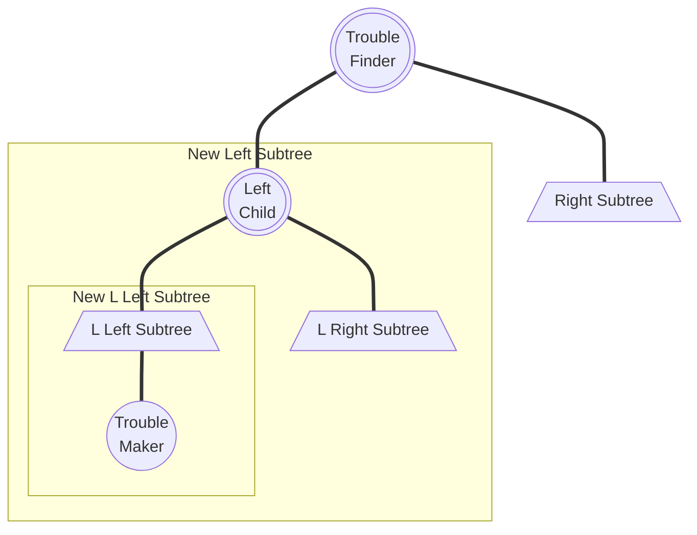

# Lecture 1 | AVL Trees & Splay Trees & Amortized Analysis

!!! info "阅读建议"
    因为没法在这里用代码写动画，所以我用 [Tab](https://facelessuser.github.io/pymdown-extensions/extensions/tabbed/?h=%3D%3D%3D#tabbed) 模拟了一下动画帧，可以手动切换这些标签来动态观察。一般这种内容的 Tab 标题都会是 `Frame {}`。

    === "Frame 1"
        Like
    === "Frame 2"
        Like this
    === "Frame 3"
        Like this!

## AVL Trees

### 概念

!!! note ""
    OI Wiki: https://oi-wiki.org/ds/avl/

我们知道，对于一颗二叉搜索树，其对点的操作代价为 $O(\log n)$。然而在最坏情况下，它会退化成 $O(n)$，例如这是一颗只有左子树的链型二叉树，那么操作这里唯一的叶子节点就是 $O(n)$。

换句话来说，一棵二叉树的维护成本基本上与其高度正相关。因而一个很自然的想法是，如果我们想让一棵二叉树好维护，那么就希望它的高度尽可能低，而在点数固定的情况下，一种朴素的思想是让节点尽可能“均匀”地分布在树上。

!!! definition "height of a tree"
    **树的高度(Height of Tree)**等于其根节点到叶子节点的若干路径中，最大的距离（即边的数量），也就是深度最深的节点到根节点到距离。

    特别的，一颗空树的高度为 -1。

    > 说的通俗一些，就是树的层数。

---

#### AVL 树

而 AVL Tree 是一种**平衡(balanced)**的二叉搜索树，通过「高度」这个量，定义了「平衡」这件事。

!!! definition "AVL Tree"

    1. 一个空二叉树是一个 AVL 树；
    2. 如果二叉树 $T$ 是一个 AVL 树，则其左右子树 $T_L$ 和 $T_R$ 也都应该是 AVL 树，且有 $|h(T_l) - h(T_r)| \leq 1$；

    !!! definition "Balance Factor"
        一个节点的**平衡因子(Balance Factor)BF**用来描述一个节点的平衡状态，对于节点 $Tp$，它的左子树为 $T_L$，右子树为 $T_R$，则：

        $$
        BF(Tp) = h(T_L) - h(T_R)
        $$

    所以上面的第 2 条又可以写成：

    - 如果二叉树 $T$ 是一个 AVL 树，则其左右子树 $T_L$ 和 $T_R$ 也都应该是 AVL 树，且有 $BF(Tp) \in \{0, \pm 1\}$；

    > 说的通俗一些就是，AVL 树的每一个点都平衡，而平衡与否取决于节点的两个子树层数之差是否超过 1。

在这种定义下，AVL 树的高度可以证明为 $O(\log N)$，证明如下：

!!! proof "Height of AVL Trees"
    !!! inline note ""
        ```mermaid
        graph TD;
        A(("Root"))
        B[/"Left Subtree"\]
        C[/"Right Subtree"\]
        A === B
        A === C
        ```
    
    我们记 $F_h$ 是高度为 $h$ 的 AVL 树所包含的最少节点数，则有如下递推关系：

    $$
    F_i = \left\{
	    \begin{array}{l}
            1                   & (i = 1) \\
            2                   & (i = 2) \\
            F_{i-1} + F_{i-2}   & (i > 2)
        \end{array}
    \right.
    $$

    可以发现，这是一个斐波那契数列，于是由斐波那契数列通项公式得：
    
    $$
    F_h \approx \frac{1}{\sqrt{5}}\left( \frac{1+\sqrt{5}}{2} \right)^h
    $$

    也就是 $N \approx \frac{1}{\sqrt{5}}\left( \frac{1+\sqrt{5}}{2} \right)^h$，所以 $h = O(\log N)$。

---

#### 视角

而我们谈论 AVL 树时，我们希望以一个动态的视角来谈论 AVL 树，即讨论：某一颗树是否是 AVL 树、在某个操作后是否仍然是 AVL 树、如何将它重新变为 AVL 树。重点在于，讨论最后一个问题，即“重新变为 AVL 树”这个问题时，我们默认在这一步操作之前这棵树是一颗 AVL 树。

实际上这是对问题的一种简化建模，它成为我们解决其他问题的最小单元和基础。

所以在这种模型下，我们需要定义两个东西：

!!! definition "Trouble Maker & Trouble Finder"
    以 🌰 来说明。
    
    !!! note ""
        === "Frame 1"
            下图为一个 AVL 树：

            ```mermaid
            graph TD;
            A(("8, BF=1"))
            B(("4, BF=0"))
            C(("9, BF=0"))
            D(("2, BF=0"))
            E(("6, BF=0"))
            A === B
            A === C
            B === D
            B === E
            ```
        
        === "Frame 2"
            现在我们插入 `5`：

            ```mermaid
            graph TD;
            A(("8, BF=2"))
            B(("4, BF=1"))
            C(("9, BF=0"))
            D(("2, BF=0"))
            E(("6, BF=1"))
            F(("5, BF=0"))
            A === B
            A === C
            B === D
            B === E
            E === F
            E === NULL
            ```

            我们发现，此时 `8` 的「平衡因子」变成了2，不再符合 AVL 树的要求，而这一切都是 `5` 的插入导致的——于是我们称像这里的 `8` 一样，由于某个点的插入，其「平衡因子」不再符合要求的点，为 Trouble Finder；而像这里的 `5` 一样，导致 Trouble Finder 出现的点，被称之为 Trouble Maker。

    形象地描述这件事就是，在动态插入 `5` 这个过程中，出现了一个 "Trouble"，导致这个树不再是 AVL 树，而 `5` 是这个 "Trouble" 的 "Maker"，`8` 是 "Finder"。

---

### 操作

本小节所需要讲的内容就是**[#视角](#视角)**中提到的“重新变为 AVL 树”这一视角，也就是 AVL 树的维护。

首先， 我们需要对 AVL 树的破坏情况进行分类，根据 "Trouble Finder"、"Related Trouble Finder's Child"、"Trouble Maker"这三个点的相对关系，分为 `LL`、`RR`、`LR`、`RL` 四种：

!!! note ""
    > 同心圆表示这个点是需要我们在后续操作中关注的。
    >
    > 此外，虽然实际情况下可能出现多个 Trouble Finder，但是为了简化问题，我们这里假设只有一个 Trouble Finder，或者说我们只关注**以「距离案发现场最近的 Trouble Finder」为根的子树**（这句话非常重要）。
    
    === "LL"
        ```mermaid
        flowchart TD
            A((("Trouble\nFinder")))
            B((("Left\nChild")))
            C(("Right\nChild"))
            D(("L Left\nChild"))
            DA[/"Left and Right Subtrees"\]
            E(("L Right\nChild"))
            EA[/"Left and Right Subtrees"\]
            F(("R Left\nChild"))
            FA[/"Left and Right Subtrees"\]
            G(("R Right\nChild"))
            GA[/"Left and Right Subtrees"\]
            H(("Trouble\nMaker"))
            A === B
            A === C
            B === D === DA === H
            B === E === EA
            C === F === FA
            C === G === GA
        ```
    === "RR"
        ```mermaid
        flowchart TD
            A((("Trouble\nFinder")))
            B(("Left\nChild"))
            C((("Right\nChild")))
            D(("L Left\nChild"))
            DA[/"Left and Right Subtrees"\]
            E(("L Right\nChild"))
            EA[/"Left and Right Subtrees"\]
            F(("R Left\nChild"))
            FA[/"Left and Right Subtrees"\]
            G(("R Right\nChild"))
            GA[/"Left and Right Subtrees"\]
            H(("Trouble\nMaker"))
            A === B
            A === C
            B === D === DA
            B === E === EA
            C === F === FA
            C === G === GA === H
        ```
    === "LR"
        ```mermaid
        flowchart TD
            A((("Trouble\nFinder")))
            B((("Left\nChild")))
            C(("Right\nChild"))
            D(("L Left\nChild"))
            DA[/"Left and Right Subtrees"\]
            E((("L Right\nChild")))
            EA[/"Left and Right Subtrees"\]
            F(("R Left\nChild"))
            FA[/"Left and Right Subtrees"\]
            G(("R Right\nChild"))
            GA[/"Left and Right Subtrees"\]
            H(("Trouble\nMaker"))
            A === B
            A === C
            B === D === DA
            B === E === EA === H
            C === F === FA
            C === G === GA
        ```
    === "RL"
        ```mermaid
        flowchart TD
            A((("Trouble\nFinder")))
            B(("Left\nChild"))
            C((("Right\nChild")))
            D(("L Left\nChild"))
            DA[/"Left and Right Subtrees"\]
            E(("L Right\nChild"))
            EA[/"Left and Right Subtrees"\]
            F((("R Left\nChild")))
            FA[/"Left and Right Subtrees"\]
            G(("R Right\nChild"))
            GA[/"Left and Right Subtrees"\]
            H(("Trouble\nMaker"))
            A === B
            A === C
            B === D === DA
            B === E === EA
            C === F === FA === H
            C === G === GA
        ```
    
    稍作解释，例如 `LR`，表示的是 Trouble Maker 在 Trouble Finder 的 L 子节点的 R 子树中。

    另外，对于我只在 `LR` 和 `RL` 中着重二级子节点，并不是笔误。之后会详细介绍。

---

#### LL & RR

这两种情况相对直观。由于它们的操作是对称的，所以我这里以 `LL` 为例。



根据相关性质，我们得到这个模型有如下性质：

!!! feature "一些性质"

    1. $BF(\text{Trouble Finder}) = h(\text{New Left Subtree}) - h(\text{Right Subtree}) = 2$；
    2. $h(\text{New L Left Subtree}) - h(\text{L Right Subtree}) = 1$；
        - 如果此差为 0，则不应当成为 Trouble Maker，若此差为 2，则 Left Child 应当为 Trouble Finder；

现在我们希望在保留二叉搜索树的性质下，要让 $|BF(\text{Trouble Finder})|$ 变小，一个很自然的想法就是让 $h(\text{New Left Subtree})$ 去 +1，让 $h(\text{Right Subtree})$ 去 -1。

于是我们发现，这样的操作刚好：

!!! section "LL Single Rotation"

    > 在 Frame 2 和 Frame 3 之间添加的细线是为了表示这里 L Right Subtree 的转移方法，让 2 ~ 3 帧的“旋转”过程中更加清晰。

    > 此外，这里要素的命名都是基于 Frame 1 的，对于 Frame 4 来说 L Right Subtree 显然已经不是 L Right Subtree 了。

    === "Frame 1"
        ```mermaid
            flowchart TD
                A((("Trouble\nFinder")))
                B((("Left\nChild")))
                C[/"Right Subtree"\]
                D[/"L Left Subtree"\]
                H(("Trouble\nMaker"))
                E[/"L Right Subtree"\]
                
                A === B
                A === C
                B === D === H
                B === E
        ```
    === "Frame 2"
        ```mermaid
            flowchart TD
                A((("Trouble\nFinder")))
                B((("Left\nChild")))
                C[/"Right Subtree"\]
                D[/"L Left Subtree"\]
                E[/"L Right Subtree"\]
                H(("Trouble\nMaker"))
                
                A === B
                A --- E
                A === C
                B === D === H
                B === E
        ```
    === "Frame 3"
        ```mermaid
            flowchart TD
                A((("Trouble\nFinder")))
                B((("Left\nChild")))
                C[/"Right Subtree"\]
                D[/"L Left Subtree"\]
                E[/"L Right Subtree"\]
                H(("Trouble\nMaker"))
                
                B === D === H
                B --- E
                B === A
                A === E
                A === C
                
        ```
    === "Frame 4"
        ```mermaid
            flowchart TD
                A((("Trouble\nFinder")))
                B((("Left\nChild")))
                C[/"Right Subtree"\]
                D[/"L Left Subtree"\]
                E[/"L Right Subtree"\]
                H(("Trouble\nMaker"))
                
                B === D === H
                B === A
                A === E
                A === C
                
        ```
    > 你甚至能从整个框在 2 ~ 3 帧的变短感受到这个树的高度减少了x（逃）

那么还有一个问题是，如何证明这样变换能够保持 AVL 的性质呢？

我个人认为主要有两个维度，一是保持二叉搜索树的性质，二是保持平衡的性质，我的证明内容折叠起来了，建议读者可以先自己思考一下再展开看看我的想法。

??? proof "二叉搜索树性质的保持"
    { width=30% align=right }

    不知道读者是否发现，对于一个排列的当的二叉搜索树，如果我从左到右，使用一条竖直的扫描线扫描整个树，将会得到一个单调序列，这也正对应着这个二叉搜索树所维护的有序数列。

    基于这种论调，再回头看上面那个动态的过程，甚至是观察我在 2 ~ 3 帧画出来的这个三角形的旋转，就会发现这种旋转实际上只是在将节点上下移动，所以不改变二叉搜索树的性质。

??? proof "平衡的保持"

    让我们先回顾一下在上面给出的一些性质中的第 2 条： $h(\text{New L Left Subtree}) - h(\text{L Right Subtree}) = 1$。

    在仔细思考整个旋转过程中每一个 Subtree 的高度的变化，即可得到证明。    


而 RR Single Rotation 完全对称，所以不再赘述。

---

#### LR & RL

!!! tip "废话"
    大部分教材都倾向于继续用“旋转”来概括 LR 和 RL 的处理方法，确实其实从抽象角度来讲也还是像的，但是我觉得这并不利于记忆和理解这个过程。所以我将尝试着用我自己的思路来讲。


---

## Splay Trees


---

## Amortized Analysis