# Lecture 4 | Leftist Heap & Skew Heap

## Leftist Heap

!!! quote "link"
    OI Wiki: https://oi-wiki.org/ds/leftist-tree/

    Wikipedia: https://en.wikipedia.org/wiki/Leftist_tree

---

### 概念

左偏堆，或者说**左偏堆(Leftist Heap)**，它相比于普通的堆，更好的一点在于它支持快速的堆合并操作。“左偏”，并不断将新的东西往右侧合并，来实现每次都是往相对小的那一侧塞进东西，进而保相对证了这个

由于左偏堆不再是一个完全二叉树，所以我们不能再像维护大根堆小跟堆那样用数组来维护它了。

一个左偏堆的结点维护了左右子堆的地址、自身的键值、和一个“**距离(dist)**”。

```cpp
struct LeftistHeapNode {
    ElementType val;
    int dist;
    LeftistHeapNode * ls, * rs;
};
```

!!! definition "'dist' in leftist heap"
    1. 如果一个结点的左孩子或右孩子为空结点，则该结点的 dist 为 $0$，这种结点被称为外结点；
    2. 如果一个结点的左孩子和右孩子都不为空，则该结点的 dist 为 $\min{(dist_\text{left child}, dist_\text{right child})} + 1$；

    !!! eg "eg"
        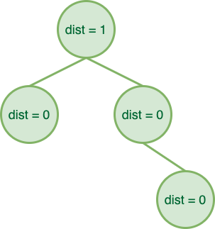{ width=49% }
        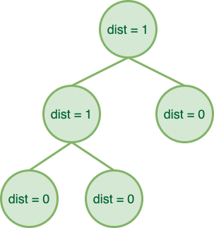{ width=49% }

而左偏堆就建立在这些性质上：

!!! definition "Leftist Heap"
    左偏堆是结点的键值应当不大于（不小于）其孩子结点的键值的二叉树（即堆的性质），且满足「左偏」性质——结点的左孩子的 dist 不小于右孩子的 dist。

    因此，回顾 dist 的定义，我们可以得到扩展性质：

    !!! property "properties"
        1. 结点的 dist 等于 $dist_\text{right child} + 1$（假设 $dist_\text{NULL} = -1$）；
        2. 如果 $dist_i = N$，则以 $i$ 为根的子树**至少**是一个 $N+1$ 层的完美二叉树，至少有 $2^{N+1}-1$ 个结点；

        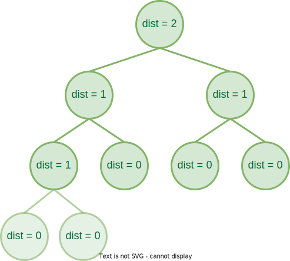{ width=49% }
        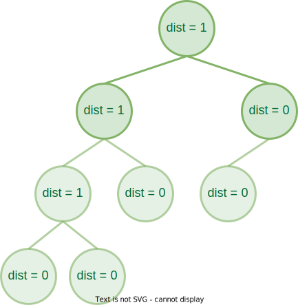{ width=43% }

        > 注意，在示意图中我们省略了结点自身键值的标记，但既然作为一个堆，它就需要满足堆的性质，即结点的键值不大于（不小于）其孩子结点的键值。在实际使用过程中，键值很可能不再是单纯的数，大小关系可能转化为偏序关系。

简单思考一下，为什么左偏堆会这么设计呢？实际上，合并堆需要考虑的非常重要的一个点就是要能在之后的操作中尽可能地维护堆的“平衡”，否则我们把堆维护成了一个链，那显然是非常糟糕的。

而左偏堆通过维护整个堆“左偏”，并不断往右侧合并，来实现每次都是往 dist 相对小的那一侧塞进东西，进而保证了这个堆的相对平衡性。

---

### 操作

左偏堆的核心操作就是合并。而其它操作都可以看作是合并的特殊情况。因此我们首先讨论任意两个左偏堆的合并。

---

#### 合并

作为左偏堆的核心操作，合并操作自然就是要在满足性质的条件下，合并两个左偏堆。大致思路就是**先维护堆的性质**，在**回溯时维护左偏性质**，所以实际上它是一个先自上而下再自下而上的过程。

按照实现方法，左偏堆的合并可以分为**[递归式](#递归式){target="_blank"}**和**[迭代式](#迭代式){target="_blank"}**两种。其中前者可能更为直觉，而后者可视化后则更为直观。

为了方便后续的代码描述，我们首先给出左偏堆结点在本文中的定义：

```cpp
struct LeftistHeapNode {
    ElementType val;
    int dist;
    LeftistHeapNode * ls, * rs;
};
```

---

##### 递归式

递归式先比较当前两个待合并子树的根结点的键值，选择较小（较大）的那个作为根结点，其左子树依然为左子树，右子树更新为「右子树和另一个待合并子树的合并结果」。

当然，在递归地更新完后，我们需要检查左子树和右子树是否满足 $dist_\text{left child} \geq dist_\text{right child}$ 的性质，如果不满足，我们则需要**交换左右子树**来维持性质。

```cpp
LeftistHeapNode * merge(LeftistHeapNode * x, LeftistHeapNode * y) {
    // Recursive exit. If any is NULL, return the other as the new root of subtree.
    if (x == NULL) return y;
    if (y == NULL) return x;
    
    // If `x`'s val is smaller than `y`'s, swap them, which means we always operates on `x`.
    if (x->val > y->val) {
        swap(x, y);
    }
    
    // Merge `x`'s right subtree and `y`, and set `x`'s right subtree to the result.
    x->rs = merge(x->rs, y);
    
    // If `x`'s left subtree's dist is smaller than `x`'s right subtree's dist, swap them.
    if (x->ls->dist == NULL || x->ls->dist < x->rs->dist) {
        swap(x->ls, x->rs);
    }

    // Update x's dist.
    x->dist = x->rs->dist + 1;

    // Return x as the new root of subtree.
    return x;
}
```

!!! eg "🌰"
    现在我们模拟一下这个过程，现在我们有下面两个左偏堆，尝试合并它们。

    === "Frame 0"
        
    === "Frame 1"
        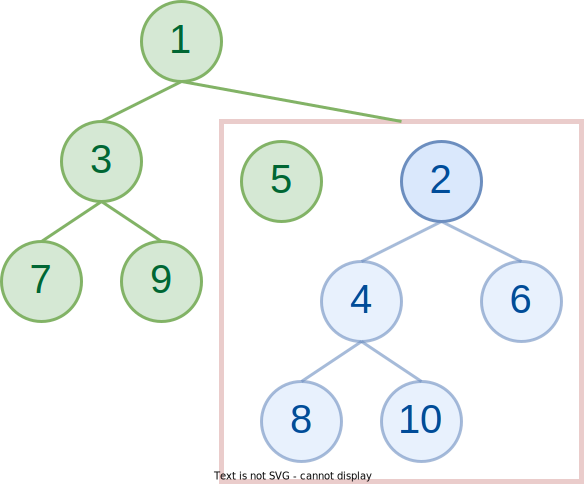

        我们发现，经过比较，<font color=#2ECC71>**❶**</font> 更小，所以我们将 <font color=#2ECC71>**❶**</font> 作为合并后的根结点，左子树不变，右子树更新为「绿树右子树和蓝树的合并结果」。
    === "Frame 2"
        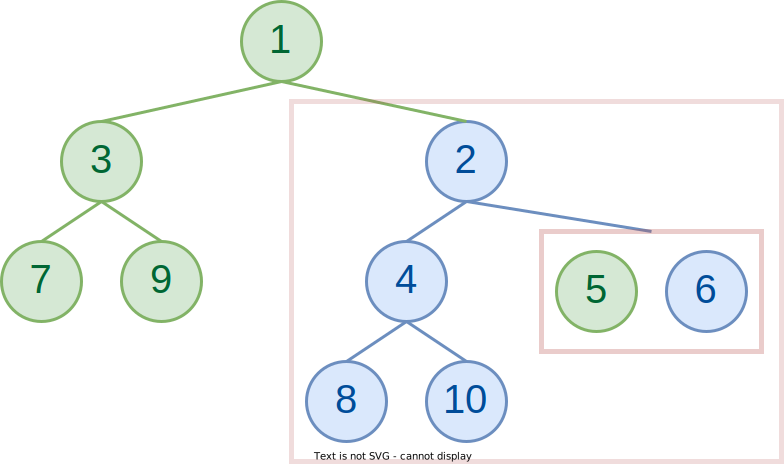

        经过比较，<font color=#2E86C1>**❷**</font> 更小，所以我们将 <font color=#2E86C1>**❷**</font> 作为合并后的根结点，左子树不变，右子树更新为「蓝树右子树和绿树的合并结果」。
    === "Frame 3"
        

        最后还剩下两个结点啦！实际上这里直接模拟了两个步骤，首先是比较 <font color=#2ECC71>**❺**</font> 和 <font color=#2E86C1>**❻**</font>，并选择了 <font color=#2ECC71>**❺**</font> 作为新根；接下来在递归的过程中发现需要合并 `NULL` 和 <font color=#2E86C1>**❻**</font>，所以直接返回了 <font color=#2E86C1>**❻**</font>。

        然而还没有结束，我们还需要处理左右子树 dist 大小关系问题。
    === "Frame 4"
        

        我们发现 <font color=#2ECC71>**❺**</font> 的左孩子为 `NULL`，我们记 $dist_\text{NULL} = -1$，右孩子 <font color=#2E86C1>**❻**</font> 有 $dist_\text{right child}=0$，所以需要交换两个孩子。
    === "Frame 5"
        

        这里也跳过了两个步骤：

        往回走，发现 <font color=#2ECC71>**❺**</font> 的 dist 小于 <font color=#2E86C1>**❹**</font> 的 dist，满足性质，不需要改变。
        
        继续往回走，发现 <font color=#2ECC71>**❷**</font> 和 <font color=#2E86C1>**❸**</font> 的 dist 相同，满足性质，也不需要改变。
        
        从这里也可以看出来，并不是看上去更大的子树一定在左侧。
        

---

##### 迭代式

迭代式是根据它的实现方法来命名的，但是我认为从可视化的角度来理解迭代式可能更有意思。事实上在很多题目中我觉得这个方法做题更加方便。

迭代式维护两个额外的指针，分别指向两棵树还没被合并的子树的根，并不断选择较小的那个合并进去，直到两个指针都为空。可以发现，这个过程和归并排序的后半部分非常相似，实际上当我们从可视化的角度去看这件事以后，会发现这里做的**就是一个归并**。

```cpp
LeftistHeapNode * merge(LeftistHeapNode * x, LeftistHeapNode * y) {
    // `tx` & `ty` are the pointers to the roots of the subtrees that haven't been merged.
    LeftistHeapNode * tx = x, * ty = y;
    // `res` is the root of the merged final tree, while `cur` is the latest node that has been merged.
    LeftistHeapNode * res = NULL, * cur = NULL;

    // Begin merging.
    whie (tx != NULL && ty != NULL) {
        // If `tx`'s val is smaller than `ty`'s, swap them, which means we always operates on `tx`.
        if (tx->val > ty->val) {
            swap(tx, ty);
        }
        
        // Specially mark the root on the first merge.
        if (res == NULL) {
            res = tx;
            cur = tx;
        } else {
            cur->rs = tx;
            cur = cur->rs;
        }

        // Go on.
        tx = tx->rs;
    }

    // Merge the rest of the tree.
    while (ty != NULL) {
        // Specially mark the root on the first merge. (rarely happens but not impossible)
        if (res == NULL) {
            res = ty;
            cur = ty;
        } else {
            cur->rs = ty;
            cur = cur->rs;
        }

        // Go on.
        ty = ty->rs;
    }

    // Adjust the left and right subtrees of all the nodes according to the properties of `dist`. 
    // It does the same work as the adjust part in the recursive version. I ignore it here.
    res = adjust(res);

    return res;
}
```

依旧是以上面进行模拟的那个合并为 🌰 进行模拟。

!!! eg "🌰"
    首先，我们对图片的排版稍微做一些改变，我们不再按照之前画堆的方式去画，而是“左偏”地去画：

    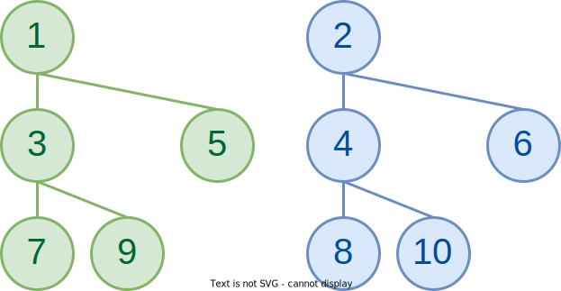

    可以发现，在调整之前

    === "Frame 0"
        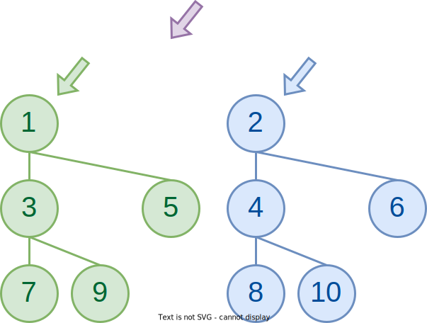

        绿色和蓝色的箭头分别表示两个待合并子树尚未合并的子树的根，紫色箭头表示最近的合并发生的位置。
    === "Frame 1"
        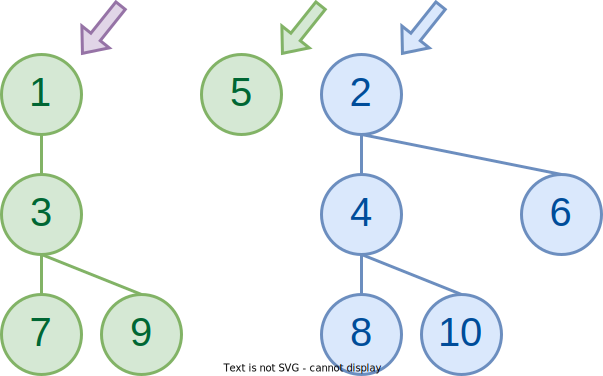

        比较 <font color=#2ECC71>**❶**</font> 和 <font color=#2E86C1>**❷**</font>，发现 <font color=#2ECC71>**❶**</font> 更小，所以我们将 <font color=#2ECC71>**❶**</font> 作为合并后的根结点，左子树随之合并进去，同时更新绿色箭头指向尚未合并进去的 <font color=#2ECC71>**❺**</font>。
    === "Frame 2"
        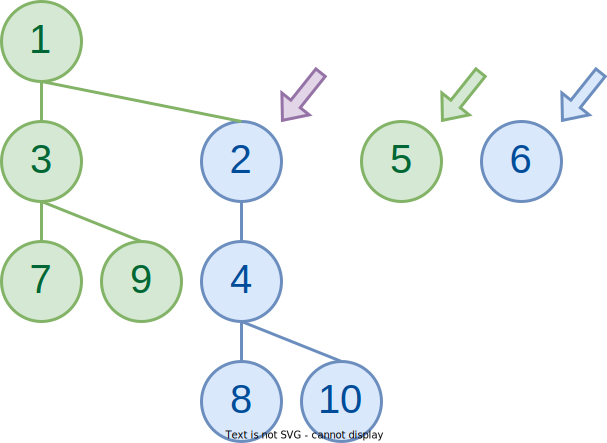

        和上一步类似的，比较 <font color=#2ECC71>**❺**</font> 和 <font color=#2E86C1>**❷**</font>，发现 <font color=#2E86C1>**❷**</font> 更小，所以我们将 <font color=#2E86C1>**❷**</font> 作为合并后的根结点，左子树随之合并进去，同时更新蓝色箭头指向尚未合并进去的 <font color=#2E86C1>**❻**</font>。
    === "Frame 3"
        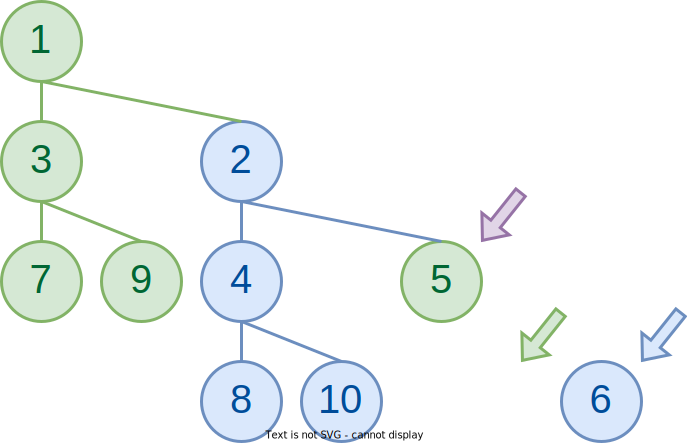

        依然类似地，比较 <font color=#2ECC71>**❺**</font> 和 <font color=#2E86C1>**❻**</font>，发现 <font color=#2ECC71>**❺**</font> 更小，所以我们将 <font color=#2ECC71>**❺**</font> 作为合并后的根结点，左子树随之合并进去，同时更新绿色箭头指向 `NULL`。
    === "Frame 4"
        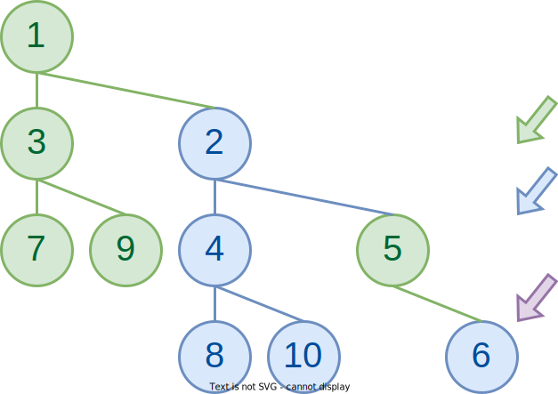

        这时候我们发现已经有一个指针空了，也就是绿色指针已经指向了 `NULL`，这个时候我们只需要按顺序把蓝色指针指向的内容都推进去即可。
    === "Frame 5"
        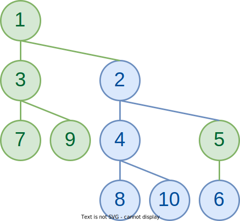

        接下来我们还需要维护 dist 信息并根据性质交换左右子树。这一部分和之前一样，就不再赘述了。

!!! eg "🌰/🔥"

    当然，这么来看可能还是很乱，联想我们之前发现它和归并排序很像，我们还可以用一个更加直观的方式来看这个过程：

    === "Frame 0"
        

        同样从这张图开始，由于我们之前提到的，它类似于一个递归排序的后半部分，具体来说是指合并两个有序数列的过程。

        也就是说，我们可以将这两个左偏堆改写成两个有序数列！
    === "Frame 1"
        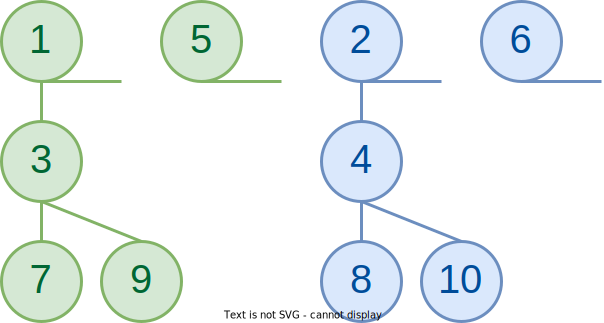

        由于我们在合并过程中总是找右孩子，所以我们就沿着最右沿路径把没个左偏堆拆成这种“悬吊”的带状形式，每一“条”的值取决于根的键值，也就是这一“条”的最顶部。

        在这张图中，我们得到的两个**有序**数组分别是 <font color=#2ECC71>[1, 5]</font> 和 <font color=#2E86C1>[2, 6]</font>，接下来我们将它们进行排序。
    === "Frame 2"
        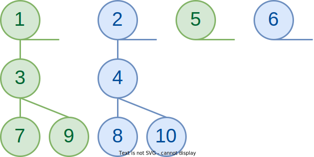 

        经过排序，就会发现它们刚好符合我们在上面步骤得到的结果（可以对比着上面的 Frame 4 看）。实际上，只要你回顾一下归并排序的过程，再对比着看上面的过程，就会发现一模一样。

再次提醒，这一小节讲的部分都忽略了之后调整子树左偏性质的过程，实际上这也就单纯是一个维护堆性质的过程。

---

#### 单点插入

插入结点可以看作合并一个只有一个结点的左偏堆，所以我们可以直接复用合并过程。

---

#### 单点删除

让我们一般性地考虑一个结点，与它相关的主要有三个方向：父结点和两个孩子结点。

而单点删除的操作也很简单，只需要合并需要被删除的结点的两个子结点，然后将这个新的树的根代替被删除的结点，再在回溯的过程中 bottom-up 地更新 dist 即可。

```cpp
LeftistHeapNode * del(LeftistHeapNode * cur, ElementType x) {
    if (cur->val == x) {
        // Just return the merge of the children.
        return merge(cur->l, cur->r);
    } else {
        // Not this subtree.
        if (cur->val > x) return cur;

        // Otherwise, search the `x`.
        if (cur->l != NULL) del(cur->l, x);
        if (cur->r != NULL) del(cur->r, x);

        // Adjust the dist bottom-up.
        adjust(cur);
    }
}
```

---

## Skew Heap

!!! quote "link"
    Wikipedia: https://en.wikipedia.org/wiki/Skew_heap

**斜堆(Skew Hea)**是比左偏堆更为一般的数据结构，它同样有着能够快速合并的性质。

!!! tip "头脑风暴"
    让我们回顾一下左偏堆，由于需要自下而上地维护 dist，所以我们无法进行并发操作。回顾 AVL 树，同样为了维护它比较严格的平衡性质，我们也无法进行并发操作，而红黑树则通过一个能够仅仅通过变色就能调整的黑高来规避了必须自下而上维护的问题，实现了并发。

    换句话来说，要想将左偏堆改变地能够进行自上而下维护，就需要改变甚至放弃它的左偏性质的严格性——而这就是斜堆的由来。

斜堆也需要满足大根堆（小根堆）的性质，而它的合并和左偏堆的合并也十分类似，只不过我们这次**无条件的交换左右子树**，换句话来说，不管左偏性质如何变化，我们都会选择交换参与合并的左右子树，这样我们就不需要在回溯的时候才进行左右子树的交换，于是就实现了完全的自上而下。

让我们来看看 wiki 里给出的 🌰：

!!! eg "🌰 from wikipedia"
    === "Frame 0"
        

        这是我们需要合并的两个堆。
    === "Frame 1"
        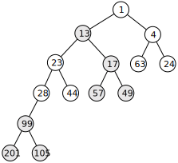

        省略了中间的步骤，可以尝试模拟一下，每一次合并操作结束之后都交换左右子树。

        我们总是先往右侧子树递归下去地合并，没完成一次合并就交换这个子树和它的兄弟姐妹，而它的兄弟姐妹在这次交换完以后就不会再发生改变，而这个子树则会继续进行下一次合并。

~~省略上面的绘图显然是我懒得画了，相信大家在了解左偏堆的合并以后也能很快感受到斜堆是如何合并的。~~

当然，它也是支持迭代的写法的，和是和之前的做法类似，我们可以排序每一“条”，然后再合并。Wikipedia 上提供了一系列的过程图，但是那个过程图有点自下而上的意思，但是实际上自上而下做也是一样的。如果有兴趣可以去看看 Wiki 上的过程：[🔗](https://en.wikipedia.org/wiki/Skew_heap#Non-recursive_merging)。

---

### 合理性分析

然而，随之出现的一个问题上，我们用了这种看起来有点不管三七二十一的做法，那它的正确性如何保证呢？

首先进行感性的理解。我们每合并两个堆都是沿着最右侧路径合并（虽然中间会被不停转到左边），即每次会被改变的子树左右顺序的节点都是最右侧的节点，而再合并过程中如果每次合并都将发生的变化转到左侧，以此来减小合并操作带来的高度“累积”。

!!! extra "进一步解释"
    以每次只插入一个点为例子说明问题。

    进一步对递归旋转到左侧做解释，递归性地转到左侧，使得本来最右侧的路径变到最左侧，即使之后交换会重新访问到这个子树，但此时除了根，其他部分依然是最左侧的路径，也不会再轻易地访问到这次路径。

    用图来做解释的话，就是这样：

    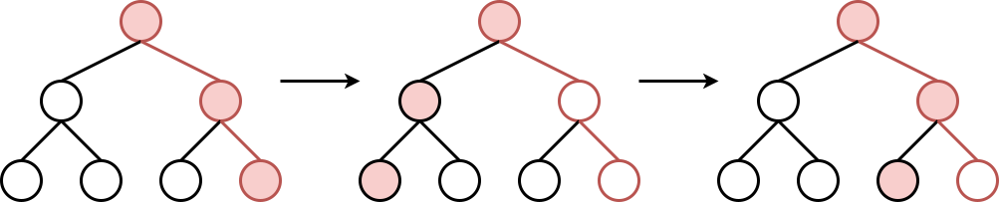

    我们只关注一开始作为最右侧的这三个红点，可以发现，在两次操作后，除了直接作为根的子树的那个节点被转了过来，其他的之后的节点都是作为“最左侧”的节点出现的，虽然图中只有这一个，但是当树的规模变大后，这个优势会更加明显。

    根据这个特点，我们可以非常简单地理解下面这道题：

    !!! eg ""
        === "题面"
            The result of inserting keys $1$ to $2^k−1$ for any $k>4$ in order into an initially empty skew heap is always a full binary tree. (T/F)

            即对于任意的 $k>4$ 的情况，按顺序往一个斜堆里插入 $1\sim2^k-1$ 这些数，得到的结果都会是一个满二叉树。（对/错）
        === "答案 & 解释"
            答案是 T。

            首先，从插入的元素的数量来看，是满足满二叉树的必要条件的。

            而根据我们上面描述的，跳过肯定成立的初始情况，我们可以做一个简单的归纳，过程并不完整与严谨，但是大概就是这么个意思。

            对于一个满二叉树，我们现在要插入一个数，显然这个数比树里任何一个都要大。而当这个数被插入后，它成为整个堆，或者说整个树最左侧的一条。而在接下来的交换过程中，它会不断被甩来甩去，最终经过 2^k 次后被甩到最右边，也就是迎接它的第一个孩子。显然，对于该层的所有节点来说都需要 2^k 次才会进入到最右侧路径。

            （这个过程可以类比二进制数的自增，你可以根据这个节点的每个前驱分别是左孩子还是右孩子来分配对应的位子是 `0` 还是 `1`。）

当然，如上的性质只能帮助我们感性的理解这个正确性。接下来我们从摊还分析的角度来分析其正确性，即其均摊复杂度为 $O(\log N)$。

---

#### 摊还分析

- 前情提要：**[Topic 1 | 摊还分析](Ex01.md#摊还分析)**

这里我们采用**[势能法](https://note.isshikih.top/cour_note/D2CX_AdvancedDataStructure/Lec01/#%E5%8A%BF%E8%83%BD%E6%B3%95)**进行分析。

分析 skew heap 的均摊复杂度，主要就是分析**合并**操作的复杂度，因为其他操作都可以转化为合并操作。

接下来我们需要定义势能函数：

!!! definition "势能函数"
    我们定义 $\Phi(Heap) = \text{number of heavy node in } Heap$。

其中，额外需要定义 heavy node 和 light node：

!!! definition "heavy node & light node"
    对于一个子堆 $H$，如果 $size(H.\text{right\_descendant}) \geq \frac{1}{2}size(H)$，则 $H$ 是 heavy node，否则是 light node。 

    ??? extra "\@ cy'ppt"
        A node p is heavy if the number of descendants of p’s right subtree is at least half of the number of descendants of p, and light otherwise.  Note that the number of descendants of a node includes the node itself.

显然，对于 heavy node 和 light node，以及合并操作，有这么一些性质：

!!! property "properties"
    1. 如果一个节点是 heavy node，并且在其右子树发生了合并（包括翻转），那么它**一定**变为一个 light node；
    2. 如果一个节点是 light node，并且在其右子树发生了合并（包括翻转），那么它**可能**变为一个 heavy node；
    3. 合并过程中，如果一个节点的 heavy/light 发生变化，那么它**原先**一定在堆的最右侧路径上；

列出公式：

$$
\hat{c} = c + \Phi(H_{merged}) - \Phi(H_x) - \Phi(H_y)
$$

其中，$c$ 为合并操作的（最坏）复杂度，$H_{merged}$ 为合并后的堆的势能，$H_x$ 和 $H_y$ 分别为合并前的两个堆的势能。

根据 property 3，在合并过程中并非所有节点都收到影响。我们可以单独记录 $l_{x}$ 为 $H_x$ 最右侧路径上的 light node 数量，$h_{x}$ 为 $H_x$ 最右侧路径上的 heavy node 数量，$h^0_{x}$ 为 $H_x$ 所有不在最右侧路径上的 heavy node 数量（即 $\text{count of heavy nodes of } H_x = H_x + H^0_x$）。

于是，我们可以将上式写开：

$$
\left\{
    \begin{aligned}
        c &= l_x + h_x + l_y + h_y &(1)\\
        \Phi(H_{merged}) &\leq l_x + h^0_x + l_y + h^0_y &(2)\\
        \Phi(H_x) &= h_x + h^0_{x} &(3)\\
        \Phi(H_y) &= h_y + h^0_{y} &(4)
    \end{aligned}
\right.
$$

其中稍微做一些解释：

1. $(1)$：$c$ 为合并操作的（最坏）复杂度，即我们的枚举涉及了两个堆所有的右侧路径；
2. $(2)$：在合并操作以后，根据 property 1 和 property 2，可以得到这个不等式；
3. $(3)$ 和 $(4)$：根据势能函数的定义得到；

于是，将它们代入得到结果：

$$
\begin{aligned}
\hat{c} 
    &= c + \Phi(H_{merged}) - \Phi(H_x) - \Phi(H_y) \\
    &\leq (l_x + h_x + l_y + h_y)
    + (l_x + h^0_x + l_y + h^0_y)
    - (h_x + h^0_{x})
    - (h_y + h^0_{y}) \\
    &\leq 2(l_x + l_y) \\
\hat{c}
    &= O(\log{N})
\end{aligned}
$$