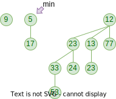
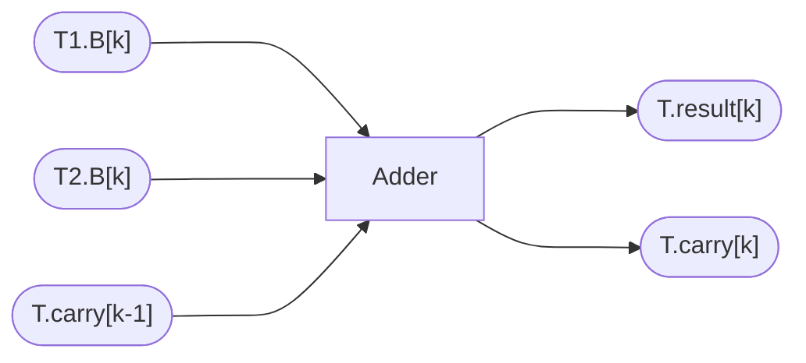
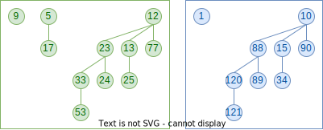
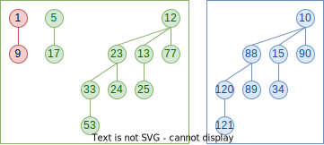
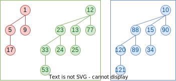
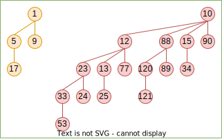
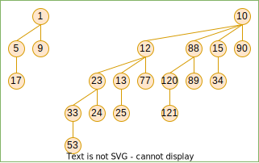
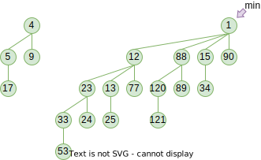
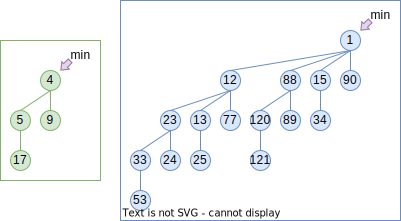
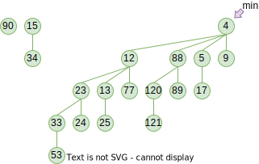

# Lecture 5 | Binomial Queue

## Binomial Queue

堆的其中一个应用就是优先队列。本节要介绍的**二项队列(Binomial Queue)**也是优先队列的一种实现，只不过不同于之前我们用一个堆维护优先队列，二项队列同时维护了具有不同特征的若干队列。

!!! quote "link"
    Wikipedia: https://en.wikipedia.org/wiki/Binomial_heap

    YouTube: https://www.youtube.com/watch?v=6JxvKfSV9Ns （虽然这个视频是讲解斐波那契堆的，但是中间先讲了二项堆。）

!!! tip "学习建议"
    在正式开始本节内容之前，请带着这样一个念头：尽力思考二项队列与二进制的关系。

---

### 概念

**二项队列(Binomial Queue)**本质上是一系列**二项树(Binomial Tree)**的集合。所以我们首先给定**二项树(Binomial Tree)**的定义：

!!! definition "Binomial Tree"
    二项树满足堆的性质，即 parent 节点的值小于（大于） child 节点的值。

    一个非常关键的性质是，$k$ 阶二项树都是同构的，且 $k$ 阶二项树是两个 $k-1$ 阶二项树合并得到的。而其合并方式是直接令其中一棵成为另外一棵的根的新 child，这也决定了二项树的根每一个 child 本身也都是一个二项树。

    
 { width=75% } 

    显然能够得到，**二项树并非二叉树**；更进一步的，$k$ 阶二项树 $B_k$ 的根有 $k$ 个 child，$2^k$ 个节点；再进一步的，$B_k$ 的第 $d$ 层一共有 $C_k^d = \binom{k}{d}$ 个节点，有趣的是，所有层的节点加起来刚好符合二项式定理，此条定理可以由数学归纳法很容易地证明，不再赘述。

!!! tip "关于实现"
    可以发现，二项树是一个 $N$ 叉树，所以通常我们使用链表 sibling 的形式来表示一个节点的 children。

再对二项树做一个简单的总结，$k$ 阶二项树结构唯一确定，两个 $k$ 阶二项树合并后得到一个 $k+1$ 阶二项树，而二项树本身也具有堆的性质。

但是，虽然二项树具有堆的性质，看似能独立完成优先队列的功能，但是二项树对点的数量具有比较严格的要求，只有点的数量符合 $2^k$ 时，才能使用二项树表示。因此，观察一个二项树能承载的点的数量特征，我们联想到二进制对数的表示——我们可以用一系列二项树来维护 $N$ 个节点的优先队列，而具体用几阶二项树，则取决于 $N$ 的二进制表达中，为 `1` 的是哪几位。

!!! definition "Binomial Queue"
    **二项队列(Binomial Queue)**是一系列**二项树(Binomial Tree)**的集合，其中每个二项树的阶数 $k$ 都是不同的，反过来讲这句话，集合中 $k$ 阶的二项树要么只有一个，要么没有。

    !!! eg "🌰"
        
 { width=75% } 

        > 题目实现的二项队列不一定有 min 指针！注意面向题面和选项判断实现。

而为何要这么设计二项队列的结构，具体体现在操作的设计中。

---

### 操作

在二项队列中，合并是一个非常基础的操作，也是精髓所在。

而为了感受这些操作的精髓，在理解二项队列过程中，可以试图从两个纬度同时理解这些操作：

1. 树/堆的纬度，具体观察数据的转移与变化过程；
2. 二进制的纬度，将 $k$ 阶二项树抽象为 bit vector 第 $k$ 位的 `1`，从二进制加法的角度理解；

为了方便后面阐述，我们简单做一下说明：

!!! definition "特征比特向量"

    对于一个二项队列，定义它的**特征比特向量**（我自己口胡的东西，不是术语）是它的**元素数量**的二进制表示（反过来说，特征比特向量的真值表示队列中的元素数量）。

    !!! eg "🌰"
        例如下图的例子，一共有 11 个节点，其特征比特向量为 `1011`，刚好对应 $B_3$ $B_1$ $B_0$。

        
 { width=75% } 

    也就是说，特征比特向量象征了二项队列的集合中有哪几阶的二项树。

---

#### 队列合并

合并两个二项队列，实际上就是合并两个集合，合并过程中，我们分别合并每一个 $k$ 阶二项树，当两个二项队列都存在 $k$ 阶二项树时，它们合并为一棵 $k+1$ 阶二项树。可以联想，这项操作“对应”着特征比特向量的相加，而合并操作则类似于进位。

因此，它就类似于一个 1bit 的全加器。

于是，根据一个 carry 位、一个被合并树和一个合并树的情况，有一共 $2^3=8$ 种可能。

!!! eg "🌰"
    假设我们现在有这样两个二项队列需要合并：

    
 { width=75% } 

    则其合并的操作可以这样描述。

    === "特征比特向量视角"
        绿色二项队列的特征比特向量为 `1011`，蓝色的为 `1001`，两者相加得到 `10100`。
    === "具体视角"
        !!! section ""
            === "Frame 1"
                
 { width=72% } 

                $B_0$ 合并，由于 $T_{green}.B_0$ 和 $T_{blue}.B_0$ 都存在，所以合并产生为 $T.C_0$，$T.R_0$ 为空。
            === "Frame 2"
                
 { width=70% } 

                $B_1$ 合并，由于 $T_{green}.B_1$ 和 $T.C_0$ 存在，所以合并产生为 $T.C_1$，$T.R_1$ 为空。
            === "Frame 3"
                
 { width=70% } 

                $B_2$ 合并，由于只有 $T.C_1$ 存在，所以直接令 $T.R_2 = T.C_1$，$T.C_2$ 为空。
            === "Frame 4"
                
 { width=70% } 

                $B_3$ 合并，由于 $T_{green}.B_1$，$T_{blue}.B_1$ 和 $T.C_2$ 都不存在，所以 $T.R_3$ 为空，$T.C_1$ 为空。
            === "Frame 5"
                
 { width=64% } 

                $B_4$ 合并，由于 $T_{green}.B_4$ 和 $T.C_3$ 都存在，所以合并产生为 $T.C_4$，$T.R_4$ 为空。
            === "Frame 6"
                
 { width=64% } 

                $B_5$ 合并，由于只有 $T.C_4$ 存在，所以直接令 $T.R_5 = T.C_4$，$T.C_5$ 为空。

---

#### 单点插入

插入结点可以看作合并一个只有一个结点的左偏堆，所以我们可以直接复用合并过程。

---

#### 查询队首

二项队列的队首，也就是整个队列的最小值（最大值），就是这若干个（$O(\log N)$ 个）二项树的根中最小（最大）的那个。所以其时间复杂度为 $O(\log N)$。

不过有时候我们也会额外维护一个指针，指向当前最小的那个根，此时其复杂度为 $O(1)$。

---

#### 队首出队

队首出队首先要找到队首，这件事我们在**[#查询队首](#查询队首){target="_blank"}**已经讨论过了。

找到队首后，我们将其从二项队列中移除，我们知道，队首必然是某个二项树的根，所以删掉这个队首以后，就会产生 $k$ 个新的子树。

而让我们**回顾二项树的合并过程**，可以发现，根的所有儿子都是一个完整的 $k$ 阶二项树合并过来的，所以当我们删掉这个根，产生的所有子树都是二项树。

因此我们联想到，将队首出队问题转化为合并二项队列的问题——假设 $T$ 的队首是 $B_k$ 的根，则队首出队可以转化为求解 $merge(T-B_k, B_k.root.children)$ 的问题。

!!! eg "🌰"
    假设我们有如下的二项队列，现在进行弹出队首的操作。

    
 { width=75% } 

    === "特征比特视角"

        如上队列，其特征比特向量为 `10100`，共 20 个节点。现在删掉一个，应当有 19 个节点。
        
        更具体的，`10100` = `10000` + `100`，分别代表两个二项树，而我们的最小值是从 `10000` 所代表的树里删除的，所以新的特征比特向量为：(`10000` - 1) + `100` = `1111` + `100` = `10011`，即 19 个。
        
        注意观察这里 `10000` - 1 = `1111` 的变化，寻找它与具体视角中的关系。

    === "具体视角"

        !!! section ""
            === "Frame 1"
                
 { width=75% } 

                首先找到队首，即此时 min 指针指向的地方。观察它的结构，我们发现它具有四个子树，分别是 $B_0 \sim B_3$，对应了我们之前提到的「根的所有儿子都是一个完整的 $k$ 阶二项树合并过来的」。
            === "Frame 2"
                
 { width=75% } 

                于是我们将这个子树提取出来，将原本的二项队列拆成为两个二项队列。
            === "Frame 3"
                
 { width=75% } 

                现在我们删除“队首”，发现那棵树分裂成了四个连续的二项树（`10000` - 1 = `1111`）。
            === "Frame 4"
                
 { width=75% } 

                现在问题就转化为了两个二项队列合并的问题。在此省略。

                注意观察完成的二项队列的特征比特向量和上面的特征比特向量视角的结果。

!!! tip "提示"
    支持着队首出队可以这样进行的性质就是，每一个二项树的根的 children 本身也都是二项树。

---

### 摊还分析

---

## Project: Fibonacci Queue

!!! quote "Link" 
    YouTube: https://www.youtube.com/watch?v=6JxvKfSV9Ns