# Lecture 10 | NP Completeness

!!! info "导读"
    由于本节涉及较多概念，并且知识树长的很蓬松，所以我决定尝试非线性组织内容，因此本文的阅读顺序可能也并不会是线性的。
    
    所有提到的、并且本文会介绍的相关内容，都会以**[链接和放大镜🔍](#lecture-10--np-completeness)**的形式出现。推荐使用鼠标中键等打开新标签页查看，方便回溯。

    因此推荐的阅读顺序是，顺着读下去，每次出现 🔍 都进行深度优先搜索式的学习，直至看完全文。

    其中，在 **[相关概念](#相关概念)** 之后的部分，我会保证在前面都有提及，而其之前的内容，推荐都在顺序阅读中涉及。
    
## 概述

!!! quote "Links"
    OI Wiki: https://oi-wiki.org/misc/cc-basic/

    Wikipedia: https://en.wikipedia.org/wiki/P_versus_NP_problem

    Wikipedia: https://en.wikipedia.org/wiki/NP-completeness

    Wikipedia: https://en.wikipedia.org/wiki/NP-hardness

根据问题的难度，由不同的定义划分，问题可以分为：

**P** 问题(polynomial time)、**NP** 问题(nondeterministic polynomial time)、**NPC** 问题(NP complete)、**NPH** 问题(NP hard)。除此之外 ，我们还需要额外了解不可计算问题(undecidable)。

由于不可计算问题比较特殊，所以我先放在前面介绍。

??? definition "Undecidable Problem"

    !!! quote "Links"
        Wikipedia: https://en.wikipedia.org/wiki/Undecidable_problem

    **不可判定问题(undecidable problem)**是一类特殊的[决定性问题](https://en.wikipedia.org/wiki/Decision_problem)，它的特点是我们无法设计一个算法来求解它的结果。

    其中一个比较典型的例子就是**[停机问题🔍](#halting-problem)**。

我们可以用这样一张图来表示其他几个概念的关系：

<center>
    { width=60% }
</center>

> Source: https://en.wikipedia.org/wiki/NP-hardness

可以粗浅的按照图中的“Complexity”轴来理解其中的转化关系，接下来给出它们的详细定义：

!!! definition "P"
    P 取自 polynomial time，指的是可以用**[确定型图灵机🔍](#图灵机)**在**多项式**时间内**解决**的问题。
    
    也就是我们通常意义下所说的，可以在**多项式**时间内**解决**的问题。

!!! definition "NP"
    NP 即 nondeterministic polynomial time，指的是可以用**[非确定型图灵机🔍](#图灵机)**在**多项式**时间内**解决**的问题。这个说法等价于可以用**[确定型图灵机🔍](#图灵机)**在**多项式**时间内**验证**（判断答案是否正确）。
    
    也就是我们通常意义下所说的，可以在**多项式**时间内**验证**的问题。

!!! definition "NPC"
    NPC 即 NP complete，NP 完全，是 NP 中最难的**决定性**问题（并不是无限定词的最难的问题！）。而我们称满足如下条件的问题为 NPC 问题：

    1. 是一个 NP 问题；
    2. 所有 NP 问题都可以**[多项式时间归约🔍](#多项式时间归约)**为该问题；

    由 2 可以有结论，所有的 NPC 问题难度相同——一旦有一个 NPC 问题被解决，那么所有 NPC 问题，乃至所有 NP 问题都能被解决。

    如果我们试图证明一个问题是 NPC 问题，我们可以通过这种手段：

    1. 判定该问题是一个 NP 问题；
    2. 判定一个已知的 NPC 问题可以**[多项式时间归约🔍](#多项式时间归约)**为该问题；

    > 第一个被证明是 NPC 的问题是 **[Circuit-SAT🔍](#circuit-sat)** 问题。

!!! extra "P ?= NP & NPC"
    关于 P 和 NP 的关系，我们仍然不知道 P 是否能等于 NP，即我们仍然不知道是否存在多项式算法可以解决一切 NP 问题。

    而其中的关键就是，如果我们能找到 NPC 问题的多项式解法，那么就可以证明 P = NP。

!!! definition "NPH"
    NPH 即 NP hard，NP 困难，它不一定需要是 NP 问题。而所有 NP 问题都可以**[多项式时间归约🔍](#多项式时间归约)**为 NPH 问题。

---

## 课内案例

### Halting Problem

!!! quote "Links"
    Wikipedia: https://en.wikipedia.org/wiki/Halting_problem

停机问题是一个典型的不可计算问题，它指的是，对于任意一个程序，我们无法设计一个算法来判断它是否会在有限时间内停机（即判断程序是否会死循环）。

我们通过反证法可以证明：

假设存在函数 `willHalt(func F)` 可以判断函数 F 是否会停机，如果会，则返回 `true`，否则返回 `false`。那么我们可以构造一个这样的函数 `foo()`：

```cpp
void foo() {
    if ( willHalt(foo) ) {
        while (true) {} // Endless loop.
    }
    return;
}
```

接下来，如果我们想知道 `foo()` 是否会停机，就会执行 `willHalt(foo)`。然而在 `foo()` 内部也运行了一次 `willHalt(foo)`，如果它认为 `foo()` 会停机，则构造一个死循环；而如果它认为 `foo()` 不会停机，则选择让它立刻停机，于是这里就产生了矛盾。

理解上面这段内容的关键就是，这里虽然不存在事实意义上的“死循环”，但可以理解为这里存在一个逻辑上的递归，而这种“逻辑上的递归”，正是导致停机问题成为一个不可计算问题的原因。

---

### Circuit-SAT


---

## 相关概念

!!! info "说明"
    以下部分的内容是为了进一步说明上文中部分内容而介绍的概念，并不具有组织结构。

---

### 图灵机

!!! quote "Links"
    Wikipedia: https://en.wikipedia.org/wiki/Turing_machine

    Wikipedia: https://en.wikipedia.org/wiki/Nondeterministic_Turing_machine

图灵机有一些变体，而我们在这里引入图灵机是为了介绍 P/NP，只介绍**确定型图灵机**和**非确定型图灵机**。

> 图灵机由一个**无限长的纸带**和一个**读写头**组成。纸带被划分为一个个**格子**，每个格子上有一个**符号**，读写头可以在纸带上移动，读写头可以读取当前格子上的符号，也可以改变当前格子上的符号。图灵机的**状态**是一个有限集合，每个状态都有一个**转移函数**，转移函数的输入是当前状态和当前格子上的符号，输出是下一个状态、下一个格子上的符号和读写头的移动方向。

更本质的来说，图灵机是一种**计算模型**，我们可以用它来表示任何有限逻辑数学过程。确定型图灵机与我们常规理解的计算机逻辑类似，即下一步要做什么可以根据当前状态确定。而非确定型图灵机则类似于能够进行无限并行，并且最终总是选择通向正确答案的方向的那条路（有点类似于它能开平行宇宙，并且总是让你观测到正确的那一个平行宇宙）。

---

### 多项式时间归约

!!! quote "Links"
    Wikipedia: https://en.wikipedia.org/wiki/Polynomial-time_reduction

我们引入 P/NP 等这些概念，是为了衡量问题的复杂程度，而如何在具体的“问题”间传递、比较这种“复杂程度”，就是**多项式时间归约(polynomial reduce)**的目的。

```mermaid
graph LR;
A["问题 A"]
B["问题 B"]
A ===>|"多项式时间转化"| B
```



如果我们能在多项式时间的复杂度内，将问题 A 转化为问题 B，则称问题 A 可以**多项式时间归约(polynomial reduce)**为 B，记为 $A \leq_{p} B$，表示 A 不会比 B 难。

而采取数学语言来描述，则是：

$$
\begin{aligned}
A \leq_{p} B 
\;\;\Leftrightarrow\;\;
& \exist f() \text{ which runs in polynomial time}, \\
& s.t.    \;\; \forall x \in A,\; f(x) \in B \\
& \text{and}\; \forall f(x) \in B,\; y \in A
\end{aligned}
$$

---