# Chap 3 Combinational Logic Design

!!! info "引入"
    按照功能，逻辑电路分为两类：
        
    - **组合电路(Combinational Circuit)**
        - 拥有 m 个输入和 n 个输出，其中包含了 $2^m$ 种输入组合，以及对应的 n 个不同的函数；
        - 最关键的是，它的 **输出只依赖于这 m 个输入的组合**（不包含回路）；
    - **时序电路(Sequential Logic Cirtuit)**
        - 与之对应的，时序电路具有记忆功能，即它的输出可能会依赖之前的结果；

而本章将着眼于组合电路的相关内容，时序电路的相关内容将在 **[下一章](Chap04.md)** 介绍。

## 组合电路设计

!!! note "表示逻辑的方法"
    1. <u>真值表(Truth Table)</u>；
    2. 布尔函数(Boolean Function)；
    3. <u>卡诺图(Karnaugh Maps)</u>；
    4. <u>时序图(Timing Diagram)</u>；
    5. 逻辑电路图(Logic Circuit)；

    其中，下划线的方法在功能确定的情况下，其表示是唯一的。

而我们的设计，就是在满足功能的前提下，尽可能优化和找到最好的设计。

而主要的设计过程如下：

1. 确定系统的行为；
2. 阐述输入和输出之间的逻辑关系，并用真值表或逻辑表达式表达出来；
3. 优化逻辑表达以减少成本(比如使用卡诺图)；
4. 将优化后的逻辑设计工艺映射到硬件实现上；
5. 验证正确性（在仿真环境中）；

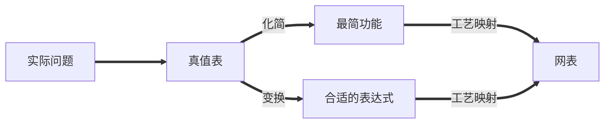

---

### 分层设计

分层设计即将复杂问题模块化分解为若干层次，然后逐个抽象解决。

其设计方法分为 **自顶向下(Top-Down)** 和 **自底向上(Bottom-Up)**。

前者从需求开始，自顶向下分解功能设计；后者根据现有的元件去组合成目标功能。

---

#### 集成电路

**集成电路(integrated circuits)** 又叫 **芯片(chip)**，分为如下若干等级：

- SSI(small-scale integrated) 内含不到 10 个 gates；
- MSI(medium-scale integrated) 内含 10 ~ 100 个 gates；
- LSI(large-scale integrated) 内含 成百上千 个 gates；
- VLSI(very large-scale integrated) 内含 成千上亿 个 gates；

---

### 技术参数

门的实现主要通过这些参数特性来描述：

| Name                  |Description|
|:----------------------|:--|
| **Fan-in**            | 一个门可用的输入 |
| **Fan-out**           | 一个栅极输出驱动的标准负载数量 |
| Logic Levels          | 被认为是高低电平的输入输出电压范围 |
| Noise Margin          | 对外界噪声的容忍能力(具体来说是不会导致行为异变的最大噪声压值) |
| Cost for a gate       | 继承电路的门成本 |
| **Propagation Delay** | 信号改变后从输入到输出所需的变化时间 |
| Power Dissipation     | 电源输出能耗和门的能耗 |

---

#### 扇入扇出

扇入描述了一个门能够接受的最多输入量，如一个四输入与非门的扇入就是 4；而扇出描述的则是一个门的输出(栅极输出)在不降低工作性能的情况下能够负载多少门，例如一个非门的输出能够同时负载 4 个非门并且都能正常工作，则其扇出为 4，其也能通过标准负载来定义。

!!! note "标准负载"
    所谓的标准负载，是衡量“负载”的一个“单位砝码”。其大小等于一个非门(逆变器)贡献的负载压力。

那么要如何评估负载呢？首先我们引入 **过渡时间(transition time)**：

---

##### 转换时间

转换时间分为 $\mathrm{t_{LH}}$(rise time) 和 $\mathrm{t_{HL}}$(fall time) 两个部分。

- rise time 等于栅极输出从 $\mathrm{V_{CC}}$ 的 10% 升高到 90% 所需要的时间；
- fall time 等于栅极输出从 $\mathrm{V_{CC}}$ 的 90% 降低到 10% 所需要的时间；

通过时序图表示就是这样：

---

随着负载增加，转换时间也会增加（给电容充电的时间增加），而扇出定义中提到的“最大负载”，就是指它的转换时间不超过它预定的最大转换时间。

> 从左到右表示负载不断增加时，rise time 的变化趋势。

实际上，类似的，超出扇入后，门对输入的反应就太慢了。

---

#### 传播延迟

**传播延迟(propagation delay)** 衡量了门的输入变化导致输出变化所需要的时间。由于从低电平转化到高电平和高电平转化到低电平所需要的时间不一样，所以传播延迟同样有两个部分，分别使用 $\mathrm{t_{PHL}}$ 和 $\mathrm{t_{PLH}} 来表示$。

更具体的来说，传播延迟的计算方法是输入和输出的变化中点（即变化到 $\frac{1}{2}V_{CC}$ 时）的时间差，通过时序图表示就是这样：

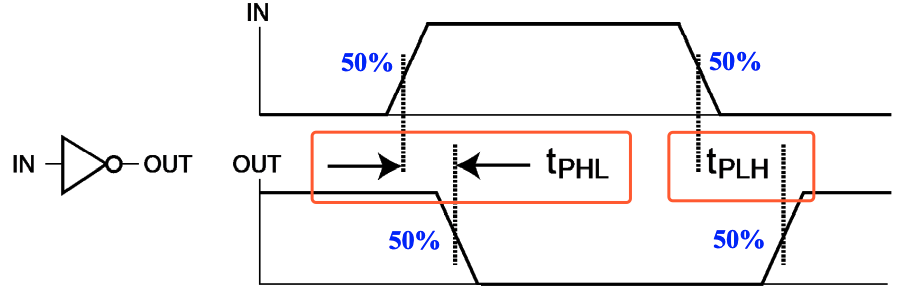

> 此外，我们还可以引入 $\mathrm{ t_{pd} }$ 来统一表示 $\mathrm{t_{PHL}}$ 和 $\mathrm{t_{PLH}}$。数值上，$\mathrm{ t_{pd} } = average(\mathrm{t_{PHL}}, \mathrm{t_{PLH}})$ 或 $\mathrm{ t_{pd} } = max(\mathrm{t_{PHL}}, \mathrm{t_{PLH}})$。

!!! note ""
    === "题面"
        根据时序图，写出门的传播延迟，此处 $\mathrm{ t_{pd} } = average(\mathrm{t_{PHL}}, \mathrm{t_{PLH}})$。

        
    === "答案"
        

!!! question "Transition Time vs. Propagation Delay"
    转换时间专注于输出的变化，而传播延迟则包含了输入的变化和输出的变化整个过程。

    从时序图上的表示来看，转换时间只需要输出的时序图即可表示；但传播延迟则是通过比较输入和输出的偏差来表示的。

    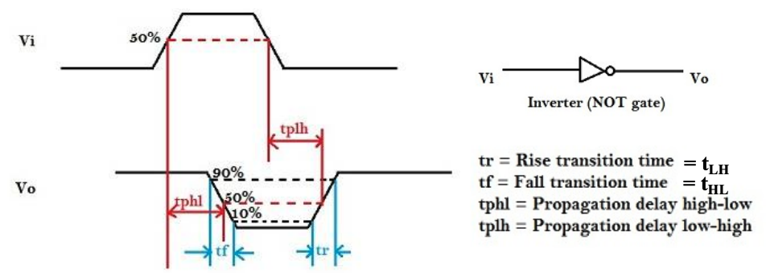

---

### 延迟模型

为了研究为什么会存在门延迟，刻画门的 **固有门延迟(inherent gate delay)**，我们需要对其建模，常见的 **延迟模型(delay model)** 有以下两种：

- 传输延迟(transport delay): 认为输入和输出之间的延迟是一个定值的；
 

- 惯性延迟(inertial delay): 引入了 **拒绝时间(rejection time)**，只有当输入达到一定能量后，才会出发栅极输出（在这种模型下，噪音等会被过滤）；

将不存在延迟的模型、传输延迟模型和惯性延迟模型做比较地来看，就是如下情况：

---

### 延迟以及相关问题

!!! info "引入"
    由于实际电路中实现延迟，数学上的逻辑表达式与实际电路情况会存在不同——即存在若干数学上无法直接解决的问题。

    所以研究延迟是非常必要的。

---

#### 延迟计算

计算一个电路的延迟时，有两方面需要考虑，一方面是电路自身所导致的一个固定延迟，另外一方面则是由于不同的负载导致的额外延迟。

> 在这个例子中，0.07 为固定延迟，0.021 为一个标准负载带来的延迟系数，SL(4.5 here) 则是标准化的负载量。

而具体的表达式，会在 Cell Library 里写。

---

#### 延迟带来的问题

由于存在延迟，许多在数学意义上没有问题的逻辑表达式在电路中就存在非常大的问题。

例如，从数学角度看，$\mathrm{Y=\overline{A}A}$ 的值恒为 `0`，但是实际上由于延迟，其仿真波形中会出现这样一个 **毛刺(glitch)**，而这在工程意义上有很大的问题。

???+ note "更复杂的 🌰"
    让我们分析下面这个二路选择器，其功能是通过 S 控制输出表达的是 A 还是 B，在传输延迟模型下，其波形如下：

    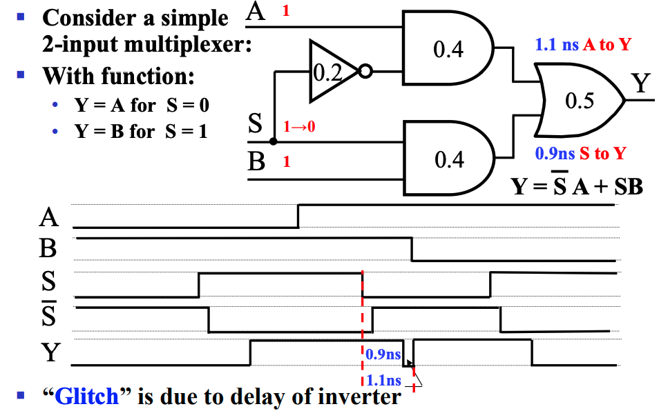
    > 可以发现，Y 中出现了意料之外的毛刺。

    而这中毛刺可以用添加冗余项来解决：

    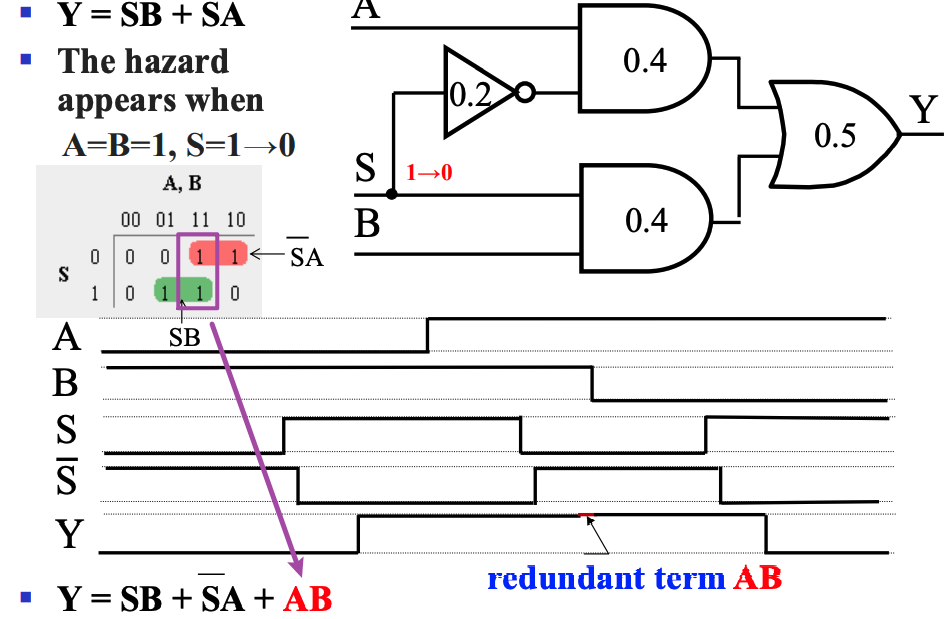

---

### 正逻辑和负逻辑

**正逻辑(positive logic)** 就是 `1` 是有效信号，**负逻辑(negative logic)** 就是 `0` 是有效信号。而在正逻辑中 AND 门的作用就等效于负逻辑中 OR 门的作用，这也正是我在前面几章的笔记中提到的对称。

而正逻辑的电路的符号一般就是正常的逻辑门符号，而负逻辑的逻辑门符号则可能有小三角标，即 **极性指示器(polarity indicator)**：

> 如图，左侧是正逻辑电路的符号，右侧是负逻辑电路的符号。

---

### 工艺映射

**工艺映射(technology mapping)** 是指将逻辑图或网表转化为可以用工艺实现的心的图或网表的过程。

有时我们会使用与非门和非门替换与门和或门(因为电路层面，与门实际上就是通过与非门实现的)，然后会发现有一些连续对非门可以相互抵消，例如下面的情况：

> 蓝绿色块中即为被替换后的内容，然后我们发现出现了若干可以抵消的非门。

当然，也可以通过或非门来实现，比如下面的情况：

---

### 验证正确性

**验证正确性(Verification)**指的是证明最终设计的电路能够实现预期**产品规格（Specification）**。 
简单的产品规格可以用真值表、布尔代数式、HDL 代码等描述。

最基本的验证正确性方法有：

- 人工逻辑分析(Manual Logic Analysis)：
    - 找到最终电路的真值表或布尔代数式，判断其是否和预期产品规格一致；
- 仿真(Simulation)：
    - 在仿真环境中，使用合适的测试输入（激励信号）来测试最终电路（或其网表，可能编写为 HDL），通过观察其响应结果来判断是否实现预期产品规格；

!!! question "Why Simulate?"

    我们曾在数逻实验中验证过二输入与非门的正确性，那时我们采用人工逻辑分析，通过测试确定了待测门的真值表，并将其与标准的二输入与非门真值表比较，从而判断我们的二输入与非门是否正确实现；

    但如果我们需要验证一个一百万输入与非门的正确性呢？（仅用于举例）

    我们发现，在现实世界中人工求解这个电路的真值表或布尔代数式是不可能的。这时候我们可以设计一组具有代表性的输入（仍然是个不小的数目），让计算机在仿真环境中用这组输入去测试电路，并将测试结果与预期结果进行对比。我们无法确保验证是否**充分**，但至少这是实践意义上**足够充分**的验证。

---

## 组合逻辑

---
### 基本逻辑函数

- **常量函数(Value-Fixing)**：$F=0\;\;or\;\;F=1$ | 输出定值；
- **传输函数(Transferring)**：$F=X$ | 直接输出输入值；
- **逆变函数(Inverting)**：$F=\overline{X}$ | 输出输入的相反；
- **使能函数(Enabling)**：$F=X\cdot En \;\; or \;\; F = X + \overline{En}$ | 通过使能控制输出是否可变，分为两种，比如与的形式中，只有 $En$ 为 `1` 时，$F$ 表现为 $X$ 的值；反之输出必定为 `0`（注意区分它与三态门的区别，高阻态 or 定值）；

---

### 基本功能块

- 译码器(Decoder)
- 编码器(Encoder)

- （三端）多路复用器(Multiplexer) `MUX`
- （三端）信号分配器(Demultiplexer) `DEMUX`

---

#### 译码器

穷举可能性，稠密 -> 稠密/稀疏

为了节省门输入成本，我们常常使用 **分级** 的思想来构造多输入多译码器。

!!! eg "eg"

    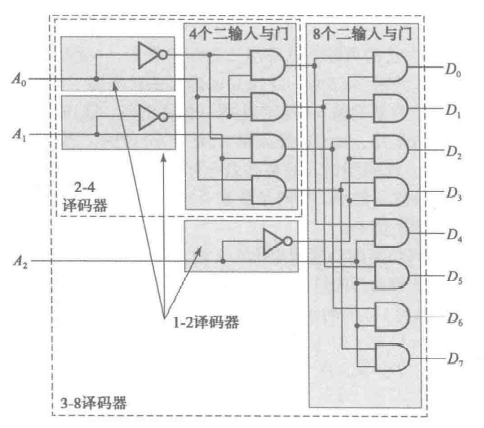

    由于底层的电路能够直接实现的运算十分局限，所以需要用译码器来实现一些基础运算，例如加法。

    一位加法器就可以通过译码器和或门实现，核心就是枚举输入的各种情况，然后用或门拾取 sum 和 carry 的最小项。

    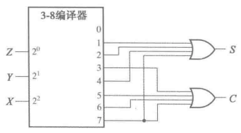

---

#### 编码器

稠密/稀疏 -> 稠密

> 如上定义的编码器有一个限制，即任何时候输入只能有一个是活动的，即输入是 one-hot 的。

!!! summary "优先编码器"
    优先编码器能够实现优先级函数，它不要求输入是 one-hot 的，而是总是关注有效输入中优先级最高的那一个。即比如当优先级最高的那一位是 `1` 时，其它所有优先级不如它的位置的值都是我们不关心的内容了。

    !!! eg "中断(interrupt)判优器"
        优先编码器的一种应用就是中断判优器。

        
        > 其中 $V$ 表示输出是否有效，在中断判优系统中即表示是否有中断请求。

---

#### 多路复用器

通过控制端选择输出的是若干输入中的哪一个。

通过三态门来实现 `MUX` 能够降低门输入代价。

???+ eg "eg"

    
    > 完全使用三态门来实现四输入 `MUX`，门输入大大减少。

`MUX` 还可以 **实现任意的逻辑函数**：

- 将控制端当作输入，原来的输入当作结果；
- 即可以将一个四输入 `MUX` 当作一个二输入的函数；

换句话来说，就是将原来的控制端当作输入端，并在原来的输入端写入逻辑函数的真值表，以实现任意逻辑函数。

我们还可以通过把一部分的输入当作常量端来简化元件（降维）：

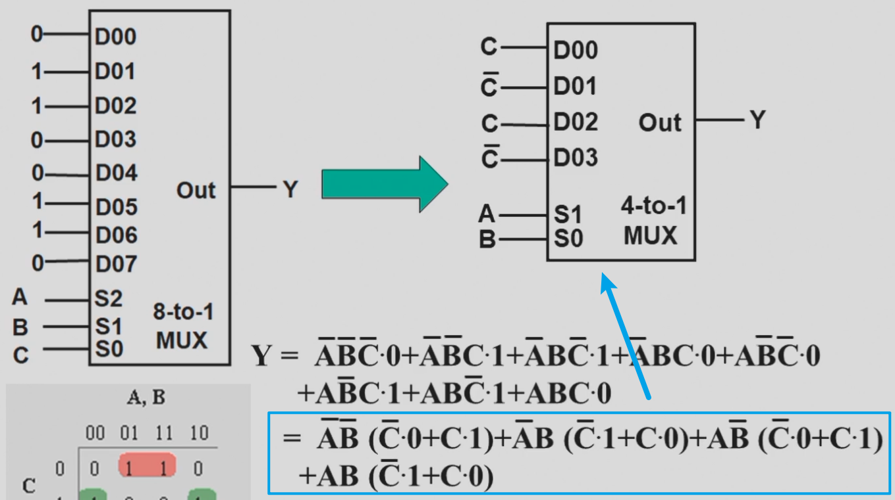

观察其最小项，使其输出所有最小项。但是在降维过程中并不需要全都是 C，如果卡诺图中存在双 `1` 或者双 `0`，也可以仍然使用常量。

---

#### 信号分配器

简写为 `DEMUX`，通过控制端选择输入给到若干输出中的哪一个。

---

后续 👉 **[可重编程技术](Chap05.md#可重编程技术)**

---

## 算术逻辑电路

我们主要讨论的计算主要包括逻辑运算和算术运算，前者由于可以直接通过基本门很方便实现，所以我们不过多考虑；在此主要介绍算数运算。在计算机硬件中，承担计算工作的主要部件为 `ALU`(Arithmetic Logical Unit)。

---

!!! info "引入"
    在之前 **[#译码器](#编码器)** 和 **[#多路复用器](#多路复用器)** 的部分中已经介绍过一些实现 1 bit 加法器的方法，接下来我们就来详细看看加法器这个东西。

    首先我们需要了解加法器最底层的单元，即实现 1 bit 运算的 **半加器(half adder)** 和 **全加器(full adder)**，接下来需要将他们组合在一起，实现 n bits 的加法器，其中主要介绍 **行波加法器(binary ripple carry adder)**。此外，基于一些编码的知识，我们还可以将它改装成加减法器。

---

### 半加器 & 全加器

对于二进制加法，其输出无疑有当前位的和 `S` 和进位 `C`，而输入除了两个操作数 `X` 和 `Y` 以外，还可能有上一位的进位 `Z`(或者`C{n-1}`)。而对于一个二进制数的第一位，显然不会有进位，或者说 `Z=0`，所以我们可以将这个 `Z` 去掉，即输入只有 `X` 和 `Y`，这就是 半加器(half adder)；显然，对应的，如果输入中有上一位的进位 `Z`，则称为 **全加器(full adder)**。

!!! note ""

    === "半加器"
        !!! note ""
            
            === "逻辑表达式"

                $$
                S=\overline{X}Y+X\overline{Y}=X\oplus Y \\
                C = XY
                $$

            === "真值表"
                
                <figure markdown>
                    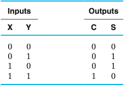
                </figure>

            === "电路图"
                
                <figure markdown>
                    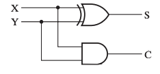
                </figure>
            
    === "全加器"
        !!! note ""
            
            === "逻辑表达式"

                $$
                S=\overline{X}\,\overline{Y}Z + \overline{X}Y\overline{Z} + X\overline{Y}\,\overline{Z} + XYZ \\
                C = XY + XZ + YZ
                $$

            === "真值表"
                
                <figure markdown>
                    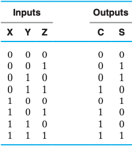
                </figure>

            === "卡诺图"
                
                <figure markdown>
                    
                </figure>
            
            === "逻辑表达式 with XOR"

                $$
                S = (X\oplus Y)\oplus Z \\
                C = XY + Z(X\oplus Y)
                $$

---

### 行波加法器

行波加法器是朴素的 n bits 加法器实现。其核心思想也就是模拟我们使用“竖式”来计算加法，从低位开始逐位计算，并将进位给到下一位作为输入。

实际上无论是只用半加器或是只用全加器，都可以实现行波加法器，但是殊途同归，无非是通过外部器件来进行互相转化而已。如果只使用全加器来实现，则以 4 bits 行波加法器为例，其大致逻辑如下：

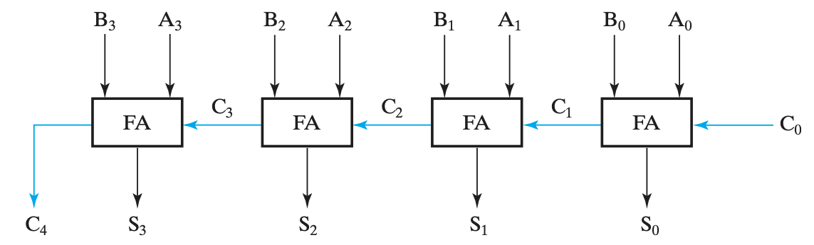

其中，在加法器中，$C_0$ 必然是 `0`。

加减法器，或者说加法器，一般情况下在 `ALU` 中是最影响效率的部分，而且如果使用行波加法器，随着位数增加效率会越来越慢。

所以会有类似于超前进位加法器之类的东西来解决这个问题。

更多的内容可以看**[ xxjj 的计组笔记](https://xuan-insr.github.io/computer_organization/3_arithmetic/#311-1-bit-alu)**。（数逻中最多了解到超前进位加法器即可。）

---

### 二进制减法

首先，在开始二进制减法的介绍之前，你需要了解 **补码(2's complement)**，不过这个东西实在是提过太多次了所以我不打算在这里再写一次，可以查看我的 [C 小笔记的补码内容](./../D1QD_CXiaoCheng/index.md#补码)。

结合补码，我们再来观察行波加法器，我们需要对减数的每一位取反，并对整个数加一，再直接将它们相加即可，即将减法转化为补码下的加法。

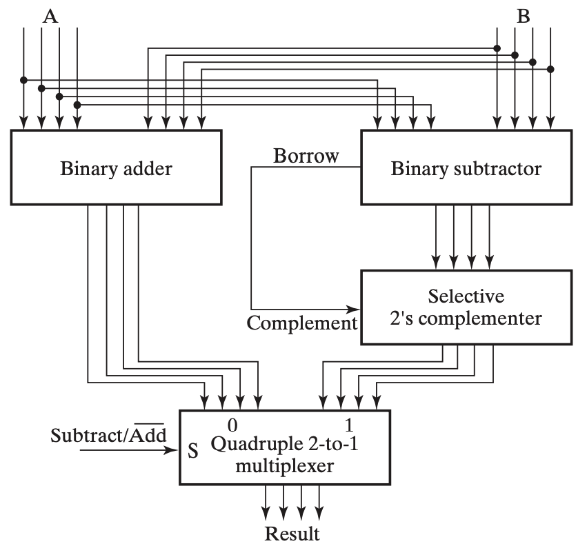

其中加一这一步恰好可以通过在加法器中必定为 `0` 的 $C_0$ 来实现。我们在输入中添加异或门来实现反码(1's complement)，再用 $C_0$ 实现加一，从而得到补码(2's complement)，就样就可以实现加减法器。

---

#### 有符号数的表示与计算

- [ ] TODO: 补充这里。

---

