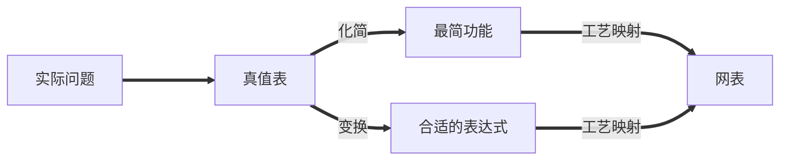

# Chap 3 Combinational Logic Design

按照功能，逻辑电路分为两类：
    
- **组合电路(combinational circuit)**
    - 拥有 m 个输入和 n 个输出，其中包含了 $2^m$ 种输入组合，以及对应的 n 个不同的函数；
    - 最关键的是，它的 **输出只依赖于这 m 个输入的组合**（不包含回路）；
- **时序电路(sequential logic cirtuit)**
    - 与之对应的，时序电路具有记忆功能，即它的输出可能会依赖之前的结果；

## 电路设计

!!! note "表示逻辑的方法"
    1. <u>真值表(Truth Table)</u>；
    2. 布尔函数(Boolean Function)；
    3. <u>卡诺图(Karnaugh Maps)</u>；
    4. <u>时序图(Timing Diagram)</u>；
    5. 逻辑电路图(Logic Circuit)；

    其中，下划线的方法在功能确定的情况下，其表示是唯一的。

而我们的设计，就是在满足功能的前提下，尽可能优化和找到最好的设计。

而主要的设计过程如下：

1. 确定系统的行为；
2. 阐述输入和输出之间的逻辑关系，并用真值表或逻辑表达式表达出来；
3. 优化逻辑表达以减少成本(比如使用卡诺图)；
4. 将优化后的逻辑设计映射到硬件实现上；
5. 验证正确性（在仿真环境中）；

---

## 分层设计

分层设计即将复杂问题模块化分解为若干层次，然后逐个抽象解决。

其设计方法分为 **自顶向下(Top-Down)** 和 **自底向上(Bottom-Up)**。

前者从需求开始，自顶向下分解功能设计；后者根据现有的元件去组合成目标功能。

