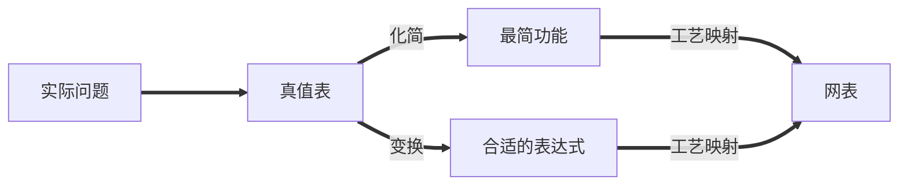
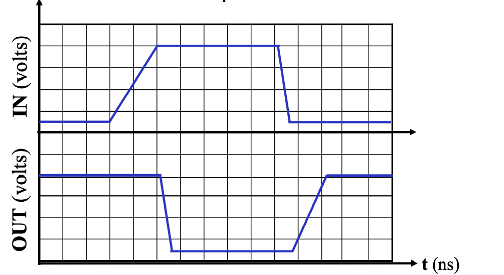
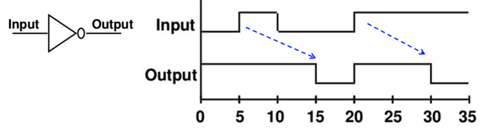
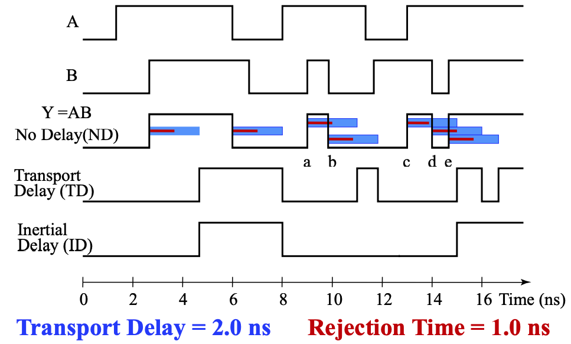
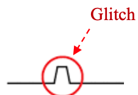

# Chap 3 Combinational Logic Design

按照功能，逻辑电路分为两类：
    
- **组合电路(combinational circuit)**
    - 拥有 m 个输入和 n 个输出，其中包含了 $2^m$ 种输入组合，以及对应的 n 个不同的函数；
    - 最关键的是，它的 **输出只依赖于这 m 个输入的组合**（不包含回路）；
- **时序电路(sequential logic cirtuit)**
    - 与之对应的，时序电路具有记忆功能，即它的输出可能会依赖之前的结果；

## 电路设计

!!! note "表示逻辑的方法"
    1. <u>真值表(Truth Table)</u>；
    2. 布尔函数(Boolean Function)；
    3. <u>卡诺图(Karnaugh Maps)</u>；
    4. <u>时序图(Timing Diagram)</u>；
    5. 逻辑电路图(Logic Circuit)；

    其中，下划线的方法在功能确定的情况下，其表示是唯一的。

而我们的设计，就是在满足功能的前提下，尽可能优化和找到最好的设计。

而主要的设计过程如下：

1. 确定系统的行为；
2. 阐述输入和输出之间的逻辑关系，并用真值表或逻辑表达式表达出来；
3. 优化逻辑表达以减少成本(比如使用卡诺图)；
4. 将优化后的逻辑设计映射到硬件实现上；
5. 验证正确性（在仿真环境中）；

---

### 分层设计

分层设计即将复杂问题模块化分解为若干层次，然后逐个抽象解决。

其设计方法分为 **自顶向下(Top-Down)** 和 **自底向上(Bottom-Up)**。

前者从需求开始，自顶向下分解功能设计；后者根据现有的元件去组合成目标功能。

---

#### 集成电路

**集成电路(integrated circuits)** 又叫 **芯片(chip)**，分为如下若干等级：

- SSI(small-scale integrated) 内含不到 10 个 gates；
- MSI(medium-scale integrated) 内含 10 ~ 100 个 gates；
- LSI(large-scale integrated) 内含 成百上千 个 gates；
- VLSI(very large-scale integrated) 内含 成千上亿 个 gates；

---

### 技术参数

门的实现主要通过这些参数特性来描述：

| Name                  |Description|
|:----------------------|:--|
| **Fan-in**            | 一个门可用的输入 |
| **Fan-out**           | 一个栅极输出驱动的标准负载数量 |
| Logic Levels          | 被认为是高低电平的输入输出电压范围 |
| Noise Margin          | 对外界噪声的容忍能力(具体来说是不会导致行为异变的最大噪声压值) |
| Cost for a gate       | 继承电路的门成本 |
| **Propagation Delay** | 信号改变后从输入到输出所需的变化时间 |
| Power Dissipation     | 电源输出能耗和门的能耗 |

---

#### 扇入扇出

扇入描述了一个门能够接受的最多输入量，如一个四输入与非门的扇入就是 4；而扇出描述的则是一个门的输出(栅极输出)在不降低工作性能的情况下能够负载多少门，例如一个非门的输出能够同时负载 4 个非门并且都能正常工作，则其扇出为 4，所以其也能通过标准负载来定义。

!!! note "标准负载"
    所谓的标准负载，是衡量“负载”的一个“单位砝码”。其大小等于一个非门(逆变器)贡献的负载压力。

那么要如何评估负载呢？首先我们引入 **过渡时间(transition time)**：

---

##### 转换时间

转换时间分为 $\mathrm{t_{LH}}$(rise time) 和 $\mathrm{t_{HL}}$(fall time) 两个部分。

- rise time 等于栅极输出从 $\mathrm{V_{CC}}$ 的 10% 升高到 90% 所需要的时间；
- fall time 等于栅极输出从 $\mathrm{V_{CC}}$ 的 90% 降低到 10% 所需要的时间；

通过时序图表示就是这样：

---

随着负载增加，转换时间也会增加（给电容充电的时间增加），而扇出定义中提到的“最大负载”，就是指它的转换时间不超过它预定的最大转换时间。

> 从左到右表示负载不断增加时，rise time 的变化趋势。

实际上，类似的，超出扇入后，门对输入的反应就太慢了。

---

#### 传播延迟

**传播延迟(propagation delay)** 衡量了门的输入变化导致输出变化所需要的时间。由于从低电平转化到高电平和高电平转化到低电平所需要的时间不一样，所以传播延迟同样有两个部分，分别使用 $\mathrm{t_{PHL}}$ 和 $\mathrm{t_{PLH}} 来表示$。

更具体的来说，传播延迟的计算方法是输入和输出的变化中点（即变化到 $\frac{1}{2}V_{CC}$ 时）的时间差，通过时序图表示就是这样：

> 此外，我们还可以引入 $\mathrm{ t_{pd} }$ 来统一表示 $\mathrm{t_{PHL}}$ 和 $\mathrm{t_{PLH}}$。数值上，$\mathrm{ t_{pd} } = average(\mathrm{t_{PHL}}, \mathrm{t_{PLH}})$ 或 $\mathrm{ t_{pd} } = max(\mathrm{t_{PHL}}, \mathrm{t_{PLH}})$。

!!! note ""
    === "题面"
        根据时序图，写出门的传播延迟，此处 $\mathrm{ t_{pd} } = average(\mathrm{t_{PHL}}, \mathrm{t_{PLH}})$。

        
    === "答案"
        

!!! question "Transition Time vs. Propagation Delay"
    转换时间专注于输出的变化，而传播延迟则包含了输入的变化和输出的变化整个过程。

    从时序图上的表示来看，转换时间只需要输出的时序图即可表示；但传播延迟则是通过比较输入和输出的偏差来表示的。

    

---

### 延迟模型

为了研究为什么会存在门延迟，刻画门的 **固有门延迟(inherent gate delay)**，我们需要对其建模，常见的 **延迟模型(delay model)** 有以下两种：

- 传输延迟(transport delay): 认为输入和输出之间的延迟是一个定值的；
 

- 惯性延迟(inertial delay): 引入了 **拒绝时间(rejection time)**，只有当输入达到一定能量后，才会出发栅极输出（在这种模型下，噪音等会被过滤）；

将不存在延迟的模型、传输延迟模型和惯性延迟模型做比较地来看，就是如下情况：

---

### 延迟以及相关问题

!!! info "引入"
    由于实际电路中实现延迟，数学上的逻辑表达式与实际电路情况会存在不同——即存在若干数学上无法直接解决的问题。

    所以研究延迟是非常必要的。

---

#### 延迟计算

计算一个电路的延迟时，有两方面需要考虑，一方面是电路自身所导致的一个固定延迟，另外一方面则是由于不同的负载导致的额外延迟。

> 在这个例子中，0.07 为固定延迟，0.021 为一个标准负载带来的延迟系数，SL(4.5 here) 则是标准化的负载量。

而具体的表达式，会在 Cell Library 里写。

---

#### 延迟带来的问题

由于存在延迟，许多在数学意义上没有问题的逻辑表达式在电路中就存在非常大的问题。

例如，从数学角度看，$\mathrm{Y=\bar{A}A}$ 的值恒为 `0`，但是实际上由于延迟，其仿真波形中会出现这样一个 **毛刺(glitch)**，而这在工程意义上有很大的问题。

???+ note "更复杂的 🌰"
    让我们分析下面这个二路选择器，其功能是通过 S 控制输出表达的是 A 还是 B，在传输延迟模型下，其波形如下：

    
    > 可以发现，Y 中出现了意料之外的毛刺。

    而这中毛刺可以用添加冗余项来解决：

    

---

### 正逻辑和负逻辑

**正逻辑(positive logic)** 就是 `1` 是有效信号，**负逻辑(negative logic)** 就是 `0` 是有效信号。而在正逻辑中 AND 门的作用就等效于负逻辑中 OR 门的作用，这也正是我在前面几章的笔记中提到的对称。

而正逻辑的电路的符号一般就是正常的逻辑门符号，而负逻辑的逻辑门符号则可能有小三角标，即 **极性指示器(polarity indicator)**：

> 如图，左侧是正逻辑电路的符号，右侧是负逻辑电路的符号。

---

### 工艺映射

有时我们会使用与非门和非门替换与门和或门(因为电路层面，与门实际上就是通过与非门实现的)，然后会发现有一些连续对非门可以相互抵消，例如下面的情况：

> 蓝绿色块中即为被替换后的内容，然后我们发现出现了若干可以抵消的非门。

当然，也可以通过或非门来实现，比如下面的情况：

---

### 验证正确性

- [ ] TODO:Finish this.

---

## 组合逻辑

---
### 基本逻辑函数

- **常量函数(Value-Fixing)**：$F=0\;\;or\;\;F=1$ | 输出定值；
- **传输函数(Transferring)**：$F=X$ | 直接输出输入值；
- **逆变函数(Inverting)**：$F=\bar{X}$ | 输出输入的相反；
- **使能函数(Enabling)**：$F=X\cdot En \;\; or \;\; F = X + \bar{En}$ | 通过使能控制输出是否可变，分为两种，比如与的形式中，只有 $En$ 为 `1` 时，$F$ 表现为 $X$ 的值；反之输出必定为 `0`（注意区分它与三态门的区别）；

---

### 基本功能块

- 译码器(Decoder)
- 编码器(Encoder)

- （三端）多路选择器(Multiplexer) `MUX`
- （三端）信号分配器(Demultiplexer) `DEMUX`

---

- [ ] TODO: 更详细的说明。

#### 译码器

穷举可能性，稠密 -> 稠密/稀疏

#### 编码器

稠密/稀疏 -> 稠密

#### 多路选择器

通过控制端选择输出的是若干输入中的哪一个。

#### 信号分配器

通过控制端选择输入给到若干输出中的哪一个。

