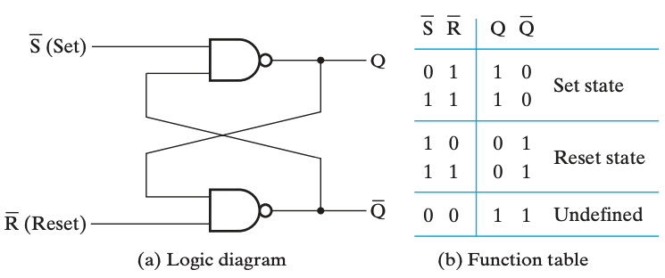
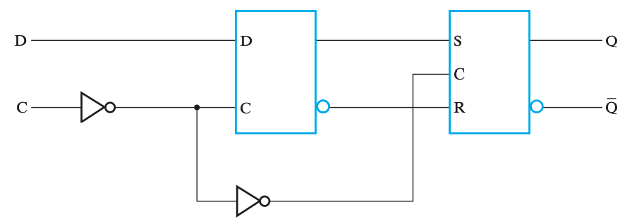
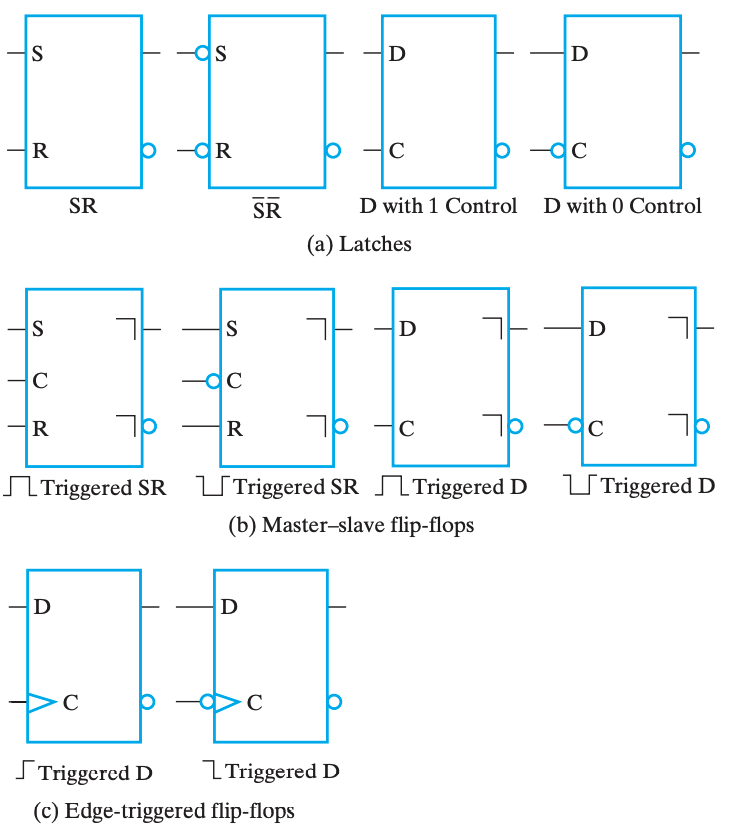
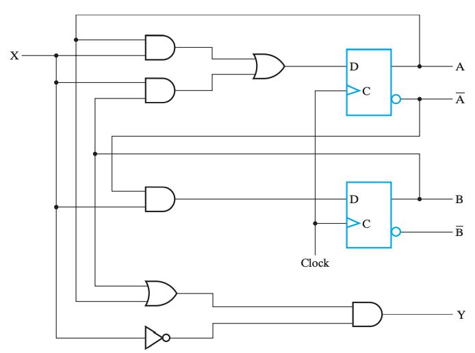
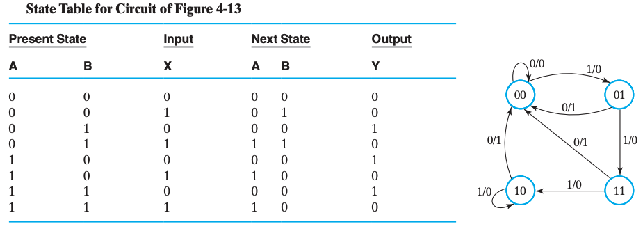
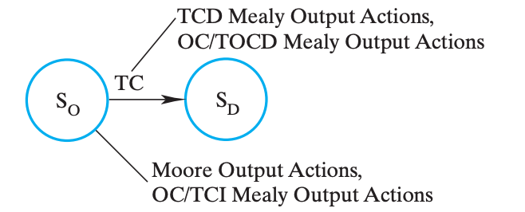
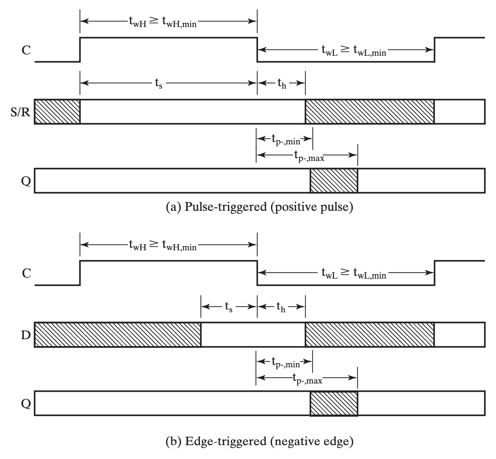
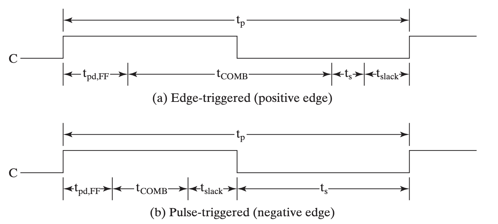

# Chap 4 Sequential Circuits

上一章讲的是组合电路，虽然组合电路能够实现诸多功能，但是它依然存在一些的问题：

1. 对于复杂的逻辑，抽象层级多，导致硬件层面开销大、耗时长，一方面提高成本，一方面降低效率；
2. 组合电路没法实现信息的存储，所有的功能模块对于特定的输入给出相同的输出；

而时序电路则拥有存储信息的能力，对于时序电路来说，输出除了与输入有关（甚至可以没有输入），也可以与自身 **状态(state)** 有关。

时序电路主要分为两类（主要分类依据是输入信号的时间和内部状态改变的时间）：**同步时序电路(synchronous sequential circuit)** 和 **异步时序电路(asynchronous sequential circuit)**。

>  The behavior of a synchronous sequential circuit can be defined from the knowledge of its signals at discrete instants of time. The behavior of an asynchronous sequential circuit depends upon the inputs at any instant of time and the order in continuous time in which the inputs change.

一般来说，异步电路的设计相对困难（行为与门的传播延迟和输入信号变化的时间序列密切相关），但仍然十分必要，比如触发器就是以一部锁存器为模块设计的；而同步电路的使用更加广泛，通常这些“离散的时刻”都是由 **时钟发生器(clock generator)** 这种时序器件产生周期性的 **时钟脉冲(clock pulse)** 序列来实现的（这种电路一般被称为 **钟控时序电路(clocked sequential circuit)**，由于设计相对容易，鲁棒性强，所以被广泛应用）。

!!! summary "缓冲"

    缓冲器(buffer) 一般通过两个非门串联，并将输入连通输出实现，这样能够实现信息的存储，然而无法修改。而锁存器就是在缓冲器的基础上，将非门替换为或非门或与非门实现的。

    
    > 其中，从给定输入到更新输出有一个 $t_G$ 的延时。

---

!!! info "引入"

    显然，根据上面的概述，时序电路中最重要的就是信息存储元件。当输入信号不发生变化时（重点是变化，即输入和存储信息未必存在对应关系）存储元件就能够保持其内部存储的二进制数据。

    存储元件主要由 **锁存器(latch)** 和 **触发器(flip-flop)** 两种，其中前者是后者的基础，或者说多数情况下我们使用后者，但后者由前者构成。

---

## 锁存器

### SR & S'R' 锁存器

SR 锁存器和 S'R' 锁存器的基本原理是一致的，只不过前者用的是或非门，后者用的是与非门。

SR 锁存器和 S'R' 锁存器的输入都是 S(Set) 和 R(Reset) 两个部分，输出都是 Q 和 Q' 两个部分。

> **名称上** 的共同点是，当 S 为 `1` 时，Q 都会是 `1`；对于 R 和 Q' 也是这样，只不过要注意，S'R'锁存器输入的并不是这里所说的 S，而是将 S' 作为输入。

!!! note ""

    === "SR 锁存器"
        <figure markdown>
            
        </figure>
    === "S'R' 锁存器"
        <figure markdown>
            
        </figure>

一个记忆方法是，SR 的门元件对 `1` 敏感，所以是 或非门 的实现；而 S'R' 的门元件对 `0` 敏感，所以是 与非门 的实现。而通过 「当 S 为 `1` 时，Q 都会是 `1`」可以得到 S、R 与 Q、Q' 的位置。

但是实际的存储元件并不是单纯的 SR/S'R' Latches，所以它们当然是存在问题的。由于电路存在延时，所以 S 和 R 的输入很难同时到达，所以我们可以在前面加一个控制端，当确保两个输入都到位的时候再使能。

于是我们得到了，**带控制输入的 SR 锁存器(SR Latch with Control Input)**（S'R'略）：

> 注意！SR 锁存器通过 或非门 实现，但带输入控制的 SR 锁存器则通过 **与非门** 实现！

---

### D 锁存器

D 锁存器实际上是带控制输入的 SR 锁存器的改进。其中我们关注到，虽然 S 和 R 起作用的有三种状态

我们关注到，即使是带控制输入的 SR 锁存器，也存在一个「undefined」状态，而这是我们不希望出现的，于是我们想，能不能避免这种情况的发生。这时候我们观察到，由于可以通过 C 来控制是否保持，所以可以直接强制要求 $S = \overline R$，于是就避免了 undefined 情况的出现，这就是 D 锁存器。

只有当 C 为 `1` 时，D 锁存器才能写入数据；而当 C 为 `0` 时，D 锁存器的数据就不会变化。

---

!!! warning "透明的危害：空翻"

    当然，D 锁存器也存在问题。如果我门将 $\overline Q$ 接到 $D$ 上，就会发现 D 锁存器将不停的变化其中的数据，出现 **空翻**，导致我们无法确定 C 置 `0` 时 Q 的输出究竟是什么，而这是非常危险的。

    这主要是因为 D 锁存器的输入和输出都是直接暴露出来、同时允许变化的（不是同时变化，是指在 Input 可以变的时候 Output 也能变），即 **透明(transparent)** 的。这就导致了在一个时钟周期里，同时存在 **可以互相影响** 的两个东西。这也是触发器所解决的问题。

---

## 触发器

为了解决上面提到的，由「透明」引发的问题，而采用触发器的设计。通过组合两个锁存器，主要有两种实现方法：

1. 在有脉冲（高电平）时，修改第一个锁存器的值，保持第二个锁存器的值；在没有脉冲（低电平）时候保持第一个锁存器的值，修改第二个锁存器的值，更新触发器的状态，即 **主从式(master-slave)触发器**；
2. 仅在时钟的边缘触发，即在特定时刻仅接受一个输入，即 **边沿触发式(edge-triggered)触发器**；

> 边沿触发式 D 触发器是目前使用最广泛的触发器。

---

### SR 主从触发器

> 虽然它叫 FF，但它并不符合 FF 的特征，然而分类上又属于 pulse-triggered FF。

SR 触发器知所以是所谓的 pulse-triggered 的，是因为在 S 和 R 输入都为 `0` 时，如果出现噪音，就会导致 Slave 写入异常数据。

> 但是我个人认为这是 SR 自身有两个保持态导致的弊端，而在实际使用过程中我们就不应该有输入为 S 和 R 都为 `0` 的情况。

---

### 边沿触发式触发器

上面已经说过了，边沿触发式触发器主要对脉冲的 上升沿 或 下降沿 敏感。

下图为正边沿触发 D 触发器的大致原理图。

> 关注上升沿前后，上升沿前一刻，主锁存器可写，从锁存器只读；上升沿后一刻，主锁存器只读，从锁存器只写，且写入的是主锁存器存储的值——换句话来说，存的是上升沿前一刻写入主锁存器的内容。

需要注意的一点是，D 触发器没有「保持」态。如果要使 D 触发器保持，可以使时钟脉冲失效或通过 `MUX` 将输出接到输入实现。其中前者不太常用，因为受门控的时钟脉冲进入触发器时有延迟，即 **时钟偏移(clock skew)**

---

### 标准图形符号

> 带圆圈表示负逻辑。

---

### 直接输入

这些直接输入往往是异步的，一般用来异步置位（直接置位或预置）或异步复位（直接复位或清零）。

对于时序电路来说，「复位」或「置位」这种输入常常作为初始化，即确定各个触发器的「初始状态」。

---

## 时序电路分析

为了分析时序电路，我们需要一些工具来表示时序电路的一些特征与逻辑。观察时序电路和组合电路的区别，发现最核心的就是逻辑运算过程中出现了「状态」参与运算。因此，我们需要在各个组合电路分析中采用的表示方法中，添加表示「状态」的信息。

除此之外，如果只是单纯的将「状态」作为一个新的输入，作为增量添加到表达方式中，会发现这些表述会显得很重。所以我们也需要寻找一种更好的办法来表达时序电路中的逻辑，这就是「状态图」。

---

### 触发器的输入方程

**触发器的输入方程(flip-flop input equation)** 主要是为其提供一个代数表达方式。它的主要想法是⓵表达每一个触发器的输入与输出之间的关系；⓶表达每一个直接输出的逻辑表达式。其中，触发器的输出符号表示了其类型（即符号）与输出（即下标）。

具体来说，例如下面这个电路：

可以发现，其中包含两个触发器 $D_A$ 和 $D_B$，以及一个组合逻辑输出 $Y$，因而可以根据电路的特征，得到下面这几个式子：

$$
\begin{aligned}
    D_A & = AX + BX \\
    D_B & = \overline{A}X \\
    Y   & = (A + B)\overline{X}
\end{aligned}
$$

---

### 状态表

当然，时序电路的逻辑有时候也可以通过状态表来描述，只不过与组合电路的 真值表 不同，**状态表(state table)** 有四栏：当前状态(present state)、输入(input)、下一状态(next state)、输出(output)。其含义是比较显然的，只不过需要通过电路图得到状态表，需要首先得到「当前状态」向「下一状态」转移的方程，即对于某个时刻 $t$ 的触发器 $A$ 的输出 $A(t)$，需要得到它下一刻的状态 $A(t+1) = f(A(t), ...)$。

同样以这个电路为 🌰：

首先我们对 $D_A$ 得到转移方程：$A(t+1) = D_A = A(t)X + B(t)X$，可以简写为 $A(t+1) = D_A = AX+BX$。类似地也能得到 $B$ 的转移方程。

于是，根据这些信息，我们可以写出它的状态表：

|Present State `AB`|Input `X`|Next State `AB`|Output `Y`|
|:--:|:--:|:--:|:--:|
|`00`|`0`|`00`|`0`|
|`00`|`1`|`01`|`0`|
|`01`|`0`|`00`|`1`|
|`01`|`1`|`11`|`0`|
|`10`|`0`|`00`|`1`|
|`10`|`1`|`10`|`0`|
|`11`|`0`|`00`|`1`|
|`11`|`1`|`10`|`0`|

!!! note "Mealy model circuit & Moore model circuit"
    如果输出既依赖于当前状态，也依赖于输入的时序电路，则称为 **米勒型电路(Mealy model circuit)**；而如果输出只依赖于当前状态，则称为 **摩尔型电路(Moore model circuit)**。

    在 **[状态图](#状态图)** 中，我们还将再一次遇到这两个人名。

---

### 状态图

可以发现，状态表比较清晰的表达了不同的状态和输入得到的结果，但是对于「不同状态之间是如何转换的」这件事的描述并不清晰。而对于「联系」这件事，有向图是一个非常好的形式，所以我们将介绍 **状态图(state diagram)**。

状态图承载的信息量和状态表是一样的，所以也是需要表达 当前状态(present state)、输入(input)、下一状态(next state)、输出(output) 这四个东西。只不过「下一状态」是通过有向边来表示的。当前状态作为一个 node 的属性；而输入作为 edge 的一个属性；至于输出，根据它是放在 edge 上还是 node 上，分为 **米勒型(Mealy)** 和 **摩尔型(Moore)** 两种。

!!! eg "Mealy"

    例如，这是一个 米勒型 的状态图，以及对应的状态表。

    

    > 因为米勒型电路的 **输出与当前状态和输入都有关**，所以输出会和输入放在一起，即放在 edge 里。
    > 
    > 对于米勒型，node 内的二进制为 present state 中的 `AB`；edge 上分别为 input 和 output：`X`/`Y`；有向边表达了每个状态在特定输入下的下一个状态。
    >
    > 例如，关注 node `00`，它有一条自环 `0`/`0`，对应 状态表 的第一行；它有一条 edge `1`/`0` 指向 node `01`，对应 状态表的第二行。

    当然，米勒型是有 **缺陷** 的，在时序电路设计之后的步骤中，我们需要根据它来对每一个状态设计输出方程。此时由于两个输出共享同一个目标状态，所以我们需要将两个输出结合到同一个式子中，这将提高设计难度和组合电路成本。

!!! eg "Moore"

    而下面是一个 摩尔型 的状态图，以及对应的状态表。

    

    > 因为摩尔型电路的 **输出只与当前状态有关**，所以输出会和当前状态放在一起，即放在 node 里。
    > 
    > 对于摩尔型，node 内的二进制表示 present state 和 output：`A`/`Z`；edge 上列举了这种转移可能的 inputs：`XY`。
    > 
    > 例如，关注 node `0`/`0`，它有两条自环 `00` 和 `11`，分别对应 状态表 的第一行和第四行；它有两条 edge `01` 和 `10` 指向 node `1`/`1`，对应 状态表 的第二行和第三行。

    摩尔型也存在 **缺陷** 的，非常显然，相比于米勒型，摩尔型需要更多的状态。

换句话来说，米勒型倾向于表达「在特定状态下，特定输入将导致某种结果，以及状态转移」；而摩尔型倾向于表达「特定输入将导致某个状态向另外一个状态转移，而输出更像是一种状态的结果」。

状态图还有进阶形态，之后会提及，就是 **[状态机](#状态机)**。

---

### 等价状态

暂略

---

!!! info "延时分析"

    延时分析是一个重难点，对于时序电路的延时分析，将在之后单独开一个小结重点介绍。
    
    请参考 **[延时分析](#延时分析)**。

---

## 时序电路的设计

类比组合逻辑电路通过真值表设计电路，（同步）时序电路主要依据状态表（或等价表达，如状态图）来设计电路。实际设计中，我们需要考虑触发器以及其它组合电路的选择与设计：

- 触发器的数量基本取决于整个需求中 状态 的数量，$n$ 个触发器能够表达 $2^n$ 个二进制状态；
- 组合电路的主要设计围绕 触发器 的 输入 和 输出 展开；

而主要的设计过程和组合逻辑电路的设计是类似的，如下：

1. 确定系统的行为；
    1. 描述系统行为过程中，要注意状态的复用（不过并非状态越少成本就越小，这里有触发器数量和组合逻辑电路的 trade-off）；
    2. 确定电路的初始状态（**复位状态(reset state)**，通过给定复位(reset)信号实现）；
        - 复位一般可以是异步的；
2. 阐述输入和输出之间的逻辑关系，并用真值表或逻辑表达式表达出来；
3. 给设计好的状态编码赋值，得到具体的状态表；
    1. 我们可以使用 按计数顺序、 按格雷码、用独热码 来给状态赋值，更系统的方法比较复杂，不做讨论；
    2. 其中还有一种情况是所需要的状态不能完整填充 $2^n$ 种情况，需要设计无效状态，这种时候可以不考虑它们；
4. 根据状态表确定使用的触发器及其输入方程；
5. 根据状态表确定输出方程；
6. 优化输入方程和输出方程；
7. 将优化后的逻辑设计工艺映射到硬件实现上；
8. 验证正确性（在仿真环境中）；
    - 主要就是看能不能复现状态图；

---

## 状态机

尽管在小规模的设计中，状态图表现良好，但是随着设计的系统规模变大，我们需要一个更加泛用的方式来表达类似的时序逻辑。

于是，我们在状态图的基础上进行修改，设计了 **状态机(State-Machine Diagram)** 来做这件事。

状态机混用了米勒型和摩尔型的输出格式，优劣在 **[状态图](#状态图)** 中有所提及。并且，有限图将状态转移方程也写入，总体上对电路设计更友好。下图是状态机的一个“范式”。

!!! note "Generic State Diagram Template"
    
    
    首先解释一下这个“范式”：

    > 具体解释状态机有哪些内容，以及各个部分之间的逻辑。关于各个部分出现的位置，请参考 Template。
    >
    > 另外，为了简化语句，下面的说法省略了时钟，请记得考虑。

    状态机模型主要有三要素：**输入条件(Input Conditions)**、**状态转移(Transitions)** 和 **输出行为(Output Actions)**。总体来说，输入条件告诉我们整个状态机要如何变化；状态转移描述了状态机的内部转移行为，即图论上的有向联通关系；输出行为描述动态变化过程中状态机的对外表达。其中，状态转移和输出行为是我们需要关注的状态机的两个维度，输入条件是我们用来做实时判断的外部依据。

    ---

    「输入条件」是由输入变量形成的一个布尔方程，在整个状态机中，输入是变化的“因变量”，换句话来说，无论是状态转移还是输出，都取决于输入条件。而导致特定行为的输入条件则被分类为 **转移条件(Transition Condition, TC)** 和 **输出条件(Output Condition, OC)**。

    ---

    「状态转移」在图中表现为有向边，当 TC 成立时，状态转移发生；或者对于无条件转移，只要得到时钟脉冲就会转移到下一个状态。

    ---

    「输出行为」在状态机中有四种触发方法（即四种 OC）：**Moore**、**不依赖转移(Transition-condition Independent, TCI)** Mealy、**依赖转移(Transition-condition Dependent, TCD)** Mealy 和 **依赖转移和输出条件(Transition and Output-condition Dependent, TOCD)** Mealy。根据字面意思来看：
        
    - Moore 只与状态有关，所以在图中从状态节点引出；
    - TCI Mealy 与状态和输出条件有关，所以在图中从状态节点引出写在 OC 后面（`OC`/`TCI OA`）；
    - TCD Mealy 与转移条件有关，当转移成立的时候发生 Output Action，所以直接写在 TC 后面（`TC`/`TCD OA`）；
    - TOCD Mealy 在转移发生时候才可能条件成立，即当 TC 和 OC 都成立时才发生 Output Action，所以需要从 TC 引出 OC，并跟在 OC 后面（`TC`——`OC`/`TOCD OA`）；
            - 如果出现复数的 TOCD OA，则使用 `,` 分隔；

    > In a given state, an output action occurs if: (a) it is unconditional (Moore), (b)  TCI and its output condition OC = 1, \(c) TCD and its transition condition TD = 1, and (d) TOCD and its transition condition TC and output condition OC are both equal to 1, i.e, TC·OC = 1. Note that Moore and TCI output actions attached to a state, apply to all transitions from the state as well.

    回到输出行为本身，当 OC 成立时输出行为发生，一般会将输出变量标出，如果写的是 NOT X，表示 OC 成立时 X 应为 `0`；如果写的是 X，则表示 OC 成立时 X 为 `1`。

    !!! warning "注意点"
        此外，还有一个点需要辨析，由于「Transition」表示的是“下一个”状态，所以对于当前时刻，当前节点的输出和出度的输出不能冲突。例如，下图因为 Moore 输出行为的 Z 和 TC=AB 那条边的 Z' 冲突，所以非法。

        

        ---

        当然，非法状态机并不只有这一个判据。不过核心思想就是 **不能有歧义或冲突且需要充分**，更数学的表达是，必须满足如下两个条件：

        1.非交：对于每一个状态 $S_i$，它的任意两个出度 $(T_{ij},T_{jk})$ 都不能同时成立，即应有：

        $$
        \forall (T_{ij},T_{ik})\;,\;\;T_{ij}\cdot T_{ik} = 0
        $$

        2.充分：对于每一个状态 $S_i$，它的所有出度条件应该涵盖所有可能，即应有：

        $$
        \sum_{j}T_{ij} = 1
        $$

        Tips: 上面是对 Transition Condition 的约束，**将 TC 换成 OC 也需要成立**。

    ---

    ???+ summary "缩写对照表"
        |缩写    |含义                                       |注释|
        |---    |---                                        |---|
        |TC     |Transition Condition                       |转移条件：导致 Transition 的 Input Condition|
        |OC     |Output Condition                           |输出条件：导致 Output Actions 的 Input Condition|
        |TCI    |Transition-condition Independent           |不依赖转移：只与 State 有关的 Output Actions|
        |TCD    |Transition-condition Dependent             |依赖转移：Transition Condition 成立才有 Output Actions|
        |TOCD   |Transition and Output-condition Dependent  |依赖转移和输出方程：Transition Condition 和 Output Condition 都成立才有 Output Actions|

    ???+ eg "State Machine Diagram 🌰"
        
        > 注意，图中有一个错误（大概），右侧 $S_1$ 的 OC 应为 $(\overline{A}\cdot\overline{B})$。

---

## 延时分析

首先，自上而下的给出观念，时序电路的延时分析有两个主要部分和一个次要部分：

1. 组合电路导致的延时；
2. 触发器导致的延时；
3. 电路的松弛时间；

并且往往是根据触发器的类型，计算一个时钟周期的时间。最核心的问题就是计算电路能够正常工作的最短时钟周期。接下来，自下而上的进行细节补充。

---

### 组合电路延时

这一部分的详细内容已经在 **[上一章](Chap03.md#传播延迟)** 介绍过了，在这里，为了简化计算过程，我们全部采用 $t_{pd}$。

---

### 触发器延时

触发器延时相比组合电路延时复杂很多，主要目的是为了保证采样。也就是说它的“延时”并不仅仅是因为电信号传播的延迟，还有为了保证信号稳定设计的一些内容。

大致来说有三个部分：

- Setup Time：采样边缘前输入信号需要保持稳定的时间；
- Hold Time：采样边缘后输入信号需要保持稳定的时间；
- Propagation Time：触发器的采样边缘到输出稳定的时间（传播时间）；

!!! note ""
    一篇介绍 Setup Time 和 Hold Time 的 **[文章](https://nandland.com/lesson-12-setup-and-hold-time/)**。

根据触发器的类型不同，主要的 Setup Time 也不同：

其中比较重要的一些点是：

1. 这几个时间点起点/终点都是触发边缘；
2. Propagation Time 一定长于 Hold Time，因此在计算电路延迟时只考虑 Propagation Time；
3. Pulse-trigger 和 Edge-trigger 在表现上的区别在于 Setup Time，前者需要覆盖整个 pulse(`pos` or `neg`)；

---

### 松弛时间

实际上这就是给整个电路的一个“容差”时间，给定一个误差，但是由于通过前两者计算出来的是最短时间，所以松弛时间必定非负。（不能倒扣！）

---

### 时序电路延时

时序电路的延时计算实际上是为了计算时序电路运作的最大频率以设计时钟频率。所以我们需要算出电路能够稳定工作的最小时钟期。

其计算遵循一定方法：

> 图中 $t_{pd,FF}$ 指触发器的 propagation time，$t_{COMB}$ 指组合电路的总传播时间（一般情况下 $t_{COMB} = \max{\sum_i t_{pd,gate_i}}$），$t_{s}$ 指触发器的 setup time，$t_{slack}$ 表示电路的松弛时间。

!!! note "（假）经验之谈"
    一般从一个 FF 的输出出发到 FF 的输入结束。

- [ ] 我觉得这里应该是需要有例题的，但是我现在还没做题，所以做了再写。

