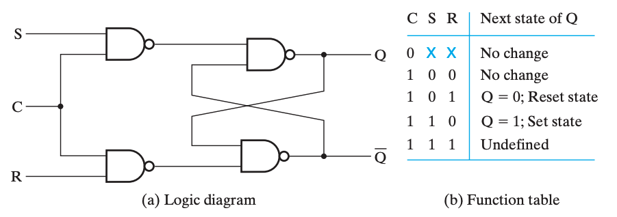
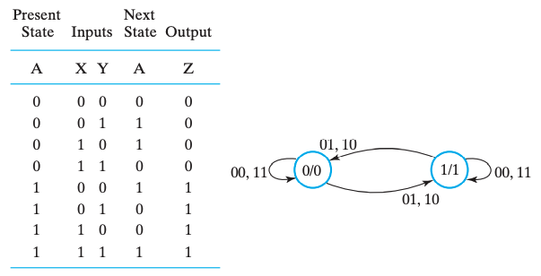

# Chap 4 Sequential Circuits

上一章讲的是组合电路，虽然组合电路能够实现诸多功能，但是它依然存在一些的问题：

1. 对于复杂的逻辑，抽象层级多，导致硬件层面开销大、耗时长，一方面提高成本，一方面降低效率；
2. 组合电路没法实现信息的存储，所有的功能模块对于特定的输入给出相同的输出；

而时序电路则拥有存储信息的能力，对于时序电路来说，输出除了与输入有关（甚至可以没有输入），也可以与自身 **状态(state)** 有关。

时序电路主要分为两类（主要分类依据是输入信号的时间和内部状态改变的时间）：**同步时序电路(synchronous sequential circuit)** 和 **异步时序电路(asynchronous sequential circuit)**。

>  The behavior of a synchronous sequential circuit can be defined from the knowledge of its signals at discrete instants of time. The behavior of an asynchronous sequential circuit depends upon the inputs at any instant of time and the order in continuous time in which the inputs change.

一般来说，异步电路的设计相对困难（行为与门的传播延迟和输入信号变化的时间序列密切相关），但仍然十分必要，比如触发器就是以一部锁存器为模块设计的；而同步电路的使用更加广泛，通常这些“离散的时刻”都是由 **时钟发生器(clock generator)** 这种时序器件产生周期性的 **时钟脉冲(clock pulse)** 序列来实现的（这种电路一般被称为 **钟控时序电路(clocked sequential circuit)**，由于设计相对容易，鲁棒性强，所以被广泛应用）。

!!! summary "缓冲"

    缓冲器(buffer) 一般通过两个非门串联，并将输入连通输出实现，这样能够实现信息的存储，然而无法修改。而锁存器就是在缓冲器的基础上，将非门替换为或非门或与非门实现的。

    
    > 其中，从给定输入到更新输出有一个 $t_G$ 的延时。

---

!!! info "引入"

    显然，根据上面的概述，时序电路中最重要的就是信息存储元件。当输入信号不发生变化时（重点是变化，即输入和存储信息未必存在对应关系）存储元件就能够保持其内部存储的二进制数据。

    存储元件主要由 **锁存器(latch)** 和 **触发器(flip-flop)** 两种，其中前者是后者的基础，或者说多数情况下我们使用后者，但后者由前者构成。

---

## 锁存器

### SR & S'R' 锁存器

SR 锁存器和 S'R' 锁存器的基本原理是一致的，只不过前者用的是或非门，后者用的是与非门。

SR 锁存器和 S'R' 锁存器的输入都是 S(Set) 和 R(Reset) 两个部分，输出都是 Q 和 Q' 两个部分。

> **名称上** 的共同点是，当 S 为 `1` 时，Q 都会是 `1`；对于 R 和 Q' 也是这样，只不过要注意，S'R'锁存器输入的并不是这里所说的 S，而是将 S' 作为输入。

!!! note ""

    === "SR 锁存器"
        <figure markdown>
            
        </figure>
    === "S'R' 锁存器"
        <figure markdown>
            
        </figure>

一个记忆方法是，SR 的门元件对 `1` 敏感，所以是 或非门 的实现；而 S'R' 的门元件对 `0` 敏感，所以是 与非门 的实现。而通过 「当 S 为 `1` 时，Q 都会是 `1`」可以得到 S、R 与 Q、Q' 的位置。

但是实际的存储元件并不是单纯的 SR/S'R' Latches，所以它们当然是存在问题的。由于电路存在延时，所以 S 和 R 的输入很难同时到达，所以我们可以在前面加一个控制端，当确保两个输入都到位的时候再使能。

于是我们得到了，**带控制输入的 SR 锁存器(SR Latch with Control Input)**（S'R'略）：

> 注意！SR 锁存器通过 或非门 实现，但带输入控制的 SR 锁存器则通过 **与非门** 实现！

---

### D 锁存器

D 锁存器实际上是带控制输入的 SR 锁存器的改进。其中我们关注到，虽然 S 和 R 起作用的有三种状态

我们关注到，即使是带控制输入的 SR 锁存器，也存在一个「undefined」状态，而这是我们不希望出现的，于是我们想，能不能避免这种情况的发生。这时候我们观察到，由于可以通过 C 来控制是否保持，所以可以直接强制要求 $S = \overline R$，于是就避免了 undefined 情况的出现，这就是 D 锁存器。

只有当 C 为 `1` 时，D 锁存器才能写入数据；而当 C 为 `0` 时，D 锁存器的数据就不会变化。

---

!!! warning "透明的危害：空翻"

    当然，D 锁存器也存在问题。如果我门将 $\overline Q$ 接到 $D$ 上，就会发现 D 锁存器将不停的变化其中的数据，出现 **空翻**，导致我们无法确定 C 置 `0` 时 Q 的输出究竟是什么，而这是非常危险的。

    这主要是因为 D 锁存器的输入和输出都是直接暴露出来、同时允许变化的（不是同时变化，是指在 Input 可以变的时候 Output 也能变），即 **透明(transparent)** 的。这就导致了在一个时钟周期里，同时存在 **可以互相影响** 的两个东西。这也是触发器所解决的问题。

---

## 触发器

为了解决上面提到的，由「透明」引发的问题，而采用触发器的设计。通过组合两个锁存器，主要有两种实现方法：

1. 在有脉冲（高电平）时，修改第一个锁存器的值，保持第二个锁存器的值；在没有脉冲（低电平）时候保持第一个锁存器的值，修改第二个锁存器的值，更新触发器的状态，即 **主从式(master-slave)触发器**；
2. 仅在时钟的边缘触发，即在特定时刻仅接受一个输入，即 **边沿触发式(edge-triggered)触发器**；

> 边沿触发式 D 触发器是目前使用最广泛的触发器。

---

### SR 主从触发器

---

### 边沿触发式触发器

上面已经说过了，边沿触发式触发器主要对脉冲的 上升沿 或 下降沿 敏感。

下图为正边沿触发 D 触发器的大致原理图。

> 关注上升沿前后，上升沿前一刻，主锁存器可写，从锁存器只读；上升沿后一刻，主锁存器只读，从锁存器只写，且写入的是主锁存器存储的值——换句话来说，存的是上升沿前一刻写入主锁存器的内容。

需要注意的一点是，D 触发器没有「保持」态。如果要使 D 触发器保持，可以使时钟脉冲失效或通过 `MUX` 将输出接到输入实现。其中前者不太常用，因为受门控的时钟脉冲进入触发器时有延迟，即 **时钟偏移(clock skew)**

---

### 标准图形符号

> 带圆圈表示负逻辑。

---

### 直接输入

这些直接输入往往是异步的，一般用来异步置位（直接置位或预置）或异步复位（直接复位或清零）。

对于时序电路来说，「复位」或「置位」这种输入常常作为初始化，即确定各个触发器的「初始状态」。

---

## 时序电路分析

为了分析时序电路，我们需要一些工具来表示时序电路的一些特征与逻辑。观察时序电路和组合电路的区别，发现最核心的就是逻辑运算过程中出现了「状态」参与运算。因此，我们需要在各个组合电路分析中采用的表示方法中，添加表示「状态」的信息。

除此之外，如果只是单纯的将「状态」作为一个新的输入，作为增量添加到表达方式中，会发现这些表述会显得很重。所以我们也需要寻找一种更好的办法来表达时序电路中的逻辑，这就是「状态图」。

---

### 触发器的输入方程

**触发器的输入方程(flip-flop input equation)** 主要是为其提供一个代数表达方式。它的主要想法是⓵表达每一个触发器的输入与输出之间的关系；⓶表达每一个直接输出的逻辑表达式。其中，触发器的输出符号表示了其类型（即符号）与输出（即下标）。

具体来说，例如下面这个电路：

可以发现，其中包含两个触发器 $D_A$ 和 $D_B$，以及一个组合逻辑输出 $Y$，因而可以根据电路的特征，得到下面这几个式子：

$$
\begin{array}{**l**}
    D_A & = & AX + BX \\
    D_B & = & \overline{A}X \\
    Y   & = & (A + B)\overline{X}
\end{array}
$$

---

### 状态表

当然，时序电路的逻辑有时候也可以通过状态表来描述，只不过与组合电路的 真值表 不同，**状态表(state table)** 有四栏：当前状态(present state)、输入(input)、下一状态(next state)、输出(output)。其含义是比较显然的，只不过需要通过电路图得到状态表，需要首先得到「当前状态」向「下一状态」转移的方程，即对于某个时刻 $t$ 的触发器 $A$ 的输出 $A(t)$，需要得到它下一刻的状态 $A(t+1) = f(A(t), ...)$。

同样以这个电路为 🌰：

首先我们对 $D_A$ 得到转移方程：$A(t+1) = D_A = A(t)X + B(t)X$，可以简写为 $A(t+1) = D_A = AX+BX$。类似地也能得到 $B$ 的转移方程。

于是，根据这些信息，我们可以写出它的状态表：

|Present State `AB`|Input `X`|Next State `AB`|Output `Y`|
|:--:|:--:|:--:|:--:|
|`00`|`0`|`00`|`0`|
|`00`|`1`|`01`|`0`|
|`01`|`0`|`00`|`1`|
|`01`|`1`|`11`|`0`|
|`10`|`0`|`00`|`1`|
|`10`|`1`|`10`|`0`|
|`11`|`0`|`00`|`1`|
|`11`|`1`|`10`|`0`|

!!! note "Mealy model circuit & Moore model circuit"
    如果输出既依赖于当前状态，也依赖于输入的时序电路，则称为 **米勒型电路(Mealy model circuit)**；而如果输出只依赖于当前状态，则称为 **摩尔型电路(Moore model circuit)**。

    在 [状态图](#状态图) 中，我们还将再一次遇到这两个人名。

---

### 状态图

可以发现，状态表比较清晰的表达了不同的状态和输入得到的结果，但是对于「不同状态之间是如何转换的」这件事的描述并不清晰。而对于「联系」这件事，有向图是一个非常好的形式，所以我们将介绍 **状态图(state diagram)**。

状态图承载的信息量和状态表是一样的，所以也是需要表达 当前状态(present state)、输入(input)、下一状态(next state)、输出(output) 这四个东西。只不过「下一状态」是通过有向边来表示的。当前状态作为一个 node 的属性；而输入作为 edge 的一个属性；至于输出，根据它是放在 edge 上还是 node 上，分为 **米勒型(Mealy)** 和 **摩尔型(Moore)** 两种。

!!! example "Mealy"

    例如，这是一个 米勒型 的状态图，以及对应的状态表。

    

    > 因为米勒型电路的**输出与当前状态和输入都有关**，所以输出会和输入放在一起，即放在 edge 里。
    > 
    > 对于米勒型，node 内的二进制为 present state 中的 `AB`；edge 上分别为 input 和 output：`X`/`Y`；有向边表达了每个状态在特定输入下的下一个状态。
    >
    > 例如，关注 node `00`，它有一条自环 `0`/`0`，对应 状态表 的第一行；它有一条 edge `1`/`0` 指向 node `01`，对应 状态表的第二行。

!!! example "Moore"

    而下面是一个 摩尔型 的状态图，以及对应的状态表。

    

    > 因为摩尔型电路的**输出只与当前状态有关**，所以输出会和当前状态放在一起，即放在 node 里。
    > 
    > 对于摩尔型，node 内的二进制表示 present state 和 output：`A`/`Z`；edge 上列举了这种转移可能的 inputs：`XY`。
    > 
    > 例如，关注 node `0`/`0`，它有两条自环 `00` 和 `11`，分别对应 状态表 的第一行和第四行；它有两条 edge `01` 和 `10` 指向 node `1`/`1`，对应 状态表 的第二行和第三行。

换句话来说，米勒型倾向于表达「在特定状态下，特定输入将导致某种结果，以及状态转移」；而摩尔型倾向于表达「特定输入将导致某个状态向另外一个状态转移，而输出更像是一种状态的结果」。

---

### 等价状态

暂略

---

!!! info "延时分析"

    延时分析是一个重难点，对于时序电路的延时分析，将在之后单独开一个小结重点介绍。
    
    请参考 **[延时分析](#延时分析)**。

---

## 时序电路的设计

类比组合逻辑电路通过真值表设计电路，（同步）时序电路主要依据状态表（或等价表达，如状态图）来设计电路。实际设计中，我们需要考虑触发器以及其它组合电路的选择与设计：

- 触发器的数量基本取决于整个需求中 状态 的数量，$n$ 个触发器能够表达 $2^n$ 个二进制状态；
- 组合电路的主要设计围绕 触发器 的 输入 和 输出 展开；

而主要的设计过程和组合逻辑电路的设计是类似的，如下：

1. 确定系统的行为；
   1. 描述系统行为过程中，要注意状态的复用（不过并非状态越少成本就越小，这里有触发器数量和组合逻辑电路的 trade-off）；
   2. 确定电路的初始状态（**复位状态(reset state)**，通过给定复位(reset)信号实现）；
      - 复位一般可以是异步的；
2. 阐述输入和输出之间的逻辑关系，并用真值表或逻辑表达式表达出来；
3. 给设计好的状态编码赋值，得到具体的状态表；
   1. 我们可以使用 按计数顺序、 按格雷码、用独热码 来给状态赋值，更系统的方法比较复杂，不做讨论；
4. 根据状态表确定使用的触发器及其输入方程；
5. 根据状态表确定输出方程；
6. 优化输入方程和输出方程；
7. 将优化后的逻辑设计工艺映射到硬件实现上；
8. 验证正确性（在仿真环境中）；

---

## 延时分析

