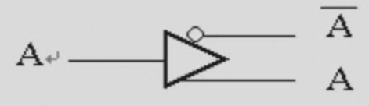
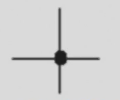
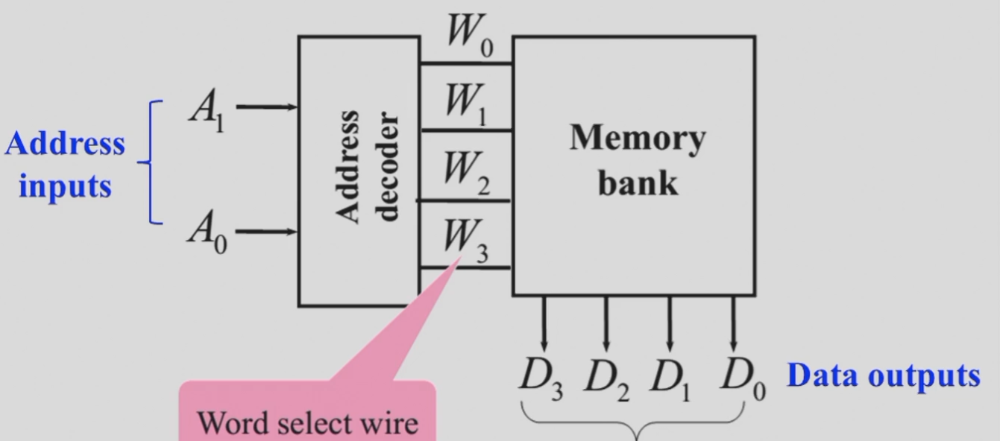
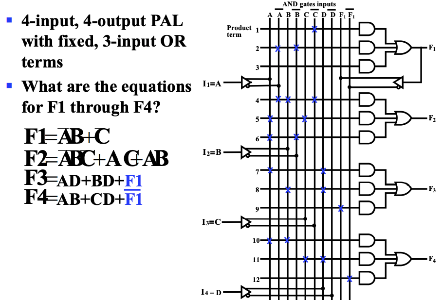
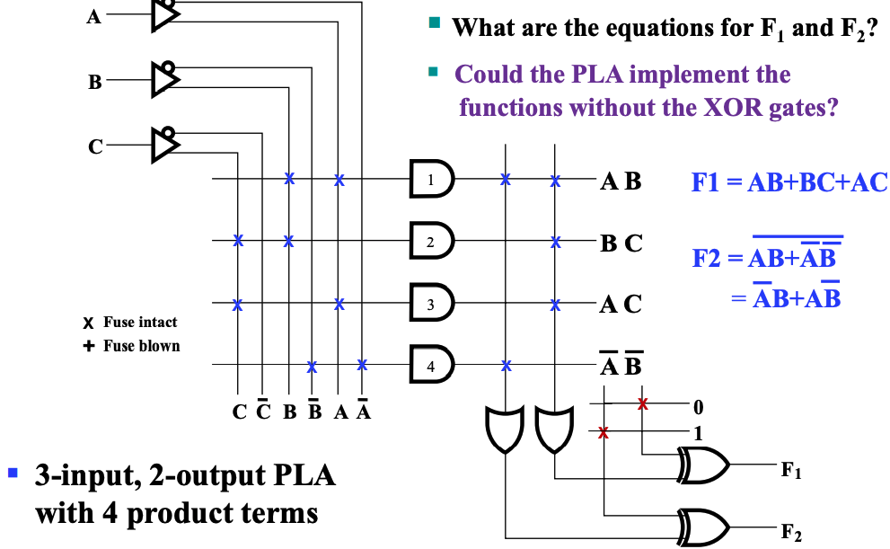
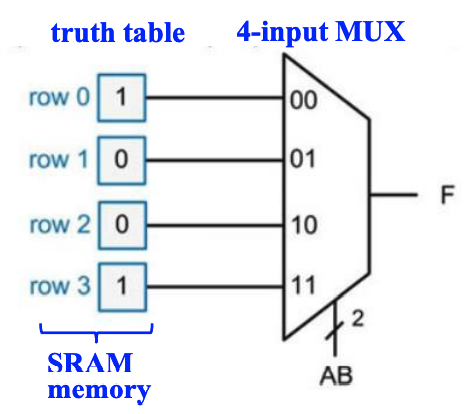
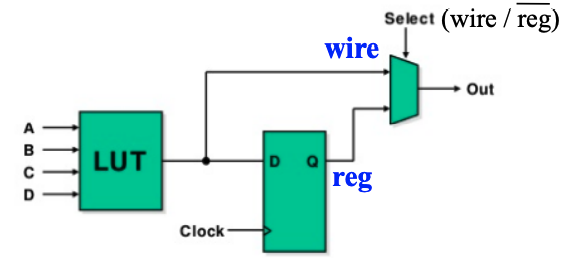
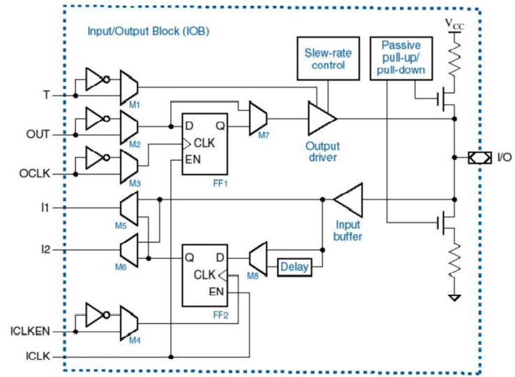

# Chap 5 Digital Hardware Implementation

!!! warning "注意"
    本章节在补天中完成，内容可能比较简略。

---

- [ ] TODO: Finish this.

---

## 可重编程技术

**可重编程技术(programmable implementation technologies)**

直接更改电路来修改电路功能被称为硬编程，而可重变成技术让我们能够不更改硬件布线的情况下，实现**逻辑功能的重新编辑**。

!!! eg "FPGA"
    [现场可编程逻辑门阵列(Field Programmable Gate Array, FPGA)](https://zh.wikipedia.org/zh-cn/%E7%8E%B0%E5%9C%BA%E5%8F%AF%E7%BC%96%E7%A8%8B%E9%80%BB%E8%BE%91%E9%97%A8%E9%98%B5%E5%88%97)
    - [查找表(lookup table, LUT)](https://zh.m.wikipedia.org/zh-hans/%E6%9F%A5%E6%89%BE%E8%A1%A8)

**编程技术(programming technologies)** 在硬件层面有三种实现手段：

- 控制连接来实现（不是可重编程）；
    - Mask programing
    - Fuse
    - Anti-fuse
- 控制门级电路电压；
    - Single-bit storage element
    - Stored charge on a floating gate
        - Erasable
        - Electrically erasable
        - Flash (as in Flash Memory) 
- 使用查找表(LUT)；
    - Storage elements for the function
        - 比如使用一个 `MUX`，并将输入端接内存，通过修改内存的值来修改 `MUX` 的行为，进而实现函数重编程

课程中介绍的可重编程的器件主要有如下四种：

- 只读内存 Read Only Memory (ROM) 
- 可编程阵列逻辑 Programmable Array Logic (PAL^Ⓡ^)
- 可编程逻辑阵列 Programmable Logic Array (PLA)
- Complex Programmable Logic Device (CPLD) or Field-Programmable Gate Array(FPGA)

前三者都只能重写一次，如下是它们的重写内容：

---

!!! info "引入"
    由于之后出现的电路图会非常庞大，所以需要引入一些逻辑符号。

### 逻辑符号介绍

!!! eg "Buffer"
    
    > 简化表示一个变量的自身和其非；

!!! eg "Wire connecting"
    在可编程逻辑电路中，线的连接不再只有单纯的连通和不连通的关系：

    对于两条相交导线：
    
    - 如果没有特殊符号，则表示这个交叉点 is not connected ；

    

    - 如果有一个 ❌，则表示这个交叉点 programmable；

    

    - 如果只有一个加粗的点，则表示这个交叉点 not programmable；

    

特别的，如果一个元器件的所有输入都是 programmable，我们也可以选择把这个 ❌ 画到逻辑门上（如下图 e 和 f）。

---

### ROM

ROM 的基本结构如下：

而 ROM 的大小如下计算（以上图为例）：

$$
\begin{aligned}
    ROM\;\;size\;\;&=\;\;address\;\;width\;\;\times\;\;word\;\;width&\\
                   &=\;\;2^2\;\;\times\;\;4\;\;=\;\;16\;\;bit&
\end{aligned}
$$

???+ eg "eg"
    更清晰的表示其内部逻辑的，可以将 ROM 写成这样：

    

---

### PAL

可重编程输入组合来得到固定输出。

其具有一个缺陷是，因为表达函数的方法不是通过 SOM 或者 POM 的形式，所以不一定能够完备表达函数。

在此基础上的一个改进是，通过将一个既有的 PAL 输出当作输入，输入到另外一个函数中，来弥补项不足的问题。

???+ eg "eg"
    

---

### PLA 

与 PAL 的区别在于，在输出的时候也能对输出组合进行重编程。

其同 PAL 一样具有一个缺陷是，因为表达函数的方法不是通过 SOM 或者 POM 的形式，所以不一定能够完备表达函数。

在基础上一个改进是在输出的时候再做一次异或（不用非门体现了可重编程的思想），以产生新的项，来弥补项不足的问题。

可以发现，出现了新的项。

---

### Lookup Tables

通过让数据源接内存，并通过修改真值表内的值，即修改内存里的值，来实现数据源的变化，来改变 `MUX` 的行为。

但是实际应用中，函数输入的数量会变化，因此我们需要通过灵活组合的方法（比如通过四选二选一的方式，用三个二选一的 `MUX` 来实现四选一）来实现多输入。

常见的 `LUT` 大小以 16bits 或 64bits 的 4 输入或 6 输入为主。

由于 `LUT` 存的本质上是真值表，所以它可以实现任意输入符合要求的逻辑函数。

所以，问题就变化为如何用较小的 `LUT` 来组合实现复杂的逻辑函数。

`LUT` 的基本结构如下：

`FPGA` 的基本结构如下：

其主要分为三个组成部分：

- CLB(Configurable Logic Block)
    - 大量存储 `LUT`
- SM(Switch Matrix)
    - 可编程的交换矩阵
- IOB(Input & Output Block)
    - 可编程的输入输出单元

---

#### CLB

CLB 是 `FPGA` 中的基础逻辑单元。

---

#### SM

通过相当复杂的算法， `SM` 会根据目标逻辑，选择链接不同的 `CLB` 以实现复杂逻辑。

它具有这些基本属性：

1. Flexibility: 评估一条线可以连接到多少线；
2. Topology: 哪些线可以被连接到；
3. Routability: 有多少回路可以被路由；

---

#### IOB

`IOB` 用来对外部设备进行连接，用来控制输入和输出。

---

??? eg "eg for `FPGA`"
    通过 `FPGA` 实现 $f=x_1x_2+\overline{x_2x_3}$：

    分解问题：$f_1 = x_1x_2,\;\;f_2=\overline{x_2x_3},\;\;f=f_1+f_2$。

    

在软件层面编程完后，会生成位流文件(`bitfile`)，下载到板时会更新 `FPGA` 中的内容。

---

!!! summary "组合函数的实现方法"
    到目前为止，不管是可重编程还是不可重编程，都已经介绍了很多方法，这里进行一次小结：

    1. `Decoder`s & `OR` gates
         - 将译码出来的需要的目标组合都 `OR` 在一起；
    2. `MUX`s
         - 通过多路选择器实现任意逻辑函数； 
    3. `ROM`s
    4. `PAL`s
    5. `PLA`s
    6. `LUT`s

