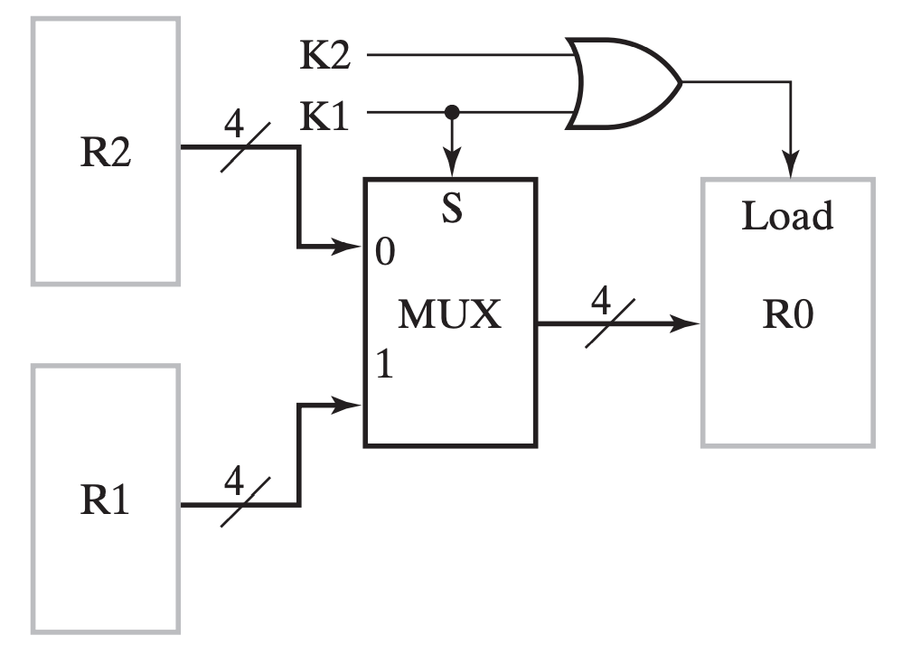
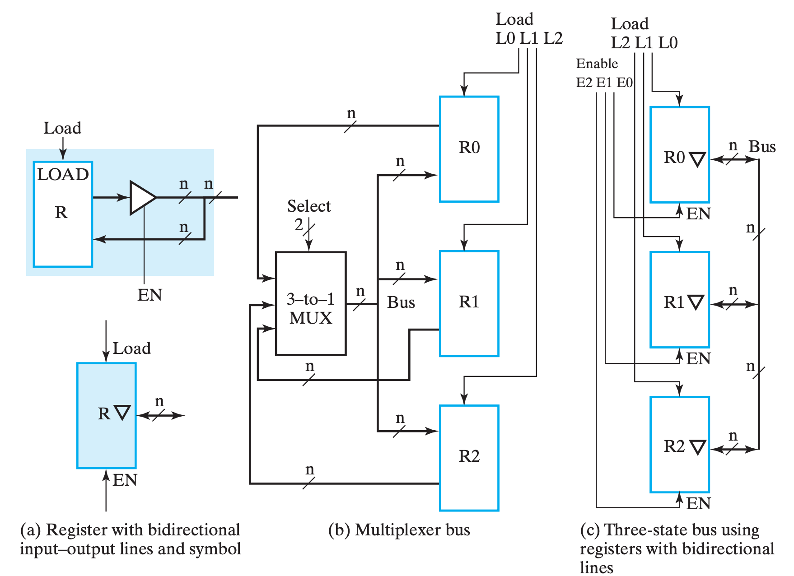

# Chap 6 Registers & Register Transfers

1. What's Registers
2. Registers transfers(a means of representing and specifying elementary processing operations)
3. Microoperations(Elementary operations performed on data stored in reg) and implementations

## 寄存器

**寄存器(registers)** 粗略的来说就是一堆触发器以及对应的状态控制电路，用来实现多位数据的存储等操作。

其中有一种特殊的寄存器叫 **计数器(counter)**，非常直白的，它的行为就是随着时钟周期不断在固定的状态序列中循环。更形象的，一般是实现自动的计数功能，像电子时钟那样。

> Registers are useful for storing and manipulating information; counters are employed in circuits that sequence and control operations in a digital system.

实现寄存器一个最直白的想法就是公用控制线路和分列数据线路来控制多个触发器，如下图是使用 D FF 实现的一个 4-bit register：

我们称新数据被写入寄存器的操作为 **载入(load)**，而如果载入操作在同一个时钟脉冲中完成，我们称之是 **并行(parallel)** 的。

---

## 保持

但是我们发现，如图的寄存器在每个时钟都允许载入，换句话来说每个时钟周期都会改变为输入。但是我们希望即使我们不管它它也能保持之前的值，主要有两个方案。

!!! tip "方案 A"
    其中一个做法是需要选择性的让它跟随时钟脉冲切换状态。做法就是将 Control 信号修改为 $C = \overline{Load} + Clock$，如此而来，当 $Load = 0$ 时，始终有 $C = 0$，脉冲消失，寄存器无法被载入。如下图，这种技术叫 **门控时钟(clock gating)**。

    

    !!! warning "clock skew"
        然而，在门控时钟技术中，由于添加了一个额外的逻辑门，时钟脉冲到达 Control 的时候会出现额外的传播延时，即 **时钟偏移(clock skew)**。而这微小的延时会导致在整个同步系统中，不同组件得到的时钟脉冲有偏差，而这是我们所不希望看到的。所以在实际设计中，我们应当避免或尽可能缩小时钟偏移。

!!! tip "方案 B"
    另外一个做法是，在不希望它修改的时候，不断将它的输入载入，也就是保持不变。我们可以通过一个 `MUX` 来实现这个功能，用 `EN` 使能端来选择是载入新值还是保持之前的值，如下图。

    

---

## 寄存器传送

!!! warning "说明"
    把 transfer 翻译为“传送”是我脑瓜一拍的行为，我并不知道翻译成什么比较合适，如果读者有更好的翻译，请告诉我！

一个复杂系统除了信息的存储还需要信息的传输和处理，换句话来说，为了实现灵活、复杂的计算，我们需要信息之间能够广泛地交互。大部分电子系统设计中，都会有一个 **控制单元(Control Unit)** 来负责指挥（决定指令的序列） **数据通路(Datapath)** 进行数据处理。

> Datapaths are defined by their registers and the operations performed on binary data stored in the registers.

对于寄存器自身而言，它可能实现 载入(load)、清空(clear)、位移(shift)（关于这里的shift的含义我存疑） 和 计数(count) 等。此外，对于那些寄存器中的数据进行移动了的加工，被称为 **寄存器传送操作(Register Transfer Operations)**，它们主要包含这三个部分：

1. 系统中的寄存器集合；
2. 对于数据的操作；
3. 监督操作序列的控制；

其中，最基础的那部分操作被称为 **微操作(microoperation)**，它们是实现复杂操作的基础，例如将 R1 的数据载入 R2，将 R1 和 R2 相加，或是自增 R1 等。它们通常以比特向量为载体并行实现的。

!!! warning "Note that:"
    > the term “microoperation,” as used here, does not refer to any particular way of producing the control signals: specifically, it does not imply that the control signals are generated by a control unit based on a technique called microprogramming.

---

### 寄存器传输操作 & 寄存器传输语言

对于简单的时序逻辑系统，我们可以使用状态机等方式来描述它们的行为，但是对与规模更大的系统来说，这是一件很痛苦的事情。所以我们引入了一种专注于行为逻辑的语言来描述寄存器传输中的逻辑行为：**寄存器传输语言(Register Transfer Language)RTL**。

通常具有特殊功能的寄存器都会用其名称缩写大写表示，例如 AR(Address Register)，PC(Program Counter)，IR(Instruction Register) 或者更普通的 R2(Register 2)。

> [Little-endian & Big-endian](https://www.geeksforgeeks.org/little-and-big-endian-mystery/)

我们有时候也会用这些形式来图形化的表示寄存器：

此外，常见操作用 RTL 表示方法和符号如下：

需要额外说明的是，如果我们想表达条件语句，例如我们想表达：

$$
if\, (K_1 = 1) \,then\, (R2 \leftarrow R1)
$$

则可以写为：

$$
K_1 : R2 \leftarrow R1
$$

---

## 微操作

> A microoperation is an elementary operation performed on data stored in registers or in memory.

微操作一般分为这四种：

1. 转移，transfer microoperations，将数据从一个寄存器转移到另外一个寄存器；
2. 算术，arithmetic microoperations，对数据的算术运算操作；
3. 逻辑，logic microoperations，对数据的逻辑运算操作；
4. 位移，shift microoperations，对数据的位移操作；

> A given microoperation may be of more than one type. For example, a 1s complement operation is both an arithmetic microoperation and a logic microoperation.

---

### 转移

不改变数据本身，只是从一个寄存器中把数据移动到另外一个寄存器。

---

### 算术

> Multiplication and division are not listed in Table 6-3. Multiplication can be represented by the symbol * and division by /. These two operations are not included in the basic set of arithmetic microoperations because they are assumed to be implemented by sequences of basic microoperations. However, multiplication can be considered as a microoperation if implemented by a combinational circuit. In such a case, the result is transferred into a destination register at the clock edge after all signals have propagated through the entire combinational circuit

!!! example "加减法器"
    就像我们之前学过的，用加法器实现加减法器，在 RTL 和模块逻辑电路的维度下，可以这么表示：

    $$
    \begin{array}{l}
        &\overline{X}K_1:R_1\leftarrow R_1 + R_2 \\
        &XK_1:R_1\leftarrow R_1 + \overline{R_2} + 1
    \end{array}
    $$

    

!!! warning "注意"
    对于如上出现的形式如：$condition: reg \leftarrow options one regs$ 的表达式，`:` 左侧出现的 `+` 表示或，右侧的则表示加（“乘”也是这样）！

---

### 逻辑

---

### 位移

---

## 寄存器传送的实现

### 基于 MUX 实现传送

对于一个单一寄存器，它的 **输入** 可能有多种来源，例如其它寄存器，又或者是其他操作的结果。总而言之，它的输入很可能是不唯一的，而同一时刻我们只能接受一个来源的输入。因此，我们需要使用 `MUX` 来对输入进行选择。

一个简单 🌰 如下：

用语言来描述这个总体架构就是，我们通过一系列 one-hot 编码（不确定，也许可能都为零？我感觉取决于 **[保持](#保持)** 的实现。）来表示选择哪个输入源（下图中 $K_0\sim K_{n-1}$），再通过 `Encoder` 将它们编码作为 `MUX` 的输入选择信号（下图中 $S_m \sim S_0$），从多个输入源（下图中 $k_0 \sim k_{n-1}$）中选择对应的源，并输出，给到 R0；此外，将选择信号都或起来，作为 R0 的 Load 信号输入。

!!! summary "小结"

    换句话来说，`MUX` 实现主要的实现了 **多对一** 的数据传输问题。如果我们单单使用 `MUX` 来完成寄存器之间的数据交互（假设所有寄存器都能相互传输数据），那将这个模型（图例在[下一小节](#基于总线实现传送)）抽象后，我们得到的将是一张“**[完全图](https://zh.wikipedia.org/zh-cn/%E5%AE%8C%E5%85%A8%E5%9C%96)**”，然而它肉眼可见的开销大。

    而总线则非常巧妙地优化了这个问题（并不是上位替代关系）。

---

### 基于总线实现传送

在[上一小节](#基于-mux-实现传送)的小结中我们已经提到了 `MUX` 实现的优劣，也提到了 **总线(bus)** 传输的优势，那么它具体来说其实现方法有两种——通过共有 `MUX` 实现，或通过三态门实现。

---

#### 共有 MUX 实现

让我们以三个寄存器的模型为例，对比通过专有 `MUX` 实现和通过 **单一总线(single bus)** 实现的区别：

首先对总线实现进行说明，同样是使用 `MUX`，但此时 `MUX` 不再是某个寄存器的 **专有逻辑(dedicated logic)**，而是三个寄存器共同使用的 **共有逻辑(shared logic)**。总线中的 `MUX` 在所有寄存器的输入中选择其中一个，并将它输出，给到所有寄存器；而总线通过控制 Load 信号来选择让哪个（或哪些）寄存器得到这个信号。

接下来进行对比，以总线实现为主体，与 `MUX` 实现对比：

- 优势：
    - 电路更精简，成本更低，随着寄存器增加这个特点更加明显；
- 劣势：
    - 同一时刻内总线只能传输一个数据，即只有一个数据源(source)；
        - 同一时钟周期内只有一个数据能传输到别的地方，例如交换操作就需要至少两个 bus 才能实现；

而因为这些特点，我们需要评估我们的需求，选择合适的结构来实现。

---

#### 三态门实现

三态门的相关内容已经在前面介绍，传送门在 **[这里](Chap02.md#三态门)** ，关于本小节的知识，可以重点关注 **[#三态门/碎碎念](Chap02.md#三态门)**。

而关于总线的实现，引用一句我在 **[#三态门/碎碎念](Chap02.md#三态门)** 里写的话：

> 只要我们让导线的若干输入中只有一个三态门不在「高阻态」，就能够优雅地实现多路输出互联。

实际上，所谓的三态门实现原理上和 `MUX` 实现无二，只不过我们是通过三态门来实现「路由」这个逻辑而已，也就是书上所说的：

> Three-state buffer outputs can be connected together to form a multiplexed output line.

与 `MUX` 实现相对比，三态门实现方式如下：

进行简单说明，\(c\) 中对三态门的表示进行了简化，含义参考 \(a\)。它想表达的主要含义是，当 `EN` 为 `1` 时，表示输出；反之表示输入（当然，真正决定是否读入寄存器的还是 `LD`）。

??? question "个人疑惑"
    书中的表述是：

    > If the three-state buffers are enabled, then the lines are outputs; if the three-state buffers are disabled, then the lines can be inputs.

    但是看 \(a\) 的表达，不管 `EN` 是什么，它应当都有输入才对，真正决定是否输入进来的应该还是 `LD`？

对比来看，三态门的实现大大降低了总线的实现成本，精简了电路的实现，所以通常来说更常用。

??? explain "个人想法"
    虽然书中说三态门的接线比 `MUX` 的少了一半，但我觉的三态门只是把线分岔的地方移动到了寄存器附近，换句话来说不如说是节省了导线的长度。但是随着输入的增加，`MUX` 的结构会越来越复杂且需要重新设计，但三态门只需要量的增加就行了，所以确实是更加吸引人。（当然，虽然书中没说，但是我觉得 Enable 必须 at most one-hot，而这部分的逻辑对于两个实现方法来说是一样的）

---

### 其它

