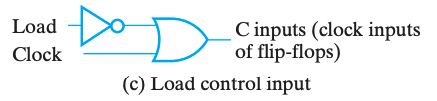

# Chap 6 Registers & Register Transfers

1. What's Registers
2. Registers transfers(a means of representing and specifying elementary processing operations)
3. Microoperations(Elementary operations performed on data stored in reg) and implementations

## 寄存器

**寄存器(registers)** 粗略的来说就是一堆触发器以及对应的状态控制电路，用来实现多位数据的存储等操作。

其中有一种特殊的寄存器叫 **计数器(counter)**，非常直白的，它的行为就是随着时钟周期不断在固定的状态序列中循环。更形象的，一般是实现自动的计数功能，像电子时钟那样。

> Registers are useful for storing and manipulating information; counters are employed in circuits that sequence and control operations in a digital system.

实现寄存器一个最直白的想法就是公用控制线路和分列数据线路来控制多个触发器，如下图是使用 D FF 实现的一个 4-bit register：

我们称新数据被写入寄存器的操作为 **载入(load)**，而如果载入操作在同一个时钟脉冲中完成，我们称之是 **并行(parallel)** 的。

但是我们发现，如图的寄存器在每个时钟都允许载入，换句话来说每个时钟周期都会改变为输入。但是我们希望即使我们不管它它也能保持之前的值。所以我们需要选择性的让它跟随时钟脉冲切换状态。做法就是将 Control 信号修改为 $C = \overline{Load} + Clock$，如此而来，当 $Load = 0$ 时，始终有 $C = 0$，脉冲消失，寄存器无法被载入。如下图，这种技术叫 **门控时钟(clock gating)**。

!!! warning "clock skew"
    然而，在门控时钟技术中，由于添加了一个额外的逻辑门，时钟脉冲到达 Control 的时候会出现额外的传播延时，即 **时钟偏移(clock skew)**。而这微小的延时会导致在整个同步系统中，不同组件得到的时钟脉冲有偏差，而这是我们所不希望看到的。

