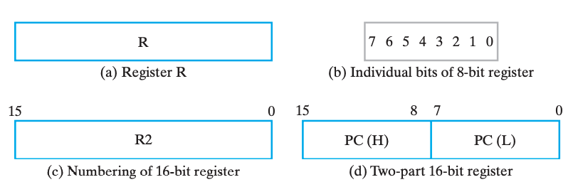
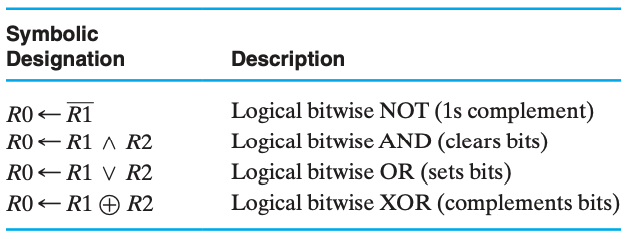

# Chap 6 Registers & Register Transfers

1. What's Registers
2. Registers transfers(a means of representing and specifying elementary processing operations)
3. Microoperations(Elementary operations performed on data stored in reg) and implementations

## 寄存器

**寄存器(registers)** 粗略的来说就是一堆触发器以及对应的状态控制电路，用来实现多位数据的存储等操作。

其中有一种特殊的寄存器叫 **计数器(counter)**，非常直白的，它的行为就是随着时钟周期不断在固定的状态序列中循环。更形象的，一般是实现自动的计数功能，像电子时钟那样。

> Registers are useful for storing and manipulating information; counters are employed in circuits that sequence and control operations in a digital system.

实现寄存器一个最直白的想法就是公用控制线路和分列数据线路来控制多个触发器，如下图是使用 D FF 实现的一个 4-bit register：

我们称新数据被写入寄存器的操作为 **载入(load)**，而如果载入操作在同一个时钟脉冲中完成，我们称之是 **并行(parallel)** 的。

但是我们发现，如图的寄存器在每个时钟都允许载入，换句话来说每个时钟周期都会改变为输入。但是我们希望即使我们不管它它也能保持之前的值，主要有两个方案。

!!! tip "方案 A"
    其中一个做法是需要选择性的让它跟随时钟脉冲切换状态。做法就是将 Control 信号修改为 $C = \overline{Load} + Clock$，如此而来，当 $Load = 0$ 时，始终有 $C = 0$，脉冲消失，寄存器无法被载入。如下图，这种技术叫 **门控时钟(clock gating)**。

    

    !!! warning "clock skew"
        然而，在门控时钟技术中，由于添加了一个额外的逻辑门，时钟脉冲到达 Control 的时候会出现额外的传播延时，即 **时钟偏移(clock skew)**。而这微小的延时会导致在整个同步系统中，不同组件得到的时钟脉冲有偏差，而这是我们所不希望看到的。所以在实际设计中，我们应当避免或尽可能缩小时钟偏移。

!!! tip "方案 B"
    另外一个做法是，在不希望它修改的时候，不断将它的输入载入，也就是保持不变。我们可以通过一个 `MUX` 来实现这个功能，用 `EN` 使能端来选择是载入新值还是保持之前的值，如下图。

    

---

## 寄存器传送

一个复杂系统除了信息的存储还需要信息的传输和处理。大部分电子系统设计中，都会有一个 **控制单元(Control Unit)** 来负责指挥（决定指令的序列） **数据通路(Datapath)** 进行数据处理。

> Datapaths are defined by their registers and the operations performed on binary data stored in the registers.

对于寄存器自身而言，它可能实现 载入(load)、清空(clear)、位移(shift)（关于这里的shift的含义我存疑） 和 计数(count) 等。此外，对于那些寄存器中的数据进行移动了的加工，被称为 **寄存器传送操作(Register Transfer Operations)**，它们主要包含这三个部分：

1. 系统中的寄存器集合；
2. 对于数据的操作；
3. 监督操作序列的控制；

其中，最基础的那部分操作被称为 **微操作(microoperation)**，它们是实现复杂操作的基础，例如将 R1 的数据载入 R2，将 R1 和 R2 相加，或是自增 R1 等。它们通常以比特向量为载体并行实现的。

!!! warning "Note that:"
    > the term “microoperation,” as used here, does not refer to any particular way of producing the control signals: specifically, it does not imply that the control signals are generated by a control unit based on a technique called microprogramming.

---

### 寄存器传输操作 & 寄存器传输语言

对于简单的时序逻辑系统，我们可以使用状态机等方式来描述它们的行为，但是对与规模更大的系统来说，这是一件很痛苦的事情。所以我们引入了一种专注于行为逻辑的语言来描述寄存器传输中的逻辑行为：**寄存器传输语言(Register Transfer Language)RTL**。

通常具有特殊功能的寄存器都会用其名称缩写大写表示，例如 AR(Address Register)，PC(Program Counter)，IR(Instruction Register) 或者更普通的 R2(Register 2)。

> [Little-endian & Big-endian](https://www.geeksforgeeks.org/little-and-big-endian-mystery/)

我们有时候也会用这些形式来图形化的表示寄存器：

此外，常见操作用 RTL 表示方法和符号如下：

需要额外说明的是，如果我们想表达条件语句，例如我们想表达：

$$
if\, (K_1 = 1) \,then\, (R2 \leftarrow R1)
$$

则可以写为：

$$
K_1 : R2 \leftarrow R1
$$

---

## 微操作

> A microoperation is an elementary operation performed on data stored in registers or in memory.

微操作一般分为这四种：

1. 转移，transfer microoperations，将数据从一个寄存器转移到另外一个寄存器；
2. 算术，arithmetic microoperations，对数据的算术运算操作；
3. 逻辑，logic microoperations，对数据的逻辑运算操作；
4. 位移，shift microoperations，对数据的位移操作；

> A given microoperation may be of more than one type. For example, a 1s complement operation is both an arithmetic microoperation and a logic microoperation.

---

### 转移

不改变数据本身，只是从一个寄存器中把数据移动到另外一个寄存器。

---

### 算术

> Multiplication and division are not listed in Table 6-3. Multiplication can be represented by the symbol * and division by /. These two operations are not included in the basic set of arithmetic microoperations because they are assumed to be implemented by sequences of basic microoperations. However, multiplication can be considered as a microoperation if implemented by a combinational circuit. In such a case, the result is transferred into a destination register at the clock edge after all signals have propagated through the entire combinational circuit

!!! example "加减法器"
    就像我们之前学过的，用加法器实现加减法器，在 RTL 和模块逻辑电路的维度下，可以这么表示：

    $$
    \begin{array}{l}
        &\overline{X}K_1:R_1\leftarrow R_1 + R_2 \\
        &XK_1:R_1\leftarrow R_1 + \overline{R_2} + 1
    \end{array}
    $$

    

---

### 逻辑

---

### 位移

---

## 单寄存器上微操作的实现

### 基于 MUX 实现传送

---

### 基于总线实现传送

---

### 树状状态总线

---

### 其它

