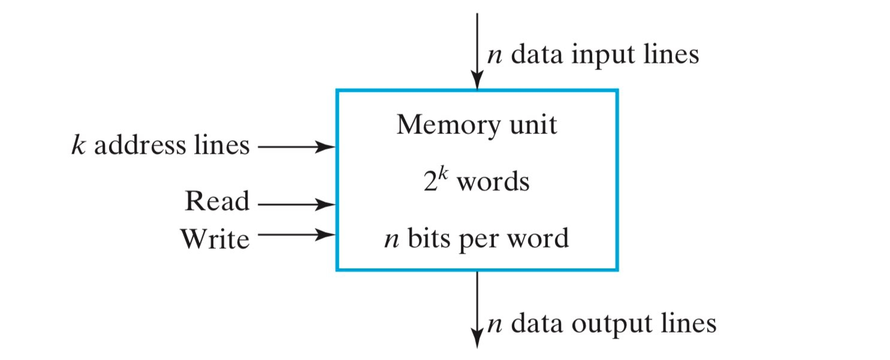
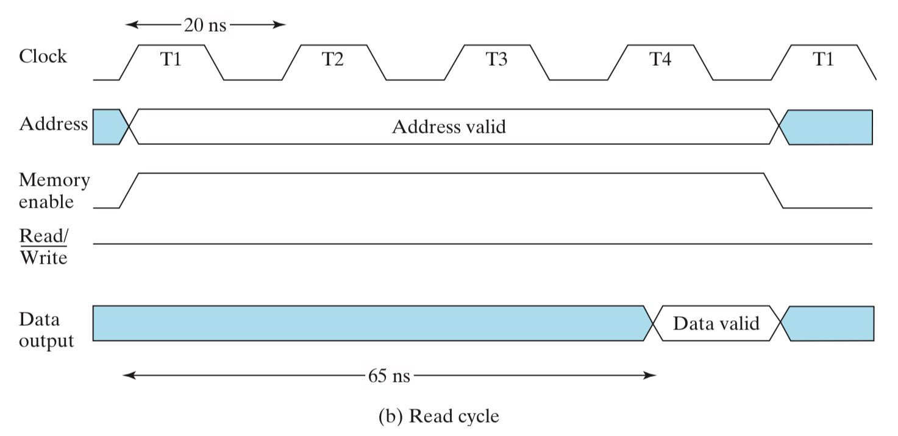
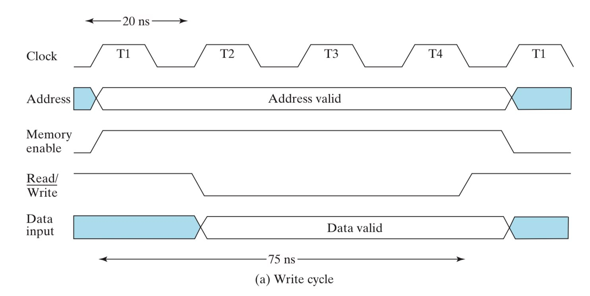
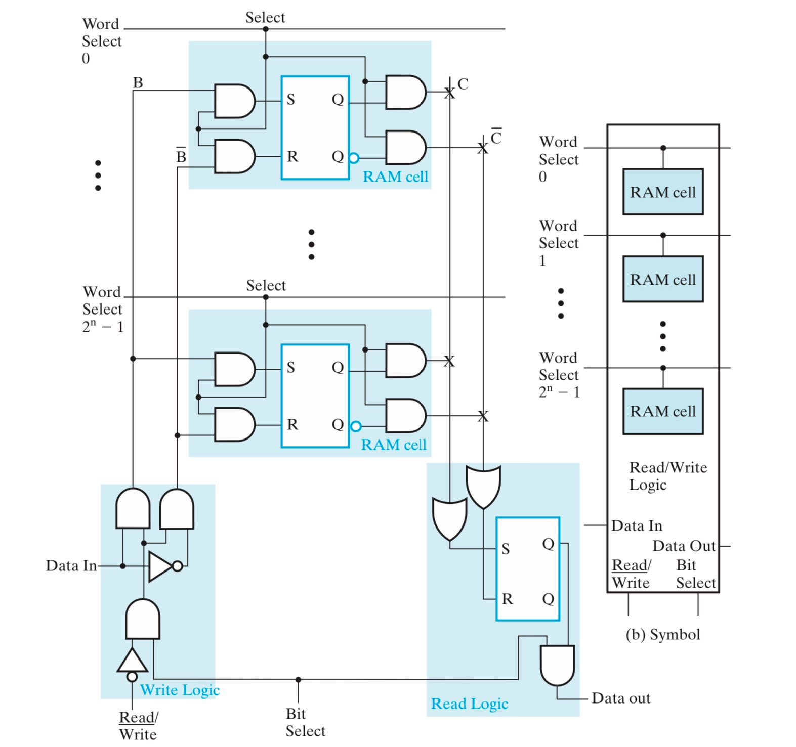
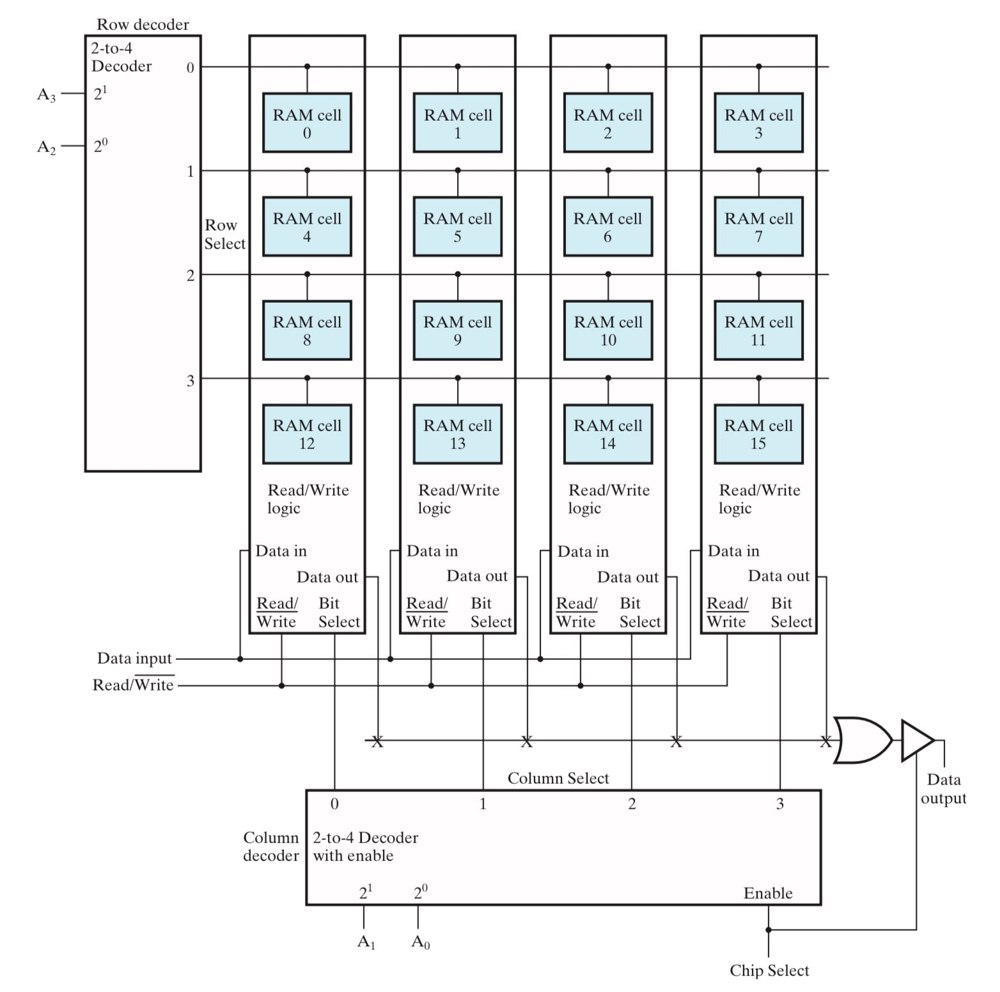
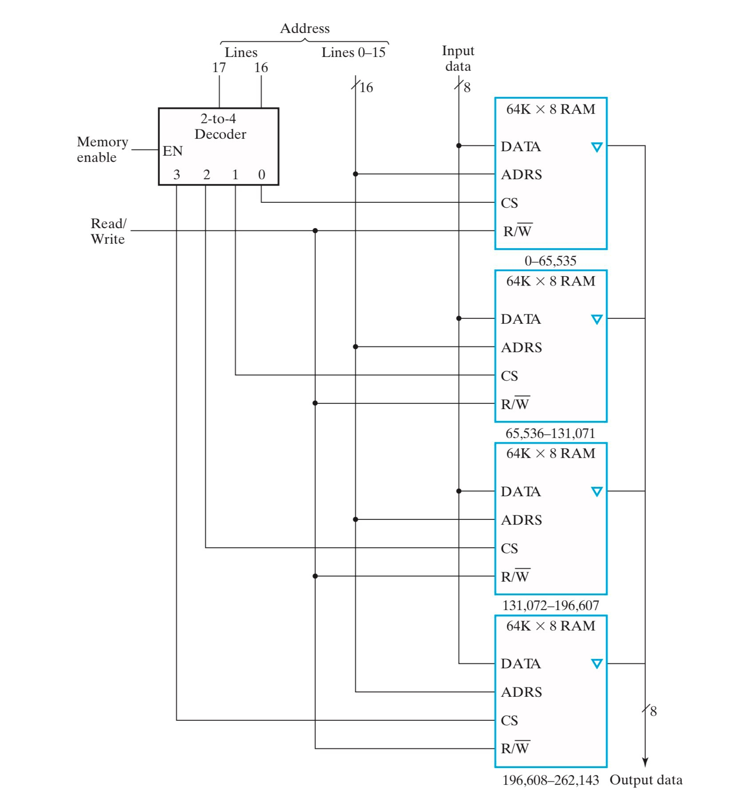
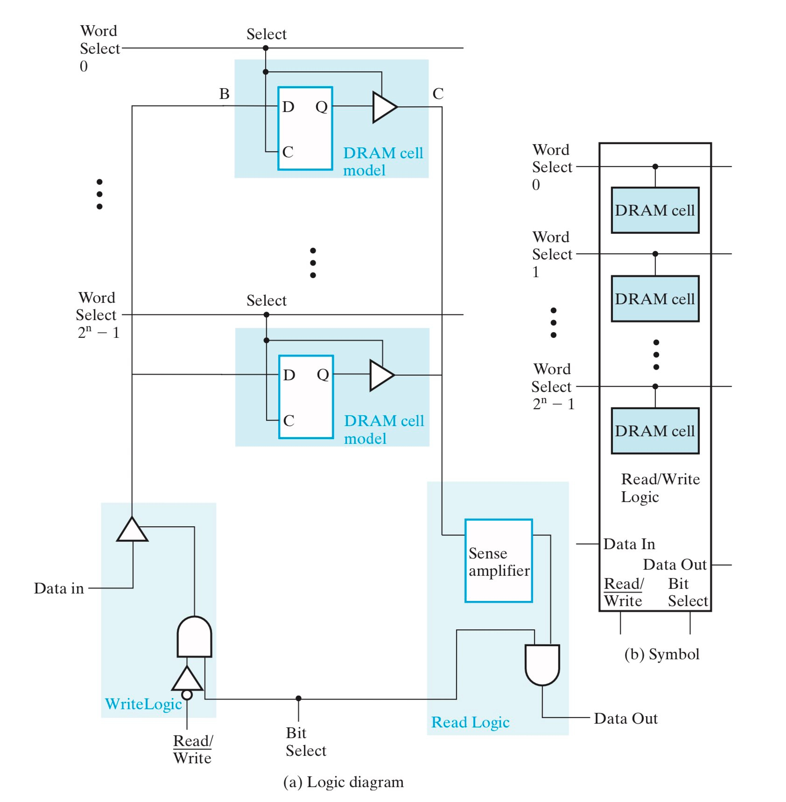
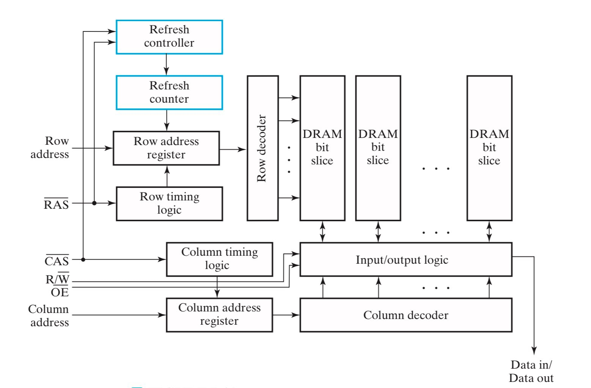
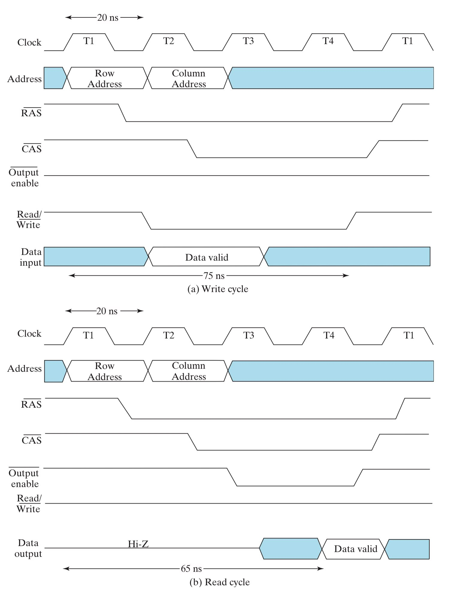
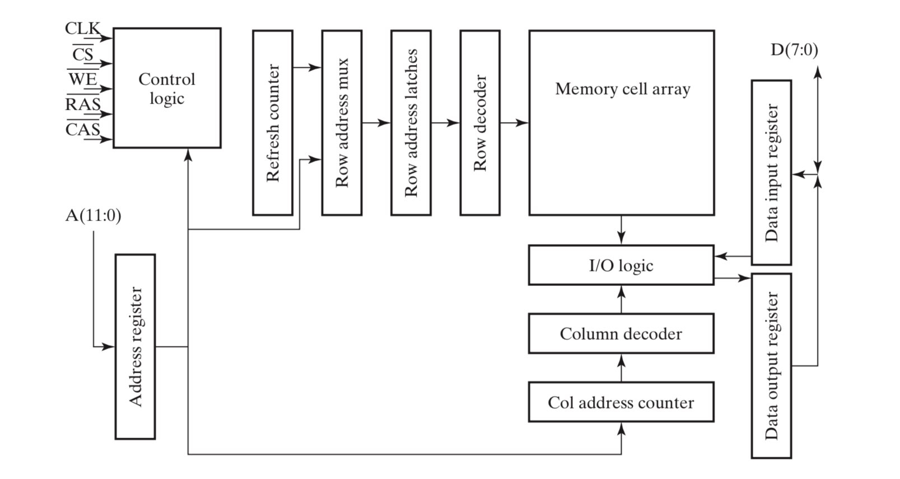

# Chap 7 Memory Basics

!!! info "引入"

    本章内容主要包括以下几个重点：

    - 内存与 RAM 的基本概念，理解如何通过地址来访问内存，并分析读写操作的时序；
    - 以 SRAM 为例，从 cell -> bit slice -> 2-dimensional cell arrays -> chip 逐步搭建起一个大型内存；
    - DRAM 的原理，理解如何通过时钟同步和 burst read 来提高 DRAM 内存访问速度；

---

## 内存

**内存(Memory)**由一系列存储单元与相应的逻辑电路组成，计算机中的内存包括两类：**随机访问内存(Random-Access Memory)**与**只读内存(Read-Only Memory)**。这两类内存都需要借助**地址(address)**来实现对数据的读与写。其中，只读内存（即 ROM）的相关知识已经在 [第五章#ROM](Chap05.md#rom) 中提及，本章主要讨论随机访问内存（即 RAM）。

!!! info "为什么 RAM 是随机访问？"

    当读者看到“随机访问”这个词，或许会感到疑惑：难道还有什么内存是不可以随机访问的吗？

    事实上，**随机访问**的含义是，内存中数据的读取和写入操作所需要的时间与这些数据所在的位置无关。相对地，**串行访问内存(Serial Memory)**中，对不同位置的数据进行读和写操作所需要的时间不一定是相同的，硬盘就是一种典型的串行访问内存。

---

### 组织架构

**内存组织架构(Memory Organization)**反映了内存中的数据是如何通过地址被访问的。

!!! note "数据类型"

    计算机中常用的数据类型主要有三种：

    - **位(bit)**：最小单元
    - **字节(byte)**：8 个连续的 bit
    - **字(word)**：特定数量的连续的 bit，由内存类型决定，传统意义上 1 word = 4 bytes

内存组织架构可以理解为一个数组，数组中以 word 为单位存储内存数据，地址则作为数组的索引，用于访问内存中的数据。换言之，内存组织架构可以描述为**用多少数量的地址来访问多少数量的数据**。下面给出几个内存组织架构的具体例子：

!!! eg "内存组织架构示例"

    - Digital Equipment Corporation PDP-8： 
      用 12-bit 的地址来访问 $2^{12}$ 个 12-bit words；
    - IBM 360： 
      用 24-bit 的地址来访问 $2^{24}$ 个 8-bit bytes，或者说 $2^{22}$ 个 32-bit words；
    - Intel 8080： 
      用 16-bit 的地址来访问 $2^{16}$ 个 8-bit bytes；

    还有一个更加具体的组织架构分析，详见 [#SDRAM](#sdram)。

考虑一个 $2^k\times n$ 的内存单元，$k$ 表示地址的位宽，$n$ 表示 word 的位宽。这个内存单元的示意图如下，其中，$k$-bit 的地址经过 decoder 译码，得到的 $2^k$ 个输出分别与 $2^k$ 个 word 形成唯一确定的连接，从而达到寻址的目的；每个 word 由 $n$-bit 组成，所以输入和输出也都是 $n$-bit 的。

---

### 基本操作

内存中最基本的操作就是**读(read)**操作和**写(write)**操作，一些特殊的内存（比如 Flash）还有**擦(erase)**操作。

上图展示了一个规范的**读操作**，其中：

- Memory enable 是使能信号，高电平代表内存使能，可以进行读写操作；
- R/W 是读写信号，高电平表示读操作，低电平表示写操作；

上图展示了一个规范的**写操作**，注意到：

- 地址必须在 R/W 信号下降沿之前确定下来（称为 valid），并在 R/W 信号上升沿之后再消失，这是为了确保写操作发生的过程中，地址始终是确定且不变的，以免写操作破坏到其他地址的数据；
- 待写入的新数据必须在 R/W 信号上升沿之后再消失，以免写入失败；

---

## 静态内存

RAM 可以分为**静态内存(Static RAM, or SRAM)**和**动态内存(Dynamic RAM, or DRAM)**两种：

- SRAM：数据存储在锁存器(latch)中；
- DRAM：数据存储在电容中，以电荷量的形式存储；

### SRAM Cell

首先考虑一个 SRAM 的最小单元，即 **SRAM Cell**（下面简称为 RAM Cell），用于存储 1-bit 的信息。

这个 RAM Cell 是通过一个 SR Latch 实现的，当 select 置 `0` 时，表示 RAM Cell 未被使能，锁存器中的数据处于保持状态，输出恒为 `1`；当 select 置 `1` 时，锁存器中的数据由 B 端的输入信号决定，C 端输出锁存器中存储的数据。但是，现在这样一个简单的 RAM Cell 还无法实现真正意义上的读和写操作，还需要一些外部逻辑电路，详见 [#SRAM Bit Slice](#sram-bit-slice)。

---

### SRAM Bit Slice

利用若干个 RAM Cell，以及一些逻辑电路，可以设计出 **SRAM Bit Slice**。

下图中：

- 当 bit select 置 `1` 时，表示这个 SRAM Bit Slice 被使能，可以进行读写操作；
- word select 用于选择对哪一个 cell 进行操作，在同一个 slice 中，每次只有一个 cell 能被 word select 使能，即每次只能对一个 cell 进行操作；
    - 换言之，$2^n$ 条 word select 中，只能存在至多一个置 `1`，其余均置 `0`；
- 读和写操作的逻辑电路如图所示，当 R/W 置 `0` 时，表示正在进行写操作；
    - 当写操作正常进行时，输入进来的新数据其实被总线输送给了所有的 cell，但只有被 word select 使能的那个 cell 才可以写入这个新数据；
    - 注意，对于这幅图而言，不论 R/W 置任何值，读操作都在正常进行；如果不想进行读操作，可以将 word select 全部置 `0`；

---

### 重合选择

随着内存的扩大，一个 slice 中的 cell 数量不断扩大，寻址所需要的 decoder 的位宽不断扩大，输入总线的扇出也在不断扩大。但是，decoder 的位宽和输入总线的扇出都是有限的，很容易制约内存的扩大。下图为一个 $16\times 1$ RAM：

一种有效的解决方法是**重合选择(coincident selection)**，即使用两个 decoder，分别负责横向和纵向的寻址。下面使用 $4\times 4$ 重合选择的 RAM 阵列($4\times 4$ RAM Cell Array)来实现 $16\times 1$ RAM：

!!! tip "$16\times 1$ RAM using $4\times 4$ RAM Cell Array"

    - 下图使用两个 2-to-4 decoder 替代了 $16\times 1$ RAM 中的 4-to-16 decoder；
    - 地址使用 4-bit 表示，其中 2-bit 被分给了 column decoder，用于选择访问哪个 slice；另外 2-bit 被分给了 row decoder，用于选择访问 slice 中的哪一行 cell；

    

---

$16\times 1$ RAM 中的 word 是 1-bit 的，所以图中每个 cell 都表示一个 word。而在设计具有更大位宽的 RAM 时，重合选择会稍有不同，注意观察下面这个例子和上面例子的区别：

!!! tip "$8\times 2$ RAM using $4\times 4$ RAM Cell Array"

    - 地址使用 3-bit 表示，其中 1-bit 被分给了 column decoder，另外 2-bit 分被分给了 row decoder；
    - 输入和输出都是 2-bit 的，input 0 被传输给了第一、三个 slice，input 1 被传输给了第二、四个 slice；
    - word 是 2-bit 的，由两个 cell 来表示。图中，cell 0 和 cell 1 表示一个 word，cell 2 和 cell 3 表示一个 word，cell 4 和 cell 5 表示一个 word，以此类推；

    

---

### 字扩展与位扩展

内存的容量由 **word 的数量和位宽**（即每个 word 由多少个 bit 组成）决定。要想扩展内存，可以从 word 的数量和位宽这两个角度进行：

- **字扩展**（扩展 word 的数量）：将多个 RAM “并联”，并相应地扩展地址的位宽；
- **位扩展**（扩展 word 的位宽）：将多个 RAM “串联”，并相应地扩展输入输出的位宽；

下面考虑用 $64\text{K}\times 8$ RAM 扩展得到 $256\text{K}\times 8$ RAM 和 $64\text{K}\times 16$ RAM：

!!! tip "字扩展：$256\text{K}\times 8$ RAM"

    - 输入信号和 0-15 位地址通过总线传递给每个 $64\text{K}\times 8$ RAM，输出信号通过总线从每个 $64\text{K}\times 8$ RAM 中通过三态门接出，可以理解为 RAM 的“**并联**”；
    - 通过 16-17 位地址来选择访问哪个 $64\text{K}\times 8$ RAM，再根据 0-15 位地址来选择访问该 RAM 中的具体哪个 word；
    - 图中的倒三角表示输出是由一个三态门接出的（参见 [#重合选择](#重合选择)）；

    

!!! tip "位扩展：$64\text{K}\times 16$ RAM"

    - 16-bit 输入信号分成两路 8-bit，分别传输给两个 $64\text{K}\times 8$ RAM，16-bit 输出信号由两个 $64\text{K}\times 8$ RAM 分别产生的 8-bit 组成，可以理解为 RAM 的“**串联**”；
    - 地址不变，相当于同时选中这两个 $64\text{K}\times 8$ RAM 中的某两个 word，而这两个 8-bit word 等价地表示了一个 16-bit word；

    

---

## 动态内存

前面提到，动态内存是利用电容中的电荷来存储数据的。由于电容会慢慢**漏电(leak)**，所以需要定期**刷新(refresh)**电容（针对存储着高电平数据的电容而言，存储着低电平数据的电容本身就是低电荷量的，不需要刷新），才能确保存储着的数据不会失效，因此这种内存是动态的。

### DRAM Cell

DRAM Cell 和 SRAM Cell 基本类似，也拥有一个 select 使能端和一组输入输出端，唯一的区别在于存储器的不同。SRAM Cell 使用一个锁存器来存储数据，而 DRAM Cell 使用**一个电容**和**一个晶体管**来存储数据。

- 晶体管 T 可以视作一个开关，用来连接外部输入信号 B 和电容 C；
- 电容 C 用于存储数据，当电容为满（电荷量高于某一阈值）时表示高电平（如图 (b)），当电容为空（电荷量低于某一阈值）时表示低电平（如图 (c)）；

下面考虑 DRAM Cell 的读操作和写操作：

- 写操作：如图 (d) 写入高电平，如图 (e) 写入低电平；
- 读操作：如图 (f) 读取高电平，当 T 打开时，左侧输入端可以监测到一个电荷量的升高，这就代表读取到的数据是高电平；而相应地，右侧电容中的电荷量也有所降低；如图 (g) 读取低电平同理；
    - 不难发现，每次读操作都会稍微改变电容中存储的电荷量，因此对于每一次读操作，都要进行**复位(restore)**，也就是将电容中的电荷量恢复到读操作之前的水平；

---

### DRAM Bit Slice

DRAM Bit Slice 和 SRAM Bit Slice 基本类似，前者的输出端会额外加一个放大器，从而将电荷量微小的变化转化成数字信号。虽然电路结构并没有本质差别，但两者**实际的电路开销**却区别很大。DRAM cell 含有一个电容和一个晶体管，而 SRAM cell 含有六个晶体管，所以 DRAM 的每 bit 的开销显著低于 SRAM，这也是 DRAM 在大型内存中被更加广泛的应用的原因。

---

DRAM 常用于大型内存，而在这些内存中，地址会变得很长（超过 20-bit），以至于 DRAM 的引脚数量不足以一次性接收这么长的地址。解决方法是将地址**分成两部分串行的输入**到 DRAM 里来，首先是 row address，然后紧接着是 column address（注意到这里也有重合选择的思想）。

下图中：

- 由于地址被分成两部分串行输入到 DRAM 里来，因此需要用 register 分别存储 row address 和 column address；
- RAS(Row Address Strobe) 和 CAS(Column Address Strobe) 用作 register 的载入信号，置 `0` 表示载入；
- 对于写操作，当 row address 选中某一行的时候，除了被写入的 cell 之外，这一行中的其他 cell 也被使能并进行了 restore 操作；
- 对于读操作，当 row address 选中某一行的时候，包括要读取的 cell 在内，这一行中的所有 cell 都被使能并进行了 restore 操作；
- refresh controller 和 refresh counter 模块负责实现 refresh 功能；

=== "DRAM 框图"

    

=== "读写时序图"

    

---

## DRAM 类型

为了追求更快的内存访问速度，一些特殊类型的 DRAM 也被设计出来。这里主要介绍以下三种 DRAM：

- Synchronous DRAM（即 **SDRAM**）：不同于 DRAM 的异步，SDRAM 增加了一个时钟来实现**同步**；
- Double-data-rate synchronous DRAM（即 **DDR SDRAM**）：与 SDRAM 基本一致，但同时利用了时钟的上升沿和下降沿来输出数据；
- Rambus^Ⓡ^ DRAM（即 **RDRAM**）：专利技术，用相对更窄的总线来实现极高的内存访问速度；

!!! info "引入"

    为了解释这些 DRAM 是如何达到更快的内存访问速度的，这里有必要先介绍两个事实：

    1. 现代计算机中，绝大多数时候从 DRAM 中读取的数据并没有直接传输给 CPU，而是被存放在了高速缓存(cache)中。高速缓存从 DRAM 中读取数据的时候，总是一次性读取一串相邻的字节，这被称为**爆发模式读取数据(burst read)**。对于 burst read 而言，影响速度的最重要因素不再是寻址的时间，而是连续读取相邻字节的时间；
    2. DRAM 的特性是，每当 row address 选中某一行时，这一行内的所有 cell 都被使能，即都是可访问的；

    所以，DRAM 的这种特性，使得它非常适合 burst read，即连续读取同一行中的相邻字节。利用 burst read，DRAM 可以达到更快的内存访问速度。

---

### SDRAM

下图是一个 $16\text{MB}$ SDRAM：

- 为了适配 SDRAM 的同步特性，地址、输入、输出都需要使用寄存器；
- column address counter 是 SDRAM 的核心模块，后面我们将介绍它是如何工作的；

!!! info "分析一下内存组织架构！"

    为了后续内容的介绍，这里有必要先分析一下这个 $16\text{MB}$ SDRAM 的内存组织架构：

    - $16\text{MB}$ 内存意味着一共有 $2^{27}$ bits，考虑重合选择（使行列数尽可能接近），不妨令行数为 $2^{13}$，列数为 $2^{14}$，显然 row address 是 13-bit 的（column address 并不是 14-bit，见下文）；
    - 注意到输入输出的位宽是 8-bit，所以这个内存的字长是 8-bit；所以 column 的寻址是以 8-bit（即 1-word）为单位的，共有 $2^{14}/8=2^{11}$ 个 word，column address 是 11-bit 的；
    - 所以地址的总长是 13+11=24 bits，这也恰恰对应了这个 $16\text{MB}$ 内存中的 $2^{24}$ 个 8-bit 的 word；

---

下面介绍 SDRAM 是如何实现读操作的。

- 首先这个 SDRAM 接收到 row address，并将 row address 指向的那一行的全部 $2^{11}$ 个 word 全部读取出来，存放到 I/O logic 里，这一操作需要历时若干个时钟周期（下图中为 4 个时钟周期）；
- 然后这个 SDRAM 接收到 column address，并按照 column address 的指示从 I/O logic 中读取数据并输出，每个时钟周期输出一个 word；
- 注意，SDRAM 通常不会只读取并输出一个 word，而是会读取并输出一串连续的 word（即 burst read），这个操作由 column address counter 来实现；column address counter 中有一个关键参数，用于表示一次 burst read 需要读出多少个 word，称为 busrt length（下图中的 burst length 是 4）；
- 假设 $t_{CLK}$ 为 7.5 ns，则 $t_{RC}$ 为 60ns（8 个时钟周期），那么这个 SDRAM 的**内存带宽(memory bandwidth)** 为 4 words / 60 ns = 66.67 MB/s；

??? question "为什么图中的输出顺序是 B1,B2,B3,B0？"

    在这个情形中，CPU 请求从内存中读取 B1 这个数据，所以 row address 和 column address 分别表示 B1 所处的行和列。然而事实上 cache 不仅仅会读取出 B1，还会把与 B1 相邻的若干个数据一起读取出来（即 burst read）。

    在 SDRAM 中，column address counter 负责实现这个 burst read，它根据给定的 column addre 和 burst length，在 I/O logic 中先找到 B1，并继续读取 B1 后面的数据，直到读取出 burst length 个数据（这个情形中，即 4 个数据）。

    在这里，B1 表示这个 word 以 `01` 结尾，所以接下去的 3 个输出是 B2（以 `10` 结尾）、B3（以 `11` 结尾）、B0（以 `00` 结尾），注意到这其实是一个模 4 的循环序列，除了最后两位不同，其余位都是相同的。

    换言之，B1 才是 CPU 请求访问的数据，而 B2、B3、B0 都是 cache 自作主张从 SDRAM 中 burst read 出来的。但这样的自作主张是有意义的，因为大多数时候，CPU 访问了 B1 后，会继续访问紧随其后的数据，所以从结果上看，SDRAM 实现了更快的内存访问速度。

---

### DDR SDRAM

DDR SDRAM 和 SDRAM 基本一致，但它从 I/O logic 中读取数据并输出的速度是 SDRAM 的两倍（内存带宽为 133.33 MB/s），因为它在时钟的上升沿和下降沿都会输出。以上面分析 SDRAM 的那幅图为例，同样的时间 $t_{RC}$，SDRAM 可以输出 4 个 word，而 DDR SDRAM 可以输出 8 个 word。

---

### RDRAM

!!! warning "提醒"

    RDRAM 相关内容课堂上只是一带而过，这里也仅列出一些概念，有个印象即可。

RDRAM 使用 packet-based bus 来传输数据，也就是说数据以 packet 的形式被封装起来并进行传输。

- 总线 bus 中包含：
    - 3-bit row address bus
    - 5-bit column address bus
    - 16-bit 或 18-bit data bus
- 总线 bus 是同步的，且在时钟上升沿和下降沿都能响应；
- 数据包 packet 历时 4 个时钟周期来实现 8 次传输，所以每个 packet 中包含：
    - 24-bit row address packet
    - 40-bit column address packet
    - 128-bit 或 144-bit data packet
- RDRAM 利用 multiple memory bank 技术，使得不同 row address 的数据可以被并行地访问到(concurrent memory accesses)；
- RDRAM 通过复杂的电路设计，可以将时钟频率变得很高，从而大大提高内存访问速度；

<!-- 这部分内容已经被重构成上文，为了后续维护方便，故先隐藏在此，作为原作者的副本。 # MinJoker

!!! summary "框架"
    - Two types: RAM & ROM
        - RAM ship consists of an array of RAM cells, decoders, write circuits, read circuits, output circuits
        - RAM bit slice
        - DRAM
        - Error-detection and correction codes, often based on Hamming codes
    - R&W operations have specific steps and associated timing parameters: access time & write cycle time
    - static(SRAM) or dynamic(DRAM), volatile or nonvolatile

## 7-1 Memory

> Two types of memories are used in various parts of a computer: random-access memory (RAM) and read-only memory (ROM). RAM accepts new information for storage to be available later for use. The process of storing new information in memory is referred to as a memory write operation. The process of transferring the stored information out of memory is referred to as a memory read operation. RAM can perform both the write and the read operations, whereas ROM, as introduced in Section 6-8, performs only read operations. RAM sizes may range from hundreds to billions of bits.

> Memory is a collection of binary storage cells together with associated circuits needed to transfer information into and out of the cells.

## 7-2 RAM

> Memory cells can be accessed to transfer information to or from any desired location, with the access taking the same time regardless of the location, hence the name random-access memory. In contrast,serial memory, such as is exhibited by a hard drive, takes different lengths of time to access information, depending on where the desired location is relative to the current physical position of the disk.

`word`: 

> A word is an entity of bits that moves in and out of memory as a unit—a group of 1s and 0s that represents a number, an instruction, one or more alphanumeric characters, or other binary-coded information.

> A group of eight bits is called a byte. 

> Most computer memories use words that are multiples of eight bits in length. Thus, a 16-bit word contains two bytes, and a 32-bit word is made up of four bytes. **The capacity of a memory** unit is usually stated as the total number of bytes that it can store.

>  Communication between a memory and its environment is achieved through **data input and output lines, address selection lines, and control lines** that specify the direction of transfer of information.

> Computer memory varies greatly in size. It is customary to refer to the number of words (or bytes) in memory with one of the letters K (kilo), M (mega), or G (giga). K is equal to 2^10, M to 2^20, and G to 2^30.

>  A word in memory is selected by its binary address. When a word is read or written, the memory operates on all 16 bits as a single unit.

> The 1K * 16 memory of the figure has 10 bits in the address and 16 bits in each word. The number of address bits needed in memory is dependent on the total number of words that can be stored and is independent of the number of bits in each word. The number of bits in the address for a word is determined from the relationship 2^k >= m, where m is the total number of words and k is the minimum number of address bits satisfying the relationship.

> The two operations that a random-access memory can perform are write and read. A write is a transfer into memory of a new word to be stored. A read is a transfer of a copy of a stored word out of memory.

> The steps that must be taken for a write are as follows:
> 
> 1. Apply the binary address of the desired word to the address lines.
> 2. Apply the data bits that must be stored in memory to the data input lines.
> 3. Activate the Write input.
> 
> The memory unit will then take the bits from the data input lines and store them in the word specified by the address lines.The steps that must be taken for a read are as follows:
> 
> 1. Apply the binary address of the desired word to the address lines.
> 2. Activate the Read input.
> 
> The memory will then take the bits from the word that has been selected by the address and apply them to the data output lines. The contents of the selected word are not changed by reading them.

...

> To avoid destroying data in other memory words, it is important that this change occur after the signals on the address lines have become fixed at the desired values. 

-->