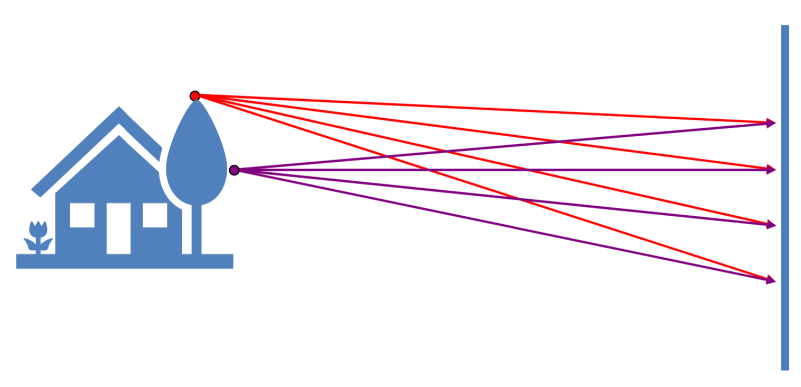
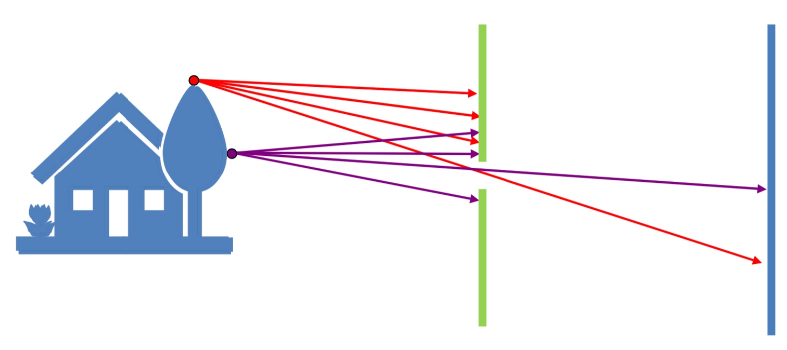
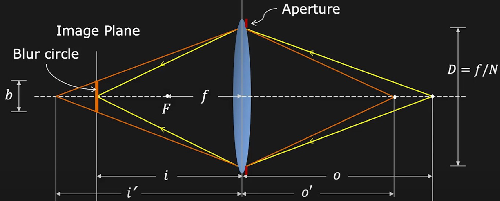
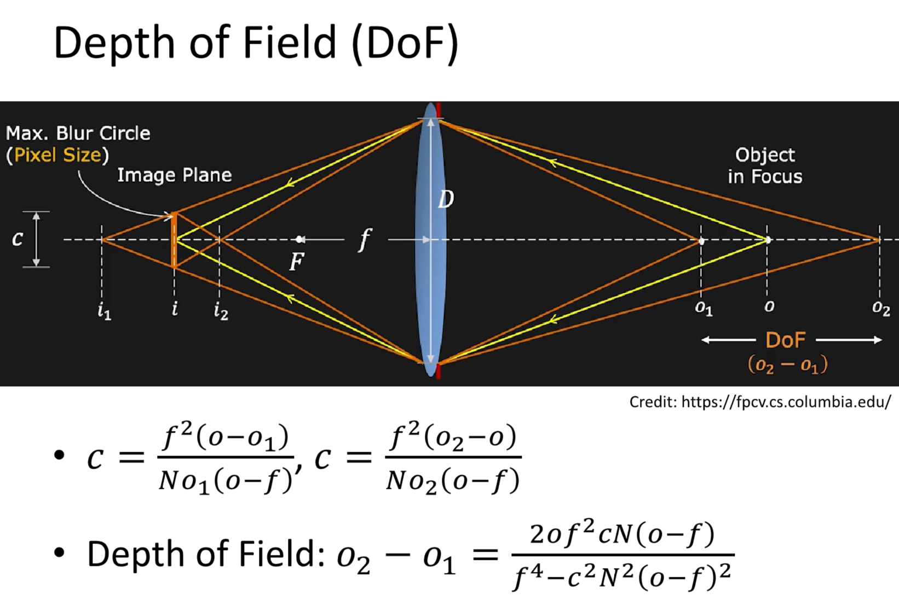
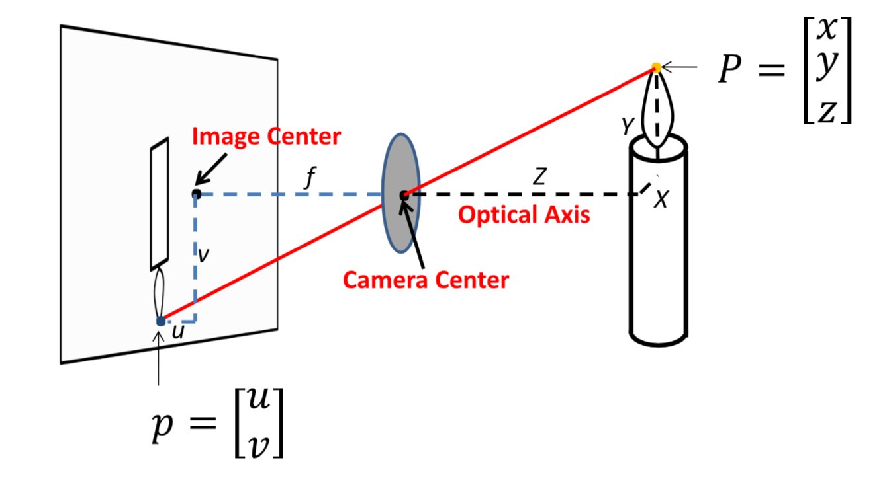
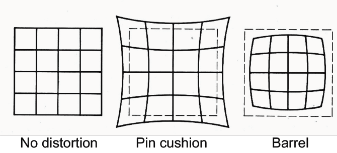

# Lecture 2 | Image Formation

## 相机与光学原理

### 小孔成像

如果我们直接拿一块平面来记录自然界的光信息，不难发现，由于光线是向四面八方传播的，所以接收到的信息也乱七八糟，所以我们需要通过一个小孔，也就是如今的**光圈(aperture)**来对光线进行一个过滤。这就是早期**针孔摄像机(pinhole camera)**的原理。

{width=40%}   {width=40.75%}

这也就是我们很早就学过的，小孔成像原理。而光圈越小，成像也会越来越清楚，但也不能太小，否则会导致亮度不足<s>甚至衍射</s>。

### 透镜

凸透镜具有汇聚光线的作用，在满足特定光学几何关系的前提下具有和小孔成像类似的效果，但是能够汇聚更多的光线。

> Source: https://fpcv.cs.columbia.edu/

对于薄凸透镜，有高斯成像公式：

$$
\frac{1}{i} + \frac{1}{o} = \frac{1}{f}
$$

其中 $i$ 为**像距(img dis)**，$o$ 为**物距(obj dis)**，$f$ 为**焦距(focal len)**。

而对于平行光，或者说 $o\to +\infty$ 时，就会有 $i=f$。通过这种方法，我们可以通过测量平行光透过凸透镜汇聚的位置来测量焦距。

同时再引入一个**放大率(Magnification)**：$m=\frac{h_i}{h_o}=\frac{i}{o}$。

> Source: https://fpcv.cs.columbia.edu/

### 视野 FoV(field of view)

焦距和底片的线度共同决定了 FoV 的大小。

> Source: https://snapsnapsnap.photos/

可以发现，焦距的大小会影响视野的大小和放大率的大小。

50mm/46° 与人的视野相近，因此它被称为**标准镜头(standard lens)**.

此外，即使在画面中保证一个物体的大小不变，选用不同的焦距也会导致画面的变化——背景的大小，通过下面这张图的三个画面我们可以很清晰的感受到这一点。

此外，传感器的大小，或者说底片的大小，也会影响 FoV。而且一般来说，越大的底片能够提供更高的分辨率。

### F 数

**F 数(F-Number)**用来描述光圈的相对大小，其定义式为 $N=\frac{f}{D}$。

### 对焦

> Source: https://fpcv.cs.columbia.edu/

由相似三角形，没有对上焦而形成的**光斑(Blur Circle)**的计算公式为：

$$
\begin{align}
    &\because \frac{b}{D}=frac{|i'-i|}{i'} \\
    &\therefore b = \frac{D}{i'}|i'-i|\;,\;\;\;b \propto D \propto \frac{1}{N}
\end{align}
$$

而对焦，就是将失焦的内容重新汇聚到底片上。

---

### 景深 DoF

根据上一小节得到的结论，理论上我们好像只有清晰成像一个特定平面上的内容，但是实际上相机上会有一段距离上的内容都是清晰的，这段距离就是**景深 DoF(Depth of Field)**。而之所以有景深，是因为底片的感光元件是有极限的，当光斑小雨这个极限时，拍摄出来的就仍然是清晰的。

而景深的大小可以这么计算：

我们可以发现，景深的大小 大致与 光圈大小、物像 正相关，与 焦距 负相关。

---

!!! info "引言"
    由于我们考虑的是成像问题，所以更多的是在描述三维真实信息与二维平面信息之间的互相表达。

    而这种“描述”需要基于一个投影模型。或者说说一种映射关系，简单来说就好像“点光源投影”和“平行光源投影”。

    但是需要注意，无论是哪一种模型，由于我们将三维信息通过**不可逆的线性变换**压缩到了二维信息，所以一定是存在信息缺失的。通常来说，指的是深度缺失。

## 透视投影

如图是 3D 坐标通过透视投影到 2D 坐标到示意图。其中 $x,y,Z$ 用来描述空间坐标信息，方便起见，我们用他们表示相对于**相机中心(camera center)**的正交坐标，其中 $Z$ 和**光轴(optical axis)**方向相同，我们也可以称之为深度。

同时，光轴应当垂直于成像平面，而光轴与成像平面的交点为**图像中心(img center)**。

可以发现，$P$ 与 $p$ 的关系如下：

$$
p = 
\begin{bmatrix}
    u \\
    v
\end{bmatrix}
=
\begin{bmatrix}
    \frac{f}{Z}\cdot x \\
    \frac{f}{Z}\cdot y
\end{bmatrix}
$$

那有没有办法将 $p$ 和 $P$ 通过线性变化放在同一个等式里呢？

换句话来说，有没有办法使得如下等式成立？

$$
A
\begin{bmatrix}
    x \\
    y \\
    z
\end{bmatrix}
\overset{?}=
\begin{bmatrix}
    \frac{f}{Z}\cdot x \\
    \frac{f}{Z}\cdot y
\end{bmatrix}
$$

很可惜，由于式子中出现了 $\frac{1}{Z}$，即除法，它并不是个线性变换。所以即使我们扩展 $p$ 和 $P$ 的维度我们没法直接将它变成线性变换。

但是你也看到了，我用的词是“直接”，所以我们接下来可以：

### 应用齐次坐标

让我们回顾齐次坐标的 [扩展性质](./Lec01.md#齐次坐标的扩展性质)，将它应用于此式：

$$
\begin{bmatrix}
    \frac{f}{Z}\cdot x \\
    \frac{f}{Z}\cdot y \\
    1
\end{bmatrix}
\cong
\begin{bmatrix}
    f \cdot x \\
    f \cdot y \\
    Z
\end{bmatrix}
$$

于是我们发现，虽然我们没法找到 $A$ 使得：

$$
A
\begin{bmatrix}
    x \\
    y \\
    Z \\
    1
\end{bmatrix}
\overset{?}=
\begin{bmatrix}
    \frac{f}{Z}\cdot x \\
    \frac{f}{Z}\cdot y \\
    1
\end{bmatrix}
$$

成立，但是我们可以找到 $A=\begin{bmatrix}f & 0 & 0 & 0 \\ 0 & f & 0 & 0 \\ 0 & 0 & 1 & 0\end{bmatrix}$ 使得：

$$
\begin{bmatrix}
    f & 0 & 0 & 0 \\ 
    0 & f & 0 & 0 \\ 
    0 & 0 & 1 & 0
\end{bmatrix}
\begin{bmatrix}
    x \\
    y \\
    Z \\
    1
\end{bmatrix}
=
\begin{bmatrix}
    f \cdot x \\
    f \cdot y \\
    Z
\end{bmatrix}
\cong
\begin{bmatrix}
    \frac{f}{Z}\cdot x \\
    \frac{f}{Z}\cdot y \\
    1
\end{bmatrix}
$$

于是，我们就成功的通过线性变换将 $P$ 和 $p$ 统一了起来。

---

### 可视化表示

{ align=right width=50% }

我们可以发现，小孔成像的模型视图其实还是比较麻烦的。现在我们把这个定角相似对折，变成 A 字型相似来表示这个模型，以简化不必要的信息，同时也能更清晰地表示透视关系。

规定我们讨论的问题中物距总是大于像距，则可以将像表示为相机中心到物体的放射连线中的**截面**。

它比较好地表达了透视关系，即 <u>相机中心</u> <u>物点B</u> <u>像点B'</u> 始终共线。这也是在之后的内容中更加常见的可视化表现方法。

### 信息缺失

由于在透视投影系统中，物体的真实线度大小与图像线度大小的比例由深度决定，但深度又不能直接从图中获取，所以有时候我们无法比较图像中两个物体的真实线度差。换句话来说，长度信息和角度信息是丢失的。

（多数情况下，我们需要以一些东西来做参考系，判断 A 和 B 的深度信息，再分析他们的实际线度大小关系。）

然而仍然有些性质是保留的，例如直线仍然是直线，但是实际上，如果你能想象的话，虽然直线仍然是直线，但是它的“线密度”不一样了。

所以，如果是曲线，它虽然不会变成折线，但是特征可能已经变了，比如圆是会扭曲的。

### 灭点与灭线

在透视中一个很有意思的现象是**灭点(vanishing point)**和**灭线(vanishing line)**。

{ width=60%  align=left }

可以发现，在图像中一条不断衍生的直线，在像中最终会终结于一个点，这个点就是“灭点”。几何上，灭点与相机中心的连线应当平行于该直线。

而现实中相互平行的两条直线，最终会在图像中终止于同一个灭点。

灭点未必在图像中，甚至可能无限远。

&nbsp;

{ width=60%  align=right }

刚才提到，平行线共享灭点这意味着有多少组平行线就有多少灭点。

如果我们将一个平面像棋盘那样，划出两组平行线，那么就会得到两个灭点，如图中的 $v_1$ 和 $v_2$。这意味着，对于一个平面，我们可以从中取出无数组平行线，因而无限大的平面会产生无数多的灭点，而这些灭点连成线就成了“灭线”。常见的灭线就比如照片上的海天界线。

因此，如果说灭点象征了一组平行线，那灭线就是象征了一块平面。而我们就可以通过看平面上的内容出现在灭线以上还是灭线一下，来判断平面在我们的相机中心以下还是以上（可以思考一下为什么）。

!!! key-point "Interesting Try"
    === "题面"
        观察如下图片，判断 🪂(跳伞者) 在 📷 以上还是以下，并阐明理由。

        
    === "答案"
        显然，🪂(跳伞者) 在 📷 以下（伞在以上），依据是 人 在 天际线 以下。
### 透视畸变

在拍摄较大的物体时，比如建筑物，如果建筑物的墙面没有和底片平行，则会出现透视畸变。

在建筑拍摄方面，我们的解决办法是下移传感器，使底片中心在光轴交点以下，这种镜头称为移轴镜头。

另外一种透视畸变体现在曲线的形变上，也就是我们常感受到的，站在边上的人脸总是更大一点。而这种畸变在断镜头下更常见，所以人像更多用的是长焦镜头（其一原因，其他的还有 FoV 小所以背景更干净等）。

### 枕型畸变和桶型畸变

$$
\begin{align}
r^2 & = {x'}_n^2 + {y'}_n^2 \\
{x'}_d & = {x'}_n(1 + \kappa_1 r^2 + \kappa_2 r^4) \\
{y'}_d & = {y'}_n(1 + \kappa_1 r^2 + \kappa_2 r^4) \\
\end{align}
$$

而这种照片的纠正办法就是寻找照片中的格点，然后通过数学方法来还原。

## 正交投影

正交投影的含义就是，直接抹掉深度信息，三维点 $P$ 到二维点 $p$ 的映射规则如下：

$$
\begin{bmatrix}
    1 & 0 & 0 \\
    0 & 1 & 0 
\end{bmatrix}
\begin{bmatrix}
    x \\
    y \\
    z
\end{bmatrix}
=
\begin{bmatrix}
    x \\
    y 
\end{bmatrix}
$$

也就是平行光源投影。

这种投影可能不太拟真，但是在某些不要求精度的情况下我们总是乐于使用的。

这样说可能比较抽象，但是它其实很常见，比如在一些以“上帝视角”展开的游戏中，例如“开罗游戏”、“模拟都市”这种，采用的基本都是这种投影。

---

## 快门(Shutter)

- 曝光时间(shutter speed)
  - 长曝光时间拍摄闪电等；
- 滚动快门效应(rolling shutter effect)
  - 用滚动快门拍摄例如风扇时，会出现一些图像变形；

## 光度图像生成与着色

光度图像生成考虑的主要是光强和颜色两个方面的问题。

硬件上，它们都通过**图像传感器(img sensor)**实现。

- 主要分为 CMOS(Complimentary Metal-Oxide Semiconductor) 和 CCD(Charge Coupled Device) 两种，区别在于 Electron to Voltage Conversion 是否公用；

---

!!! summary "引入"
    **着色(shading)**中所说的光强，主要有两个方面：一方面与距离光源的距离有关，理想情况下符合平方反比定律，这种特征我们称之为 Light Falloff；另一方面实际上是需要我们计算光的反射行为。

    理论上，我们会需要**双向反射分布函数 BRDF(Bidirectional Reflectance Distribution Function)**来计算，BRDF 的输入大致可以分为如下几个：

    - 观测角度(viewer direction)：$\vec v$
    - 表面法向量(surface normal)：$\vec n$
    - 入射光方向(light direction)： $\vec l$
      - 显然，对于每一条光线都需要给出；
    - 表面材质(surface parameters)

    可以发现，需要建立这样一个模型是很困难的，且这个模型不常用，而且计算起来比较麻烦。

    反射主要可以归纳为两种简单模型和一种混合模型。

---

### 漫反射

漫反射(diffuse reflection) 又叫 朗伯反射(Lambertian reflection)，是表现在粗糙表面上的反射特征，因为我们默认它向四面八方反射的光强都一样，所以它的计算相对比较简单（Shading independent of view direction）：

$$
L_d = k_d \cdot \frac{I}{r^2} \cdot \max(0,n\cdot l)
$$

对成分做解释：

- $L_d$ 为**漫反射光强(diffusely reflected light)**；
- $k_d$ 为**漫发射系数(diffuse coefficient)**，如颜色；
- $\frac{I}{r^2}$ 为 到达着色点的光强；
- $\max(0,n \cdot l)$ 为 着色点吸收的光强；

??? question "如何理解光强度与角度的关系"
    一开始没仔细想的时候还觉得很自然，但是仔细一想为什么能这样表述？于是和同学探讨了一下，感觉一个可以接受的解释是这样的：
    
    首先，这里与其说与角度相关，不如说与单位面积受到的光照强度有关。换句话来说，对于同一束光，倾斜的面上会有更大的面积被照射到，均摊下来单位面积上的光强度就小，或许可以将它理解成类似于“密度”的概念。

    带着这样的想法，再来看这张图，就比较清晰了。

    
    > Source: https://sites.cs.ucsb.edu/~lingqi/teaching/games101.html

---

### 高光反射

高光反射(specular reflection) 类似我们认知中的镜面反射，它的特征是基本符合镜反射的规律。

在高光反射中，我们需要定义**半程向量(half vec)**$\vec h = bisector(\vec v,\vec l) = \frac{\vec v + \vec l}{||\vec v + \vec l||}$ 

当 $\vec h$ 与 $\vec n$ 非常接近时，即 $\alpha = <\vec n, \vec h>$ 很小时，我们称之符合高光反射。

高光反射的强度公式大致如下：

$$
L_s = k_s \cdot \frac{I}{r^2} \cdot \max(0, \cos\alpha)^p=k_s \cdot \frac{I}{r^2} \cdot \max(0, \vec n \cdot \vec h)^p
$$

对成分做解释：

- $L_s$ 为**高光反射光强(specularly reflected light)**；
- $k_s$ 为**高光发射系数(specular coefficient)**；

分析可得，$p$ 越大，高光越集中。

---

### Blinn-Phong 反射

**Blinn-Phong 反射模型(Blinn-Phong Reflection Model)**可以说集合了前两者，此外还引入了**环境光(ambient part)**。

$$
L_a=k_aI_a
$$

Blinn-Phong 反射模型的大致成分如下：

$$
\begin{align}
L & = L_a + L_d + L_s \\
& = k_aI_a + k_d \cdot \frac{I}{r^2} \cdot \max(0,n\cdot l) + k_s \cdot \frac{I}{r^2} \cdot \max(0, \vec n \cdot \vec h)^p
\end{align}
$$

---

### 颜色

为了描述颜色，我们需要定义**色彩空间(color spaces)**，常见的有 [RGB](https://zh.wikipedia.org/wiki/%E4%B8%89%E5%8E%9F%E8%89%B2%E5%85%89%E6%A8%A1%E5%BC%8F) 和 [HSV](https://zh.wikipedia.org/wiki/HSL%E5%92%8CHSV%E8%89%B2%E5%BD%A9%E7%A9%BA%E9%97%B4) 等，对相机来说我们更常用的是 RGB。

??? note "in py"
    在算法中，我们用矩阵来存储图像信息，其中左上角的元素坐标为 `(0, 0, :)`，其中第三维用来指定颜色通道(channel)，所以第 i 行 j 列的像素点表示为 `(i-1, j-1, :)`；
    
在硬件上，颜色传感主要通过**拜尔滤镜(Bayer filter)**实现。也就是通过在传感器前安装一个单色滤镜，来接收单一色光。常见的做法是以田字格的四个传感器为单位，分配 `R*1` `G*2` `B*1` 的滤镜。

> Source: https://en.wikipedia.org/wiki/Bayer_filter

> 可以发现，绿色的滤镜更多，因为太阳光中绿色波段更多，于是人眼对绿色更敏感。

显然，这样得到的图片需要进行插值才能得到最终图片。
