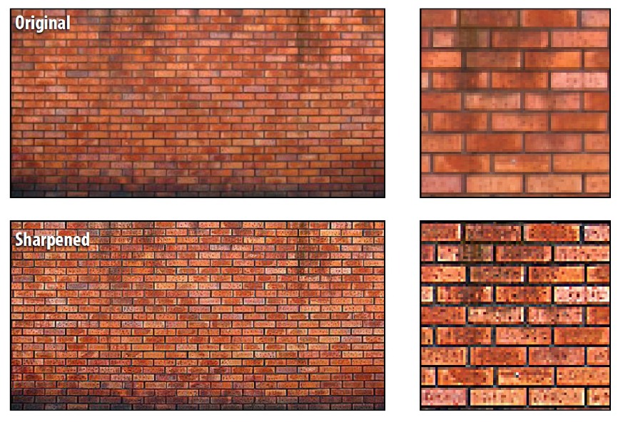
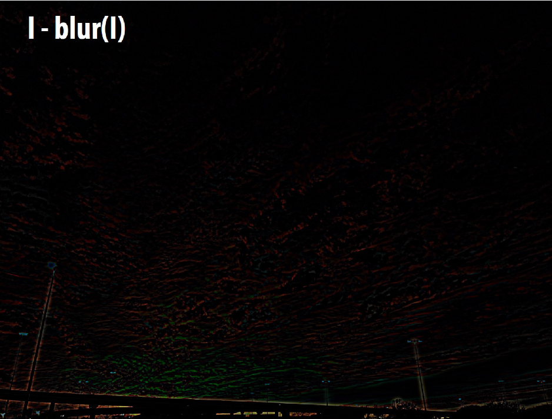

# Lecture 3 | Image Processing

??? summary "today"
    - Image processing basics
    - Image sampling
    - Image magnification

## 基本操作

对图像的基本操作即在图像编辑软件中常见的那么几种，稍后我们将会简单介绍这几种操作是如何实现的。

不过在此之前，我们需要先介绍一个工具——**卷积(convolution)**，之后一些操作都依赖于此。

---

### 卷积

数学上对 **卷积(convolution)** 给出的定义是：

$$
(f*g)(x)=\int_{-\infty}^{\infty} f(y)g(x-y)\mathrm{d}y
$$

第一次接触这个式子的时候我个人感觉是一头雾水的。但是，接下来让我们从一个更直观的角度来理解一下这个式子：

!!! note ""
    **一言以蔽之：$(f*g)(x)$ 是 $g(x)$ 在滤波规则 $f(y)$ 下的加权均值函数。**

    - 我们一般称 $f(y)$ 为 **滤波器(filter)**，这是因为我们本质上是在求 $g(x)$ 在这个滤波规则下加权求均值生成的新函数。
    - 所以，$f(y)$ 一般是根据需求而决定的一些特殊函数，比如高斯函数、特定区间内的常函数等。

首先，我们先来从一维离散的角度来理解卷积，即：

$$
(f*a)_i = \sum_{j=-m}^{m} f_j * a_{i+j} 
$$

> 当然，上面可能出现 $f_{-1}$ 这种鬼畜的东西，但是实际上这里的 $f$ 数列确实是定义在整个整数轴上的（当然下标啥的是无所谓的，终点关注下面的模拟过程）

比如，我们有原始数列 $a_n$ 和滤波器数列 $f_m$ 如下：

|$a_n$| 2 | 4 | 2 | 6 | 2 |
|:--|:-:|:-:|:-:|:-:|:-:|
|$f_m$| 1 | 2 | 1 | | |
|$f_m$ 的“中心”| | ⬆️ | | | |

接下来，我们来手动模拟一下卷积过程：

??? summary "卷积过程"

    |$a_n$| 2 | 4 | 2 | 6 | 2 |
    |:--|:-:|:-:|:-:|:-:|:-:|
    |正在被 卷的数| ⬆️ |⬆️ ⬆️ | ⬆️ | |
    |$f_m$| 1 | 2 | 1 | 0 | 0 |
    |$f_m$ 的 “中心”| | ⬆️ | | | |
    |卷积 的过程| | $1\times2+2\times4+1\times2$ | | | |
    |卷出来 的结果| - | $12$ | | | |

    |$a_n$| 2 | 4 | 2 | 6 | 2 |
    |:--|:-:|:-:|:-:|:-:|:-:|
    |正在被 卷的数| | ⬆️ |⬆️ ⬆️ | ⬆️ | |
    |$f_m$| 0 | 1 | 2 | 1 | 0 |
    |$f_m$ 的 “中心”| | | ⬆️ | | |
    |卷积 的过程| | | $1\times4+2\times2+1\times6$ | | |
    |卷出来 的结果| - | $12$ | $14$ | | |

    |$a_n$| 2 | 4 | 2 | 6 | 2 |
    |:--|:-:|:-:|:-:|:-:|:-:|
    |正在被 卷的数| | | ⬆️ |⬆️ ⬆️ | ⬆️ |
    |$f_m$| 0 | 0 | 1 | 2 | 1 |
    |$f_m$ 的 “中心”| | | | ⬆️ | |
    |卷积 的过程| | | | $1\times2+2\times6+1\times2$ | |
    |卷出来 的结果| - | $12$ | $14$ | $16$ | - |

可以发现，如果 $f_m$ 每一项都除以 4，那实际上这个过程就是在求每一项与相邻两项的加权平均（中心权重更大）。

现在，从离散会到连续的情况，我们介绍最经典的一个卷积应用——"**box function**"，其作为滤波器时定义如下：

{width=120px align=left}

$$
f(x) = 
\left\{
    \begin{array}{**l**}
        1 &|x| \leq 0.5\\
        0 &otherwise
    \end{array}
\right.
$$

而将它带入卷积的表达式，得到的结果就是：

$$
(f*g)(x)=\int_{-0.5}^{0.5}g(x-y)\mathrm{d}y
$$

那实际上，这就是在求函数在宽度为 1 的范围内的均值。

现在，我们将它进行一点扩展，来到二维，则可以将离散的卷积过程用这样一个 gif 来表示：

- Wiki 中有更酷的动图：[🔗](https://zh.wikipedia.org/zh-hans/%E5%8D%B7%E7%A7%AF)

!!! question "思考"
    可以发现，在二维卷积的过程中，我们卷出来的东西要比原始图像小。而其中一种解决的方法是 padding。在此不做过多介绍。

!!! info "典型滤波器"
    其他典型的滤波器可能将在之后介绍，这里简单提几个：

    - 高斯滤波器(中心权重大)
    - 锐化滤波器
    - 边缘检测滤波器
    - 可分离滤波器
    - 双边滤波器
    - ……

---

### 增加对比度

**增加对比度(increase contrast)** 即让画面中的颜色向两个极端偏移，通俗来说就是黑的更黑，白的更白。

体感上让一张雾蒙蒙的照片变得更加黑白分明。

上面也说了，是将色彩向两个极端偏移，实际上就是讲原来的颜色进行一个映射，令 $color'(x,y) = f[color(x,y)]$。

那么一般来说，我们采用 **S 曲线(S curve)** 来进行这个映射，也就是将原本均匀分布的点按照 S 曲线进行拉伸和压缩，这样，白的会更白，黑的就会更黑。

> 图中横坐标表示原来的颜色，纵坐标表示映射后的颜色，可以发现黑色部分的颜色都向黑色偏移，白色部分亦然。
>
> 而具体使用的曲线，则需要根据需求进行调整。

---

### 反色

顾名思义，**图像取反色(image invert)** 就是将颜色取反，黑变白，白变黑。

---

### 边缘提取

边缘提取 Edge detection

---

!!! info "引入"
    模糊(blur) 和 锐化(sharpen) 是两个对应的概念，实现的手段也非常类似。

!!! tip "使用对比"
    - 从应用来讲，模糊可以用来做一些降噪的工作，也可以给图片营造出一种光滑的质感；
    - 而锐化可以一定程度上增加图片的清晰度。

---

### 模糊

所谓的 **模糊(blur)**，像是将某个位置的像素和周围混合起来，更数学的表述来说，需要与周围进行加权求平均，没错，我们需要使用卷积来实现。

> Source: Stanford CS248, Winter 202

例如，假设我们用这样一个二维滤波器对一张图像进行卷积：

$$
\begin{bmatrix}
    \frac{1}{9} & \frac{1}{9} & \frac{1}{9} \\
    \frac{1}{9} & \frac{1}{9} & \frac{1}{9} \\
    \frac{1}{9} & \frac{1}{9} & \frac{1}{9}
\end{bmatrix}
$$

那么新得到的图片中的像素将会等于原图片这个像素周围的 8 个像素和它求平均得到的颜色。

再比如，滤波器使用高斯函数的高斯模糊：

$$
f(i,j)=\frac{1}{2\pi \sigma^2}e^{-\frac{i^2+j^2}{2\sigma^2}}
\;\;\;\;\;\;\;\;\;\;\;\;
\begin{bmatrix}
    0.075 & 0.124 & 0.075 \\
    0.124 & 0.204 & 0.124 \\
    0.075 & 0.124 & 0.075
\end{bmatrix}
$$

高斯模糊会更加注重中心的权重，所以模糊起来相对来说更能保持图片原来的特征一点。

!!! tip "更优秀的一种模糊"
    一种更有用的模糊是，提取边缘后的模糊，即模糊过程中不影响边缘，比如人脸边缘模糊，只影响脸而不影响其他部分。

    具体实现我们将在 [再看滤波器](#再看滤波器) 中的 双边滤波器。

---

### 锐化

我们注意到，模糊中的滤波器基本上每一个元素都是非负数，意思是卷积结果中会保留一部分这些像素的特征。

那如果我们把其中一部分改成负数呢？那就说明卷积结果中会减去这部分的特征。也就是说，如果权值为负数的像素和权值为正数的像素很像，那么这个特征就会被削弱；反过来说，如果权值为负数的像素和权值为正数的像素几乎相反，那么权值为正数的像素的特征就会被加强。

我们考虑这样一个特殊例子：

$$
\begin{bmatrix}
    0 & -1 & 0 \\
    -1 & 5 & -1 \\
    0 & -1 & 0
\end{bmatrix}
$$

如果边缘的点和矩阵中心的点不一样，则矩阵中心的点的特征会被强调，即会放大相邻点的区别，这就是 **锐化(sharpen)** 的原理。

> Source: Stanford CS248, Winter 202

!!! tip "模糊与锐化的联系"

    - 如果定义原本的图像为 $I$，模糊后的图像为 $I_b$
    - 定义图像中的 **高频(high frequencies)** 为 I_h = I - I_b；
    - 则锐化的图像 $I_s = I + I_h$；
    - 即有 $2I = I_s + I_h$，可以发现，又一个类似于互补的关系；
    - 而这里的高频可以理解为图像中变化比较明显的地方；

    {width=400px}{width=400px}{width=400px}{width=400px}

---

### 再看滤波器

上面我们已经提到了用于模糊的滤波器（比如高斯滤波器），用于锐化的滤波器，接下来让我们看看其他的滤波器的相关内容：

???+ note "水平/垂直梯度提取"
    {width=400px align=right}

    - Extracts horizontal gradients

    $$
    \begin{bmatrix}
        -1 & 0 & 1 \\
        -2 & 0 & 2 \\
        -1 & 0 & 1
    \end{bmatrix}
    $$

    - Extracts vertical gradients

    $$
    \begin{bmatrix}
        -1 & -2 & -1 \\
        0 & 0 & 0 \\
        1 & 2 & 1
    \end{bmatrix}
    $$

???+ note "可分离滤波器"
    - Separable filter，可以用这种方式来降低计算量；
    $$
    \frac{1}{9}
    \begin{bmatrix}
        1 & 1 & 1 \\
        1 & 1 & 1 \\
        1 & 1 & 1
    \end{bmatrix}
    =
    \frac{1}{3}
    \begin{bmatrix}
        1 \\
        1 \\
        1 
    \end{bmatrix}
    \cdot
    \frac{1}{3}
    \begin{bmatrix}
        1 & 1 & 1
    \end{bmatrix}
    $$
    - 只要表达式可以写成两个函数相乘，那基本是 separable 的;
        - 比如高斯矩阵就可以拆成这样：
        - $f(i,j)=\frac{1}{2\pi \sigma^2}e^{-\frac{i^2+j^2}{2\sigma^2}}=\frac{1}{2\pi \sigma^2}e^{-\frac{i^2}{2\sigma^2}}\cdot e^{-\frac{j^2}{2\sigma^2}}$

???+ note "双边滤波器"
    - 双边滤波器 Bilateral filter
        - 在滤波时，每一个点的权重与 目标点 与 中心点的相似程度有关;

    - [ ] TODO: 更详细地讲这里
    
    

## 图像采样 sampling

- 打印的分辨率

- 向下采样（缩小）
  - 隔一个像素采样 ----> 摩尔纹
  - 信号走样/失真 Aliasing
    - 产生原因 ----> 信号变化太快，采样太慢
    - 描述信号变化快慢：频率
    - 如果没有周期特性，我们就需要使用 **傅立叶变换** 来描述任意信号变化
      - 不同频率有不同的权重，可以得到一个频谱
      - 傅立叶变换的式子可以用卷积来尝试理解

Convolution Theorem

传统图像压缩是将他们的二维频谱中的高频丢掉

数学上采样，就是使用脉冲函数(Dirac comb function)去乘被采样的函数

奈奎斯采样定理 Nyquies-Shannon theorem

如何减少走样？

1. 至少 奈奎斯频率： $2f_0$
2. 先滤波，把高频滤掉再采样

Image magnification

插值 Interpolation

- 最简单的：最近插值：Nearest-neighbor interpolation
    - 然而不连续
- 线性插值： Linear interpolation
    - 连续然而不光滑
- 多项式拟合：Cubic interpolation

超分辨率 Super-Resolution

改变图像长宽比 aspect ratio

