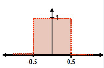
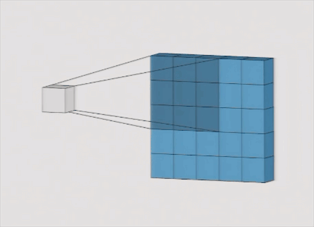
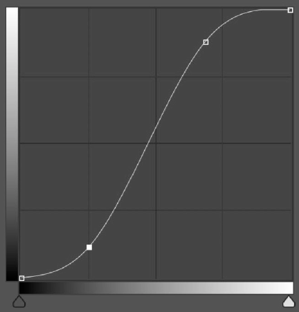
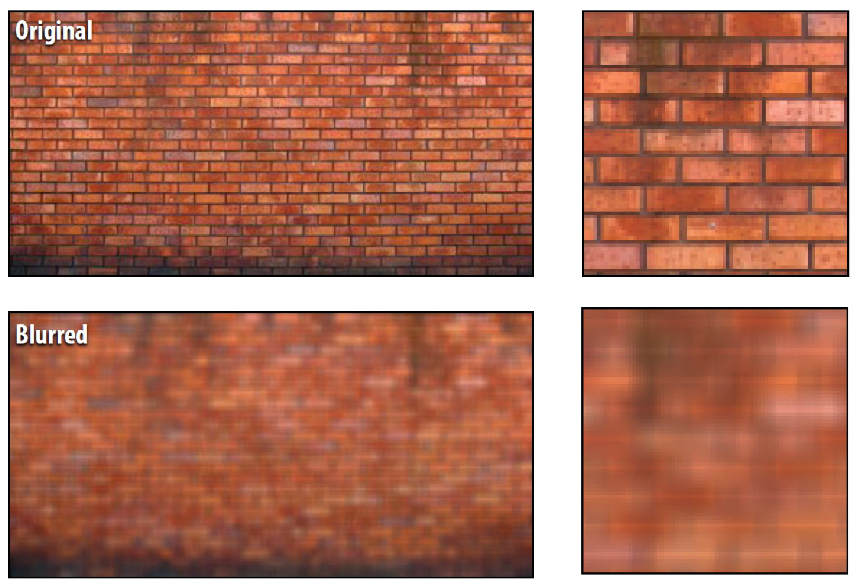
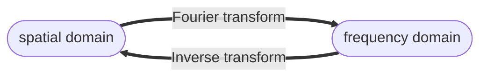
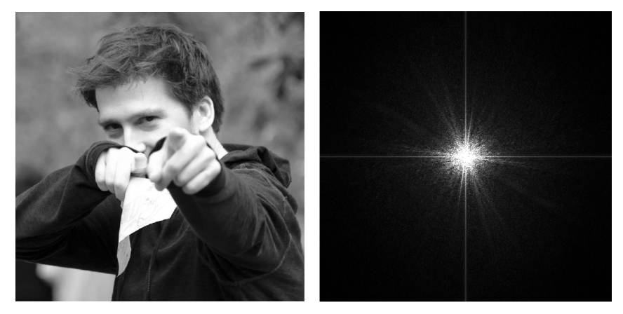
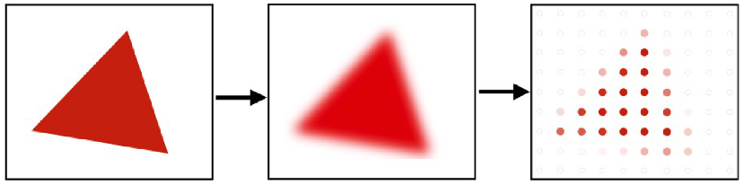
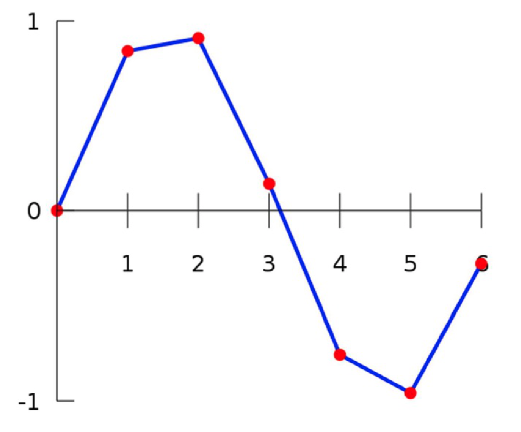
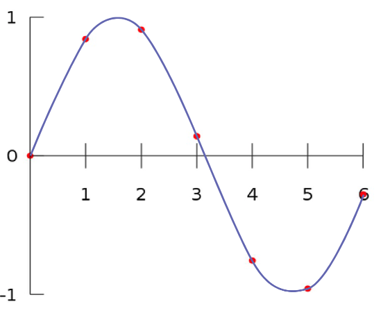
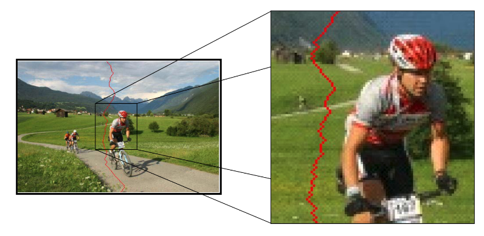

# Lecture 3 | Image Processing

## 基本操作

对图像的基本操作即在图像编辑软件中常见的那么几种，稍后我们将会简单介绍这几种操作是如何实现的。

不过在此之前，我们需要先介绍一个工具——**卷积(convolution)**，之后一些操作都依赖于此。

---

### 卷积

数学上对**卷积(convolution)**给出的定义是：

$$
(f*g)(x)=\int_{-\infty}^{\infty} f(y)g(x-y)\mathrm{d}y
$$

第一次接触这个式子的时候我个人感觉是一头雾水的。但是，接下来让我们从一个更直观的角度来理解一下这个式子：

!!! note ""
    **一言以蔽之：$(f*g)(x)$ 是 $g(x)$ 在滤波规则 $f(y)$ 下的加权均值函数。**

    - 我们一般称 $f(y)$ 为**滤波器(filter)**，这是因为我们本质上是在求 $g(x)$ 在这个滤波规则下加权求均值生成的新函数。
    - 所以，$f(y)$ 一般是根据需求而决定的一些特殊函数，比如高斯函数、特定区间内的常函数等。

首先，我们先来从一维离散的角度来理解卷积，即：

$$
(f*a)_i = \sum_{j=-m}^{m} f_j * a_{i+j} 
$$

> 当然，上面可能出现 $f_{-1}$ 这种鬼畜的东西，但是实际上这里的 $f$ 数列确实是定义在整个整数轴上的（当然下标啥的是无所谓的，终点关注下面的模拟过程）

比如，我们有原始数列 $a_n$ 和滤波器数列 $f_m$ 如下：

|$a_n$| 2 | 4 | 2 | 6 | 2 |
|:--|:-:|:-:|:-:|:-:|:-:|
|$f_m$| 1 | 2 | 1 | | |
|$f_m$ 的“中心”| | ⬆️ | | | |

接下来，我们来手动模拟一下卷积过程：

??? section "卷积过程"

    |$a_n$| 2 | 4 | 2 | 6 | 2 |
    |:--|:-:|:-:|:-:|:-:|:-:|
    |正在被 卷的数| ⬆️ |⬆️ ⬆️ | ⬆️ | |
    |$f_m$| 1 | 2 | 1 | 0 | 0 |
    |$f_m$ 的 “中心”| | ⬆️ | | | |
    |卷积 的过程| | $1\times2+2\times4+1\times2$ | | | |
    |卷出来 的结果| - | $12$ | | | |

    |$a_n$| 2 | 4 | 2 | 6 | 2 |
    |:--|:-:|:-:|:-:|:-:|:-:|
    |正在被 卷的数| | ⬆️ |⬆️ ⬆️ | ⬆️ | |
    |$f_m$| 0 | 1 | 2 | 1 | 0 |
    |$f_m$ 的 “中心”| | | ⬆️ | | |
    |卷积 的过程| | | $1\times4+2\times2+1\times6$ | | |
    |卷出来 的结果| - | $12$ | $14$ | | |

    |$a_n$| 2 | 4 | 2 | 6 | 2 |
    |:--|:-:|:-:|:-:|:-:|:-:|
    |正在被 卷的数| | | ⬆️ |⬆️ ⬆️ | ⬆️ |
    |$f_m$| 0 | 0 | 1 | 2 | 1 |
    |$f_m$ 的 “中心”| | | | ⬆️ | |
    |卷积 的过程| | | | $1\times2+2\times6+1\times2$ | |
    |卷出来 的结果| - | $12$ | $14$ | $16$ | - |

可以发现，如果 $f_m$ 每一项都除以 4，那实际上这个过程就是在求每一项与相邻两项的加权平均（中心权重更大）。

现在，从离散会到连续的情况，我们介绍最经典的一个卷积应用——"**box function**"，其作为滤波器时定义如下：

{width=30% align=right}

$$
f(x) = 
\left\{
    \begin{array}{}
        1 &|x| \leq 0.5\\
        0 &otherwise
    \end{array}
\right.
$$

而将它带入卷积的表达式，得到的结果就是：

$$
(f*g)(x)=\int_{-0.5}^{0.5}g(x-y)\mathrm{d}y
$$

那实际上，这就是在求函数在宽度为 1 的范围内的均值。

现在，我们将它进行一点扩展，来到二维，则可以将离散的卷积过程用这样一个 gif 来表示：

  

- Wiki 中有更酷的动图：[🔗](https://zh.wikipedia.org/zh-hans/%E5%8D%B7%E7%A7%AF)

!!! question "思考"
    可以发现，在二维卷积的过程中，我们卷出来的东西要比原始图像小。而其中一种解决的方法是 padding。在此不做过多介绍。

!!! info "典型滤波器"
    其他典型的滤波器可能将在之后介绍，这里简单提几个：

    - 高斯滤波器(中心权重大)
    - 锐化滤波器
    - 边缘检测滤波器
    - 可分离滤波器
    - 双边滤波器
    - ……

---

### 增加对比度

**增加对比度(increase contrast)**即让画面中的颜色向两个极端偏移，通俗来说就是黑的更黑，白的更白。

体感上让一张雾蒙蒙的照片变得更加黑白分明。

上面也说了，是将色彩向两个极端偏移，实际上就是讲原来的颜色进行一个映射，令 $color'(x,y) = f[color(x,y)]$。

那么一般来说，我们采用**S 曲线(S curve)**来进行这个映射，也就是将原本均匀分布的点按照 S 曲线进行拉伸和压缩，这样，白的会更白，黑的就会更黑。

  

> 图中横坐标表示原来的颜色，纵坐标表示映射后的颜色，可以发现黑色部分的颜色都向黑色偏移，白色部分亦然。
>
> 而具体使用的曲线，则需要根据需求进行调整。

---

### 反色

顾名思义，**图像取反色(image invert)**就是将颜色取反，黑变白，白变黑。

---

### 边缘提取

边缘提取 Edge detection

---

!!! info "引入"
    模糊(blur) 和 锐化(sharpen) 是两个对应的概念，实现的手段也非常类似。

!!! tip "使用对比"
    - 从应用来讲，模糊可以用来做一些降噪的工作，也可以给图片营造出一种光滑的质感；
    - 而锐化可以一定程度上增加图片的清晰度。

---

### 模糊

所谓的**模糊(blur)**，像是将某个位置的像素和周围混合起来，更数学的表述来说，需要与周围进行加权求平均，没错，我们需要使用卷积来实现。

> Source: Stanford CS248, Winter 202

例如，假设我们用这样一个二维滤波器对一张图像进行卷积：

$$
\begin{bmatrix}
    \frac{1}{9} & \frac{1}{9} & \frac{1}{9} \\
    \frac{1}{9} & \frac{1}{9} & \frac{1}{9} \\
    \frac{1}{9} & \frac{1}{9} & \frac{1}{9}
\end{bmatrix}
$$

那么新得到的图片中的像素将会等于原图片这个像素周围的 8 个像素和它求平均得到的颜色。

再比如，滤波器使用高斯函数的高斯模糊：

$$
f(i,j)=\frac{1}{2\pi \sigma^2}e^{-\frac{i^2+j^2}{2\sigma^2}}
\;\;\;\;\;\;\;\;\;\;\;\;
\begin{bmatrix}
    0.075 & 0.124 & 0.075 \\
    0.124 & 0.204 & 0.124 \\
    0.075 & 0.124 & 0.075
\end{bmatrix}
$$

高斯模糊会更加注重中心的权重，所以模糊起来相对来说更能保持图片原来的特征一点。

!!! tip "更优秀的一种模糊"
    一种更有用的模糊是，提取边缘后的模糊，即模糊过程中不影响边缘，比如人脸边缘模糊，只影响脸而不影响其他部分。

    具体实现我们将在 [再看滤波器](#再看滤波器) 中的 双边滤波器。

---

### 锐化

我们注意到，模糊中的滤波器基本上每一个元素都是非负数，意思是卷积结果中会保留一部分这些像素的特征。

那如果我们把其中一部分改成负数呢？那就说明卷积结果中会减去这部分的特征。也就是说，如果权值为负数的像素和权值为正数的像素很像，那么这个特征就会被削弱；反过来说，如果权值为负数的像素和权值为正数的像素几乎相反，那么权值为正数的像素的特征就会被加强。

我们考虑这样一个特殊例子：

$$
\begin{bmatrix}
    0 & -1 & 0 \\
    -1 & 5 & -1 \\
    0 & -1 & 0
\end{bmatrix}
$$

如果边缘的点和矩阵中心的点不一样，则矩阵中心的点的特征会被强调，即会放大相邻点的区别，这就是**锐化(sharpen)**的原理。

> Source: Stanford CS248, Winter 202

!!! tip "模糊与锐化的联系"

    - 如果定义原本的图像为 $I$，模糊后的图像为 $I_b$
    - 定义图像中的**高频(high frequencies)**为 I_h = I - I_b；
    - 则锐化的图像 $I_s = I + I_h$；
    - 即有 $2I = I_s + I_h$，可以发现，又一个类似于互补的关系；
    - 而这里的高频可以理解为图像中变化比较明显的地方；

    
 {width=40%}  {width=40%} 

    
    
 {width=40%}  {width=40%} 

---

### 再看滤波器

上面我们已经提到了用于模糊的滤波器（比如高斯滤波器），用于锐化的滤波器，接下来让我们看看其他的滤波器的相关内容：

???+ section "水平/垂直梯度提取"
    {width=55% align=right}

    - Extracts horizontal gradients

    $$
    \begin{bmatrix}
        -1 & 0 & 1 \\
        -2 & 0 & 2 \\
        -1 & 0 & 1
    \end{bmatrix}
    $$

    - Extracts vertical gradients

    $$
    \begin{bmatrix}
        -1 & -2 & -1 \\
        0 & 0 & 0 \\
        1 & 2 & 1
    \end{bmatrix}
    $$

???+ section "可分离滤波器"
    - Separable filter，可以用这种方式来降低计算量；
    $$
    \frac{1}{9}
    \begin{bmatrix}
        1 & 1 & 1 \\
        1 & 1 & 1 \\
        1 & 1 & 1
    \end{bmatrix}
    =
    \frac{1}{3}
    \begin{bmatrix}
        1 \\
        1 \\
        1 
    \end{bmatrix}
    \cdot
    \frac{1}{3}
    \begin{bmatrix}
        1 & 1 & 1
    \end{bmatrix}
    $$
    - 只要表达式可以写成两个函数相乘，那基本是 separable 的;
        - 比如高斯矩阵就可以拆成这样：
        - $f(i,j)=\frac{1}{2\pi \sigma^2}e^{-\frac{i^2+j^2}{2\sigma^2}}=\frac{1}{2\pi \sigma^2}e^{-\frac{i^2}{2\sigma^2}}\cdot e^{-\frac{j^2}{2\sigma^2}}$

???+ section "双边滤波器"
    - 双边滤波器 Bilateral filter
        - 在滤波时，每一个点的权重与 目标点 与 中心点的相似程度有关;

    - [ ] TODO: 更详细地讲这里
    
    

---

!!! info "引入"
    **图像采样(sampling)**分为**向上采样(up-sampling)**和**向下采样(down-sampling)**两种。

    更通俗的来说，就是在保持图像特征的情况下对图片进行缩放。显然，在缩放图像时，会出现像素数量的变化，那要如何添加像素、如何减少像素，就是图像采样考虑的事情。

    此外，将两者结合，还会有例如改变图片长宽比，进行拉伸这种问题。

## 缩小图片：向下采样

向下采样也就是让图片变小，这里主要需要考虑的问题是如何缩小图片，如何避免出现信号走样的问题。

### 信号走样

说到让图像变小，最简单的一个想法就是——比如，让图片的线度缩小一半，可以每四个格子就采一个格子的样本。

而这种粗暴的做法则有可能导致：

-**摩尔纹(Moiré Patterns)**。
-**马车轮错觉(Wagon Wheel Illusion)**
- ...

而这些由采样导致的问题，我们称之为**信号走样(aliasing)**。

从本质上来说，信号走样的发生，是因为**采样频率跟不上图像频率**导致的。

> Signals are changing too fast but sampled too slow.

!!! question "如何理解这里的“频率”"
    在之后的部分中，我们会给出这里的“频率”的来源。
    
    但是一个更直观，更模糊的看法是：如果一个图像的某个部分变化越剧烈，一般来说其频率就会较大。比如图像中有一个非常分明的边界，那么它的频率一般不会低。

而这里的“采样频率”衡量了信号变化的频率。

比如，如果对一个正弦波进行采样，即从一个连续的正弦模拟信号中选取若干点，可以发现，不同采样频率和不同的图像频率的选取方案会产生不同的结果：

可以发现，对于上面的几个函数，采样频率和原函数的频率匹配较好，所以采样得到的点基本能反映出原来图形的特征；但是对于比较下面的几个曲线，采样就不是很理想了。

比较直观的一个想法是，过慢点采样频率会导致信息丢失，甚至是表现出其它频率的信号的特征，这些不正常的行为就导致了信号走样。

!!! question "这个“频率”和图像有什么关系？"
    首先我们知道，要向有“频率”这个属性，表达式或者说函数需要是周期性的。然而“周期性”对于任意函数来说可能是一个较为苛刻的条件。

    此时就轮到傅立叶变换登场了。

---

### Fourier 变换

最简单直白地理解**傅立叶变换(Fourier Transform)**，实际上就是将任意可以进行傅立叶变换的函数，变化为一个正弦、余弦函数级数的形式。

例如最经典的，使用不同频率的正弦波来拟合一个方波。

!!! note ""
    ~~这里引流一个 xg 的视频：https://www.bilibili.com/video/BV1Y7411W73U/~~

此时你可能会问，正余弦函数的级数也不保证有周期啊，但是请注意，我们的目的并不是找到一个周期，而是能够使用频率来**表达**这个函数的某些特征。
    
我们知道，正余弦函数是具有周期性的，那么我们就可以用这个级数中的正余弦函数的频率来表达这个函数。

> 下面这张图片就是编码后的**频谱**。

而在欧拉公式 $e^{i\theta} = \cos\theta + i\sin\theta$ 的统一下，Fourier 变换可以表示为：

$$
F(u) = \int^{\infty}_{-\infty} f(x) e^{-i2\pi ux} \rm{d} x \\
f(x) = \int^{\infty}_{-\infty} F(u) e^{i2\pi ux} \rm{d} u \\
\text{ where 'x' refers to space, 'u' refers to frequency}
$$

通过这种形式，我们实现了 spatial domain 和 frequency domain 之间的统一。

!!! tip "尝试使用卷积的角度来看傅立叶变换"
    观察式子 $F(u) = \int^{\infty}_{-\infty} f(x) e^{-i2\pi ux} \rm{d} x$，是不是能将它看作一个[卷积](#卷积)式呢？

    - [ ] TODO: 具体解释暂时咕咕咕。

!!! key-point "一个有意思的性质"
    而使用 Fourier 的另外一个好处是，它为我们带来了这样一个数学性质：

    |Spatial Domain| |Frequency Domain|
    |:--:|:--:|:--:|
    |$g(x) = f(x) * h(x)$   Convolution| $\leftrightarrow$ | $G(u) = F(u)H(u)$   Multiplication|
    |g(x)=f(x)h(x)   Multiplication| $\leftrightarrow$ | $G(u) = F(u) * H(u)$   Convolution|

    具体来说，例如：
    
    我们对一个图像进行模糊处理，即将图像与 Blur Kernel 进行卷积，就等效于将这两个矩阵在频率域中相乘。

    

    而传统图像压缩，对应到频率域上，就是将他们的二维频谱中的高频丢掉。

那么得到 Fourier 变换这个工具以后，我们就可以将较难处理的像素信息转化为频率信息。

如下图，将一张图片信息编码为了频谱的形式。由于这里的频谱是二维的，所以使用一张灰度图表现出来。

- [ ] TODO: 需要更详细的解释

---

好，有了这些铺垫，我们在回头来讲采样，这次我们将尝试着同时从 Spatial domain 和 Frequency domain 的角度来看待问题。

### 采样

首先，我们从字面意思上和目的上来理解一下采样。

[wiki](https://zh.wikipedia.org/wiki/%E5%8F%96%E6%A8%A3) 上对采样的定义是这样的：

> 在信号处理领域，采样是将信号从连续时间域上的模拟信号转换到离散时间域上的离散信号的过程。

显然，我们这里采样的定义和这里的定义并不一样。与之不同的是，我们需要从原始的，近似连续的图片中提取出具有特征的一些同样是离散的的信息，以此来实现我们将图片进行放大缩小变换的目的。

关于采样更数学的定义，就是使用（梳形）**脉冲函数(Dirac comb function)**去乘被采样的函数。

- 脉冲函数经过 Fourier 变换后仍然是梳形的。

- 通过脉冲函数，我们将特定频率的内容给过滤下来，将一个“连续”的内容采样为了一个“离散”的内容。

取决于脉冲函数的频率，采样又被分为**密集采样(Dense sampling)**和**稀疏采样(Sparse sampling)**，也就分别对应着之前提到的，采样频率较高和采样频率较低的情况。

而稀疏采样导致的信号走样问题，就是采样结果再频率域中出现了交集。

- [ ] TODO: 理解并解释这一点。

---

### 减少走样

既然搞清楚了走样是如何产生的，那接下来我们就需要考虑如何减少信号走样。

总体来说，有这么两种选择：

1. 提高采样频率；
2. 先过滤高频再采样；

---

首先我们回顾知道，走样是由于采样频率低于图像高频导致的，那么我们只需要提高采样频率就能解决这个问题了。

而具体需要提高到多少呢？就需要**奈奎斯采样定理(Nyquies-Shannon Theorem)**。

!!! definition "奈奎斯采样定理"
    #### 奈奎斯采样定理

    首先规定**频带限制信号(band-limited signal)** $f_0$ 是图像频率的一个上界；则奈奎斯采样定理指出，如果采样频率大于 $2f_0$，则该采样得到的结果可以完美表征原函数的特征，即 "perfectly reconstruct"。

---

当然，为了跨过一个更高的门槛我们也不一定需要增长自己的腿。在能够接受的情况下，我们也可以选择降低门槛——即，先将高频滤波，再进行采样。

更形象地来说，在频率域中去掉交集的手段为：

那么要如何实现呢？

回顾我们一开始给出的，关于频率的一个模糊的理解，“如果一个图像的某个部分变化越剧烈，一般来说其频率就会较大”。换句话来说，要消去这个高频，我们就需要让抹去这些“变化剧烈”的成分。再接地气一点，就是我们需要将这些棱角抹开——所以一种手段就是进行模糊。

???+ eg "一个直观的 🌰"
    我们以对一个三角形采样为例，说明如何滤高频：

    

    可以发现，直接采样会导致结果不太理想接下来我们在采样之前进行一次模糊操作：

    

    它将超过奈奎斯频率的部分滤波后，明显发现采样保留的原本图像的特征更多了。

而这里就产生了一个比较贴近日常生活的词，叫**抗锯齿(anti-aliasing)**，或者说反走样。

---

## 放大图片：向上采样 / 插值

**图像放大(image magnification)**是图像缩小的逆变换(废话)，但是实际上并不能严格地说是逆变换，因为图像缩小与图像放大都是不可逆的——即，图片缩小必然带啦像素损失，图像放大必然带来一些通过计算得到的近似像素，而这些像素在变换得到的结果图像中与原本像素是无法区分的。

那么，单就图像放大来说，我们就需要根据已有的像素，进行一些**插值(interpolation)**操作，以生成那些放大过程中新出现的像素。

我们从对一个一元一维函数插值的角度来看这个问题，即把这个问题抽象为在采样当中插入点的问题。例如，我们现在有一个来自于正弦函数的采样，现在我们希望在 $x\in(x_i,x_{i+1})$ 中插入一个点 $(x_{ip}, y_{ip})$ 使得它尽可能符合原本的正弦函数——又或者说，使得它看起来尽可能合理。

而这个问题，我们再进一步地思考，实际上就是利用现有的点去**拟合一个新的函数**，然后再用这个函数上取的点作为插入的点。

!!! summary ""
    那么比较常见的“拟合”方法有这么几种：

    1.**最近插值(nearest-neighbor interpolation)**；
    2.**线性插值(linear interpolation)**；
    3.**(3次)多项式插值(cubic interpolation)**；

接下来我们一一介绍。

---

### 最近插值

所谓的**最近插值(nearest-neighbor interpolation)**，实际上与 KNN 的 K=1 的特殊情况。即，$y(x) = y(x_{\mathop{argmin}(|x-x_i|)})$。说人话就是横坐标离哪个近，就和哪个一样。

> 其中红色为原有的采样点，蓝色为我们的所有插值构成的曲线。

观察这条蓝色曲线，不难发现，它具有这几个特征：

- 不连续（具体来说就是在每两个采样点的中间，会出现断点）；
- 不光滑（断点处无法求导）；

而且拍脑瓜想想也能感受到，这种插值的方法并不优雅——一张图片放大后一个像素的颜色取决于最近的采样像素颜色——在多数情况下，我们并不希望有这样的结果。

---

### 线性插值

**线性插值(linear interpolation)**就是直接做连线，将相邻的点两两用直线连起来，绘制出一个折线图。

> 其中红色为原有的采样点，蓝色为我们的所有插值构成的曲线。

可以发现，相比于最近插值，线性插值对原函数的拟合性相对来说好了很多，而且变得连续了，观察蓝色曲线，发现有这么几个特征：

- 连续；
- 不光滑（在采样点函数会出现突变，无法求导）；

于是我们继续改进。

---

### (3次)多项式插值

顾名思义，**(3次)多项式插值(cubic interpolation)**就是使用多项式函数段来拟合采样区间。

这里需要做一个辨析：并不是用一个多项式来拟合所有的采样点，而是用多项式来拟合一对采样点，即一个 interval。

> 其中红色为原有的采样点，蓝色为我们的所有插值构成的曲线。

其中，每一段 interval 的蓝色线条都符合 $f_i(x) = a_ix^3 + b_ix^2 + c_ix + d_i, x \in [x_i, x_{i+1}]$；并且我们保证在采样点处它们都是光滑的，即保证 $\forall i, \frac{\mathrm{d}f_i(x_{i+1})}{\mathrm{d} x} = \frac{\mathrm{d}f_{i+1}(x_{i+1})}{\mathrm{d} x}$

于是，它自然就具有以下性质：

1. 连续；
2. 光滑；

---

!!! note "更具体的"
    刚才讲的都是从一维函数的角度来思考插值，现在我们来介绍一些在二维层面做插值的案例。

---
### 双线性插值

**双线性插值(bilinear interpolation)**就是在二维平面内做[线性插值](#线性插值)，思路非常简单。

如图，我们希望在红点处进行插值，那么我们就会选取与之相邻的四个点，$u_{ij},\;\; i,j\in \{0,1\}$，再根据这个点在这个矩阵中的位置进行求值。

??? note "具体计算方法"
    
    

---

### 双(3次)多项式插值

[wiki 🔗](https://en.wikipedia.org/wiki/Bicubic_interpolation)

**双(3次)多项式插值(bicubic interpolation)**即在二维平面做[(3次)多项式插值](#3次多项式插值)，实现思路与双线性插值是类似的。

$$
p(x,y) = \sum_{i=0}^{3}\sum_{j=0}^{3}a_{i,j}x^iy^j
$$

!!! question "What's '4' means here?"

---

!!! extra "超分辨率"
    在得到这些插值策略后，我们就可以引出**超分辨率(Super-Resolution)**这个概念，即通过插值，我们将一张图片的分辨率提高，得到超过原有图片分辨率的一张图片。

    例如，通过下面这个对比，我们会发现，多项式插值的表现比线性插值的表现好不少。

    

---

## 改变图像长宽比

改变**图像长宽比(aspect ratio)**这件事貌似可以直接通过单维度上进行缩放来实现（进行一维插值or采样），但是是否存在别的方法，不大幅改变整体图像形状的情况下，实现该彼岸长宽比呢？

实际上，有一个做法就是偷偷删掉几行/几列像素，对人眼来说这貌似是难以察觉的。

接下来，我们来做一些改进，我们这次不是暴力的删除一行或一列，而是有选择性的，在每一行里删除几个像素。为了保证图像不错位，我们希望这些选中的像素可以被看作图像上的“裂缝”，即一条弯弯曲曲的曲线。

这种做法叫**seam carving**，我们需要找到比较不重要的一连串连续像素。而这里的“不重要”，指的就是那些变化不那么剧烈的像素，即与周围十分相近的点。

更数学的表述是：

- 我们定义**edge energy**$E(I) = \big|\frac{\partial I}{\partial x}\big| + \big| \frac{\partial I}{\partial y} \big|$；
- 找到从顶到底的一条联通（就是下一个点肯定与上一个点相邻或者共同顶点）路径，使得 edge energy 最小；
- 然后将这条路径从图片中删除，就好像将这个裂缝两边拼起来；

而至于寻找最短路的算法，则是个 dp 问题，在这里就不展开了。