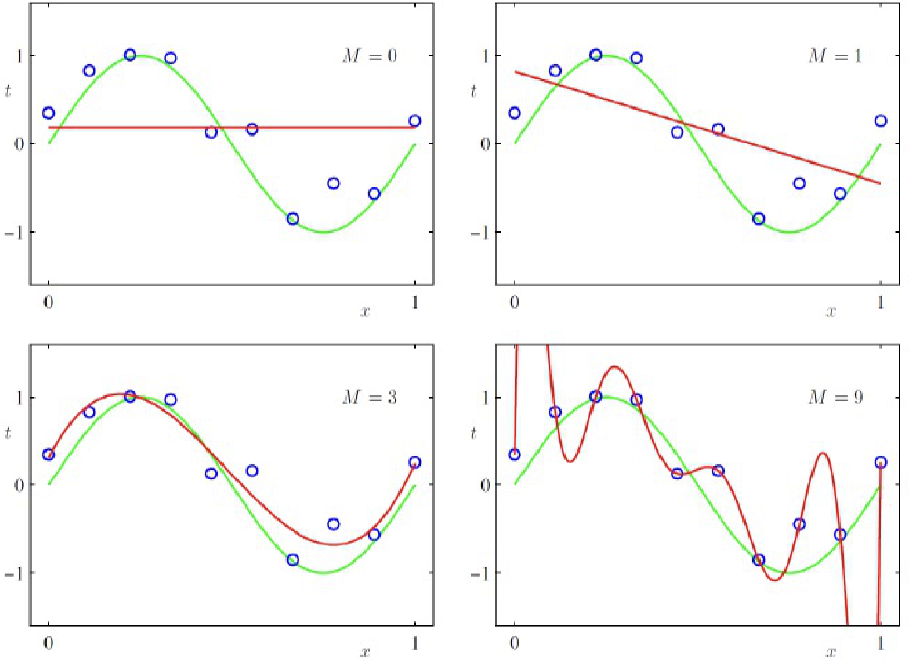
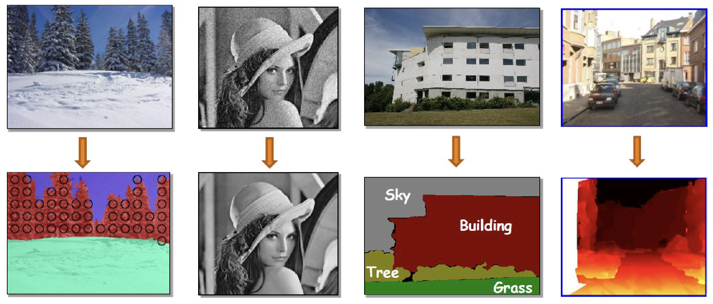
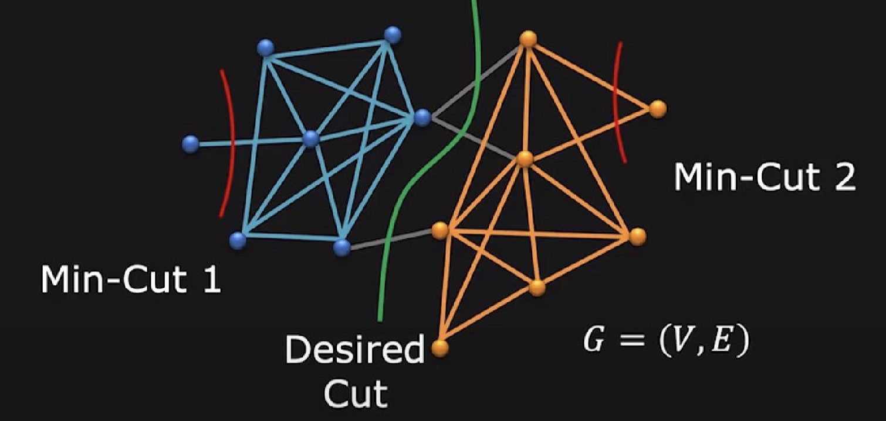

# Lecture 4 | Model Fitting and Optimization

## 优化 

首先我们来定义一个**优化(Optimization)**问题的模型：

!!! definition "优化问题的模型"
    设**目标函数**$f_0(\vec x)$ 满足**约束条件**：
    
    $$
    \left\{
    \begin{aligned}
        f_i(\vec x) &\leq 0,  &i = 1,...,m & \text{inequality constraint functions} \\
        g_i(\vec x) &= 0,  &i = 1,...,p & \text{equality constraint functions}&
    \end{aligned}
    \right.
    $$

    求 $\vec x\in \mathrm{R}^n$ ，使 $f_0(\vec{x})$ 最小（即最优）。
    
> 很显然，这和我们高中接触的线性规划很像，实际上线性规划就是其中一种优化问题。

而接下来，我们需要尝试将一些复杂问题转化为优化问题，即根据问题，写出目标函数和约束条件，并通过一些方法来得到我们需要的 $\vec x$。

!!! eg "🌰 图像去模糊问题"
    在这个 🌰 中，我们已知模糊图像 $Y$ 和模糊滤波器(卷积核) $F$，需要通过优化的方法来求卷积运算之前的清晰图像 $X$。

    进一步来说，就是找到清晰的图像 $X$，使得它做模糊处理后与已知的模糊图像 $Y$ 差别尽可能小，于是问题转化为：

    - 目标函数为 $\min\limits_{X} || Y - F * X ||^2_2$ 的优化问题。

---

### 模型拟合 

为了研究分析实际问题，我们需要对问题进行一个建模，更具体的来说就是根据实际情况，寻找数据之间的关系，并建立数学模型。

一个数学**模型(model)**描述问题中输入和输出的关系，例如：线性模型(linear model) $b = a^T x$ 就描述了输入(input) $a$ 和输出(output) $b$ 关于模型参数(model parameter) $x$ 的关系。

而实际的结果很难严格满足数学模型，这是由多方原因导致的，所以我们往往做的是对实际情况进行**模型拟合(model fitting)**。

更具体的来说，我们可能已经有一个先验的假设，即数据符合哪种模型，接下来根据数据来分析得到合适的 model parameters，而这个步骤也常常被称为 learning。

一种比较经典的逼近方法（[最小二乘法](https://zh.wikipedia.org/wiki/%E6%9C%80%E5%B0%8F%E4%BA%8C%E4%B9%98%E6%B3%95)）是求使**[均方误差(mean square error, MSE)](https://zh.wikipedia.org/wiki/%E5%9D%87%E6%96%B9%E8%AF%AF%E5%B7%AE)**最小的 model parameters：

$\hat{x} = \mathop{\arg \min\limits_x} \sum\limits_i(b_i - a_i^Tx)^2$

而如果我们假设数据中的噪声是高斯分布的（实际上大部分噪声在基数足够大的情况下都可以看作为高斯分布的），那么可以与统计学的**极大似然估计(maximum likelihood estimation, MLE)**相统一.

!!! success "MSE vs. MLE"
    [MSE vs MLE for linear regression](https://medium.com/analytics-vidhya/mse-vs-mle-for-linear-regression-f4ce3f6b990e)

具体来说，$b_i = a_i^T x + n, \;\; n \sim G(0,\sigma)$，而对于给定的 $x$，其**似然(likehood)**$P[(a_i,b_i)|x] = P[b_i-a_i^Tx] \propto \exp \left( - \frac{(b_i-a_i^Tx)^2}{2\sigma^2} \right)$，表示在 model parameter 为 $x$ 的情况下，数据符合 $(a_i,b_i)$ 的可能性。

???+ definition "Maximum Likelihood Estimation"
    <!--Copy from https://github.com/sakuratsuyu/Note/blob/master/docs/Computer_Science_Courses/ICV/4_Model_Fitting_and_Optimization.md?plain=1-->
	If the data points are **independent**,
	
	$$
	\begin{aligned}
	P[(a_1, b_1)(a_2, b_2)\dots|x] & = \prod\limits_iP[(a_i, b_i)|x] = \prod\limits_i P[b_i - a_i^T x] \\
	& \propto \exp\left(-\frac{\sum_i(b_i - a_i^Tx)^2}{2\sigma^2}\right) = \exp\left(-\frac{||Ax-b||^2_2}{2\sigma^2}\right)
	\end{aligned}
	$$
	
    That is, maximize the likelihood to find the best $x$.

	$$
	\begin{aligned}
	\hat x &= \mathop{\arg \max\limits_x} P[(a_1, b_1)(a_2, b_2)\dots|x] \\ &= \mathop{\arg \max\limits_x} \exp\left(-\frac{||Ax-b||^2_2}{2\sigma^2}\right) 
	= \mathop{\arg \min\limits_x}||Ax - b||_2^2
	\end{aligned}
	$$

!!! tip "MSE = MLE with Gaussian noise assumption"

!!! question "需要补数学知识，完善这部分内容"

---

## 数值方法

上一小节介绍了如何对实际问题进行数学建模，接下来需要介绍的是如何求解数学模型。

我们知道，对于一些比较简单的模型，我们可以直接求其**解析解(analytical solution)**，比如使用求导等方法。

!!! eg "🌰"

    以刚才的线性 MSE 为例，$\hat{x} = \mathop{\arg \min\limits_x} \sum\limits_i(b_i - a_i^Tx)^2$ 等效于求解等式 $A^TAx=A^Tb$。

然而，实际情况是大部分问题过于复杂，我们没法直接求其解析解，所以我们需要采用一些即采用一些**数值方法(numerical methods)**。

---

### 梯度下降

> 由于相关领域的“函数”等基本上都是高维的，所以我们一般使用二维函数图像的方法来形象表示函数，即使用“等高线”的形式来可视化函数。

虽然没法直接求解析解，但是一般函数都具有一些局部性质，例如极值点临域的梯度都指向极值点。模糊地来说，只要我们随着“梯度”去“下降”，就有可能找到极值点，这就是通过**梯度下降(gradient descent)**的方法来解决优化问题。

简单描述梯度下降的过程：

1. 初始化起点坐标 x；
2. 直到 x 收敛到我们满意的程度之前：
    1. 计算下降方向 *p*；
    2. 决定下降步长 ⍺；
    3. 更新 x = x + ⍺*p*；

  

> Sourece: https://commons.wikimedia.org/w/index.php?curid=2283984

其中有三件事需要特殊说明：

- 如何确定下降方向 $\vec p$
- 如何确定下降步长
- 全局最优和局部最优

#### 确定下降方向

对于我们以前接触过的函数，即形式相对简单的函数，我们当然可以直接求其梯度得到下降方向。然而实际问题中的函数可能非常复杂，或梯度解析式很难得到。这时候我们就只能退而求其次，求其“近似”梯度方向。换句话来说，我们希望能够找到一个和原函数在局部和该函数很像的拟合函数，并且用这个拟合函数的梯度方向来决定梯度下降的方向。

于是我们想到泰勒展开，它将函数展开为多项式，而多项式的梯度是相对容易得到的。

其中比较常用的是：

- first-order approximation: $F(x_k + \Delta x) \approx F(x_k) + J_F \Delta x$
- second-order approximation: $F(x_k + \Delta x) \approx F(x_k) + J_F\Delta x + \frac{1}{2}\Delta x^T H_F \Delta x$

其中 $J_F$ 是**[雅各比矩阵](https://zh.m.wikipedia.org/wiki/%E9%9B%85%E5%8F%AF%E6%AF%94%E7%9F%A9%E9%98%B5)**，可以理解为多维向量函数的导数；$H_F$ 是**[海森矩阵](https://zh.m.wikipedia.org/zh-hans/%E9%BB%91%E5%A1%9E%E7%9F%A9%E9%99%A3)**，可以理解为多位向量函数的二阶导数。

接下来以 first-order approximation 为例继续分析。

观察 $F(x_k + \Delta x) \approx F(x_k) + J_F \Delta x$，发现当 $J_F\Delta x < 0$ 时， $F(x_0 + \Delta x)$ 大概率比 $F(x_0)$ 小，即“下降”，所以在 first-order approximation 的情况下，一般选择方向 $\vec p = -J_F^T$，于是位移量 $movement = -J_F \cdot J_F^T \cdot step$。

---

#### 确定下降步长

即使但从下降速率来考虑，步长太长或太小也都有明显的问题：

  

所以步长的选择对下降速率的十分关键。

为了专注于步长的选择，我们记 $\phi(\alpha) = F(x+\alpha h),\;\;\text{where x and h fixed}, x\geq 0$。现在我们希望找到一个能让 $\phi(\alpha)$ 尽可能小于 $\phi(0)$ 的 $\alpha$。接下来我们介绍 Backtracking Algorithm：

1. 初始化 $\alpha$ 为一个比较大的值；
2. 不断减小 $\alpha$ 直到 $\phi(\alpha) \leq \phi(0) + \gamma\phi'(0)\alpha$；
    - 其中 $\gamma\in(0,1)$ 是一个固定的参数；

 { width=40% } 

> 换句话说就是，符合预期的最大步长，这个“预期”，就是通过 $\gamma$ 体现的。图中红色虚线和黑色细线分别是 $\gamma$ 取边界值时的情况，而红色实线则表示我们的预期随 $\alpha$ 的变化。

---

上面使用 first-order approximation 为例介绍的这套方法就是**最速梯度下降法(steepest descent method)**。

!!! section "最速梯度下降法"
    $\vec p = -J_F^T$；

    - 优点
        - 容易实现；
        - 在距离目标点较远时表现良好；
    - 缺点
        - 在目标点附近收敛比较慢；
        - 浪费了大量算力；

    这是因为，最速梯度下降法主要采用的是 first-order approximation，没有体现曲率特征。

因而一种很自然的改进方法就是使用 second-order approximation，即**牛顿法(Newton Method)**。

!!! section "牛顿法"
    $F(x_k + \Delta x) \approx F(x_k) + J_F\Delta x + \frac{1}{2}\Delta x^T H_F \Delta x$

    对它求导得到 $\frac{\partial F}{\partial \Delta x} = J_F^T+H_F\Delta x = 0$。

    所以得到方向为 $\vec p = \Delta x =  -H_F^{-1}J_F^T$

    - 优点
        - 在目标点附近下降速度相对更快；
    - 缺点
        - Hessian matrix 的计算需要相当算力，甚至有时候无法计算；

由此发现，牛顿法的表现会好很多，如果能够避免计算黑塞矩阵，就可以进一步提高牛顿法的效果，于是就出现了**高斯牛顿法(Gauss-Newton method)**。

!!! section "高斯牛顿法"
    > 对于解决最小二乘法 $\hat x = \mathop{\arg \min\limits_x} ||R(x)||^2_2$ 的问题表现非常好。

    对于这类问题，高斯牛顿法使用 $J_R^TJ_R$ 来近似代替 $H_F$，得到下降方向为 $\vec p = -(J_R^TJ_R)^{-1}J_R^T,\;\;\text{where }J_R\text{ is the Jacobian of }R(x)$。

    - 优点
        - 不需要计算 Hessian matrix，只需要计算 Jacobian matrix；
    - 缺点
        - 由于 $J_R^TJ_R$ 不正定，所以未必可逆，高斯牛顿法成立的前提是其可逆；
        - 当然，可以使用 Levenberg-Marquardt 算法（LM 算法），即将 $J_R^TJ_R$ 修正为 $J_R^TJ_R + \lambda I$ 以保证正定；

    ???+ summary "Levenberg-Marquardt"
        Wiki: [🔗](https://zh.wikipedia.org/wiki/%E8%8E%B1%E6%96%87%E4%BC%AF%E6%A0%BC-%E9%A9%AC%E5%A4%B8%E7%89%B9%E6%96%B9%E6%B3%95)

        $$
        \Delta x = -(J_R^TJ_R+\lambda I)^{-1}J_R^TR(x_k)
        $$

        - The effect of $\lambda$:
            - $\lambda \to \infty$: Gradient descent, and stepsize is small;
            - $\lambda \to 0$: Gauss-Newton step;
        - How to determine $\lambda$:
            - Update in every iteration;
            - When decreases obviously, $\lambda\uparrow$;
            - When doesn't decrease obviously, $\lambda\downarrow$;

        简单来说，LM 就是综合了最速梯度下降法和牛顿法的优点，在远离目标点的时候使用最速梯度下降法，保证启动速度快；在靠近目标点的时候使用牛顿法，保证收敛速度足够快；并且保证 $J_R^TJ_R+\lambda I$ 正定，所以始终能够使牛顿法成立。

!!! tip "带约束的优化问题"
    对于**带约束的优化问题(constrained optimization)**，则需要**根据实际问题**求解。

    - 我们可能可以转化问题，使用更简单的表达式去拟合原来的表达式，来求解；
    - 其中，（凹）凸函数是一定能找到最优解的，我们称这种问题为凸优化问题(Convex optimization)
    
    > 推荐同名读物：https://web.stanford.edu/class/ee364a

---

#### 全局最优和局部最优

分多个 batch 来处理，大量撒点，然后比较每一个 batch 的结果，最终取最好的一个即可。

---

## 鲁棒估计

**[鲁棒估计(robust estimation)](https://en.wikipedia.org/wiki/Robust_statistics)**是对从各种概率分布（尤其是非正态分布）中提取的数据具有良好性能的统计。

在拟合模型中，难免出现一些不符合预期的点，而它们会对拟合结果产生或多或小的影响，而如何权衡这些噪声与真正有用的数据点之间的关系，就是鲁棒估计的课题。

---

### 内点 & 外点

首先我们对数据点进行分类：

- 内点(inlier)：符合我们预期的模型拟合的点；
- 外点(outlier)：完全不符合我们预期模型的点，又叫离群；

!!! error "外点的影响"
    由于外点偏离很大，而最小二乘法中存在平方操作，所以最小二乘法拟合受这些外点影响很大：

    

---

### 不同的损失函数

于是我们考虑，可以更换拟合的损失函数，来减小大偏差点带来的影响，比如使用 L1 loss(即求绝对值)。不过更好的是一种选择叫 huber loss，它在距离远点较远的时候比较接近 L1 loss。

??? note "L1 & L2 & Huber"
    - L1 loss 即直接对偏差取绝对值，其公式为 $L_1 = |f(x)-Y|$，其最大的问题就是在拐点处不光滑，即不可导，而且其收敛可能过快；
    - L2 loss 即将偏差取平方，即 $L_2 = |f(x)-Y|^2$，L2 loss 在拐点处则是光滑可导的，且收敛相对稳定光滑，但是且在某些时候具有比较好的几何意义，但是对于偏差较大的点更敏感；
    - Huber loss 又叫 smooth L1 loss，即使用分段函数，在拐点附近使用 L2 loss，在远端使用 L1 loss；

    

    - 相关文章：https://zhuanlan.zhihu.com/p/48426076

---

### 随机抽样一致

**[随机抽样一致(random sample consensus, RANSAC)](https://zh.wikipedia.org/wiki/%E9%9A%A8%E6%A9%9F%E6%8A%BD%E6%A8%A3%E4%B8%80%E8%87%B4)**采用迭代的方式从包含外点的数据中估计数学模型参数，是一个对于存在明显外点的数据非常有效的方法。

!!! summary "RANSAC procedure"

    1. 首先随机找两个点拟合一条直线，然后检查有多少点符合这条直线，并对其进行 vote；
    2. 重复这个步骤，最后选择票数最高的拟合；

    

由 outlier 拟合出来的直线一般 votes 比较少，因为 outlier 之间很难一致；但是inlier之间容易一致，因而得分往往更高，于是将它们区分开来。~~这不就是 Voting Tree (逃~~

---

## 病态问题

如果一个问题的解不唯一，那么这个问题是一个**病态问题(ill-posed problem)**。特别的，在线性问题中，一个线性方程（组）的解如果不唯一（不满秩），则同样是一个病态问题。

当然，对于线性方程组，根据线性代数的知识，我们可以增加方程，即增加约束。而这种约束一般来自于对变量的先验约束，比如：

!!! note "L2 regularization"
    **L2 norm**: $||x||_2 = \sum_i x_i^2$;

    **L2 regularization**: $\min\limits x ||Ax-b||^2_2\;\;s.t. ||x||_2 \leq 1$;

    
 { width=30% } 

    > 通过让选择的解尽可能接近原点，而让我们没有用的解的维度尽可能接近 0，以减小没用的变量的影响，抑制冗余变量。

!!! note "L1 regularization"
    **L1 norm**: $||x||_1=\sum_i|x_i|$;

    **L1 regularization**: $\min\limits x ||Ax-b||^2_2\;\;s.t. ||x||_1 \leq 1$

    
 { width=30% } 

    > L1 可视化中可以发现，坐标轴上比较容易抓住解，此时意味着有些变量(维度)是 0，换句话来说能让解变得“**稀疏(sparse)**”，即在维度上的分布只比较集中于个别项。

不过，将他们作为约束条件参与求解，不如直接加进去作为一个项，其效果是等价的：

$$
\begin{matrix}
    \text{L2 regularization:}               & | & \text{or L1 regularization:}\\
    \min_{x}||Ax-b||^2_2+\lambda ||x||_2^2  & | & \min_{x}||Ax-b||^2_2+\lambda ||x||_1\\
    s.t. ||x||_2 \leq 1                     & | & s.t. ||x||_1 \leq 1 \\
\end{matrix}
$$

---

### 过拟合和欠拟合

在这个过程中，也要小心**过拟合(overfitting)**和**欠拟合(underfitting)**，它们的含义非常直白：

---

## 插值

**插值(interpolation)**其实已经在 [lec 3 的笔记](Lec03.md#放大图片向上采样--插值) 里提到过了。

这里先略过。

- [ ] TODO: 再细说。

??? bug "sketch" 
    线性拟合、二次样条插值（每一段都是一个二次函数）、三次样条插值（一阶导二阶导连续，但最终是个病态问题，需要额外再约束起点和终点二阶导为零或者限定给定斜率等，就需要俩额外约束条件）、

---

上面是连续优化问题，下面是离散优化问题

## 图割 & 马可夫随机场

### 图像标签问题

**图像标签问题(image labeling problems)**即通过图片信息给每一个像素分配标签，实际上就是一个对图像内容的分类和识别问题。

其中一个比较强的**先验(prior)**是：相邻且相似的像素应当拥有相同的标签。

而图割和马可夫随机场可以建模这种先验。

---

### 图割

**图割(Graphcut)**的核心思想是，把一张图片的每一个像素看作一个 graph 中的 vertex，并在像素之间建 edge，并将 weight 定义为两像素之间的相似性或关联性(affinity or similarity)。

!!! success "measuring affinity"
    比如，我们可以这样衡量像素的相似性：

    - 设 $f$ 表示颜色；
    - 像素差异(dissimilarity)为 $s(f_i,f_j)=\sqrt{\sum_k(f_{ik},f_{jk})^2}$；
    - 则相似性(affinity)权重为：$w(i,j) = A(f_i,f_j) = e^{\frac{-1}{2\sigma^2}s(f_i,f_j)}$；

再接下来，通过这样的方式将图片建成图后，就可以把问题转化为图割问题，我们将小权的边删去，最终会形成若干连通分量，而这些连通分量那的点则被视为一个“分割”。

具体来说，图割的代价为断的边权之权重和 $cut(V_A,V_B)= \sum_{u\in V_A, v\in V_B} w(u,v)$，而我们需要找代价尽可能小的，满足我们要求的图割。当然，这个问题也等效于最大流问题；

!!! warning "Problem with min-cut"
    > Bias to cut small, isolated segments.

    

由于 min-cut 的这个问题，我们还需要衡量这个子集是否足够稠密，所以我们倾向于使用 normalized-cut。

$$
assoc(V_A,V) = \sum_{u\in V_A, v\in V} w(u,v) \\
NCut(V_A,V_B) = \frac{cut(V_A,V_B)}{assoc(V_A,V)} + \frac{cut(V_A,V_B)}{assoc(V_B,V)}
$$

- NP-Complete
- Approximate solution by eigenvalue decomposition

---

### 马可夫随机场

**马可夫随机场(Markov Random Field, MRF)**是一种更通用的解决方案，可惜我第一次没听懂，等我听懂了再来补充这里的内容。

??? bug "sketch"
    Markov chains
