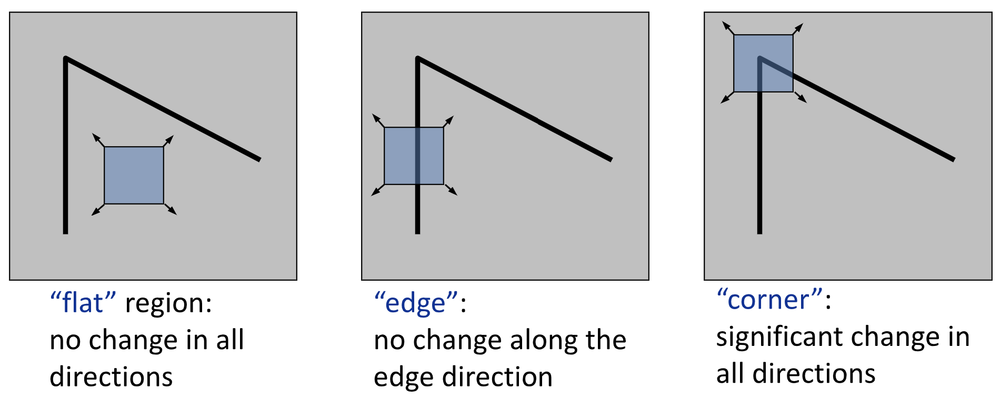
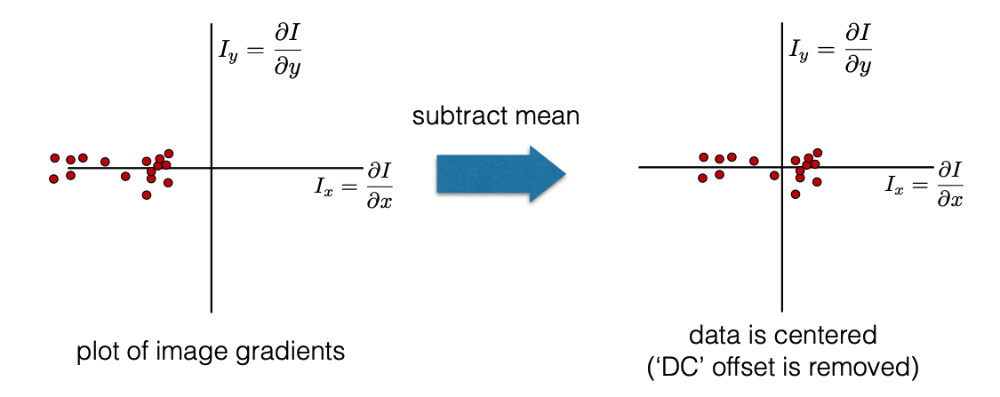
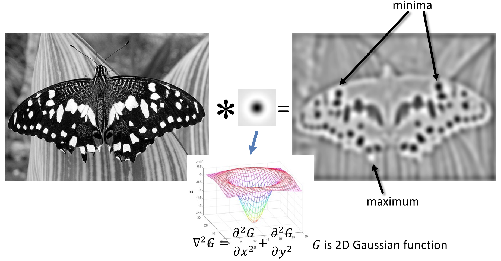
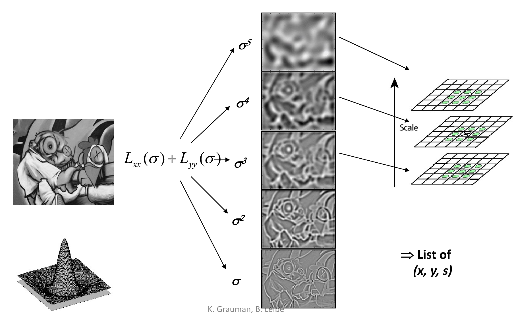
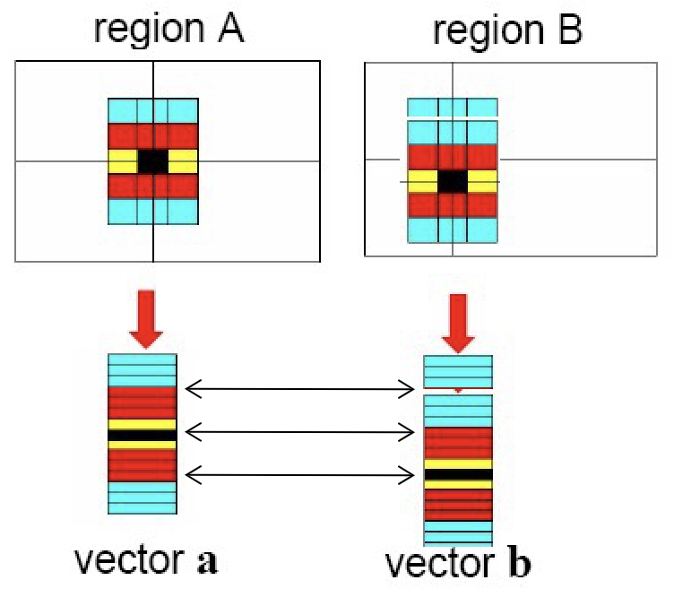

# Lecture 5 | Feature Matching and Motion Estimation

!!! warning "注意"
    本文尚未完全整理好！

## 图像特征匹配

本节的课题是**特征匹配(feature matching)**，具体来说是找到两张图像中可能指代同一客体的部分，关键在于找到图片之间点和点的匹配关系。该问题是很多问题的基石，例如：

??? eg "applications"
    - Image alignment / Panoramas
    - 3D reconstruction
    - Motion tracking
    - Object recognition
    - Indexing & database retrieval
    - Robot navigation
    - ...

!!! tip "头脑风暴"
    究其根本，特征匹配“联通”了两张图片，使它们原本孤立表达的信息连结起来。
    
    简单的应用如图像拼接，再往后，我们会发现三维重建中也会应用到特征匹配到相关内容。

概括传统特征匹配主要环节，大概可以分为如下三步：

1. **检测(detection)**: 找到**关键点(interest points)**，即可能会被匹配的“特征点”；
2. **表达(description)**: 提取每个关键点周围的向量**特征描述符(feature descriptor)**，即将“特征”数据化；
3. **匹配(matching)**: 决定两个视角下特征描述符的关联并匹配，即构建“特征”之间的匹配关系；

---

### 关键点检测

!!! quote "推荐阅读"
    [【计算机视觉】2. 特征点检测：Harris, SIFT, SURF, ORB](https://zhuanlan.zhihu.com/p/36382429)

**检测(detection)**的首要问题是如何选择**关键点(interest points/feature points)**，或者说，一个点什么情况下会被认为是一个特征点。

总体来说，关键点需要由这么两个特征：

1. **独特性(uniqueness)**，即这个点需要能够表征一定特性；
2. 对于变换不敏感，即对于一个客观上的关键点，即使图片被旋转、压缩、适当的扭曲，它都应当（尽可能地）被识别为关键点；

!!! note "关键点"
    虽然说是关键“点”，但是实际上指的是一小块区域。既然作为一个能表达局部特征的点，它必然需要囊括一定范围内的信息。

首先我们讨论如何衡量一个点的**独特性(uniqueness)**，本文会介绍两种检测器：

1. 着眼于图像的角点 - Harris corner detector；
2. 着眼于图像的斑点 - Blob detector(LoG or DoG)；

---

#### 角点检测

!!! quote "推荐阅读"
    [Harris Corners @ 16-385 Computer Vision (Kris Kitani) @ Carnegie Mellon University](https://www.cs.cmu.edu/~16385/s17/Slides/6.2_Harris_Corner_Detector.pdf)

角点检测的基本思路是，我们称某个点比较独特时，它相对于周围一定又一些“不同”的地方。或者说存在一些高频特征，而且这种高频特征不会各向同性或者说几个向同性。

在模式化的描述这个思路就是：

!!! note "Local measures of uniqueness(rough):"
    我们以窗口的形式对目标点及其邻域进行采样，当无论往哪个方向移动窗口，采样结果都会产生较大变化时，我们就认为这个点独特性强。

    

    |**Flag**                      |**Edge**                       |**Corner**                     |
    |:----------------------------:|:-----------------------------:|:-----------------------------:|
    |无论向哪个方向移动，都不会有太大变化|当沿着“Edge”的方向移动时，不太有变化|无论向哪个方向移动，都会导致较大的变化|

不过这仍然是一个相对模糊的定义，为了对其进行建模，我们进一步地对上面提到的“变化幅度”赋予数学含义：

!!! definition "Local measures of uniqueness(detail):"
    所谓变化大，实际上指的是相同的单位长度里，色彩值的差更大，为什么我们不用梯度来衡量呢？关注区域内的梯度分布：

    

根据梯度的分布，我们可以大致观察到图形的特征，，包括存在多少个 Edge 以及这些 Edge 的方向。

不过纯粹根据梯度来寻找角点有时候可能会收到噪声的影响，进一步的，我们可以用**主成分分析(Principle Component Analysis)**来优化这个过程。。

!!! key-point "Principle Component Analysis"
    ① Subtract off the mean for each data point.
    
    

    ② Compute the covariance matrix at each point.

    $$
    H = \sum_{(u,v)}w(u,v) \begin{bmatrix}
        I_x^2 & I_xI_y \\
        I_xI_y & I_y^2
    \end{bmatrix} \text{           where  } 
    I_x = \frac{\partial f}{\partial x}, I_y = \frac{\partial y}{\partial y}
    $$

    > $w(u,v)$ 一般是高斯权重。

    ③ Compute eigenvalues.

    $$
    H = \begin{bmatrix}
        a & b \\
        c & d
    \end{bmatrix} \;\;\;\; \lambda_{\pm} = \frac{1}{2}\left(
        (a+d) \pm \sqrt{4bc + (a-d)^2}   
    \right)
    $$

    ??? extra "error function approximation"
        **[Carnegie Mellon University 的 slides P18 ](https://www.cs.cmu.edu/~16385/s17/Slides/6.2_Harris_Corner_Detector.pdf)** 开始还提到了不同位移下的误差函数，并给出了三种情况下误差函数的热力图。

        

    ④ Components are the eigenvectors ranked by the eigenvalues.

    ---

    在本节的语境下，形象地叙述主成分分析得到的结果就是：第一个主成分指向方差最大的方向，第二个主成分指向垂直于第一个主成分的方向，它们的大小则与这些方差正相关。

对于上面的三种情况，它们做主成分分析后得到的结果是：

可以发现，第三个情况的两个特征值都很大。

我们通过判断两个特征值的大小关系情况来判断一个区域是否包含一个**角(corner)**、**边(edge)**或**平面(flat)**，可以将他们放到一个直方图中，根据两个特征值形成的点对在整个象限中出现的位置来判断角点情况：

> Figure from Carnegie Mellon University's slides. Corner detection.

为了能够量化地表达上面这张图的分类规则，我们引入**哈里斯算子(Harris operator)**:

$$
f = \frac{\lambda_1\lambda_2}{\lambda_1+\lambda_2} = \frac{determinant(H)}{trace(H)}
$$

这里的一个特性是，对于二维矩阵来说，我们实际上并不需要按照之前的步骤，进行主成分分析以后再得到，而是可以直接通过这个公式得到。

而这个 $f$ 就叫做 corner response。

???+ question "reminder"
    $$
    det\left(\begin{bmatrix}
        a & b\\
        c & d
    \end{bmatrix}\right) = ad-bc
    \;\;\;\;\;
    trace\left(\begin{bmatrix}
        a & b\\
        c & d
    \end{bmatrix}\right) = a+d
    $$

如上这套方法就是**[Harris corner detector](https://zh.wikipedia.org/wiki/%E5%93%88%E9%87%8C%E6%96%AF%E9%82%8A%E8%A7%92%E5%81%B5%E6%B8%AC)**的实现。

归纳一下，其步骤就是：

!!! summary "Harris detector "
    
    1. 求导 | Compute derivatives at each pixel.
    2. 协方差矩阵 | Compute covariance matrix $H$ in a Gaussian window around each pixel.
    3. 响应函数 | Compute corner response function $f$.
    4. 阈值过滤 | Threshold $f$.
    5. 非极大值抑制 | Find local maxima of response function (nonmaximum suppression).

    更详细的说明可以参考 wiki 上的说明：<u>**[Harris corner detector](https://zh.wikipedia.org/wiki/%E5%93%88%E9%87%8C%E6%96%AF%E9%82%8A%E8%A7%92%E5%81%B5%E6%B8%AC)**</u>。
    
    - C.Harris and M.Stephens. “**[A Combined Corner and Edge Detector.](http://www.bmva.org/bmvc/1988/avc-88-023.pdf)**” Proceedings of the 4th Alvey Vision Conference: pages 147—151, 1988.

另一个关键问题是，通过这个方法得到的关键点，具有对变换不敏感性吗？

对此，结论是：

> 1. **Partially** invariant to affine intensity change.
> 2. Corner response is invariant w.r.t. translation.
> 3. Corner response is invariant w.r.t. image rotation.
> 4. Corner response is **NOT** invariant to scaling.

!!! advice "对尺度变化敏感的解决方案"
    针对结论 4，由于 Harris detector 对尺度变化敏感，所以我们在使用这个方法的过程中需要注意尺度，即窗口的大小选定。

    
 { width=30% } 

    一种设想的方案是，不断尝试不同的 window size，然后取得 response 曲线，假设 response 的大小只与 scale 有关，则曲线都应该是单峰的，而取出这个峰值（特征最明显的时候），就可以当他为对应的 scale 以及对应的 response。

    不过一般实际的做法是固定窗口大小，而改变图片的大小，再在得到的**图像金字塔**上进行这个方法的计算，即对不同分辨率的图片上分别进行哈里斯检测。（相当于给图片增加了一个维度，本质上和上面的方法是一样的，只不过用了一个更合理的实现角度。）

---

#### 斑点检测

除了角点，**斑点(blob)**也是一个比较好的特性，非常适合作为关键点。

而斑点的寻找我们则可以利用滤波器来实现，让我们回顾**[第三章边缘提取](Lec03.md#边缘提取)**的相关内容，我们可以利用类似的做法，使用一个中间负四周正的滤波器来提取斑点。

通常来说，我们使用 Gaussian 滤波器的 Laplacian，即 Laplacian of Gaussian Filter(LoG)，来作为滤波器和图像进行卷积。

👉 **[Laplacian 算子](https://zh.wikipedia.org/wiki/%E6%8B%89%E6%99%AE%E6%8B%89%E6%96%AF%E7%AE%97%E5%AD%90)**

实际上也等效于先对图片作高斯模糊（减小噪声影响），再计算其拉普拉斯算子，即：

$$
\nabla^2(f*g) = f * \nabla^2 g
$$

其中，LoG 的 scale 是通过高斯函数的 $\sigma$ 控制的，也同样通过像素金字塔来实现。

又或者可以使用 Difference of Gaussian(DoG)，即将 Laplacian of Gaussian Filter 替换为一个由两个高斯函数做差得到的 Filter，相对来说效率更高。

---

### 关键点表达

选定关键点后，我们需要考虑如何描述和表达这些点，以使对应对关键点表达相近，而不相关对关键点表达相远。

一种朴素的思想是将窗口内的像素作为一个**特性向量(feature vector)**进行比较，但是这样做对偏移的误差过于敏感。也就是说，也许两张图片很像，但是因为一点位移误差，导致向量刚好错开，导致结果显示两个点差别很大。这是因为这种做法对像素点在窗口中的位置很敏感，但是显然位置并不是关键点的特征之所在。

 { width=40% } 

另外更好的做法是**尺度不变的特征变换(Scale Invariant Feature Transform, SIFT) descriptor**，不再使用像素值，而是使用区域中的梯度的分布作为一个描述，可以表示为一张 $[0,2\pi)$ 的，**循环的**直方图。此时小的平移和缩放都不会对它产生很大影响，而旋转只会导致直方图的循环平移——不过这种循环平移是很好处理的，比如我们可以选中最大的分量作为参考，并将整个直方图平移对齐。相比直接将像素转化为特征向量 SIFT 鲁棒性更高。

> 完整的 SIFT 是包括「检测」步骤的。

---

!!! extra "Other detectors and descriptors:"
    - **HOG: Histogram of oriented gradients**
        - Dalal & Triggs, 2005 
    - **SURF: Speeded Up Robust Features**
        - Herbert Bay, Andreas Ess, Tinne Tuytelaars, Luc Van Gool, "SURF: Speeded Up Robust Features", Computer Vision and Image Understanding (CVIU), Vol. 110, No. 3, pp. 346--359, 2008 
    - **FAST (corner detector)**
        - Rosten. Machine Learning for High-speed Corner Detection, 2006. 
    - **ORB: an efficient alternative to SIFT or SURF**
        - Ethan Rublee, Vincent Rabaud, Kurt Konolige, Gary R. Bradski: ORB: An efficient alternative to SIFT or SURF. ICCV 2011 
    - **Fast Retina Key- point (FREAK)**
        - A. Alahi, R. Ortiz, and P. Vandergheynst. FREAK: Fast Retina Keypoint. In IEEE Conference on Computer Vision and Pattern Recognition, 2012. CVPR 2012 Open Source Award Winner.

---

### 关键点匹配

所谓的**匹配(matching)**就是字面上的将两张图中对应的点建立起匹配关系。而评估方法就是寻找「距离」最接近的点。

而这里的「距离函数」是<u>用来衡量两个关键点的**[表达](#关键点表达)**的差异</u>的函数，一般使用 L2 distance，即 $||f_1 - f_2||$。

!!! warning "重复性纹理"
    然而需要特别注意点一个问题是，很有可能出现某个特征图案重复出现的情况，这类问题叫做**重复性纹理问题**。
    
    在这种情况下可能有很**多**关键点能和这个关键点实现匹配（表达相近），这个时候我们就需要用 Ratio score = $\frac{ ||f_1 - f_2|| }{ ||f_1 - f_2'|| }$，比较最接近的两种匹配。

    如果 Ratio score 接近 1，说明 $f_1, F_2,f_2'$ 的表达都很接近，这个匹配并不可靠，只能丢掉这个关键点。

    在传统 CV 技术中，我们很难处理这一类重复性纹理的问题，所以遇到这种难以寻找匹配关系的情况，我们只能选择不匹配它们。

此外，为了增加匹配的准确性，我们还有一个判定规则：两点**相互最相似**，则该匹配十分可信。（在 I2 中你最像我，在 I1 中我最像你）

---

## 运动估计

先前，我们着眼于单张图片，或者说几张图片，仍然是以一个静态的视角来观察图像。

而当我们把研究对象从图片改变为视频或者说图片序列的时候，图片就被赋予了**运动**的属性，而这就引出了**运动估计(motion estimation)**问题。

首先，运动按照成因**主要**可以分为相机运动和场景运动两个维度。

|相机运动|场景运动|eg|
|:---:|:---:|:---:|
|<input disabled="" type="checkbox">|<input disabled="" type="checkbox">|(光线变化等影响视频每一帧的内容存在光影差异等)|
|<input checked disabled="" type="checkbox">|<input disabled="" type="checkbox">|静景“运镜”|
|<input disabled="" type="checkbox">|<input checked disabled="" type="checkbox">|监控录像|
|<input checked disabled="" type="checkbox">|<input checked disabled="" type="checkbox">|体育赛事镜头跟踪|

而针对运动估计问题，有这么几种解决的视角：

- 特征跟踪，在每一帧中进行关键点匹配，以跟踪特定关键点的变化——这一类方法得到的结果相对稀疏，毕竟关键点总是少的；
- **光流(optical flow)**技术，通过对相邻帧的像素进行匹配，以跟踪像素的变化——这一类方法得到的结果相对密集；

而两个视角都可以使用 **[Lucas-Kanade method](https://hal.science/hal-03697340/)** 解决。

首先，我们需要给**运动估计(motion estimation)**问题一个更明确的定义：

!!! definition "motion estimation"
    Wiki: https://en.wikipedia.org/wiki/Motion_estimation

    运动估计是指从一个 2D 图像到另一个 2D 图像的转换中确定描述运动的运动矢量的过程，通常是从视频序列中相邻的帧中提取。

    假设我们有匹配点 $P(x,y,t)$ 和 $P(x+u, y+v, t+1)$，则运动估计则是求解 $(u,v)$ 的过程。

    不同于关键点的匹配，运动估计更侧重于对关键点的时序关系的匹配与描述。

而我们之后的探讨，都需要基于 LK 假设展开：

!!! property "Key Asumptions of Lucas-Kanade"
    1. [Small motion] 相邻帧，匹配点的运动距离小；
    2. [Brightness constancy] 相邻帧，点的亮度倾向于不变，即变化微小；
    3. [Spatial coherence] 相邻的点倾向于运动相似；

接下来，基于 LK 假设，我们来研究运动估计问题的求解。

首先，我们将第二条假设表达式化，即有：

$$
I(x,y,t) = I(x+u, y+v, t+1)
$$

为了求解 $u$ 和 $v$，LK Method 对其作泰勒展开：

$$
I(x+u,y+v,t+1) \approx I(x,y,t) + I_x\cdot u + I_y \cdot v + I_t
$$

移项：

$$
I(x+u,y+v,t+1) - I(x,y,t) = I_x\cdot u + I_y \cdot v + I_t
$$

根据假设 2，得到：

$$
I_x\cdot u + I_y \cdot v + I_t \approx 0
$$

即：

$$
\nabla I \cdot \begin{bmatrix}
    u & v
\end{bmatrix}^T + I_t = 0
$$

于是我们得到了关于 $u$ 和 $v$ 的一个较简单的等式。

然而我们只有一个等式，但需要求解的未知元 $u$ 和 $v$ 有两个。

于是我们引入了假设 3，即相邻的点倾向于运动相似。

于是我们可以把窗口内的像素都带入上面那个等式，尝试来求解（大致都相似的）$u$ 和 $v$。此时我们的方程数量就非常充裕了。此时我们可以将问题转化为优化问题。

$$
Ad=b \rightarrow \min\limits_d ||Ad-b||^2
$$

**Least squares solution(前面提到过的最小二乘法的近似解)** for d given by $(A^TA)d = A^Tb$.

而这个解是否存在的条件是：

!!! note ""
    
    $$
    \underbrace{
        \begin{bmatrix}
            \sum I_x I_x & \sum \sum I_x I_x \\
            \sum I_x I_y & \sum I_y I_y
        \end{bmatrix}
    }_{A^T A}
    \begin{bmatrix}
        u \\
        v
    \end{bmatrix}
    =
    \underbrace{
        \begin{bmatrix}
            \sum I_x I_t \\
            \sum I_y I_t
        \end{bmatrix}
    }_{A^T b}
    $$

    在该式中，$A^TA$ 需要是可逆的，并且它的两个特征值都不能太小。也就该点能够被 **[Harris corner detector](#角点检测)** 检测到点角点！

因此，倘若使用 LK 方法，我们需要保证 $A^TA$ 可逆，且图像中不能有太多噪点。

此外，关于对假设 1 的约束，原则上两帧之间的运动差距应该小于一个像素，然而这个条件非常苛刻。所以我们的可以先对图片进行模糊/缩小处理，像素足够“大”之后就可以满足这个假设 1。然而在这个过程中会丢失很多信息，所以只根据这个条件来计算也不行，所以我们可以在像素金字塔上进行逐层次估计，再不断细化的做法。