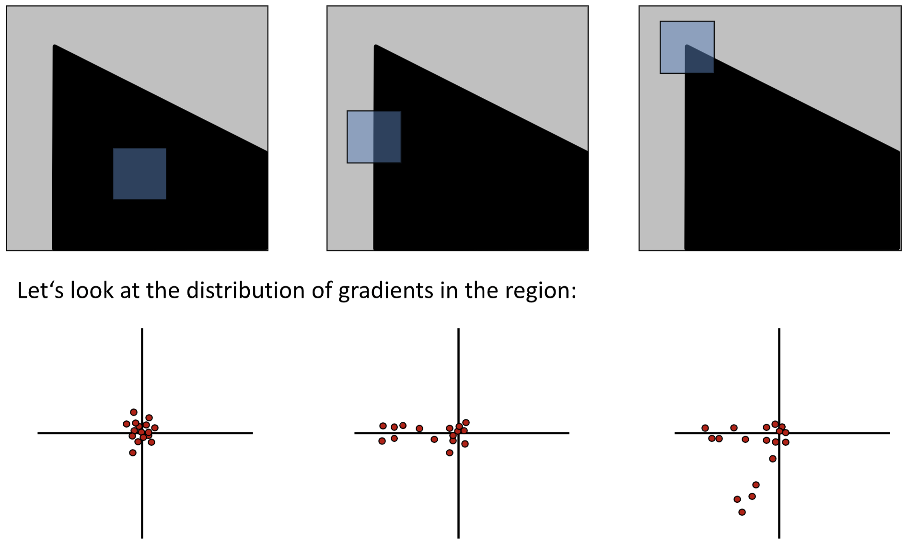
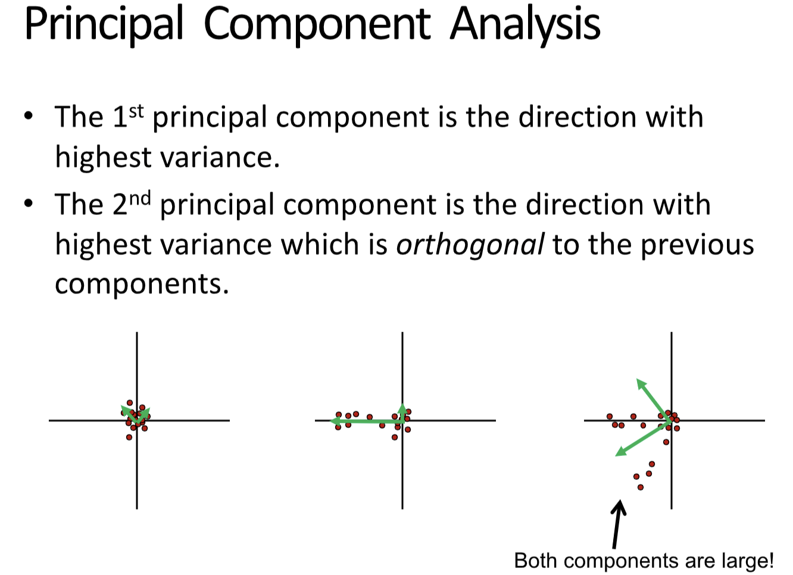
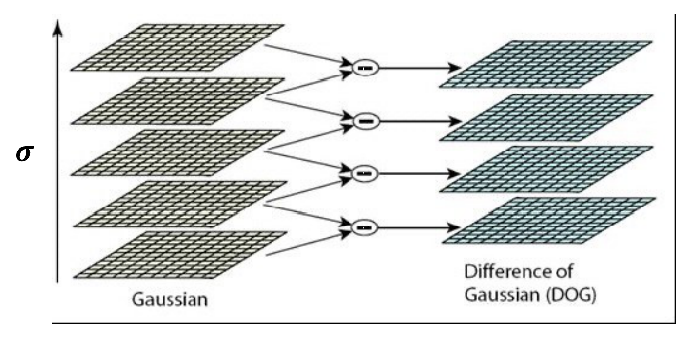

# Lecture 5 | Feature Matching and Motion Estimation

!!! warning "注意"
    本文尚未完全整理好！

## 图像特征匹配

本节的课题是 **特征匹配(feature matching)**，关键在于找到图片之间点和点的匹配关系。该问题是很多问题的基石，例如：

???+ summary "applications"
    - Image alignment / Panoramas
    - 3D reconstruction
    - Motion tracking
    - Object recognition
    - Indexing & database retrieval
    - Robot navigation
    - ...

特征匹配的主要环节是：

1. **检测(detection)**: 找到 **兴趣点(interest points)**
2. **表达(description)**: 提取每个兴趣点周围的向量 **特征描述符(feature descriptor)**
3. **匹配(matching)**: 决定两个视角下特征描述符的关联并匹配

---

### 关键点检测

> 推荐阅读：https://zhuanlan.zhihu.com/p/36382429

**检测(detection)** 的首要问题是如何选择 **关键点(interest points/feature points)**。

总体来说，关键点需要由这么两个特征：

1. **独特性(uniqueness)**，这个点需要能够表征某个图案的某个特性；
2. 对于大部分变换不敏感，即对于一个客观上的关键点，在不同图片中它都应当（尽可能地）被识别为兴趣点；

!!! note "关键点"
    虽然说是关键“点”，但是实际上指的是一小块区域。

而常见的检测方法主要包括如下两种：

1. Harris corner detector;
2. Blog detector (LoG or DoG);

---

#### 角落检测

其中一种关键点就是尖角，或者说角落，这一类关键点的<u>局部</u>独特性可以通过下面这个方式来衡量：

!!! note "Local measures of uniqueness(rough):"
    我们认为一个 **区域**，如果向任何方向滑动窗口，都会产生较大变化，那么其 uniqueness 较强。

    

这是一个相对模糊的定义，而为了对其进行建模，我们进一步地赋予其数学含义：

!!! note "Local measures of uniqueness(detail):"
    关注区域内的梯度分布：

    

根据梯度的分布，我们可以大致观察到图形的特征。进一步的，我们可以利用数学工具（**主成分分析(Principle Component Analysis)**）去分析这些点的分散度和分散方向。

!!! note "Principle Component Analysis"
    ① Compute the covariance matrix at each point.

    $$
    H = \sum_{(u,v)}w(u,v) \begin{bmatrix}
        I_x^2 & I_xI_y \\
        I_xI_y & I_y^2
    \end{bmatrix} \text{     where  } 
    I_x = \frac{\partial f}{\partial x}, I_y = \frac{\partial y}{\partial y}
    $$

    > $w(u,v)$ 一般是高斯权重。

    ② Compute eigenvalues.

    $$
    H = \begin{bmatrix}
        a & b \\
        c & d
    \end{bmatrix} \;\;\;\; \lambda_{\pm} = \frac{1}{2}\left(
        (a+d) \pm \sqrt{4bc + (a-d)^2}   
    \right)
    $$

对于上面的三种情况，它们做主成分分析后得到的结果是：

可以发现，第三个情况的两个特征值都很大。

更一般的，我们通过判断特征值的大小情况来判断一个区域是否包含一个 **角(corner)**，又或者是一些 **边(edge)**，甚至是 **平面(flag)**：

> Corner detection.

为了能够量化地表达上面这张图的分类规则，我们引入 **哈里斯算子(Harris operator)**:

$$
f = \frac{\lambda_1\lambda_2}{\lambda_1+\lambda_2} = \frac{determinant(H)}{trace(H)}
$$

这里的一个特性是，对于二维矩阵来说，我们实际上并不需要按照之前的步骤，进行主成分分析以后再得到，而是可以直接通过这个公式得到。

而这个 $f$ 就叫做 corner response。

???+ question "reminder"
    $$
    det\left(\begin{bmatrix}
        a & b\\
        c & d
    \end{bmatrix}\right) = ad-bc
    \;\;\;\;\;
    trace\left(\begin{bmatrix}
        a & b\\
        c & d
    \end{bmatrix}\right) = a+d
    $$

如上这套方法就是 **[Harris corner detector](https://zh.wikipedia.org/wiki/%E5%93%88%E9%87%8C%E6%96%AF%E9%82%8A%E8%A7%92%E5%81%B5%E6%B8%AC)** 的实现。

归纳一下，其步骤就是：

!!! note "Harris detector "
    
    1. 求导 | Compute derivatives at each pixel.
    2. 协方差矩阵 | Compute covariance matrix $H$ in a Gaussian window around each pixel.
    3. 响应函数 | Compute corner response function $f$.
    4. 阈值过滤 | Threshold $f$.
    5. 非极大值抑制 | Find local maxima of response function (nonmaximum suppression).

    更详细的说明可以参考 wiki 上的说明：<u>**[Harris corner detector](https://zh.wikipedia.org/wiki/%E5%93%88%E9%87%8C%E6%96%AF%E9%82%8A%E8%A7%92%E5%81%B5%E6%B8%AC)**</u>。
    
    - C.Harris and M.Stephens. “**[A Combined Corner and Edge Detector.](http://www.bmva.org/bmvc/1988/avc-88-023.pdf)**” Proceedings of the 4th Alvey Vision Conference: pages 147—151, 1988.

一个关键问题是特征匹配的可重复问题（因为同一个点不一定在两张图里都是 interest point，所以只有重复的点才能匹配）

我们希望这些 repeatable 的点的 response 在 image transformation 中具有一定的不变性。

我们已知的 transformation 主要包括这么几个：

- 强度变化
- 几何变化
    - 旋转
    - 放大缩小
    - 平移

而关于不变性，它们的结论是：

>  **Partially** invariant to affine intensity change.
> 
> Corner response is invariant w.r.t. translation.
> 
> Corner response is invariant w.r.t. image rotation.
> 
> Corner response is **NOT** invariant to scaling.

所以我们在使用这个方法的过程中需要注意尺度，即窗口的大小选定。

{ width=200px }

一种方案是，不断尝试不同的 window size，然后取得 response 曲线，假设 response 的大小只与 scale 有关，则曲线都应该是单峰的，而取出这个峰值（特征最明显的时候），就可以当他为对应的 scale 以及对应的 response。

不过一般实际的做法是固定窗口大小，而改变图片的大小，再在得到的 **图像金字塔** 上进行这个方法的计算，即对不同分辨率的图片上分别进行哈里斯检测。（相当于增加了一个维度）

---

#### 斑点检测

除了角落，**斑点(blob)** 也是一个比较好的特性，非常适合作为兴趣点。

而斑点的寻找我们则可以利用滤波器来实现，让我们回顾 **[第三章边缘提取](Lec03.md#边缘提取)** 的相关内容，我们可以利用类似的做法，使用一个中间负四周正的滤波器来提取斑点。

通常来说，我们使用 Gaussian 滤波器的 Laplacian，即 Laplacian of Gaussian Filter(LoG)，来作为滤波器和图像进行卷积。

👉 **[Laplacian 算子](https://zh.wikipedia.org/wiki/%E6%8B%89%E6%99%AE%E6%8B%89%E6%96%AF%E7%AE%97%E5%AD%90)**

实际上也等效于先对图片作高斯模糊（减小噪声影响），再计算其拉普拉斯算子，即：

$$
\nabla^2(f*g) = f * \nabla^2 g
$$

其中，LoG 的 scale 是通过高斯函数的 $\sigma$ 控制的，也同样通过像素金字塔来实现。

又或者可以使用 Difference of Gaussian(DoG)，即将 Laplacian of Gaussian Filter 替换为一个由两个高斯函数做差得到的 Filter，相对来说效率更高。

---

### 表达

选定匹配点后，我们需要考虑如何描述表达这些点。

一种朴素的思想是将窗口内的像素作为一个 **特性向量(feature vector)** 进行比较，但是这样做对偏移的误差过于敏感。也就是说，也许两张图片很像，但是因为一点位移误差，导致向量刚好错开，导致结果显示两个点差别很大。这是因为这种做法对像素点在窗口中的位置很敏感，决定了其在向量中的位置，即绝对排列顺序影响结果；然而实际情况下更重要的是相对排布顺序，但向量的做法比较难实现。

{ width=500px }

另外更好的做法是 尺度不变的特征变换(Scale Invariant Feature Transform)SIFT descriptor，不再使用像素值，而是使用区域中的梯度的分布作为一个描述，可以表示为一张 $[0,2\pi)$ 的，**循环的** 直方图。此时小的平移和缩放都不会对它产生很大影响，而旋转只会导致直方图的循环平移，不过这是很好处理的，比如我们可以选中最大的分量作为参考，并将整个直方图平移对齐。而这种做法相比于上面那个做法，**鲁棒性** 和 **效率** 都更高。

!!! tip "注意，完整的 SIFT 是包括「检测」步骤的。"

---

??? note "Other detectors and descriptors:"
    - **HOG: Histogram of oriented gradients**
        - Dalal & Triggs, 2005 
    - **SURF: Speeded Up Robust Features**
        - Herbert Bay, Andreas Ess, Tinne Tuytelaars, Luc Van Gool, "SURF: Speeded Up Robust Features", Computer Vision and Image Understanding (CVIU), Vol. 110, No. 3, pp. 346--359, 2008 
    - **FAST (corner detector)**
        - Rosten. Machine Learning for High-speed Corner Detection, 2006. 
    - **ORB: an efficient alternative to SIFT or SURF** 
        - Ethan Rublee, Vincent Rabaud, Kurt Konolige, Gary R. Bradski: ORB: An efficient alternative to SIFT or SURF. ICCV 2011 
    - **Fast Retina Key- point (FREAK)** 
        - A. Alahi, R. Ortiz, and P. Vandergheynst. FREAK: Fast Retina Keypoint. In IEEE Conference on Computer Vision and Pattern Recognition, 2012. CVPR 2012 Open Source Award Winner.

---

### 匹配

所谓的 **匹配(matching)** 就是字面上的将两张图中对应的点建立起匹配关系。而评估方法就是寻找「距离」最接近的点。

而这里的「距离函数」是用来衡量两个兴趣点经过 **[表达](#表达)** 后的差异的函数，一般使用 L2 distance，即 $||f_1 - f_2||$。

!!! warning "重复性纹理"
    然而需要特别注意点一个问题是，很有可能某个特征图案是重复出现的，这种问题叫做 **重复性纹理**。这就导致可能有很多兴趣点能和这个兴趣点实现匹配，这个时候我们就需要用 Ratio score = $\frac{ ||f_1 - f_2|| }{ ||f_1 - f_2'|| }$，比较最接近的两种匹配。

    如果 Ratio score 接近1，说明并不可靠，只能丢掉这个兴趣点。

此外，为了增加匹配的准确性，我们还有一个判定规则：两点 **相互最相似**，则该匹配十分可信。（在 I2 中你最像我，在 I1 中我最像你）

---

### Learning based matching

---

## 运动估计 motion estimation

运动的成因：

- 相机运动 x 场景运动

Motion estimation problems:

- Feature-tracking 稀疏
- 光流 Optical flow 稠密

而两个问题都可以使用 Lucas-Kanade method 解决。

运动估计问题的定义：

视频的两帧，关键点的变化量。

不同于关键点匹配，动作估计中存在对时序关系的捕捉。

LK method 假设：

1. Small motion 相邻帧运动距离小
2. Brightness constancy 相邻帧的点的亮度倾向于不变
3. Spatial coherence 相邻的点倾向于运动类似

使用公式表述：

### The brightness constancy

$$
I(x,y,t) = I(x+u, y+v, t+1)
$$

为了求解 u 和 v，LK Method 对其作泰勒展开：

$$
I(x+u,y+v,t+1) \approx I(x,y,t) + I_x\cdot u + I_y \cdot v + I_t \\
I(x+u,y+v,t+1) - I(x,y,t) = I_x\cdot u + I_y \cdot v + I_t \approx 0 \\
\nabla I \cdot \begin{bmatrix}
    u & v
\end{bmatrix}^T + I_t = 0
$$

于是得到了关于 u 和 v 的一个较简单的等式。

然而未知元有 2，等式有 1，所以无法求解。

!!! question "PPT 里那个u' v'的例子是什么意思？"

**孔径问题(Aperture problem)**

solution:

More equation

利用假设 Spatial coherence，我可以利用窗口内的大量像素都带入上面那个等式求解 u 和 v。

但是这下方程数又大于变量数了，于是我们转化问题，把解方程的问题转化为优化问题。

$$
Ad=b \rightarrow \min\limits_d ||Ad-b||^2
$$

**Least squares solution(前面提到过的最小二乘法的近似解)** for d given by $(A^TA)d = A^Tb$.

*在这里补一个公式

!!! tip "而这个公式有解恰好意味着它是个角点。"

理论上我们对假设1的要求是，两帧之间的运动差距应该小于一个像素，然而这个条件非常苛刻。所以我们的做法是先对图片进行模糊/缩小处理，像素足够“大”之后就可以满足这个假设1。然而只根据这个条件来计算也不行，所以我们要在像素金字塔上进行逐层次的做法。