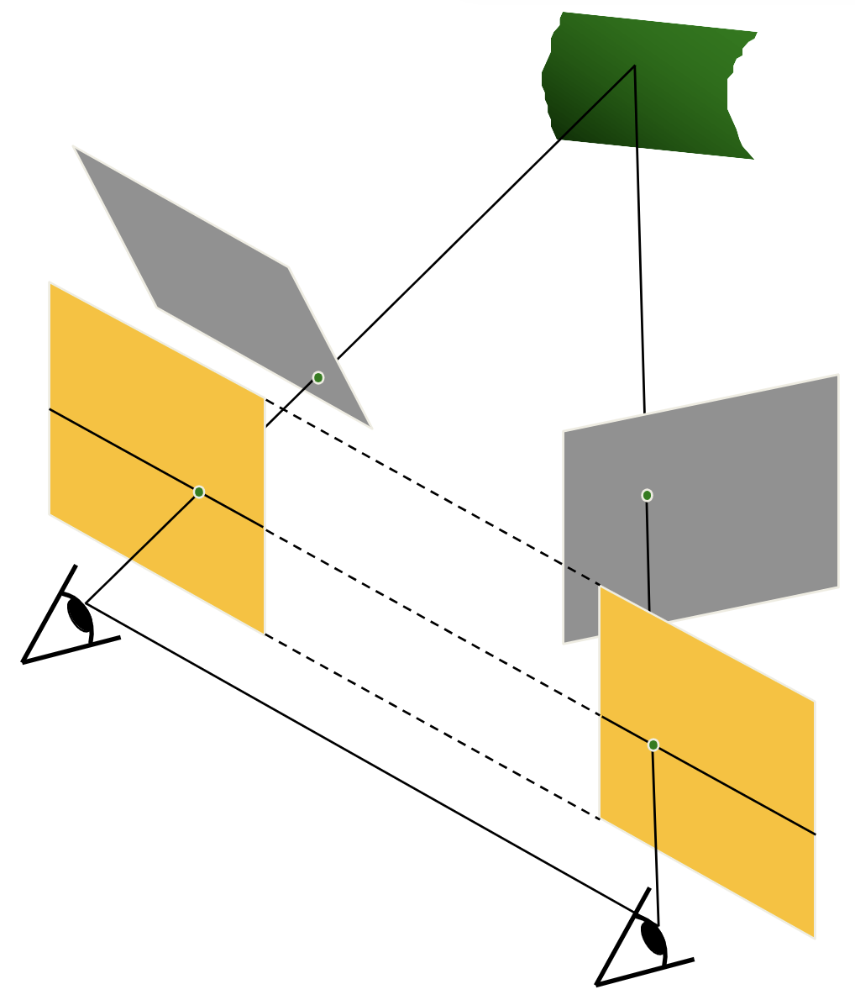

# Lecture 8 | Depth Estimation

!!! warning "注意"
    本文尚未完全整理好！

---

!!! info "引入"
    在 [上一章](Lec07.md) 中，我们已经介绍了如何重建得到关键点的点云，但是此时我们得到的只是一个稀疏的点云，而本章需要解决的问题就是如何“稠密”地进行重建。

    而在稠密重建过程中，我们不能单单着眼于关键点，而是要广泛地面向图像中的所有像素，而其中最重要的一个技术就是**深度估计(Depth Estimation)**。

    ---

    「深度」这个概念和它的字面意思几乎一样，而在「深度估计」中，我们需要做的是对于给定的图像，标记**每一个**像素的深度。而将其可视化，就是深度图。
    
    

    只不过有时候深度指的是空间点到相机中间或者相机平面的距离，也有的时候指的是某个空间坐标轴向的深度，具体应当根据实际情况来。

    ---

    按照深度感知的手段分类，有**主动深度探测方法(Active depth sensing)**和**被动深度探测方法(Passive depth sensing)**两种，其中我们将要展开的视觉方法都是被动探测方法。

    !!! summary "主动探测方法 / 非视觉方法"

        - LiDAR
        - Structured light
        - Active stereo
    
    !!! summary "被动探测方法 / 视觉方法"
        
        - Stereo
        - Multi-view stereo
        - Monocular

逻辑链：

(双目视觉 -> 深度感知) => ((双视角匹配点 + 视差 -> 深度) + (对所有像素进行匹配)) => 极线上寻找匹配点

## 立体视觉

我们已经有了稀疏重建的方法，想要得到稠密重建的方法，一个最暴力的方法就是尝试着去匹配所有像素，当然这看起来时间开销非常大。但是毋庸置疑的是，在目前还没有介入人工智能技术的情况下，我们仍然需要像素的匹配关系。

以及还有一个需要解决的问题就是，如何得到匹配点的深度信息。

所以总结下来，有两个问题需要解决：

!!! note ""
    - [ ] 如何高效地得到匹配关系；
    - [ ] 如何根据匹配点计算点深度；

由于匹配中会有部分优化内容涉及到深度计算的内容，所以我想先从深度计算开始讲，也就是从视差开始讲。

---

### 视差

首先，我们都知道人的**双**眼赋予了人类视觉上深度感知的能力，也就是立体视觉(stereo vision)。一个比较家喻户晓的实验就是单眼穿针会变得十分困难。

在单目视觉下，体现远近最简单的原理描述就是「近大远小」，而在动态的情况下，这也体现在移动相同的距离，近处的物体移动更明显，而远处的更不明显。然而这个信息和单纯的“大小”信息是可以混淆的，或者说在“大小”变化不明显的情况下，这个信息是很难被识别出来的。

而在双目视觉下，我们有有一个更近一步的原理，也就是**视差(disparity)**，通过视差，我们可以更精确地感受到“距离”（实际上也是对极几何那一套），接下来阐述其原理。

首先，我们绘制一个简单的模型：

> 在这个模型中，我们假设两个图像中的匹配点符合之后会在**立体匹配**一节里提到的**[最简情况(simplest case)](#搜索)**，但是可以不用管这个最简情况是什么，直接当作这是一个俯视视角下的简化，直接看下面的模型即可。

> (1) 中 OL 和 OR 分别是两相机中心，淡蓝色线条表示成像平面，XL 和 XR 分别表示实际点 X 在成像平面上的投影，橙色线条表示他们的横向坐标（假设他们都在同一水平线上），z 表示实际点 X 到基线的距离，这里我们暂且称之为“深度”（反正不管怎么定义深度，有 z 都能算）。
>
> (2) 中我画图的时候忘记区分两个 XR 了，所以关于 (2) 图中的 XR 一律指左边那个 XR。

我们将 OR 的成像模型平移到左侧，即图 (2)，发现橙色的三角形和红色的三角形相似：$\Delta O X_L X_R \cong \Delta X O_L O_R$ （注意，实际情况不一定等腰！）

于是我们得到，在这种情况下：

$$
\frac{\overline{X_L X_R}}{f} = \frac{\overline{O_L O_R}}{z} \\
\text{ i.e. }\; disparity = \Delta{\mathbf{x}} = |\mathbf{x}_l - \mathbf{x}_r| = |x_l - x_r| = \frac{B \cdot f}{z} \\
\text{where }B\text{ is the length of baseline} \\
\text{ i.e. }\; z = \frac{B \cdot f}{|x_l-x_r|}
$$

!!! tip "提示"
    虽然是个简化情况，但是在**[最简情况(simplest case)](#搜索)**下是可以直接挪用结论的，稍后我会提醒回顾这一节来理解这一点，所以安心顺着读下去即可。

至此，我们在[本节开头](#立体视觉)提到的两个问题，已经解决一个了。

!!! note ""
    - [ ] 如何高效地得到匹配关系；
    - [x] 如何根据匹配点计算点深度；

---

### 立体匹配

首先我们做一个假设，也就是在匹配过程中，我们的两个 view 的距离相差不大，也就是说局部特征仍然是相似的。

---

#### 搜索

**立体匹配(Stereo Matching)**的原理就是，选定第一个图像内的某一点，然后去另外一张图像对应的对极线上搜索找到能够和它匹配的点。没错，我们只需要在一条直线上搜索找到匹配的点即可，这大大优化了复杂度。而它的根据恰好就是对极线的定义。

👉 回顾**[对极几何](Lec07.md#对极几何)**！

没错，我们现在已知了 $X_L$（由我们选定的），那么 $X_R$ 的轨迹便是对极线，于是我们只需要先找到我们选定的 $X_L$ 在另外一张图像上对应的对极线，然后再在这条线上搜索特征与 $X_L$ 最匹配的那个点即可。（这里我们也没有必要使用 SIFT，直接做差就够了）

但是话又说回来，计算对极线这件事也并非十分简单，如果对于每个点我们都需要去计算对极线，那么将带来不小的常数，而且由于这件事没法“整体地预处理”，所以我们还需要优化这件事。

!!! note "最简情况"

    首先考虑**最简情况(simplest case)**这个特殊情况：

    { align=right width=380px }

    1. 两个相机的焦距相同；
    2. 相机位置在同一水平面上，即高度相同；
    3. 两个成像平面和基线，三者相互平行，或者说两个成像平面共面（此时对极点不存在）；

    此时，对极线也水平，而且两条对极线也共线（可以思考一下为什么）。

    换句话来说，在这种情况下，当我们选定左图中的某个点 $X_L$，那么 $X_R$ 的候选位置就在右图中同一高度的那条水平线上。

    { width=315px }

那么如何解决这种情况以外的情况呢？既然我都这么排了，那解决办法自然就是转化为最简情况来做了。

!!! tip "转化思想"
    又是一个突然的想法，很多时候我们或许可以不从整体去思考，而是先解决一个最简情况，再转化问题。

!!! note "一般情况"

    { align=right width=380px }

    这个问题被称为**[立体影像矫正](Stereo Image Rectification)**，这里并不展开，可以参考这篇文章：

    C. Loop and Z. Zhang. [Computing Rectifying Homographies for Stereo Vision.](https://www.microsoft.com/en-us/research/publication/computing-rectifying-homographies-for-stereo-vision/) IEEE Conf. Computer Vision and Pattern Recognition, 1999.

    { width=315px }

!!! tip "回顾"
    
    相信现在你对“最简情况”已经有更深刻的理解了，不妨回过头去理解一下为什么我们之前提到的那个简化的视差模型可以直接挪用结论？

    👉 **[视差](#视差)**

---

#### 匹配

所谓的寻找匹配，就是在充斥着候选点的对极线上搜索匹配最好的一个点，或者说差异最小的一个点。

常见的差异衡量方法有这么几种：

!!! success "SSD: Sum of Squared Differences"
    $$
    diff = \sum_{x,y} |W_1(x,y) - W_2(x,2)|^2
    $$

!!! success "SAD: Sum of Absolute Differences"
    $$
    diff = \sum_{x,y} |W_1(x,y) - W_2(x,y)|
    $$

!!! success "ZNCC: Zero-mean Normalized Cross Correlation"
    $$
    diff = \frac{(W_1(x,y)-\overline{W_1})(W_2(x,y)-\overline{W_2})}{\sigma_{W_1}\sigma_{W_2}} \\
    \text{where  } \overline{W_i} = \frac{1}{n}\sum_{x,y} W_i \;\;\; \sigma_{W_i} = \sqrt{\frac{1}{n}\sum_{x,y}(W_i-\overline{W_i})^2}
    $$

    其中，ZNCC 相比其他方法，优越性在于它对图像整体的光强度不敏感，因为我们可以发现，$W_i$ 在参与计算前都减去了 $\overline{W_i}$，所以消除了图像整体亮度带来的影响。

    ??? question "个人疑惑"
        这里所谓的“消除亮度影响”，是否是对于 multi-view 的情况来说的？因为如果只有两张图片，且亮度差距整体恒定的话，虽然计算出来的 diff 会偏大，但是整体上的大小关系好像也没有变化？我没有想清楚这一点。

TODO: 优化

---

于是我们得到结论和大致流程——首先我们通过立体影像矫正技术，将两张图片转化为最简情况，然后再对每一个像素进行匹配，只需要在同高度的对极线上搜索匹配局部特征最相似的另外一个点即可。

不过这里还有一个遗留下来问题，读者可以先思考一下目前这个流程有什么问题，再打开下面的提示框。

??? tip "一个尚未被解决的问题"
    让我们回到第五章的**[关键点匹配](Lec05.md#关键点检测)**——为什么我们只找关键点？

    我个人的想法是，首先，关键点能够一定程度上表达一个物体的特征，或者说它是勾勒一个物体非常重要的一个部分；还有一个原因是，关键点特征明显，其表达具有一定的独特性（也就是关键点的**独特性(uniqueness)**）。

    而现在我们做匹配的内容是任意的、广泛的，例如我们现在在做匹配的很可能是一面白墙上的某一个点，这样的点又要如何找到它的匹配点呢？这是我们目前没有解决的问题，不过我们会在之后提到，我们需要**结构光(structured light)**来实现这一点。

    - [ ] TODO: 考虑能不能把结构光放到前面来。

至此，我们在[本节开头](#立体视觉)提到的两个问题，已经全部解决了。

!!! note ""
    - [x] 如何高效地得到匹配关系；
    - [x] 如何根据匹配点计算点深度；

---

- 还有一个问题是选取的窗口大小，有一个精确度和平滑度的 trade-off
    - 于是有一个改进就是考虑空间上的连续性，方法就是转化为优化问题，在目标函数同时考虑匹配度和在临域的平滑度（视差剧烈程度）
        - 而求解这个最优化的问题，在上面提到的「临域」只涉及像素点左侧和右侧，即线性约束时，可以使用 DP 来做，但是在非线性约束下，这个问题变成 NP-hard 问题，只能求近似解，可以使用图割来做
    - Pipeline
        - ...
    - 常见误差出现的地方（大作业提示）
        - ...
    - Baseline 对计算的影响，：
        - 太大（景象变化更大，搜索更难）
        - 太小（可以通过相交得到的四边形长度体现出来）
    - 对于纹理不明显的内容，如果想要去重建，有一种办法是手动增加纹理，比如手动打变化明显的结构光
        - 而在结构光下，我们可以去掉一个相机，因为在投影仪位置的相机，在特定参数下拍到的景象和射出去的内容可能十分相似（貌似默认漫反射时能量不消损，但是不考虑光斑亮暗，单看结构来说应该是这样的）
- multi-view stereo  MVS
    - 好处是约束更强、选择更多、构建更完整
    - 具体做法是
        - 枚举一个视角里对极线上的深度，然后用在其他视角里的重投影匹配度做评估，找到效果最好的深度
        - 其中一个问题是如何高效的计算所有的误差
        - 可以使用 Plane-Sweep
            - 对于每一个其他视角，构造一个关于 x-y-z 的三维表，能够查询对于参考图片`[x][y]`处的像素，如果处于深度`[z]`时的情况
            - 利用两次投影，先在“A”字里相似到远处，然后再斜着投影到每个视角里
            - 每一层层扫过去
            - 
                - 在上图数组里找每一个`[x][y]`里表现最好的`[z]`作为那个像素的深度。
            - 然而这个做法还是不太高效，一个更高效的做法，是 PatchMatch。
                - 随即初始化，总有几个是接近最优解的
                - 对于这些比较优的解，它附近的像素答案在这个答案的附近寻找（传播），然后再在小范围内进一步优化（搜索）

## 3D reconstruction

具体来说，3D 重建包括这么三个步骤：

1. 深度计算
2. 深度 -> 3D网格表面
3. 纹理填充

### 3D representations

补充图片

- 点云 point cloud
- 体素（3d像素）occupancy
- signed distance function (SDF)
    - 大小距离表面的距离，内部为负，外部为正
    - Truncated Signed Distance Function 截断SDF，即仍和大于 1 都记为 1，小于 -1 的记为 -1
- 网格 mesh（比较常用）

### 3D surface reconstruction

1. 深度 -> 体素表示
2. 体素表示 -> 三维网格

#### 深度 -> 体素表示

常用方法：

##### Depth Fusion （depth maps to TSDF）

【对于图中】：

- 可以计算每一个体素到相机中心的距离 $d_p$
- 根据小孔成像规则，可以得到与当前体素所对应的像素，记对应的像素的深度为 $D_k(u)$
- 则该体素的 TSDF 值截断前为 $D_k(u) - d_p$
- 在多图情况下，每一张图的结果做加权计算

!!! tip "思路"
    之前也有类似的内容。一个总结性的想法是，当你需要把「分辨率」低的东西投影到「分辨率」高到地方去时，应当枚举「分辨率」高的那一侧的单元，然后利用「分辨率」低的这一侧去计算，而不是从低到高。

##### Poisson reconstruction （depth maps to occupancy volume）

柏松重建

- 深度图 -> 带法向量的点云
    - Oriented points 那里的箭头是表面法向量（深度的梯度）
- 用优化的方式求解 indicator function （大概就是最终结果的那个物体的表面发向量函数）
    - 这里有一个点就是，体素的曲面是闭合的，所以会有内外之分，内部实心外部空心，所以 indicator function 就是想同时表达 表面 和 内外 两件事。

#### 体素表示 -> 三维网格

常用方法：

Marching cubes

- 以 2D 为例，如果一个「边」的两边，黑白不一致（黑表示外部，白表示内部），则说明这里存在一个边界，于是标一个点，然后将所有的这样的点按照特定顺序连接起来，就得到的了边界。
- 具体标在边界的哪个位置，如果是 SDF 的话可以计算知道，否则可能只能在中间了
- 但是需要注意一个格子如果有多个点的时候怎么连的问题，有一个表可以查，撑死也就 2^4=16 种情况

- 在 3D 情况下，就是在立方体里连接三个点形成三角面，然后也有一个表可以查，撑死也就 2^8=256 种情况。

### Texture mapping

展开 get 纹理图（二维坐标能够对应一个网格面） using 参数化

