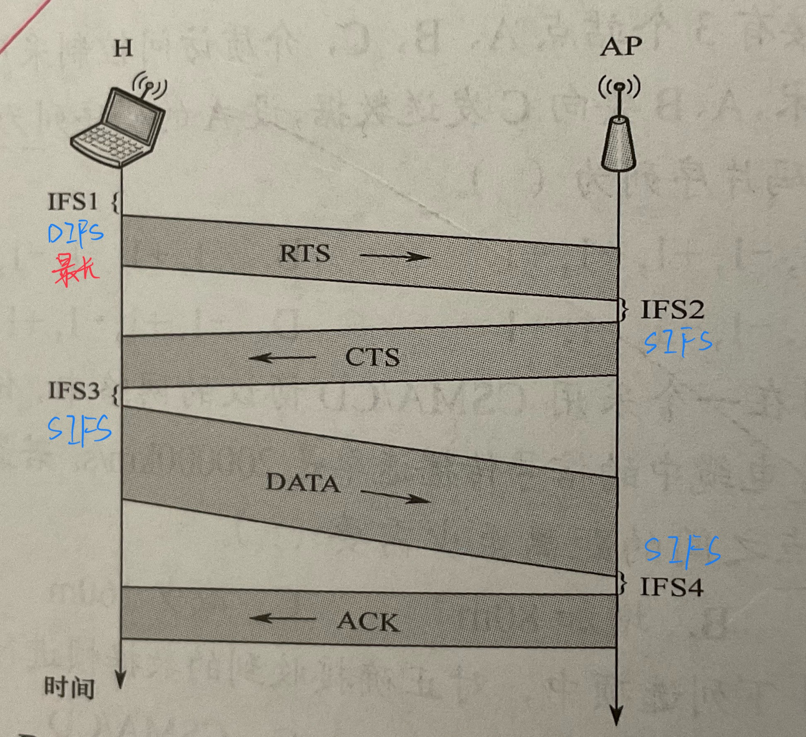

# 🔮 计算机网络 | Computer Network

!!! info "说明"

    本笔记为复习的时候速记的一些知识点，并不十分完美。

    笔记内容主要来自王道，和课程内容为大部分交集，但并不完整，有一些内容王道并不涉及。

    另外，可以看看[这篇笔记](https://obsidian.zerokei.top/Hub/Computer%20Networking/){target="_blank"}。

## 笔记

- 广播 vs 点对点网络：后者采用分组存储转发 + 路由选择
- 交换技术：
    - 电路交换：建立连接、数据传输、断开连接，所有数据一次到位
        - 有序，时延少
        - 建立连接时间长，独占，效率低
    - 报文交换：存储转发，但是不分组，不定长
        - 动态，利用率高，多目标服务
        - 转发时延，大小不限，需要节点缓存够大
    - 分组交换：存储转发，分组，定长
        - 改进了报文交换
        - 增加了额外信息量
- 带宽：**最高**数据传输速率(b/s)
- 时延：
    - 发送 delay：len(msg) / bandwidth
    - 传播 delay：len(way) / light speed
    - 处理 delay：~ 0
    - 排队 delay：~ 0
- 信道利用率：某信道百分制多少的时间是有数据通过的

- 分层后的网络从低到高依次为 1，2，3 层，在第 n 层的活动元素为第 n 层实体（hardware/software）
    - 不同机器的同一层为对等层，同一层的实体为对等实体
- 每个报文分为两个部分：
    - PDU = SDU + PCI
        - n-PDU = n-SDU + n-PCI = (n-1)-SDU
    - SDU：服务**数据**单元，第 n 层的 SDU 为 n-SDU
    - PCI：协议**控制**信息，…….. n-PCI
    - PDU：协议数据单元，对等层之间传输的数据单位，n-PDU，比特/帧/分组/报文段
- 水平：协议是在对等实体之间的，语法 & 语义 & 同步
- 垂直：相邻层之间用接口交互，具体来说是通过服务访问点(SAP)，
- 下层为上层提供服务
    - 请求 & 指示 & 响应 & 证实
- 面向连接（eg: TCP） & 无连接（eg: PI, UDP）
- 可靠服务 & 不可靠服务
- OSI 参考模型
    - 7 层：物理 数据链路 网络 传输 会话 表示 应用
        - 通信子网：物理 数据链路 网络
        - 资源子网：会话 表示 应用
        1. 物理：电路接口，物理参数；信号的意义和电气特征 {EIA-232C, EIA/TIA RS-449, CCITT 的 X.21}
        2. 数据链路：成帧、差错控制、流量控制（协调两个节点的速率）、传输管理，提供点到点的通信 {SDLC, HDLC, PPP, STP, 帧中继}
        3. 网络：通信子网的运行控制，把网络层的数据单元（分组），对分组进行路由选择，实现流量控制、拥塞控制、差错控制、网际互联 {IP, IPX, ICMP, IGMP, ARP, RARP, OSPF}
            - 支持无连接和面向连接
            - 因特网的主要网络层协议是无连接的网际协议（IP），和许多路由选择协议
        4. 传输：负责两个**进程**间的通信，流量控制，差错控制，服务质量，数据传输，提供**端到端**的通信，传输层可以屏蔽通信子网
            - 提供可靠服务，面向连接
            - 传输层可以复用和分用
        5. 会话：表示层实体或用户进程建立连接并**有序**传输数据，实现同步
        6. 表示：交换信息的表示方式，压缩、加密、解密
        7. 应用：用户与网络的界面，{FTP, SMTP, HTTP}
- TCP/IP 参考模型
    - 4 层：网络接口 网际 传输 应用
        - 网络接口：对应 OSI 物理层和数据链路层
        - 网际：对应 OSI 网络层，无连接（OSI 有无连接都支持）
        - 传输层：…，面向连接或无连接（OSI 只支持有连接），提供可靠交付，正确性问题到这里才开始被解决
        - 应用层：对应 OSI 会话层、表示层、应用层
- 综合五层模型
    - 5 层：物理 数据链路 网络 传输 应用

### 物理层

- 数据是信息的实体，信号是信息的存在形式
- 码元指一个单位（码元宽度）的信号波形表示一位 k 进数（k 进制码元）
- 信道上的信号有 基带信号 和 宽带信号 两种，后者将信号调制后形成频分复用模拟信号使用
- 单向通信、半双工通信、全双工通信
- 速率：数据传输速率，单位时间内传输的**数据量**，分以下两种形式
    - 码元传输速率/波特率：单位时间内传输的码元个数（或信号变化次数/脉冲个数），单位是 Baud，码元速率与码元进制无关
    - 信息传输速率：信息速率、比特率，单位时间内数字通信系统传输的二进制码元的个数，单位是 b/s，
    - 两者具有换算关系，若一个码元为 n bits，波特率为 M Baud，则比特率为 Mn b/s
- 带宽（网络）：最高传输速率
- **奈奎斯特采样定理**
    - 理想低通信道（带宽受限、无噪音）宽度为 W(Hz)，极限码元传输速率为 2W Baud，假设一个码元携带 V 个不同的可能信号，即表示 log V 个 bits，则极限数据传输率为 2W log V b/s。
    
    $$
    2W \log_2 V \quad b/s
    $$
    
- **香农定理**
    - 带宽受限、高斯白噪音时，不产生误差时候，信道的极限数据传输速率为 W log (1 + S/N) b/s，S/N 象征信噪比，信噪比 = 10 log_10 (S/N)，即 10 * 十进制位数(S/N)
    
    $$
    W \log_2 (1 + S/N) \quad b/s\\ 10 \log_{10} (S/N) 为信噪比
    $$
    
- 计算最大传输速率时，如果有数据要同时考虑两个定理，对于奈奎斯特，需要有**比特**和带宽，对于香农，需要信噪比和带宽
- 调制：数据 → 模拟信号 | 编码：数据 → 数字信号
- **数字**数据 编码：
    - 归零 / RZ：高 1 低 0（或相反），但每个时钟周期最终都跳回 0
    - 非归零 / NRZ：高 1 低 0（或相反）
    - 反向归零 / NRZI：反转 0，保持 1
    - 曼彻斯特：高低 1 低高 0，**常用**，缺点：频率为原来 2 倍
        - 以太网使用的编码方式
    - 差分曼彻斯特
    - 4B/5B：扩展表示位数，选中一部分，多余的保留
- **数字**数据 调制：
    - 幅移键控（ASK）：振幅
    - 频移键控（FSK）：频率，**广泛使用**
    - 相移键控（PSK）：相位
    - 正交振幅键控（QAM）：ASK x PSK，平方级
- **模拟**数据 编码
    - 采样 量化 编码
    - 奈奎斯特采样定理：采样频率必须 ≥ 最大频率两倍
- **模拟**数据 调制
    - 频分复用 FDM
- 数据报 datagram
    - 尽最大努力交付
    - 无连接
    - 存储接收地址，能独立传输
    - 冗余路径，提高鲁棒性
    - 不独占
- 虚电路
    - 每个节点维护虚电路表，建立链接后形成一条物理路径
    - 连接 传输 断开
    - 双向通道
    - 适合大量数据交换，不适合小数据
    - 鲁棒性不行
    - 不需要包含目的地址，只需要虚电路标识符，开销相对小
    - 不独占
- 这两种方法是交换的具体实现手段，例如虚电路和数据包都可以用来分组交换

- 有线传输介质
    - 双绞线
        - + 屏蔽层 = 屏蔽双绞线(STP)抗电磁干扰
        - 否则就是非屏蔽双绞线(UTP)
        - 便宜，局域网和传统电话网中普遍使用
    - 同轴电缆
        - 更贵，但传输速率更高，传输距离更远
    - 光纤
        - 不同角度入射 → 多模光纤，只适合近距离传输
        - 直径为光波长时光沿直线传播 → 单模光纤适合远距离传输
- 无线传输介质
    - 无线电波
        - 强穿透，长距离，不定向
    - 微波，红外，激光
        - 定向
        - 微波频段范围宽，在地面传输距离有限
        - 卫星通信
- 物理层接口的特性
    - 机械：长啥样
    - 电气：能接受的电压范围，定义域
    - 功能：电平含义，具体的映射关系
    - 过程：不同功能的各种可能事件的出现顺序
- 常用标准接口 EIA RS-232-C, ADSL, SONET/SDH …

- 中继器 repeaters
    - 放大信号
    - 仅作用于电气部分，不能链接不同协议
    - 区别于放大器方法模拟信号，中继器是再生数字信号
- 集线器 hubs
    - 多端口中继器
- 粗同轴电缆，5 段介质 4 个中继器 3 个挂 PC，5-4-3 规则

### 数据链路层

- DLL 为 NL 提供三种服务：
    - 无确认 无连接
    - 有确认 无连接
    - 有确认 面向连接
- 链路管理：确认就绪、交换信息以初始化帧序号、建立连接 → 传输且维持链接 → 释放连接
- 成帧
    - 主要问题：帧定界、帧同步、透明传输
    - **head** + data + **tail**，只有 DLL 层需要加尾部，因为网络中数据以帧为最小单位传输
    - HDLC 中用 F(`01111110`)标记开始结尾，帧的数据范围应当在范围内尽可能长，以提高传输效率，DLL 层协议会规定帧的数据部分传输上限——最大传送单元 (MTU)
    - 字符计数法
        - 开头用一个数字表示多长，a[0] = length（包括 a[0] 自己）
        - 问题是万一 a[0] 坏了，就寄了
    - 字符填充的首尾定界符法
        - 首尾用字符标识，例如用 SOH 标识开头，用 EOT 标识结尾，如果数据中出现 SOH 或 EOT 这些保留字，则在前面加转义字符 ESC，和现代语言的字符串中的转义是一个道理
    - **零比特填充的首尾标志法**
        - 用特殊的比特模式表示首尾，用 `01111110` 来表示开头结尾，而数据中每遇到 5 个 `1` 就在后面加一个 `0` ，保证不会出现连续的 5 个以上的 `1` ，逆操作就是每遇到 5 个 `1` 就删掉后面的一个 `0` ，如果后面是 `1` 那说明到末尾了
        - 性能比字符法填充好
    - **违规编码法**
        - 有时候编码是冗余的，例如曼彻斯特中使用了 低高 和 高低，但是没有使用 低低 和 高高，可以用这些冗余的编码来做界定
        - IEEE 802 用了这个
        - 只适用使用了冗余编码的情况
    - 常用的组帧方法是后两个
- 流量控制
    - 限制发送方的数据流量以不超过对方能 handle 的流量
    - 该功能在很多高层协议上也有，对于 DLL 来说，控制的是相邻节点之间数据链路上的流量
    - 在 OSI 中，DLL 具有流量控制功能；但 TCP/IP 中在传输层
    - 停等协议
        - 每发送一帧都需要等待接收方的应答信号再继续
        - 接收方每接收一帧都需要反馈一个应答信号
    - 滑动窗口
        - 发送窗口控制没反馈信号的时候最多能多发几个窗口
            - 有反馈后窗口会移动
        - 接收窗口控制能接受多少窗口
        - 一次吐一包，能对面吃的差不多了再吐
        - 停等协议：发送窗口大小 = 1，接收窗口大小 = 1
        - 后退 n 帧协议：发送窗口大小 > 1，接受窗口大小 = 1
        - 选择重传协议：发送窗口大小 > 1，接受窗口大小 > 1
        - 接受窗口大小 = 1 时可以保证有序接收
    - 可靠传输机制
        - 确认
            - 可以稍带确认
        - 超时重传
            - 自动重传请求
    - 后退 N 帧协议 GBN
        - 累积确认，ACKn 表示期待接下来获得 ACK(n+1)
        - 若用 n bits 对帧进行编号，则发送窗口的大小应该满足 1 < W ≤ 2^n - 1，两个紧临的窗口需要有编号的 offset
    - 选择重传协议 SR
        - 发送窗口大小一般等于接受窗口大小，若用 n bits 来编号，W_{接受} + W_{发送} ≤ 2^n，如果两个窗口一样大，那最大就是 2^{n-1}
        - 需要有缓冲
- 差错控制
    - 位错：
        - 检错编码
            - 核心思想都是冗余编码技术，附加一些额外的冗余信息
            - 奇偶校验法：奇校验通过控制最后 1 bit 让 n bits 中有奇数个 `1`；偶校验法让 n bits 中有偶数个 `1`
            - 循环冗余码/多项式法：
                - n bits 看作一个 n-1 阶的多项式，如 1001 对应 x^3 + x^0
                - 双方实现协定一个多项式 G(x)，G(x) 最高和最低位都需要是 1，G(x) 的阶数为 r
                - 发送方在 m bits 的报文后追加一个 r bits 的序列（帧校验序列 FCS），使得 m+r bits 的序列 刚好被 G(x) 整除
                - 这里的“减法”用的是异或
                - eg:
                    - G(x) = 1101, r = 3
                    - m bits =  101001
                    - m+r bits = 101001xxx
                    - xxx = 101001000 mod 1101 = 001
                - CRC 实际上有纠错功能，但 DLL 只用来检错，错了就丢掉
        - 自动重传 ARQ 法：循环冗余校验(CRC)发现位错 → 自动重传请求(ARQ)重传出错的帧
        - 纠错编码
            - 海明码
                - 王道 P70
            - 纠错 d 位需要海明距 2d + 1
            - 检错 d 位需要海明距 d + 1
        - 前向纠错 FEC 法
            - 可以纠错，指找到错了那个 bit
    - 帧错：定时器超时重发和编号

介质访问控制(MAC)

- 为使用介质的每一个节点隔离来自同一信道上其他节点的信号
- 信道划分介质访问控制 / 多路复用
    - 频分复用 FDM
        - 保护频带
        - 适合传输模拟信号
    - 时分复用 TDM
        - 动态的划分传输速率
        - 适合传输数字信号
    - 波多复用 WDM
        - 光的频分复用，用不同光
    - 码多复用 CDM / 码多分址 CDMA
        - 将 1 个 bit 拆为 m bits vector，所有基站的 base vector 都是两两正交的，发送 base vector 表示发送 1，发送 base 的反码表示发送 -1
        - 求目的地基站收到的内容和想求的源基站的 base 的内积 / m 为发送的结果
- 随机访问介质访问控制
    - 争用型协议
    - 实际上是将广播转化为点对点
    - 常见的
        - ALOHA
            - 纯 ALOHA
                - 想发就发
                - 超时没找到确认消息就过一会儿（一段随机的时间）再发
                - 循环上述过程直到有确认消息
                - 吞吐量极大值为 0.184
            - 时隙 ALOHA
                - 同步了所有站点的时间，将其划分为离散的时隙(slot)，只有在每个时间片开头才能发
                - 吞吐量极大值为 0.368
        - CSMA
            - 先监听一下信道，再发
            - 1-persistent CSMA
                - 空闲就立刻发
                - 忙就一直监听（1-persistent）到空闲就发
                - 冲突了就随机等待一段时间再循环上面的步骤
                - 受到传播延迟的影响较大，而且会产生“竞态条件”
            - non-persistent CSMA
                - 空闲就立刻发
                - 忙或冲突就随机等待一段时间再发
                - 牺牲较短的延迟时间，换较高的利用率
            - p-persistent CSMA
                - 空闲时以 p 的概率发，1-p 的概率推迟到下一个时隙
                - 冲突了就等待下一个时隙
        - CSMA/CD (CD 即 colilsion detection)
            - 用于总线形或半双工，适用于**有线**连接的局域网
            - 先听后发 边听边发 冲突停发 随机重发
            - 以太网端到端往返时间 2𝜏 称为争用期/冲突窗口/碰撞窗口
                - 以太网的争用期长度为 51.2 μs，10Mb/s 的以太网，最短帧长为 64B
            - 最短帧长 = 2𝜏 * 数据传输速率 = 2 * 传播时延 * 数据传输速率
            - 如果发送数据小于最短帧长，需要填充扩到 64B
            - **截断二进制指数退避算法 / 动态退避**
                1. 确定基本退避时间为 2𝜏
                2. 参数 k = min(重传次数, 10)，注意 **k 值最大为 10**
                3. 从 {0, 1, 2, 3, …, 2^k - 1} 中随机选择一个 r，则重传退避时间为 2r𝜏
                4. 如果重传 16 次还不成功，则报错，即**最多重传 16 次**
        - CSMA/CA (CA 即 collision avoidance)
            - 无线介质，无法完全避免冲突，只能尽量
                - 因为无线网的性质
                - 还有一个原因是因为有屏蔽站问题，所有站点都能听到是 CD 的一个必备条件
            - 使用链路层确认/重传(ARQ)方案
            - 有帧间间隔，间隔中需要继续监听，长短取决于要发送帧的类型
                - 最短，SIFS：分割属于一次对话的帧（ACK 帧，CTS 帧，分片后的数据帧，所有回答 AP 探询的帧）
                - PIFS：PCF 操作中使用
                - 最长，DIFS：异步帧竞争访问的时延
                - 当且仅当检测到信道空闲且数据帧是要发送的第一个数据帧时，才不使用退避算法
                
                
                
            - 隐蔽站问题 RTS / CTS
                - 802.11 允许发送站对信道进行预约，源站发送数据前要发一个较短的数据帧 RTS(request to send)，包括源地址、目的地址、持续时间
                    - 如果信道空闲，AP 广播一个允许发送帧 CTS(clear to send)，包括持续时间。收到该帧的所有站点，除了请求站点，都需要抑制发送，同时该信号也表示允许源站发送
            - 还有一个暴露站问题，CSMA/CA 无法解决暴露站问题，但 MACA 可以
        - 令牌传递协议
            - 属于一种轮询访问
            - 令牌(token)沿着环形总线在各结点计算机之间依次传递，是一个特殊的 MAC 控制帧
            - 一个时刻只有持有令牌的站点可以独占信道，当一个站点发送完一帧时，应当释放令牌
            - 令牌在网状上按顺序依次传递，逻辑上是沿着环路传输的，访问权是公平的
            - 令牌传递到有数据帧要发送的站点时，站点就修改令牌中的一个标志位，并附加自己要传输的数据，使令牌成为一个数据帧再发送
            - 若数据帧中目标地址为自己，则接收
            - 适合负载高的广播信道，即多个结点在同一时间发送数据概率很大的信道
    
- 局域网是在一个小范围内用连接介质（主流：双绞线）将各种计算机资源互相连起来的的互连网络
    - 每个站点都有较高总带宽
    - 专有
    - 各站点为平等关系
    - 能进行广播 & 组播
    - 三要素
        - 拓扑结构
            - 以太网（目前使用最广），逻辑拓扑是总线形结构，物理拓扑是星形或苦口站星形
            - 令牌环（token ring，IEEE 802.5），逻辑拓扑是环形，物理拓扑是星形
            - FDDI（光纤分布数字接口 IEEE 802.8）逻辑拓扑是环形，物理拓扑是双环结构
        - 传输介质
        - 介质控制访问（最重要）
    - IEEE 802 将链路层拆分为逻辑链路控制(LLC)子层和媒体接入控制(MAC)子层
        - LLC：无确认无连接、面向连接、带确认无连接、高速传送
        - MAC：组帧率、拆帧、比特传输差错检测、透明传输
    - 以太网站垄断地位，几乎为局域网代名词，LLC 层意义可能已经不大了
    - 以太网遵循 IEEE 802.3
        - CSMA/CD
        - 简化通信
            1. 无连接的工作方式，尽最大努力交付的不可靠服务：无编号，不确认
            2. 使用曼彻斯特编码
        - 传输介质：粗缆、细缆、双绞线、光纤
        - 网卡：有处理器和存储器，是工作在数据链路层和物理层的网络组件
            - 通过电缆或双绞线和局域网串行通信
            - 通过 I/O 总线和计算机并行地通信
            - 每块网卡都有一个唯一代码为 MAC 地址，用于控制主机在网络上的数据通信
        - 以太网的 MAC 帧
            - MAC 地址：6 Bytes，12 个 16 进制数，如 02-60-8c-e4-b1-21，前 24 是厂商代码，后 24 为厂商分配代码
            - 总线上使用广播通信，网卡每从网络上接受一个 MAC 帧，都需要对比 MAC 地址来决定是否要收下
            - **以太网 V2 标准**
                - 前导码：8 Bytes
                    - 7 Bytes 为前同步码，用来快速实现 MAC 帧的比特同步
                    - 1 Bytes 为开始定界符，表示后面的是 MAC 帧
                - 目的地址：6 Bytes
                    - MAC 地址
                - 源地址：6 Bytes
                    - MAC 地址
                - 类型：2 Bytes
                    - 指出应当交给哪个协议实体处理
                - 数据：46 ~ 1500 Bytes
                    - 满足最小长度至少为 64 B，所以这里最少 46 B，数据不够的时候要做填充
                - 校验码(FCS)：4 Bytes
                    - 从目的地址到数据段末尾，32 位循环冗余码(CRC)
            - IEEE 802.3 标准
                - 区别于上面的地方是：
                    - 用长度域代替类型域，由于最大字节数是 1500，所以 1501 ~ 65545 可以用来标识类型
        - 高速以太网
            - 100BASE-T 以太网
                - 双绞线
                - 100Mb/s
                - 星形拓扑结构
                - CSMA/CD
                - 全双工（此时不使用 CSMA/CD）/ 半双工
                - 网段最大电缆长度减小到 100m
            - 吉比特以太网
                - 1Gb/s
                - CSMA/CD
                - 全双工（此时不使用 CSMA/CD）/ 半双工
            - 10 吉比特以太网
                - 光纤
                - 10Gb/s
                - 全双工
- 无线局域网
    - 分类：有无固定基础设施（基站）
    - 有固定基础设施
        - 802.11，接入点(AP)，CSMA/CA，WiFi
            - 最小构建是基本服务集(BSS)，包括一个接入点(AP)和若干移动站
            - PA 是 BSS 中的基站，要为它分配一个不超过 32 Bytes 的服务集标识符(SSID，使用该无线局域网的名字 )和一个信道
            - 一个 BSS 覆盖的地理范围为基本服务区(BSA)，一般直径不超过 100m
        - 分配系统(DS)
        - 扩展的服务集(ESS)
        - Portal(门户)为无线用户提供到有线链接的以太网接入
    - 无固定基础设施
        - 自组网络
        - 平等状态
        - 都具有路由器的功能
    - IEEE 802.11 的 MAC 帧
        - 分为数据帧、控制帧、管理帧
        - MAC 首部：30 Bytes
            - 帧控制 2 Bytes
                - 协议版本：2 bits
                - 类型：2 bits
                - 子类型：4 bits
                - 去往 AP：1 bit
                - 来自 AP：1 bit
                - 更多分片：1 bit
                - 重试：1 bit
                - 功率管理：1 bit
                - 更多数据：1 bit
                - WEP：1 bit
                - 顺序：1 bit
            - 持续期：2 Bytes
            - 地址 1：6 Bytes
                - 接收地址
            - 地址 2：6 Bytes
                - 发送地址
            - 地址 3：6 Bytes
                - 源地址(从 AP 来) / 目的地址(去 AP)
            - 序号控制：2 Bytes
            - 地址 4：4 Bytes
        - 帧主体：0 ~ 2312 Bytes
        - 帧校验序列(FCS)：4 Bytes
        - 比较重要的是四个地址，与来去 AP 比特的组合有关
            - 去0来1，接收地址为目标地址，发送地址为 AP
            - 去1来0，接收地址为 AP，发送地址为源地址
        
    - VLAN
        - 可以将较大的局域网分割为较小的逻辑上的小广播域
        - 802.1Q 帧，在 MAC  帧的源地址后面增加了 4 Bytes 表示 VLAN 标签，VLAN 标签前面会有 0x8100 两个字节表示这个是 VLAN 标签
        - VLAN 的范围可以跨越不同交换机
    
- 广域网
    - 覆盖范围广，链接各节点交换机的都是高速链路
    - 广域网 ≠ 互联网，互联网可以链接多种类型的网络，通过路由器可以和局域网链接
    - 结点交换机在单个网络中转发分组；路由器在多个网络构成的互联网中转发分组
    - 结点交换机将分组存储转发，结点之间都是点到点连接，通常结点交换机都与多个结点交换机连接
    - 局域网使用的主要协议还在数据链路层和少量物理层；广域网的协议主要是在网络层
    - 重要的问题：路由选择和分组转发
    - 广域网在数据链路层的主要协议：PPP 和 HDLC
        - PPP：串行线路，面向字节，拨号或专线方式，建立点对点连接发送数据
            - 用在直接连接的两个结点的链路上
            - 各种主机、网桥、路由器之间简单链接的一种共同方式
            - 链路控制协议 LCP
            - 网络控制协议 NCP：用来支持不同的网络层协议
            - 将 IP 数据报封装到串行链路的方法
            - PPP 帧格式
                - F(0x7E)：1 Byte
                - A(0xFF)：1 Byte
                - C(0x03)：1 Byte
                - 协议：2 Bytes
                    - 是 0x0021 时表明信息部分是 IP 数据报
                - 信息部分：0 ~ 1500 Bytes
                - FCS：2 Bytes
                - F(0x7E)：1 Byte
                - 因为是点对点的，所以不需要使用 CSMA/CD，所以不需要有最短帧长
                - 数据中出现保留字符后需要使用 0x7D 转义
            - 提供检错不提供纠错，不可靠的传输协议，无确认无序号
            - 点对点，不支持多点线路
            - 全双工链路
            - 可以不同的网络层，但是用同一个 PPP
            - 面向字节
        - HDLC
            - 面向比特，不依赖任何字符集编码
            - 0 bit 插入法
            - 全双工通信
            - 较高的数据链路传输效率
            - CRC 校验
            - 传输控制功能和处理功能分立，灵活
            - 帧格式
                - F(0x7E)：8 bits
                - 地址 A：8 bits
                - 控制 C：8 bits
                    - 按照前两位的取值，分为信息帧、监督帧、无序号帧
                - 信息：
                - 校验序列 FCS：16 bits
                - F(0x7E)：8 bits
            - 面向比特
            - 比 PPP 少了 2 Bytes 的协议字段
            - 无序号，无确认
        
        - 数据链路层设备
            - 网桥工作在 MAC 子层，可以隔离冲突域，有路径选择功能
            - 交换机本质上是多端口网桥，工作在数据链路层
                - 通常工作在全双工
                - 能经济地将网络分为若干冲突域
                - 动态查找表
                - 方便实现 VLAN，VLAN 隔离冲突域和广播域
                - 可以同时连通多对端口
                - 以太网交换机独占传输媒体带宽
                - 两种交换模式
                    - 直通式
                        - 只检测目的地址，6 B
                        - 快，不智能不安全，不支持不同速率的端口交换
                    - 存储转发式
                        - 会验错，可靠性高，支持不同速率的端口转换，但是延迟较大
                - 交换机的自学习功能
                    - 过滤：转发 or 丢弃
                    - 转发：帧被移动到哪
                    - 借助交换表(switch table)完成
                        - 表项至少包括：1. 一个 MAC 地址；2. 连通 MAC 地址的交换机端口
                        - 找不到去向就广播
    

### 网络层

- 中继系统
    1. 物理层：转发器，集线器
    2. 数据链路层：网桥或交换机
    - 以上两层实际上只是扩展网络，而没有连接不同的网络
    1. 网络层：路由器（实际上是一台专用计算机，用来在互联网中进行路由选择）
    2. 网络层以上：网关
- TCP/IP 体系在网络互联上的做法是，网络层使用标准化协议，但是互连的网络可以是异构的
- 虚拟互联网
- 使用 IP 协议的虚拟互连网络简称为 IP 网络
- 路由器主要有两个职能：1. 路由选择；2. 分组转发；
    1. 分布式算法，从相邻路由器获得网络拓扑变化
    2. 转发；
    - 路由选择算法 → 路由表(IP) → 转发
    - 路由器向传输层透明，允许下三层的协议不同
- 软件定义网络 SDN
    - 集中式的控制平面和分布式的数据平面
    - 远程控制器动态维护路由表
    - 路由器只用路由表接收和转发数据
    - 北向接口：编程接口
    - 南向接口：和转发设备的双向会话的接口
    - 东西向接口：SDN 控制器集群内部控制器之间的通讯接口
- 拥塞控制
    - 区别于流量控制，拥塞控制是一个全局性的问题
    - 开环控制
        - 静态的预防方案，预备的解决方案
    - 闭环控制
        - 检测 + 调节的反馈方案
- 路由算法
    - 静态路由算法 / 非自适应路由算法
        - 手工配置
    - 动态路由算法 / 自适应路由算法
        - 距离-向量 路由算法
            - 定期向周围传递路由选择表，包括：
                - 每条路径的目的地（另个节点）
                - 路径代价（抽象的距离），常用 RIP 算法，使用跳数
            - 当被告知一个新的路由时，在本路由表增加这条路由
            - 当被告知的路由中有与当前路由表中目的地相同的，则选择代价小的更新
        - 链路状态 路由算法
            - 要求每个参与算法的结点都有完整的网络拓扑信息
            - 结点做这么两件事：
                1. 主动测试所有邻接节点的状态
                2. 定期将第一步得到的链路状态传递给其它结点（并不仅仅是相邻的）
            - 典型的链路状态路由算法是 OSPF 算法
            - 一旦更新，就对更新的图网络进行 Dijkstra 最短路算法计算路由，从单源出发计算到所有目的地的最短路径
            - 三个特征：
                1. 洪泛法发送信息
                2. 信息是与路由器相邻的所有路由器的链路状态
                3. 只有状态变化时，才想所有路由器发送此信息
    - 层次路由
        - 因特网将互联网划分为较多小的自治系统，一个自治系统可能有多个局域网
        - 自治系统内部使用的路由协议为内部网关协议(IGP) / 域内路由选择，如 RIP，OSPF
        - 自治系统之间使用的路由协议为外部网关协议(EGP) / 域间路由选择，如 BGP
        - 使用层次路由时，OSPF 将自治系统再划分为若干 Area，路由器仅知道 Area 内部的细节
        - 使得通信量减少，适用大规模网络

- IPv4
    - 首部 + 数据部
        - 首部
            - 前一部分 20 Bytes，所有 IP 分组都必须具有
            - 后一部分可选，长度可变，用来提供错误检测和安全机制
            1. 版本 / 4b
                - 4 表示 IPv4，6 表示 IPv6
            2. 首部长度 / 4b
                - **以 4B 为单位**，最大值为 60B，一般是 20B
            3. 总长度 / 16b：首部 + 数据之和的长度
                - **以 1B 为单位**，首部 + 数据部的长度
                - 理论上最大为 65535B，但以太网的 MTU 为 1500B，所以 IP 封装成数据报的时候要注意不能超过  1500B
            4. 标识 / 16b
                - 超过 MTU 后要拆分数据报，每产生一个数据报片就 +1，标识的是分片数量，同一数据报的分片，标识相同，但是并不是真正的“序号”，因为 IP 是无连接的
            5. 标志 / 3b
                - [?][DF][MF]
                - 只有 DF = 0 时才允许分片
                - MF = 1 时标识后面还有分片
            6. 片偏移 / 13b
                - 表示当前片在原分组中的相对位置，**以 8 Bytes 为单位**，因此除了最后一个分片，每一个分片的长度都一定是 8B 的整数倍
            7. 生存时间 TTL / 8b
                - 数据报在网络中可能通过的路由器的最大值
            8. 协议 / 8b
                - 标识分组携带的数据使用何种协议，如 TCP, UDP 等
                - 6 表示 TCP，17 表示 UDP
            9. 首部校验和 / 16b
            10. 源地址字段 / 4B
                - 发送方 IP 地址
            11. 目的地地址字段 / 4B
                - 接收方 IP 地址
    - IP 数据报分片
        - 分片的时候首部要复制（记得修改 offset 和 MF，如果没分片也要确认 DF = 1）
    - IPv4 地址
        - 主机号全 0 表示本网络本身
        - 主机号全 1 表示本网络的广播地址，或直接广播地址
        - 127.x.x.x 保留为环回自检地址，表示任意主机本身，目的地为环回地址的 IP 数据永远不会出现在任何网络上
        - 0.0.0.0 表示本网络上的本主机
        - 255.255.255.255 表示整个 TCP/IP 网络的广播地址，又称受限广播地址
            - 由于路由器的阻隔，实际使用时等效于对本网络的广播地址
        - 常用三类 IP 地址的使用范围：
          
            | 类别 | 最大可用量 | 可用网络号 first | 可用网络号 last | 网络内最大主机数 |
            | --- | --- | --- | --- | --- |
            | A | 2^7 - 2 | 1 | 126 | 2^24 - 2 |
            | B | 2^14 | 128.0 | 191.255 | 2^16 - 2 |
            | C | 2^21 | 192.0.0 | 223.255.255 | 2^8 - 2 |

        - 路由器的每个端口至少分配一个 IP 地址，连接不同网络的路由器至少有两个 IP 地址
        - 为了网络安全，将一部分 IP 地址划分为私有 IP 地址（可重用 IP 地址），不允许这部分 IP 地址直接接入 WAN，允许在 LAN 被复用，必须通过网关利用 NAT 转为合法的全球 IP 才能用于 Internet
            1. A 类中有 1 个网段：10.0.0.0 ~ 10.255.255.255
            2. B 类中有 16 个网段：172.16.0.0 ~ 172.31.255.255
            3. C 类中有 256 个网段：192.168.0.0 ~ 192.168.255.255
    - NAT
        - 网络地址转换(NAT)指通过将专用网络转换为共用网络，从而对外部隐藏内部管理的 IP 地址，NAT 大大节省了 IP 地址的消耗，也提高了内部网络的安全性
        - 至少有一个有效全球 IP 地址
        - NAT 转换表存储着 {本地 IP: 端口 → 全球 IP: 端口} 的映射
        - 普通路由器不改变源 IP 地址和目的 IP 地址，仅工作在网络层；而 NAT 一定要更换 IP 地址，而且需要查看和转换**传输层**的端口号
    - 子网划分
        - 子网划分是对主机号进行再划分，通过 IP 地址本身或 IP 数据报首部无法看出是否进行子网划分
        - 三级 IP 地址的结构为：{网络号，子网号，主机号}
    - 子网掩码
        - 32 bits，形式为 1*0*，1 对应网络号和子网号，0 对应于主机号
        - 只需要将掩码和 IP 地址做 AND 就可以知道对应的子网的网络地址
        - A / B / C 类的默认子网掩码是 255.0.0.0 255.255.0.0 255.255.255.0
        - 同一子网内对应的主机和路由器端口子网掩码应当相同，IP 地址和子网掩码应当共存亡
    - 无分类编址 CIDR
        - 使用“网络前缀”代替子网络的概念，前缀的位数是不固定的，IP::= {网络前缀， 主机号}
        - 斜线记法，eg. 128.14.32.5/20，表示取前 20 bit 为网络前缀
        - 网络前缀相同的连续 IP 地址（2 幂，通常为 2^n-2，n 为主机号位数）组成 “CIDR 地址块”，一个 CIDR 地址块可以表示很多地址，称为路由聚合/构成超网，路由聚合让一个路由表中的项可以表示多个原来传统分类地址的路由，有利于提高网络性能
        - 最长前缀匹配，因为可能匹配到不止一个结果（不同网络前缀长度的结果）
        - 为了提高效率，通常用数据结构维护无分类编址路由表，最常用是二进制
    - 网络层转发分组
        - 基于目的主机所在网络
        - 可以添加一些特定的路由
            - 主机路由：a.b.c.d/32
            - 默认路由：0.0.0.0/0
- 地址解析协议(ARP)
    - 由于实际使用物理地址进行传输数据帧，所以需要 IP → MAC 地址的映射
    - 每台主机都有 ARP 高速缓存，存放局域网上各主机和路由器的 IP 地址到 MAC 地址的映射表，即 ARP 表，用 ARP 来维护 ARP 表
    - ARP 工作在网络层
    - 如有 ARP 缓存有映射，直接用
    - 如果没有，则发送一个目的 MAC 地址为 FF-FF-FF-FF 的帧来封装并广播 ARP 请求分组，局域网内的目标主机接受到后会单播发送 ARP 响应分组，包含 B 的 IP → MAC 映射关系
        - 如果目标主机不在局域网内，则需要委派给路由器，然后给下一个网络处理
- 动态主机配置协议(DHCP)
    - 应用层协议，基于 UDP
    - client/server 模式
    - 主机需要 IP → 主机向 DHCP 服务器广播发送发现报文（src: 0.0.0.0，tgt: 255.255.255.255） → DHCP 如果在 db 中找得到这个主机，就返回主机信息，找不到就在 IP 池里获取一个地址分配给该计算机，这个报文叫“提供报文”
    - 这个 IP 是临时的，时间称为租用期
- 网际控制报文协议(ICMP)
    - 为了提高 IP 数据报交付成功的机会，网络层使用了网际控制协议
    - ICMP 报文作为 IP 层数据报的数据，加上首部组成 IP 帧发出去，ICMP 是网络层协议
    - 分类
        - ICMP 差错报告
            - error exception form target or routers on the way
            1. 终点不可达：无法交付数据报
            2. 源点抑制：由于拥塞丢弃数据报时发送，告诉源点慢一点
            3. 时间超过：收到 TTL 为零的数据包，告诉源头数据包中道崩殂
            4. 参数问题：数据报首部中有字段值有问题时，向源发送该报告
            5. 改变路由（重定向）：路由器告诉主机下次应该吧数据报发给别的路由器
            - 但不对如下报告发送差错报告：
            1. 不对 ICMP 差错报告发送 ICMP 差错报告
            2. 对同一数据报的后续分片不发送
            3. 对具有组播地址的数据报都不发送
            4. 对具有特殊地址（127.0.0.0 / 0.0.0.0 / …）的数据报不发送 ICMP 差错报告报文
        - ICMP 询问报告
            1. 回送请求 & 回答报文
            2. 时间戳请求 & 回答报文
            - 前面这两种比较常用
            1. 地址掩码请求 & 回答报文
            2. 路由器询问 & 通告报文
        - 最常见的应用是在分组间探测 PING（工作在应用层），和 traceroute（工作在网络层），其中 PING 使用了回送请求和回答报文，traceroute 使用了时间超过报文
- IPv6
    - 128 bits / 16 Bytes
    - IPv6 在包的源结点才能分片，是端到端的，路由器不允许对它分片
    - 简化了 IP 分组头，使用 8 个域
    - 首部长度是 40B，不需要首部长度字段，也没有校验和字段
    - 目的地址可以是三种基本类型地址之一
        1. 单播：传统点对点
        2. 多播：一点对多点，分组被交付到一组计算机的每台计算机
        3. 任播：目的站是一组计算机，但是只交付给其中一个，一般是最近的那个
    - IPv6 用 16 进制写，like：4BF5:AA12:0216:FEBC:BA5F:039A:BE9A:2170，可以缩写掉每个域中开头的 0，为 4BF5:AA12:216:FEBC:BA5F:39A:BE9A:2170
        - 还有 :: 写法，用来缩写若干 …:0:0:…，只能出现一次，否则没法计算
- IPv4 → IPv6 过渡
    - 循序渐进，IPv6 的系统需要支持 IPv4
        - 双协议栈：一台设备同时装有两个协议栈，如果是主机，它同时拥有 IPv4 和 IPv6 地址
        - 隧道技术：将 IPv6 数据报封装到 IPv4 数据报的数据部分
- 路由协议
    - 自治系统(AS)
        - AS 内部的路由选择协议 + 共同度量 确定分组在 AS 内的路由
        - AS 之间的路由选择协议 确定 AS 之间的路由
        - AS 内所有的路由器在 AS 内都必须是连通的
    - 内部网络协议 IGP
        - 和其他 AS 用啥无关
        - 如 RIP，OSPF
    - 外部网络协议 EGP
        - 要跨越 AS 时会用到
        - 如 BGP-4
    - 路由信息协议(RIP)
        - 分布式，基于距离向量，简单
        - 每个路由器要维护它到其它每个网络的距离记录（距离向量）
            - 距离也叫跳数(hop count)
        - 跳数小的路由好
        - 一条路径最多包含 15 个路由器（15 跳）
            - 可见适用小型网络
            - 因为可能成环，规定上限就是为了防止死循环
        - 默认在任意两个使用 RIP 的路由器之间 30s 广播一次 RIP 路由更新信息，仅和相邻路由器交换当前路由器知道的所有信息，以维护路由表
            - 更新的时候记得更新跳数
        - 不支持子网掩码的 RIP 广播，所以 RIP 中每个网络的子网掩码必须相同
            - RIP2 支持子网掩码和 CIDR
        - **距离向量算法**
            - 路由表项：{目的网络 N，距离 d，下一跳路由地址 X}
            1. 对地址 X0 的相邻路由器发来的 RIP 报文，修改报文中的所有项目，把 X 都改成 X0，并且更新距离 +1
            2. 遍历报文中的表项：
                1. 如果自身路由表没有目标网络 Ni，则直接加入
                2. 如果有 Ni，且下一跳路由地址就是 X0，则用报文项替换那条表项
                3. 如果有 Ni，但下一跳路由地址不是 X0，则比较哪个 d 更小，选更小的那个
            - 如果 180s 内收不到原来是相邻的路由器的报文，则标记这个路由器不可达，即设置距离为 16
        - 缺点是：
            1. 规模受限，最长 15 跳
            2. 交换完整路由表，规模越大开销越大
            3. 网络出故障的时候收敛慢，较长时间才能将某个路由器死了的消息传递到整个网络（180s 以及传递机制）
        - RIP 是应用层协议，使用 UDP 传输数据，不一定是时间最短，但一定是经过路由器最少的（已经收敛的话）
    - 开放最短路径优先(OSPF)协议
        - 分布式，链路状态路由算法
        - 洪泛法传递信息，向系统中所有路由器传递信息，信息指的是本路由器与相邻路由器的链路状态（相邻关系以及“度量”）
        - 只有链路状态发生变化的时候才洪泛，收敛快
        - 网络层协议，使用 IP 数据报传送（协议字段 89）
        - 可以对不同链路根据 IP 分组的不同服务类型(TOS)设置不同的代价，灵活
        - 如果同一目的地有多个代价相同的路径，可以将通信量分配给几条路径，多路径间可以负载平衡
        - 支持子网划分和 CIDR
        - 链路状态上都有一个 32 位序号，序号越大状态越新
        - 工作原理：
            - 频繁交换信息，最终同步一个全网统一的全网拓扑结构图数据库
            - 根据这个数据库，每个路由器使用 DIjkstra 计算单源最短路径，得到路由表，但不会存储整个路径，只存储“下一跳”
            - OSPF 将 AS 里再划分出层次化的区域，洪泛只在区域内进行，以减少网络通信量
        - 5 种分组类型
            1. 问候分组：发现和维护邻站的可达性，通常 10s 每两个路由器就要问候一次
            2. 数据库描述分组：向邻站展示自己的链路状态数据库中的所有链路状态项目和摘要
            3. 链路状态请求分组：向对方发送某些链路状态项目的详细信息
                - 一般这么用：在收到数据库描述分组后，对比得到自己缺少的信息，然后向邻站请求
            4. 链路状态更新分组：洪泛对全网更新链路状态
            5. 链路状态确认分组：对链路更新分组的确认
        - 为了保证一致性，OSPF 规定每隔一段时间（eg. 30min）就刷新一次数据库中的链路状态，而这个过程由于只需要从邻站获取信息，所以与整个网络的规模无关
    - 边界网关协议(BGP)
        - 力求找到一跳能够达到网络的较好的路由，无法保证最佳
        - 应用层协议，基于 TCP
        - 路径向量路由选择协议
        - 网络管理员至少选择一个路由器为 BGP 发言人，然后 AS 的 BGP 发言人之间通过建立 TCP 连接，建立 BGP 会话，交换路由信息
            - 当所有 BGP 发言人都交换完信息后，BGP 发言人就能找到到达各个 AS 的较好路由
            - BGP 发言人除了要运行 BGP 意外，还需要运行 AS 内部的网关协议
        - 即，以 AS 为单位进行路由，以 BGP 发言人作为 AS 的代表
        - 支持 CIDR
        - 刚运行时候，BGP 的邻站需要交换整个路由表，但之后只需要在发生变化的时候更新 delta 即可
        - BPT-4 共 4 种报文
            1. 打开 Open：于相邻的另一个 BPG 发言人建立关系
            2. 更新 Update：发送某一路由信息，以及列出要撤销的多条路由
            3. 保活 Keepalive：确认打开报文并周期性地证实邻站关系
            4. 通知 Notification：发送检测到的差错
- IP 组播
    - 一次发送的单个分组可以抵达一个组地址标识的若干目标主机，仅在分岔的时候才进行复制
    - 仅应用于 UDP
    - IP 组播地址
        - TODO
- 移动 IP
    - TODO

- 冲突域
    - 连接在同一物理介质上的所有结点集合，可能出现介质争用的情况
    - 在 OSI 中被视为第一层概念
    - 从第二层开始的设备，都可以划分冲突域
- 广播域
    - 接受同样广播消息的结点集合
    - 在 OSI 中被视为第二层概念
    - 路由器开始第三层设备可以划分广播域，第二层的交换机通过 VLAN 也行
- 路由器
    - 组成和功能
        - 多 I 多 O 的专用计算机，任务是连接不同（异构）的网络并完成路由转发
        - 在多个逻辑网络互连时必须使用路由器
        - 路由器检测 src 与 tgt 在不在一个网络里，如果在，则可以直接交付；否则按照路由表转发给下一个路由器，这叫间接交付
        - 路由器阻隔的广播域，完成分组转发和路由计算两个功能
        - 从结构上看，路由器分为路由选择部分和分组转发部分
            - 路由选择部分 / 控制部分
                - 核心是路由选择处理机，负责根据选定的路由选择协议构造出路由表并维护路由表
            - 分组转发部分：交换结构 / 一组输入端口 / 一组输出端口
                - 输入输出端口实现数据链路层帧到网络层数据报的转换
                - 交换结构根据路由表对分组进行处理，从从某个输入端进入的分组从一个合适的输出端口转发出去，交换结构本身就是一个网络
                - 常见的交换方式：1. 通过存储器进行交换 2. 通过总线进行交换 3. 通过互联网络进行交换
    - 路由器 vs 网桥：网桥与高层协议无关，而路由器是面向协议的，现在的路由器一般支持多种协议，包括 OSI，TCP/IP，IPX 等
    - 路由表项：{目的网络 IP，子网掩码，下一跳 IP，接口}
    - 转发表从路由表得到，有直接对应关系，但是更方便查找

### 传输层

- 面向通信部分的最高层，用户功能中的最底层
- 为不同主机上的进程之间提供了逻辑通信（传输层是主机之间的逻辑通信），即端到端的通信
- 传输层只存在于通信子网以外的主机中（路由器没有）
- 复用（发送方的不同进程可以复用同一个传输层协议）和分用（接收方的传输层剥去报文首部后可以将数据正确交付给目的进程）
- 传输层要对报文进行差错检验（网络层只对 IP 首部检验）
- 将底层网络屏蔽，向上表现为端到端的逻辑通信信道
- 提供两种协议
    - 面向连接的 TCP
        - 全双工可靠信道，可靠、有序、无丢失、无重复，面向字节流
        - 两端都设有收/发缓存
            - 发送缓存存了：1. 准备发的东西 2. 发了但还没收到确认的东西
            - 接收缓存存了：1. 按序到达但尚未被应用接收的东西 2. 不按序到达的东西
        - 首部 20B + n * 4B 开销（需要是 4B 的倍数）
        - 不提供广播 / 组播
        - 额外开销：确认、流量控制、计时器、连接管理等，有拥塞控制
        - 如 FTP, HTTP, TELNET 等
        - TCP 报文段
            - 可以用来运载数据、建立连接、释放连接、应答
            - 首部 + 数据
            - 首部前 20B 固定，后有可选选项，总长度需要填充至 4B 的倍数
                - 源端口：2B
                - 目的端口：2B
                - 序号：4B
                    - 共 2^32 个序号
                    - 序号是字节的顺序编号，本域是本报文发送的数据的第一个字节的序号
                - 确认号：4B
                    - 确认位为 1 时该域才有效
                    - 期望收到对方的下一个报文的第一个数据字节的序号，确认号为 N 说明 0 ~ N-1 已经正确接收
                - 数据偏移（首部长度）：4bits
                    - 以 4B 为计算单位，该域决定了 TCP 首部长度最大为 60B
                - 保留：6bits
                    - 置 0
                - 紧急位 URG：1bits
                    - 该位为 1 时紧急指针域有效，需要与紧急指针搭配使用
                    - 数据从第一个字节到紧急指针所指的字节是紧急数据，要尽快传送
                - 确认位 ACK：1bits
                    - 该位为 1 时确认号域有效
                    - TCP 规定，建立连接后所有 TCP 报文都应当 ACK = 1
                - 推送位 PSU：1bits
                    - 此位为 1 时，接收端应当尽快将该字段交付给应用进程（而非等到缓存满了再向上交付）
                - 复位位 RST：1bits
                    - 此位为 1 说明出现了严重问题（eg. 主机寄了），需要释放连接然后重新建立连接
                - 同步位 SYN：1bits
                    - SYN = 1, ACK = 0 说明是连接请求报文
                    - SYN = 1, ACK = 1 说明是连接接受报文
                    - 如果 SYN = 1，则报文不能携带数据
                - 终止位 FIN：1bits
                    - FIN = 1 说明发送方数据发送完毕，要求释放连接
                - 窗口：2B
                    - 允许对方发送的数据量，以 1B 为单位
                    - eg. 接收方的确认号为 701，窗口 1000，说明接收方还有接受 1000 字节的缓存空间（701 ~ 1700）
                - 校验和：2B
                    - 需要增加伪首部计算，和 UDP 一样是 12B 的伪首部，但是协议字段的 17 需要改为  6
                - 紧急指针：2B
                    - 见紧急位
                - 选项：长度可变
                    - eg. 最大报文段长度(MSS)，表示报文段中数据字段的最大长度，IPv4 不设置默认是 536，IPv6 是 1220
                - 填充：为了让首部是 4B 的倍数
        - TCP 连接管理
            - 建立连接
                - 解决三个问题
                    1. 双方互相感知
                    2. 协商参数（最大窗口值等）
                    3. 对运输实体资源（例如缓存大小 ）进行分配
                - 采用 Client/Server 模式
                - 三次握手
                    1. C2S，C 选定一个初始序号，消耗一个序号
                    2. S2C，S 选定一个初始序号，消耗一个序号，S 分配资源
                    3. C2S，C 可以选择带数据段或不带，带的话消耗序号，不带不消耗，C 分配资源
            - 数据传送
            - 连接释放
                - 四次挥手
                    - 前两次释放 C2S 的，后两次释放 S2C 的，在半关闭状态，S 可能还会向 C 发一些东西
                    1. C2S，FIN = 1，消耗序号
                    2. S2C，确认，消耗序号
                    - 此时 C2S 关闭，但是 S2C 还存在，C 仍然需要确认 S 的报文
                    1. S2C，FIN = 1，消耗序号，但确认的仍然是 C2S 的最后一条（即 ACK 和 2. 相同）
                    2. C2S，确认，消耗序号
                    - 此时连接还没完全释放，还需要等待 2MSL(最长报文寿命)后 C 才进入 CLOSED 状态
        - TCP 可靠传输
            - 校验、序号、确认、重传
            - 校验和 UDP 一样
            - 序号面向字节流，见首部格式解析的序号段
            - 确认默认使用累积确认，见首部格式解析的确认段
            - 重传：两个触发条件
                - 超时
                    - TCP 每发送一个报文就为报文设置一个计时器，计时器到期还没有收到对应的 ACK 就重发报文
                    - 为了灵活计算超时时间，TCP 记录一个报文的往返时间(RTT)，并维护加权的平均往返时间 RTT_S，上面那个计时器的时间应略大于  RTT_S
                - 冗余 ACK
                    - 快速重传技术
                    - 发送方理想情况下发送的序号是增的，如果不考虑延迟，接收方也应当递增地确认
                    - 一直收到冗余 ACK（设定为 3 个）说明这个报文丢了，就知道应当重传了
        - TCP 流量控制
            - 基于滑动窗口
            - 接收方根据缓存大小决定接收窗口 rwnd；发送方根据网络拥塞程度决定发送窗口（拥塞窗口） cwnd，实际取 min(rwnd, cwnd)
            - rwnd 在 ACK 报文中携带，如果 rwnd = 0，则不允许发送端再发送，直到 B 重新发送一个非零的新窗口值
            - 传输层的流量控制 vs 链路层的流量控制：传输层是端到端的流量控制，而链路层是相邻结点的流量控制；链路层滑动窗口大小不能动态变化，传输层的则可以
        - TCP 拥塞控制
            - 拥塞对通信连接端点来说往往表现为通信时延增加，拥塞是一个全局性的过程，端点往往无法了解细节
            - 维护两个窗口：
                - 接收窗口 rwnd，见上
                - 拥塞窗口 cwnd，发送方估计的设定值，动态调节，未拥塞就增大、拥塞就减小
                    - 计算的时候以 MSS 数量为单位，但是报文传送的窗口数量是以 B 为单位
            - 四种算法，用来维护拥塞窗口大小
                1. 慢开始算法
                    - 从较小的 cwnd，即 1 开始，如果没出现拥塞，就每一个传输轮次将 cwnd 翻倍（1 2 4 8…），直到到一个慢开始门限(ssthresh)阈值，随后专用拥塞避免算法
                        - 注意，如果 cwnd < ssthresh < 2cwnd，则下一个 cwnd 是 ssthresh 而非 2cwnd，即不能跨越 ssthresh
                    - 所谓的“慢”开始，指的是“小 cwnd”开始，实际上是为了快收敛
                2. 拥塞避免算法
                    - 区别于慢开始，不是翻倍而是 +1
                - 出现拥塞时，需要做两件事：
                    1. 设置新的 ssthresh 为出现拥塞时的 cwnd 的一半（但是至少为 2）
                    2. 设置 cwnd 为 1，重新从慢开始算法开始（给网络一点时间处理拥塞）
                - 下面两个是对上面两个的改进
                1. 快重传
                    - 发送方连续收到三个重复的 ACK 报文时直接重传
                2. 快恢复
                    - 出现 3. 的情况后，将 ssthresh 设置为 cwnd 的一半（这部分和之前相同）
                    - 但 cwnd 设定为 ssthresh 而非 1，直接开始使用 2.，而不是从 1 开始，所以称为快恢复
    - 无连接的 UDP
        - 不可靠信道，无确认，但是实时性好
        - 首部 8B 开销
        - 支持 {一，多} 对 {一，多}
        - 在 IP 之上提供多路复用和对数据的错误检查
        - 如 TFTP, DNS, SNMP, RTP 等，也常用于网络电话、视频会议等多媒体应用
        - 通常用于一次性传输较少数据的网络应用
        - 面向报文，不可分割，在应用层和网络层的移动只有增减 UDP 首部，所以应用层要负责提供大小合适的报文
        - 首部格式
            - 源端口 2B：在需要对方回信时使用，不需要可以设为 0
            - 目的端口 2B
            - 长度 2B：包括首部，所以最小值是 8
            - 校验和 2B: 可选字段，不想管的时候可以设置为 0
                - UDP 计算校验和时需要在前面加 12B 的伪首部（只有算校验和的时候用到）：
                    - 源 IP 地址 4B
                    - 目的 IP 地址 4B
                    - 0 1B
                    - 协议(17) 1B
                    - UDP 长度 2B
                - 检测首部和数据部
                - 计算校验和时，如果字节数为奇数，需要补一个 0 字节，用反码算校验和
                    - 发送方一开始将校验码当全 0 计算，计算完对和取反
                    - 接收方连同校验码计算校验和，无差错时应当为全 1
        - 如果 UDP 到达时，发现目的端口不存在，则会丢弃报文并发送 ICMP 端口不可达 差错报文
        - 如果校验出错，可以选择丢弃或上报，但是上报需要告诉上层是错误的数据
- 端口是传输层的服务访问点(TSAP)，对应数据链路层的 MAC 地址，网络层的 IP 地址
    - 端口号 16 bits，表示 65536 个不同的端口号
    - S 端: 熟知端口号：0 ~ 1023
        - FTP 21
        - TELNET 23
        - SMTP 25
        - DNS 53
        - TFTP 69
        - HTTP 80
        - SNMP 161
    - S 端: 登记端口号：1024 ~ 49151
    - C 端: 短暂端口号：49152 ~ 65535
- 套接字 Socket
    - IP: Port
    - 实际上是通信端点，唯一标识一台主机和其上的一个应用
- 无连接服务和面向连接服务

### 应用层

- 网络应用模型
    - C/S 模型
        - Web / FTP / 远程登录 / 电子邮件等
    - P2P 模型
        - 去中心化，任意一对计算机——对等方(Peer)都能直接相互通信
        - PPlive / Bittorrent / 电驴等
- 域名系统 DNS
    - 便人主机名 → 便机 IP 地址
    - 使用 C/S 模型，运行在 UDP 上，使用 53 号端口
    - 层次域名，越右边层次越高
        - 不区分英文大小写
        - 标号除 - 外不能使用其它标点
        - 单个标号不超过 63，完整域名不超过 255
    - 顶级域名分类
        - 国家/地区顶级域名：.cn .us
        - 通用顶级域名：.com .org
        - 基础结构域名：只有 .arpa，用于反向域名解析
    - 域名服务器
        - 域名服务器组成联机分布式数据库系统
        - 一个服务器管辖的范围叫区，不以“域”为单位
        - 保存区中所有主机 → IP 的映射
        - 层次方式组织
        - 四类域名服务器
            - 根域名服务器
                - 最重要，所有域名服务器都知道
                - 任何一个本地域名服务器要解析任意域名，如果自己无法解析，首先求助根域名服务器
                - 13 个
                - 通常不直接解析，而是告诉本地域名服务器去找哪个顶级域名服务器
            - 顶级域名服务器
                - 负责管理在该顶级域名服务器注册的所有二级域名，收到 DNS 查询请求后给出相应回答
            - 授权域名服务器（权限域名服务器）
                - 每台主机都必须在授权域名服务器等级，最好向复数授权域名服务器等级
                - 授权域名服务器总能将其管辖的主机名转换为对应 IP 地址
                - 通常同时充当本地域名服务器
            - 本地域名服务器
                - 所有英特网服务提供者，都可以拥有一个本地域名服务器
                - 住家发出 DNS 查询请求的时候就应该发给主机的本地域名服务器
    - 域名解析过程
        - 正向解析：域名 → IP
        - 反向解析：IP → 域名
        - 解析时，本机 DNS 客户端构造一个 DNS 请求报文，通过 UDP 发送到本地域名服务器
        - 解析方式分两种
            - 递归查询
                - 对根服务器的压力太大，一般不用
            - 递归和迭代相结合的查询
                - 主机向本地域名服务器的查询是递归查询
                - 本地服务器向根域名服务器的查询是迭代查询
        - 为了提高效率，域名服务器中广泛使用高速缓存
- 文件传输协议(FTP)
    - 熟知端口 21
    - 交互式访问
    - 屏蔽了计算机系统的细节，适合在异构网络的任何计算机之间传送文件
    - 控制连接与数据连接
        - 是两个并行的 TCP 连接
        - 控制连接 (Port:21)
            - 控制信息以 7 位 ASCII 格式传送
        - 数据链接 (Port:20)
            - 主动模式 PORT  S connect C
                - 客户端随机开放一个端口，告知服务器，服务器通过 20 端口和客户端的端口连接，发送数据
            - 被动模式 PASV C connect S
                - 服务器开放一个端口，告知客户端，客户端连接服务器传输数据
        - 由于这种控制/数据分离的模式，FTP 也成为带**外连接**
    - 网络文件系统(NFS)对文件的修改思路不同于 FTP，它复制小段修改，而非像 FTP，复制整个文件，改完再传送回去
- 电子邮件
    - 电子邮件系统有三个主要的组成构件：1. 用户代理(user agent) 2. 邮件服务器 3. 电邮协议（eg. SMTP, POP3, IMAP）
    - 在基于万维网的电子邮件中，用户浏览器与GMAIL 的邮件服务器间的邮件发送或接收是 HTTP
    - UA 用来与用户交互，通常是一个 PC 程序
    - 邮件服务器：发送/接收邮件，向发送人报告邮件传达状态，C/S 模式
    - 电邮协议：发送协议（eg. SMTP）和读取协议（eg. POP3）
    - 电邮格式
        - 信封 + 内容（内容：首部 + 主体）
            - 内容首部包括：from, to, subject(optional)
    - 多用途网际邮箱扩充(MIME)
        - 对 SMTP 扩充，以支持更多样的邮件内容
    - 简单邮件传输协议(SMTP)
        - C/S 模式，TCP 连接，端口号 25
        - 三个阶段
            1. 连接建立
                - 不使用中间邮件服务器，C/S 直接连接
            2. 邮件传送
                1. MAIL FROM …
                    - 回复 250 OK
                2. RCPT … * n
                    - 回复 250 OK 或 550 No such user here
                3. DATA
                    - 回复 354 Start mail input; end with <CRLF>.<CRLF>
                    - 可以传输内容，并且以 “回车.回车” 作为结束
            3. 连接释放
                - QUIT
                    - 回复 221
    - 邮局协议(POP)
        - 邮件读取协议
        - 传输层，使用 TCP，端口号 110
        - 两种工作方式：1. 下载并保留 2. 下载并删除
            - 区别是下载后服务器是否还保留
    - 因特网报文存取协议(IMAP)
        - 比 POP 复杂多
        - 文件夹、移动文件、查看部分内容
- 万维网
    - 由三个标准构成内核
        - 统一资源定位符(URL)
            - 协议://主机:端口/路径
        - 超文本传输协议(HTTP)
        - 超文本标记语言(HTML)
    - C/S 模式
    - HTTP 协议
        - 面向事务应用层协议
        - 分为请求报文 req 和响应报文 resp
        - Cookie
        - HTTP 本身无连接，但是使用了有连接的 TCP 服务
        - HTTP 可以是非持久也可以是持久的
            - 非持久的每一个网页元素对象(eg. flash, image)都需要单独简历一个 TCP 连接，每个对象都导致 2*RTT 的延迟（建立 TCP 连接 + 传输）
            - HTTP/1.1 默认使用流水线的持久连接
        - 面向文本的，每个字段都是一些 ASCII 码串
        - 三部分
            - 开始行：请求行（方法（GET…）、资源 URL、HTTP 版本） / 状态行
            - 首部行：说明浏览器、服务器和报文主体的一些信息，可以有几行也可以没有，每一行都需要回车和换行，最后还需要一个空行和实体主体分开
            - 实体主体：请求报文中一般不用，响应也不一定有