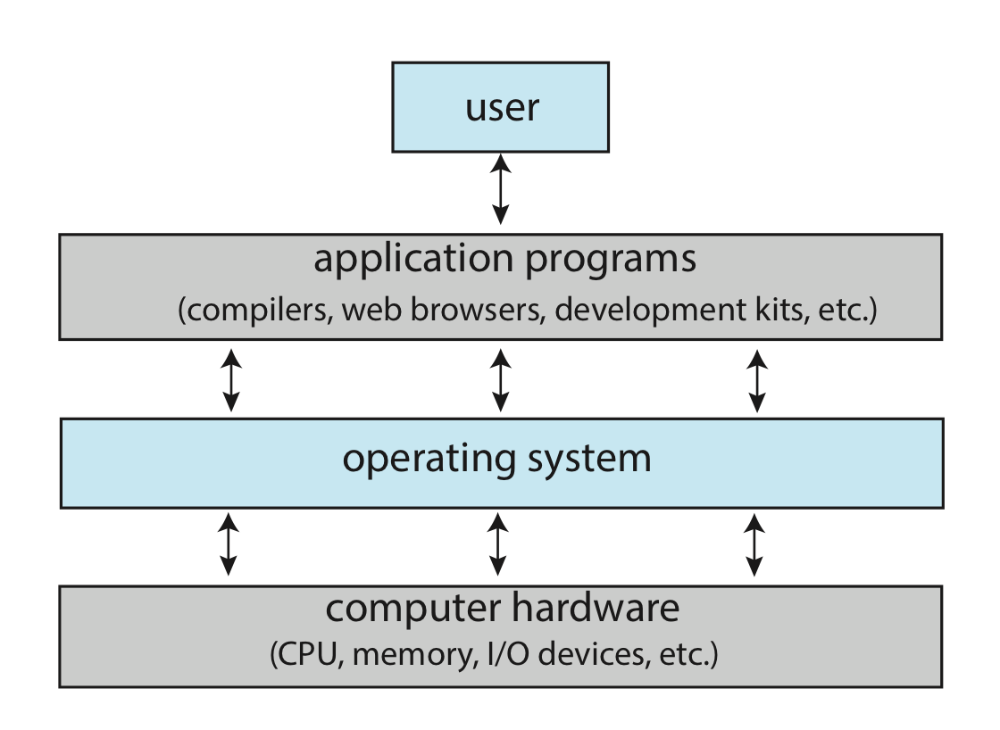
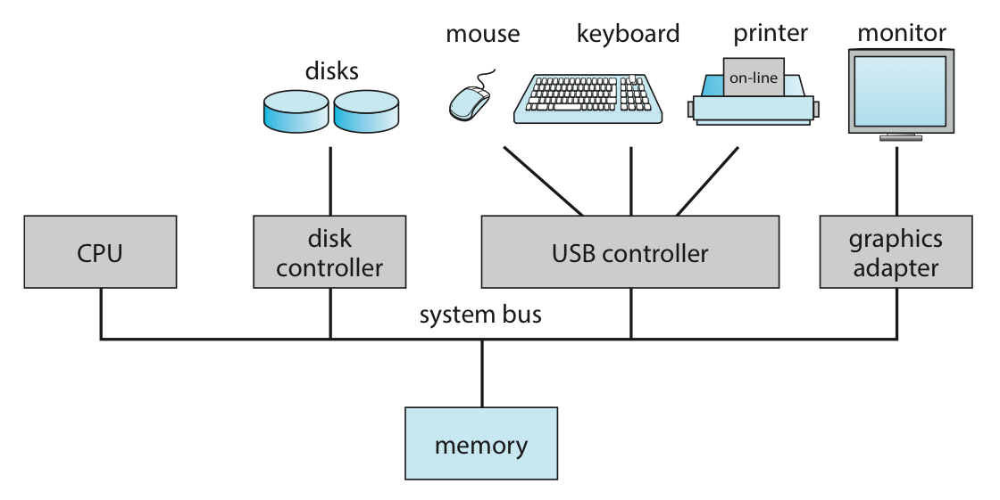
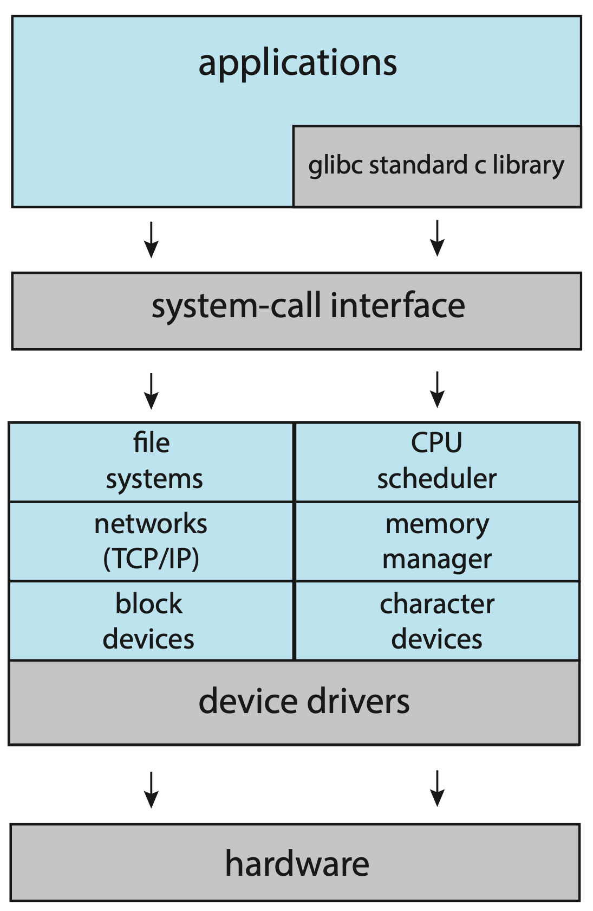
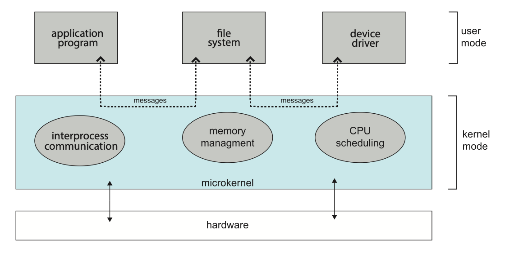
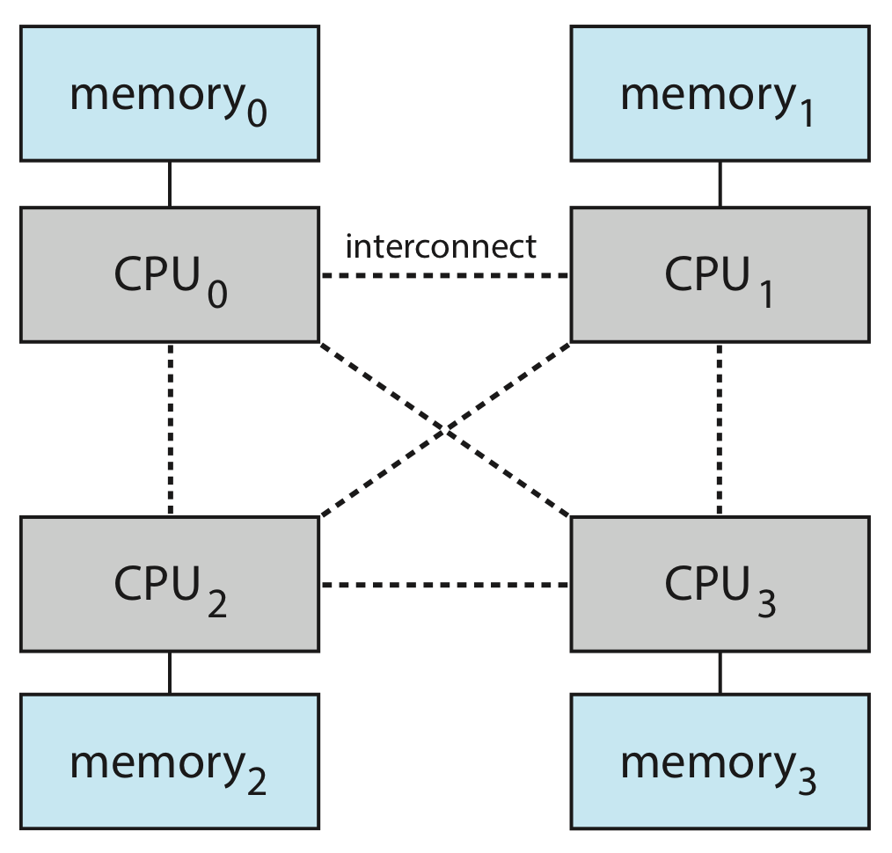
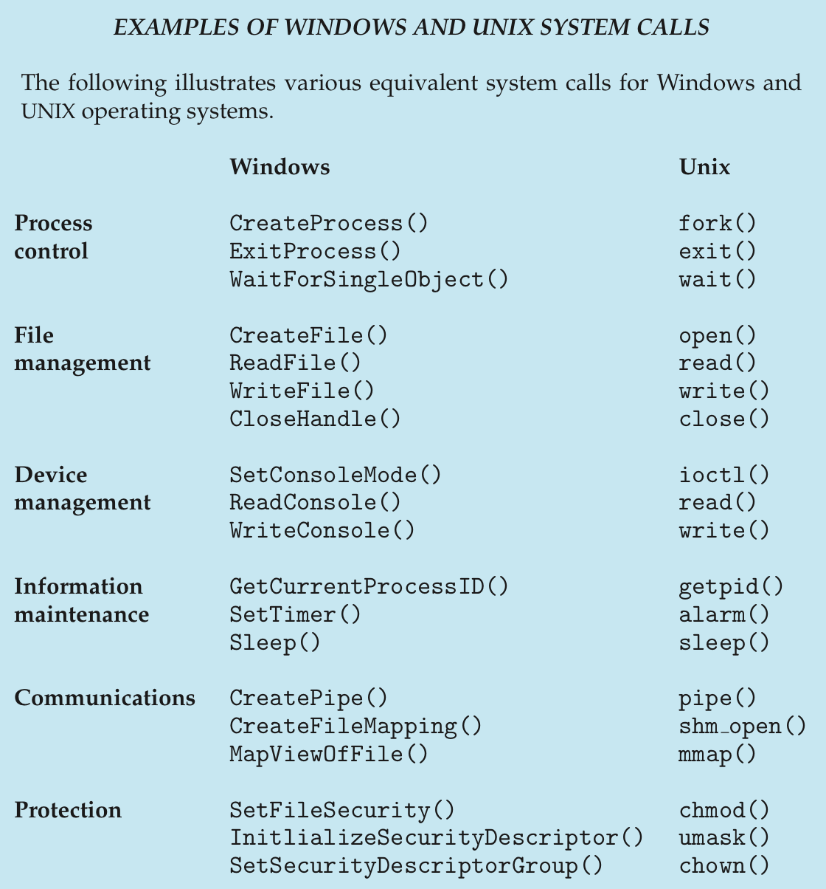
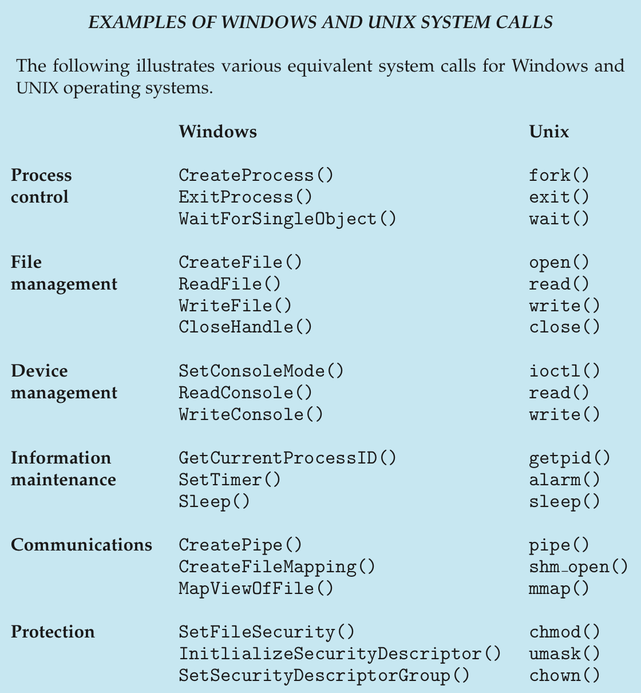

# [教学版] Unit 0: 总览 | Overview

??? info "两个任务"

    1. 对操作系统进行一个较为抽象的介绍，同时建立起整门课程的框架，方便读者在之后的学习过程中能有一个比较总体的认识，能带着目的去学习具体的知识；
    2. 介绍一些比较基础的内容，或是一些比较琐碎、仅需了解的内容；

??? key-point "“定义不存在了”"
    
    - **很多概念都很难界定一个明确的界限**。


??? info "操作系统概述"

    ??? question "何为操作系统"

        ??? definition "① 从职能上看"

            {width=60% align=right}

            - 一个词概括：**资源管理系统**；

            - 自上而下；
            - 自下而上；

            **资源**：CPU、内存、设备………
            
            - 之后将围绕要如何**维护和操作各种资源**而展开的。

        ??? definition "② 从存在上看"

            - 一个词概括：**不停运行的，用来跑软件的软件程序**（反应了操作系统为何诞生）；

            **内核(kernel)**——自计算机开机后就不停在运行（我们学的基本都是 kernel 的东西）。

        ??? section "总结"

            > The common functions of controlling and allocating resources are then brought together into one piece of software: the operating system. --*Operating System Concepts (10^th^ edition)*

    ??? question "如何评价操作系统"

        - 可靠性和安全性；
        - 易用性；
        - 高效性；
        - 公平性；
        - 可扩展性，易维护性；
        - ...

        !!! warning "注意"

            上述观点并不全面也不一定完全正确，有一大部分都是我的个人理解，请读者辨证地看待，如果有错误请务必告诉我！

??? info "操作系统的整体设计"

    ??? section "计算机系统架构"

        ??? extra "概念辨析"
            <center> <table>
                <thead> 
                    <tr>    <th>名词</th>               <th>定位</th>                      </tr> 
                </thead>
                <tbody> 
                    <tr>    <td>CPU</td>                <td>执行指令的硬件</td>             </tr> 
                    <tr>    <td>Core</td>               <td>CPU 的基础计算单元</td>         </tr>
                    <tr>    <td>Multi-core</td>         <td>一个 CPU 上有多个 core</td>     </tr> 
                    <tr>    <td>Processor</td>          <td>包含一个或多个 CPU 的芯片</td>   </tr>
                    <tr>    <td>Multi-processor</td>    <td>多个 processor</td>            </tr> 
                </tbody>
            </table> </center>

        根据处理器的数量和组织形式，我们这里介绍三种计算机系统架构：单处理器系统、多处理器系统、集群系统。

        ??? definition "① 单处理器系统(Single-Processor System)"

            有且仅有一个**通用处理器(general-purpose processor)**，并且这个 processor 只有一个核(core)。
            
            可以有若干**专用处理器(special-purpose processor)**，用来执行一些特定的指令，而这些专用处理器并不运行线程。

        ??? definition "② 多处理器系统(Multiprocessor System)"

            多处理器系统是指有多个**单核**通用处理器的系统，这些处理器共享一块主内存，它们通过总线或交换网络连接在一起。

            - 增加**吞吐量(throughput)**，但是这个增加并不是线性的；

        ??? definition "③ 集群系统(Cluster System)"

            <center> { width=60% } </center>

            - 冗余 -> 高可用；
            - 并行 -> 高性能；
            - 节点(node)通过高速通信网络互相连接形成；
            - 分**对称**和**不对称**两种；

    ??? section "操作系统的任务执行设计"

        操作系统被用来*「自动化“让计算机完成一系列特定任务”」*的，随着需求不断复杂，使用的技术也不断发展。
        
        ??? section "① 批处理系统阶段"
            
            ??? property "背景 1"
                
                人工速度严重限制了计算机的工作效率。

            ??? section "❶ 单道批处理阶段"

                两个关键词：“批处理”和“单道”。

                “批处理”指的是，系统执行的任务是**成批**的，若干任务被作为一整批交付给操作系统。在具体执行过程中，操作系统自动按顺序**串行(serial)**执行这些任务。

                而“单道”指的是，一段时间内内存中只有一道程序在运行，系统只处理一项任务，在这个任务结束之前，不会切换到其他任务。
            
            ??? property "背景 2"
                
                - 解决了背景 1：减少了人工操作速度对操作系统的影响；
                - 产生了背景 2：CPU 利用率低；

            ??? section "❷ 多道批处理阶段"
                
                关键词：“**多道(Multiprogramming)**”，即一段时间内内存中同时存在多个进程。

                不让 CPU 闲下来 -> 让它先去做下一件事。
                
                宏观并发，微观串行。（区分并发和并行！）

                我们可以用甘特图来可视化多道批处理系统的策略（一种常见的题型）。以下面的题目为例，我们来实践一下。

                ??? eg "🌰"

                    === "题面"

                        现在有两个程序 A 和 B，以及两个分别独立的设备 X 和 Y，且我们只有一个 CPU：
        
                        - A 需要顺序使用如下资源：CPU:10s, X:5s, CPU:5s, Y:10s, CPU:10s
                        - B 需要顺序使用如下资源：X:10s, CPU 10s, Y:5s, CPU:5s, Y:10s 

                        请讨论：
                        
                        1. 在单道程序环境下先执行 A 再执行 B，CPU 的利用率是多少？
                        2. 在多道程序环境下，CPU 的利用率是多少？请给出甘特图。

                    === "解析"

                        在单道程序下执行，即按顺序执行 A 和 B，CPU 的利用率即实际 CPU 使用时间除以完成任务的总时间，因此：

                        $$
                        U = \frac{(10+5+10)+(10+5)}{(10+5+5+10+10)+(10+10+5+5+10)} = \frac{40}{80} = 50\%
                        $$

                        ---

                        而在多道程序环境下，我们得到如下甘特图：


                        ```mermaid
                        gantt
                            title Multiprogramming
                            dateFormat ss
                            axisFormat %S

                            section Program A
                            CPU :a,  00,  10
                            X   :b,  10,  15
                            CPU :c,  20,  25
                            Y   :d,  25,  35
                            CPU :e,  35,  45

                            section Program B
                            X   :g,  00,  10
                            CPU :h,  10,  20
                            Y   :i,  20,  25
                            CPU :j,  25,  30
                            Y   :k,  35,  45
                        ```

                        > 由于 Mermaid 的限制，我现在是把每个程序的任务错开画的，实际上做题的时候可以直接画成两行。
                        > 
                        > 要点就是纵向不能同时出现同一个资源，例如 18s 时不能 A 和 B 都用 CPU，所以 A 需要等 B 用完 CPU 再使用。

                        现在我们再来统计 CPU 的利用率：

                        $$
                        U = \frac{10+10+5+5+10}{45} = \frac{40}{45} = 88.89\%
                        $$

                由于引入了多道技术，系统复杂程度上升。

        ??? property "背景 3"
                
            - 解决了背景 2：提高了 CPU 利用率；
            - 产生了背景 3：交互性差；
            
            > （假设我们忽略关于屏幕显示的 I/O）试想，你希望在跑程序的时候放一个视频，但是由于你的程序还没跑完，你的视频就没法播放，突然你的程序发生了一次 I/O，CPU 转而播放已经完成 I/O 后的那部分视频，但是这个时候你的程序 I/O 很快也完成了，却需要等待缓存中的视频放完才能继续执行，这种用户体验几乎无法接受。

            - 对于用户来说，最好能同时实现**体感上的并行**，也就是几件事情至少看起来要像是同时发；


        ??? section "② 分时系统阶段"
            - **分时系统(Time Sharing Systems)**是**多任务(Multitasking)**的一个具体实现；
            - Multitasking 是 Multiprogramming 的一个**逻辑**扩展；
                - Multitasking 也是 Multiprogramming 的一种，它符合内存中有多个进程，一段时间内有多个任务一起执行的特点；
            
            - 分时系统通过**频繁**地在多个进程间切换来**近似实现**并行（仍然不是真正的并行）；
                - **时间片(time slice)**；

            > [《十万个冷笑话》](https://www.youtube.com/watch?v=uD29J203FFI)的 4:09 - 4:48。

            分时用户允许多个用户同时使用同一台计算机，所有任务之间互相独立，互不干扰、互不阻塞，因此任务的最长周转时间减少，用户的操作也会被及时响应，实现了更方便进行人机对话。

    ??? section "操作系统的结构设计"

        随着操作系统的功能不断扩展、体量逐渐变大，整个操作系统软件的结构设计就越发重要了。

        <a name="mo-kernel"></a>
        ??? key-point "宏内核"

            **宏内核(Monolithic-Kernels)**也叫单内核或大内核。

            **优势**：操作系统效率极高。

            **劣势**：大量复杂的功能互相耦合 -> 维护困难、一损具损；

            <center>  </center>

        ??? section "分层设计"

            **分层设计(layer approach)**的核心思想是将系统分为若干层，底层为硬件，顶层为用户接口，第 $i$ 层只调用 $i-1$ 层提供的接口。
            
            **理想**：低耦合，阶段性开发。

            **现实**：效率低、难设计。

        <a name="mi-kernel"></a>
        ??? key-point "微内核"
            
            **微内核(Micro-Kernels)**主张将不是必要的东西都从内核里拿出去，放到用户空间，以用户态执行。
            
            整体形成一种微内核-服务器的结构，此时内核只提供通讯、内存管理、进程管理等基本功能，也只有这些部分直接运行在[内核态](#特权模式)，作为服务器的其它功能部件则通过**消息传递机制**与内核互动。

            **优势**：规模减小,耦合降低 -> 更方便维护，可靠性增加。

            **劣势**：效率低。

            <center>  </center>

        ??? section "模块化设计"

            **模块化设计(Modules Approach)**指将操作系统划分为若干分立模块，并规定模块之间的接口，甚至单个模块下也可能是由多个模块通过同样的方式组织而成的。这种设计方法也被称为模块-接口法。

            !!! warning "辨析"

                模块化的设计与[微内核](#mi-kernel)是不同的，需要注意区分。微内核设计仍然是有中心（微内核）的，但是模块化设计整体是分层网状的。

            **理想**：低耦合 -> 并行开发，好维护。

            **现实**：设计十分困难，难以递进式开发。

        ??? section "混合系统"
                
            **混合系统(Hybrid Systems)**是指将[宏内核](#mo-kernel)和[微内核](#mi-kernel)的设计思路结合起来，这种设计模式更现代，也是目前主流的操作系统的模式。

??? info "操作系统的运行原理"

    ??? key-point "中断"

        - 逻辑上的轮询不合理；
        - 实现上用“硬件轮询”来实现中断；

        !!! key-point "中断向量表"
            由于中断被广泛使用，操作系统需要频繁的处理各种中断，处理每一种中断都需要一个特定的方法，因此，一种快速定位中断处理方法的手段就显得尤为重要。
            
            中断向量表(Interrupt Vector Table)通过中断号来索引中断处理方法，实现了一种“随机访问”，大大加速了中断处理的速度。

        - **外中断**（CPU 外产生）；
        - **内中断**（CPU 内产生）。

        理想情况下，我们希望中断一旦发生就立刻被解决，但是**中断处理也同样需要资源**，这意味着中断也有可能产生冲突。于是，我们需要一系列机制来解决这些问题。

        1. 分级机制；
        2. 屏蔽机制；

        一种比较普通的设计：准备 maskable interrupt-request line 和 non-maskable interrupt-request line 两条中断请求线，前者用于可屏蔽的中断，后者用于不可屏蔽的中断。

        需要注意，操作系统发现中断后并不是二话不说马上去处理中断的，为了保证中断处理完成后仍能继续当前任务，操作系统需要保存当前任务的状态（上下文），以便完成中断处理后恢复当前任务的状态。

    ??? section "计时器"

        **计时器(timer)**：固定频率的时钟 + 计数器。

        - 时间片的长度；
        - 避免进程占用系统资源过久；
        - ...

    ??? key-point "特权模式"

        ??? key-point "隔离"
            
            操作系统的某些操作是危险的，有可能威胁到自身正常运作的（如与硬件直接相关的行为、控制 CPU 运行规则的行为等），而这些操作不应当被用户程序直接执行。
            
            一种简单的思路是，我们划分常规操作和危险操作，允许用户程序执行常规操作，而危险操作则需要委托专业人士代为执行。而这就是**特权模式(Privileged Mode)**的基本思路。

            工业上的特权模式可能会有多种复杂的实现形式，但是我们这里只讲最简单的一种，即**双模式(Dual-Mode)**。
            
            双模式下，CPU 有两种运行模式，一种是**用户态(User Mode)**（目态），一种是**内核态(Kernel Mode)**（管态，核心态）。

            同时，我们将那些“危险”的指令称为**特权指令(privileged instruction)**，例如 I/O 控制，计时器管理，中断管理等。这些指令只能在内核态下执行，而用户态下执行这些指令时会认为这条指令不存在。

        ??? bug "问题尚未解决"

            现在我们将危险操作和相对安全的操作隔离开来了，但是这并不意味着用户程序就不需要使用那些危险操作了，单纯的隔离并不能解决问题，用户程序仍然存在需要使用特权指令的需求。

        ??? key-point "隔离而非隔绝"

            这些需求往往是可以被抽象的、被封装的。
            
            - 实现方法：**让渡控制权**。

            而那么在具体实现上，这一步是通过 [trap](#中断) 实现的。

            <figure markdown>
            <center>{ width=80% }</center>
            Transition from user to kernel mode.
            </figure>

    ??? section "系统调用"

        !!! note inline end ""
            
            <figure markdown>
            <center>  </center>
            Examples of W&U system calls.
            </figure>

        **系统调用(System Call)**是系统向用户程序提供服务的一个接口，它们经常以 C/C++ 函数的形式存在，对于某些比较接近底层的任务，也可能是通过汇编编写的。

        但说到底，系统调用还是相对底层的设计，通常的开发并不基于如此底层的设计展开。更常见的是利用各种抽象层级更高的 **Application Programming Interface, API** 进行开发。

        API 由“环境”提供，也就是我们所说的**运行时环境(run-time environment, RTE)**。

        ??? eg "思考题"

            === "题面"

                辨析**库函数**与**系统调用**？

            === "解析"

                库函数运行在用户空间而系统调用运行在内核空间。大部分库函数可能使用系统调用来实现目的。

    ??? section "链接器和装载器"

        !!! note inline end ""

            <figure markdown>
            <center></center>
            The role of the linker and loader.
            </figure>

        说了这么多，那么操作系统到底是如何执行一个程序的呢？以 C 为例，一个写完的代码需要经过编译、链接、装载三个步骤，才能成为一个**在内存中**的，可以被执行的程序。

        1. 编译器首先将若干 `.c` 源文件编译为若干 `.o` 文件（这里合并了预处理、编译、汇编步骤），这些 `.o` 文件被称为可重定位目标文件(relocatable object file)，其存在形式为机器码；
        2. 随后链接器将若干 `.o` 文件连带所需要的一些库文件（如 `.a` 文件）链接为一个可执行目标文件(executable object file)；

        特别的，链接分为静态链接和动态链接两种。静态链接将库文件的代码直接合并进入最终的可执行文件，而动态链接仅仅将库文件的引用信息写入最终的可执行文件，而在程序运行时再去寻找这些库文件。

        ```bash
        gcc -E main.c -o main.i # pre-process
        gcc -S main.i -o main.s # compile to assembly code
        gcc -c main.s -o main.o # assemble to object file
        gcc main.o -o main      # link
        ./main                  # (load and) execute
        ```

        <figure markdown>
        <center>  </center>
        可以发现，动态链接得到的可执行文件比静态链接得到的可执行文件要小不少。
        </figure>
