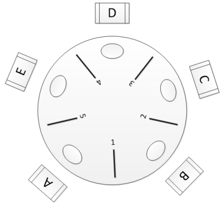

# Unit 2 Ex 1: 同步问题例子 | Synchronization Problems Examples [未完成]

## The Bounded-Buffer Problem

### 问题背景

- [🔗 Wiki](https://en.wikipedia.org/wiki/Producer%E2%80%93consumer_problem)

The Bounded-Buffer Problem 又称 The Producer–Consumer Problem，在该问题中，有两个角色，producer 和 consumer：producer 会产生 item 存放到 buffer 中，而 consumer 可以将数据从 buffer 中取出 item。如果我们用 $n = \# items$ 来描述 buffer 的状态，那么问题将**抽象**为：

```cpp
void produce() {
    /* something */
    ++n;
    /* something */
}

void consume() {
    /* something */
    --n;
    /* something */
}
```

> 同时，我们需要保证 $0 \leq n \leq n_{max}$，所以我们需要在 $n = 0$ 时，让 consumer 等待 $n > 0$ 再 `consume()`；对应的，在 $n = \leq n_{max}$ 时候，让 producer 等待 $n < n_{max}$ 再 `produce()`。但这并不是我们在本单元提及它的重点，所以我们在这里认为它们在 `/* something */` 中。
> 
> 实际的 The Bounded-Buffer Problem 中还有一些其它细节，但是这里我们将整个问题抽象为我们需要的模样，请不要认为上面的代码就是 The Bounded-Buffer Problem 的全部。

### 问题描述

考虑在并行语境下，`produce()` 和 `consume()` 同时发生，由于 `++n` 和 `--n` 这些操作本质上是数值的、需要一段时间来完成的，所以容易出现 [race condition](./Unit2.md/#race-condition){target="_blank"}问题。

## The Readers–Writers Problem

### 问题背景 & 问题描述

- [🔗 Wiki](https://en.wikipedia.org/wiki/Readers%E2%80%93writers_problem)

该问题抽象自数据库的使用。用户使用数据库修改数据（`UPDATE`），本质上也是有三个步骤：

1. [READ] 从数据库中检索、读取数据；
2. 数据经过业务逻辑的处理，得到新值；
3. [WRITE] 将新值写回数据库；

这个步骤与我们修改 `mem[x]` 的过程高度相似，因此遇到的问题也是类似的。

## The Dining Philosophers Problem

### 问题背景

- [🔗 Wiki](https://en.wikipedia.org/wiki/Dining_philosophers_problem)

在这个问题中，有五个哲学家，ta 们围坐在一张圆桌旁，每个哲学家面前都有一碗米饭，而 ta 们两两之间分别有一根筷子。

<center>  </center>

每帧哲学家都能选择执行以下两个行为之一：

1. 思考；
2. 拿筷子；

哲学家如果想要干饭就必须有两根筷子，ta 同时 拿起 ta 左右侧筷子时，才能干饭。显然，两个哲学家不能同时拿起同一根筷子；干完饭哲学家会放下筷子。~~假设哲学家们都不嫌脏。~~

### 问题描述

考虑这种情况，所有哲学家在第一帧都想要干饭，假设 ta 们都先拿起了 ta 们右手的筷子，此时我们发现，接下来谁都无法拿到第二根筷子，如果 ta 们都不主动放下筷子让别人干饭，那么 ta 们将五五饿死（死锁）。