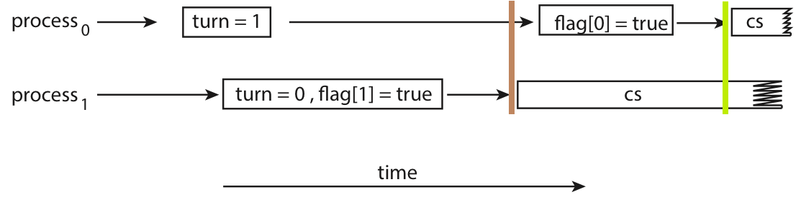

# U2 Part 1: 同步工具 | Synchronization Tools

!!! info "引入"

    > 首先我们**简单**描述什么是同步问题，读者可以抱着对下面这段话的疑问去阅读接下来的内容。
    >
    > 不必尝试立刻理解这段话，我希望读者能够在看的过程中以下面这段话为主线，猜测接下来将要展开的内容，去发现问题、思考解决办法。

    在支持并发甚至并行的系统中，虽然进程之间相对隔离，在一般情况下互不**直接**干扰，自顾自跑——即是异步的；但由于**各些原因**（例如都需要对一共享资源的修改），进程之间的执行需要互相制约，遵循特定的先后顺序，因此进程需要通过**某些手段**，让协作进程能够直接或间接了解到其它相关进程的状态，以实现对当前进程执行的控制，最终在宏观上实现同步控制。

    而上面提到的“**各种原因**”和“**某些手段**”，就是我们稍后将讨论的东西，其中，这里的“**某些手段**”，就是指我们的各种同步工具。

    需要注意的是，同步并不是某种中央调控机制，而更像是一种“协议”，当各个进程发现有别的进程与自己产生竞争时，应当有某种手段允许它们达成协商，以决定谁先谁后。
    
    我们按照问题的复杂程度，由浅入深地讨论这些东西。

!!! warning "语境问题"

    一个比较尴尬的问题是，书本上以协作进程的语境为开篇，但接下来讲的有些内容是以线程同步为语境（对于这个问题我已经放弃去梳理和纠正书中的措辞了，累了），如果在用词上都区分线程和进程，那么会变得很繁杂，所以我接下来一律用进程表示，但读者心中应当对这个语境更适于线程还是进程有所感受。
    
    关于这些方法更适合在 process 还是 thread 上被应用，可以看[这个](https://stackoverflow.com/a/4623428/22331129){target="_blank"}。

## 竞态条件

!!! quote "Links"

    - [Race Condition | Wikipedia](https://en.wikipedia.org/wiki/Race_condition){target="_blank"}

我们需要意识到，我们无法一步到位地、in-place 地去修改一个内存中的数据，换言之，要想修改 `mem[x]`，我们需要三个步骤：

1. `reg` <- `mem[x]`；
2. `reg` <- update(`reg`)；
3. `mem[x]` <- `reg`；

而如果现在不止一个进程在修改 `mem[x]`，例如下面这个例子：

```linenums="1"
┌──────────────┬──────────────┐
│ process A    │ process B    │ mem[x] = 1 (initial)
├──────────────┼──────────────┤
│ t0 <- mem[x] │ t0 <- mem[x] │ mem[x] = 1
│ t0 <- t0 + 1 │ t0 <- t0 + 1 │
│ mem[x] <- t0 │ t0 <- t0 + 1 │ mem[x] = 2, B's t0 is out of date
│              │ mem[x] <- t0 │ mem[x] = 3, 2 is overwritten
└──────────────┴──────────────┘
```

它们都想要更新 `mem[x]`，又好巧不巧的它们几乎同时发生读取了 `mem[x]`，那么就会出现问题：两个进程同时读取 `mem[x]`，然后各自计算更新后的值，然后各自写回 `mem[x]`，理想情况下，最终的 `mem[x]` 会比原来大 3，但现在的 `mem[x]` 只比原来大 2，其中 process A 对它的修改在第 7 行被覆盖了。

究其根本，由于如今我们处在并发语境下，所以会出现若干用户同时持有一份数据资源的情况（为了发挥并发的优势，我们也应当尽可能的满足这种需求），逻辑上数据修改过程应当是符号的、瞬间的、立即生效的，但实际上我们对数据的操作是数值的、需要一段时间来完成的。在这种（后者）语境下，<u>如果我们无法保证读入数值完成到写入数值完成的过程中，`mem[x]` 保持不变</u>，那么该操作实际上是使用过时数据进行计算。

```linenums="1" hl_lines="6"
┌──────────────┬──────────────┐
│ process A    │ process B    │ mem[x] = 1 (initial)
├──────────────┼──────────────┤
│ t0 <- mem[x] │ t0 <- mem[x] │ mem[x] = 1
│ t0 <- t0 + 1 │ t0 <- t0 + 1 │
│ mem[x] <- t0 │ t0 <- t0 + 1 │ mem[x] = 2, B's t0 is out of date
│              │ mem[x] <- t0 │ mem[x] = 3, 2 is overwritten
└──────────────┴──────────────┘
```

可以发现，第六行的 `t0` 仍然在用更新之前的 `mem[x]` 做计算，因而可以认为此时 process B 中的 `t0` 参与运算的、暗含的 `mem[x]` 的数据已经**过时**。

!!! definition "race condition"
    
    类似这种的，由两个信号产生竞争，其竞争情况影响最终结果的情况，被称为**竞态条件(race condition)**。在上面这个例子中，谁后执行，最终结果就是谁的输出，而另一个用户的输出则会被覆盖。

    需要注意的是，这里的重点并不是“如何控制竞争结果”，因为无论竞争结果如何（甚至谁赢了结果可能都一样），只要这种“竞争”出现，那么最终结果就有可能不符合预期的。 真正的重点应该是如何**避免这种竞争**的出现。
    
    就比如上面的例子，无论最终 `mem[x]` 是 3 还是 2 都不对，理想情况下应该是 4——无论是先进行 `+1` 还是先进行 `+2`。

!!! warning "注意"

    虽然上面的例子中我们模拟的两个程序是按照相同速度，一行一个指令执行的，但是我们在并行语境下对所有进程执行的速度不应当有所假设，即进程 A 不知道进程 B 的速度。

    不仅如此，我们也并不一定要在并行语境下讨论这个问题，在多道语境下这个问题都会出现，例如：

    ```linenums="1"
    ┌──────────────┐     ┌──────────────┐
    │ process A    │     │ process B    │ mem[x] = 1 (initial)
    ├──────────────┤     ├──────────────┤
    │              │     │ t0 <- mem[x] │ mem[x] = 1
    │ t0 <- mem[x] │◄────┤ <ctx switch> │ mem[x] = 1
    │ t0 <- t0 + 1 │     │              │
    │ mem[x] <- t0 │     │              │ mem[x] = 2, B's t0 is out of date
    │ <ctx switch> ├────►│ t0 <- t0 + 1 │
    │              │     │ t0 <- t0 + 1 │ 
    │              │     │ mem[x] <- t0 │ mem[x] = 3, 2 is overwritten
    └──────────────┘     └──────────────┘
    ```

    问题依旧。

根据上面这个具体的例子，我们发现，如果需要解决这个问题，我们有两种选择：

1. 进行符号的运算而非数值的运算，这样输入的变化能在任意时刻反映在输出上，这样时时刻刻都是“最新”，而不会出现“过时”；
2. 保证读入数值完成到写入数值完成的过程中，`mem[x]` 保持不变，即两个可能竞争的操作，在时间上不应该有交集；

显然，我们应当选择第二种。

## The Critical-Section Problem

为了更好地展开，我们对上面的这种情况进行建模，并给出解决 race condition 问题的方法需要满足的范式：

我们应当保证在一个进程在修改 `mem[x]` 的时候，其它进程不应该读取 `mem[x]`（至少不应以修改 `mem[x]` 为目的来读取），直到这个进程完成了对 `mem[x]` 的修改。换句话来说，`mem[x]` 这个共享资源应当只能被一个用户持有，我们称这种只能被至多一个用户占有的资源为临界资源。而程序中访问临界资源的代码段，我们称之为**临界区段(critical section, CS)[🔗](https://en.wikipedia.org/wiki/Critical_section){target="_blank"}**。

那么，对于之前提到过的例子，我们拿出来对比模拟的部分就是 critical section。

而 CS 问题，指的就是<u>如何保证最多只有一个用户在执行临界区段的代码</u>[^1]。

---

围绕临界区段，我们定义能够解决 CS 问题的代码应当能够做如下划分：

```
┌─────────────────────┐
│  Entry Section      │ <-- ask for & wait for permission to enter CS
├─────────────────────┤
│  Critical Section   │ <-- codes manipulating critical resources
├─────────────────────┤
│  Exit Section       │ <-- release the critical resources
├─────────────────────┤
│  Remainder Section  │ <-- other codes
└─────────────────────┘
```

进程需要在 entry section 判断是否能够进入 critical section，即索取临界资源，如果不行则等待；而在进入 critical section 后，进程需要在 exit section 释放临界资源；然后脱离 CS 问题的语境，进入 remainder section 继续执行。

!!! tip "Brainstorming"

    整个过程有点像[调度](./Unit1.md/#进程调度){target="_bank"}，等待临界资源的过程就好像 ready 态等待调度过程中的 CPU 资源（CPU 也可以认为是一种临界资源，只不过它不是由进程主动处理和索取）。

    既然如此我们可以迁移“状态”这个概念。我们只关心直接与 CS 问题有关的状态，所以我在这里定义：就绪、临界、无关三个状态。

    1. 就绪态：进程随时准备好进入 critical section，<u>**想要**持有临界资源</u>；
    2. 临界态：进程正在执行 critical section，<u>**持有**临界资源</u>，或进程执行完 critical section，执行 exit section <u>正在释放**持有**的临界资源中</u>；
    3. 无关态：不处于就绪态也不处于临界态，不想要持有临界资源，或是使用完已经释放；

    根据我们先前给出的，解法[需要满足的性质](#r4s2csp){target="_blank"}中的 mutual exclusion，不能同时有多个进程处于临界态，但是可以有若干进程处于就绪态，而无关态则表示不会产生竞争，和调度过程十分相似。

    这些定义将会在我们之后的探索中起作用。

同时，我们要求解决方案需要满足如下性质：

<a id="r4s2csp"></a>
!!! definition "requirements for solution to CS problem"

    1. 临界互斥(mutual exclusion)：操作同一临界资源的临界区段应当互相排斥；
        - 如果进程 $P_i$ 正在执行其 critical section，那么不应当有其他进程处于（操作同一临界资源的）critical section；
    2. 选择时间有限(progress)：选择下一个进入 critical section 的操作应当只有处于 entry/critical/exit section 的进程参与，且该选择应当在**有限时间内被执行**；
    3. 等待时间有限(bounded waiting)：进程等待被允许进入 critical section 的时间应当是有限的；

接下来，我们以讨论 CS 问题是如何解决的为主线，探索如何解决 race condition。

## For Kernel Code

由于 kernel code 下的 CS 问题解决较为清晰直接，所以先行介绍。

!!! section "For Kernel Code"

    在 kernel code 中也普遍存在着 race condition 的问题，例如：

    <figure markdown>
    <center>  </center>
    Race condition when assigning a pid.
    </figure>

    上例中 $P_0$ 和 $P_1$ 同时访问了 `next_available_pid` 这个临界资源，产生竞争，导致最后有两个进程使用了同一个 `pid`。

    欲解决 kernel code 中的 CS 问题，我们可以保证只有一个进程可以运行在 kernel mode，这样就可以保证在 kernel code 中访问临界资源的行为，从而解决 CS 问题。

    对于单处理器来说，我们只需要在 kernel code 中禁止中断，就可以保证只有一个进程可以运行在 kernel mode；而对于多处理器来说，这种方法就不那么合适了——我们需要同时告诉多个处理器中断被禁止，而这个过程中的时延仍然会产生问题；不仅如此，这个方法也会带来额外的开销。在多处理器语境下，我们需要实现**抢占式内核(preemptive kernels)**和**非抢占式内核(non-preemptive kernels)**，关键是后者实现了一段时间内只有一个进程可以运行在 kernel mode[^2]。

接下来我们探索更为通用的解决方案。

!!! info "说明"

    为了简化说明代码，我们用全大写来表示一个共享资源，例如 `READY`，它能够被若干进程访问。实际上这个功能应当由操作系统提供，并不是我们关注的重点。

### Peterson’s Algorithm

!!! quote "Links"

    - [Peterson's algorithm | Wikipedia](https://en.wikipedia.org/wiki/Peterson%27s_algorithm)

Peterson's algorithm 是对**只有两个进程参与**的同步问题的一个解法，具有一定的局限性，但其设计相对简单，所以先行给出。在本节中，我们假设 $P_0$ 和 $P_1$ 是参与同步问题讨论的两个进程。

> 基于 Peterson's algorithm 对多进程情况的扩展被称为 [filter algorithm](https://en.wikipedia.org/wiki/Peterson%27s_algorithm#Filter_algorithm:_Peterson's_algorithm_for_more_than_two_processes){target="_blank"}，但 filter algorithm 不满足 bounded waiting time 的条件，读者有兴趣可以自行了解。

### 算法描述

为了保证处于临界态的进程至多只有一个，我们应当在进程处于就绪态时，确认没有其他进程处于临界态后再进入。其中最重要的一件事就是，当我们处在 $P_0$ 时，我们如何知道 $P_1$ 是否正处于临界态呢？Peterson’s Algorithm 通过如下方式实现了这件事：

```cpp linenums="1"
// `i` is 0 or 1, indicating current pid, while `j` is another pid.
process(i) {
    j = 1 - i;

    READY[i] = true;                    // ┐
    TURN = j;                           // │
    while (READY[j] && TURN == j) {}    // ├ entry section
        // i.e. wait until:             // │
        //  (1) j exits,                // │
        //  (2) j is slower, so it      // │
        //      should run now.         // ┘

    /* operate critical resources */    // - critical section

    READY[i] = false;                   // - exit section

    /* other things */                  // - remainder section
}
```

首先，我们说明 entry section 没有临界资源。`READY` 是一个共享的数组，每个进程只修改与自己一一对应的 element，所以本质上 `READY` 不会出现 race condition，因而也不是临界资源。而 `TURN`，我们这里只对 `TURN` 进行写的操作，但是 P1 和 P2 谁先跑到这一行会决定 `TURN` 最后的值，所以实际上这里有 race condition。

但这就是 Peterson’s Algorithm 巧妙的地方，Peterson's 利用 race condition 这个“后覆盖前”的性质，实现了标记了这两个进程的先来后到的效果。我们都向这个 `TURN` 写一个互异的值（比如自己的 id，或者对方的 id），等大家都写好后我们看看这个值最终是谁写的，于是就知道谁后到。

利用这个原理，Peterson's 这里做了一个“非常有中国人气质”的事情：$P_0$ 和 $P_1$ 上公交车后同时看上了一个座位，$P_0$ 说：“你坐吧。”， $P_1$ 自然也要客气一下，说：“还是你坐吧！”。现在两边都客气过了，$P_0$ 就可以心安理得地坐下了。对上述过程，我们给出 $P_0$ 获得椅子的准确条件有：

1. $P_0$ 想坐下，$P_1$ 也想坐下，否则就没有冲突了；
2. $P_0$ 发现 $P_1$ 在客气，但 $P_0$ **已经**客气过了；

对应到上面给出的代码里，这个条件可以翻译为：

1. `#!cpp READY[0]` = `#!cpp READY[1]` = `#!cpp true`；
2. `#!cpp TURN` ≠ `j`，但此前 $P_i$ 已经执行过 `TURN <- j`；

!!! advice "请读者仔细思考上面的过程，并适当进行全面的模拟以理解 Peterson's 是如何工作的。"

### 性质证明

现在我们需要证明这个算法满足[性质](#r4s2csp){target="_blank"}。

> 我的证明比较详细和啰嗦，但我认为完整地模拟更加有利于直觉理解，如果你想要更简洁的证明，可以参考 [xyx 的笔记](https://xuan-insr.github.io/%E6%A0%B8%E5%BF%83%E7%9F%A5%E8%AF%86/os/III_process_sync/6_sync_tools/#%E6%80%A7%E8%B4%A8%E8%AF%81%E6%98%8E){target="_blank"}。

??? proof "mutual exclusion"

    ```cpp linenums="1" hl_lines="7"
    // `i` is 0 or 1, indicating current pid, while `j` is another pid.
    process(i) {
        j = 1 - i;

        READY[i] = true;                    // ┐
        TURN = j;                           // │
        while (READY[j] && TURN == j) {}    // ├ entry section
            // i.e. wait until:             // │
            //  (1) j exits,                // │
            //  (2) j is slower, so it      // │
            //      should run now.         // ┘

        /* operate critical resources */    // - critical section

        READY[i] = false;                   // - exit section

        /* other things */                  // - remainder section
    }
    ```

    !!! property "lemma"

        如果此时 i 和 j 同处于第 7 行，那么显然：
        
        1. 两个进程都想要进入 critical section，即 `READY[i]` 和 `READY[j]` 都为 `#!cpp true`；
        2. `TURN` 的值不再会被更改；
        3. 两个进程都尚未进入 critical section；
        
        由于 `TURN` 必定也只能为 i 或 j，所以 i 和 j 必然有且仅有一个进程接下来会 break loop 并进入 critical section，在它结束之前，即在 `READY[?]` 被改变之前，该条件持续成立。

        因此我们得到一个结论：如果此时 i 和 j 同处于第七行，那么从该时刻开始，到两个进程都离开 critical section 为止，互斥性质都成立。

    现在我们考虑 i 已经先行运行到第 7 行，而 j 还没运行到第 7 行：

    !!! section "Situation 1"
        
        如果 j 还没进入第 5 行，那么 `READY[j]` 为 `#!cpp false`，此时没有竞争，i 可以直接进入临界态。并且 j 之后运行到第 7 行时，`TURN == <another>` 始终成立。所以 j 何时进入 critical section 完全取决于 `READY[j]`，即 j 何时离开 critical section。

        显然，此时满足互斥性质。

    !!! section "Situation 2"

        如果 j 已经运行完第 5 行，还没执行第 6 行，那么对于 i 来说，`#!cpp (READY[j] && TURN == j)` 为 `#!cpp true`，此时 i 将等待 j，进入 Situation 3。

    也就是说，要么 i 和 j 不竞争，要么两者都运行到第 7 行后才会有进程进入 critical section

    > 这就好像两者在第 6 行比谁先举手，然后等两者都举过手（都跑完第 6 行，到达第 7 行）后，再判断谁进入 critical section，而进入第 7 行以后所有的判断条件都是相对静止的、不会再被修改的，因而避免甚至利用了 race condition 对 selection 的影响，保证了互斥的性质。

??? proof "progress"
    
    这条性质的成立比较符合直觉，唯一需要说明的就是不会出现两个进程同时在 `while ()` 被阻塞住的情况。但是这点非常显然，`#!cpp TURN == i && TURN == j` 必然是 false，所以两个循环总有一个会被 break。

??? proof "bounded waiting time"

    在 Peterson's 中，等待时间主要指这部分的运行时间，尤其指第七行的 `while` 循环。

    ```cpp linenums="1" hl_lines="5-7"
    // `i` is 0 or 1, indicating current pid, while `j` is another pid.
    process(i) {
        j = 1 - i;

        READY[i] = true;                    // ┐
        TURN = j;                           // │
        while (READY[j] && TURN == j) {}    // ├ entry section
            // i.e. wait until:             // │
            //  (1) j exits,                // │
            //  (2) j is slower, so it      // │
            //      should run now.         // ┘

        /* operate critical resources */    // - critical section

        READY[i] = false;                   // - exit section

        /* other things */                  // - remainder section
    }
    ```

    我们可以发现，不断循环的条件是：`#!cpp READY[j] && TURN == j`，如果该循环一开始就不成立，那么显然是符合 bounded waiting time 的，所以我们考虑这个条件最多能持续多久。

    !!! section "A. `#!cpp READY[j]` 为 `#!cpp true`"

        这需要 process j 已经运行过第 5 行，并且还没运行第 15 行，即 process j 也**想要**进入临界态。

        这一条是在判断是否有冲突存在，如现在只有 process i 想要进入临界态，那无需等待直接进入即可。通过**改变这个条件**而进入临界态有两种可能：

        1. 一开始冲突就不存在；
        2. process j 刚离开临界态，释放了临界资源；
        
    !!! section "B. `#!cpp TURN == j` 为 `#!cpp true`"

        有两种可能：
            
        3. process j 还没运行第 6 行；
        4. process j 在 process i 之前就运行了第 6 行；

        对于第一种情况，由于 A. 成立后才会判断这条，所以 process j 的状态其实是刚运行完第 5 行还没运行完第 6 行，显然这个时间是有界的。

        而对于第二种情况，说明 i 是后来者，j 已经客气过一次了，所以应当让 j 运行，i 等待 j 离开临界态释放资源，此时通过 A.2. 来进入临界态。而 process j 操作临界资源的时间也应当有限的。

    综上所述，waiting time 的最大值基本上取自：

    1. process j 执行第 6 行的时间；
    2. process j 操作临界资源的时间；

    通过之前的论述我们知道，这两个都是有界的，于是该性质得证。

!!! bug "Oops!"

    但是，**Peterson's 实际上无法适用于现代计算机中**。上述做法有一个关键，也是我们在证明过程中一直默认成立的事情：进程总是先执行 `READY[i] = true;`，然后才会执行 `TURN = j;`，即先进入就绪态，再索取临界资源，这看起来是个非常合理的条件。但在现代计算机中，编译器可能会通过重排列部分语句来更好地利用 CPU 资源（参考计组的[各种竞争](https://xuan-insr.github.io/computer_organization/4_processor/#422-structure-hazards){target="_blank"}）。而**对编译器来说**，这两个操作（就绪和请求）并没有操作相同内容，因而交换顺序是不会影响结果的，所以可能被编译器交换。而这就有可能导致出现问题，例如：

    <figure markdown>
    <center>  </center>
    The effects of instruction reordering in Peterson’s solution.
    </figure>

    在棕色标记时刻，process 1 进行 `while` 循环判断，发现 `READY[0]` 为 `#!cpp false`，但此时 `TURN` 指向对方，所以按照我们先前的分析，此时 process 1 会认为 process 0 是已经运行完 critical section，已经释放了临界资源，所以进入临界态；然而，在绿色标记时刻，对于 process 0，此时 `TURN` 指向自己，process 1 还没运行完所以 `READY[1]` 还是 `#!cpp true`，根据我们之前的分析，此时 process 0 会认为 process 1 在等待自己，所以也进入了临界态。于是，两个进程同时进入了临界态，违反了 mutual exclusion 的性质。

所以，实际上 Peterson's Algorithm 仍然没有解决问题。

## Memory Barriers

该方法实际上是对软件方法的补足。我们先前提到，Peterson's Algorithm 失效的原因是编译器会根据需求重排列一些内存操作，而 memory barriers 保证 barrier 之前的 S/L 指令必须在 barrier 之后的 S/L 指令之前完成，使我们能够主动禁止编译器做这种重排。

```cpp linenums="1" hl_lines="6"
// `i` is 0 or 1, indicating current pid, while `j` is another pid.
process(i) {
    j = 1 - i;

    READY[i] = true;                    // ┐
    memory_barrier();                   // │
    TURN = j;                           // │
    while (READY[j] && TURN == j) {}    // ├ entry section
        // i.e. wait until:             // │
        //  (1) j exits,                // │
        //  (2) j is slower, so it      // │
        //      should run now.         // ┘

    /* operate critical resources */    // - critical section

    READY[i] = false;                   // - exit section

    /* other things */                  // - remainder section
}
```

---

!!! definition "Memory Model"

    不同的计算机架构可能会对用户程序操作内存的保证有所不同，这种保证被称为 memory model。我们可以将它分为两大类：

    1. 强有序(strongly ordered)：进程对内存做的修改立刻对其它处理器可见；
    2. 弱有序(weakly ordered)：进程对内存做的修改不立刻对其它处理器可见；

    我们知道，为了提高内存操作的效率，我们引入了 cache，在多处理器情况下，cache 机制的存在可能导致进程 A 对内存的写无法对进程 B 立刻可见，这就是弱有序的一种体现。

> 这部分我没有完全搞清楚，书本的逻辑非常的诡异：书本认为 memory barrier 是弱有序问题的解决方案，但是我始终没明白它们之间的逻辑在哪里，以及“有序”和“立刻可见”的根本联系在哪里。这里一定是存在不清楚的地方的。但是这部分看起来不是很重要，所以我就先放着不管了。

## Hardware Instructions

讨论 Peterson's Algorithm 后我们应当意识到，同步问题的出现是 ❶ 硬件操作数据需要时间，与 ❷ 数据具有共享性的不协调，所以本质上是硬件产生的问题。因而，要想更好的解决问题，我们还是应当从硬件出发。我们在这里引入**原子性(atomic)**这个概念，它的基本逻辑是让“需要时间的，对数据的操作”，变成一个“在时间上不可分割、不可被打断的，即原子性的操作”。不同硬件可能提供不同的原子性操作，我们这里将它们抽象为 `test_and_set()` 和 `compare_and_swap()` 两类来介绍。

### `test_and_set()`

!!! quote "Links"

    - [Wikipedia](https://en.wikipedia.org/wiki/Test-and-set){target="_blank"}

```cpp
<atomic> test_and_set(bool * target) {
    bool ret = *target;
    *target = true;
    return ret;
}
```

该指令的功能就类似上面这段代码：将目标设为 `#!cpp true`，同时返回其旧值。但除此之外，这个指令需要保证**原子性**，即如果有若干 `test_and_set()` 同时发生，那么无论并发还是并行，它们都应当一个一个地执行，而不能产生时间上的交集。

可以发现，这种 atomic 的操作天然保证了 mutual exclusion，因而对于实现了 `test_and_set()` 的机器，我们可以使用 `test_and_set()` 来解决 CS 问题。

```cpp linenums="1" hl_lines="2"
process(i) {
    while ( test_and_set(&LOCK) ) {}    // - entry section

    /* operate critical resources */    // - critical section

    LOCK = false;                       // - exit section

    /* other things */                  // - remainder section
}
```

在第 3 行，循环等待的条件变为 `#!cpp test_and_set(&LOCK)`，如果 `LOCK` 的旧值是 `#!cpp false`，则可以继续，并且此时 `LOCK` 的值被原子性地修改为 `#!cpp true`；而如果 `LOCK` 的旧值是 `#!cpp true`，那么它经过 `#!cpp test_and_set(&LOCK)` 后的值仍然是 `#!cpp true`，且需要等待，直到：将 `LOCK` 改成 `#!cpp true` 的那个进程在 exit section 将 `LOCK` 改回 `#!cpp false`，即释放锁。

但是请注意，与我们讨论 Peterson's Algorithm 时的语境不同，我们现在不再假设参与竞争的进程只有两个（这是 Peterson's 的局限性之一）。在这个语境下，我们再来考虑它是否满足[三条性质](#r4s2csp){target="_blank"}。

!!! proof "mutual exclusion"

    由于 `#!cpp test_and_set()` 是原子性的，所以同时执行的一系列 `#!cpp test_and_set()` 中，只有一个能返回 `#!cpp false`，即只有一个能通过锁，因而天生满足了 mutual exclusion。

!!! proof "progress"

    代码中对 `LOCK` 的修改操作是闭合的，即进入 critical section 会导致 `LOCK` 变为 `#!cpp false`，但离开 critical section 必定导致 `LOCK` 变为 true。因此，只要没有进程处于 critical section，那么 `LOCK` 必定为 `#!cpp false`，则一定有就绪的进程能够进入 critical section，而运行 critical section 的时间是有限的，因此 `LOCK` 又一定会在有限时间内变为 `#!cpp false`，从而满足 progress。

!!! bug "bounded waiting time"

    如果只有两个进程参与竞争，那么通过类似证明 progress 的过程可以得到 bounded waiting time 是可以成立的。A 离开临界态后处于就绪态等待的 B 立刻就能进入 critical section，即只有两个人排队是不会被插队的。

    但在参与竞争的进程变多以后，就很有可能出现类似于调度中“饥饿”的现象：

    ```
        ┌────┐      ┌────┐      ┌────┐      ┌────┐      
    P0  │ CS │   ───┤ CS │   ───┤ CS │   ───┤ CS │   ─── ···
        └────┘      └────┘      └────┘      └────┘      
              ┌────┐      ┌────┐      ┌────┐      ┌────┐
    P1  ──────┤ CS │   ───┤ CS │   ───┤ CS │   ───┤ CS │ ···
              └────┘      └────┘      └────┘      └────┘

    P2  ──────────────────────────────────────────────── ···

    ```

    可以发现，由于 `P0` 和 `P1` 总是轮流获得锁，导致 `P2` 始终处于就绪态等待锁，因而对于 `P2` 来说 waiting time 就不再有限了。

糟了，看起来很酷的一个方法貌似不能满足 CS 解法的性质，但仔细分析，这是由于锁的分配机制是不可控的——在一个锁被释放后，接下来将拿到锁的进程应当是接下来第一个实际执行 `test_and_set()` 的进程，然而由于 ❶ 我们对每个进程的运行速度，不应当有假设，❷ 我们对同时产生的 `test_and_set()` 将按何顺序被处理，不应当有假设，所以我们必须手动用某种方法来实现这种“锁的调度”：

```cpp linenums="1"
// `i` is process id in [0, n), where `n` is the count of related process. 
process(i) {
    WAITING[i] = true;                                  // ┐
    while ( WAITING[i] && test_and_set(&LOCK) ) {}      // ├ entry sec.
                                                        // │
    WAITING[i] = false;                                 // ┘

    /* operate critical resources */                    // - critical sec.

    // i.e. find next waiting process j                 // ┐
    j = (i + 1) % n;                                    // │
    while (i != j && !WAITING[j]) {                     // ├ exit sec.
        j = (i + 1) % n;                                // │
    }                                                   // │
    // release j's LOCK or release whole LOCK           // │
    if (i == j)     LOCK = false;                       // │
    else            WAITING[j] = false;                 // ┘

    /* other things */                                  // - remainder sec.
}
```

我们引入了一个 `#!cpp WAITING[]` 数组来辅助 `LOCK` 细化锁的粒度，此时 `LOCK` 表示的“是否存在竞争”，而 `#!cpp WAITING[]` 则标识了所有正在等待的进程。区别于之前直接释放整个锁，让剩下的进程去“拼手速”，我们这次由释放锁的进程来选择下一个进入 critical section 的是谁。

在 11-14 行，通过一个循环找到下一个 `#!cpp WAITING[j]` 为 `#!cpp true` 的 j，❶ 如果找到了这个 j，那么就将 `#! WAITING[j]` 设为 `#!cpp false`（19 行），这样 j 马上就会在第 4 行 break，进入 critical section；❷ 而如果找不到这个 j，即找了一圈又找回了 i，那么说明 i 是最后一个了，所以可以直接释放整个锁（17 行）。

通过使用这种方法，我们保证了等待中的进程最多只需要等待 n-1 个进程运行完 critical section（类似于实现了“FCFS”）。

### `compare_and_swap()`

!!! quote "Links"

    - [Wikipedia](https://en.wikipedia.org/wiki/Compare-and-swap)

`compare_and_swap()` 也被简写为 CAS 指令，它的功能如下：

```cpp linenums="1"
<atomic> compare_and_swap(int * target, int expected, int new_val) {
    int ret = *target;

    // *target = (*target == expected) ? new_val : *target;
    if (*target == expected) {
        *target = new_val;
    }

    return ret;
}

```

CAS 接受三个值：

1. `target` 待修改的数据的地址；
2. `expected` 预期中待修改的数据的旧值；
3. `new_val` 希望将数据修改为的新值；

而当且仅当 `*target` 符合预期，与 `expected` 相同时候，才会将它改为 `new_val`。同样，CAS 也应当保证原子性，即若干 CAS 同时发生时，也应当一个一个的执行，而不能存在时间上的交集。

我们注意到，实际上 `#!cpp test_and_set(target)` 就是 `#!cpp compare_and_swap(target, false, true)`，因而实际上 CAS 解决 CS 问题的方法以及问题和上一节的内容没什么差别。

但是我们发现，`compare_and_swap()` 相比于 `test_and_set()`，显然有更大的操作空间，也更泛用，考虑到 CAS 指令自身已经能够支持原子性的修改值，我们考虑能否跳出 CS 问题的范式来考虑问题。

## Atomic Variables

**原子变量(atomic variables)**是一种用原子性操作维护的变量。我们所有对原子变量的操作可以通过 CAS 来实现，例如自增操作：

```cpp
increment(atomic_int * v) {
    int tmp;
    do {
        tmp = *v;
    } while ( tmp != compare_and_swap(v, tmp, tmp+1) );
}
```

使用 atomic variables 后实际上就**不太符合 CS 问题的模型**了，可以发现，这里并不再需要维护类似 `LOCK` 的东西，而是以 `*target` 是否符合 `expected` 的预设来判断是否有竞争出现，作为一个同步工具，我们可以直接使用这种封装后的原子性操作来解决 race condition，而不需要再区分 entry section 或是 critical section 等。

> 书本上特地提到，在例如 producer&consumer 的模型中，使用 atomic variables 维护 count 并不能解决 race condition，但我认为这种讨论是有失偏颇的，所谓的“原子性”应该包括所有操作临界资源的部分，书中只维护 count 不维护 buffer 的假设我觉得对于 atomic 这个概念来说实在不够公平。所以我在这里就不着重说明这个问题。

## Mutex Locks

由此我们已经得到了能在硬件层面解决 race condition 问题的根源的工具了，但是为了能让用户程序也能更好的使用，我们需要将它做一次软件层面的封装。于是，我们设计了**互斥锁(mutex locks)**这个东西。

利用互斥锁避免 race condition 的基本思路仍然是基于 CS 问题的建模，但它更具体地认为在 entry section 就该去索取互斥锁，而在 exit section 就应该去释放互斥锁，即：

```
┌─────────────────────┐
│  Acquire Lock       │
├─────────────────────┤
│  Critical Section   │ <-- codes manipulating critical resources
├─────────────────────┤
│  Release Lock       │
├─────────────────────┤
│  Remainder Section  │ <-- other codes
└─────────────────────┘
```

回顾我们在介绍 [`test_and_set()`](#test_and_set){target="_blank"} 部分给出的这段代码：

```cpp linenums="1" hl_lines="2 6"
process(i) {
    while ( test_and_set(&LOCK) ) {}    // - entry section

    /* operate critical resources */    // - critical section

    LOCK = false;                       // - exit section

    /* other things */                  // - remainder section
}
```

我们只需要将高亮的这两行封装起来，就实现了 acquire LOCK 和 release LOCK。

```cpp
// `available` means whether the `LOCK` is free, or whether the related resources is available
acquire() {
    while ( !compare_and_swap(&available, true, false) ) {}
}

release() {
    available = true;
}
```

> 你可能注意到了，我们在 [`test_and_set()`](#test_and_set){target="_blank"} 讨论上面那段代码的时候，讨论过它无法满足 bounded waiting time 的问题，那既然如此我们为什么不把 `WAITING[]` 也一起封进去呢？
> 
> 这是因为书上直接忽略了这个问题，直到在之后讲 [semaphores](#semaphores){target="_blank"} 的时候才想起来，但 semaphores 和 mutex lock 又是两个路子，我也不知道它到底想说明什么问题。但是既然它现在忽略了，我们就先不管它，但是我希望读者能意识到这个问题是存在的。

经过这么长的铺垫，我们现在能够保证的一件事是，我们终于得到了一个软件层面的、能够避免 race condition 的同步工具。那么实现基本需求以后我们就开始考虑能不能优化它。

### 忙等待

如果读者对代码有比较敏感的嗅觉，那可能看这几千个字到现在，你已经为数不清的 `while()` 提心吊胆过十多次了。没错，虽然我们通过逻辑保证这里不会出现死循环，但对于等待中的 process，确实要在数不尽的 `while` loop 中浪费 CPU，我们称这种等待锁释放的行为为**忙等待(busy waiting)**，其中“忙”指的就是在等待过程中仍然占用 CPU 资源。而这种使用忙等待的互斥锁，也被称为**[自旋锁(spinLOCK)](https://en.wikipedia.org/wiki/SpinLOCK){target="_blank"}**。

我们引入两个词来更准确的描述这件事：

!!! definition "Lock Contention"

    如果一个用户试图索取某个锁时，如果这个锁不是 available 的，这就意味着有用户正在使用这个锁，而当前用户需要等待这个锁重新可用，此时我们称这个锁是**被争抢的(contended)**；反之，如果不存在争抢，我们就称之为不被争抢的(uncontended)。

    如果现在有好多用户都在争抢一个锁，我们称之为 high contention；反之如果只有零星几个用户在争抢这个锁，我们称之为 low contention。

    如果延用 spinLOCK，那么不难得到结论：high contention 会导致严重的性能问题，因为总是会有大量得不到锁的用户处于 busy waiting 中。

既然它们都是在做无意义的等待，那我们为什么不在这个时候把资源让给有需要的人呢？

我们可以通过暂时地切换进程，让这些处于等待的用户暂时休眠，等时机到来再唤醒它们，此时就需要系统调用的介入[^3]。而具体的方法我们在下一节的[避免忙等待](#避免忙等待){target="_blank"}中介绍。

**但是**请注意，我们在这里需要保持客观：spinLOCK 在特定情况下是有好处的，在等待时间并不长的情况下，相比于拥有锁的用户释放锁，进行调度锁需要的 context switch 的开销可能显得较大，在这种情况下我们还没来得及把资源让给别人锁就好了，那么这种资源转让还不如不转。而事实上，在特定情况下，自旋锁也确实是一些多核系统的首选。

不过在许多语境里 mutex 和 spinLOCK 是区分开来的两个概念，具体使用哪个则需要适时判断[^4]。

## Semaphores

!!! quote "Links"

    - [Wikipedia](https://en.wikipedia.org/wiki/Semaphore_(programming)){target="_blank"}

Mutex LOCK 为用户程序提供了类似于“房间申请”的功能，锁竞争就好像大家抢房间的使用权。而**信号量(semaphores)**则是类似于我们之前提到过的 [atomic variables](#atomic-variables){target="_blank"}，通过提供标准化的原子性操作，来维护一些变量，只不过它额外对变量的值有一定的约束。

~~（说实话我感觉这俩东西本质上真没啥区别……）~~

Semaphores 只提供两个标准化的接口：`wait()`（或`P()`） 和 `signal()`（或`V()`），它们的功能如下：

```cpp linenums="1"
<atomic> wait(reference S) {
    while (S <= 0) {} // busy wait here
    S--;
}

<atomic> signal(reference S) {
    S++;
}
```

显然，这两个操作的实现也应当保证是 atomic 的。

区别于普通的 atomic variables，semaphores 多了在第 2 行的 busy wait，这暗含了一种“有限”的概念，即保证 $0 \leq S$。在实际使用中，semaphores 分为 counting semaphore 和 binary semaphore，前者的功能如上，后者只不过是额外要求 $0 \leq S \leq 1$，修改 loop 的条件即可。

### 使用

例如，我们可以用如下方式，保证 `P0()` 中的 section A 必须在 `P1()` 的 section B 之前完成：

```cpp linenums="1"
semaphore S = 0;

P0() {
    /* Section A */
    signal(S);
}

P1() {
    wait(S);
    /* Section B */
}
```

上面的例子非常形象地展示了信号量是如何发挥作用的，当然，上面只展示了类似**进程间通讯**的功能，下面这个形式则更接近我们上文中讨论的情况，即实现了**互斥**：

```cpp linenums="1"
// `i` is process id and S is the semaphores
process(i) {
    wait(S);    // i.e. release the 'LOCK'

    /* critical section */

    signal(S);  // only one process can pass this line at once
}
```

### 避免忙等待

我们在 mutex 中提出[忙等待](#忙等待){target="_blank"}的时候就已经提到过，可以通过「在等待的时候让进程休眠，等时机合适的时候再唤醒」的方式，来减小**较长的**忙等待引起的性能降低。而为了实现这一点，我们需要扩展 semaphores 的内容，引入一个链表来维护等待中的进程。

```cpp linenums="1"
struct semaphore {
    value;
    waiting_list;
};

<atomic> wait(reference S) {
    S->value--;
    if (S->value < 0) {
        S->waiting_list.push(current process);
        sleep();
    }
}

<atomic> signal(reference S) {
    S->value++;
    if (S->value <= 0) {
        p = S->waiting_list.pop();
        wakeup(p);
    }
}
```

相比于之前的逻辑，现在的逻辑稍微有点变化，请读者尝试独立分析其中的奥秘。这里是一些提示：

!!! question "思考题"

    1. 现在已经没有 `while` 了，只余下 `if`，现在是如何保证等待中的进程能够被及时唤醒？
    2. `wait` 原先是先等待再修改，现在是先修改、再等待，这对整体逻辑有何影响？
    3. `signal` 中的条件语句，为何是 `#!cpp S->value <= 0`？这个条件为 false 时意味着什么？
        - 考虑在 high contention 的情况下，资源总是一出现就被抢空。


[^1]: [The Critical Section Problem](https://crystal.uta.edu/~ylei/cse6324/data/critical-section.pdf){target="_blank"}

[^2]: 书本中对 preemptive kernels 和 non-preemptive kernels 的定义并不准确，两者最本质的区别是后者实现了 [Giant Lock](https://en.wikipedia.org/wiki/Giant_LOCK){target="_blank"}。同时读者可以参考这个链接：[What was the reason of the non-preemptivity of older Linux kernels?](https://unix.stackexchange.com/questions/412806/what-was-the-reason-of-the-non-preemptivity-of-older-linux-kernels){target="_blank"}

[^3]: [Mutex access and system call](https://stackoverflow.com/a/7068027/22331129){target="_blank"}

[^4]: [When should one use a spinLOCK instead of mutex?](https://stackoverflow.com/a/5870415/22331129){target="_blank"} ⭐️