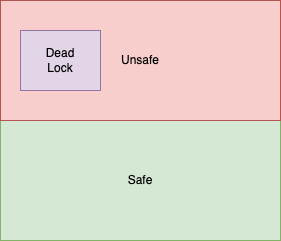

# U2 Part 3: 死锁 | Deadlocks [未完成]

## sketch

deadlock: a situation in which every process in a set of processes is waiting for an event that can be caused only by another process in the set

System Model

- 资源被分为很多类，当一个线程希望有某个资源时，这个资源的任意实例都可以；
- 互斥锁、信号量这种东西也是一种资源，而且是死锁产生的一个热点；
- 线程使用资源可以划分为请求、使用、释放三个步骤；
    - 请求和释放可能是通过系统调用实现的，
- livelock
    - 走廊里两人对走，两个人明明可以通过但是总是互相让到同一个方向，然后就被挡住；
    - 可以通过 trylock() 来描述；
- 死锁和活锁的一个相同点是，它们都可能只在固定行为的特定情况下发生；

死锁的条件，必须都成立才行

1. **Mutual exclusion**. At least one resource must be held in a nonsharable mode; that is, only one thread at a time can use the resource. If another thread requests that resource, the requesting thread must be delayed until the resource has been released. 互斥
2. **Hold and wait**. A thread must be holding at least one resource and waiting to acquire additional resources that are currently being held by other threads. 持有并等待
3. **No preemption**. Resources cannot be preempted; that is, a resource can be released only voluntarily by the thread holding it, after that thread has completed its task. 非抢占
4. **Circular wait**. A set {T0, T1, ..., Tn} of waiting threads must exist such that T0 is waiting for a resource held by T1, T1 is waiting for a resource held by T2, ..., Tn−1 is waiting for a resource held by Tn, and Tn is waiting for a resource held by T0. 循环等待
- 四个并不完全独立，有一些互相的暗示关系。

system resource-allocation graph

- T->R, T is waiting for R, request edge
- R->T, R is assigned to T, assignment edge
- T as circle while R as rectangle

<figure markdown>
    
  

    Resource allocation graph.
</figure>

- 无环 <==> 无死锁；
- 有环时，如果环上每个资源都只有一个实例，那么有死锁，否则只构成必要条件；
- 这句话的意思是，就算环上的资源不止一个实例，也有可能死锁；

处理死锁问题的方法

1. 忽略死锁问题；（？）
2. 使用某种协议来预防和避免死锁问题的出现；
   1. deadlock prevention
   2. deadlock avoidance
3. 允许系统进入死锁状态，但当检测到死锁时我们需要去恢复它；

- 多数操作系统普遍采取第一种方法，即将问题抛给开发者而非由内核来解决；
- 而开发者避免死锁的方法多数以第二种为方针；
- 还有一部分系统（例如 DB），倾向于使用第三种方法；

死锁预防 | Deadlock Prevention

死锁预防指破坏之前提到的四个必要条件，只要保证某个条件始终不成立，就可以避免死锁的发生。

- mutual exclusion
    - 这个东西显然没法不成立，很多资源天然互斥
- hold and wait
    - 一次性拿走所需要的所有资源，就不会有“有一部分等一部分”资源的情况，效率显然很低
- no preemption
    - 拿不到所有的就需要主动释放正占有的
    - 任务没完成之前就释放资源可能导致任务失败，总之很难实现而且效率很低
    - 感觉和上面那个分不清到底破坏了哪个，但是毕竟很难区分
- circular wait
    - 通过给资源编号，规定线程只能按编号递增的顺序申请资源，就不会出现循环等待的情况
    - 限制很大（限制了添加新的资源、有些逻辑顺序与要求顺序也可能冲突）

死锁避免 | Deadlock Avoidance

> 死锁预防是保证死锁在逻辑上不会产生；死锁避免是阻止可能产生死锁的情况。

- 安全状态
    - 充要条件：safe sequence
    - 需要保证 Ti 所需要的资源可以由余下资源和之前的资源已经持有的资源满足
    - 按照 safe sequence 的顺序分配资源和执行
    - 在 safe sequence 下，所有资源都足够使用，没必要“争夺”资源

<figure markdown>
    
  

    Safe, unsafe, and deadlocked state spaces.
</figure>

! eg "放一个例子"

- 资源分配图算法(了解即可)
    - 当所有资源都只有一个的时候可以使用
    - 引入 claim edge，如果未来 Ti 可能需要申请 Rj，那么有一条 Ti->Rj 的 claim edge
    - 如果真的分配了，那么改成 assignment edge
    - 我们需要保证在 Ti 参与算法之前，所有的 claim edge 都已经在图中出现
        - 我们可以约束当且仅当 Ti 的所有相关边都是 claim edge 时，Ti 才能进入图
    - 如果将 request edge 从 Ti->Rj 变为 assignment edge Rj->Ti 时，图中出现了环（使用图论环检测算法），那么会让图进入 unsafe 状态；反之是 safe 的。如果 safe，则这个分配是允许的
- 银行家算法
    - 银行家算法支持每个资源类别不止一个的情况，但是效率不如分配图
    - 每个进程进入以后都需要先声明自己需要（各类资源）最多多少资源
    - 每次有用户请求资源的时候系统都会检测，这个请求会不会导致系统进入 unsafe 的状态，如果会就需要等待其他进程释放足够多资源以后再允许
    - 为了实现这个算法，我们需要维护一些数据结构：
        - `n` = number of threads
        - `m` = number of resource types
        - `Available[m]` = number of available resources of each type
        - `Max[n][m]` = maximum demand of each thread
        - `Allocation[n][m]` = number of resources of each type currently allocated to each thread
        - `Need[n][m]` = remaining resource need of each thread
            - `Need[i][j] = Max[i][j] - Allocation[i][j]`
    - Safety Algorithm 步骤：
        - 判断系统是否在 safe 状态
        1. `Work[m]` <- `Available[m]`, `Finish[n]` <- False
        2. 找到一个 `i` 使得：
           - `Finish[i]` == False
           - `Need[i]` <= `Work`
           - 如果没有这个 `i`，则 goto 4
        3. `Work` <- `Work` + `Allocation[i]`, `Finish[i]` <- True, goto 2（即表示了进程运行结束后，资源会被释放）
        4. 如果所有进程都满足 `Finish[i]` == True，则系统处于 safe 状态；否则，系统处于 unsafe 状态
    - Resource Request Algorithm
        - 判断请求是否能被安全地允许（两个步骤，先判断能不能分配，再看分配之后安不安全）
        - 用 `Request[n][m]` 表示进程想要请求的资源的数量
        1. 如果 `Request[i]` <= `Need[i]`，goto 2；否则，出错，因为它请求的量超过了它之前说的最大预期
        2. 如果 `Request[i]` <= `Available`，goto 3，即资源足够；否则，进程必须等待，因为没有足够的资源
        3. 假设系统分配了资源，即 
           - `Available` <- `Available` - `Request[i]`
           - `Allocation[i]` <- `Allocation[i]` + `Request[i]`
           - `Need[i]` <- `Need[i]` - `Request[i]`
         - 如果这样之后的状态是 safe 的（上面那个算法），那么就允许这个请求；否则，进程必须等待，因为没有足够的资源

    - 有一个关键问题是，为什么这里看似“贪心”的做法是成立的？
        - 考虑一个进程，释放的资源总是不比索取的资源少，所以贪心的使用不会带来问题。

> 缺陷： from Wiki
> 
> Like the other algorithms, the Banker's algorithm has some limitations when implemented. Specifically, it needs to know how much of each resource a process could possibly request. In most systems, this information is unavailable, making it impossible to implement the Banker's algorithm. Also, it is unrealistic to assume that the number of processes is static since in most systems the number of processes varies dynamically. Moreover, the requirement that a process will eventually release all its resources (when the process terminates) is sufficient for the correctness of the algorithm, however it is not sufficient for a practical system. Waiting for hours (or even days) for resources to be released is usually not acceptable.

死锁检测 | Deadlock Detection

- 如果系统既没有预防也没有避免死锁，那么可能需要一个死锁检测和恢复机制

