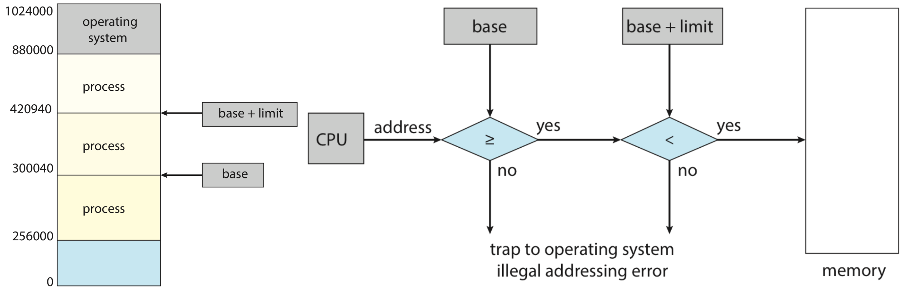
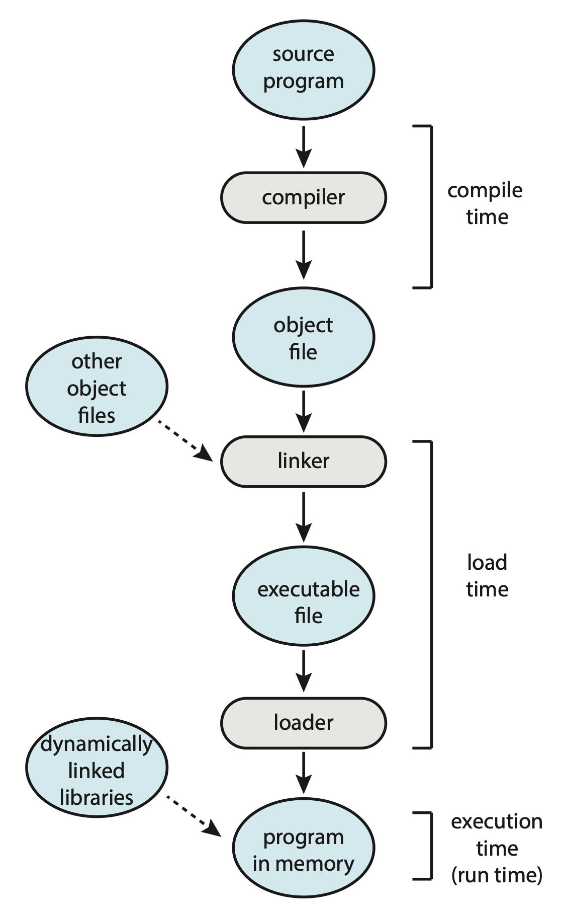
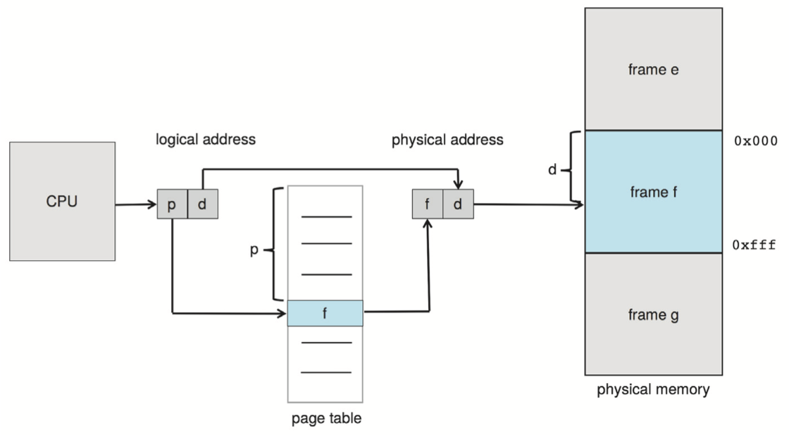
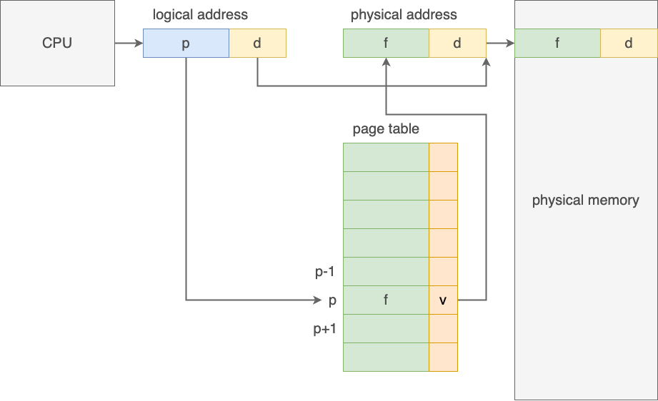
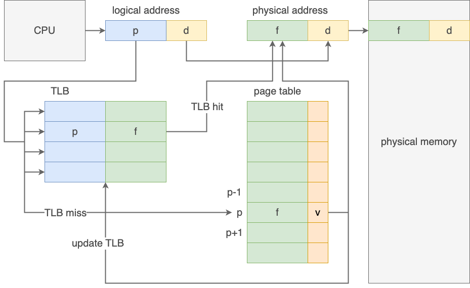
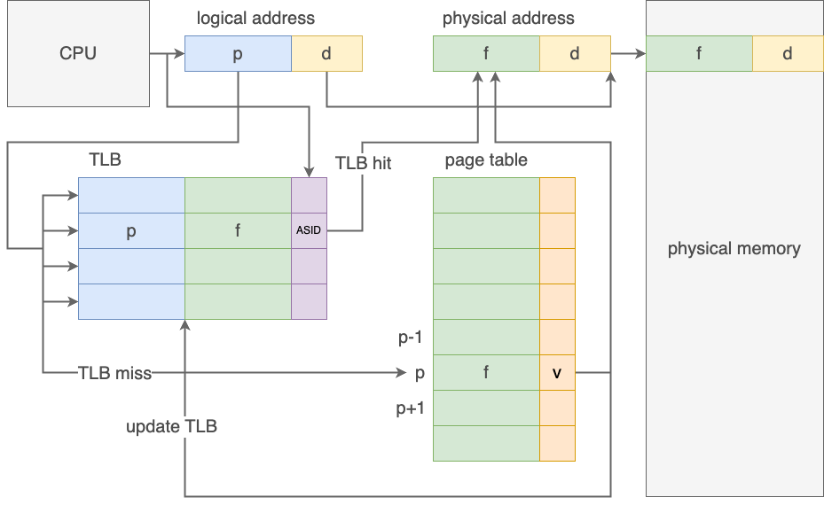
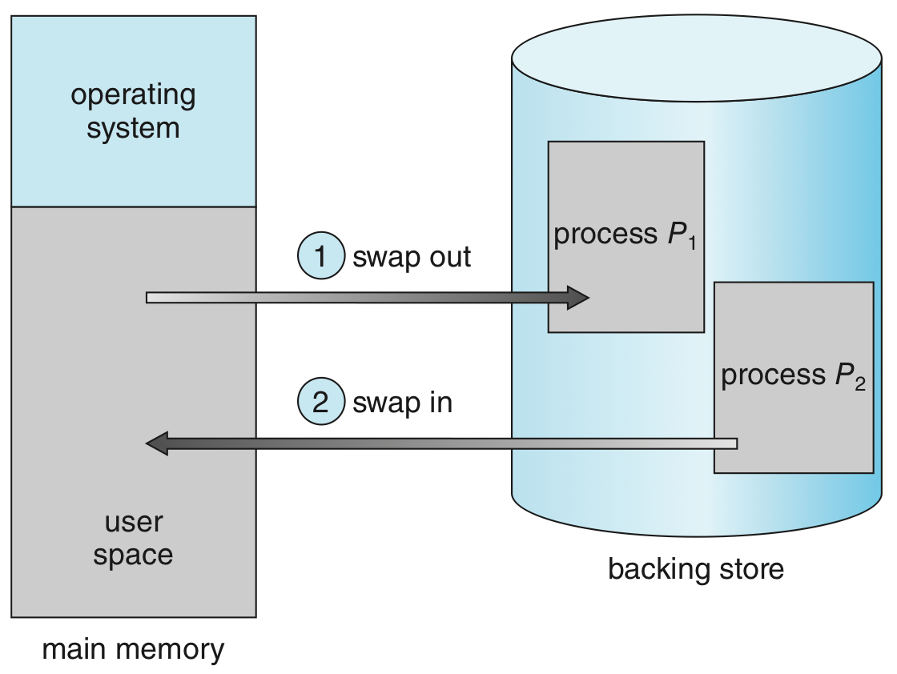

# U3 Part 1: 内存设计 | Memory Design

!!! info "导读"

    内存是计算机中最重要的部件之一，在 Von Neumann 架构中，内存是程序和数据的载体，也是 CPU 访问数据的重要途径（CPU 能够直接访问的存储结构一般只有寄存器和内存，以及作为中介的缓存）。此外，CPU 执行的**指令(instructions)**，只有在物理内存中时才能被执行。

    而我们知道，内存 I/O 通常是比较慢的，如果再进一步对内存之外的存储设备做 I/O（内存毕竟也是有限的），则会更慢。因此，就像榨干 CPU 的性能一样，我们也要尽可能地利用好内存。

    除了性能，内存还需要实现一些保护措施，防止程序越界访问内存，或者程序之间互相干扰。

    同时，由于计算机运行程序是一个动态的过程，而我们使用内存往往需要的是连续的、大块的内存，所以在运行过程中如何保证内存的分布是相对完整的，也是一个重要的问题。

    在引入[帧 & 页](#帧--页){target="_blank"}设计后，我们不再需要以进程为单位去观察内存，而是以页为单位，这意味着粒度更小，我们可以更加灵活地去管理内存。

    在[交换技术](#交换技术){target="_blank"}的支持下，**不是正在被使用的**虚拟内存可以**实际**被映射到物理内存或[后备存储](#交换技术){target="_blank"}中。更具体的来说，我们会将“暂时用不到”的东西暂放在[后备存储](#交换技术){target="_blank"}中，而在需要的时候将它们换到物理内存中。而在[下一节](./Unit3-Part2.md){target="_blank"}，我们要关注的重要问题就是，这些操作具体如何执行、如何优化，也就是介绍 demand paging 系统。
    
## 内存基础设计

### 内存保护

每一个进程在内存中都应当有一块连续的内存空间，而单个进程应当只能访问自己的内存空间，而不能访问其他进程的内存空间。这就是内存保护的基本要求。

我们通过引入 base 和 limit 两个寄存器来实现框定进程的内存空间，当前进程的内存空间始于 base 寄存器中存储的地址，终于 base + limit 对应的地址，即：

<figure markdown>
<center>  </center>
A base and a limit register define a logical address space. (left)<br/>
Hardware address protection with base and limit registers. (right)
</figure>

两个特殊的寄存器只能由内核通过特定的特权指令来修改。而内存的保护，通过**[内存管理单元(memory management unit, MMU)](#MMU){target="_blank"}**来实现，MMU 会在每次访问内存时，检查访问的地址是否在 base 和 limit 寄存器所定义的范围内，如果不在，则会产生一个异常，中断程序的执行。

### 地址绑定

我们在[总览#链接器和装载器](./Unit0.md#链接器和装载器){target="_blank"}中提到过，静态的代码程序成为动态的进程，可能会需要图中这么几步。

<center> { width=40% align=right} </center>

具体来说有三个阶段：编译时间(compile time)，装载时间(load time)和执行时间(execution time)。而内存也分三种：符号地址(symbolic addresses)，可重定位地址(relocatable addresses)（类似于一种相对量）和绝对地址(absolute addresses)。

- 通常来说，在 compile time，compiler 会将代码中的 symbol 转为 relocatable addresses；而如果在 compile time 就知道了进程最终会被安置在何处，那么在 compile time 就将 symbol 转为 absolute addresses 也是可能的，只不过如果此时起始地址发生改变，就需要重新编译。
- 而一般在 load time，relocatable addresses 会转为 absolute addresses，当进程起始地址发生改变时，我们只需要重新装载即可。
- 如果进程在 execution time 时，允许被移动，那么可能从 relocatable addresses 转为 absolute addresses 这一步就需要延迟到 execution time 来执行。**绝大多数操作系统都使用这种方案。**

### 动态装载

由于引入了多道技术，操作系统的内存中可能同时存在多个进程。为了更加灵活地使用内存资源，我们引入**动态装载(dynamic loading)**机制。

动态装载指的是，如果一个例程还没有被调用，那么它会以**可重定位装载格式(relocatable load format)**[^5]存储在磁盘上；当它被调用时，就动态地被装载到内存中。即，例程只有在需要的时候才被载入内存。对于大量但不经常需要访问的代码片段（例如错误处理代码），这种方式可以节省大量的内存空间——这种只有偶尔会被访问的代码也不应当长久地占有内存。

> 需要注意的是，动态装载并不需要操作系统的支持，而是由开发者来负责实现。

### 动态链接和共享库

我们在[总览#链接器和装载器](./Unit0.md#链接器和装载器){target="_blank"}中已经谈论过动态链接了。而能被动态链接的库就被称为**动态链接库(dynamically linked libraries, DDLs)**，由于它们可以被多个进程共享，所以也被称为**共享库(shared libraries)**。

> 区别于动态装载，动态链接需要操作系统的支持。

### 连续分配及其问题

包括操作系统本身，内存中能存下多少东西，决定了操作系统能同时运行多少进程。而进程需要的内存需要是连续的，而内存的分配与释放又是个动态的过程，所以我们需要想一个办法高效地利用内存空间。

<a id="why-continuous"/>
!!! question "为什么进程所需要的内存是连续的？"

    请读者思考，为什么装载进程所需要的内存需要是完整、连续的，而不能是东一块而西一块的呢？
    
    或者说，如果你认为它可以不连续，为了实现让它能正常运作，你可能需要哪些措施呢？你的设计相比使用朴素的连续内存分配，有什么优势和劣势呢？

    ??? success "提示"

        Von Neumann 架构中，CPU 和内存是如何互动，从而实现其功能的？关注取指过程和汇编中的地址操作！

        - 参考阅读：[Why does memory necessarily have to be contiguous? If it weren't, wouldn't this solve the issue of memory fragmentation?](https://stackoverflow.com/questions/73197597/why-does-memory-necessarily-have-to-be-contiguous-if-it-werent-wouldnt-this){target="_blank"}

通常来说，主存会被划分为用户空间和内核空间两个部分，后者用于运行操作系统软件。主流操作系统倾向于将高位地址划为给操作系统，所以我们此处的语境也依照主流设计。

在连续内存分配(contiguous memory allocation)问题中，我们认为所有进程都被囊括在一段完整的内存中。而在内存分配的动态过程中，整个内存中空闲的部分将有可能被分配给索取内存的进程，而被分配的内存在释放之前都不能被分配给其它进程。在进程执行完毕后，内存会被释放，切我们对于进程何时释放内存不做假设。

最简单的是一种**可变划分(variable partition)**的设计，即不对内存中的划分方式做约束，只要是空闲且足够大的连续内存区域都可以被分配。但我们可以想象，在内存被动态使用的过程中，原本完整的内存可能变得支离破碎。如果我们记一块连续的空闲内存为一个 hole，则原先可能只有一个 hole，而在长时间的运行后，内存中可能存在大量较小的，难以利用的 holes。这就是**外部碎片(external fragmentation)**，在最坏的情况下，每个非空闲的内存划分之间都可能有一块不大不小的 hole，而这些 hole 单独来看可能无法利用，但其总和可能并不小，这是个非常严重的问题。

<figure markdown>
<center>  </center>
Variable partition. 1 hole to 2 holes.
</figure>

但是显然我们不能频繁地要求操作系统去重新整理内存，所以我们需要想办法来减少外部碎片的产生。我们考虑三种分配策略：

- First Fit
- Best Fit
- Worst Fit

关于这三个是什么，可以参考[这篇 ADS 笔记](../D2CX_AdvancedDataStructure/Lec11#online-first-fit-ff.md){target="_blank"}。

实验结果表明，FF 和 BF 的速度都比 WF 快，但通常 FF 会更快一些；而看内存的利用效率，两者则没有明显的区别，但是 FF 和 BF 都深受外部碎片之害。

除了 variable partition 的设计以外，还有一些别的设计，例如**固定划分(fixed partition)**，内容比较简单我就不介绍了。读者可以通过 [xxjj 的笔记](https://xuan-insr.github.io/%E6%A0%B8%E5%BF%83%E7%9F%A5%E8%AF%86/os/IV_memory_management/9_main_memory/#921-fixed-partition){target="_blank"}来做一些了解。

在 fixed partition 中，还会产生另外一种碎片，叫**内部碎片(internal fragmentation)**，它指的是在类似 fixed partition 的策略中，操作系统分配给进程的内存往往是成块的，这就会导致需求的分配量大于进程实际需求量，而那些被分配了但实际闲置的内存，就被称为内部碎片。我们之后介绍的分页技术，也同样会产生内部碎片。

### 物理地址和虚拟地址

为了让内存具有更强的灵活性，我们区分内存的**物理地址(physical address)**和**虚拟地址(virtual address)**，后者也叫**逻辑地址(logical address)**。

物理地址实际在内存设备中进行内存寻址，主要反应内存在硬件实现上的属性；而 CPU 所使用的一般指的是虚拟内存，主要反应内存在逻辑上的属性。物理地址和虚拟地址存在映射关系，而实现从虚拟地址到物理地址的映射的硬件，是**内存管理单元(memory management unit, MMU)**<a id="MMU"/>，除了是实现虚拟地址->物理地址的映射外，MMU 还负责内存访问的[保护](#内存保护){target="_blank"}。我们在之后会将了解到，[TBL](#硬件支持){target="_blank"} 也属于 MMU 的一部分。

<figure markdown>
<center> { width=60% } </center>
Dynamic relocation using a relocation register.
</figure>

物理地址和虚拟地址的区分让使得用户程序不再需要（也不被允许）关注物理地址。此外，通过利用虚拟地址和物理地址的灵活映射，我们可以通过分页来实现良好的内存管理。

!!! tip "头脑风暴"
    
    请读者尝试设想，利用虚拟地址和物理地址的映射关系，我们能做到哪些事？
    
    ??? success "提示"
    
        1. 考虑数学上如何分类“函数映射”；
        2. 考虑如何实现地址连续；

!!! tip "头脑风暴"
    
    请读者思考，物理地址和虚拟地址的长度需要一样吗？

<a id="virtual-address-space"/>
一个进程的**虚拟地址空间(virtual address space)**，指的是在虚拟内存的语境下，进程的内存结构。通常进程在虚拟地址空间中的[大致结构](./Unit1.md#进程的形式){target="_blank"}和地址分布都是相同的，例如可能都是从 0 地址开始放 text 段，栈底一般都在末尾等——这就意味着进程的虚拟地址空间应当是**互不相关**的，由将若干互相隔离的虚拟地址空间映射到各自的物理地址这个任务，则由 [MMU](#MMU){target="_blank"} 完成。（在我们之后介绍了[页表](#帧--页){target="_blank"}后，这意味着每个进程都应当有自己的页表。）

## 分页技术

分页技术想要解决的问题是减轻进程“必须要使用连续内存”这一限制。我们在[前面的思考题](#why-continuous){target="_blank"}中已经提到，需要使用连续内存是需要一种逻辑上的连续，因此，在[物理地址和虚拟地址](#物理地址和虚拟地址){target="_blank"}的语境下，我们只需要保证虚拟地址是连续的即可。当然，这并不意味着物理地址的连续就是毫无意义的了，物理地址的连续是实际上提供高效内存访问的基础。

> 显然这里的 “page” 是基于 [Definition 2](#page-frame-def-2){target="_blank"}。

### 基本设计

换句话来说，我们不再严格需要物理地址也是完整的、大块的、完全连续的了。听起来 external fragmentation 的问题已经解决了，貌似我们只需要每次从里面慢慢捡垃圾，凑出一整块就行了……

嘿！想的有点太美了！虽然逻辑上物理地址不需要连续，但过于稀碎的物理地址会导致内存访问缓慢，捡垃圾凑出来的虚拟内存块也像垃圾一样食之无味。内存映射关系过于琐碎，虽然灵活性上升但效率下降；如果映射关系较为大块、完整，那么效率上升但灵活性下降。我们需要一个中庸的方案。

#### 帧 & 页

因此，我们将两者的优点合并，我们将物理内存划分为固定大小的块，称为**帧(frames)**（类似于 fixed partition），每个帧对应虚拟地址中等大的一块**页(pages)**，用这些帧来作为连续的虚拟地址的物理基础，用虚拟的页号来支持连续虚拟地址（马上就会细说），这样保证了在一定限度内页分配的自由度，利用了虚拟地址的灵活性；又保证了内存相对来说还是成块连续的，提供了物理地址连续的高效性。而帧与页的对应关系，是通过**页表(page table)**来实现的，在页表中，实际上是一个以页号为索引的帧号数组，按照页号顺序排列，因此，页号就是对应的表项在数列中的位次。

???+ key-point "pages v.s. frames"

    !!! warning "下面的内容是在扣定义扣字眼，如果读者认为这毫无意义，可以直接跳过，但我个人认为这些事是构成流畅逻辑的一个基础。"

    虽然我们已经给出了明确的 page 和 frame 的定义，但现实很混乱，我主要查找到关于 page 和 frame 有连套不同的定义。

    <a id="page-frame-def-1"/>
    ???+ definition "Definition 1"

        参考这个[链接](https://cs.stackexchange.com/a/85626){target="_blank"}，这种流派的定义就是上面提到过的这种：

        1. page 表示**虚拟内存中**的完整一块；
        2. frame 表示**物理内存中**的完整一块；

        > 这里我们抓住主要矛盾，不准确描述是怎样“完整一块”，主要区别在于加粗部分。

    <a id="page-frame-def-2"/>
    ???+ definition "Definition 2"

        参考这个[链接](https://cs.stackexchange.com/a/11670){target="_blank"}，这种流派的定义不同，在这套定义里，**准确的 page** 和 frame 不是对等的概念，而是说：

        1. 作为缩写的 page 指代 virtual page，即虚拟内存中的一块；
        2. 作为缩写的 frame 全称是 page frame，也被定义为 physical page；

        !!! warning "为了避免歧义，本 block 中，我们只使用 page，virtual page，physical page 这三个术语！"
        
        在这个定义里，page 表示的实际上是抽象的数据块（注意，不是虚拟的），换句话来说：
        
        1. page 的本质是“数据信息”；
        2. physical page 是 page 在物理内存上的实际存储形式；
        3. virtual page 是 page 的在虚拟内存上的逻辑映象，也 physical page 的一个 view；

        可以发现，虽然用词改变，但是 “physical page” 和 “virtual page” 的关系和之前是一样的，只是 “page” 这个词的含义不一样了。

        所以最违和的就是，作为缩写的 page 和准确的 page 的含义是不一致的，甚至区别巨大。所以我不喜欢这个定义。但是没办法，paging 技术的命名反而就是基于这套定义的，这里大概存在一个非常恶心的历史遗留问题在，请读者留个心眼，在之后的内容中仔细辨别。

回忆[虚拟地址空间](#virtual-address-space){target="_blank"}的相关概念，**每个进程应当都有自己的页表**，即我们称页表是 per-process data structures。

!!! tip "头脑风暴"

    由于帧和页的大小是固定的，所以虽然理论上我们需要的是每一帧的首地址，但所谓的“首地址”实际上是 $m * FrameSize$，因此，只需要用 $m$ 就可以唯一确定了（就像数组的 random access）。

    现在，请读者思考，当 $FrameSize = 2^k$ 时，会有怎样良好的性质？
    
    ??? success "提示"

        联系[页 & 虚拟地址](#页--虚拟地址){target="_blank"}，考虑整个地址的二进制表示中表示页号的部分在整个二进制串中的构成！

<figure markdown>
<center> { width=50% } </center>
Paging model of logical and physical memory.<br/>
以 page table 中的第一项为例：<font color="blue">0</font>:<font color="green">5</font> 表示虚拟地址中的第 <font color="blue">0</font> 页对应物理地址中的第 <font color="green">5</font> 帧。
</figure>

!!! tip "头脑风暴"

    不知道你看了这个寻址模式是否感觉有些微妙的点？在继续之前，请尝试发现这个违和的地方在何处。

    ??? success "黄油猫！"

        <center> { width=60% } </center>

        首先一个结论是，我们显然不能拿着虚拟地址去找页表，因为会陷入：『找页表需要访问页表的物理地址、找虚拟地址对应的物理地址需要页表、找页表需要访问页表的物理地址……』的黄油猫[^3]中。

        就 RSICV 来说，你可以在实验三的手册里找到一段描述 [satp 寄存器](https://zju-sec.github.io/os23fall-stu/lab3/#risc-v-virtual-memory-system-sv39){target="_blank"}的部分。

        我们可以注意到，satp 寄存器的末尾存储的是物理页号，也就是帧号，所以非常显然的，我们需要特别地去存储页表的物理地址信息，并用这个物理地址来访问页表。

#### 页 & 虚拟地址

我们来看虚拟地址是如何在连续性上发挥作用的：一个程序载入内存可能需要多个页，这些页按顺序被分配了**页号(page number)**，实际使用的地址会落在某一页中，就通过 page number 进行索引。而由于一页中包含一大块内存（page size 常常取 4KB），而我们所需要寻的址总是其中的一个 Byte，所以我们需要一个**页内偏移(page offset)**来索引我们所需要的地址在页中的位置，对于 page size 为 4KB 的页，page offset 需要有 $\log_2{4096} = 12$ 位。

因此，实际在 paging 逻辑中，一个虚拟地址的可以被分为两个部分：

```
┌───────────────┬──────────────┐
│page number    │page offset   │
└───────────────┴──────────────┘
 p: m-n bits     d: n bits
```

显然，由于帧和页是一体两面、一一对应的，所以单个页内的连续内存页对应帧上的连续内存。使用 page offset 来标识页内地址，实际就得到了目标物理地址相对于帧中起始地址的偏移量。而对于页间的地址，假设页末地址是：

```
┌───────────────┬──────────────┐
│page number    │11111111111111│
└───────────────┴──────────────┘
 p: m-n bits     d: n bits
```

由于虚拟地址表现上还是个正常的二进制数，所以其下一个地址就是：

```
┌───────────────┬──────────────┐
│page number + 1│00000000000000│
└───────────────┴──────────────┘
 p: m-n bits     d: n bits
```

而其含义就是下一张页表的 0 号位。而我们知道，相邻页对应的帧不一定是连续的，但这个不连续的性质对虚拟地址是透明的。

#### 总体梳理

稍微对上面的内容做一下总结，我们拥有了**逻辑的页**到**物理的帧**的映射关系，这个映射关系存在**页表**里，实现逻辑上连续、物理上离散的内存**块**索引；而利用 page number + offset 的结构定位了内存块中的具体地址，其中 offset 在帧和页中都表示对于块首地址的偏移，因此可以直接迁移使用。

因此，从虚拟地址到物理地址的映射，实际上就是在页表中查询虚拟地址中的 page number，将其换为 frame number，再直接拼接 offset 就行了。

<center> { width=80% } </center>

> 实际上这是个非常自然的过程：整体地看虚拟地址，就是直接在连续的虚拟内存中找到对应的 Byte；整体地看物理地址，同样也是直接在连续的物理内存中找到对应的 Byte。现在通过置换二进制地址字符串的前缀，实现了一个寻址空间的映射。而这个映射中，表示 offset 的后缀不变，正对应着页和帧中偏移寻址规则的统一。

!!! warning "Protection"

    请注意，使用过程中有些页可能尚未与实际的帧建立映射关系，换句话来说是不可用的。所以我们需要一个手段来标识表项是否有效，于是在页表中引入 valid bit，用来标识页是否有效，如果试图访问 invalid 的地址，则会出现异常，以此实现了 protection。

    <center> { width=80% } </center>

    也有一些操作系统通过维护 page-table length register, PTLR 来实现 protection，这里不重点介绍。

!!! tip "page size 的选择"

    容易理解，page size 较大时，页表项更少，而页更容易被浪费，但对于磁盘来说，单次大量的传输效率更高；page size 较小时，页表项更多，需要更多内存和时间来处理页表，所以具体 page size 的大小要具体问题具体分析、与时俱进。

在之后[页表设计改进](#页表设计改进){target="_blank"}一节中，我们将继续对页表的结构进行修改，但整体使用逻辑不变。

### 硬件支持

!!! info "导读"

    本节侧重于从硬件实现的角度来看分页技术。

我们前面说过，页表是 per-process data structures，所以页表应当作为一个进程的元信息被维护。显然我们不能直接用大量寄存器来维护页表（理论上很快，但是太贵、设计上也不现实），所以页表实际上应当被放在<u>内存</u>中（进一步的，为了保证效率，我们将页表放在主存中），我们通过用寄存器维护一个指向页表的指针来维护页表，这个特殊的寄存器被称为**页表基址寄存器(page-table base register, PTBR)**，当进程不处于 running 态时，PTBR 应当被存储在 [PCB](Unit2-Part1.md#PCB){target="_blank"} 中，在 [context switch](./Unit1.md#context-switch){target="_blank"} 的过程中，我们也应当对 PTBR 进行交换。

!!! question "嘿！可是内存真的好慢！"
    不仅如此，由于地址映射的实现逻辑，我们首先需要利用页表查询帧号，利用帧号去得到物理地址，再去内存里做查询，这里有足足两次内存访问操作！

#### TLB

为了解决这个问题，我们引用计组里学到的 Eight Great Ideas 之 Make Common Case Fast！引入一个缓存来加速页表的维护：**页表缓存(translation look-aside buffer, TLB)**，它实际上是 MMU 的一部分[^1]，页号和帧号以键值对的形式存储在 TLB 中。除了访问速度快以外，TLB 允许并行地查询所有键值对。从效率上来说，现代的 TLB 已经能够在一个流水线节拍中完成查询操作。

但是这么厉害的东西肯定还是有局限性的，TLB 一般都比较小，往往只能支持 32 - 1024 个表项。而且，作为一个“缓存”，它有可能产生 miss（即没在 TLB 中找到待查的页号），当 TLB miss 出现的时候，就需要访问放在内存中的页表，并做朴素的查询。同时，按照一定策略（如 LRU、round-robin to random 等[^2]）将当前查询的键值对更新到 TLB 中。

<center> { width=80% } </center>

此外，TLB 允许特定的表项被线固(wired down)，<u>被线固的表项不再允许被替换</u>。（~~这个中文是我自己才华横溢出来的，请不要到处用容易被当没见识。~~）

!!! warning "虽然页表是 per-process data structures，但 TLB 并不是！"
    
正因如此，在 context switch 的时候，我们需要清空 TLB，即进行 flush 操作，否则下一个进程就会访问到上一个进程的页表。又或者我们不需要每次都清空 TLB，而是在 TLB 的表项中加入一个**地址空间标识符(address-space identifier, ASIDs)**字段；在查询页号时，也比较 ASID，只有 ASID 一致才算匹配成功。

<center> { width=80% } </center>

!!! section "定量分析"

    我们使用**击中比例(hit ratio)**来描述我们在 TLB 中成功找到我们需要的页帧键值对的概率，那么假设访问一次内存需要 $t \text{nanoseconds}$，那么使用该 TLB 的**有效内存访问时间(effective memory-access time)**为：

    $$
    \begin{aligned}
        &\text{effective memory-access time} \\
        &= \underbrace{\text{hit ratio} \times \text{memory-access} }_\text{TLB hit}
         +  \underbrace{(1 - \text{hit ratio}) \times 2 \times \text{memory-access}}_\text{TLB miss} \\
        &= p_{\text{hit}} \times t + (1 - p_{\text{hit}}) \times 2t \\
        &= (2 - p_{\text{hit}})t
    \end{aligned} 
    $$

    如果题中给了 TLB access time，则需要将这个也加上去，因为无论 hit 还是 miss 都需要访问 TLB。

    $$
    \begin{aligned}
        &\text{effective memory-access time} \\
        &= (2 - p_{\text{hit}})t + \varepsilon_\text{TLB cache access}
    \end{aligned} 
    $$

    > 在现代计算机中，TLB 的结构可能会更加复杂（可能有更多层），所以实际的计算可能比上述更加复杂。

### 共享页

虚拟地址与物理地址的映射并非需要是单射，换句话来说，多个页可以对应同一个帧，这就是**共享页(shared page)**。

共享页可以用来提高代码重用率，例如，多个进程可能会使用同一个库，那么这个库就可以被共享，而不需要每个进程都各自在物理内存中准备一份。[共享库](#动态链接和共享库){target="_blank"}就通常是使用共享页来实现的[^7]^,^[^8]。

再比如，我们在[进程管理#进程间通信](./Unit1.md#进程间通信){target="_blank"}中提到过通过共享内存来实现进程间通信，在某些操作系统中，共享内存就是通过共享页来实现的。

### 页表设计改进

我们回顾一下目前的[页表的设计](#帧--页){target="_blank"}：现在的页表是以页号为索引、帧号为值的一维数组，而由于我们直接将页表存在物理内存中（否则会黄油猫[^3]！），所以我们其实需要一块完整的连续物理内存来存储整个页表——每一个虚拟地址我们都得存。

假设我们的虚拟地址一共 32 位，而 page size 为 4 KB = 2^12^ B，即 offset 对应虚拟地址 32 位中的后 12 位，那么我们就需要连续的 2^20^ 个表项（对应一共 2^20^ 个虚拟地址）来存储页帧的映射关系。假设一个表项 4 Bytes，那么光一个页表就要占据我们 4 MB 的物理内存——而且是连续的物理内存。这实在是太夸张了！

现在我们要冷静地解决这个问题！现在问题有两个：⓵ 页表实在太大了，⓶ 它不仅大，而且必须是连续的。其中第二点是最关键的，在本节之后的内容中，我将称之为“连续内存约束问题”（非正式表述）。

我们介绍三个方法来解决上述问题：[分层页表](#hierarchical-paging){target="_blank"}、[哈希页表](#hashed-pgtb){target="_blank"}和[反转页表](#inverted-pgtb){target="_blank"}。

<a id="hierarchical-paging"/>
???+ section "分层页表"

    同样，我们首先来思考为什么这里需要的内存是连续的——作为一个一维数字，只有内存连续才能保证 random access。类似的问题我们在探索[连续分配](#连续分配及其问题){target="_blank"}的过程中已经遇到过了：在物理地址空间中寻求连续，一个重要就是因为只有物理地址的设计中，只有保证连续才能保证能 random access 地去访问地址，而现在这个一维数组太大块了，我们希望它碎一点；而我们通过保证分块地连续（帧内物理地址的连续），再保证块索引的连续（虚拟地址空间中页号的连续）的方式解决了这个问题，就好像把一个一维数组变成了一个**指针数组**，或者说逻辑上的二维数组。

    现在我们遇到的问题实际上就是这个“指针数组”也太大块了，希望它能碎一点，所以解决方法已经呼之欲出了——将这个指针数组再进行拆分，变成一个维护指针数组指针的数组，或者说逻辑上的三维数组：

    ```
    page number     page offset
    ┌───────┬───────┬──────────────┐
    │ p1    │ p2    │ d            │
    └───────┴───────┴──────────────┘
    ```

    类似的，我们可以将它看作在原先维护 p2 -> d 的 inner 页表外，再维护一个 p1 -> inner 的 outer 页表。通过这种方式，我们减少了单个页表所需要包含的表项数（原先一个页表需要有 2^p^ 个表项，现在只需要有 2^p1^ 或 2 ^p2^ 个即可）；除此之外，虽然看起来表总量增加了（现在一共需要 2^p1+p2^ + 2^p1^ 个表，原来只需要 2^p1+p2^ 个表），但是 ⓵ 一方面这个增加是可以忽略的相对小量，⓶ 另外一方面，实际上我们并不总是需要创建所有的表——假设某个 inner 表里的虚拟内地址我们都用不到，那么我们就不需要创建这个 inner 表，只需要在 outer 表中标记这个 inner 表是 invalid 就可以了。

    通过这种设计，我们成功地节省了维护页表所需要的内存空间，同时减小了连续内存对页表维护的约束。

    如上这种设计，就是**分层分页(hierarchical paging)**，而上面这个就是二级页表(two-level page table)设计。

    显然，有二就可以有三，有三就可以有四，具体使用哪种，应当秉持具体问题具体分析的原则。

    !!! extra "Risc-V"

        有兴趣的读者可以参考 xg 的这篇[《RISC-V 页表相关》](https://note.tonycrane.cc/cs/pl/riscv/paging/){target="_blank"}笔记，来了解 Risc-V 中的分页设计，写得很清楚，推荐阅读。

        同时，实验三指导手册也提供了关于 [Risc-V Sv39](https://zju-sec.github.io/os23fall-stu/lab3/#risc-v-sv39-page-table-entry){target="_blank"} 的一些介绍。

<a id="hashed-pgtb"/>
???+ section "哈希页表"

    简单回顾一下我们遇到的问题：页表太大，而且必须是连续的。但是实际上我们使用的映射关系，从虚拟地址来看是集中的，从物理地址来看是稀疏的，反正页表中有大量表项是 invalid 的，所以想办法不存这些用不到的表项，也是一种解决思路。

    ???+ quote "Links"

        - [Hash function | wikipedia](https://en.wikipedia.org/wiki/Hash_function){target="_blank"}
        - [哈希 | 鹤翔万里的笔记本](https://note.tonycrane.cc/cs/algorithm/ds/summary2/){target="_blank"}
        - [Hashing | sakuratsuyu's Notes](https://sakuratsuyu.github.io/Note/Computer_Science_Courses/FDS/Hashing/){target="_blank"}

    **哈希页表(hashed page table)**维护了一张哈希表，以页号的哈希为索引，维护了一个链表，每一个链表项包含页号、帧号、和链表 next 指针，以此来实现页号到帧号的映射。此时，一方面我们没必要再维护一个大若虚拟地址总数的表，另一方面由于引入链表，大量的指针操作导致对地址连续性的要求降低，也能变相地减轻连续内存约束。

    <center> { width=80% } </center>

    ???+ section "clustered page tables"

        A variation of this scheme that is useful for 64-bit address spaces has been proposed. This variation uses **clustered page tables**, which are similar to hashed page tables except that **each entry in the hash table refers to several pages** (such as 16) rather than a single page. 
        
        Therefore, a single page-table entry can store the mappings for multiple physical-page frames. Clustered page tables are particularly useful for **sparse** address spaces, where memory references are **noncontiguous and scattered** throughout the address space.

<a id="inverted-pgtb"/>
???+ section "反式页表"

    我们之前的页表通过维护虚拟地址的有序来实现对页号的 random access，但是代价是需要维护大量连续虚拟地址。反式页表(inverted page table)则直接大逆不道地修改了整套思路——以物理地址为索引维护映射关系。

    同时，在这种设计下，整个操作系统只维护一张反转页表。由于不需要每个进程都存储一张页表，整体只存储物理地址数量个表项，所以相对来说节省了内存空间。

    但是显然，这样做我们就没法自然地支持[共享页](#共享页){target="_blank"}了[^4]，因为索引应当是 unique 的。不仅如此，由于我们只做虚拟地址 -> 物理地址的查询，所以在这种结构下我们只能遍历整个表来找映射关系。诸如此类还有不少限制。

    > 总而言之，我觉得这个方法很臭。

    !!! extra "其它"

        可能还会涉及一些段式设计以及相关设计，但是并不主流，但考试可能会考，大家可以选择性去了解一下。

## 交换技术

我们知道，只有在内存中的指令(instructions)才能被 CPU 执行，因而内存大小一定程度上限制了多道程度(degree of multiprogramming)。但是，大部分内容并不需要全程待在内存中[^6]，即不会频繁地被使用。

所以，我们可以考虑在不需要的时候将部分内容放在后备存储(backing store)中，而在需要的时候再将它们弄到内存里——这就是**交换(swap)技术**。在应用交换技术后，那些实际放在后备存储里的 instructions，可以“假装也在内存中”，即 high level 的看，我们并不知道它到底是放在内存还是后备存储里，但是保证当 CPU 需要访问这一块内容时，这些内容会被载入内存。

> 在这里我们只简单介绍一下交换的思想，而具体的细节与实现，将会在之后连同更明确的定义给出。

<figure markdown>
<center> { width=60% } </center>
Standard swapping of two processes using a disk as a backing store.
</figure>

在标准的 swap 操作中，我们以进程为单位进行 swap，这意味着我们要把所有 per-process 的东西都一同 swap，相当于“冻结”整个 process 或“解冻”了整个 process，就好像跨内存和后备存储进行 context switch。可想而知，这个开销是巨大的。

如今我们有分页技术，我们完全可以以页/帧为单位进行 swap，只不过我们称这种以页/帧为单位的**交换(swap)**叫**换页(page)**。

> 显然这里的 “page” 是基于 [Definition 2](#page-frame-def-2){target="_blank"}。

<figure markdown>
<center> { width=60% } </center>
Swapping with paging.
</figure>

!!! property "优势"

    利用页置换技术和虚拟内存的组合拳，我们可以让进程所使用的内存空间总和看起来大于硬件支持的物理内存空间大小上限，**扩展**抽象的“内存”的容量。

    <figure markdown>
    <center> { width=80% } </center>
    Diagram showing virtual memory that is larger than physical memory.
    </figure>

宏观地来看，我们可以抓住主要矛盾，只将每个进程中最迫切需要的那些页留在物理内存中，对进程进行页级的内存管理，于是平均每个进程需要在物理内存中的数据量更小、物理内存中可以存放的“进程”数量更多、多道程度(degree of multiprogramming)得以提高。

### swap 空间

进行 swap 需要从后备存储中来获取进程内容。在后备存储中，有一块专门用来做这件事的地方，叫**交换空间(swap space)**，通常和 swap space 进行交换会更快。但是，代码并不是一开始就在交换空间的，我们需要找一个时机把代码放进去以后，才能纵享丝滑。

> 一种 naive 的做法是，在进程创建的时候就把整个代码镜像放进交换空间，这个做法的缺点就是它的定义，我们会需要在一开始做一个大规模的复制，这个做法有诸多显然的弊端。
>
> 另一种做法是，当一个 page 第一次被使用的时候，它从文件系统中被 page in；而在被 replace 而 page out 的时候，将它写入 swap space。这样，下次需要这个 page 的时候就可以从 swap space 里 page in。
>
> 还有一种策略是，当操作系统需要某个页面时，它会直接从文件系统中将这些页面加载到内存中。这些页面在内存中的副本是不会被修改的，因此当这些内存需要被替换的时候，可以直接被覆盖。（在这种情况下，文件系统本身就像一个后备存储）但是，对于那些不与文件相关联的页面，我们称之为匿名内存(anonymous memory)，例如进程的栈和堆，仍然需要使用交换空间。
>
> **这一部分的内容写的比较简略，对应课本 10.2.3 的后半部分。**

> 但是无论如何，硬盘的速度还是不如内存，所以在内存足够的情况下我们一般不使用 swap。

在下一节，我们引入一套更完善的虚拟内存管理系统：[demand paging](./Unit3-Part2.md){target="_blank"}。

[^1]: [Translation lookaside buffer | Wikipedia](https://en.wikipedia.org/wiki/Translation_lookaside_buffer){target="_blank"}
[^2]: [Cache replacement policies | Wikipedia](https://en.wikipedia.org/wiki/Cache_replacement_policies){target="_blank"}
[^3]: 出自 [Buttered cat paradox | Wikipedia](https://en.wikipedia.org/wiki/Buttered_cat_paradox){target="_blank"}，我在这里表示死循环。
[^4]: [how does an inverted page table deal with multiple process accessing the same frame | Stack Overflow](https://stackoverflow.com/questions/44159535/how-does-an-inverted-page-table-deal-with-multiple-process-accessing-the-same-fr){target="_blank"}
[^5]: [What is the difference between executable and relocatable in elf format? | Stack Overflow](https://stackoverflow.com/questions/24655839/what-is-the-difference-between-executable-and-relocatable-in-elf-format){target="_blank"}
[^6]: 例如 ⓵ 异常处理程序，异常类型可能很多，对应的处理方案可能也会有很多，但均摊下来每一个异常处理程序的使用频率都不会很高；⓶ 数组列表等相对不那么智能的数据结构在定义声明的时候可能开了一大块内存，基本都是为了 bound 住可能需要的内存量的上界，但是可能实际上经常碰不到上界，例如我申请了一个 1024 长的 `int` 数组，但是我可能一般只会用到其中的前 128 个元素；⓷ 一些可能单纯不怎么常用的功能，道理和第一点是类似的。
[^7]: [Shared Memory "Segment" in Operating System | Stack Overflow](https://stackoverflow.com/questions/34545631/shared-memory-segment-in-operating-system){target="_blank"}
[^8]: [Where is linux shared memory actually located? | Stack Overflow](https://arc.net/l/quote/qjkjycww){target="_blank"}