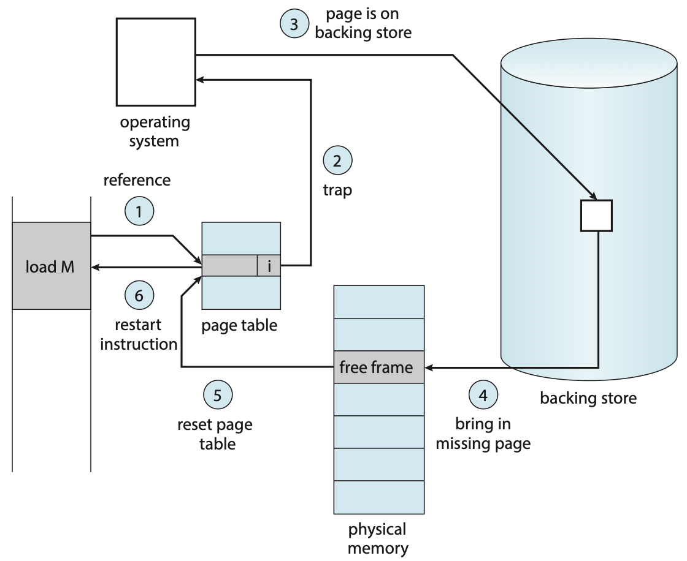
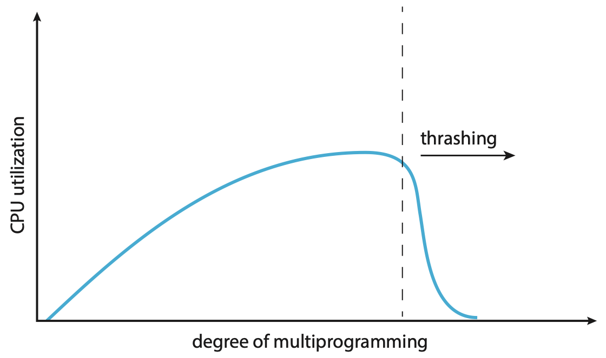
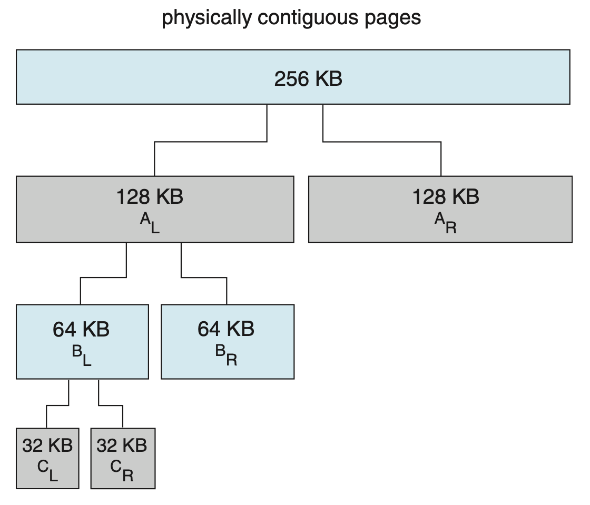

# U3 Part 2: 内存管理 | Memory Management

!!! info "导读"

    [上一节](./Unit3-Part1.md){target="_blank"}我们介绍了内存的一些基本设计，并在最后提出了 swap，这一节我们将利用 swap 的思想，提出一套更完善的内存管理系统：demand paging。

## 按需换页系统概述

**按需换页(demand paging)**^[Wiki](https://en.wikipedia.org/wiki/Demand_paging){target="_blank"}^和[交换技术中的页置换](./Unit3-Part1.md#交换技术){target="_blank"}很类似，指只把**被需要**的页载入内存，是一种内存管理系统。

!!! section "pure demand paging"

    如果激进一点，如果在被需求之前页不会被载入内存，只有在内存被需求后才会被载入内存，我们称之为纯按需换页(pure demand paging)。

    > This scheme is pure demand paging: **never** bring a page into memory until it is required.

<a id="pre-paging"/>
!!! section "pre-paging"

    Pure demand paging 的缺点就是在程序开始的时候会产生大量的 page fault。为了解决这个办法，我们可以在一开始将需要的页一起存入内存。这种做法叫做预换页(pre-paging)。

    晚些我们介绍的 [working set](#working-set){target="_blank"} 的设计思路可以用于处理 pre-paging。

可以想象，现在给定任意一个虚拟地址，有三种可能：

1. 该“地址”在物理内存中，页表中**存在**虚拟内存到物理内存的映射关系，是 valid 的；
2. 该“地址”在后备存储中，页表中**不存在**虚拟内存到物理内存的映射关系，是 invalid 的；
3. 该“地址”并没有被分配，页表中**不存在**虚拟内存到物理内存的映射关系，是 invalid 的，或权限不符（如试图写入一个只读页）；

与引入交换技术之前的页表设计相比，多出来的就是情况 2.。如果系统访问了一个在页表中是 invalid 的页，就会生成异常，我们称这种情况为**缺页(page fault)**。

??? extra "major & minor page fault"

    实际上，情况 2. 还可以细分为两种，一种是 **major/hard page fault**，一种是 **minor/soft page fault**。

    Major page fault 指的是缺了的页不在内存中的情况；而 minor page fault 指的是缺了的页在内存中存在，只不过没在当前页表中建立映射。

    这里稍微细说一下 minor page fault，出现 minor page fault 有两种可能：

    1. 进程可能需要引用一个共享库的 page，而这个共享库的 page 已经在内存中，我们只需要更新一下页表把它链上去就行了；
    2. 进程可能需要引用一个之前被释放了的 page，而那个被释放的 page 还没有被 flush 或分配给别的进程，此时我们可以直接使用这个 page（~~捡垃圾！五秒原则？~~）；

区别于之前的页表设计——访问 invalid 的表项是一种预期外行为，现在产生缺页反而**更多**是一种预期内的行为——系统对某个被 page out 了的页产生了“需求”。当然，情况 3. 这种非法操作也会引起异常，所以我们需要在之后的异常处理过程中对此做区分并分别处理。

> 说实话其实我感觉这里的逻辑稍微有点绕，可能是一些历史原因。

操作系统就需要去处理这个异常的大概流程如下：

<a id="page-fault-handling"/>
!!! section "page fault 处理流程"

    1. 检查一张 PCB 里的内部表，来区分这个地址到底是情况 2. 还是情况 3.；
        1. 如果是情况 2.，则继续如下操作以将其 page in；
        2. 如果是情况 3.，则终止进程；
    2. 从[可用帧列表](#可用帧列表){target="_blank"}里拿出 frame 用来写入；
        - 如果可用帧列表为空，则进行[页置换](#置换策略){target="_blank"}；
    3. 开始从后备存储读取内容，并写入 frame；
    4. 完成读写后，更新内部表和页表等元信息；
    5. 重新执行引起 page fault 的 instruction；
        - 该操作十分关键，类似于死锁里的回滚操作，支持这项操作也具有一定的难度，包括如何确切地恢复回指令执行之前的状态、如何消除执行了一半的指令的效果等；

    <figure markdown>
    <center> { width=80% } </center>
    Steps in handling a page fault.
    </figure>

    > 我们可以在 [Lab5](https://zju-sec.github.io/os23fall-stu/lab5/){target="_blank"} 里对这一系列步骤有跟深刻的影响，Lab5 中的 vma 大概就是这里的“内部表”。

!!! not-advice "慢！"

    想象一下，每当发生一次 page fault，并且我们假设这些 page faults 都属于情况 2.，那么它可能会经历这些过程：

    1. 产生异常后，进行一次 **context switch** 后进入异常处理程序；
        1. 处理异常，包括决定异常类型、在内部表里寻找地址对应于后备存储中的何处；
        2. 发起后备存储 -> 内存的 I/O 请求；
    - （等待过程中 CPU 被调度）；
    1. I/O 中断产生，此时也会有一个 **context switch**；
        - 处理中断，包括决定中断类型、更新页表和其他内部表；
    2. 等待 CPU 再次调度到该进程，显然这里也有个 **context switch**；
        - 做一些回滚操作，然后重新执行引起 page fault 的指令；

    可以发现，处理 page fault 超慢的！因此，我们应当尽可能减少 page fault rate。

???+ tip "思考题"

    下面两段程序展示的代码段的执行效率是否有区别？如果与区别的话，哪个更快？为什么？

    ```cpp linenums="1" hl_lines="5-6 15-16"
    const int N = PAGE_SIZE;

    void foo() {
        /* ... */
        for (int i = 0; i < N; i++) {
            for (int j = 0; j < N; j++) {
                a[i][j] = 0;
            }
        }
        /* ... */
    }

    void bar() {
        /* ... */
        for (int j = 0; j < N; j++) {
            for (int i = 0; i < N; i++) {
                a[i][j] = 0;
            }
        }
        /* ... */
    }
    ```

    ??? success "提示"

        考虑 `a[i][j]` 的元素在内存上的分布，考虑 page fault 的次数：`foo()` 会产生 $N$ 次 page fault，而 `bar()` 会产生 $N^2$ 次 page fault。

        > 做到类似的题的时候要注意 PAGE_SIZE 的大小，以及使用的 [replacement algorithm](#置换策略){target="_blank"}。

程序执行的局部性假设下，应当不会因为 page fault 太频繁导致带来不可接受的额外开销。需要注意，单条指令是有可能带来若干次 page fault 的（例如可能在 instruction fetch 的时候产生、可能在 operand fetch 的时候产生等）。

## 回顾 copy on write

我们在[进程管理](./Unit1.md){target="_blank"}一节中提出了 [copy on write](./Unit1.md#copy-on-write){target="_blank"} 技术和 [vfork](./Unit1.md#vfork){target="_blank"} 技术，现在读者可以尝试再回顾一下这两个知识点与本节内容的联系。

## 可用帧列表

在 demand paging 系统里，页是动态地被映射到帧的，所以我们需要维护一个**可用帧列表(free-frame list)**，用来记录当前哪些帧是空闲的。

<figure markdown>
<center>  </center>
Example of free-frame list.
</figure>

在系统启动后，我们需要将所有可用的帧都加入到 free-frame list 中；当有用户需要物理内存时候，就从 free-frame list 中取出一项，对其进行擦除，即被需求时清零(zero-fill-on-deman)。

!!! question "考虑为什么要执行 zero-fill-on-deman！"

如果读者足够敏锐就会发现，我们只说了怎么取出 free-frame，而没说 free-frame 如何“再生”。

当我们发现 free-frame list 为空，即没有空闲的 frame 时，我们考虑将一些先前已经被分配的 frame 给 page out 走，拿来给当前这个页用。而具体如何选择换走哪个 frame，我们会在[置换策略](#置换策略){target="_blank"}一节中介绍。

<a id="free-frame-buffer-pool"/>
!!! section "free-frame buffer pool"

    虽然我们还没介绍[置换策略](#置换策略){target="_blank"}，但是想象一下，如果等到没有 free-frame 的时候再去做置换，那么进程就需要**等待置换完成**以后再分配。
    
    我们可以考虑在这里引入一个抽象的 buffer，我们可以保证 free-frame list 始终有一定数量的空闲帧，例如 3 个。这样当进程来索取 free-frame 的时候，free-frame list 大概率总是能够直接给出一个 free-frame 的，而给出 free-frame 后，如果发现 free-frame list 中的剩余帧数小于 3，那么就可以独立地开始进行置换，而不必阻塞进程。

    ---

    又或者，我们不使用一个确切的界，而是通过一种负反馈控制，维护一个上界和下界：当 free-frame 数小于下界时，一类叫**收割者(reapers)**的内核例程就开始使用 [replacement algorithm](#置换策略){target="_blank"} 来 reclaim 已经被分配的 frame，直到 free-frame 的数量触碰到上界。

    <figure markdown>
    <center> { width=60% } </center>
    Reclaiming pages.
    </figure>

    ---

    进一步的，万一此时出现了一些特殊情况，导致实际的 free-frame 数非常少，达到了一个非常低的界，此时就出现了 **OOM(out-of-memory)**。此时，一个叫做 OOM killer 的例程就会杀死一个进程，以腾出内存空间。
    
    在 Linux 中，每个进程会有一个 OOM score，OOM score 越高约容易被 OOM killer 盯上，而 OOM score 与进程使用的内存的百分比正相关，所以大概的感觉就是谁内存用的最多就杀谁。[^1]如果读者对 Linux 的 OOM 机制有兴趣，可以看看角注 1。

<br/>

!!! info "导读"

    > 准确来说接下来[分配策略](#分配策略){target="_blank"}和[置换策略](#置换策略){target="_blank"}都应当是 demand paging 的子条目，但是四级标题实在太小了，所以我设为了三级标题。

    我们已经阐述了一个正在运行中的 [demand paging](#按需换页系统概述){target="_blank"} 系统是如何运作的，现在需要补足一些细节。

    1. [分配策略](#分配策略){target="_blank"}：初始化时，如何分配进程所需要的 frame？
    2. [置换策略](#置换策略){target="_blank"}：当 free-frame 不足时，如何进行 replacement？

## 分配策略

在 pure demand paging 里，每个进程通过 page fault 不断“蚕食” free-frame，但如果我们不适用 pure 的 demand paging，那么就需要决定一开始分配多少 frames 给一个 process。

首先，对于单个进程的分配，存在一个较严格的上下界：

!!! section "lower bound & upper bound"

    1. 分配给一个 process 的 frames 数量不能大于 free-frame 总量；
        - 即 the maximum number of frames per process is defined by the amount of available physical memory；
    2. 分配给一个 process 的 frames 数量不能小于 process「执行每一条指令所需要涉及的 frames」的最大值；
        - 这句话有点绕，稍微解释一下：
            - 一些指令可能会需要引用其它 frame（例如的 load，move，以及会产生 indirect references 的指令等），而且 instruction fetch 以外的额外 memory reference 可能不止一个；
            - 我们应当保证涉及的若干 page 都能被存在内存中；
            - 因此，从某种角度来说：the minimum number of frames per process is defined by architecture；

早期**分配算法(frame-allocation algorithm)**按照分配的帧的大小来分，主要有这么两种：

???+ section "equal allocation"

    顾名思义，每一个进程被分配的 frame 总量都相同，假设共 $n$ 个 process，$m$ 块可用 frame，那么每个进程被分配的 $\left\lceil\frac{m}{n}\right\rceil$。

???+ section "proportional allocation"

    比例指按进程的大小来分配，假设共 $n$ 个 process，$m$ 块可用 frame，其中每个 process 的大小为 $s_i$，那么每个进程被分配的 frame 大小为 $a_i = \left\lceil \frac{s_i}{\sum_{j}^n s_j} \times m\right\rceil$。

???+ section "proportional allocation with priority"

    注意到， 目前提到的两种做法都和进程的优先级无关，但从需求上来讲，我们可能倾向于让高优先级的进程被分配更多的 frame 以降低 page fault rate 来增加它们的效率。
    
    所以，我们可以在 proportional allocation 的基础上，在计算 $a_i$ 时综合考虑 priority。

我们发现，上面关于内存分配大小的式子中，有一项 $n$ 表示 #process，区别于其它相对静态的参数，这个参数是会在调度过程中动态变化的，所以实际上分配给每个进程的 frame 数量也是会动态变化的。

在多核设计下，有一种设计叫做 NUMA^[Wiki](https://en.wikipedia.org/wiki/Non-uniform_memory_access){target="_blank"}^，我们在 Overview 其实也提到过。在这种设计里，由于硬件设计问题，不同的 CPU 都有自己“更快”访问的内存。读者可以通过上面的 Wiki 链接做详细了解。

## 置换策略

当 free-frame list 为空，但用户仍然需要 frame 来进行 page in 时，就需要进行**页置换(page replacement)**，将并没有正在被使用的页腾出来给需要 page in 的内容用，而这个“被要求腾出地方”的页，我们称之为**牺牲帧(victim frame)**。

> 显然这里的 “page” 是基于 [Definition 2](./Unit3-Part1.md#page-frame-def-2){target="_blank"}。

我们细化 [page fault 处理流程](./Unit3-Part1.md#page-fault-handling){target="_blank"}的 2.a. 项，大概是如下的步骤：

!!! section "page replacement"

    1. 利用**置换算法(replacement algorithm)**决定哪个 frame 是 victim frame；
    2. 如果有必要（dirty），victim frame -> 后备存储；
    3. 更新相关元信息；
    4. 返回这个 victim frame 作为 free-frame；

如果这个 victim frame 在被 page in 以后没有被修改过，那么我们可以直接将它覆盖，不需要写回后备存储，能节省一次内存操作；反之，如果这个 victim frame 被修改过，那么我们需要将它写**回**后备存储，类似于将修改给 “commit” 了。而为了实现这个优化，我们用一个**修改位(dirty bit 或 modified bit)**来记录页是否被修改过，当 frame 刚被载入内存时，dirty bit 应当为 0；而一旦帧内有任何写入操作发生，dirty bit 就会被置 1。

现在我们来讨论具体的**置换算法(replacement algorithm)**。

### OPT

理论上最优，即 ⓵ 能带来最低的 page fault rate，⓶ 绝对不会遭受 [Belady's anomaly](#Belady-s-anomaly){target="_blank"} 的做法是：<u>在**未来**最久的时间内不会被访问到的页作为 victim frame</u>。这句话说起来有点绕，用英文描述是：Replace the page that **will** not be used for the longest period of time.

换句话来说就是选之后再也不会被用到的或（如果没有前者）下一次用到的时间最晚的页作为 victim frame。

可以发现，我们实际上很难来预测一个 frame 下一次被使用是什么时候，所以该方法只是一个理论上的最优建模，我们在后面应当考虑去逼近这个建模。

???+ tip "头脑风暴"

    这段内容有没有让你想起我们已经学过的某个东西？

    ??? success "提示"

        [Shortest-Job-First Scheduling](./Unit1.md#SJF){target="_blank"}!

        实际上，下面介绍 FIFO 你也应当会想起 [FCFS](./Unit1.md#FCFS){target="_blank"} 调度算法。

### FIFO

先入先出(first-in, first-out, FIFO)策略，即<u>选择正在使用中的、最早进入内存的 frame 作为 victim frame</u>。我们可以通过在内存中完整地维护一个 FIFO 队列来实现这个策略。

FIFO 策略的优点就是简单，方便实现；缺点是并不够好——早被载入的 page 也可能会被频繁的使用。换句话来说，这个方法用被载入的早晚来建模 page 的使用频率，但是这个建模相比 [optimal](#OPT){target="_blank"} 的建模并不足够接近。

???+ tip "头脑风暴"

    请读者试着思考一下，假设现在最早被载入的 page 正在使用过程中，这时候出现了一个 page fault，会发生什么？会导致出现错误吗？

    ??? success "提示"
            
        会影响效率，但是不会出错哦！

<a id="Belady-s-anomaly">
??? extra "Belady's anomaly"
    
    > 这一段内容没啥用，只是一个有趣的现象。
        
    有一种情况叫做 Belady's anomaly，在 FIFO 策略下（其它 replacement algorithm 可能也会发生），随着 frame 数量的增加，page fault rate **可能**会增加。

    例如如下 page 访问序列：

    $$
    1, 2, 3, 4, 1, 2, 5, 1, 2, 3, 4, 5
    $$

    在 3 个 frame 的情况下，page fault rate 为 $\frac{9}{12} = 75.0%$；而在 4 个 frame 的情况下，page fault rate 为$\frac{10}{12} = 83.3%$。

### LRU

我们的目标是为了逼近难以实现的 [optimal](#OPT){target="_blank"}，而 [optimal](#OPT){target="_blank"} 之所以难以实现，是因为我们很难“预知未来”，我们能利用的只有已经经历过的事情。

Least recently used(LRU) 算法的思路是，基于「很久没被用过的 page 可能在短期不太会被再次使用，刚刚用过的 page 可能在短期被频繁地用」的假设，用“最久没用过”来建模「未来最久时间内不会被访问」，即<u>选择最久没被访问过的 frame 作为 victim</u>。

LRU 是比较常用的 replacement algorithm（实际上是 [LRU-Approximation](#LRU-Approximation){target="_blank"}），因为是被认为比较好的 replacement algorithm。

现在我们来考虑如何实现 LRU，或者说，如何来维护一个 frame 有多久没被访问过。

!!! section "stack algorithms"

    1. 计数器：使用一个计数器来标记一个帧有多久没被使用过；
        1. 当一个 frame 被使用的时候将计数器归零；
        2. 需要考虑每个 frame 的计数器都需要被定期更新；
        3. 需要考虑计数器可能溢出；
        4. 在找 least recently used frame 的时候需要去搜索 counter 最大的 frame（你也可以考虑用一个数据结构去维护它，但是会增加设计复杂度）；
    2. 链表序列：使用一个双向链表来维护一个有序序列，frame 在序列中的位置暗示了它们最近被使用的时间；
        - > 貌似主流都用“栈”来建模，但我觉得这不是栈，况且说是栈，其实现还是用双向链表；
        1. 每当一个 frame 被使用的时候：
            1. 如果它在链表中，就将它移动到链表头部；
            2. 如果它不在链表中，就将它加入到链表头部；
        2. 这种设计下每次的 “least used frame” 总是位于序列末尾，因此不需要做额外的搜索；

    上面两种做法都被称为**栈算法(Stack Algorithms)**。

    > 虽然我坚持认为这里和栈没关系。

    !!! advice "优势"

        1. LRU 对于 [optimal](#OPT){target="_blank"} 的拟合是比较好的；
        2. LRU 算法不会出现 [Belady's anomaly](#Belady-s-anomaly){target="_blank"}；

    !!! not-advice "缺陷"

        1. 对于计数器做法，维护每个 frame 的 clock 想想就很慢，除非有特定的硬件来优化这个操作（例如不需要由操作系统来操心 clock 的维护）；
        2. 对于两者，由于每次内存被访问的时候都需要进行维护，如果通过 interrupt 来调用 stack algorithms，那么开销将会巨大；

### LRU Approx.

由于我们在 Stack Algorithm 里提到的诸多弊端，我们考虑**近似**地，实现 LRU 算法——实际上是近似实现 Stack Algorithm。

多数操作系统会提供一个叫 reference bit 的功能。所有 frame 都有一个与之关联的 reference bit，在初始化的时候都会被置 0；而每当 frame 被使用时，reference bit 就会被置 1。于是，我们可以通过观察 reference bit 来观察某些 frame 是否被使用过。

开始之前，我们分析 LRU 的限制，主要体现在两个方面：⓵ 需要全部历史信息，维护成本较大（需要设计数据结构来存储）；⓶ 数据维护过于频繁，每次使用 frame 都需要用一段不小的开销去更新状态。

对应的解决方案是：⓵ 我们完全可以只关注一个邻域里的历史信息，⓶ 我们可以降低更新 frame 信息的频率。（虽然对于后者，实际上如果对应于 reference bit 的更新，其实并没有降低频率。）

???+ section "Additional-Reference-Bits Algorithm"

    只有 reference bit 的话没法反应出 frame 使用的“远近”，也就是使用的顺序。

    既然缺的是顺序，我们就考虑建模 frame 的使用远近。其中最首要的一个任务就是获取历史信息，所以我们需要用一些 bits 来存储每个 frame 的历史使用信息；然后定期（利用时钟中断）地去检查、存储当前时间当前 frame 的 reference bit，相当于检测上一个采样间隔中该帧有没有被用过。

    具体来说，我们可以给每个 frame 一个 $k$ bits 的 bits vector $h = (h_{k-1}h_{k-2} \dots h_{1}h_{0})_2, \quad h_i \in \{0, 1\}$ 用来存储历史的 reference bits；然后每过 $\Delta t$ ms，就产生一次时钟中断，检查 frame $f_i$ 的 reference bit $r_{t}$（为了简洁我们省略这个 $i$），此时我们更新 $h' = (r_{i,t}h_{k-1}h_{k-2} \dots h_{2}h_{1})_2$，即将 $h$ 右移一位，在高位补 $r_{i,t}$。

    实际上 $h$ 是一个类似队列的存在，而每次检查会把 reference bit 给 push 进这个队列里。因此，$h$ 换一个写法就是：$h' = (\underbrace{r_{t}r_{t-1}r_{t-2}r_{t-3} \dots }_{k\text{ bits}})_2$，也就是最近的 $k$ 次检测的历史记录。

    而之所以从高位开始，是因为在数值大小体系中，高位代表着高权重，正好对应 reference 出现的越近，frame 越新。所以，我们可以直接找这个 bits vector 中最小的那个 frame 作为 victim frame。

???+ section "Second-Chance Algorithm"

    Second-Chance Algorithm 只利用 reference bit 来进行置换，类似 [FIFO](#FIFO){target="_blank"} 的改进版，在 FIFO 的基础上，我们引入了 reference bit，并且定期擦除 reference bit。

    我们**循环地**遍历 frames，并逐一检测 reference bit：

    1. 如果 reference bit 为 0，说明采样间隔中这个 frame 没被用过，那么这个 frame 就是我们要找的 victim frame；
    2. 如果 reference bit 为 1，说明采样间隔中这个 frame 被用过，于是给这个 frame 一次“豁免”的机会，将它的 reference bit 设置为 0，并继续寻找下一个 frame；

    !!! tip "头脑风暴"

        在 2. 中为什么要将它置 0？这个置 0 的含义和在时钟中断采样的时候的置 0 一样吗？

        ??? success "提示"

            这就是 Second-Chance Algorithm 中的 “second” 的来源。将它置 0 后下一循环再碰到它的时候，就不会再被“豁免”了。

    显而易见的，在某些情况下，该算法可能会退化为 FIFO，甚至更差，找到 victim page 之前，该算法最多可能会遍历一整遍 frames。而该算法也可以看作 Additional-Reference-Bits Algorithm 的简化版，如果说 Additional-Reference-Bits Algorithm 是通过比较若干轮采样的历史采样记录来对 frames 做排序，以决定哪一个是 “LRU”；那么 Second-Chance Algorithm 就是在一个采样周期里，将 frames 做二值分类，在“远近”这件事的建模上，更加激进和粗粒度。

???+ section "Enhanced Second-Chance Algorithm / NRU"

    > 书中有一句话令人费解，我发现已经有人在 StackOverflow 上问了这个问题，可以参考一下这个[问题](https://stackoverflow.com/questions/58496569/how-does-the-enhanced-second-chance-algorithm-has-a-preference-to-the-changes-th){target="_blank"}。

    既然 Second-Chance Algorithm 的建模有点太激进和粗粒度，那我们考虑把粒度再弄细一点。

    之前我们都只看 reference bit，现在我们把 dirty bit 也纳入考虑。考虑二元组 $(reference, dirty)$，两个 bit 有四种组合：

    1. $(0, 0)$：没被用过，也没被修改过；
    2. $(0, 1)$：没被用过，但被修改过；
    3. $(1, 0)$：被用过，但没被修改过；
    4. $(1, 1)$：被用过，也被修改过；

    由于被修改过的 frame 在被置换的时候需要执行写回，所以我们希望尽量晚一点使用这类 frame。在这种分类下，前两种合并，后两种合并，就是先前的 Second-Chance Algorithm 了。

    在 Enhanced Second-Chance Algorithm 中，我们找到第一个 1. 情况的 frame 作为 victim；如果没有，就去找第一个 2. 情况的 frame 作为 victim……以此类推。[^2]

    因此，Enhanced Second-Chance Algorithm 可能最多会遍历 4 次 frames。在已经介绍的三个算法里，它是唯一一个考虑了 dirty bit 的。事实上，由于 dirty bit 也一定程度上反映了页“被使用”的程度，虽然找的不是最久没被用过的 frame，但能够尽可能地排除近期使用过的 frame，因此，该算法也叫做 **NRU(Not Recently Used)**，是实践中比较常见的一种对 LRU 的近似。

### 基于计数的置换

我们考虑用 counter 来记录正在使用的 frame 中每个 frame 被使用的次数，用 counter 的值来建模“使用频率”。按照后续操作不同分为这两种：

- Least frequently used(LFU) 选择 counter 最小的 frame 作为 victim frame；
- Most frequently used(MFU) 选择 counter 最大的 frame 作为 victim frame；
    - 这个做法基于「counter 小的 frame 可能才刚刚被 load 进来」这个假设；

!!! not-advice "缺陷"

    显而易见的，这两个设计对 [optimal](#OPT){target="_blank"} 的拟合都不是很好，开销也都很大。

<br/>

!!! extra "附加阅读"

    建议去浏览一下 [Wiki](https://en.wikipedia.org/wiki/Page_replacement_algorithm){target="_blank"} 的对应条目，了解一下常见的 replacement algorithm 有哪些。上述分类和脉络和 Wiki 有一些不同，实在是没时间考究这么多粘稠的脉络了（我甚至还没搞清楚 NRU 和 Enhanced Second Chance 到底是不是同一个东西，反正就算不一样大概思路也差不多），所以请读者自行了解更多内容。这些算法内容都不算很多，了解一下更好。

!!! section "置换范围"

    在[分配](#分配策略){target="_blank"}的时候，我们为进程分配了一些帧以用于必要的运算活动。但我们知道，置换操作会动态地更新 frame 的使用情况。不知道你是否疑惑过：置换的时候，我们能否置换其它进程的 frame？以及我们要如何实现和维护这些策略呢？

    实际上，replacement 分为 local 和 global 两种：

    1. 使用 local replacement 时，<u>replacement 只发生在属于当前进程的帧中</u>，因而也就不会影响其它进程的内存使用情况；
    2. 而对应的，<u>global replacement 的 scope 是所有帧</u>，甚至可能一部分原来属于操作系统的帧，因而它能实现一些类似“抢占”的效果；
        - [Free-frame buffer pool](#free-frame-buffer-pool){target="_blank"} 就是一种天然的 global replacement 的实现方式；
    3. 如果我们稍微做一些设计，比如<u>**只**允许高优先级的进程能够置换低优先级的 frame，即 priority replacement</u>，则高优先级的进程使用的 frame 可能越来越多，进而不断优化高优先级进程的效率；

    当然，我们需要维护每个进程所拥有的 frame 数量被 minimum frame number 给 bound 限住。

    对比 local replacement 和 global replacement，主要就是一个封闭性和灵活性的 trade-off，很直观：global replacement 分配更灵活，内存的利用率更高，但对于 frame 被“抢”的进程来说，整体运行的效率就不稳定了；反观 local replacement，虽然由于能够利用的内存有限，可能出现别的进程省了不少但是自己很吃紧的情况，出现内存利用率较低的情况，但整体来说较为稳定，进程之间相对来说不会**互相干扰**。

    > 上面是书上的意思，但我认为这个评价还是不公平的，因为所谓的、属于进程的 frames 的数量是会变的，在新的进程被 allocation 后，进程总数会增加，而这个新进程只能从别的地方刮一些内存来用，所以就算用的是 local replacement，也说不上特别稳定。

    而如今的操作系统使用的主要都是 global replacement。

## 抖动

倘若系统的多道程度过高，那么可能分配给每一个 process 的 frames 数量就会比较少，process 所使用的 frames 中被频繁使用的 page 占比更大。这时候可能就会产生较为**频繁的 paging 活动**——几乎所有 frames 都正在被使用，相当于每次置换都会导致一个新的 page fault——进而导致 CPU 的利用率下降，这种现象被称为**抖动(thrashing)**。

例如，process A 可能抢走了 process B 的正要被使用的 frame，于是导致 process B 之后会产生一次 page fault；而在处理这个 page fault 的时候，可能又把 process C 的正要使用的 frame 给抢走了……

!!! bug "early paging systems"

    { width=50% align=right }

    早期的设计中，操作系统会监控 CPU 利用率，如果发现 CPU 利用率不够高，就会认为 CPU 太闲了，于是尝试增加 degree of multiprogramming。

    但如果 CPU 利用率下降是由于发生 thrashing，产生大量 I/O 导致的，那 degree of multiprogramming 的增加反而会加剧 thrashing，进而导致 CPU 利用率下降，形成恶性循环。

    在遇到 thrashing 问题的时候，理论上我们应当降低 degree of multiprogramming 才对。

### 使用 Priority

可以想象到，这里出现了一种类似于互相抢 frame 的情况。我们可以通过让一方“让步”来解决，例如使用 priority replacement algorithm 来解决。

### Working Set

还有一种基于局部性假设的做法，叫 working set model。它的大致思路是将「每一个进程在一个 $\Delta$ 时间窗口内用到过的 frame」建模为一个进程的 working set $WS_i$，如果 $\sum_i |WS_i| > m$，即所有进程的 working set 的大小之和大于可用 frame 的数量，那么就可能会出现 thrashing。此时操作系统可能就会选择挂起某个 process，以降低 degree of multiprogramming。这个做法的一个问题和 LRU 是类似的，要去维护 $WS_i$ 是比较吃力的，而解决办法也是类似的，我们可以近似地去维护 $WS_i$。

详细内容不再展开，读者可以参考 [Wiki](https://en.wikipedia.org/wiki/Working_set){target="_blank"} 做更多了解。此外，working set 的思路可以用于实现 [pre-paging](#pre-paging){target="_blank"}。

### PFF

或者也能利用缺页频率(Page-Fault Frequency, PFF)来做动态调节，由于 PFF 与进程可用的 frames 数量大致成负相关，我们可以设定上下界并进行负反馈控制：process 的 PFF 过高时增加它可用的 frames 数量，当 process 的 PFF 较低时可以减少它可用的 frames 数量。

> 不过，对于该问题，先行的最佳解决方案其实是增加物理内存，从硬件上解决问题。

## 内存压缩

内存压缩(memory compression)的思路区别于 swap，把 frame 换到 backing store 里，而且尝试去 merge 一些 frame，即利用内部碎片。

## 内核内存

我们之前讨论的内存管理机制，尤其是内存的分配和置换机制，都是针对 user process 的。而内核的运行同样需要 memory，但它不能使用和 user process 相同的内存设计。由于 kernel 程序是一直运行的，所以我们必须更保守地使用内存，诸内部碎片的问题应当尽可能避免，事实上，许多操作系统都对 kernel 使用 paging 设计。再加上由于 kernel 需要和一些硬件做交互，而许多硬件设备都只直接与物理内存做交互，所以我们还需要对 kernel 内存在物理内存上的连续性有一定保证。

### Buddy 系统

Buddy system^[Wiki](https://en.wikipedia.org/wiki/Buddy_system){target="_blank"}^ 可以用来分配物理连续的内存，它由 power-of-2 allocator 实现。

当 kernel 需要 $n$ KB 的内存时候，Buddy system 会分配一块 $2^k$ KB 的空间，其中 $k = \lceil \log_2{n} \rceil$。

> 显而易见的，这样还是容易出现内部碎片，Buddy system 无法解决这种内部碎片，但是稍候接受的 [Slab allocation](#slab-分配){target="_blank"} 可以。

具体来说，Buddy system 通过不断二分的方式来寻找一块合适的内存，如下图：

<figure markdown>
<center> { width=60% } </center>
例如 kernel 申请一块 21KB 的内存，那么 $C_L$ 就是我们最终分配的内存。
</figure>

Buddy system 还有一个特点是，它通过 coalesce 相邻的空闲块来形成更大的内存块，例如上图可以按照分裂的方式合并回 256 KB 的大内存块（~~合并大内存~~）。

### Slab 分配

Slab 分配的大概思路是预先了解到 kernel 内的常见数据结构（被称为各种 object）的大小，并预先准备好对应粒度的小内存块，注册到每类 object 的 cache 里。当一个 object 需要使用内存时，就查询对应的 cache 里是否有空闲的内存块，如果有就分配给它，如果没有就向 Buddy system 申请。

相当于预先把内存分成了苹果小盒、冰箱大箱、超大车库，然后根据要放的东西的大小选择合适的空间来放。

[^1]: [Linux OOM (Out-of-memory) Killer | Medium](https://medium.com/@adilrk/linux-oom-out-of-memory-killer-74fbae6dc1b0#9707){target="_blank"}
[^2]: [Enhanced Second-Chance Algorithm](http://www.faadooengineers.com/online-study/post/ece/operating-systems/1165/enhanced-second-chance-algorithm){target="_blank"}