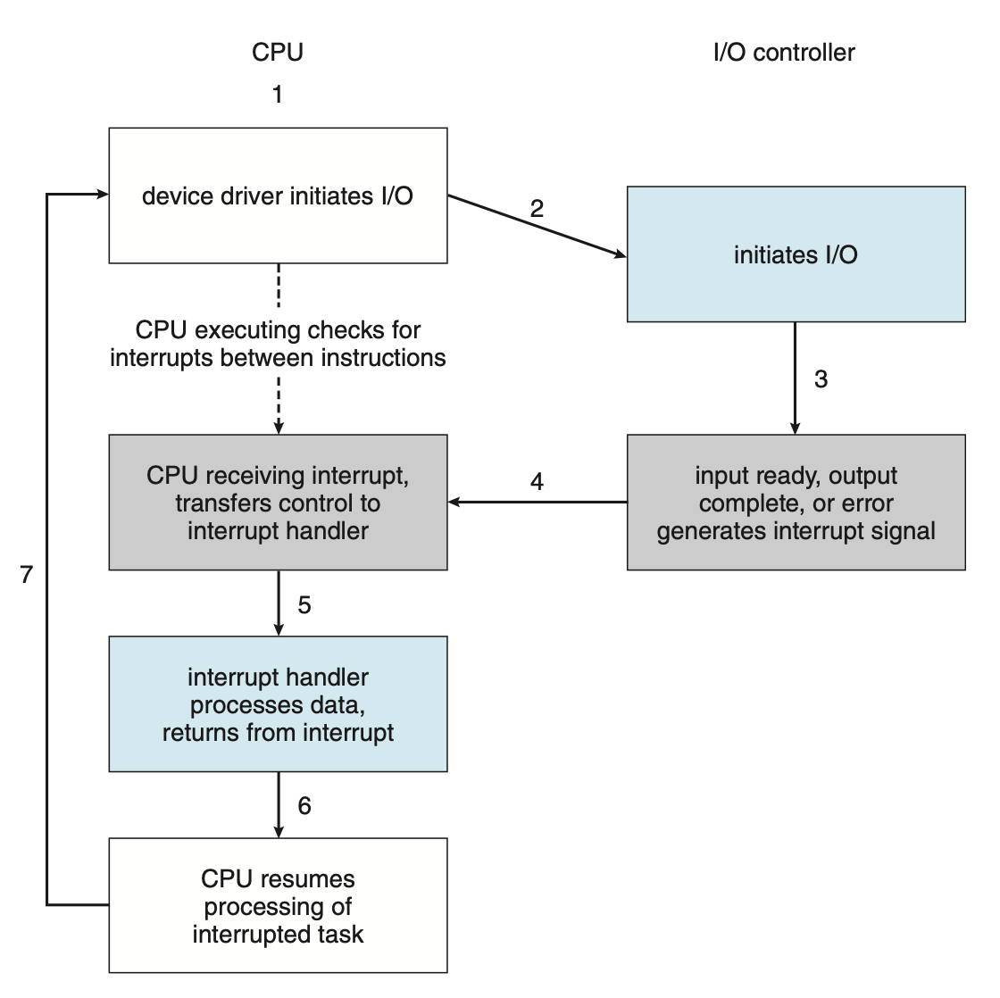

# U4 Part 2: I/O 系统 | I/O Systems [未完成]

!!! warning "说明"

    这部分内容（其实也包括之后的内容）写的比较简略，因为说是不太难，主要是期末了我也没心思写太细了，如果有好人可以帮我完善一下。

## I/O 概述

I/O 是计算机系统中的重要组成部分，它是计算机系统与外部世界交换信息的通道。I/O 设备的种类很多，如磁盘、打印机、键盘、鼠标、显示器、网卡等，承担了存储、通信、人机交互等若干功能。而我们知道 I/O 又是 CPU 的重要瓶颈，所以 I/O 系统的设计是一个很重要的问题。（但不是一个重要的考点？）

!!! definition "concepts"

    - **总线(bus)**：连接各个硬件组成的“抽象”内部通信线路，更侧重于如何规范化地传输数据，是硬件与协议的统一[^1]；
    - **端口(port)**：设备与总线的连接点；
    - **控制器(controller)**：控制设备的硬件组成；
        - 集成在设备上或单独在电路板上；
        - 通常包括处理器、私有内存、微代码（小量代码）、总线控制器等；

### I/O 访问方式

当计算机需要设备做某些事的时候，发出请求，此时计算机需要等待设备的响应，按照等待方式的不同，分为轮询(polling)、中断(interrupt)两种。

!!! section "polling"

    轮询是操作系统与 I/O 设备交互的最简单方式。通常设备会用某种方式来标识设备是否可用或空闲，轮询指的是 CPU 不断向设备控制器查询设备状态，直到设备就绪，然后进行数据传输。这种方式的缺点是需要进行 busy wait，在设备比较缓慢的情况下会降低 CPU 的利用率。

!!! section "interrupt"

    > 我们已经在 [Overview](./Unit0.md#中断){target="_blank"} 讲过中断了，所以有关中断的具体技术细节就不再展开。
    
    现代计算机系统中，中断是操作系统与 I/O 设备交互的主要方式，计算机向设备发出请求以后，可以将当前进程调度走，等到设备处理完成后会向 CPU 发送中断，此时计算机再对结果做处理。中断的优点是 CPU 不需要进行 busy wait，在设备处理时间远大于上下文交换的情况下可以提高 CPU 的利用率。

    <figure markdown>
    
 { width=80% } 

    Interrupt-driven I/O cycle.
    </figure>

实际上使用哪种方案，其实与 “busy wait” 的优劣这个问题是等价的，我们已经在[同步](./Unit2-Part1.md#忙等待){target="_blank"}中有所涉及。

!!! section "DMA"

    上面提到的两种方法都是基于 CPU 全权负责 I/O 与内存交互的假设。在某些情况下，这些事情可能并不需要必须由 CPU 来负责。DMA(direct memory access)允许内存和 I/O 设备之间直接交互，不经过 CPU，这样可以减少 CPU 的负担，提高 I/O 性能。DMA 通常由独立的硬件设备 DMA controller 来实现。

    容易想象，DMA 有一定限制，通常 DMA 只负责做大量的、以 blocks 为单位的数据传输，而不是单个字节的传输。CPU 需要向 DMA controller 发出对应的命令，之后的事情就交给 DMA 来完成。命令通常包括操作类型、起始地址、数据长度等，传输方式一般是把要执行的指令的地址存到 DMA controller 的寄存器中，以这种方式委托 DMA controller 进行作业，有点像回调函数。

    当操作完成后，DMA controller 会向 CPU 发送中断信号，表示任务完成。

## 应用程序 I/O 接口

[^1]: [Bus (computing) | Wikipedia](https://en.wikipedia.org/wiki/Bus_(computing)){target="_blank"}