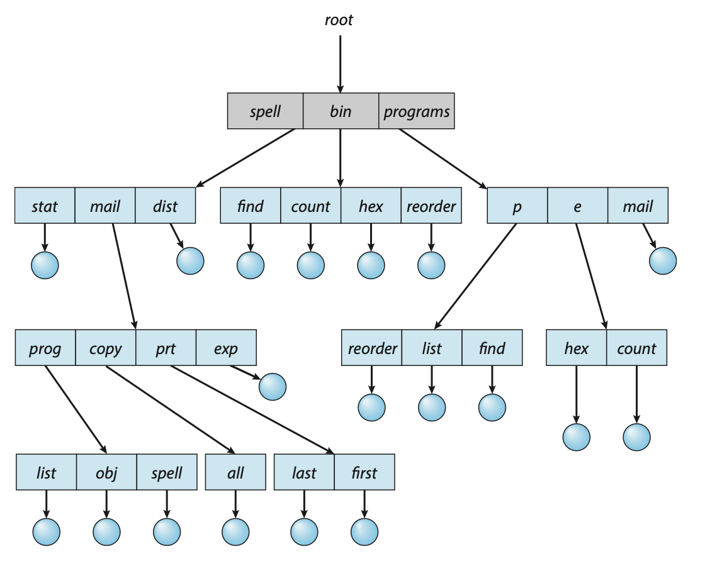
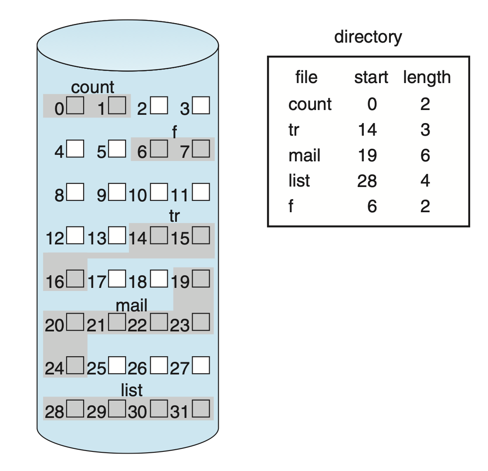
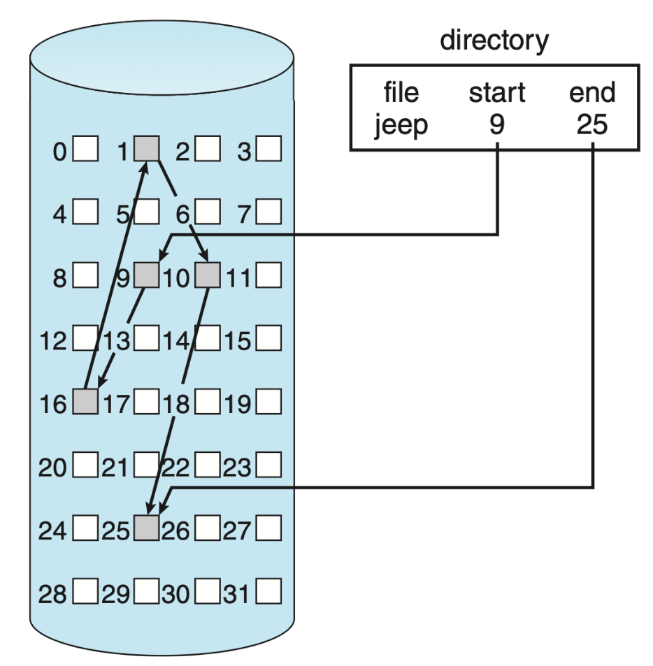
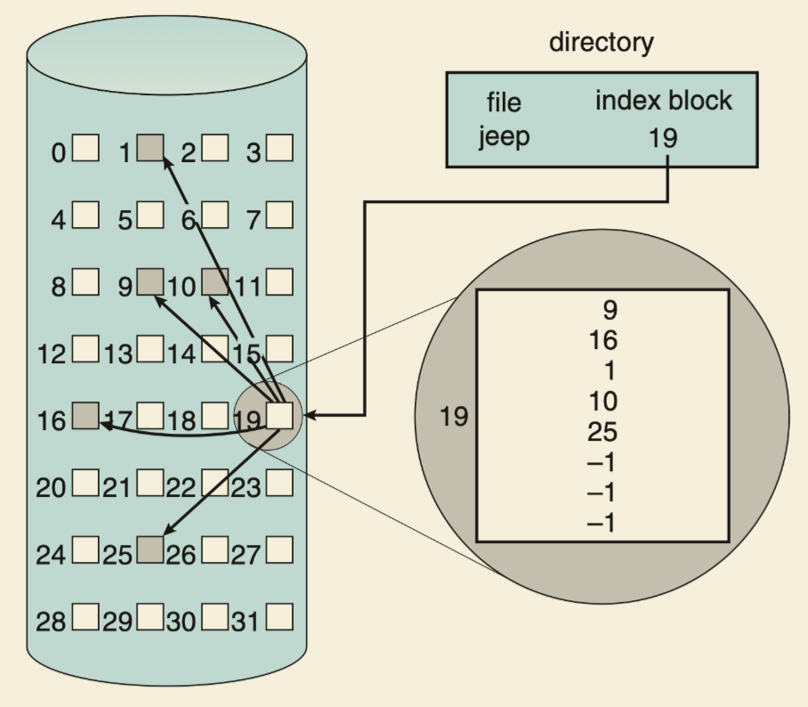
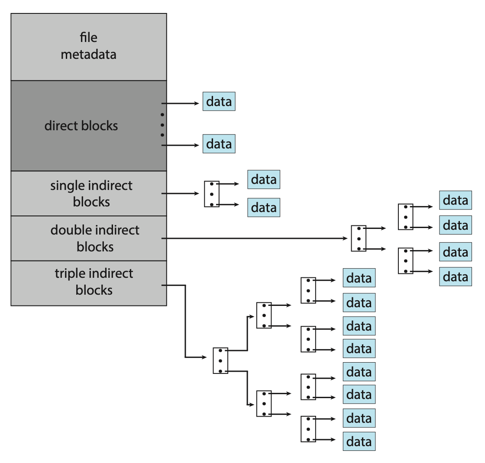

# Unit 6: 文件系统 | File System

!!! warning "关于 FCB"

    书本上并没有强调 FCB 维护的是打开的文件的信息（甚至暗戳戳地在否定这句话），但是做题的时候可能会强调这一点。关于这一点我还需要做一些考证，请读者保持审慎的态度。

!!! info "导读"

    在[存储](./Unit5.md){target="_blank"}一章，我们提到过，卷(volume)做初始化时，需要建立一个文件系统。文件系统提供了数据存储形式的逻辑视图，将数据以**文件(file)**的形式从硬件存储中抽象出来，并使用**目录(directory)**对文件进行进行结构化的组织和管理。

## 文件

一个文件是**存储在二级介质上**的，**具名**的一系列相关**信息集合**，无论是用户还是程序，都需要通过文件来与二级介质进行信息交换。

### 文件属性

不同的文件系统下，文件可能有不同的属性，但通常有以下几个（当然还有其它的）：

- `name`：这是唯一的以 human-readable 形式保存的信息，即文件名；
- `identifier`：在文件系统中用于唯一标识一个文件；
- `type`：一些文件系统需要支持不同的文件类型，此时这些信息用于标识类型；
- `location`：标识文件在哪个设备的哪个位置；
- `size`：当前文件大小，也可能包含文件被允许的最大大小；
- `protection`：访问控制信息，决定哪些用户具有对应的读/写/执行权限等；
- `timestamp`：保存创建时间、上次修改时间、上次使用时间等，这些信息可用来做一些安全保护和使用监控；
- `user indentification`：创建者、上次修改者、上次访问者等，这些信息可用来做一些安全保护和使用监控；

这些信息也被称为文件的元数据(meta data)。

### 文件操作

操作系统可以提供相关的系统调用来完成一些基本的文件操作，例如：

- `create`：分为两步，⓵ 在文件系统中为文件[分配](#分配){target="_blank"}一块空间，⓶ 在[目录](#目录结构){target="_blank"}中创建对应的条目；
- `open` / `close`：打开文件后会得到文件的句柄(handle)，其它对特定文件的操作一般都需要通过这个句柄来完成，类似于“与文件建立一个会话”，关闭文件就是“结束这个会话”；
    - 通常来说，文件被打开后需要由用户来负责关闭；
    - 打开后的文件会被加入到一个打开文件表(open-file table)中，这个表中保存了所有打开的文件的信息，包括文件的**句柄**、文件的**位置**、文件的**访问权限**等；
    - 文件可能被多方用户（进/线程）打开，而只有所有用户都关闭文件后才应当释放文件在打开文件表中的条目，所以维护一个 open-file count 用于记录当前文件被打开的次数，有点类似智能指针；
- `read` / `write`：维护一个 current-file-position pointer 表示当前操作的位置，在对应位置上做读写操作，有一点像[图灵机](https://note.tonycrane.cc/cs/tcs/toc/topic3/){target="_blank"}；
- `repositioning within a file`：将 current-file-position pointer 的位置重新定位到给定值（如文件开头或结尾），也被叫做 `seek`；
- `delete`：在 directory 中找到对应条目并删除该条目，如果此时对应的文件没有其它[硬链接](#hard-link){target="_blank"}，则需要释放其空间，类似于智能指针；
- `truncate`：清空文件内容，但保留文件属性；
- [`locking`](https://en.wikipedia.org/wiki/File_locking){target="_blank"}；

> 在 C 的文件操作函数中，你都能看到类似的操作。

### 权限保护

不同的文件操作对应着不同的权限。

理论上，文件的所属者应当能够决定能对文件做什么操作，以及谁具有这些权限，这个权限通过**访问控制列表(access control list, ACL)**来维护用户们对文件所具有的权限。但是这么做的坏处是，构建 ACL 性价比低，而且原先固定长的表项可能不定长了。

因此，可以精简化这个列表。例如，Unix 和 Linux 系统采用了**访问权限位(access permission bits)**的方式来实现权限控制：

???+ eg "🌰"

    在 Linux 中，我们使用 ls -l 就可以看到当前目录下文件的权限。

    ```shell
    $ ls -l
    total 72
    -rw-r--r--   1 isshikih  staff  18658 Oct 18 23:51 LICENSE
    -rw-r--r--   1 isshikih  staff   1778 Dec 18 10:27 README.md
    lrwxr-xr-x   1 isshikih  staff     18 Nov 21  2022 _deploy.sh@ -> scripts/_deploy.sh
    lrwxr-xr-x   1 isshikih  staff     16 Nov 21  2022 _sync.sh@ -> scripts/_sync.sh
    drwxr-xr-x  14 isshikih  staff    448 Oct 29 22:53 docs/
    drwxr-xr-x  33 isshikih  staff   1056 Nov  3  2022 mkdocs-material/
    -rw-r--r--@  1 isshikih  staff  10937 Dec 21 10:01 mkdocs.yaml
    drwxr-xr-x   3 isshikih  staff     96 Nov  2  2022 overrides/
    drwxr-xr-x   5 isshikih  staff    160 Oct 10 15:39 scripts/
    drwxr-xr-x  19 isshikih  staff    608 Dec 20 21:39 site/
    ```

    第一列中有 10 个字符，其含义如下：

    > A "d" indicates a directory. The second set of three characters represent the read, write, and execution rights of the file's owner. The next three represent the rights of the file's group, and the final three represent the rights granted to everybody else. We'll discuss this in more detail in a later lesson.[^3]

    后 9 个字符将权限被分为三组，分别代表文件所有者(owner)、文件所属组(group)、其他人(other)的**读\(r)**、**写(w)**、**执行(x)**权限。


### 文件类型

对操作系统来所，文件主要分为**数据(data)**和**程序(program)**两大类。而对用户来说，我们通常会认为后缀扩展(extension)标识了一个文件的类型。例如我们会认为 `sketch.psd` 是 Photoshop 的工程文件，`img.png` 是一个图片文件，`main.exe` 是一个可执行文件。但实际上，这些后缀扩展更多的只是一种“提示”，只是用来帮助系统选择合适的方式来打开文件，而不是决定文件的类型，是否要参考后缀名，应当由开发者来决定。

UNIX 系统会在文件开头，使用一串 magic number 来标识文件的类型，例如图片文件的开头通常是 `0xFFD8`[^1]，脚本文本文件开头会以类似 `#!bash` 的形式来指定由谁来执行（例如这个是用 `bash` 执行）。但是需要注意，并非所有文件都支持 magic number，所以并不能仅仅用 magic number 来实现文件类型的判断。

### 文件结构

文件结构指的是文件数据存储的形式，由操作系统或用户程序决定。常见的文件结构有：

- 无结构：流式的存储所有的 words/bytes，UNIX 就定位仪所有文件就是普通的一串字节；
- 简单记录结构(simple record structure)：将文件以 record 为单位存储，record 的长度可以是 fixed 也可以是 variable 的，例如数据库文件；
- 复杂结构(complex structures)；

## 访问方式

访问方式即数据的存取方式，最简单也最常见的访问方式是**顺序访问(sequential access)**，即像磁带那样，逐 byte 或者逐 record 地访问。

另一种方法是**直接访问(direct access)**或**相对访问(relative access)**/**随机访问(random access)**，即支持以几乎相同的时间访问任意位置。

在直接访问的方法之上，还有可能提供索引，即先通过索引表得知所需访问的内容在哪里，然后去访问。在此之上还有一种**索引顺序访问(indexed sequential-access)**。

## 目录结构

目录本质上是一个特殊的文件（Linux 中），而实际上，目录下文件的元信息是被存储在目录中的。目录的结构表示的是目录下文件的组织方式，可以认为目录能够实现 filename 到 [FCB](#FCB){target="_blank"} 的映射，接下来我们介绍若干目录结构的设计。

而在 Windows 中，目录和文件有不同的系统调用来控制。

### 单级目录

最原始的实现方式，不存在分组策略，所有的文件都被铺在根目录下。

<figure markdown>
<center> { width=80% } </center>
Single-level directory.
</figure>

!!! not-advice "disadvantages"
    
    - 为了实现索引，文件的名字必须是唯一的；
    - 随着文件数量的增大，这个设计愈发不合理；

### 二级目录

特指以用户为依据，将文件分组。即**主文件目录(master file directory, MFD)**下为每个用户分配一个**用户文件目录(user file directory, UFD)**，每个用户的目录下再存放该用户的文件。

<figure markdown>
<center> { width=80% } </center>
Two-level directory structure.
</figure>

由于出现了分层结构，所以对文件的索引从依赖文件名转为依赖文件路径(path)。

!!! advice "advantages"

    - 相比于[单级目录](#单级目录){target="_blank"}，不同用户目录下的文件名可以相同了；

!!! not-advice "disadvantages"

    - 并没有从根源上解决无法分组的问题；

### 树形目录

树形目录(tree-structured directories)将目录视为一种特殊文件，即将“目录”的概念通用化，于是允许用户在目录下自由地创建目录进行分组，于是总体文件结构成为一种树形结构。

<figure markdown>
<center> { width=80% } </center>
Tree-structured directory structure.
</figure>

文件都相当于树上的一个节点，非目录节点都是叶子节点，目录节点都是非叶子节点（不考虑空目录）。为了在这种结构下找到唯一确定的那个文件，我们需要提供文件的**路径(path)**，分为**绝对路径(absolute path)**和**相对路径(relative path)**两种。

> 这东西太简单了，只要有 Linux 实践经历就肯定搞得明白，所以我就不展开了。没有 Linux 实践经历建议先有 Linux 实践经历。

!!! advice "advantages"

    - 解决了自由分组的问题，使文件系统的结构化管理能力大大增强；


### 无环图目录

无环图目录(acyclic-graph directories)是在树形目录的基础上，允许目录之间存在链接关系，链接分为软链接(soft link)和硬链接(hard link)两种。

<figure markdown>
<center> { width=80% } </center>
Acyclic-graph directory structure.
</figure>

???+ section "soft link"

    软链接又称符号链接(symbolic link)，是一个指向文件的指针，类似于 Windows 下的快捷方式。

    删除被软链接指向的那个文件并不会连带地处理软链接，但是原先的这个软链接已经失效了。
    
    从本质上来看，软链接是特殊的文件。

<a id="hard-link" />
???+ section "hard link"

    硬链接是复制链接文件目录项的所有元信息，存到目标目录中，此时文件平等地属于两个目录。

    由于此时文件等价地属于复数个目录，所以在文件元信息被更新时，需要保证在若干目录下该文件的信息是一致的。
    
    删除被硬链接的文件并不会直接导致文件被删除，只有当用来记录「被硬链接数量」的 reference counter 被减至 0，即不再有其他硬链接指向该文件时，文件才会被删除；其他情况下都只需要在当前目录中删除该表项，并将 reference counter 减 1，更新相关元信息即可。

    从本质上来看，硬链接是目录表项。

在无环图目录(acyclic-graph directories)中，为了保证无环，我们只允许创建关于文件这种叶子节点的硬链接[^2]。不过这个说法存在一个例外，我们都知道通常在任意路径都会有 `.` 和 `..` 这两个特殊目录，它们通过硬链接分别指向当前目录和父目录（根目录的父目录也是根目录）。

此外，由于硬链接本质上是表项，而表项与文件系统相关，所以硬链接只能在同一个文件系统下创建，无法跨越 file-system boundary。

### 通用图目录

[无环图目录](#无环图目录){target="_blank"}通过保证不存在环来保证文件系统的简介性，避免遍历目录时候出现死循环或者删除文件时出现的循环依赖等问题。

而通用图目录(general-graph directories)则允许目录之间存在环，但是在各种操作时，通过算法来避免出现问题，例如部分能处理环的图遍历算法、垃圾回收机制等。

<figure markdown>
<center> { width=80% } </center>
General graph directory.
</figure>

## 文件系统

**文件系统(file system, FS)**在二级存储上，它为操作系统提供快速、便捷的，对硬盘数据的操作。文件系统是操作系统中，以文件的方式管理计算机软件资源的软件，以及被管理的文件和数据结构的集合。

??? section "common file system types"

    - FAT
    - FAT32, exFAT
    - NTFS
    - ReFS
    - S51K/S52K
    - ext
    - ext2, ext3, ext4(Linux, Android)
    - proc, sysfs
    - yaffs
    - ReiserFS
    - HPFS
    - UFS
    - HFS+(MacOS, iOS | old)
    - iso9660(CD)
    - NFS(network FS)
    - VFS(virtual FS)
    - ZFS(Open Solaris)
    - LTFS
    - APFS(MacOS, iOS | new)
    - ...


### 文件系统挂载

文件系统**挂载(mount)**是指将一个文件系统的根目录挂载到另一个文件系统的某个目录（被称为 mount point），使得这个目录下的文件可以访问到被挂载的文件系统中的文件。只有被挂载了，一个文件系统才能被访问。

<figure markdown>
<center> { width=80% } </center>
Volume mounted at /users.
</figure>

### 文件系统分层设计

文件系统被分为若干层，向下与 device 交互，向上接受 application programs 的请求，如下是各个分层的设计：


1. I/O control
    - 向下控制 I/O devices，向上为文件系统提供 I/O 功能；
    - 包含 device drivers 和 interrupt handlers，是与具体 device 交互的接口层；[^4]
        - 其中设备驱动(device driver)提供了一套统一的接口，通常是一系列异步中断处理方案；[^5]
2. Basic file system
    - 向下一层发射“抽象”（与设备型号无关）的操作指令（由下一层转化为设备直接支持的指令）；
    - 与 [I/O 调度](./Unit5.md#调度){target="_blank"}有关；
    - 管理内存缓冲区(memory buffer)和缓存(caches)；
        - Buffer 的作用可以参考 [ADS 中的外排序](../D2CX_AdvancedDataStructure/Lec15.md){target="_blank"}中的相关内容来理解；
        - Caches 用来存储一些会被频繁用到的文件系统元数据，以提高文件系统性能；
3. File-organization module
    - 以 basic file system 提供的功能为基础；
    - 能够实现 file 的 logical block 到 physical address 的映射；[^4] 
    - 同时，file-organization module 也囊括了 free-space manager；
        - Free-space manager 维护那些没有被分配的 blocks，并在 file-organization module 请求的时候提供这些 blocks； 
4. Logical file system
    - 存储一些文件系统的结构信息，不包括实际的文件内容信息；
    - 具体来说，logical file system 会维护 directory 的信息，为之后的 file-organization module 提供一些信息，例如符号文件名；
    - [FCB](#FCB){target="_blank"} 会维护被打开的文件的一些具体信息；

## 文件系统的实现

为了实现文件系统，我们需要在硬盘和内存中维护一些数据结构，下面分别介绍 [on-disk structures](#硬盘数据结构){target="_blank"} 和 [in-memory structures](#内存数据结构){target="_blank"}。

### 硬盘数据结构

On-Disk 的数据结构维护 ⓵ 如何启动硬盘中的 OS，⓶ 硬盘中包括的 block 总数，⓷ 空闲 block 的数量和位置，⓸ 目录结构以及文件个体等，下面介绍几个主要的数据结构。

- Boot control block
    - 操作系统被保存在引导控制块(boot control block)中，一般 boot control block 是操作系统所在的 volume 的第一个 block。
    - 在 UFS 中，boot control block 也被称为 boot block；在 NTFS 中，也被称为 partition boot sector。
    - 该数据结构是 per volume 的。
- Volume control block
    - 卷控制块(volume control block)维护了 volume 的具体信息，例如 volume 的 blocks 数量、空闲 block 的数量与指针、空闲 PCB 的数量与指针等。
    - 在 UFS volume control block 也被称为 superblock；在 NTFS 中，也被称为 master file table。
    - 该数据结构是 per volume 的。
- Directory structure
    - [目录结构(directory structure)](#目录结构){target="_blank"}已经在前面提到过，它用来组织 files，同时也维护了 files 的元信息。
    - 在 UFS 中，它维护了文件以及对应的 inode numbers；在 NTFS 中，它在 master file table 中被维护。
    - 该数据结构是 per FS 的。
- <a id="FCB" /> File control block 
    - 文件控制块(file control block, FCB)^[Wiki](https://en.wikipedia.org/wiki/File_Control_Block){target="_blank"}^维护了**被打开的**文件的具体信息。PCB 一般有一个唯一的标识符与目录项关联。
    - **注意**：理论上的 FCB 定义如上，应当主要存在于内存中；但是课本中的 FCB 指的是更广泛的，因此在硬盘中维护文件元信息的那些东西也被称为 FCB，读者需要在这里梳理清楚这种定义上的偏差！
    - 例如，它可能被包含如下信息：
        - 文件权限；
        - 文件操作日期；
        - ACL；
        - 文件大小；
        - 文件数据所在的 block 或这个 block 的指针；
        - ...
    - 在 UFS 中，FCB 指的就是一个 inode；在 NTFS 中，PCB 通常在 master file table 中被维护，其维护形式类似于关系形数据库。

### 内存数据结构

In-Memory 的数据结构在 main memory 中维护，用于帮助文件系统管理和一些缓存操作。

- Mount table
    - 已被挂载的 volume 会被记录在 mount table 中。
- Directory cache
    - 为了提高文件系统的性能，一些最近被访问的目录信息会被缓存到内存中，这些缓存的目录信息被称为 directory cache。
- System-wide open-file table
    - 记录这个系统中所有进程打开的文件。
- Per-process open-file table
    - 记录每个进程打开的文件，其 entry 指向 system-wide open-file table 中的 entry。
- Buffers
    - 在内存中，用于缓冲 disk block 的内容。
    - 当一个 disk block 被读时，它的内容会被放到 buffer 里；当一个向 disk block 写的动作发生时，会先被写入 buffer。
    - 通过上面这种方式，buffer 技术可以实现统一 CPU 和 I/O 设备之间的速度差异。

### 文件操作

接下来，我们举例说明具体的操作是如何在这些设计下运作的。

???+ section "file creation"

    Application program 需要创建文件时，调用 logical file system，并给出需要创建的文件名。它了解 directory 的组织形式，会做相应处理。

    创建文件时，一个对应的 [FCB](#FCB){target="_blank"} 会被创建；与此同时，对应的 parent directory 也会被载入内存，并被更新。

???+ section "file open & close"

    Application program 需要先打开文件才能对文件进行进一步的 I/O 操作，这一步通过系统调用 `open()` 来实现。

    打开文件时，`open()` 会将文件名传输给 logical file system。同时，`open()` 会在 system-wide open-file table 里查找这个文件，如果找到了，说明这个文件正在被其它进程使用，就可以剩下一些额外的开销直接进行下一步；反之，如果没有找到，就需要在 directory structure 中查找这个文件，当这个文件被找到后，其 FCB 会被复制进 system-wide open-file table 表示该文件被打开。

    随后，在 per-process open-file table 中创建一个 entry，指向 system-wide open-file table 中的 entry，表示当前进程打开了一个文件。同时，这个指向的 entry 的 reference counter 会被加 1。

    我们之后对文件的操作都依赖这个指向 system-wide open-file table 中 entry 的指针，它在 UNIX 中被称为 file descriptor，在 Windows 中被称为 file handle。

    ---

    对应的，在文件 close 的过程中，会先删除 per-process open-file table 中的 entry，然后将 system-wide open-file table 中的 entry 的 reference counter 减 1，如果此时 reference counter 为 0，说明没有其它进程打开这个文件了，那么这个 entry 会被删除，此时需要更新 directory structure 中的信息。

### 目录的实现

本节介绍两种目录的实现方法。

???+ section "linear list based"

    线性检索法通过线性表（数组/链表等）来存储目录信息，每个目录项包含 file name 和指向 FCB/Inode 的指针，查找时需要遍历查找。

    !!! advice "advantages"

        - 实现简单；
    
    !!! not-advice "disadvantages"

        - 随着文件数量的增加，检索效率会降低；

    !!! extra "improvement"

        - 使用有序数据结构（平衡树、B+ 树等）可以改善缺点；
  
???+ section "hash table based"

    哈希表法通过哈希表来存储目录信息，每个目录项包含 file name 和指向 FCB/Inode 的指针，可以直接通过 hash function 进行 random access。

    !!! advice "advantages"

        - 检索效率更高；

    !!! not-advice "disadvantages"

        - 可能出现冲突问题，但可以通过算法解决；
        - 哈希表对容纳内容的大小有假设；

### 块分配与块组织

我们在讲内存的时候，讨论过[进程的内存分配策略](./Unit3-Part1.md#连续分配及其问题){target="_blank"}。这里讨论的内容是类似的，我们考虑文件内存要如何被分配，同时，块如何分配也暗示了块是如何组织的。

通常来说主要有三种：连续(contiguous)、链接(linked)和索引(indexed)，它们之间各有优劣，需要注意掌握它们的组织形式，会有计算题。

???+ section "continuous"

    连续分配指的是每个文件占用一段连续的 block。

    <figure markdown>
    <center> { width=80% } </center>
    Contiguous allocation of disk space.
    </figure>

    假设块大小为 512 B，如果给定存取文件的逻辑地址 LA，则其对应的结构内块号 Q 和块内偏移 R 为：

    ```py
    block_size = 512 # Bytes
    Q = LA / block_size
    R = LA % block_size
    ```

    !!! advice "advantages"

        - 实现简单，只需要记录文件的 start block 和 length 即可；
        - 文件访问效率高；

    !!! not-advice "disadvantages"

        - 分配时寻找合适空间比较困难；
            - 类似[进程的内存分配策略](./Unit3-Part1.md#连续分配及其问题){target="_blank"}，需要考虑外部碎片等问题；
        - 在文件可能动态变化的情况下会很糟糕（或者说，文件需要多少空间有时是难以预计的，可能会出现实际使用空间比预期大或小的情况）；
            - 如果文件变小，可能只是带来外部碎片，但是文件变大就无法解决了；

    为了解决外部碎片的问题，有一种策略叫 compacts，指的是先暂时将文件系统复制到另外一个设备上，然后完全释放原始设备的资源，再将文件复制回去，从而实现了“压缩”。不过显然，这个操作的开销是巨大的。

    为了解决文件大小变大，无法扩展的问题，有一种机制叫做 extent，可以修正这个问题。当空间不够时，系统会被分配一块新的连续空间，链式地加入到原始空间的后面，这样就可以解决文件大小变大的问题了（类似于一种不定的大粒度的，由 FCB 维护的链接方案）。当然，为了实现这个方法，除了 start blok 和 length，还需要在 FCB 上记录指向 extent 的指针。

???+ section "linked"

    每个 block 作为一个链节，维护存储信息以外还需要维护指向下一个 block 的指针。此时，FCB 中只需要记录起始地址即可。

    <figure markdown>
    <center> { width=80% } </center>
    Linked allocation of disk space.
    </figure>

    假设块大小为 512 B，每个块的开头消耗 1 B 来存放指针，如果给定存取文件的逻辑地址 LA，则其对应的结构内块号 Q 和块内偏移 R 为：

    ```plaintext
    ┌───────┬───────────────────────────────┐
    │pointer│              data             │
    └───────┴───────────────────────────────┘
    0       1                               512
    ```

    ```py
    valid_block_size = 512 - 1 # Bytes
    Q = LA / valid_block_size
    R = (LA % valid_block_size) + 1
    ```

    !!! advice "advantages"

        - 实现简单，只需要记录文件的 start pointer 即可；
        - 文件的创建（分配）和增长很容易；
        - 解决了[连续分配](#连续){target="_blank"}中的外部碎片问题；

    !!! not-advice "disadvantages"

        - 无法随机访问，文件访问效率低，因为需要从头开始遍历；
        - 需要额外的空间来存储指针；
            - 额外空间于链节数量正相关，所以可以通过使用**簇(cluster)**，即多个连续块为一个链节，来减少指针带来的额外开销；
        - 可靠性存在问题；

???+ section "index"

    虽然链接式方案解决了连续式方案中分配不灵活的问题，但是不支持随机访问。

    索引方法将所有指针统一维护到 index block 中，而不是利用链表的方式。每个文件有自己的 index block，在 index block 中，顺序存放着指向文件的所有 block 的指针，index block 中第 i 个 entry 指向了存储文件数据的第 i 个 block。

    <figure markdown>
    <center> { width=80% } </center>
    Indexed allocation of disk space.
    </figure>

    假设块大小为 512 B，如果给定存取文件的逻辑地址 LA，则其对应的结构内块号 Q 和块内偏移 R 为：

    ```py
    block_size = 512 # Bytes
    Q = LA / block_size
    R = LA % block_size
    ```

    !!! advice "advantages"

        - 文件的创建（分配）和增长很容易；
        - 解决了[连续分配](#连续){target="_blank"}中的外部碎片问题；
        - 支持随机访问；

    !!! not-advice "disadvantages"

        - 通常有更大的指针空间开销，因为 index 以 block 为最小占用单位；

    当然，我们也要考虑 index block 太小的情况，这时候我们需要维护复数个 index blocks，几种常见的方案：

    1. 使用链接索引，用链表将它们连起来；
    2. 使用多级索引（回顾[多级页表](Unit3-Part1.md#页表设计改进){target="_blank"}）；
    3. 使用混合模式，该方案为 UNIX 所采用，类似于分级电费，inode 中有 15 个指针，各自用途不同：
        1. 前 12 个直接索引 12 个 block；
        2. 第 13 个指向一个 indirect index block（用不到的时候就不用）；
        3. 第 14 个指向一个二级 indirect index block（用不到的时候就不用）；
        4. 第 15 个指向一个三级 indirect index block（用不到的时候就不用）；

    <figure markdown>
    <center> { width=80% } </center>
    The UNIX inode.
    </figure>

!!! tip "头脑风暴"

    请思考这三种设计下，如何计算对应的结构内块号 Q 和块内偏移 R。

    ??? success "提示"

        链接索引：

        ```py
        block_size = 512 # Bytes
        normal_block_size = block_size # Bytes
        ptr_valid_block_size = block_size - 1 # Bytes

        Q1 = LA / (normal_block_size * ptr_valid_block_size) # the index block
        R1 = LA % (normal_block_size * ptr_valid_block_size)

        Q2 = R1 / normal_block_size # the data block
        R2 = R1 % normal_block_size # the offset in the data block
        ```

        二级索引：

        ```py
        block_size = 512 # Bytes

        Q1 = LA / (block_size ** 2) # the inner index block
        R1 = LA % (block_size ** 2)

        Q2 = R1 / block_size # the data block
        R2 = R1 % block_size # the offset in the data block
        ```

---

???+ eg "🌰"

    === "题面"

        一个文件系统使用二级索引分配，一个块的大小为 1 KiB，索引中的块地址为 4 B，则文件系统能支持的最大空间大小为？

    === "解析"

        这里有两条线，第一条是索引系统所能支持的最大块数量，第二条是块地址能支持的最大地址空间大小，我们应当分别计算，取最小的那个作为答案。

        首先，可以认为二级索引实际上就是个二维数组，一个维度由一个块维护，所以每个维度中有 1 KiB / 4 B = 2^8^ 个项，所以一共支持 2 ^16^ 个项。

        其次，由于块地址由 4 B 表示，所以地址空间最多有 2^32^ 个项。

        所以，文件系统支持的最多项数为 2^16^ 项，最大空间为 1 KiB * 2^16^ = 64 MB。

???+ eg "🌰"

    === "题面"

        文件 F 由 200 条记录组成，记录从 1 开始编号。用户打开文件后，欲将内存中的一条记录插入到文件 F 中，作为其第 30 条记录。请回答下列问题，并说明理由。

        1. 若文件系统采用**连续分配**方式，每个磁盘块存放一条记录，文件 F 的存储区域**前后**均有足够空闲的磁盘空间，则完成上述插入操作最少需要访问几次存储块? F 的文件控制块内容会发生哪些改变？

        2. 若文件系统采用**链接分配**方式，每个磁盘块存放一条记录和一个链接指针，则完成上述插入操作需要访问几次磁盘块？若每个磁盘块大小为 1 KiB，其中 4 B 存放链接指针，则该文件系统支持的文件最大长度是多少 GiB？ 

    === "解析"

        **第一题**：

        第一小问：

        - 连续分配的话，就有点类似于数组。要对数组做插入，就需要移动后面的元素，但是这里提到，F 的前后均有足够空闲的空间，那么在这里把 30 号之前的元素往前移应当比把 29 号之后的元素往后移更快，所以我们这里选择将 1 ~ 29 块的内容向前移动。
        - 对于连续分配，要想移动一块的内容，⓵ 首先需要读取一块的内容，⓶ 然后是写入另外一个块。因此，每次移动都需要两次对块的 I/O 访问，这里一共有 29 个块要移动，所以需要 29 * 2 = 58 次移动。
        - 完成移动之后，需要在 30 块的位置写入新的记录，所以这里也有一次 I/O 访问，一共是 58 + 1 = 59 次。

        第二小问：

        - 而关于文件控制块的变化，与文件存储直接相关的是：文件起始地址改变（向前移动一块）以及文件长度改变（增加一条记录）。
        - 此外，可能还会更新 dirty bit、最后更新时间等。

        **第二题**：

        第一小问：

        - 链接分配就类似于链表插入，只需要找到目标位置，然后将前驱的 `next` 指针修改为插入节点，将插入节点的 `next` 改为后驱即可。
        - 首先需要找到 29 号链节，链式只支持顺序访问，所以需要 29 次 I/O 访问才能找到第 29 个链节，此时拿到 29 号链节的 `next` 指针就知道 30 号链节在哪里了。
        - 接下来创建新链节，其 `next` 指针指向刚刚拿到的 29 链节的 `next` 指针，需要 1 次 I/O 访问。
        - 然后修改 29 号链节的 `next` 指针指向新链节，需要 1 次 I/O 访问。
        - 所以，一共是 29 + 1 + 1 = 31 次 I/O 访问。

        第二小问：

        - 这种问题乍一眼看可能会觉得：「链表不是不限长度吗，为什么会有最大大小」，但是需要注意，**指针是定长的**，地址是有限的，因此决定了链节也是有限的。
        - 所以，这里的「其中 4 B 存放链接指针」包含了两个信息：⓵ 每个磁盘块有效存储空间为 1 KiB - 4 B，⓶ 最多只有 2^32^ 个链节。
        - 因此，该文件系统支持的文件最大长度为 2^32^ * (1 KiB - 4 B) = 4080 GiB。


### 空闲空间管理

我们前面在[文件系统分层设计](#文件系统分层设计){target="_blank"}里提到过，file-organization module 需要负责进行空闲空间的管理。现在我们来考虑如何管理空闲空间。

???+ section "位图"

    位图(bitmap)即位向量，用对应 bit 的 0 或 1 来标记对应的 block 是否空闲。

    使用这种方法需要带来的额外开销是，有多少 blocks 就需要多少个额外的 bits。例如，假设块大小为 4 KiB，硬盘一共有 1 GiB，则需要 2^30^ / 2^12^ = 2^18^ = 256 KiB 的额外空间来存储位图。

    相对来说容易得到连续的空间，因为 bitmap 中 bit 的相邻暗示 block 的相邻。

    
    ???+ eg "🌰"

        === "题面"

            文件系统用**位图法**表示磁盘空间的分配情况，位图存于磁盘的 32 ~ 127 号块中，每个盘块占 1024 B，盘块和块内字节均从 0 开始编号。假设要释放的盘块号为 409612，则位图中修改的位所在的**盘块号**和**块内字节偏移量**分别是_____。

            - A. 82 和 2；
            - B. 82 和 1；
            - C. 81 和 2；
            - D. 81 和 1；

        === "解析"

            首先，我们不需要考虑位图在磁盘中的位置是否对计算有没有影响，只需要将它们看作正常的磁盘即可。于是我们知道，在「位图存于磁盘的 32 ~ 127 号块中」这句话中，有用的信息实际上是 ⓵ 位图从 32 号盘开始，⓶ 位图一共用了 127 - 32 + 1 = 96 个盘块，其中后者在本道题里用不到。

            于是，我们就可以直接计算 409612 对应的位比特在哪里。

            根据位图法的原理，一个字节能表示 8 个块、一个盘块能表示 8 * 1024 个块。因此：

            409612 / (8 * 1024) = 50 ... 12

            其中，50 表示它被第 50 个位图块中被表示，块内**比特**偏移量为 12。

            但是，位图从 32 块才开始，所以表示这一块的位图块号应当是 50 + 32 = 82，而块内**字节**偏移量为 12 / 8 = 1。（字节偏移量是 1 说明是第二个字节！从 0 开始算！）


???+ section "链表"

    类似 free-frame list，用链表将空闲的 block 连起来。

    不容易造成空间浪费，但不太容易得到连续的空间。

???+ section "分组"

    将 n 个空闲块的地址存放在第 0 个空闲块中，在第 n 个空闲块存储后 n 个空闲块的地址，以此类推。

???+ section "计数"

    计数方法是基于链表方法的改进，基于连续空间通常被一起使用的假设，不是存储每个一个 block，而是只维护每个连续内存段的起始地址和长度（块数）。

### 典型文件系统

??? extra "ext"

    TODO: 完善这部分。

    !!! quote "Links"

        - [ext2 | Wikipedia](https://en.wikipedia.org/wiki/Ext2){target="_blank"}

    [Inode structure - record rec_len? | StackOverflow](https://stackoverflow.com/questions/56707783/inode-structure-record-rec-len){target="_blank"}


??? extra "FAT"

    TODO: 完善这部分。

    !!! quote "Links"

        - [FAT | Wikipedia](https://en.wikipedia.org/wiki/File_Allocation_Table){target="_blank"}
    
    FAT 即 file-allocation table，是一种链接分配的变种，使用 FAT 的文件系统有 FAT12、FAT16、FAT32、exFAT（64位）。由于简单高效，它被 MS-DOS 使用。

    - FAT 的每个目录项为 32 个字节。
    - FAT32 长文件名的目录项由几个 32 B 表项组成。
    - 用一个表项存放短文件名和其他属性（包括簇号、文件大小，最后修改时间和最后修改日期、创建时间、创建日期和最后存取日期），短文件名的属性是 `0x20`。
    - 用连续若干个表项存放长文件名，每个表项存放 13 个字符（使用 Unicode 编码，每个字符占用 2 个字节）。
    - 长文件名的表项首字节的二进制数低 5 位值，分别为 `00001`、`00010`、`00011`、...表示它们的次序，左起第 2 位为 1（也就是在低 5 位基础上加`0x40`）表示该表项是最后一项。最后项存放 13 个字符位置多余时，先用 2 个字节 0 表示结束，再用 `0xFF`` 填充。长文件名的属性是 `0x0F`。长文件名项的第 13、27、28 字节为 `0x00`，第 14 字节为短文件名校验和。

??? extra "NTFS"

    TODO: 完善这部分。

    !!! quote "Links"

        - [NTFS | Wikipedia](https://en.wikipedia.org/wiki/NTFS){target="_blank"}

    - 每个分区都有 MFT 即 master file table。
    - MFT 由一个个 MFT entry（也称为文件记录）组成，每个 MFT entry 占用 1 KB 的空间。
    - MFT 前 16 个记录用来存放元数据文件的信息，它们占有固定的位置。
    - 每个 MFT entry 头部(header)的几十个字节有着固定的结构，用来描述该 MFT entry 的相关信息；后面的字节存放着文件属性等信息。
    - 每个文件或目录的信息都包含在 MFT 中，每个文件或目录至少对应一个 MFT entry。

### 虚拟文件系统

我们在前面给出了大量不同的文件系统，但是操作系统应当能广泛支持各种文件系统（不同的 disk 使用的 FS 可能不同）。为了实现这一点，我们在文件系统上再做一次抽象，即**虚拟文件系统(virtual FS, VFS)**。

<figure markdown>
<center> { width=80% } </center>
Schematic view of a virtual file system.
</figure>

VFS 有两个主要功能：

1. 封装并透明化具体文件操作，同一接口可能有不同的具体实现（类似于“多态”），通过这种方式来支持不同的文件系统；
2. 反过来为文件系统提供一个唯一标识文件的方式，VFS 基于一个名为 vnode 的 file-representation structure 的东西来表示文件，其中包含了在整个文件网络中标识文件的数字指示符；

## 文件系统的性能与安全

TODO: 完善这部分。

### 页缓冲

页缓冲(page cache)技术通过虚拟内存技术，以页为单位进行缓冲，而非以面向 FS 的 block 为单位。因为使用虚拟内存相关的接口会比使用文件系统的相关接口更快。

### 恢复

备份数据，并时常检查数据的一致性和完整性，如果发现问题则尝试利用备份数据进行恢复。

### 日志系统

日志结构的文件系统(log-structured FS)是一种文件系统的实现方式，它将所有的修改操作都作为一个事务(transaction)记录在一个日志中，而不是直接修改文件本身（对于文件的修改和日志的创建是异步的）。

这种方式的好处是，当系统崩溃时，可以通过日志来恢复文件系统。

[^1]: [ISO/IEC 10918-1: 1993(E) p.36](https://www.digicamsoft.com/itu/itu-t81-36.html){target="_blank"}，其中 SOI (Start Of Image) 的值为 `0xFFD8`。
[^2]: [Why are hard links not allowed for directories?](https://askubuntu.com/questions/210741/why-are-hard-links-not-allowed-for-directories/525129#525129){target="_blank"}
[^3]: [File Permissions](https://linuxcommand.org/lc3_lts0030.php){target="_blank"}
[^4]: [Implementation of File Systems](https://ebooks.inflibnet.ac.in/csp3/chapter/implementation-of-file-systems/){target="_blank"}
[^5]: [Device driver | Wikipedia](https://en.wikipedia.org/wiki/Device_driver){target="_blank"}
