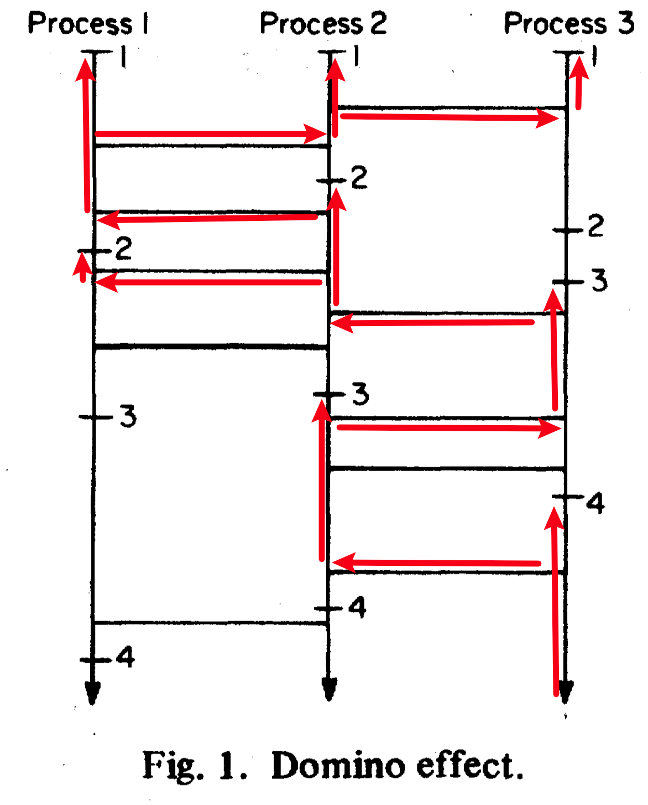
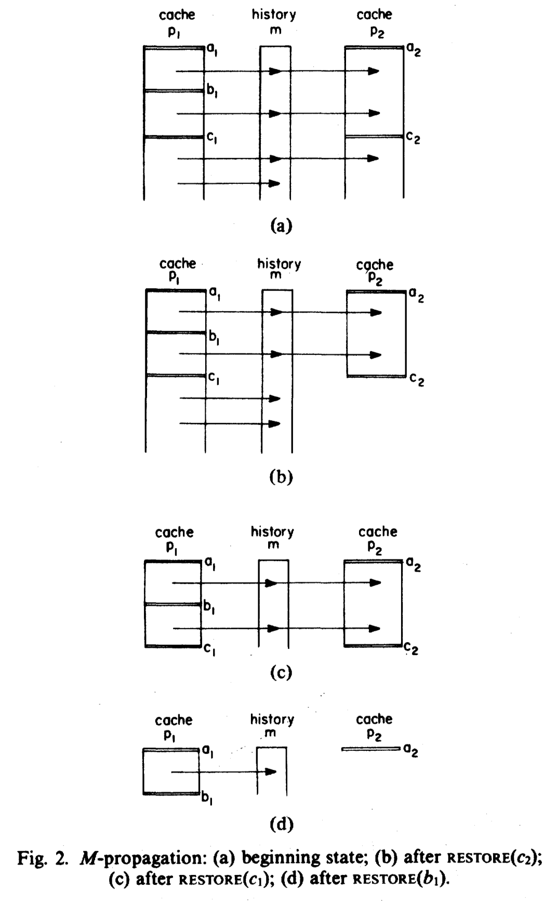
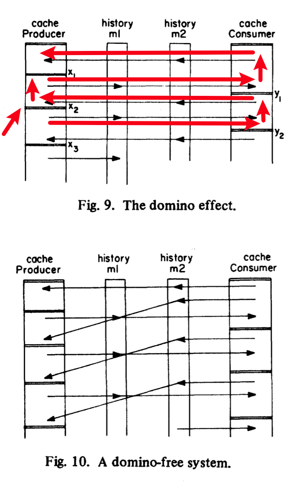

# Paper 4: State Restoration in Systems of Communicating Processes

```bibtex
@article{russell1980state,
  title={State restoration in systems of communicating processes},
  author={Russell, David L.},
  journal={IEEE Transactions on Software Engineering},
  number={2},
  pages={183--194},
  year={1980},
  publisher={IEEE}
}
```

In systems of asynchronous process using messagelists with SEND-RECEIVE primitives, recovery primitives are defined to perform state restoration: MARK (save state), RESTORE (recover to a saved state) and PURGE (discard).

If the processes interact in some way, correct system state restoration is complicated by the fact that state changes in one process may be **propagated** to another process. （也就是说，一个进程回档以后，在回档时间点之后的所有与其它进程的互动都会导致其它进程的状态需要回档；且这个过程是迭代递归的。）

!!! key-point "Domino Effect"
    The propagation can cascade if the processes interact in some ways.

    
    > Here the horizontal lines indicate the bidirectional interaction.

- This paper discusses state restoration in systems with **directed** process interactions.
- Checkpoints are defined individually by each process.
- The messagelist obey FIFO (First In First Out) order, and the system state is consistent, which means the order of messages will not be influenced by the transition speed.
- Each messagelist has a history tracked, and will be divided by `MARK`.

---

- `SEND(m, x)`: push message from variable `x` into messagelist `m`.
- `RECEIVE(m, x)`: pull message to variable `x` from messagelist `m`.

- `MARK`
- `RESTORE` does two things:
    - Process A itself is returned to state `x`.
    - Actions after `x` will be revoked, and this kind of revoking can trigger `RESTORE` of other processes (i.e., be **propagated**).
    - If a `RECEIVE` will be revoked, it only asks the messagelist to annotate the message as unreceived.
- `PURGE`



- The preceding example of system state restoration demonstrates the propagation of state restoration due to sent messages that are received and later revoked; this is termed **M-propagation**.


- Propagation of state restoration because a received message is replaced back into a messagelist and later received messages exist in the messagelist that make the system state inconsistent is termed **R-propagation**.

!!! key-point "R-normal System"
    An R-normal system is a system where R-propagation is never necessary during the execution of any `RESTORE`.

!!! property "Theorem 1"
    If, for all messagelists `m` of a system, the messages in `m` are received by **no more than one process**, the system is **R-normal**.

    （很好理解，如果一个消息队列只输出给一个 processor，那后发出的消息一定会被先 restore。）

!!! property "Theorem 2"
    A commutative system is R-normal.

    （即消息之间（至少被撤回的消息和之后的消息之间）可以随意切换顺序，此时由于不需要通过 R-propagation 来保证 consistency，所以也是 R-normal 的。）

!!! property "Theorem 3"
    If for all messagelists `m` of a system, either 1) the messages in `m` are received by at most one process or 2) `m` is a commutative messagelist, then the system is **R-normal**.

- Domino-free system is a system where no domino effect occurs.
- Domino effect is like: in the following image, if `RESTORE(x2)` is executed, the whole will be restored to initial state.



!!! property "Theorem 4"
    Let S be an R-normal system with `k` processes whose system graph is acyclic. Then S is **domino-free**.

    （按照我的理解，实际上最核心的是无环，这样才不会有多米诺效应，而 R-normal 实际上是保证不会因为 R-propagation 来间接产生坍塌环。即，两个 processor 本身可能没有环关系，但是由于 R-propagation，可能会 trigger 到链的上游，然后形成“链向下”-“R-propagation 回链上游”-“链向下”的循环。）

    Sufficient but not precise.

Now we want to define the "necessary undone".

If x and y are messagelist operations then xPy if any of the following three cases are satisfied:

1. x and y are in the same process and x occurs before y;
2. x and y are not in the same process, x = SEND of some message m1, and y = RECEIVE of that same message ml;
3. x and y are not in the same process, x = RECEIVE of a message m1 from messagelist m, y = RECEIVE of a message m2 from the same messagelist m, m1 occurs before m2 in the messagelist, and the system is not R-normal.

> xPy means that undoing messagelist operation x must propagate the restoration so that messagelist operation y is undone.

If the command `RESTORE(r)` initiates the state restoration, then let `b` be the earliest messagelist operation that occurs after `r` in the same process as recovery point `r`.
A messagelist operation `y` is necessarily undone if `bP\*y`, where `P\*` is the reflexive transitive closure of `P`.

If x and y are messagelist operations, then xQy if xPy or if x occurs after y in the same region of the recovery cache.（这是为了补足当一个 restoration 发生的时候，除了 xPy 会导致 y 被撤回，还有可能是因为它们在同一个 restoration block 中，会连坐撤回，其实也就是因为 MARK 的频率不够高导致的。）

If `RESTORE(r)` initiates the state restoration and `b` is the earliest messagelist operation that occurs after `r` in the same process as recovery point `r`, messagelist operation y is undone if bQ\*y, where Q\* is the reflexive transitive closure of Q.

Obviously, the messagelist operation `y` is **unnecessarily** undone if `bQ\*y` but not `bP\*y`.（也就是单纯连坐，这条信息之前没有任何其它 RECEIVE。）

Use D to calculate the unnecessary undone messagelist operations. If D has a bound, then the system is Domino-free.

!!! property "Theorem 5"
    Let `S` be an asynchronous system and suppose that a `MARK` command is executed just before every `RECEIVE` command. Then `S` is domino-free and `D = 0`.

    （通过证明都是 necessary undone 来证明是 domino-free 的。）

!!! definition "MRS process"
    An MRS process is a process where the `MARK`, `SEND`, and `RECEIVE` operations are performed in an order specified by the regular expression (`MARK`; `RECEIVE`\*; `SEND`\*)\*. Thus a `MARK` command is followed by any number of `RECEIVE` commands that are followed in turn by any number of `SEND` commands; this entire pattern is repeated indefinitely.

!!! property "Theorem 6"
    Let S be an R-normal, MRS system.

    Let the number of processes in the system be `k` and let the number of `RECEIVE` commands that each process performs between any two `MARK` commands be less than or equal to `s`.

    Then `S` is domino-free and `D <= (k - 1)(s - 1)`.

!!! property "Theorem 7"
    Let S be an MRS, R-normal system.

    Let the number of `RECEIVE` commands in process $p_i$ that are executed between any two `MARK` commands be less than or equal to $s_i$.

    Then `S` is domino-free and:

    $$
    D \leq \max_{i=1} \sum_{j\not=i} (s_j-1) = \sum_j(s_j - 1) - \min_{j}(s_j - 1)
    $$

!!! property "Theorem 8"
    Let `S` be an MRS, R-normal system.

    Then `S` is domino-free.e