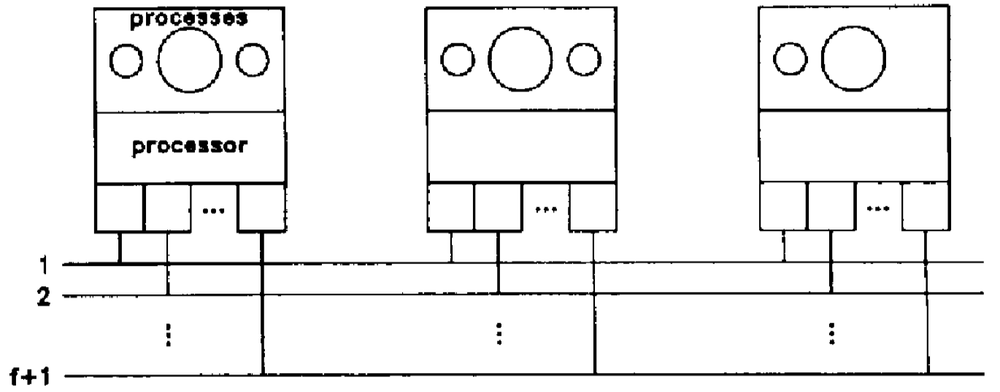

# Paper 2: Synchronous Atomic Broadcast for Redundant Broadcast Channels

```bibtex
@article{cristian1990synchronous,
  title={Synchronous atomic broadcast for redundant broadcast channels},
  author={Cristian, Flaviu},
  journal={Real-Time Systems},
  volume={2},
  number={3},
  pages={195--212},
  year={1990},
  publisher={Springer}
}
```

A synchronous atomic broadcast protocol ensures the existence of a time constant A such that, even if up to $f$ failures occur during a broadcast, the following properties are satisfied.

- **Atomicity**: if any correct processor delivers an update at time $U$ on its clock, then that update was initiated by some processor and is delivered by all correct processors at time $U$ on their clocks;
- **Ordering**: all updates delivered by correct processors are delivered in the same order by each correct processor;
- **Termination**: every update whose broadcast is initiated by a correct processor at time $T$ on its clock is delivered by all correct processors at time $T + \Delta$ on their clocks.

!!! key-point "System Model & Assumptions"

    

    - $n$ processors
    - $f+1$ adapters for each processor
    - $f+1$ independent channels

    Assumptions:

    - Bounded broadcast rate.
    - Broadcast channels suffer only omission failures.
        - Define the channel transition bound time as constant $C$
    - Out-adapters suffer only performance failures.
        - Define the signal issue delay bound as constant $O$.
    - In-adapters suffer only omission failures.
        - Define the signal reading delay bound as constant $I$.
    - Processors suffer only crash failures.
        - Define the command invoking delay bound as constant $P$.
    - Processors have access to correct clocks that are approximately synchronized.
        - Define the clock deviation bound as constant $\epsilon$.
    - Tasks can be scheduled for certain deadlines.
    - At most $f \leq n - 2$ components can be **faulty** during a broadcast.

    Thus, without any failure, any update $\sigma$ accepted for broadcast by a processor $s$ at time $T$ on its clock, is received and processed by any correct processor $q$ by time $T$ + $\delta$ + $\epsilon$ on $q$'s clock, were $\delta = P + O + C + I + P$ denotes the processor- to-processor message delay bound.

To ensure the order of delivery, for each processor, we define a protocol termination time $\Delta = \delta + \epsilon$, so that for each processor, it will not begin the delivery of updates timestamped $T$ before time $T + \Delta$ on its clock, at which point it is certain that it has received all updates with timestamp at most $T$ that it may ever have to deliver.

- Define a hop count $h$.
    - Each time a processor forwards message $m$, $h$ is incremented by $1$.

So a message $(T, s, \sigma, h)$ will not be ignored if: $U < T + h \cdot (\delta + \epsilon)$.

!!! property "Worst Case Delay to First Correct Processor"
    1. If $f = 2k\;,\;\;k\geq 1$, then $\Delta = (k + 1)(\delta + \epsilon)$ is an acceptable broadcast termination time.
    2. If $f = 2k + 1\;,\;\;k\geq 1$, then $\Delta = (k + 2)(\delta + \epsilon)$ is an acceptable broadcast termination time.

!!! key-point "Lazy Forwarding Rule"

    1. A sender $s$ enqueues messages $(T, s, a, 1)$ on its out-adapters to channels $1, 2, \dots f + 1$ in this order.
    2. Denote $(T, s, a, h), h < k$, be a message accepted by a processor $p \not= s$, and let $c$ be the highest channel on which $p$ receives a copy of the message by local time $T + h(\delta + \epsilon)$.
        - If at $T + h(\delta + \epsilon)$ on $p$'s clock:
            1. $c < f + 1 - h$, then $p$ forwards $(T, s, a, h + 1)$ on channels $c + 1,\dots f + 1 - h$;
            2. Otherwise, $p$ does not forward.

!!! property "Lemma"
    Let $(T, s, o, h), h \leq k$, be a message accepted by a processor $p$ and let $c$ be the highest channel on which $p$ receives a copy of the message by local time $T + h(\delta + \epsilon)$.

    - If at time $T + h(\delta + \epsilon)$ on $p$'s clock:
        1. $c \leq f + 1 - h$, then at least $h$ component failures have occurred since the broadcast was initiated;
        2. $c > f + 1 - h$, then at least $h - 1$ component failures have occurred since the broadcast was initiated.

    !!! proof "Intuitive Proof"
        The previous processor has already received $(h-1)$ failures since the hop count is $h$ already.

        - If $c \leq f + 1 - h$, then this message is forwarded since the previous processor failed somehow, so that the current processor can't receive messages from higher channels. (Because the previous processor will at least forward the message to $f + 1 - (h-1)$ channels if there are no other failures.) So it indicates $(h-1)+1=h$ failures.
        - If $c > f + 1 - h$, then this is just the another case of the previous situation, the previous processor successfully forwarded the message to some higher channels. So it indicates $(h-1)$ failures.

!!! property "The Unanimity Property"
    If a correct processor $p$ (one that does not crash during the broadcast) accepts a broadcast by time $T+\Delta$ on $p$'s clock, then each correct processor $q$ accepts the broadcast by time $T+\Delta$ on $q$'s clock.
