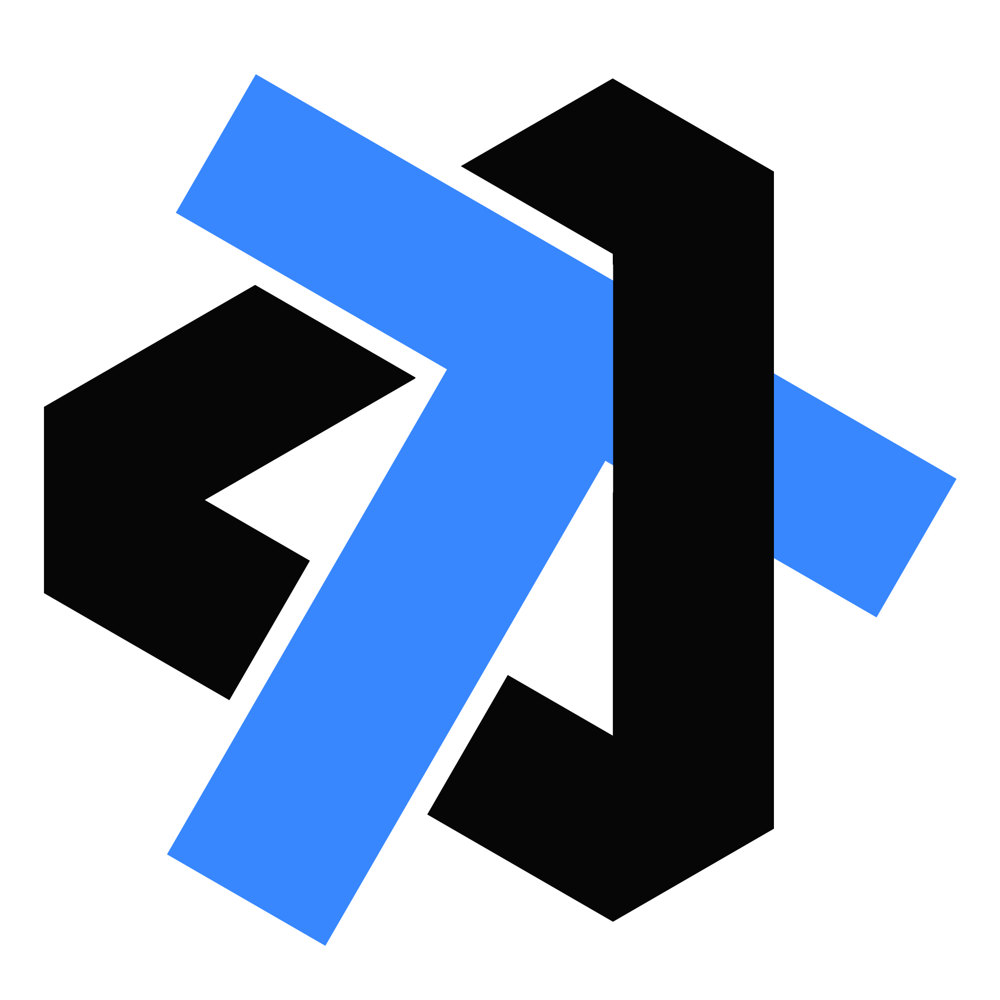

# 你好！

!!! info "📜 介绍"

    你好！我想为这个小网站赋予一些社交价值，想认识更多厉害的人！欢迎大家在这里聊天，或是留下友链交换！

!!! summary "🔗 友链"

    

    

        

            
        

        <a href="https://blog.isshikih.top/" title="颉时人影" target="_blank">
            
颉时人影

            
这是我的博客！时不时更新一些和技术没关系的文章。

        </a>
    

    

            

                
            

        <a href="https://xuan-insr.github.io/" title="咸鱼暄 的 代码空间" target="_blank">
            
咸鱼暄 的 代码空间

            
臭光头，暴揍xyx！

        </a>
    

    

            

                
            

        <a href="https://note.tonycrane.cc/" title="鹤翔万里 的 笔记本" target="_blank">
            
鹤翔万里 的 笔记本

            
 🤤 xg 教死我！

        </a>
    

    

            

                
            

        <a href="https://blog.gzti.me/" title="GZTime's Blog" target="_blank">
            
GZTime's Blog

            
 🤤 gzgg 教死我！

        </a>
    

    

            

                
            

        <a href="https://zicx.top/notebook/" title="Zicx 的 笔记本" target="_blank">
            
Zicx 的 笔记本

            
 🤤 是超强旭宝！

        </a>
    

    

            

                
            

        <a href="https://sakuratsuyu.github.io/Note/" title="sakuratsuyu 的 笔记本" target="_blank">
            
sakuratsuyu 的 笔记本

            
 🤤 无敌麦哥带带我！

        </a>
    

    

            

                
            

        <a href="https://note.bowling233.top/" title="Bowling 的 笔记本" target="_blank">
            
Bowling 的 笔记本

            
 被神仙学弟薄纱 orz 

        </a>
    

    

            

                
            

        <a href="https://note.minjoker.top/" title="MinJoker 的 笔记本" target="_blank">
            
MinJoker 的 笔记本

            
 被神仙学弟薄纱 orz 

        </a>
    

    

            

                
            

        <a href="https://www.zizheng.life/" title="Zizheng's Blog" target="_blank">
            
Zizheng's Blog

            
 佬！ 

        </a>
    

    

            

                
            

        <a href="https://ralvines.top/" title="暮瞻 Blog" target="_blank">
            
暮瞻 Blog

            
 以我观物，故物皆着我之色彩。 

        </a>
    

    

            

                
            

        <a href="https://mem.ac/course/" title="memset0 的 Blog" target="_blank">
            
memset0 的 Blog

            
 在海月的虚空中，纵身飞过秋凉的时鸟。 

        </a>
    

    

            

                
            

        <a href="https://wcowin.work/" title="Wcowin’s Web 的 Blog" target="_blank">
            
Wcowin’s Web

            
 循此苦旅，以达星辰。 

        </a>
    

    

            

                
            

        <a href="https://lennychen.top" title="Lenny’s Web" target="_blank">
            
Lenny’s Web

            
 天地不仁，以万物为刍狗。 

        </a>
    

    

            

                
            

        <a href="https://lyk-love.cn/" title="LYK-love’s Web" target="_blank">
            
LYK-love’s Web

            
 NJU 19, UC Davis 23. Deep learning researcher. 

        </a>
    

    

            

                
            

        <a href="https://Auzers.github.io/notes/" title="am 的 笔记本" target="_blank">
            
am 的 笔记本

            
 ZJU 24. 

        </a>
    

    

            

                
            

        <a href="https://www.philfan.cn" title="PhilFan 的 笔记本" target="_blank">
            
PhilFan 的 笔记本

            
 Learn, build, share. 

        </a>
    

    

            

                
            

        <a href="https://WalkinDadHH.github.io/notes/" title="WalkinDadHH's Notebook" target="_blank">
            
WalkinDadHH 的 笔记本

            
 流离之人追逐幻影。 

        </a>
    

    

??? tip "🔗 有意思的链接"

    在这里收集一些有意思的链接！

    - 各种常用工具文档速查：https://quickref.me/
    - Emoji 快速匹配：https://emojispark.com/
    - 各类配色工具：
      - https://colorhunt.co/
      - https://colorsite.librian.net/
    - ffmpeg 指令生成：https://alfg.dev/ffmpeg-commander/
    - 缩写生成器: https://acronymify.com/