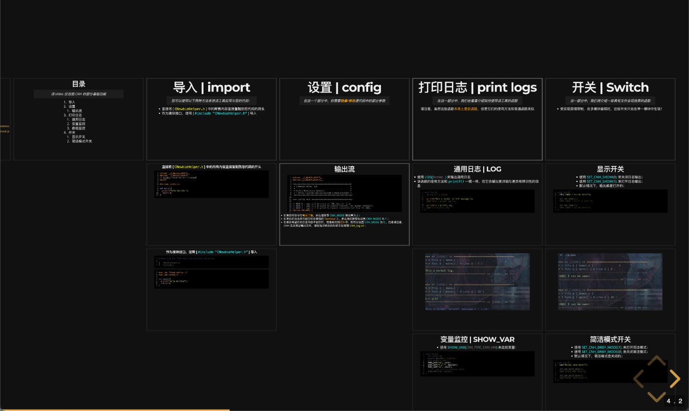
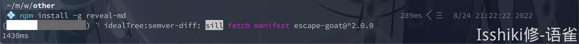
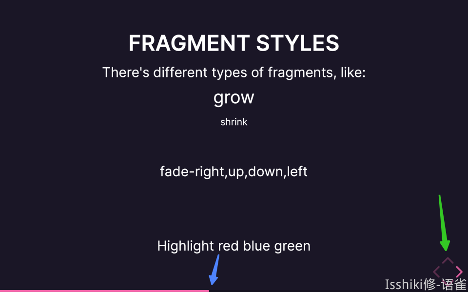
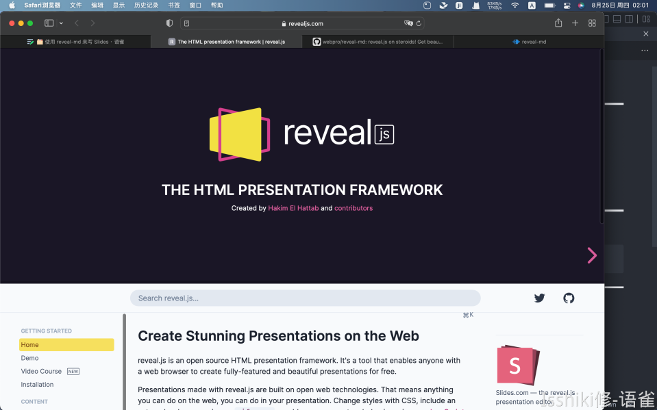
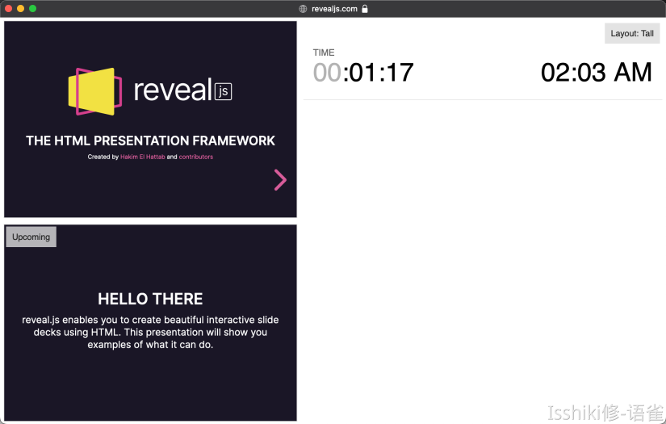
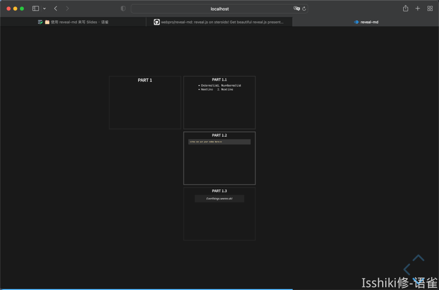
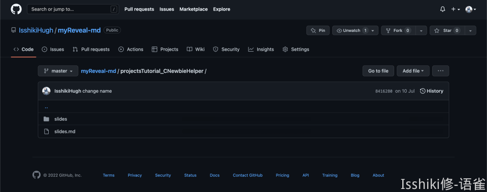

# 使用 reveal-md 来写 Slides

!!! info "前言"
    - 本文面向 <u>认为 PPT 并不高效，但同时又确实需要一种「演示」途径</u> 的偏技术人员；
    - 虽然工具基于前端技术栈，但前端知识仅决定工具使用上限，完全可以做到无前端基础进行基础使用；
    - 我并没有尝试过脱离命令行来实现这些，但是我觉得大概“偏技术”人员不应当不会使用命令行，至少你要知道在哪里能运行命令；此外，您需要确保您的命令行环境能够使用 [npm](https://www.npmjs.com/)；

## 简介

`reveal-md` 是 `reveal.js` 的一个扩展工具，类似于一个预编译工具。利用 `reveal-md`，你可以通过编写一个 `Markdown` 文件来快速简便地生成一个基于网页的 Slides，你也可以将它导出为静态资源并部署在类似 github pages 等平台来分享静态页面。

- `reveal.js` 的官方 demo：[🔗](https://revealjs.com/?demo)
- 我自己写的一个 project：[🔗](https://isshikihugh.github.io/C-Newbie-Helper/tutorials/simple/slides.html#/)
- `reveal-md` 的 github repo：[🔗](https://github.com/webpro/reveal-md)

### 为什么我不用 PPT 和语雀“文档演示模式”

在这篇文章和语境中，我想大概将「演示」所使用的形式分为三种：

- PPT 等图形化的「演示」文档制作平台；
- 使用`Beamer`、`reveal.js`、`nodeppt`等工具，使用代码编写「演示」文档；
- 语雀的「文档演示模式」；

---

恰好，语雀推出演示文稿的时候有说明为什么他们要开发这样一个东西。

> [再见PPT，你好“文档演示模式”](https://www.yuque.com/yuque/blog/nxe6vv?view=doc_embed)

我非常赞同这篇文章中对于 PPT 的叙述，我也很讨厌 PPT ，它确实可以做很多事，但是对我来说没必要，我也用不到。而且身为破写代码的，我对那种所谓的高级感并没有什么感觉。而且 PPT 有一个致命的缺点就是它的分享非常不方便，你必须要通过「文件」来传递你的材料，而且还收到展示设备的环境限制，而其他两种方法都可以很方便的解决这个问题。

回到「文档演示模式」，诚然，在某些特定的时间，文档演示确实能便捷的解决许多问题，但是我不觉得目前的文稿演示能成为 Slides 的替代品。它确实便捷且高效，但是并不好看，也并不清晰——而且说回来，其实也不方便（为什么我之后会讲）。
简单讲了一下我对其他两种途径的看法，关于通过代码途径编写「演示」文档我当然也有话说，但是我想把他们放在后面。

---

接下来，我想从「使用体验」的角度来评价一下上面已经提过的两个途径。

在我看来，PPT 之所以累赘且低效，是因为大部分人浪费时间在于与核心内容并不直接相关的美工上。而从工作流程上来讲，除非我精通 PPT 且有时间，否则我不会亲自去做 PPT，而是和美工对接，让他们来做。可这样一来问题就出现了，“对接”这件事未必比做 PPT 轻松。又或者我这个 PPT 是我自己需要的，那我就得硬着头皮花费时间去钻研如何做一个好看的 PPT，结果浪费大把时间做出来的可能还是个连油腻都说不上的东西。

而回到语雀的「文档演示模式」，~~说来可笑，我写这一行的时候就又出了 bug~~。诚然「文档演示模式」是一个很好的 Idea，但是语雀自身大大小小的问题到处都是，本来作为一个效率工具却总是在意料之外的地方遇到很糟心的 Bug ，这着实很影响效率（关于这方面的吐槽我就不放在这里说了，以防偏题）。

在这样一个基础下，出现了问题但是我们无法，或者说快速排查，或者说是退而求其次寻找别的实现办法，都是不方便的。换句话来说就是这个功能自身的稳定性就不能保证，而其实现对使用者来说也并不足够简单透明，导致使用起来会需要承担很多不确定的风险。（顺便吐槽一句，使用语雀的这一年我体感上影响体验的 Bug 是越来越多了……）

### 为什么我用 reveal\*

那么，通过代码来制作「演示」材料又怎么样呢？首先是 `Beamer`，大概也是最有名的，其基于 $\LaTeX$ 实现，其在排版上的可控性不言而喻，但是写过的人都知道 $\LaTeX$ 写起来多费心；而[reveal.js](https://github.com/hakimel/reveal.js) 以及 [nodeppt](https://github.com/ksky521/nodeppt) 是我找到过的两个比较满意的，通过代码来写 Slides 的工具。我并不打算在这里把他们两个都详细的介绍一遍，但是我希望简单表达一下我对这两个东西的看法。

首先，在我的理解中，`nodeppt` 对美化是比 `reveal.js` 要好一些的，即，抛开花费在里面的时间不说，就结果而言，使用 `nodeppt` 会比 `reveal.js` 好看一些，排版更自由一些。但是从「效率」来说，我倾向于 `reveal.js`。
理由很简单，`reveal.js` 的分页逻辑深得我心：


> 我自己写的某个 Slides 的结构速览

可以发现，页面有纵向和横向两个扩展方向，这非常符合层次化的思维逻辑，也很符合文档的编写逻辑，并且总体而言 **没有什么花里胡哨但是没啥用的东西**，具有一种奥卡姆剃刀的美感。然而这并不意味着它的美工上限很低，恰恰相反，不仅 `reveal.js` 的内置动画和风格就很舒适，而且无论是 `reveal.js` 还是 `nodeppt`，他们的本质都是静态网页，你大可以用你的前端技能来美化它——当然， 对我来说这些东西就没啥必要了。
以上都是关于效果的叙述，那它是否真的写起来很方便呢？其实我感觉原生的 `reveal.js` 写起来并不方便，我一开始甚至不知道要如何创建一个新的文档。但是我后来发现了`[reveal-md](https://github.com/webpro/reveal-md)`这个工具。利用`reveal-md`，你可以真正意义上的实现使用`markdown`语法来写一个 Slides。

## 安装与演示

确保您的`[npm](https://www.npmjs.com/)`能够正常使用，接下来安装`reveal-md`你只需要使用如下命令即可。

```shell
npm install -g reveal-md
```



安装完成后，你就可以将 `reveal-md` 当作一个 console app 来使用，输入 `reveal-md --help` 来查看命令详细的使用方法。

??? summary "help list"
    ```shell
    Puppeteer unavailable, unable to create featured slide image for OpenGraph metadata.
    Puppeteer unavailable, unable to generate PDF file.
    Usage: cli <slides.md> [options]

    See https://github.com/webpro/reveal-md for more details.

    Options:
      -V, --version                               output the version number
          --title <title>                         Title of the presentation
      -s, --separator <separator>                 Slide separator [default: 3 dashes (---) surrounded by two blank lines]
      -S, --vertical-separator <separator>        Vertical slide separator [default: 4 dashes (----) surrounded by two blank lines]
      -t, --theme <theme>                         Theme [default: black]
          --highlight-theme <theme>               Highlight theme [default: zenburn]
          --css <files>                           CSS files to inject into the page
          --scripts <files>                       Scripts to inject into the page
          --assets-dir <dirname>                  Defines assets directory name [default: _assets]
          --preprocessor <script>                 Markdown preprocessor script
          --template <filename>                   Template file for reveal.js
          --listing-template <filename>           Template file for listing
          --glob <pattern>                        Glob pattern to select markdown files for listing and conversion [default: **/*.md]
          --print [filename]                      Print to PDF file
          --static [dir]                          Export static html to directory [_static]. Incompatible with --print.
          --static-dirs <dirs>                    Extra directories to copy into static directory. Only used in conjunction with --static.
      -w, --watch                                 Watch for changes in markdown file and livereload presentation
          --disable-auto-open                     Disable auto-opening your web browser
          --host <host>                           Host [default: localhost]
          --port <port>                           Port [default: 1948]
          --featured-slide <num>                  Capture snapshot from this slide (numbering starts from 1) and use it as og:image for static build. Defaults to first slide. Only used with --static.
          --absolute-url <url>                    Define url used for hosting static build. This is included in OpenGraph metadata. Only used with --static.
          --print-size                            Paper size to use in exported PDF files
          --puppeteer-launch-args <args>          Customize how Puppeteer launches Chromium. The arguments are specified as a space separated list (for example --puppeteer-launch-args="--no-sandbox --disable-dev-shm-usage"). Needed for some CI setups.
          --puppeteer-chromium-executable <path>  Customize which Chromium executable puppeteer will launch. Allows to use a globally installed version of Chromium.
      -h, --help                                  output usage information
    ```
在我自己的使用过程中，我认为比较核心的两条命令如下：

```shell
## 最基础的命令，根据 Markdown 文件在本地 1948 端口生成 Slides 服务。
$ reveal-md your-md-file.md

## 为了实现在线部署，需要导出为静态资源。
$ reveal-md your-md-file.md --static your-static-dir
```

也就是说，你只需要编写一个md文件，并使用这些指令就能生成 reveal.js Slides。
接下来以官方 demo 为例介绍一下使用。运行指令以后会在 1948 端口启动服务，一般会直接通过浏览器打开。
在 PC 端口：

- 通过点击/ 空格来选择下一页，使用 `h/←` `j/↓` `k/↑` `l/→` 或者点击右下角的方向盘来进行上下左右切换，直接点击页面底部的进度条也可以实现页面跳转。



- 按下 `f` 来全屏显示，按下 `Esc` 或者 `f` 退出。

|||
|:--:|:--:|
|按 `f` 之前。|全屏显示。|

- 按下`s`进入演讲者模式，也就是再多跳出来一个弹窗，在实际使用中可以在投影仪里放全屏，在自己电脑上展示这个窗口。修改右上角的 Layout 可以修改显示模式。`Notes` 的内容会在后面介绍，类似于 PPT 的备注。



- 按下`o`进入总览视图，可以利用方向键进行移动，回车或点击进行选择。需要注意，这里显示的内容和实际展示的页面内容在布局上存在差异。


- 按下`v`或`.`黑屏。

---

而在移动端（比如访问某个实例的在线部署时），基本的点击操作是一样的，此外，带有方向的滑动可以对应方向键功能。


## 文档编写

在这部分，我并不打算按照模块化、系统化的流程来编写教程，这些你在官方文档中都能找到——我并不觉得“字典”是一个很好的学习途径，就像我们一般不建议用《C++ Primer》入门 C++，更不会建议外国友人通过《新华字典》来学习汉语。
我将按照我对这个工具的理解，按照由浅入深，按照必要程度来介绍内容。它可能看起来会又些混乱，但是我觉得它是符合实践顺序的，如果让你觉得看起来很费劲，可以搭配官方文档来使用，或者直接告诉我。
此外，其中可能不会涉及一部分我个人不太喜欢的东西，比如同样可以通过配置文件和命令参数的行为，我会选择只介绍配置文件的方案。如果你对另外一种方案感兴趣，可以详细阅读文档或者帮助菜单。此外，本文章也不会涉及 `reveal-md` 的所有内容，而更多的是一个抛砖引玉或者说基础使用的教程。部分需求可能是面向特殊用户群体的，还是那句话，如果有兴趣可以查看官方文档。

### 分页

首先，如果你用一个再普通不过的 Markdown 文件来创建 Slides，比如：

```markdown
## Part 1

### Part 1.1

- Orderred List
- Next Line

1. Numberred List
2. Next Line

### Part 1.2

{code block here}

### Part 1.3

> Everthings seems ok!
```

那么运行以后我们会得到这样一个页面：


可以发现，它并不像我们想的那样，向横向和纵向扩展。但是这恰好说明所有东西都是可控的，而不是莫名其妙的根据某个标题就自动换掉，进而导致一系列诡异的问题。

在 reveal-md 中，有两种 separator 和 vertical separator 两种，顾名思义，分别对应着左右分页和上下分页。默认情况下，separator 是 `\n---\n`，而 vertical separator 是 `\n----\n`。所以稍微对上面的文档进行一些修改：

```markdown
### Part 1

---

#### Part 1.1

- Orderred List
- Next Line

1. Numberred List
2. Next Line

----

#### Part 1.2

{code block here}

----

#### Part 1.3

> Everthings seems ok!
```

再次运行就能发现我们的 Slides 已经有了二维的层级结构：


> 虽然这里的预览图里看起来排版很丑，但是实际展示的时候都是默认居中，不喜欢的话可以改相关设置或者用 html 标签修改。

那么其实到此为止，你已经能够通过`reveal-md`来实现非常快速的 Slides 编写了。但是为了定制主题，或者是使用一些更高级的东西，我们还需要介绍一些别的东西，包括对某些东西的自定义、某些模块的扩展功能、与原生`reveal.js`语法的混用。
在正式进入下一个部分之前，我想补充介绍一下如何修改默认的 separator：
有两种方案能实现 seperator 的自定义，一种是通过在命令行中的附加参数实现，另一种则是在`md`文件开头写好配置文件实现。


```markdown
---
separator: <!--s-->
verticalSeparator: <!--v-->
---
```

- 这里将 `<!--s-->` 设为 separator，将 `<!--v-->` 设为 vertical separator。
- 这一部分内容需要放在 `md` 文件的开头，之后会详细介绍。

这里我才用第二种方案来改装我们的 `md` 文件现在得到：

```markdown
---
separator: <!--s-->
verticalSeparator: <!--v-->
---

### Part 1

<!--s-->

#### Part 1.1

- Orderred List
- Next Line

1. Numberred List
2. Next Line

<!--v-->

#### Part 1.2

{code block here}

<!--v-->

#### Part 1.3

> Everthings seems ok!
```

而在这种情况下，除了开头配置文件的部分，其他的 `---` 则会被认为是 `md` 的语法，渲染为正常的分割线。

### 代码框

首先，在 `reveal-md` 中使用代码框和在 `markdown` 中使用是一样的，只不过 `reveal.js` 对代码框有更多的支持，而 `reveal-md` 将这种支持融合进了 `markdown` 的语法。我在这里主要想介绍的是代码框高亮行动画。

不知道你有没有遇到过这种情况，我们需要贴出一段代码，但是有些部分并不是重点，但是不放上去又觉得怪怪的；又或者你的代码里有多个重点，你需要在展示时手动告诉大家哪里是重点？`reveal*` 可以做到按行高亮代码，并且能够实现动画。这么说有点抽象，可以体验一下[这一页 Slide](https://isshikihugh.github.io/C-Newbie-Helper/tutorials/simple/slides.html#/3/1)。

|||
|--:|:--|
||可以发现，不仅高亮了，而且还有自动滚动到中心。||

那么要如何实现呢？我们知道，在`Markdown`中使用代码框的语法如下：

```markdown
- 前面的数字是为了标记它们属于代码框的第几行而写的，实际不需要写这些数字（废话）
- 反斜杠是为了防止md渲染错误，实际上不需要加

\```cpp
1		#include <iostream>
2		int main(){
3			std::cout << "Hello World!\n";
4  		return 0;
5		}
\```
```

那么，为了实现高亮，我们只需要在语言后面加上一个方括号 `[...]` 来标记高亮行即可，比如 `[2-5]` 就是标记 2～5 行，也就是整个 `main()` 函数。此外，你还可以用`|`来分隔多个高亮块，来实现动画的效果，例如 `[1|2-5]` 就是先高亮预编译，再高亮 `main()` 函数。

```markdown
---
separator: <!--s-->
verticalSeparator: <!--v-->
---

### Part 1

<!--s-->

#### Part 1.1

- Orderred List
- Next Line

1. Numberred List
2. Next Line

<!--v-->

#### Part 1.2

\```cpp[1|2-5]
#include <iostream>
int main(){
	std::cout << "Hello World!\n";
    return 0;
}
\```

<!--v-->

#### Part 1.3

> Everthings seems ok!
```

### 格式支持

在文本格式排版方面，`Markdown` 的原生语法都是支持的，此外你当然也可以使用 `html` 标签来编辑你的文字，例如修改颜色、设置居中/靠左/靠右、修改大小……
例如，上面展示的那张展示代码高亮的 Slide 的初始代码如下：

```markdown
### 输出流

\```c[1-19|13-16]
#ifndef __C_NEWBIE_HELPER__
#define __C_NEWBIE_HELPER__
/****************************************************
 * C Newbie Helper 1.0                              *
 * ------------------------------------------------ *
 * Github Repository Address:                       *
 * - https://github.com/IsshikiHugh/C-Newbie-Helper *
 ****************************************************/
/*** Config Part ************************************/
// MODE 0 : Logs will be write to 'CNH_log.txt' file.
// MODE 1 : Logs will be print to console (colorful for normal terminal).
// MODE 2 : Logs will be print to console (colorless but fine for CMD).
#define CNH_MODE 2
...
\```

<font size="6">

- 如果你对命令行<font color="orange">毫无了解</font>，那么请检查 <font color="cyan">CNH_MODE</font> 被设置为 <font color="cyan">2</font> ；
- 如果你的日志将会被打印在常规的 <font color="orange">Terminal</font> 上，那么我们推荐你设置 <font color="cyan">CNH_MODE</font> 为 <font color="cyan">1</font> ；
- 如果你希望你的日志内容不被打印，而是输出到<font color="orange">文件</font>中，则可以设置 <font color="cyan">CNH_MODE</font> 为 <font color="cyan">0</font> ，但是请注意，CNH 无法清空输出文件，请在每次输出的时候手动清理 <font color="yellow">CNH_log.txt</font> ；

</font>
```
> 根据我的观察，如果需要在`html`标签里使用`Markdown`语法，最好在标签和语法之间加空行。

## 定制与美化
这里我提供一个我自己的源`md`文件开头配置的模板：

```shell
---
title: Title
separator: <!--s-->
verticalSeparator: <!--v-->
theme: league
highlightTheme: tomorrow-night-bright
revealOptions:
  width: 1520
  height: 950
  margin: 0.04
  transition: 'convex'
  slideNumber: true
---
```

- `title` 即显示在网页标签上内容；
- `(vertical)separator` 即之前提到过的两个 `separator`；
- `theme` 为 Slides 主题，可供使用的官方默认主题可以看这里：[🔗](https://revealjs.com/themes/)；
- `highlightTheme` 为代码框高亮主题，官方对高亮主题的说明在这里：[🔗](https://revealjs.com/code/)；
- `revealOptions` 则对应了 `reveal.js` 中 [config](https://revealjs.com/config/) 的内容；
   - 这一块不只这些内容，涉及的内容非常多，`reveal.js` 官方的文档中都有详细的内容，我这里列出了 **宽**、**高**、**边界**、**换页动画**、**标号** 等。

> 我这里填写的是我自己认为比较舒服而且好看的。当然，如果本地对应资源文件里有您自己编写的资源也是可以用的。但是这一块我的钻研也不是特别深，我本身也不是前端人，所以只能介绍到这里了。

## 通过 GitHub Pages 实现静态部署

在这个章节中，我将介绍如何利用 GitHub Pages 实现 Slides 的部署，在诸如 Gitee Pages 的平台实现这些功能的流程也是类似的。
首先你需要创建一个 Repo 来存放你的静态资源，例如。我个人的做法是直接把初始的 `md` 文本和静态资源文本都放在一个地方了。
接下来，我们需要导出静态资源，使用的是这条指令：

```shell
reveal-md your-md-file.md --static your-static-dir
```

接下来，你会得到一个文件夹，包含这个 Slides 所需要的所有资源。你只需要将它传到你的 Repo 里即可。
例如我的仓库中：



进入`repo/.../static-dir`，也就是上图的`slides`，我们可以看到类似这样的一些文件：


其中的 `index.html` 和 `slides.html` 都是 Slides 的 `html` 文件。区别貌似是 `index.html`会 有一个弹窗告诉你使用的是 `reveal.js`。

接下来，设置 pages 服务以后通过 `https://<github_id>.github.io/<repo_name>/.../slides.html` 即可访问到页面啦！
例如上方这个仓库对应的 `URL` 是 `https://isshikihugh.github.io/myReveal-md/projectsTutorial_CNewbieHelper/slides/slides.html`。

利用 Pages 服务，就可以快速便捷地分享你的 Slides，对于不懂技术的人来说不仅表现效果不差，而且还有一丝逼格。不过在国内或许访问不太稳定，所以可以考虑使用 Gitee Pages 来实现。不过 Gitee Pages 服务每一次都需要你自己去更新一下，还有一些审核机制。

---

## 一些坑

`reveal-md` 已经有大概一年的时间没有维护了，其中也遇到一些问题，我遇到了一些就记下来。

- 这个问题我还提了个 issue，里面也附了解决的办法：[--static with --theme generate the `index.html` with the wrong path of `theme.css`](https://github.com/webpro/reveal-md/issues/439)
- 在使用 gh-page 进行部署，并且指定了额外的 `css` 文件的时候，一定要添加 `--assets-dir assets`，否则默认的素材文件夹的名字是 `_assets`，而 `_` 开头的文件夹会被 gh-page 忽略。


