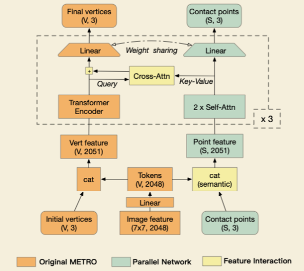

# [SA-HMR] Learning Human Mesh Recovery in 3D Scenes

`3DV` `HMR` `Scene-Aware`

!!! info "文章信息"
    - 文章题目：*Learning Human Mesh Recovery in 3D Scenes*
    - 作者：
        <a href="https://zehongs.github.io/" target="_blank">Zehong Shen</a>, 
        <a href="https://github.com/anitacen" target="_blank">Zhi Cen</a>, 
        <a href="https://pengsida.net/" target="_blank">Sida Peng</a>, 
        <a href="https://chingswy.github.io/" target="_blank">Qing Shuai</a>, 
        <a href="http://www.cad.zju.edu.cn/bao/" target="_blank">Hujun Bao</a>, 
        <a href="http://xzhou.me" target="_blank">Xiaowei Zhou</a>
    - 项目主页：[🔗](https://zju3dv.github.io/sahmr/)
    - 论文：[🔗](https://openaccess.thecvf.com/content/CVPR2023/papers/Shen_Learning_Human_Mesh_Recovery_in_3D_Scenes_CVPR_2023_paper.pdf)
    - 代码：[🔗](https://github.com/zju3dv/SA-HMR/)
    
---

## 笔记

### 任务定义
- SA-HMR = scene-aware human mesh recovery
- 预先给定扫描好的场景，再根据单张照片估计人的绝对位置和姿势

### 优势与贡献
- 相比传统的通过优化迭代的生成办法，本方法在推断过程中更加迅速；
- [x] **问题**：最优化中的 contact regions 的 chamfer distance 约束是为了什么？ 尽可能增加一团的聚合性？ 是。

概括贡献：

1. 非优化做法的，场景感知的、单照片、预给场景的人体网格恢复框架；
2. 预训练的 HMR 网络与平行网络的机遇 cross-attention 的处理设计，是西安了对人体姿势和场景几何特征的联合学习；
3. 在准确度和速度上都薄纱优化做法的基线；

### 方法

- 估计人体的全局位置(absolute human position)、场景接触点(dense scene contacts)、以及一个场景感知的人体网格(scene aware human mesh)；
- 准备工作：
	- 人体
		- 使用 SMPL 来表示人体，计算网格顶点 $V\in\mathrm{R}^{6890\times 3}$；
		- 使用 H36M 关键点回归矩阵(joint regression matrix) $M \in \mathrm{R}^{14\times 6890}$；
			- [x] **问题**：这是什么？ 一个 from smpl to h36m 的矩阵。
		- 计算 3D 关键点 $J\in \mathrm{R}^{14\times 3} = MV$；
	- 场景
		- 用一个 bbox 去框选目标人体；
		- 转化为特定大小的图像 $I \in \mathrm{R}^{224\times 224\times 3}$；
		- 根据给定的图像区域和相机参数，得到对应于空间中的一个视锥体空间，选取这部分点云作为输入的点云 $S \in \mathrm{R}^{N_S \times 3}$；
	- 人与场景的接触
		-  使用 7 个最容易成为接触点的区域和 1 个表示不接触的区域，这 8 个标签在点云中做分割任务；
- 人体根位置和场景接触点的估计：
	- 概述
		- 首先使用一个稀疏 3D CNN 来估计密度场景的接触点——点云标签任务(point cloud labeling task)和绝对的人体位置——投票向量场修正任务(voting vector field refinement task)，根据得到的结果，以绝对位置为中心表示接触点；
			- [x] **问题**：什么是 voting vector field refinement task？后面有写。
	- 粗估根
		- 使用一个 CNN 得到一个热图和归一化的深度图；
		- 从热图中能使用 `argmax` 得到初始的人体根部座标 $(x,y)$，从深度图中估计出 $\tilde Z$；
		- 利用相机内参可以计算出 3D 空间中的座标 $(X,Y,Z)$：
			- $Z = \tilde{Z} \frac{f}{w},\quad X = \frac{x - c_x}{f} \cdot Z,\quad Y = \frac{y-c_y}{f}\cdot Z$
		- 从结果来看，$(x, y)$ 的估计是比较准确的，但 $\tilde{Z}$ 的效果比较差；
	- 3D 特征构造
		- 在点云中寻找 ROI——以 $r=(X,Y,Z)$ 为中心，$\gamma_1$ 为半径的球形区域，由 $\tilde{Z}$ 的估计并不准确，所以在距离 $\gamma_2$ 的、沿着 $z$ 轴的地方再采两个球形 ROI；
			- [x] **问题**：不准确的是 $\tilde{Z}$，可是 $X, Y$ 的得到也与 $\tilde{Z}$ 有关呀？ 透视投影，而非正交投影。
		- 接下来将 ROI 中的点云体素化，并且计算得到每一个体素的特征，特征包括两个部分：
			- 由体素中心 $\overline{s}_i$ 指向根 $r$ 的偏移向量(offset vector) $o_i = r - \overline{s}_i$；
			- 利用相机参数，将 $\overline{s}_i$ 投影回图片后，在特征 map 上进行双线性采样得到的不投影图像特征(unprojecting image feature) $\hat{f}$；
	- 估计修正根和场景接触点
		- 使用一个稀疏 3D CNN 来处理 3D 特征，以求优化根的估计并估计场景接触位置，网络的输出包括三个部分：更新后的偏移向量(updated offset vector) $o_i^*$、其置信度(confidence) $c_i$、以及关于八个接触位置或不接触位置的分割结果；
		- 使用 $r^* = \sum \limits_i c_i \cdot (o^*_i + \overline{s}_i)$ 来计算优化后的根，其中 $i$ 为 ROI 中的体素的 index（之前提到的 voting vector field refinement task）；
		- 接触点分类包括 7 个最容易成为接触点的分类，和 1 个用来表示不接触的类别，通过取得分最高的得到点云的标签，最终得到一个有标签的点云数据作为之后的输入（之前提到的 point cloud labeling task）；
- SA-HMR：
	- 
	- 受数据集限制，本部分的工作以预训练好的 METRO 为基础 SA-HMR 添加一个平行的场景相关网络，使用交叉注意力机制来提高 METRO 的场景感知；
	- METRO
		- 使用自注意力机制实现单目的人体网格恢复；
		- 提取全局的 CNN 特征 ➡️ 将特征合并到无姿势的 SMPL 网格顶点上 ➡️ 预测包含形体的姿势；
	- 交叉注意力下的 METRO
		- 首先使用 METRO 骨干部分中的 CNN 从图片中提取出图像特征，并映射、池化得到与人体 mesh 顶点个数一致的 tokens；
		- 将初始顶点与这些生成的 token 直接拼接，塞进 transformer 里，以此来让 transformer 能更好的注意到语义上更相关的部分；
		- 为了将用来估计人体姿态的 METRO 与项目提出的场景网络相结合，使用了交叉注意力(cross attention)；
			- 即 Q 和 K 不同属一个模块，在本项目的语境下，指两个模块的 Q 和 K 都来自对方；
		- 这里对 METRO 使用共享权重的回归层，具体应用在从逐点特征到点位置的回归；
			- 因此，当特征相似的点被输入以后，输出的座标也倾向于相似，相当于说在做 scene image 和 real image 的特征匹配；
			- 这隐式地将相似的人体顶点和场景点对齐，以便于 transformer 寻找对应关系；
- Loss
	- 第一部分 · 根和接触点
		- $L_ {RC} = L_ {R2D} + w_ {RZ} \cdot L_ {RZ} + L_ {ROV} + L_ {R3D} + L_ {C}$
		- $L_ {R2D}$ 是根的热力图的 MSE loss；
		- $L_{RZ},L_{ROV},L_{R3D}$ 是相对深度、偏移向量、根的 3D 座标的 L1 loss；
		- $L_C$ 是接触点的标签的交叉熵 loss；
	- 第二部分 · HMR
		- $L_{\mathrm{HMR}}=L_\mathrm{V}+L_\mathrm{J}+L_{\mathrm{CP}}+L_\mathrm{GV}$
		- 四个 term 分别是平移对齐的人体顶点的、人体关键点的、重建的接触点的、全局人体顶点的 L1 loss；
### 数据集

- RICH
	- 场景：6 室外 & 2 室内
	- 不处理多人、不处理 bbox 出画面的情况
- PROX 
	- 场景：12 室内

### 效果度量(metrics)

- HMR
	- G-MPJPE: Global Mean-Per-Joint-Position-Error
	- G-MPVE: Global Mean-Per-Vertex-Error
	- 即全局的 JP 和 V 的 L2 误差，相对的，后面还有一个非全局的误差，表示的是节点/顶点相对于 pelvis 的座标的误差，全局的误差更能体现在全局范围内的效果；
- contact
	- PenE: Penetration Error 
		- 即穿模误差，对于所有穿入模表面的点，累加其到表面的距离，越穿越坏；
		- [x] **问题**：具体来说如何衡量 v to scene 的距离？如果穿了一个扁平模是否表达不明显？ 是，所以这个标准只是示意，实际很难做。
	- ConFE: Contact Failure Error
		- 前一个 term 表示当这里是接触时，要尽可能接近；后一个 term 表示当这里不接触时，要尽可能不穿模；
		- [x] **问题**：第二个 term 是不是与 PenE 的功能重合了？ 有一部分重合，但是是必要的，它衡量的有两个内容：1. 属于接触点的，要尽可能“接触”；2. 不属于接触点的，要尽可能“不接触”；

