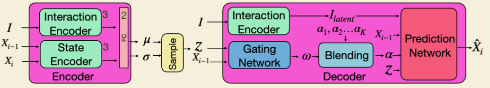

# [SAMP] Stochastic Scene-Aware Motion Prediction

`3DV` `Human-Motion` `Scene-Aware`

!!! info "文章信息"
    - 文章题目：*Stochastic Scene-Aware Motion Prediction*
    - 作者：[Mohamed Hassan](https://mohamedhassanmus.github.io/), [Duygu Ceylan](http://www.duygu-ceylan.com/), [Ruben Villegas](https://rubenvillegas.github.io/), [Jun Saito](https://research.adobe.com/person/jun-saito/), [Jimei Yang](https://research.adobe.com/person/jimei-yang/), [Yi Zhou](https://research.adobe.com/person/yi-zhou/), and [Michael Black](https://ps.is.tuebingen.mpg.de/person/black)
    - 项目主页：[🔗](https://samp.is.tue.mpg.de/)
    - 论文：[🔗](https://ps.is.mpg.de/uploads_file/attachment/attachment/652/samp.pdf)
    - Demo：[🔗](https://github.com/mohamedhassanmus/SAMP)
    - 代码：[🔗](https://github.com/mohamedhassanmus/SAMP_Training)

---

## 论文笔记

---

### 问题与现状与脉络

动作生成的实现划分为三个部分：

1. 导航至交互目标；
2. 寻找交互接触点(contact point)；
3. 生成交互动作，并且需要保证生成结果会自然变化（以符合现实感觉）；

由于这些动作中有一部分是“循环的(cyclic)”，一部分是“不循环的(acyclic)”，所以需要一个推理系统来协调两者 -> 提出 SAMP，场景可感知的动作预测系统(Scene-Aware Motion Prediction)：

- 随机模型
- 输入 3D 场景
- 采样有效交互目标
- 生成目标限制的、场景感知的、逼真的人体动作序列

---

### 贡献

1. 新颖的随机模型以生成**实时**的、多样的、**goal driven** 的人物对场景的交互；
2. （对 1. 的细化）给定目标几何体后生成可信的、动作相关的交互位置和方向的新建模方法；
3. （对 1. 的细化）将具体路径规划纳入变分运动合成网络，实现在复杂场景中的导航；
4. 包含多样人体场景交互数据的新的 MoCap 数据集；

---

### 方法　

- `MotionNet`(core)：一个 cVAE，**输入**目标对象和动作，`MotionNet` 每一帧将**采样**一个潜向量，联合前一帧的动作来控制（即**预测**）下一个动作；
	- 包含一个 encoder 和一个 decoder；  
	- $X_i$ 表示第 $i$ 时刻的状态，$Z$ 为生成的潜向量，$I$ 为交互对象(interaction objects)（以**人物为原点**的体素空间表达）；
		- encoder 包含 Interaction Encoder 和 State Encoder，分别将 $I$ 和 $X$ 编码（使用 3 个 FC）为低维度向量，再拼接起来输入到两个完全相同的 FC 中以预测 $\mu$ 和 $\sigma$ 即一个潜嵌入空间(latent embedding space)；
		- 于是我们可以从以上述结果为参数的高斯分布中采样出潜向量 $Z$ 作为 decoder 的输入； 
		- [x] **问题**：为什么这里的 $j^r_i$ 是 6d 的？（实际上是 9d 旋转矩阵中会变元有 6 个，通过这个 6d 的向量能够还原出这个矩阵，而至于为什么用这个 6d 内容而非角度，可以参考[这篇文章](https://arxiv.org/abs/1812.07035)，角度具有突变不连续：$2pi = 0$，所以都不怎么用了）
		- decoder 是一个 MoE，有 Prediction Network 和 Gating Network 两个部分，前者负责生成预测结果，后者负责生成各个专家网络的结果合成过程中的权重；
	- 使用的 loss 为 $||\hat{X_i} - X_i||^2_2 + \beta_1\mathop{KL}(Q(Z|X_i, X_{i-1}, I) || p(Z))$；
	- 特别注意，在测试过程中，我们仅仅从标准正态分布中采样潜向量；
		- [x] **问题**：为什么？
- `GoalNet`：用来生成交互点和交互方向(contact points and orientations)，即目标(goals)；
	- 该模块让 SAMP 能够适应不同的目标几何体；
	- 同样包含一个 encoder 和一个 decoder；  
	 - $I$ 为交互对象(interaction objects)（以物体**自身为原点**的体素空间表达），$\{g^p, g^d\}$ 分别为目标(goal)的位置和方向，$Z_{goal}$ 为潜向量；
	 - 使用的 loss 为 $||\hat{g}^p - g^p||^2_2 + ||\hat{g}^d - g^d||^2_2 + \beta_2 \mathop{KL}(Q(Z_{goal}|g^p, g^d, I) || p(Z_{goal}))$；
-  `Path Planning Module`：使用 A* 寻路以避障(obstacles)；
	- 生成的路线中将会有许多路点(way-points)作为**过程中的**目标点(goals)；
	- explicit A*；
	- 所谓的“路径”，具体指的是一系列路点(way point)，通过这些“小目标”，来一步步引导虚拟人到达目标前，在最后一个路点进行目标动作的生成；
	- 这一方面与 NSM 使用 sensor 检测不同，更加高效；

> 这些独立组件使 SAMP 称为第一个解决生成多样动态动作序列，并且能真实应用于复杂场景中的。
- [x] **问题**：这里最关键的是哪一个部分？与 NSM 相比独创性的地方具体在哪里？到底如何定义“diverse human-scene interactions”，和 Motion VAE 那种生成分布模型的有什么区别？（Motion VAE 是利用分布的极大似然估计得到结果的，MoGlow 貌似和场景没关系）

因此，训练 SAMP 所需的数据集需要丰富且不同的场景交互，现有数据集缺少交互行为 -> 自己做了一个。

- [x] **问题**：trajectory 和 path 和 pose 的区别？是指包括了动作和行动路线的轨迹吗？

如何衡量人体动作的随机性(stochasticity)是一个有待探索的领域。

---

### 训练策略

使用正常的监督训练会导致错误累积(accumulation of error)，因为一次的输出会作为输入进入到下一个网络。所以 SAMP 采用预订采样(scheduled sampling)，它能够稳定生成长时间的动作预估。

具体来说，上一次的预测结果以 $1-P$ 的概率作为下一次预测的输入，其中 $P$ 的定义如下：

---

### 实验和评估

在同初始条件下多次执行同一任务，使用 APD(Average Pairwise Distance) 来衡量其运动幅度：

---

## 代码阅读

### MotionNet

公式推导：

!!! note "正态分布的熵公式"
    假设 $x\sim N(\mu, \sigma^2)$，于是有：

    $$
    p(x) = \frac{1}{\sqrt{2\pi \sigma^2}}   \exp\left[
        -\frac{(x-\mu)^2}{2\sigma^2}
    \right]
    $$
    并且有结论：

    $$
    \int_{-\infty}^{\infty} e^{-x^2} \mathrm{d}x = \sqrt{\pi}
    $$

    那么有其熵公式：

    $$
    \begin{aligned}
        -\int_{-\infty}^{\infty} p(x)\ln p(x) \mathrm{d}x
        &=
        -\int_{-\infty}^{\infty}\frac{1}{\sqrt{2\pi\sigma^2}}\exp\left(
            -\frac{(x-\mu)^2}{\sqrt{2\sigma^2}} 
        \right)
        \ln\left[
        \frac{1}{\sqrt{2\pi\sigma^2}} \exp\left(
            -\frac{(x-\mu)^2}{2\sigma^2}
        \right)
        \right]
        \mathrm{d}x \\
        &= 
        \frac{1}{2}\left(
            \ln\left(
                2\pi\sigma^2
            \right) + 1
        \right)
    \end{aligned}
    $$

