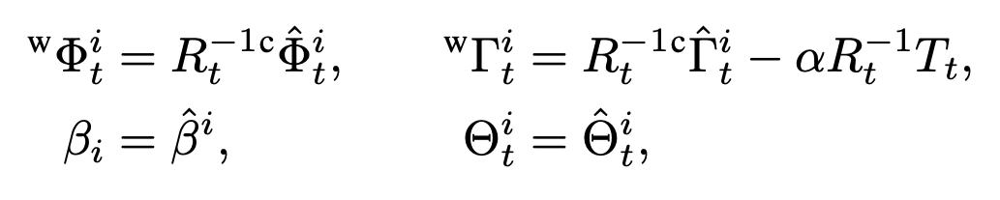

# [SLAHMR] Decoupling Human and Camera Motion from Videos in the Wild

---

## 特定词汇

- net motion: 给到网络的 motion，或者说是 net motion(human motion in camera) = camera motion ◦ (global) human motion

## 符号规定

- $T$: #frames
- $N$: #people
- $t$: timestamp
- $\mathrm{P}_t^i$: SMPL-H parameters, i.e. human pose here
    - $\Phi_t^i\in\R^3$: global orientation
    - $\Theta^i_t\in\R^{22\times 3}$: joints 22
    - $\beta_t^i\in\R^{16}$: shape
    - $\Gamma^i_t\in\R^3$: root translation
    - 其中，在 camera coordinates 和 world coordinates 下， $\Theta^i_t$ 和 $\beta^i_t$ 保持一致
- $\mathrm{V}_t^i\in\R^{3\times6890}$: generated mesh vertices
- $\mathrm{J}_t^i\in\R^{3\times22}$: generated joints
- $\{\hat{R}_t, \hat{T}_t\}$: T_w2c
- $\alpha$: 相机和人之间的位移尺度
- 2D observations:
    - $\mathrm{x}_t^i$: detected 2D kpts
    - $\psi_t^i$: confidences
- dealing contact:
    - $g\in \R^3$: ground plane, shared across all people and timestamp
    - $c(j)\in[0,1]$: contact probability for joint $j$

## 输入输出

- Video in the wild → global multi-humans trajectories
- decouples the cam & human motion using optimization
- 即从 net motion 中把 camera motion 和 human motion 解偶

## 方法

- Static scene pixels in RGB video
    - —[SOTA SLAM (DROID-SLAM)]→ relative camera motion, per frame $\{\hat{R}_t, \hat{T}_t\}$
    - —[SOTA 3D human tracking system (PHALP)]→ identities and body poses $\hat{\mathrm{P}_t^i}$

> 相机只能被估计到一个 **unknown scale of the world**，但 human motion 只能在一个合理范围内，所以需要决定一个  $\alpha$
>
- [x]  疑问：所以所谓的对齐 camera 就只改变这个 $\alpha$ 吗？
    - 应该是的
- 若干阶段的优化：
- **[Sec. 3.1.] 在世界座标系中初始化 camera motion 和 human trajectories**
    - 用 $\{\hat{R}_t, \hat{T}_t\}$ 和 $\hat{\mathrm{P}_t^i}$ 去算最初的 human poses in world coordinates
    - 
    - 其中 $\alpha$ 的初始值为 1
    - 用联合重投影误差去对齐 2D observation
    - 
        - 由于重投影误差的约束有限，所以只在这里优化 $\Phi_t^i$ 和 $\Gamma^i_t$，具体来说 #iter = 30, $\lambda = 0.001$

            

- **[Sec. 3.2.] Smoothing step @ trajectories in the world, warm start**
    - 接下来需要优化 $\alpha,\, \beta_t^i,\, \Theta_t^i$
    - 首先需要解偶 camera motion 中的 translation 和 human motion 里的 translation
    - 为此，使用优化来平滑帧间 poses
    - 
    - 使用 shape 和 pose 上的 priors 去优化完整的 $^\mathrm{w}\mathrm{P}^i_t$ 和 $\alpha$，具体来说 #iter = 60，$\lambda_\text{smooth}\,\lambda_\beta,\,\lambda_\text{pose}$ = 5, 0.05, 0.04
    - 
    - [x]  疑问：E_beta 和 E_pose 的式子为啥是那样的？
        - 因为哪些 priors 是各向同性的高斯分布
    - [x]  疑问：为什么这个东西可以用来优化 alpha
        - 观察 E data，alpha 始终在发挥作用
- **[Sec. 3.3.] 利用 motion priors**

    > 利用 transition-based motion prior human motion priors (a distribution) in world coordinates 去确定 $\alpha$ 和 global trajectories
    >
    - E prior = E CVAE + E stab
        - 利用 HuMoR 的方法，用 cVAE  得到状态的 transition 的分布，其中状态包括了 SMPL 的参数以及诸如速度、关节位置预测结果等
        - 
        - 同时利用 HuMoR 提出的一个 loss $E_\text{stab}$ 来规范化速度、关节位置，使之合理、与状态中的 pose parameter 相统一
    - E env = E skate + E con
        - 同时，跟随 HuMoR 的方法，估计地平面 $g$ 和每个关节的触地概率，用一个零速先验 loss 来解决 foot-skate，同时用另外一个 loss 来优化它们（触地关节）到地面的距离小于一个 threshold $\delta$
        - 
        - 
        - 优化 $g$
        - [x]  疑问：为什么 $g$ 是 $\R^3$？表示的是什么？
            - 是 floor 在 camera 系下的法向量，并且从 (0, 0, 0) 指向垂足（疑似无法支持过原点的平面）
        - 优化，具体来说是 #iter = 20，$\lambda_\text{CVAE}, \lambda_\text{skate},\lambda_\text{con}$ = 0.075, 100, 10
        - 

- [Sec 3.4.] 一些补充细节
    - 当 tracking miss 的时候，在 SO(3) 中对 Phi 和 Theta 进行插值，在 R3 中对 Tau 进行插值
    - 为了更好的支持多人任务，它们改进了 PHALP