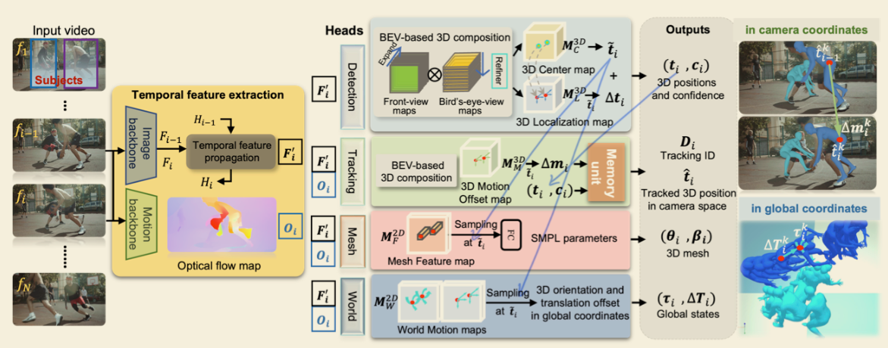

# [TRACE] 5D Temporal Regression of Avatars with Dynamic Cameras in 3D Environments

`3DV` `HMR` `Global-Coordinates` `Track`

!!! info "文章信息"
    - 文章题目：*TRACE: 5D Temporal Regression of Avatars with Dynamic Cameras in 3D Environments*
    - 作者：
Authors:<a href="https://arxiv.org/search/cs?searchtype=author&amp;query=Sun,+Y">Yu Sun</a>, <a href="https://arxiv.org/search/cs?searchtype=author&amp;query=Bao,+Q">Qian Bao</a>, <a href="https://arxiv.org/search/cs?searchtype=author&amp;query=Liu,+W">Wu Liu</a>, <a href="https://arxiv.org/search/cs?searchtype=author&amp;query=Mei,+T">Tao Mei</a>, <a href="https://arxiv.org/search/cs?searchtype=author&amp;query=Black,+M+J">Michael J. Black</a>

    - 项目主页：[🔗](http://www.yusun.work/TRACE/TRACE.html)
    - 论文：[🔗](https://arxiv.org/abs/2306.02850)
    - 代码：[🔗](https://github.com/Arthur151/ROMP)

---

### 任务 & 挑战

#### 背景

虽然目前对于 HPS(Human Pose & Shape) 的估计已经有很多很好的工作，但是都是得到相机座标下的结果，无法很好的得到全局座标系下的结果。尤其是在相机移动的情况下，这个任务尤其困难。而得到恢复出来的 Human 的全局座标具有重大意义。

#### 挑战

1. 需要解偶 human 的运动和 camera 的运动，这样才能在全局座标系下恢复 human 的轨迹；
	1. 一种方法：使用 SfM 恢复出相机关于 rigid scene 的相对运动，但是在特殊环境（画面的大部分都不怎么 rigid，比如大量人流）下非常不可靠；
	2. 另外一种来自 GLAMR 的方法：通过已有的局部姿态来推断全局位置，就类似于看你走了几步然后估计你动了几米；
	- TRACE 选择了第二种方法的变种，通过使用**整个画面**来预测移动距离，改善了 GLAMR 原本不怎么好的效果。不仅如此，GLAMR 是多阶段的，鲁棒性不敌 TRACE；
2. 尤其针对于追踪功能，在密集人群场景，存在很严重的遮挡问题；
	1. 最常见的解决办法是使用时序先验假设，如 Kalman filter，但是在复杂场景下也很容易失效；
	- [x] **问题**：Kalman filter 好像和滤波有关？为什么说是 temporal priors？ 使平滑。
	2. PHALP 是为数不多的解决这个问题的方法之一，但是它并非 one-stage，而且并不对序列进行全面的推理；
	- [x] **问题**：需要了解这个吗？ 跳过。

#### 任务与成果

本工作实现了动态相机视频（DC-videos）下在（虚拟的）空间中的时序的对于 K 目标的定位检测、姿态估计、追踪和冲突适配，并且能够得到全局的座标。
- 时序 & 全局座标 & 追踪；

对 K 个有限目标进行追踪，即使中途短暂的失配，也能在之后被重新识别（一开始决定了哪 K 个就一直是哪 K 个人）。

### 创新点 & 贡献

- 提供了 5D 的表达方式，抽象来说需要包括：时(1)空(3)座标 + 主体特征(1，抽象一点来看)；
- end2end 并且 one stage 的方法；
- 受到 BEV 启发，引入了了一种鸟瞰视角的 2D map 来推理 3D 中的 Human。这个 map 和一个以图片为中心的 map 一起用来推理 Human 的 3D 座标。类似的还有一堆其他的 map；
- 一个 memory unit，来做一些 long-term 的事情，比如对遮挡甚至暂时失配的鲁棒的追踪；
- 一个主要用全景视频模拟  DC-video 的数据集；

### 方法

参考流程图做解释。

- 输入的 Video 按帧输入，即输入 N 张图片；同时 user 指定需要追踪的人数 K；
- 随后，图片序列分别通过 Image backbone 和 Motion backbone 得到单帧的特征 map $F_i$ 和光流 map $O_i$；
	- Image backbone(HRNet-32) 线里，利用 $F_{i-1}$ 和 $F_{i}$，以及上一个时序特征传播模(temporal feature propagation module, ConvGRU)块得到的 $H_{i-1}$，预测这一帧的时序特征，并得到经过模糊的——包含时序信息的特征 map $F_i'$；
		- [x] **问题**：这里的 ConvGRU 相关的不是很清楚，比如 $H_i$ 是什么？ 暂时跳过。
	- Motion backbone(RAFT) 计算光流；
- 在完成时序特征提取(temporal feature extraction)以后，是一系列的 head network，它们并不完全平行，部分 branch 和其它 branch 有先后要求，但是既然图都这么画了，这里就当平行的模块来讲；
	- Detection 模块，以时序图像特征 $F_i'$ 为输入；
		- 相机座标系；
		- 使用正视和俯视两个方向的 view maps 合成预测（来则 BEV），得到一个 3D 中心 map(3D Center map) $M_C^{3D}\in \mathrm{R}^{1\times D\times H\times W}$ 和一个 3D 定位 map(3D Localization map) $M_{L}^{3D} \in \mathrm{R}^{1\times D\times H\times W}$；
		- 从 $M_C^{3D}$ 中得到 K 个对象的 3D 中心 $\tilde t_{i}$ 及其置信度 $c_i$，然后从 $M_{L}^{3D}$ 中在 $\tilde t_{i}$ 处采样从 $\tilde t_{i}$ 指向精确位置的偏移向量 $\Delta t_i$，于是得到精确的位置为 $t_i = \tilde{t}_i + \Delta t$；
			- [x] **问题**：为啥要两步，不能直接得到精确位置吗？ 需要实验证明。
	- Tracking 模块，以时序图像特征 $F_i'$ 和光流 $O_i$ 为输入；
		- 相机座标系；
		- 使用 $F_i'$ 和 $O_i$ 预测 3D 运动偏移 map(3D Motion Offset map) $M^{3D}_{M} \in \mathrm{R}^{3\times D\times H\times W}$，来推理人在 3D 空间中的位置偏移 $\Delta m_i$，这个偏移只是用来做 tracking 的；
		- 利用 $\Delta m_i$，$t_i$ 和 $c_i$，在 Memory unit 的作用下实现追踪；
		- Memory unit 的工作流程分三个步骤：
			- 初始化；
			- 匹配；
			- 更新；
	- Mesh 模块，以时序图像特征 $F_i'$ 和光流 $O_i$ 为输入；
		- 得到 SMPL 结果；
	- World 模块，以时序图像特征 $F_i'$ 和光流 $O_i$ 为输入；
		- 即之前提到的使用 pose 来估计全局的动作；

#### 数据集

略。

#### Loss

略。

