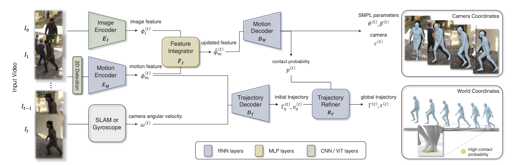

# [WHAM] Reconstructing World-grounded Humans with Accurate 3D Motion

---

- lift 2D keypoint sequences to 3D using motion capture data
- contact aware
- 可以利用 camera angular velocity

## 符号

- $\{\Theta^{(t)}\}^T_{t=0}$: SMPL model parameters
- $\{\Gamma^{(t)}\}^T_{t=0}$: root orientation
- $\{\tau^{(t)}\}^T_{t=0}$: root translation
- $\{x^{(t)}_{2D}\}^T_{t=0}$: 2D key points detected by ViTPose
- $\{\phi^{(t)}_m\}^T_{t=0}$: motion features given by the motion encoder
- $\{\phi^{(t)}_i\}^T_{t=0}$: image features given by pre-trained image encoder
- $\{\hat{\phi}^{(t)}_m\}^T_{t=0}$: fine-grained motion features

## 输入输出

- 输入：monocular video
- 输出：3D pose & shape 并且在 global coordinate system，计算高效（real time），自然、平滑，支持 moving camera

## 一些结论

- 目前的 video-based HPS estimation 效果不如 single-frame 的方法
    - 可能与数据不足有关

## 方法

- 准确运动
    - WHAM 认为时序方法不如单帧方法的原因之一是数据不足，所以它尝试用 AMASS **生成** 2D kpts ~ 3D pose 的数据对
        - 之所以是 2D kpts，是因为这这样就不需要真实图片，因此不需要关心生成的图片是否接近 in-the-wild，kpts 是都差不多的
    - 但只有 sparse 2D kpts 还不足恢复 dense 的 mesh，所以同样要利用 image feature，所以还有一个 image features integrator network
        - 此时就只能使用具有 2D image ~ 3D pose 的数据集才能训练
- 全局实时运动
    - 训了一个 global trajectory decoder，利用 context 和 camera’s angular velocity 来预测 global orientation 和 root velocity
- 支持非平面上的运动
    - 使用 **foot contact**，利用 3D video datasets 和 AMASS 来训练 foot contact labels estimation
    - 使用了一个 trajectory refinement network 来更新 root orientation 和 velocity

- 使用 RNN 来作为 motion encoder，根据之前的所有 2D kpts 来推下一个 2D kpts

    $$
    \phi^{(t)}_m = E_M(x_{2D}^{(0)},x_{2D}^{(1)},...,x_{2D}^{(t)}|h_E^{(0)})
    $$

    - 得到 kpts 以后还要根据 kpts 来把 kpts scale 到 bbx 上，然后把 bbx center 和 scale 都 concatenate 上去

- motion feature 与 image feature 通过 feature integrator $F_I$ 被合并

    $$
    \hat{\phi}_m^{(t)} = \phi_m^{(t)} + F_I(\text{concat}(\phi_m^{(t)}, \phi_i^{(t)}))
    $$

- 使用 RNN 作为 motion decoder，根据之前的所有 2D motion feature 来推下一个的 SMPL parameters，weak-perspective camera translation，和 foot-ground contact probability

    $$
    (\theta^{(t)},\beta^{(t)},c^{(t)},p^{(t)}) = D_M(\hat{\phi}_m^{(0)},...,\hat{\phi}_m^{(t)}|h_D^{(0)})
    $$

- 使用 RNN 作为 traj decoder 得到 rough 的 traj，根据之前所有的 motion feature 和 camera angular velocity 来做这件事
    - 

- 使用 RNN 作为 traj refiner，为了解决 foot sliding 的问题，定义了一个 ego-centric root velocity $\tilde{v}^{(t)}$：
    - 
    - 其中，当 contact probability 大于一个 threshold 时，$\bar{v}^{(t)}_f$ 是 toes 和 heels 在 world coordinate 下的平均速度，通过这种方式来”抹除” foot sliding
        - [x]  用跑步机的例子研究一下这个
        - 然后再用 RNN 来预测精修后的 global translation
            - 
            - 这里一个点是，先预测 dir 和 vel，再累计得到 trans
            - 还有一个点是，它会减去一个整个序列的“静止”速度的平均速度，表示去除一个整体漂移