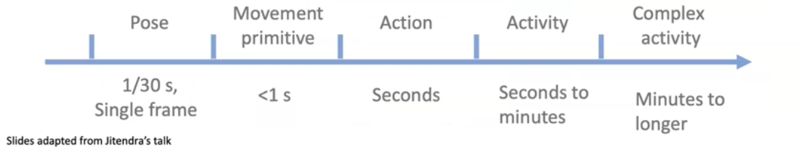

# ECCV 2024 Workshop Foundation Models for 3D Humans

!!! info "Information"

    - [Workshop Page](https://human-foundation.github.io/workshop-eccv-2024/){target="_blank"}

## Siyu Tang

**[Siyu Tang: Learning foundation models for 3D humans: a data request](https://www.dropbox.com/scl/fi/s5cnkmnzxx5hb3o2uiagm/SiyuTang.mp4?rlkey=bf729wf0bmicwsm7biz4ygve4&st=hpv5zjkw&dl=0){target="_blank"}**

- We already have: [Sapiens: Foundation for Human Vision Models](https://arxiv.org/abs/2408.12569){target="_blank"} as 2D human foundation models.

- Leading question: foundation models for 3D humans in 3D environments.
    - "3D humans": shape, motion, behavior
    - "3D environments": human-centric, recon & interaction
    - reconstruction, predicting, understanding
    - **Problem: lack of data.**

**The target is to improve the perception models for 3D humans in 3D environments.**

### Data Sources
    - From large video model (not Tang's topic).
    - Synthetic data
        - Bedlam, EgoGen, etc.
        - rich & accurate annotations
        - **controllability**
            - modify the distribution for certain application
        - **BUT** human behavior synthesis is a hard problem
    - Monocular videos (online videos)
        - PROX, ProxyCap, etc.
        - requires better reconstruct videos
        - diverse motion and appearance
        - **rich semantics**
        - **BUT** limited 3D annotations
    - Embodied egocentric captures
        - Nymeria, EgoBody, etc.
        - extended **temporal** duration (more and more embodied devices), i.e. long videos
        - rich & close hand-object interaction data
        - multi-modality data (humans + audios + locations + scenes + ...)
        - **BUT** limited observations for mocap (应该指的是对 device 携带者的 cap 总是 truncated 的？)
    - All three are complementary.

### Several (Tang's) Works Answering the Question

#### Labeling Monocular Videos

I.e., use motion capture from monocular videos to generate Pseudo GT from monocular videos.

- Challenges
    - Noisy 2D detections (jitter)
    - Occlusions
- Solutions
  - learn motion priors
        - e.g. RoHM
            - noisy to smooth
            - decouple trajectory and pose estimation
            - pose and trajectory should help with each other jointly
            - **BUT** not real time (efficiency is important for scaling up data)
            - **BUT** scene constraint not considered
            - **BUT** ignore the human appearance
                - InstrinsicAvatar

#### Synthesized Data

Generate human motion data.

!!! definition "Temporal Spectrum of Human Behaviors"

    <figure markdown>
    
 { width=80% } 

    </figure>

- Movement Primitive: have semantics meaning somewhat while still have a lot of data
- 为了训练一个模型，我们需要“建模多小的 motion 粒度”？可能没必要建模 action。
- Text-aligned latent motion space (combine with LLM)
- generative, controllable, diverse, casual
- easy to control to compose long term complex activities

- Solutions:
    - e.g. DART
        - Online text-to-motion
        - **latent motion primitives space**
        - auto regress
        - interaction:
            - motion in-between
            - human scene interaction (在没有上下楼数据的情况下模型能够推理出正确的上下楼行为)

    - e.g. EgoGen (是 ego data 和 synthetic data 的结合)
        - 一整套的生成
        - train on static environment but extend on dynamic situation