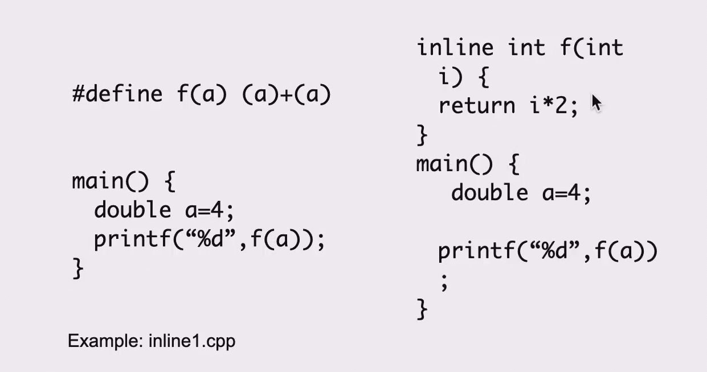
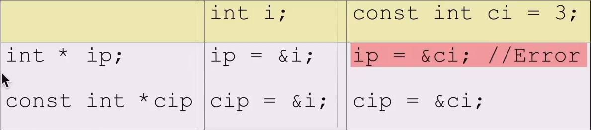
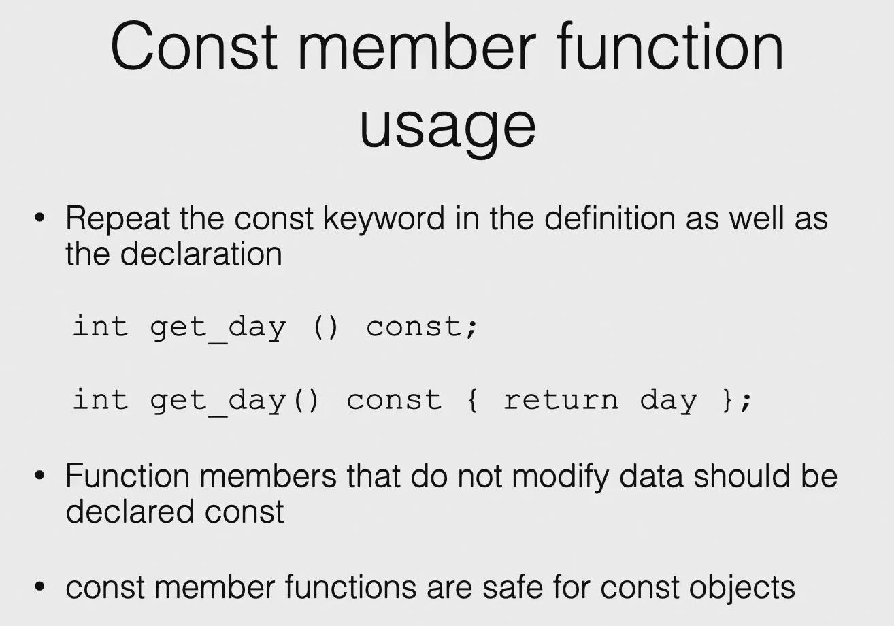
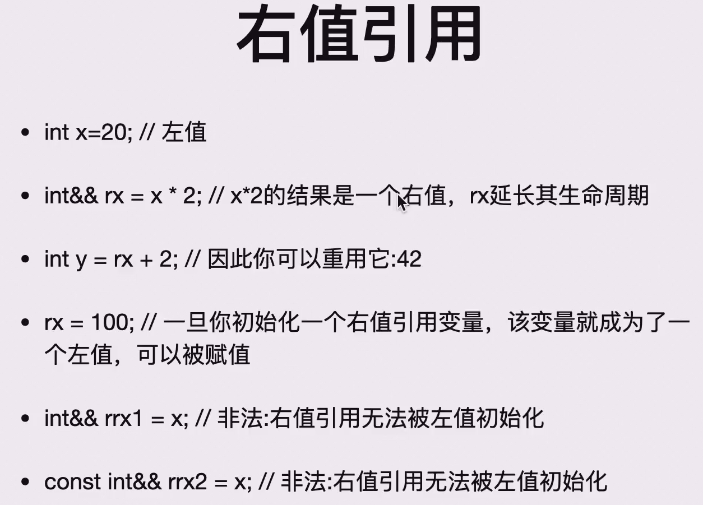
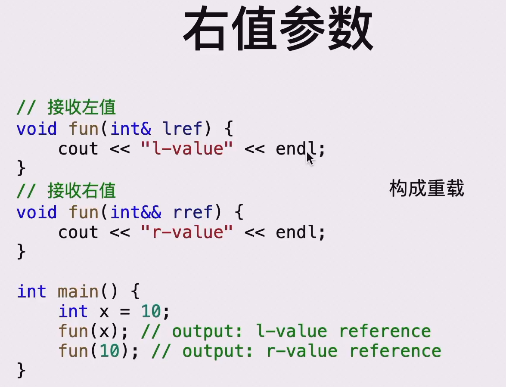

# [pre] 前置与杂项

## [1.x] 引用reference

**1.创建binding关系**

> 需要理解的是，引用本质就是指针。它是指针的糖。

`typename & refname = name;` 创建了 `(typename)name` 的引用 `(reference)refname`

在bingding关系建立后，在 `name` 和 `refname` 的作用域内 `refname` 和 `name` 基本等效（是变量的绑定关系，而非像 `#define` 那样的字符替换关系

- 一般来说(不考虑const+reference)能创建的引用的必须是个变量，而不能是个表达式、常量。
    - 换句话说，只能给**左值(left value)**创建引用
**特别的：**

```cpp
int x = 1, y = 10, *p = &x, &ref = *p;
// 此时 x = 1, y = 10, *p = 1, ref = 1

*p = 2;
// 此时 x = 2, y = 10, *p = 2, ref = 2

p = &y;
// 此时 x = 2, y = 10, *p = 10, ref = 2
```

- 引用在创建的时候**必须初始化**，即`int &x;`错误；`int &x = y;`正确。
- **Bindings一旦建立，无法取消**
- reference本质上就是受限的pointer
  - reference不存在reference
  - reference不存在pointer
     - 定义`int *p = &x;`
     - `int&* ref = ...;`非法，`ref`不能是一个引用的指针
     - `int*& ref = p;`合法，`ref`是一个指针的引用
  - 不存在reference数组
  
**2.利用reference传参**

利用reference可以**类似传指针**一样，在变量**原本的作用域外**对变量进行修改

```cpp
void f(int &x){
	x = 1;
}

int main(){
	int p = 0;
    // 此时 p = 0
    f(p);
    // 此时 p = 1
}
```

但此时，传入 `f(p)` 的实参 `p` 必须为一个变量，不可以是常量、表达式等。

**3.`reference` 与 `const`**

进行 `const int &refA = A;` 操作后，我们发现 `refA` **不可修改**，但 `A` **可以修改**

如果 `A` 如此定义：`const int A = 1;`，那么：

- `int &refA = A;`非法
- `const int &refA = A;`合法
- `const int &refA = 1;`合法
- 函数传参同理

---

## [2.x] 范围解析运算符resolver

- `<Class Name>::<Function Name>` 表示这个 `<Function Name>` 是不自由的，属于 `<Class Name>`的；
- `::<Function Name>` 表示这个 `<Function Name>`是全局变量中的自由函数（变量同理）；


```cpp
#include<iostream>
using namespace std;

class S{
    public:
		void f();
    private:
    	int a;
};

int a;

void f(){
	cout << "qwq\n";
}

void S::f(){ // 这里正在定义一个属于类S的的函数
    ++a;     // 这里对一个类S的成员变量a进行了自增操作
	::f();   // 这里调用了一个全局下的自由函数
    ++::a;   // 这里对一个全局变量a进行了自增操作
    cout << a << " " << ::a << "\n";
}

int main(){
	S k;
	k.f(); 
}
```

- 类的静态变量属于类不属于实例，不能通过正常的方式初始化，可以用过范围解析运算符在全局初始化
  - 实际上，编译器将对象对静态变量的访问自动转换成了类对静态变量的访问。因此，建议始终使用`className::staticVar`访问静态变量_(_[_xxjj在这里说的_](https://www.yuque.com/xianyuxuan/coding/cpp-oop#5TeQ9)_)_


## [3.x] 函数的重载Overload

可以存在**函数名相同**但是**参数表不同**的多个函数，即函数的重载。

类似Golang的interface，参数表完全符合哪个就执行哪个(出现歧义时会抛出错误)

```cpp
int k(int x){ return x; }

char k(long x){ return 'a'; }

int main(){
	cout << k(1L);   // 输出：a
	cout << k(1);    // 输出：1
}
```

- overload不支持自动类型转换

## [4.x] 函数的默认参数Default Argument


形式：`void fun(int a = 0);`

- 此时调用`fun()`可以省略存在默认参数的参数
- 但是不存在默认值的参数必须在存在默认值的参数前面
  - `void fun(int x, int a = 0);`合法
  - `void fun(int x = 0, int a);`非法
  - 如果同时存在函数声明和函数body，则在这两部分中Default Argument只能在其中一个

```cpp
// 合法
void fun(int x,int y);

void fun(int x = 1,int y = 2){
	// ...
}
```

```cpp
// 非法，因为x不能在y前
void fun(int x = 1,int y); 

void fun(int x,int y = 2){
	// ...
}
```

```cpp
// 合法
void fun(int x = 1,int y = 2);

void fun(int x,int y){
	// ...
}
```

## [5.x] 内联函数`inline`

主要作用是在函数优化上，效果是牺牲空间换效率，适用于短小且频繁使用的函数代码

实现就是编译器把函数内容贴到调用函数的地方来减少栈消耗

- `inline`仅仅是对编译器的一个**建议**
- [🔗](https://www.yuque.com/xianyuxuan/coding/cpp-oop#1wQNV)**引用一下xxjj的文章**
- 需要注意的是，`inline`是在每一个编译单元中进行的，所以这就导致了内联函数的原型应当能直接被调用该函数的文件访问到。
  - eg.
     - 在`a.cpp`中调用`f();`并`#include "b.h"`
     - 在`b.h`中声明`inline void f();`
     - 在`b.cpp`中写明`f()`的body
  - 结果就是会编译错误——需要将`f()`的body放到`a.cpp`或者`b.h`中才可以——因为在编译的时候`a.cpp`仅和`b.h`一起编译，并不知道`f()`的body在哪里，无法进行“内联”
  - `inline`与 宏 很相似，但是有一些区别：
  


- 做的事情是类似的，但用宏无法实现隐式类型转化
- 对编译器来说`inline`只是个建议，编译器未必会实现
- 在一个类里定义body的函数，它默认是`inline`函数
- 如果在类里没有定义body，那么该函数是内联函数当且仅当前面有`inline`关键词

## [6.x] const

`const`对数据的保护出现在**编译时刻**，如果强行通过某种手段获取其地址，仍然可以修改，编译器仅仅保证`const`修饰过的变量除了定义时，不能作为左值

- `char * const p;`修饰的是`p`
- `const char *p;`修饰的是`*p`
- `char const *p;`修饰的是`*p`
- `const char * const p;``*p`和`p`都被修饰
- `const`出现在`*`左侧，修饰的是`*p`
- `const`出现在`*`右侧，修饰的是`p`
- （若`const char *p = &ch;`，虽然通过`*p`无法更改指，但`ch`仍然可以修改，进一步体现这是个编译时刻行为）
- 
- 在这些性质下，我们可以把一个非`const`的变量赋值给`const`变量（特别是函数传参），来控制指针的读写权限（可以用来减少代码写错的情况）
- 
- 一个被`const`修饰过的对象的成员函数只有在该函数也被`const`修饰过且经过编译器检测确实不修改成员变量的情况下才能执行
- 
- `int A::fun() const;`和`int A::fun();`可以构成overload关系，因为这里的`const`实际上指的是隐藏的`A *this`被`const`修饰，参数表不同，符合overload条件
  - 当上述两个函数都存在时，当且仅当对象被`const`修饰才会调用前者
  - 如果成员变量是`const`，那必须存在初始化方案

## [7.x] static

虽然在单个文件内，静态全局变量的声明顺序可以确认，但文件间的顺序无法确认，这可能造成依赖问题，所以尽可能避免多文件静态全局变量的依赖关系

- 类的静态变量属于类不属于实例，不能通过正常的方式初始化，可以用过范围解析运算符在全局初始化
  - 实际上，编译器将对象对静态变量的访问自动转换成了类对静态变量的访问。因此，建议始终使用`className::staticVar`访问静态变量_(_[_xxjj在这里说的_](https://www.yuque.com/xianyuxuan/coding/cpp-oop#5TeQ9)_)_
  - 类的静态**函数**不再具有`this`指针，也不能直接访问非静态成员变量或者非静态成员函数
  - 一般情况下，如果要在`class`里声明`static`变量/函数，则只在`.h`文件中出现关键字，不要在`.cpp`中出现

## [8.x] 命名空间namespace & using关键字

可以用`namespace`来封装代码

```cpp
namespace <Space Name>{
	// 内容
} 
```

在之后使用里面的变量/函数需要使用范围解析运算符`::`，即`<Space Name>::<Function Name>();`

- `using namespace xxx;`后可以省略`<Space Name>::`，但是要注意歧义问题
- `using xxx::yyy;`后仅仅对`yyy`来说可以省略`<Space Name>::`，同样要注意歧义问题
- 两个命名空间有相同函数/变量的时候，需要写明命名空间
- `namespace x = y;`表示可以用`x`来表示命名空间`y`，但是在此前`y`必须已经定义
- `namespace`里也可以有`namespace`，我们称之为 组合

## [9.x] 左值与右值&右值引用




