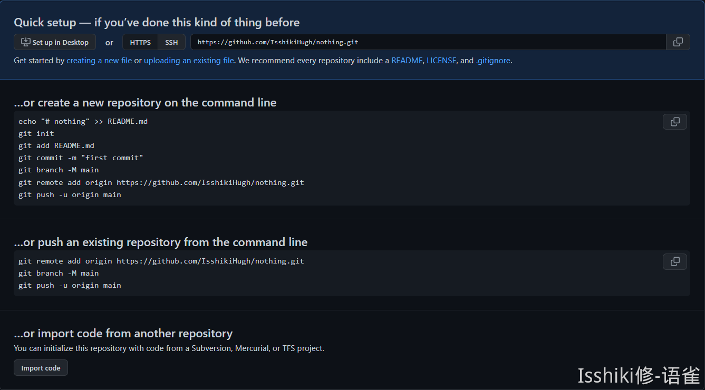

# Git Commands


!!! summary "简介"
    本文内容基于我自己的理解和一些文章，是学习笔记，但同时我也希望它能被作为一个学习参考资料。

    所以如果有错误请及时评论或者联系我，希望能为大家提供一个比较好的学习参考！
   
    因为我自己的开发经历有限，所以并不能保证自己的理解是合适且正确的，所以希望大家狠狠地 educate 我！
   
    本条目将把目光放在具体的`git` **命令** 的介绍与使用，旨在指导进行具体的工作。
   
    Git 有许多命令，但是其实常用的就图中的这么几个，甚至在 **刚开始** 学习使用的时候只需要记住其中的一两个，但是
   
    这并不是说其他命令就是没用的，我会在这里按照使用场景分类，尽可能地介绍 Git 命令。

!!! info "" 
    <figure markdown>
    
    常用命令
    </figure>

> 由于一般来说运行命令都是以本地视角，所以这里的「使用场景」的划分也是以本地视角展开的。
> 并且在某些需要涉及远程仓库的地方主要以 Github 的使用为参考。

## 简洁版本

> 该条目主要适用于初学与简单使用 Git ，并不适合长期维护的大型项目。

??? quote "快餐"
    ```shell
    # 在 Github 创建仓库
    # 获取仓库的 http / SSH clone 命令

    # 从远程将仓库克隆到本地
    git clone <repo-url>

    # 完成代码修改后将修改添加到暂存区
    git add -A # 添加所有修改
    git add .  # 添加当前目录下的修改

    # 提交修改
    git commit -m "Write commit message here."

    # push 到远程仓库
    git push origin
    ```

## 配置

Git 的配置文件名叫 `.gitconfig`，用来存放一些配置信息，在用户目录下的为全局配置信息，而在项目目录下的则为项目配置信息。

```shell
# 显示配置
git config --list
```

## 生成本地仓库

本地生成仓库主要有两种途径，一是在本地直接新建一个仓库，而是克隆一个远程仓库。

```shell
# 在当前目录 . 新建一个仓库
git init

# 创建一个名为 <dir-name> 的目录，将其初始化为一个 Git 仓库
git init <dir-name>

# 从 <repo-url> 克隆一个远程仓库（包括所有的 git 信息）
git clone <repo-url>
```

从文件角度来讲，实际上它是生成了一个有`.git`文件夹的文件夹，而`.git`文件夹存储了 Git 所需要的大部分信息。
使用常见的 shell 进入仓库文件夹后，一般会有一个 label 表示你已经进入了一个仓库的某个分支了。比如进入一个新的仓库时，会有一个master的 label ，具体表现形式主要看你的 shell 和主题了。

需要注意的是，在本地直接创建的仓库仅仅只是一个本地仓库，不具备远程协作功能，需要进行对应的配置，参考 ["Git Workflow"](../Workflow/index.md) 条目；而一般从远程仓库克隆下来的仓库都已经经过设置，可以直接进行远程协作。

## 版本管理

Git 基于版本之间的差异进行代码管理，使用 Git 进行代码管理主要指在做完特定修改以后将其添加到对应分支中。
在考虑 Git 操作之前，你可以放心地进行你的代码编辑工作，不过记得在合适的时机进行版本管理。

### 查看差异文件

通过如下指令可以 **查看差异文件**：

```shell
# 显示检测到差异的文件，它们正在等待被提交
git status
```

### 添加到暂存区

在完成代码修改工作后需要将代码 **添加** 到暂存区：

```shell
# 将 <target> 中的修改添加的暂存区，文件夹和文件同理，'.' 同理 
git add <target>

# 对于所有的修改依次进行添加确认（包括单一文件的多处修改）
git add -p

# 用交互式的方法进行添加
git add -i
```

### 提交到仓库

添加完后需要进行 **提交**，在仓库中形成一个节点：

```shell
# 提交到仓库
git commit -m "Write commit message here."

# 修正上一次提交，意思是说会扩充并替代上一次提交
# 应用场景如：上一次提交有遗漏、上一次提交的提交信息有问题等
git commit --amend -m "Write commit message here."
```

### 查看提交记录

完成提交后这一次修改就会被写入历史记录中，你可以通过`log`来 **查看**：

```shell
git log
```

### 回溯 / 抵消记录

在`log`中可以查询得到每一次`commit`的哈希，得到这些哈希(也可以使用标签)以后我们可以用它来进行 **回溯** 和 **抵消** 操作：

```shell
# 回溯到特定 commit ，比较危险
git reset HEAD               	# 回溯到上一个 commit ，效果上清空了暂存区，不影响工作区
git reset --hard <commit-id> 	# 抛弃当前的工作区并回溯到某个版本

# 抵消一次 commit ，产生一个与目标 commit 互逆的 commit
git revert HEAD        				# 抵消上一次 commit
git revert <commit-id> 				# 抵消特定 commit
```

### 删除 / 移动(重命名)

**删除** 文件和 **移动**(**重命名**) 文件可以使用`rm`和`mv`，关于`rm`(`mv`)和`git rm`(`git mv`)的区别可以看[这里](https://www.cnblogs.com/lance-ehf/p/3871643.html)。
简单来说就是，`git rm <file>`等价于`rm <file> ; git add <file>`；`mv`同理，但是你无法把一个文件通过`git mv`移动到 repo dir 之外。

```shell
# 删除某个文件
git rm <file>
# 移动(重命名)某个文件
git mv <from> <to>

# 使用如下命令还可以停止对某个文件的追踪，最常用的情况一般和`.gitignore`有关
git rm --cache <file>
```

### 标签操作

上面许多涉及定位特定 commit 的操作都需要获取 commit 的哈希。不过如果对某些特定版本进行一些标签管理，那我们就可以通过访问标签来索引特定 commit ，因而，tag 实际上是不可重复的。

```shell
# 为特定 commit 添加 tag
git tag <tag name> <commit id>

# 删除特定 tag
git tag -d <tag name>
```

另外，需要提醒的是，默认情况下`git push`不会将 tag 上传到远程仓库，需要在命令后加入`--tags`来一次性 push 所有的 tag 或者添加`<tag name>`来上传 tag 。

## 远程协作

远程管理主要指多人项目时需要通过远程仓库来完成协作。这里以 GitHub 为例。
当你在 Github 创建一个空 repo 以后，会有这样一个默认页面：

<figure markdown>

IsshikiHugh 是我的 User ID，nothing 是我的 Repo Name
</figure>

我们重点关注中间两个代码框，写的已经非常清楚了。

`create a new repository on the command line`指导你在本地创建一个新的空仓库，并与远程仓库链接；

`push an existing repository from the command line`指导你如何将远程仓库和本地仓库链接起来，并 push 。

### 远程仓库管理

来自 GitHub 的指导文件中最核心的一条指令是如何**链接本地仓库与远程仓库**：

```shell
# 在本地添加远程仓库，命名为 <remote name> ，注意这里的 <url> 并不是浏览器上面
# 那个，而是从 github 复制过来的 http 或者 ssh 推送
git remote add <remote name> <url>
# 常用的 <remote name> 是 origin
```
除此之外，关于远程仓库的相关命令还有如下：
```shell
git remote -v                  # 显示远程仓库(详细信息)
git remote rm <remote name>    # 解除与对应远程仓库的绑定关系
git remote rename <from> <to>  # 重命名特定远程仓库
```
### 本地从远程仓库拉取内容

主要有两种方式，即`pull`和`fetch`，区别在于`fetch`并不会合并内容，而仅仅是下载远程仓库中的变动信息。简单来说就是`pull`等效于`fetch`并`merge`。

```shell
# 从远程仓库下载变动内容
git fetch <remote name>

# 从远程仓库拉取变动内容并且合并到指定分支
git pull <remote name> <branch>
```

### 本地向远程仓库推送内容

在本地完成 commit 操作后，就可以 push 到远程仓库：

```shell
# 推送 <branch> 的内容到 <remote> ，并自动设置上游，这意味着在这个分支里，
# 下一次 push 只需要输入 git push 即可
git push -u <remote> <branch>
# eg: 推送 master 分支的内容到 origin ，并自动设置上游
git push -u origin master

git push --force 	# 强制推送当前分支，即使有冲突存在
         --all 	 	# 推送所有分支的内容
```

## 分支管理

### 查看分支

```shell
git branch        # 显示本地所有分支
           -r     # 显示远程所有分支
           -a     # 显示所有分支
```

## 新建分支 / 切换分支 / 设置上游

```shell
# 新建一个名为 <branch name> 的新分支，但不切换
git branch <branch name>
# 通过 checkout 来切换分支，比如进入到刚刚创建的分支汇总
git checkout <branch>         # 该命令会更新工作区
# 创建完分支后通过如下命令设置上游
git branch --set-upstream <local branch> <remote branch>

# 将上面的命令进行集成，有：

# 直接新建一个名为 <branch name> 的新分支并切换
git checkout -b <branch name>
# 新建一个名为 <local branch> 的新分支，并设 <remote branch> 为上游
git branch --track <local branch> <remote branch>
```

### 分支合并

```shell
# 将指定分支合并到当前分支，需要处理冲突部分（沟通协商、手动解决）
git merge <branch>

# 将特定 commit 合并进当前分支
git cherry-pick <commit id>
```

### 分支删除

```shell
# 删除本地分支
git branch -d <branch>

# 删除远程分支
git push <remote> --delete <branch>
git branch -dr <remote>/<branch>
# eg:
git branch -dr origin/testbrach
```

## 你可能还要了解的 / 本文还没讲的东西

- `.gitignore`文件
   - 联系`git rm --cached <file>`
- “追踪”的概念
- `HEAD`
- git stash

## 参考资料 | Ref

- [https://www.ruanyifeng.com/blog/2015/12/git-cheat-sheet.html](https://www.ruanyifeng.com/blog/2015/12/git-cheat-sheet.html)
- [https://www.cnblogs.com/lance-ehf/p/3871643.html](https://www.cnblogs.com/lance-ehf/p/3871643.html)
- [https://blog.csdn.net/Lakers2015/article/details/111318801](https://blog.csdn.net/Lakers2015/article/details/111318801)
