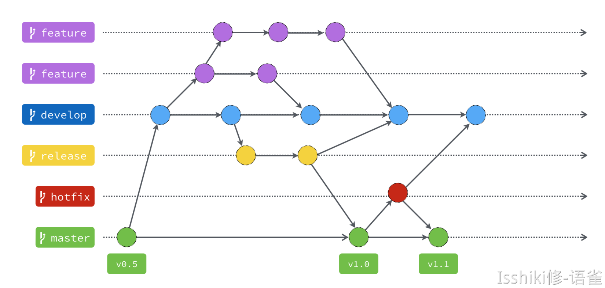
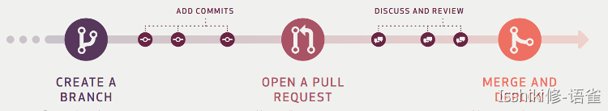

# Git Workflow

!!! summary "简介"
    本文内容基于我自己的理解和一些文章，是学习笔记，但同时我也希望它能被作为一个学习参考资料。

    所以如果有错误请及时评论或者联系我，希望能为大家提供一个比较好的学习参考！
    
    因为我自己的开发经历有限，所以并不能保证自己的理解是合适且正确的，所以希望大家狠狠地 educate 我！
    
    本条目主要介绍有关 Git Workflow 的**概念性质**和**指导性质**的一些内容，它们并不具体，但是会指导您的使用。

    由于 mkdocs 并没有标签功能，所以其实还是语雀上的文章更好看，但是我并不打算更新语雀了，故这里只放一个以前的指路链接：[🔗](https://www.yuque.com/isshikixiu/codes/mp01wg)。

    Git branch 可视化练习网站：https://note.isshikih.top/tech_accu/tool/Git/Workflow/

## 何为 'Git Workflow'

Git Workflow 是一种**规范**的**工作流程**，而并不是一个具体的工具或者技术，当然貌似有一个叫做 [Gitflow](https://www.atlassian.com/git/tutorials/comparing-workflows/gitflow-workflow) 的工具，但在本文中暂时不介绍。
现在被广泛使用的 Workflow 主要有三种：

- Git Workflow
- Github Workflow
- Gitlab Workflow

他们的关系是，依次吸收与改进，各有特点，且与对应的使用平台相适应，下面将分条概述。
在不同的 Workflow 中，最主要的区别就是不同**分支**间的合作形式和组织形式，如果你对 Git 的**分支**还不是很熟悉，请先参考 [Git Commands](../Commands/index.md) 的部分内容，简单了解一下基础指令。

### Git Workflow

<figure markdown>

[Source] https://gitbook.tw/chapters/gitflow/why-need-git-flow
</figure>

**Tips: 在阅读接下来的一些说明时，可以联系上方这张图进行理解。**

在 Git Workflow 中，主要有 5 类分支，他们分别是 master hotfix release develop feature，它们有着不同的作用和使用规范。其中masterdevelop是**长期**分支，他们会随着项目的维护一直存在，而hotfixreleasefeature这些**短期**分支则会在完成对应开发后被合并或者删除。

#### Master 分支（主分支）

直接面向使用方的分支，在master中存放的应当是可以使用的稳定版本，因而通常也会在其中添加版本编号。
我们希望 master 中的代码总是从别的分支中合并过来的，而并不希望任何人直接 commit 到 master 中。

#### Develop 分支（开发分支）

所有开发工作都基于该分支进行，可以理解为项目代码的汇流处，而 master 则是 develop 中特定节点可用发行。
当需要添加新的功能时，我们需要新建一个 feature (如图)，然后在完成对应开发后合并回 develop。

#### Hotfix 分支（补丁分支）

当 master 中出现问题，我们需要以出问题的节点为基础创建一个 hotfix，然后在这个 hotfix 中进行 bug 的修复工作。
在完成修复后，我们需要把这个 hotfix 同时合并到 master 和 develop(如图)，一方面确保下一个稳定版本可用，一方面确保未来的版本也修复了该 bug。

#### Release 分支（预发分支）

当 develop 足够成熟时，我们会希望它被合并到 master 中作为一个稳定版本发布，但在这之前，我们需要在 release 中进行最后的测试和修正。
在完成这些工作后，我们需要把 release 同时合并到 master 和 develop (如图)，一方面确保下一个稳定版本可用，一方面确保未来的版本也修复了这些问题。

> hotfix和release是类似的，他们一个是基于master对两个长期分支进行维护，一个是基于develop。

#### Feature 分支（功能分支）

当我们需要开发新的功能，或者说对于大部分开发工作，在**合理的模块划分**后，就需要创建合适的 feature 分支来进行对应的开发工作。因为 feature 往往比较多，所以要求各个feature之间耦合程度不宜过高，以减少冲突，这就需要进行合理的划分。

### Github Workflow

- 这里的 Workflow 与 Github Action 中的 Workflow 有区别！

Github Workflow 对 Git Workflow 进行了简化，在 Github Workflow 下仅仅区分 master 和 branch，而具体功能由各个 branch 的命名来体现，即要求 branch 的命名具有叙事性。

最重要的是，没有了 develop 分支以后，长期维护的就只有 master 了，这就意味着发布的代码一般都是进度最新的代码。而这件事是有好有坏的。
基于 Github Workflow 的工作流程主要如下：

1. 创建分支 (create a branch or fork)；
2. 在分支中进行开发并完成提交 (add commits)；
3. 发送 Pull Request (open a pull request)；
4. 人工审核代码、沟通交流，以及必要的测试 (discuss and review)；
5. 合并进 master (merge)

因而，在这样一个工作流程下，合作者之间的**交流**就更加重要了。

### Gitlab Workflow

- [x] 咕咕咕

## 参考资料 | Ref

- [https://nvie.com/posts/a-successful-git-branching-model/](https://nvie.com/posts/a-successful-git-branching-model/)
- [https://www.ruanyifeng.com/blog/2015/12/git-workflow.html](https://www.ruanyifeng.com/blog/2015/12/git-workflow.html)
- [https://gitbook.tw/chapters/gitflow/why-need-git-flow](https://gitbook.tw/chapters/gitflow/why-need-git-flow)
- [https://medium.com/i-think-so-i-live/git上的三種工作流程-10f4f915167e](https://medium.com/i-think-so-i-live/git%E4%B8%8A%E7%9A%84%E4%B8%89%E7%A8%AE%E5%B7%A5%E4%BD%9C%E6%B5%81%E7%A8%8B-10f4f915167e)
- [https://github.com/xirong/my-git/blob/master/git-workflow-tutorial.md](https://github.com/xirong/my-git/blob/master/git-workflow-tutorial.md)
- [https://about.gitlab.com/topics/version-control/what-is-git-workflow/](https://about.gitlab.com/topics/version-control/what-is-git-workflow/)