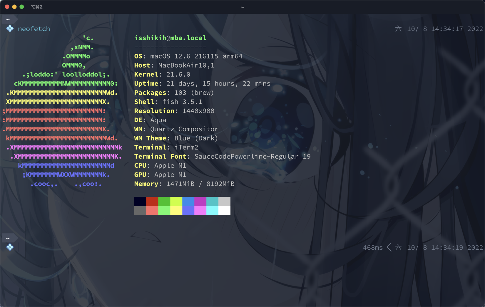
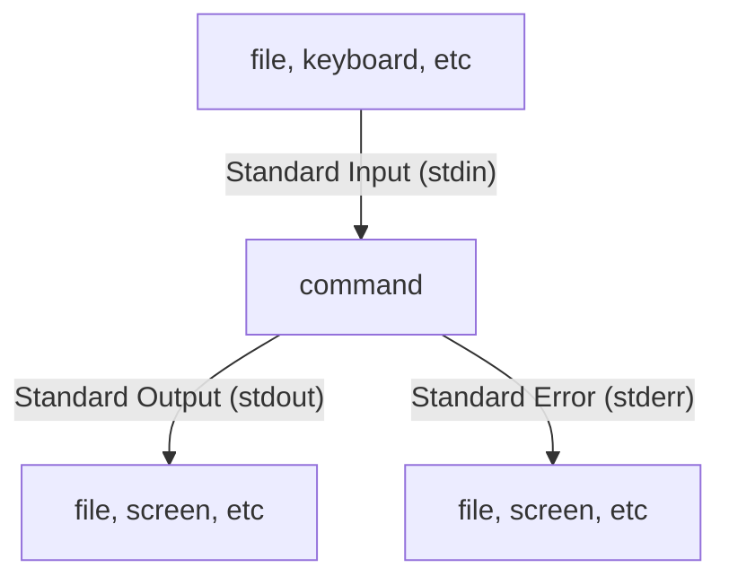

# Shell

!!! summary "文章目标"

    在完成本文学习后，我们期待您对 Shell 能有更具体的认识，并能做到通过 Command Line 实现基础交互并了解如何学习 Shell。除此之外，也可以通过撰写 Shell 脚本来实现一些自动化。

    此外，从 Shell 入门到命令行大师，其中肯定有很长的路要走，我们没法涉及 Shell 的全部知识点，光命令就能讲上很久，所以一定要学会如何利用手册和文档等查询命令的使用方法，本文希望做到的是授人以渔而非授人以鱼。

    此外，我会在文中多次将 Shell 与 C 语言的一些内容相联系，如果您有 C 的基础，那将再好不过。

## 概述

### 简介

Shell 的中文名称为“壳层”，顾名思义就是“最外层”。Wiki 对其描述为：

> It is named a **shell** because it is the outermost layer around the **operating system**.

简单来说，Shell 将读入来自 Keyboard 的内容，并将指令发送给 OS 以调用系统服务。

在常见的日用操作系统，如 Windows 与 MacOS，你可能尝试过使用 GUI(Graphical User Interface)，即图形用户界面来与你的系统愉快玩耍；与之对应的，Shell 则是一种 CLI(Command Line Interface)，不同于 GUIs 通过点击按钮等操作与系统交互等方式，CLI 要求用户通过命令行来与系统交互。而作为一个合格的程序员，我们接触到的大多数生产场景中，使用 CLI 是一种更加高效的选择，事实上你也很难避免它——因而，我们需要掌握 Shell 的基本使用。

如今，已经有非常多的 Shell 可以使用，而他们基本上都以 `sh` 结尾，例如常见的 `bash` 和 `zsh` ,再比如许多基于 Alpine 的 Docker Image，内置的 Shell 都是 `sh`。其他的还有 `dash` `csh` `ksh` 等等。

### Shell vs Terminal

在正式开始介绍 Shell 之前，我认为有必要做一些辨析。

在现代的计算机系统中，想要使用 Shell，你需要借助 Terminal，即终端（更准确的说，是 terminal emulator，不过在本文中我们并不会就此展开）。Terminal 之于 Shell，就好像电话之于通讯服务。



例如，图中打开的这个“窗口”就是一个叫做 iTerm2 的 terminal emulator，而我使用的 `fish` 则是一种 Shell。

能与这两个东西进行比较和辨析的东西其实还有很多，但并非本文主题，所以不再展开。

## 以 Bash 为例

`bash` 全称 Bourne Again Shell，是如今最常用的 Shell 之一，且大部分 Linux 都会内置 bash，这也避免了更多的环境配置负担，所以在本章种，我们将以 `bash` 为例，介绍一些 Shell 常用指令和技巧。

此外，我们接下来提供的大多数论断主要基于 Linux 系统。部分结论在 Windows 等系统中可能并不成立。如果您有兴趣，可以自行查询资料。

### 准备工作

在开始之前，我希望您确保您本地已有可用的 `bash` 环境，以便于您能跟着教程边实践边学习。

在这里，我将提供一种简单的配置 `bash` 环境的方案：

- 如果您是 Linux/MacOS 用户，那么您的系统一般都会自带 Terminal 程序，直接打开并输入 bash 以启用 bash；
- 如果您是 Windows 用户，那么您可以选择直接下载 [Git Bash](https://git-scm.com/downloads)；

当然，我们最推荐的还是您可以配置一个 Linux 环境以进行实践和学习。

当您完成这些工作后，您可能看到类似于如下列举的内容的情况：

```shell
# 也许是这样
xxx:~$ {你的光标在这里}
# 或者这样
[xxx@yyy]~$ {你的光标在这里}
# 又或者这样
xxxx yyyy ~
$ {你的光标在这里}
# ...
```

实际情况还有很多种，因为这些“形式”都是可以被设置的。比如这里的 `$` 被称为 prompt，在本文第一张图片中我就将它设置为了一个 Emoji 图标。而我们发现这里还有一个 `~` ，它表示的是您的“家目录”。更准确的说，它的含义是您当前所在的位置是您的家目录。关于这一点我们将在接下来展开。

此外，如果您对 Linux 系统有一定认识，那无疑会帮助您理解本文。

那么接下来，让我们开始吧！

### 帮助手册

左思右想，最后我还是把这条指令放到了最前来讲。我们不可能仅仅通过一篇文章就了解命令行的全部知识，所以我觉得把 `man` 放到最前面来讲是很有意义的。

`man` 的作用是打开一个 user manual。例如，如果我们在终端中输入 `man man`，就会得到如下结果，即使用 `man` 打开了 `man` 的手册：

```
man(1)                                     General Commands Manual                                    man(1)

NAME
       man - format and display the on-line manual pages

SYNOPSIS
       man [-acdfFhkKtwW] [--path] [-m system] [-p string] [-C config_file] [-M pathlist] [-P pager] [-B
       browser] [-H htmlpager] [-S section_list] [section] name ...

DESCRIPTION
       man formats and displays the on-line manual pages.  If you specify section, man only looks in that
       section of the manual.  name is normally the name of the manual page, which is typically the name of
       a command, function, or file.  However, if name contains a slash (/) then man interprets it as a file
       specification, so that you can do man ./foo.5 or even man /cd/foo/bar.1.gz.

       See below for a description of where man looks for the manual page files.

......
```

- 我们可以使用鼠标滚轮/手势翻页/回车等途径可以查看接下来的内容，按下 `q` 离开手册页面。
- 此外，user manual 的内容可能会根据使用的 Shell 不同而不同，甚至在一些 Shell 都不一定有 user manual。

为了实现抛砖引玉的目的，现在我们仅仅介绍 `man` 的这些部分，实际上光看 manual 的文本量就能感受到， `man` 远不止如此，但本文并不打算就此深入。而在这里介绍 `man` 的目的，一方面是希望大家在学习之后的命令时，可以参考 user manual，事实上本文涉及的命令也并不会介绍其全部用法；另一方面是鼓励大家在遇到为止的指令时，通过手册等途径先查询其行为、用法，再使用它。

### 打印字符串 | echo

`echo` 即回响，这个单词非常形象地描述了这个命令的作用，将其接受到的内容“回响”出来。

```shell
# echo 会将它拿到的参数全都当作字符串打印出来，但成对引号并不会
$ echo <something>
$ echo "something 1 2 3"
something 1 2 3
$ echo something 1 2 3
something 1 2 3

# 如果你只输入了一个引号，它会等你把他补完再输出
# 如果想输出引号，需要使用 \" 转义
$ echo "
Fine, \"I\" will finish the string.
"
Fine, "I" will finish the string.

# echo 支持输出参数，以 $ 开头，在命令行环境下他们指环境变量，在脚本环境下还可以进行一些参数传递
# 下面的命令输出了当前用户，USER 是一个值为当前用户的用户名的环境变量。
echo $USER
isshikih
```

### 查看当前路径 | pwd

在这里我们想介绍的第二个指令是 `pwd`，它的效果是输出您当前的位置。

```shell
$ pwd
# 比如我的环境下，在 ~ 下输出如下
/Users/isshikih
# 表示我当前的位置是 /Users/isshikih
```

**一切皆文件** 是 Linux 的设计理念，而 Shell 的使用有相当一部分是基于文件体系的。而如何 **索引** 一个文件呢？我们需要提供这个文件的路径和文件名！例如，您需要去一台 Windows 电脑中找到您上学期的课程作业，它的文件名为 `myHomework.pdf` ，也许你需要打开D盘中的 Homework 文件夹。那么抽象地来说，这个文件的路径为 `D:\Homework\myHomework.pdf` （这是在 Windows 上的写法）。这种形式的“位置”被称为 **绝对路径**，即我们需要填写文件的完整路径才能找到这个文件。在之后的部分中，我们提到的`<filename><dirname>`等都包括了文件的路径。

**👉 事实上，有相当一部分 Shell 语法是围绕着文件展开的。**

### 切换目录 | cd

`cd` 是 change directory 的缩写，它的效果是将您当前的位置转移到目标目录中。它的写法如下：

```shell
cd {target directory}

# eg 1: =========================================
$ pwd
/home/username

$ cd /home/username/aaa
$ pwd
/home/username/aaa

# eg 2: =========================================
$ pwd
/home/username

$ cd ./aaa/bbb
$ pwd
/home/username/aaa/bbb

# eg 3: =========================================
$ pwd
/home/username

$ cd ./../aaa
$ pwd
/home/aaa
```

接下来对上面 eg 的部分符号做一下解释：

- `.` 表示当前路径；
- `..` 表示上级路径（指上一个） ；

此外，这里还有一些快捷方式：

- 如果只有 `cd` ，则返回家目录 `~` （可以发现 eg 4 和 eg 5 等价）；
- `cd -` 返回上一次 `cd` 之前所在的位置；
- `cd ~username` 切换到目标用户的家目录；

### 罗列目录下内容 | ls

`ls` 指令用来查看目标目录下的文件。常用的参数主要有 `-l` （长格式）和 `-a` （显示全部）。

具体写法如下：

```shell
# 假设我们当前在文件夹 my_ 下，文件夹内有两个文件和一个文件夹
# 文件 .hidden 和文件 file1.md
# 文件夹 dir1，里面有个文件 file2.md

$ ls
dir1		file1.md

$ ls -a
.				..		.hiden1		dir1		file1.md

$ ls -l
drwxr-xr-x  2 isshikih  staff  64 10 12 12:15 dir1
-rw-r--r--  1 isshikih  staff   7 10 12 12:16 file1.md

$ ls -la
drwxr-xr-x  5 isshikih  staff  160 10 12 12:15 .
drwxr-xr-x  6 isshikih  staff  192 10 12 12:14 ..
-rw-r--r--  1 isshikih  staff    0 10 12 12:15 .hiden1
drwxr-xr-x  2 isshikih  staff   96 10 12 12:15 dir1
-rw-r--r--  1 isshikih  staff    7 10 12 12:16 file1.md

# 如果后面跟着一个文件夹，则显示目标路径下的内容，否则显示当前路径下的内容。
$ ls dir1
file2.md
```

- 有时，我们会为 `ls -l` 设置一个 alias，即 `alias ll="ls -l"` ，这样，我们就可以更方便的 `ll` 了。
- 其中， `l` 中的具体格式如下：

```shell
-rw-------   1 me       me            576 Apr 17  2019 weather.txt
drwxr-xr-x   6 me       me           1024 Oct  9  2019 web_page
-rw-rw-r--   1 me       me         276480 Feb 11 20:41 web_site.tar
-rw-------   1 me       me           5743 Dec 16  2018 xmas_file.txt

----------  -------  -------     -------- ------------ -------------
|          |        |            |         |             |
|          |        |            |         |
|          |        |            |         |           文件名
|          |        |            |         |
|          |        |            |         +---       修改时间
|          |        |            |
|          |        |            +-------------   文件大小(in bytes)
|          |        |
|          |        +--------------------------       所属用户组
|          |
|          +-----------------------------------       所属用户
|
+----------------------------------------------       文件权限
# Edited from https://linuxcommand.org/lc3_lts0030.php
```

- 关于这部分具体部分字段的具体解释，请参考相关资料，不属于本文的范畴。

### 打印文件内容 | cat

`cat` 指令会连接文件并将内容打印到标准输出流。

```shell
# <filename> 是目标文件的名字。
$ cat <filename>
```

- 而实际上 `cat` 命令最重要的作用并不是 **显示** 文件内容，仔细观察描述，它的作用是 **打印到标准输出流**，其作用在之后介绍了重定向之后会凸显出来。

### 打印文件首尾内容 | head & tail

`head` 和 `tail` 语法类似，功能类似，分别为查看目标文件的开头部分的内容和结尾部分的内容。不过由于我们对文本文件除了读写，还有一个叫做“追加”的操作（类比 C 语言中 `fopen()` 的 `‘a’` 模式） `tail` 会持续打印新追加进文件的内容，所以花样稍微比 `head` 多一点。

```shell
# `head` 和 `tail` 都有默认参数 `-n 10`
# 也就是，下面两个指令是等价的，它们都会打印目标文件的前 10 行
$ head <filename>
$ head -n 10 <filename>
# 下面这两条指令也是等价的，它们都会打印目标文件的末 10 行
$ tail <filename>
$ tail -n 10 <filename>

# 将 10 改成其他数字就可以修改显示的行数，例如下面的指令会打印目标文件的首/末 4 行
$ head -n 4 <filename>
$ tail -n 4 <filename>

# 除了行数，你也可以指定打印的字节数，如下面指令会打印目标文件的首/末 20 个字节
$ head -c 20 <filename>
$ tail -c 20 <filename>
```

```shell
# `tail` 比 `head` 还要多一些参数，比如 `-f`
# `-f` 在打印完已有的文件内容后会阻塞，等待目标文件的更新
# 一旦有内容追加进目标文件，`tail` 就会将它打印出来
$ tail -f <filename>
```
<center>

</center>

注意，这里的 echo 开头的语句是在做追加操作，之后会讲到。

而至于具体的引用场景，比如有些工具的日志会不断追加到某个日志文件中，这时候就可以用 `tail -f` 来实时跟踪日志信息。

### 查看文本文件内容 | less

`less` 则是真正用来显示文件内容的指令，它会以文本文件的形式展示文件内容——这意味着你如果强行使用 `less` 来查看一个二进制文件，则会得到一堆乱码。

```shell
# <textFilename> 为目标文件的名字
$ less <textFilename>
```

使用 `less` 查看文件时，你会发现你打开了一个很像 `man` 的界面（相信你已经注意到了这个说法有点本末颠倒），那实际上浏览的方式也是类似的，这里再多介绍一些在浏览文件的时候可能用到的技巧：

- 鼠标滚轮 / 触控板手势：翻页浏览；
- `[space]` / `PageDown` ：往后翻一页；
- `b` / `PageUp` ：往前翻一页；
- `shift` + `g` （输入 `G`）：跳转的文末；
- 1, `shift` + `g` （输入 `1G`）：跳转到文首；
- `/{something}` , `Enter` ：搜索 `{something}` ，类似于常见软件的 `Ctrl` + `f` ；
- `n` ：重复上一次搜索操作，适合在搜索内容有多个的时候，跳转到下一个搜索结果；
- `h` ：帮助手册；
- `q` ：退出；

### 修改文件时间属性(创建文件) | touch

`touch`实际上是用来修改文件和目录的时间属性的，但是由于它具有“如果文件不存在则创建一个”的特性，所以也常常用来创建一个新档案。

```shell
$ ls -l
total 0

# 如果当前目录下没有叫做 <filename> 的文件，则创建一个 <filename>
$ touch file
$ ls -l
total 0
-rw-r--r--  1 isshikih  staff  0 10 25 10:07 file
# 其中文件的时间为系统的当前时间

# 如果此时再次 touch <filename>，则会更新其时间为当前系统时间
$ touch file
$ ls -l
total 0
-rw-r--r--  1 isshikih  staff  0 10 25 10:10 file
```

### 创建文件夹 | mkdir

`mkdir`是 make directory 的缩写，也就是创建一个“文件夹”。

```shell
# <dirname> 可以是一个复杂路径下的目录，但是一定要求其前置目录都存在
$ mkdir <dirname>
$ ls -l
total 0
$ mkdir dir1/dir2
mkdir: dir1: No such file or directory
# 说明目标目录 dir2 的前置路径 ./dir1 缺失

# 我们可以依次创建这些目录
$ mkdir dir1 dir1/dir2
$ tree   	# 该指令会显示当前的文件结构
.
├── dir1
│   ├── dir2
│   │   └── file2
│   └── file1
└── newDir
    ├── dir2
    │   └── file2
    └── file1

4 directories, 4 files

# 或者使用 -p 参数，它允许创建嵌套目录，即如果前置目录不存在它会创建一个
$ mkdir -p dir1/dir2
$ tree   	# 该指令会显示当前的文件结构
.
├── dir1
│   ├── dir2
│   │   └── file2
│   └── file1
└── newDir
    ├── dir2
    │   └── file2
    └── file1

4 directories, 4 files
```

### 移动(重命名) | mv

`mv`即 move，含义很明显，即改变文件或目录的位置。不过由于“位置”这件事，实际上也可以包含文件本身的名字，所以也可以用来做重命名，实际上就是修改目标位置到同一个路径下的另外一个名字。

```shell
# 注意，我们在这一节临时把 <path> 从 <filename> 和 <dirname> 中拆出来
# 该指令会将 <target1> 移动到 <path2> 并改名为 <target2>，当然允许同名
$ mv <path1>/<target1> <path2>/<target2>

# 省略 <target2>，则会移动文件位置但不修改文件名，即下面两个指令等价
$ mv <path1>/<target1> <path2>
$ mv <path1>/<target1> <path2>/<target1>

# 移动到同一目录，即实现重命名，当然 <path1>/ 可以省略，即此时 <path1> 为 .
$ mv <path1>/<target1> <path1>/<target2>
```

### 复制 | cp

`cp`即 copy，用来复制文件或目录，基本语法和`mv`类似，我们再多介绍一个`-r`参数。

```shell
# 该指令会复制一个文件 <filename> 到 <path> 下
$ cp <filename> <path>

# cp 无法复制文件夹
$ cp <dir> <path>
cp: <dir> is a directory (not copied).
# 但是使用 -r 参数可以复制 <path1> 下所有内容到 <path2> 下
$ cp -r <path1> <path2>
$ cp -r dir1 newDir
$ tree   	# 该指令会显示当前的文件结构
.
├── dir1
│   ├── dir2
│   │   └── file2
│   └── file1
└── newDir
    ├── dir2
    │   └── file2
    └── file1

4 directories, 4 files
```

### 删除 | rm

把`rm`放在最后讲是有原因的，或许你听说过 `rm / -rf` 这条指令，却不知道它的含义，那么看完这一小节你就知道这个指令有多恐怖了（千万不要跑这条指令）。

首先我们需要知道，Linux 下`rm`指令并不存在“垃圾箱”这个机制，即用`rm`删掉的东西是没法通过正常手段复原的，而上面那条指令的意思就是强制递归删除系统根目录下所有内容，也就是 **啥都删光了**。

所以，一般我们都会建议使用`alias`保护`rm`指令（我写过`fish`的`rmalias`保护流程，可以参考[这篇文章](https://www.yuque.com/isshikixiu/codes/bokmrt)）。

`rm`即 remove，顾名思义就是用来删除东西的，这是个非常危险的指令。常用的参数有`-r`和`-f`，分别表示递归删除和强制删除；此外，我们还将介绍一个`-i`参数。

```shell
# 删除一个文件
$ rm <filename>

# 删除 <dirname> 下所有的一级文件
$ rm <dirname>/*

$ tree
.
├── dir2
│   └── file3
├── file1
└── file2

1 directory, 3 files
$ rm ./*
rm: ./dir2: is a directory
$ tree
.
└── dir2
    └── file3

1 directory, 1 file
# 可以发现，中途报错说 dir2 是个目录并且没有删掉，实际上，如果 dir2 是个空目录，那它是会被删掉的
# 而如果要真正删除这个目录下所有的内容，就需要我们“递归”删除，即使用 -r

# 递归删除 <dirname> 下所有内容
$ rm -r <dirname>/*

# 递归删除 <dirname>
$ rm -r <dirname>

# 危险：强制递归删除 <dirname>
$ rm -rf <dirname>

# 推荐：递归删除时逐一确认
$ rm -ri dir2
examine files in directory dir2/? y		# 这里输入的 y 表示确认，否则都不会执行删除
remove dir2//file3? y									# 这里输入的 y 表示确认，否则都不会执行删除
remove dir2/? y 											# 这里输入的 y 表示确认，否则都不会执行删除
```

## 重定向相关 💡

可以说这是 Shell 中最有意思的知识点之一了。重定向，顾名思义就是重新定向，更准确的来说是给数据流重新定向。首先，我们来看看这张图，它描述了命令运行时的数据交互。



简单的描述一下，命令从标准输入流 `stdin` 中读取输入数据，处理过程中或者是处理结束后，会向标准输出流 `stdout` 和标准错误流 `stderr` 中写入数据，一般来说 `stdout` 承载的是正常的输出数据，而 `stderr` 承载的是报错等信息。

而所谓的重定向，正是指重定向这三个流，而且更多的指的是重定向 `stdin` 和 `stdout`。

而在 Shell 中，我们可以通过他们的代码来指代他们，具体内容本文不会过多涉及，如果想要深入了解可以仔细看看“合并”这一节的内容。

| Stream: | stdin | stdout | stderr |
| --- | --- | --- | --- |
| Code: | 0 | 1 | 2 |

### 标准输出流重定向 | > >>

基本上所有语言的教程中都会先介绍如何输出 ”Hello World!“（当然他们也可能更想和别人打招呼）。总而言之，输出对一个命令、一个程序是至关重要的。但是你会发现，这些指令都只是将内容打印到你的终端里，即 `stdout` 里，只不过一般被送进 `stdout` 的东西会被打印在 screen 上。

但是现在我们想要它被写入到一个叫 `chat.txt` 的文件里，你当然可以使用 `fopen()` 之类的东西来实现，但是现在我们想用 Shell 来实现这个效果。

我们再次回忆整个过程中数据的流动：程序中的数据 → `stdout` → screen，而重定向做的事情就是改变 `stdout` → screen 这个步骤。

```shell
# "command" 的输出会被覆写进 "file"
$ command > file

# 下面这条指令就实现了将 "Hello World!" 写入了 chat.txt
$ echo "Hello World!" > chat.txt
$ cat chat.txt
Hello World!

# "command" 的输出会被追加进 "file"
$ command >> file

# 下面这条指令就实现了将 "Hello World!" 追加进 chat.txt
$ echo "Hello Human!" >> chat.txt
$ cat chat.txt
Hello World!
Hello Human!

# 下面这条指令实现了将当前目录下的文件/文件夹列表写入 "index.txt"
$ ls -al > index.txt
```

诶等等，上面怎么突然出现了“追加”这个词？别急。让我们回顾一下 `fopen()` 。如果需要创建一个可写文件，`fopen()` 的模式参数一般是 `w` ，或者是 `a`。他们分别代表 write 和 append，即覆写和追加。前者将目标文件的内容全部覆盖，写入新的内容，即相当于清空目标文件然后写入内容；后者是在目标文件的尾部开始写入新内容，旧的内容仍然保留。所以上面的代码会出现 “Hello Human!” 被追加在 “Hello World!” 后面的情况。

现在，如果你想让你的 `a.exe` 输出的东西被写入 `out.txt` 中，也可以尝试这样运行它：

```shell
$ a.exe > out.txt
```

### 标准输入流重定向 | <

与输出相对应，如果我们想从文件中读取数据而非从 Keyboard 写入的缓冲区读取内容，而是从某个文件，我们也可以使用 `<` 来重定向输入。

```c
// 假设 a.exe 的源码是这样的
#include <stdio.h>
int main(){
		char str[1024];
		scanf("%s", str);
		printf("Hello %s!", str);
}
```

```c
// 假设 in.txt 中的内容为如下
isshikih
```

```shell
# "file" 会被当作 "command" 的输入参数
$ command < file

# "a.exe" 会读入 "chat.txt" 的内容作为输入
$ a.exe < in.txt
Hello isshikh!

# 综合起来，我们还可以这样
$ a.exe < in.txt > out.txt
$ cat out.txt
Hello isshikih! 
```

### 标准错误流重定向 | 2> 2>>

 `stderr` 的重定向基本上和 `stdout` 是一样的。

```shell
# "command" 的错误流会被覆写进 "file"
$ command 2> file

# "command" 的错误流会被追加进 "file"
$ command >> file
```

但对于 `stderr` ，我们使用重定向的目的也可能是为了让他不要在屏幕上显示出来，即将它重定向到别的地方去。

这里需要介绍一个特殊的“文件”， `/dev/null` ——任何写入到它的内容都会被丢弃。也就是说，只要我们将 `stderr` 重定向到 `/dev/null` ，就能实现类似于“忽略错误流”的效果。 

```shell
# "command" 的错误信息都会被丢弃
$ command 2> /dev/null
```

### 合并 | <& >&

此外，还有 `<&` 和 `>&` 这两个符号，由于篇幅有限，我不打算展开讲这件事。这里引用这一批回答：

- [shell - What does “sh a.sh <&0 >&0” mean? - Unix & Linux Stack Exchange](https://unix.stackexchange.com/questions/84620/what-does-sh-a-sh-0-0-mean)

> `n>&p` and `n<&p` are the same operator and are for duplicating the file descriptor (fd) `p` onto the file descriptor `n`. Or said otherwise, they redirect the file descriptor `n` to whatever resource fd `p` is redirected to.
> 
> 
> The `<` and `>` are not used to determine what direction (reading or writing) the redirected file descriptor will be used. `n` will get the same direction as `p`. That is, if `p` was open for writing, so will be `n` even if the `n<&p` operator is used.
> 
> The only difference between the two operators is when `n` is not specified. `>&p` redirects stdout (is like `1>&p` or `1<&p`) and `<&p` redirects stdin (is like `0<&p` or `0>&p`).
> 
> So `<&0` is like `0<&0`, so redirects stdin to whatever resource stdin was redirected to, so does nothing useful, it's usually a no-op and doesn't make much sense.
> 
> But not always a no-op, not in every shell. When job control is disabled, POSIX requires stdin of command in the background to be redirected to `/dev/null` or an equivalent file. In Bash (tested in 4.4.12) `<&0` overrides this. Compare `(ls -l /proc/self/fd/0 &)` and `(<&0 ls -l /proc/self/fd/0 &)`. In some cases this is useful.
> 
> `>&0` duplicates the fd 0 onto the fd 1. Because the fd 1 (stdout), is by convention only used for writing, that `>&0` only makes sense if fd 0 was open in read+write mode.
> 
> That would be the case in cases where fd 0 points to the terminal device, because terminal emulators or `getty` would generally open the terminal device in read+write mode and assign fds 0, 1 and 2 to it.
> 
> So maybe whoever wrote that wanted to redirect stdout to the terminal assuming that stdin was pointing to it.
> 
> One place where `n>&n` makes sense is with zsh and its `mult_IOs` feature. In `zsh`:
> 
> ```shell
> some-cmd >&1 > some-file
> # that is: some-cmd 1>&1 1> some-file
> 
> ```
> 
> Redirects the standard output of `some-cmd` to both whatever stdout was before (&1) and `some-file`, as if you had written:
> 
> ```shell
> some-cmd | tee some-file
> ```
> 
> While
> 
> ```shell
> some-cmd <&0 < some-file
> # that is: some-cmd 0<&0 0< some-file
> ```
> 
> would feed first the original stdin and then `some-file` as input to `some-cmd` as if you had written:
> 
> ```shell
> cat - some-file | some-cmd
> ```
> 
> But in `cmd <&0 >&0`, fd 0 is redirected only once, so that does not apply.
> 
> `n>&n` can also have an interesting side effect in some shells (`ksh`, `zsh`, not `dash`, `bash` nor `yash`) in that it triggers an error and gives up running the command if the file descriptor `n` is not open. So, in those shells,
> 
> ```shell
> cmd 0<&0
> ```
> 
> would avoid running `cmd` in the pathological condition where `stdin` is closed:
> 
> ```shell
> $ ksh -c 'cat file - <&0' <&-
> ksh: 0: cannot open [Bad file descriptor]
> $ mksh -c 'cat file - <&0' <&-
> mksh: <&0 : bad file descriptor
> $ zsh -c 'cat file - <&0' <&-
> zsh:1: 0: bad file descriptor
> 
> $ bash -c 'cat file - <&0' <&-
> contents of file
> cat: -: Bad file descriptor
> cat: closing standard input: Bad file descriptor
> ```
> 
> - **Copy from the top answer from: [https://unix.stackexchange.com/questions/84620/what-does-sh-a-sh-0-0-mean](https://unix.stackexchange.com/questions/84620/what-does-sh-a-sh-0-0-mean)**

### 管道符 | |

前面讲了如何将输入输出重定向至 **文件**，即数据的流动是 **从命令到文件** 或是 **从文件到命令**。而管道符 `|` 则实现了将数据的流动定向为 **从命令到命令**。

```shell
# "command_1" 的输出会作为 "command_2" 的输入
$ command_1 | command_2

# 使用 less 来查看当前目录下的文件/文件夹列表
$ ls -al | less

# 一个常用的用法是搭 grep 在日志中找到你想要的一行
# 比如下面的命令会在 xxx.log 文件中找到带有关键词 "lean_shell" 的若干行
$ cat xxx.log | grep "lean_shell"
Let us learn_shell together!
Learn_shell means learn_shell and learn_shell!
$ cat xxx.log
Command line is powerful!
Let us learn_shell together!
Have you ever see this?
Learn_shell means learn_shell and learn_shell!

# 又或者计算当前目录下有多少文件夹和文件
$ ls -a | wc -w
5
$ ls -a
.	..	x	xx	xxx.log

# 再比如，统计当前目录下各个文件夹的大小，并输出从大到小的 10 项
$ du | sort -nr | head
# 找出当前目录下（递归）所有叫做 "xxx" 的文件并删除
$ find . -name "xxx"  | xargs rm -f
```

### 筛选器

可以发现，重定向的功能非常强大。同时，这里也有很多筛选器供你选择，他们经常搭配管道符使用，以辅助管道符进行一些更复杂的工作。

](3.png)

Source: [https://linuxcommand.org/lc3_lts0070.php](https://linuxcommand.org/lc3_lts0070.php)

## 脚本 Shell

简单来说，Shell 脚本可以看作一条条 Shell 指令的集合，我们在运行 Shell 脚本时，Shell 脚本中的指令按照特定顺序一行一行的被执行下来。

Shell 脚本一般是以 `.sh` 为后缀的纯文本文件，而执行 Shell 脚本的方法大致有三种：

- `./script.sh` （需要脚本具有可执行权限）
- `source script.sh`
- `bash script.sh` / `sh script.sh` / ...

他们的区别主要如下：

- 使用 `bash script.sh` / `sh script.sh` / ... 的方式执行脚本，主进程会休眠，并开始一个新进程来执行脚本内容；
- 使用 `source script.sh` 的方式执行脚本，脚本内容会在主进程进行，这也是为什么我们在更新完 `.bashrc` 这种文件以后会使用 `source` 来执行它以求效果马上被加载出来；

### 流程控制 - 条件语句

```shell
# 条件分支语句
if condition1
then
    commands
elif condition2
then
		commands 
else
		commands
fi
```

```shell
# 当 $var 为 "A" 时执行第一块，当 $var 为 "B" 时执行第二块，*) 即其他情况
case $var in 
    "A")
        commands
    ;;
    "B")
        commands
    ;; 
    *)
        commands
    ;;
esac
```

### 流程控制 - 循环语句

```shell
# 依次枚举若干 item，var 表示正在枚举的内容
for var in item1 item2 ... itemN
do
    commands
done
```

```shell
# 运行到 condition 为假时结束
while condition
do
    commands
done
```

```shell
# 运行到 condition 为真时结束
until condition
do
    commands
done
```

### 流程控制 - 函数

```shell
# 定义了一个叫做 foo 的函数，function 可以不写
function foo(){
	  commands
}
```

### 参数传递

对于函数或命令可以用 `$n` 来获取第 n 个参数。但当 n 不止一位数时，可以使用 `${n}` 的方式来获取第 n 个参数。

- 假设 `script.sh` 的内容如下

```shell
#! /bin/bash
echo $1
echo $2
echo $3
echo $4
echo $5
echo $6
echo $7
echo $8
echo $9
echo $10
echo ${10}
```

- 则如下运行结果如下：

```shell
$ ./foo.sh a b c d e f g h i j
a
b
c
d
e
f
g
h
i
a0
j
```

- 假设 `script.sh` 的内容如下

```shell
#! /bin/bash
function foo(){
		echo $1
		echo $2
		echo $3
		echo $4
		echo $5
		echo $6
		echo $7
		echo $8
		echo $9
		echo $10
		echo ${10}
}

foo a b c d e f g h i j
```

- 则如下运行结果如下：

```shell
$ ./script.sh
a
b
c
d
e
f
g
h
i
a0
j
```

### 将命令结果作为参数列表

回忆循环语句的结构，我们需要写出枚举的每一个项目。显然，在大量枚举目标的情况下，手写出全部的枚举可能不太现实，所以我们可能会想要使用文件值或是命令的输出来实现。这个时候，我们可以用 ``` 把把命令给括起来。

- 假设 `file` 的内容如下

```shell
A
B
C
```

- 执行下列语句

```shell
for var in `cat file`
do
    echo - var 
done
```

- 结果为

```shell
- A
- B
- C
```

### 指定执行脚本所使用的 Shell

可以发现，在前面给出的若干脚本样例中，我们的第一行都有一行奇怪的注释：

```shell
#! /bin/bash
```

这句话的意思是，指定该脚本默认使用 `/bin/bash` 来执行。这里需要使用绝对路径来索引 Shell 的可执行文件。

### 一个模板

这里再贴一个我自己写 Shell 脚本的时候会采用的模板。

```shell
#! /bin/bash

# get current direction
curDir=`pwd`
# get shell direction
workDir=$(cd "$(dirname "$0")";pwd)

cd $workDir

# Write your script here.

cd $curDir
```

## 其他


命令行常见快捷键，Source: [https://lym.readthedocs.io/en/latest/startingcommands.html?highlight=mkdir#moving-around-in-the-command-line](https://lym.readthedocs.io/en/latest/startingcommands.html?highlight=mkdir#moving-around-in-the-command-line)


- [Linux 命令大全](https://wangchujiang.com/linux-command/)

## 相关资料

- [Shell (computing) - Wikipedia](https://en.wikipedia.org/wiki/Shell_(computing))
- [Terminal emulator - Wikipedia](https://en.wikipedia.org/wiki/Terminal_emulator)
- [Introducing the Shell – Introduction to the Command Line for Genomics (datacarpentry.org)](https://datacarpentry.org/shell-genomics/01-introduction/)
- [LinuxCommand.org: Learning the shell.](https://linuxcommand.org/lc3_learning_the_shell.php)
- [课程概览与 shell · the missing semester of your cs education (missing-semester-cn.github.io)](https://missing-semester-cn.github.io/2020/course-)
- [man command in Linux with Examples - GeeksforGeeks](https://www.geeksforgeeks.org/man-command-in-linux-with-examples/)
- [Shell commands — Linux command line for you and me 0.1 documentation (lym.readthedocs.io)](https://lym.readthedocs.io/en/latest/startingcommands.html)

## 相关知识点

- Linux
- vi / vim
